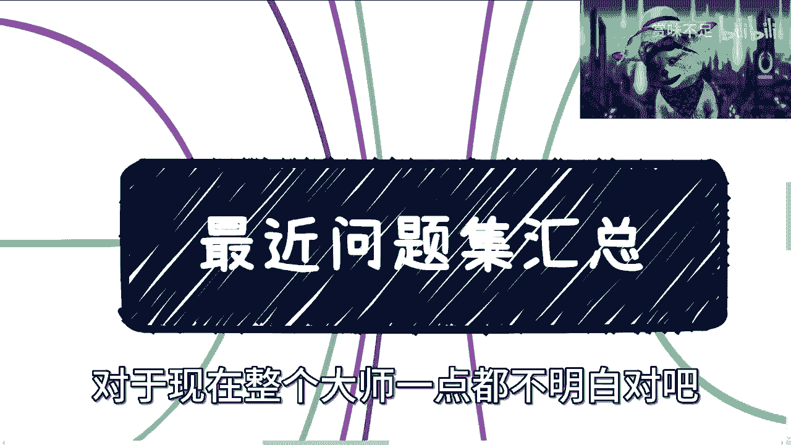
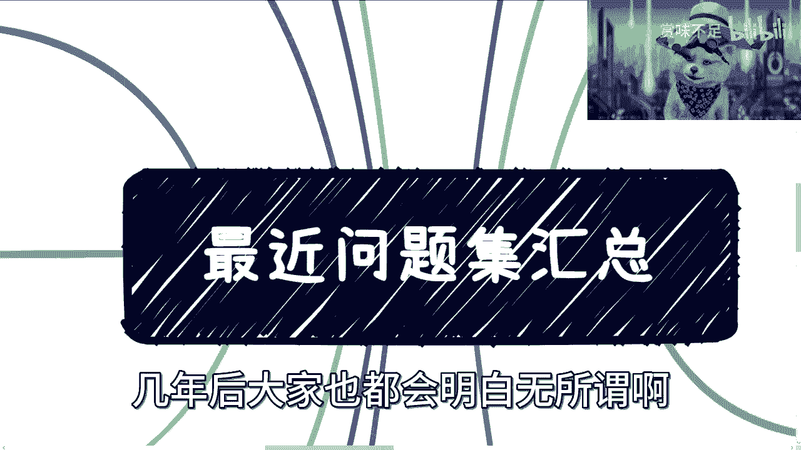
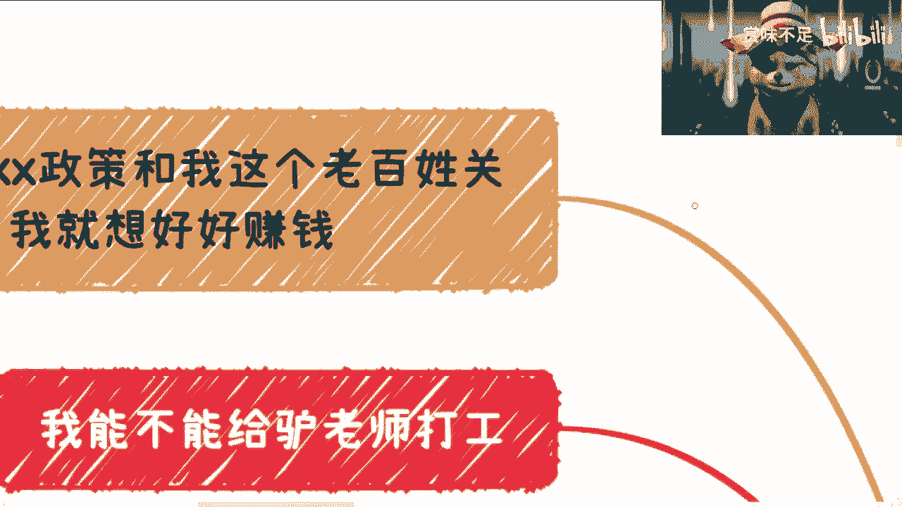
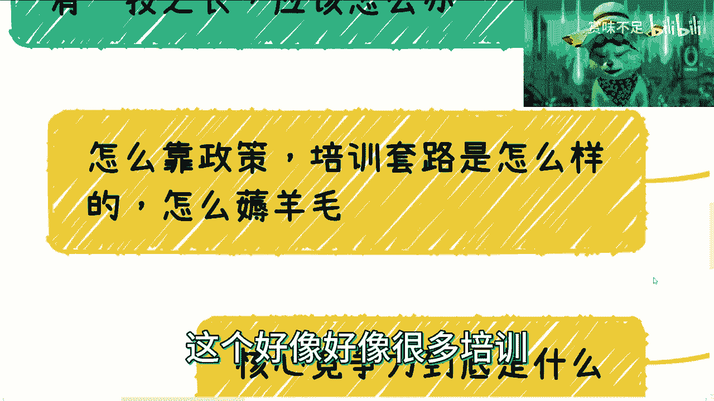
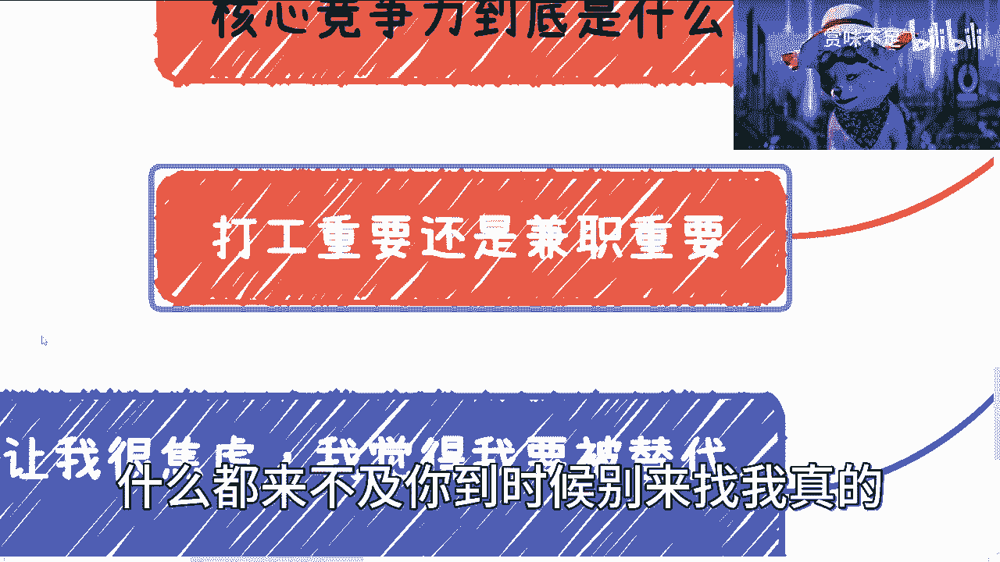

# 20230430最近问题集汇总 - P1 - 赏味不足 - BV1TP411272E

好 各位小伙伴节假日好 是吧。

我弄了个问题集，我大概看了一下，实在是无语 实在是无解。

就真的讲了这么多期，我觉得到现在为止还是有很多小伙伴，对于现在整个大事一点都不明白 对吧。

我也就放弃了，反正就这么回事，几年后大家也都会明白 无所谓，你看我弄了这么多条信 是吧。

一个个来说，能不能咱别放微信，对吧，首先我们先从 我看看。

我先从这边左边开始讲，首先有小伙伴说，他说我觉得XX政策跟我老百姓没什么关系。

我就想好好赚钱，我在这地方跟你们说的很清楚，你们要想好好赚钱，必须要去干政策，不干政策你们在未来是很难赚到钱的。

我在这边说的很清楚，别老觉得XX政策跟我们老百姓没关系，你就别挣钱了，你就好好打工，好好打你的工。

好好未来施你的业就结束了，没啥好挣钱不好挣钱的，我已经告诉你们了，未来的局势非常严峻，对吧，你们爱听不听，对吧，就这么回事，对吧，还有小伙伴说什么。

说我要去渲染焦虑的氛围，是吧，没什么好渲染的。

整个形势差到什么地步，只是你们不知道，而且只是水，包括水下现在在那边布局，什么情况你们只是不知道，没关系无所谓。

反正也不妨碍我赚钱，是吧，也无所谓，所以这第一点，第二点就是说有小伙伴说，他说我能不能给绿老师打工，我跟你们讲。

我更希望的是大家有商业合作，对吧，有钱一起赚，对吧，我可以给大家赚大头，我赚小头无所谓，因为本身我业务已经很多了。

是吧，我很期待大家有更多的商业合作，好吧，然后对，然后这个是第二点。

第三个他说，我觉得有收获，实际上并不知道怎么做，对吧，也有大概蛮多人，说的他说。

这个绿老师视频做的好，对吧，但实际上我们并不知道怎么做，我跟你们讲，没有什么你们不知道怎么做的，你们只是没有做，你知道吗。

所有说这句话的都是没有做出行动的，你知道吗，包括就是说你们来问问题来咨询，就是所有的问题，我都希望是你们有了时间。

我们大家再来交流，你没有时间，你纸上谈没有什么好交流的，对不对，我跟你讲交流一次，对吧，我出于我的礼貌，我跟你们交流，交流两次我就拉黑了，没什么好交流的。

对吧，那么浪费时间，那么吃饱了撑的，你说是不是，是吧，你有什么收获，你告诉我有什么收获，你但凡没有时间之前，你有个屁收获要买，是不是。

我也不明白了，对吧，在家打游戏不开心吗，真的，然后还有小伙伴问读书有用吗，我跟你们讲读书肯定有用。

对吧，他看你读什么书，对吧，这是第一点，第二点是你读了读进去了没有，对吧，第三点是你读了之后，你能不能给别人产生价值。

你知道吗，对吧，就像现在很多人跟我说，我要读本科读研读博，你问我读了有没有用，我怎么知道有没有用，对吧。

你读出来，你能给别人赚大钱，你能给别人带来利益，你自然而然你自己能赚钱，我觉得就有用，你读出来，对吧，不能给别人赚钱，你也不能给别人打工。

你告诉你读的有个屁用，是不是，然后还有日常跟我说，有什么好的金融的书，或者别的书看，我跟你们讲。

微信读书上面排行榜的，我觉得都可以看，但问题在于看了之后，你们要会用，不是说今天吕老师说了，对吧，然后我觉得心血来潮，我去弄了本书。

对吧，然后一看1000多页，我就看了前面10页，没有用的哥哥们，是吧，就不明白真的是，对吧。

然后我跟你们讲，还有那种二级管，是吧，二级管别来跟我讲话，别到时候吕老师说，吕老师说读书没用的，吕老师说读书有用的。

他妈只有有用跟没用吗，这么简单的吗，是吧，然后还有小伙伴说，他说我是阴界生，我家境不好，我也没有一技之长，我跟你讲。

这不是你，这不是我吗，对吧，我当时毕业时候，我就是家境不好，我也没有一技之长，我去问谁去，是吧，我跟你讲，当下整个环境，未来5~10年。

整个情况是非常不好的，我再次强调，是非常不好的，远超出你们的想象，你们爱信不信，随便你们自己看着办，是吧，然后，我跟你说。

你这种情况是什么，你这种情况，就是你先找份工作苟着，不要既要又要还要，你知道吗，你就找份工作苟着，降低自己的预期，没有怎么办。

你能怎么办呢，对吧，我跟你说，这种问题也是既要又要，我既什么没有，我也没有什么，我能怎么样，对吧，然后我就跟你们说了。

你们去降低预期，对吧，你们很多人也不愿意降低预期，说这么低的薪资，这么差的工作我不做，随便你们，你爱咋地咋地呗，是吧，真的我跟你讲。

做，真的很多时候能屈能伸，你明白吗，就是你要去明白自己能做什么，别野高手低，是吧。

然后还有人问我，他说怎么靠政策，怎么吃补贴，怎么吃福祉，培训套路怎么样的。

怎么耗羊毛，哥哥们，这个东西是你们免费能知道的吗，东西都是有价值的，是吧，你告诉我。

你免费来耗我，我作为一个资本家，我要这么被你免费耗了，我还赚啥钱，是吧，无所谓。

其实对我来讲，我的point在哪里，在于，但凡大家有资源的，可以一起赚钱，对吧，你们没有资源的，快点去积累，就那么两三年的窗口期。

对吧，我已经跟你们说得很清楚了，对吧，然后所有这些视频也都是免费的，我从来没有问你们收过一分钱，是吧，我也不知道哪来这么多人要求这么高。

对吧，而且我觉得最近是不是嫉妒我的人特别多，然后，好像很多培训机构带来的水军是吧。

我是不是影响到大家生意了，然后还有问我核心竞争力到底是什么，对吧，我跟你讲核心竞争力是什么。

核心竞争力就在于以结果导向，你是否能给别人赚到钱结束，你不要说你为你自己赚到钱，你的前提是要给别人赚到钱。

你才会给你自己赚到钱，否则你是赚不到钱的，这就是核心竞争力，你别来跟我说什么方向，什么学历，什么学什么东西不重要。

你学的再高，你能不能给别人带来钱，不能，没用，对吧，你除非跟我说你是德克诺贝尔奖，那我觉得没问题，对吧，但凡这种上不上下不下的。

对吧，都是金字塔，金字塔中下层老百姓的，你别来跟我谈有什么核心竞争力，能赚到钱就是核心竞争力，不能没有，我管你是谁，我管你什么学历。

我管你学什么东西，不重要，你们知道吗，你知道吗，你今天什么学历，你今天学什么，5年后10年后，你就跟大家一样，该失业失业结束了。

就这么回事，你知道吗，你是没有核心竞争力，因为你的可替代性太强了，你知道吗，还有什么，还有小伙伴问我，他说打工重要还是兼职重要。

我跟你讲，就当下整个经济环境往前，往后看，往后看，两个都重要，对吧，因为打工是给你做稳定收入的。

对吧，给大部分的普通人做稳定收入的，你没有你就不行，对吧，兼职为什么重要，是因为本身在未来，你的主业打工是不稳定的。

肯定是不稳定，不要说你不稳定，你的公司也不稳定，各种不稳定，你知道吗，这个是整个大局势的问题，不要来跟我老是提什么AIGPT。

这没半毛钱关系的，好吗，你知道吗，就是，不要老是拿面上的信息来判断，没有任何意义，你知道吗，然后这两个都重要。

所以说我才为什么通过这么多视频，来跟你们讲，说你们从现在就要开始积累，就要开始去做你们的兼职，别到时候再去做准备，什么都来不及了，什么都来不及。

你到时候别来找我，真的，是吧，还有什么，就有小伙伴说AI让我教育，我觉得我要被替代了，没有任何意义，AI就算没有。

你也会被替代，不是一样的道理吗，你们随便去看看数据就知道了，对吧，多少应届生，多少没找到工作的，企业倒闭多少，企业缩减多少岗位。

你们自己算算对吧，对吧，然后就算你努力工作，回头你还是会被年轻的，很多人卷死，不就这么个逻辑吗，这么简单逻辑。

你们想不明白吗，我真的也是不明白了，对吧，然后还有小伙伴说，他说我刚读书，接下来什么方面比较好。

对吧，就应届生，而不是应届生，大一大二，是吧，我跟你讲，先稳定工作，不用太去想别的。

这几年很差，差到你们没法想象，这第一点，第二点是，如果你现在正在读，那么你就尽快去接触商业，就是你除了保证，你只要保证最低底线，你能够毕业就可以了，剩下尽可能的该去做项目，做项目，该去接触商业。

该去想办法赚钱，所有该踩的坑尽早踩掉，你知道吗，别老觉得自己是个学生，自己就在学校里面，我跟你们说，最近我碰到，我接触下来所有的学校，所有的学生，最大的问题是什么，就是仅只在学校，对整个行业。

对整个大师，对整个大局毫无认知，对自己到底在这个行业里面，能不能对别人产生任何价值，毫无认知，你知道吗，然后还有很多抱有非常天真的想法，说我有理想，理想个屁，你先赚钱还理想，我也真不明白。

有可能家里有矿。

是我肤浅，是吧，然后还有，说我工作里面碰到这样那样问题，我跟你讲，这些我都不在乎，你也不用在乎，为什么呢，因为你在公司里面就是个螺丝钉，你在公司里面就是个工具人，你碰到任何问题，在你的生命时间长度里面。

你可能未来都不记得，这些事情都是一些尘埃，对你造不成任何影响，你知道吗，你去在乎它，只会去让你现在陷入到莫名其妙的情绪当中，从而浪费你的时间，对你自己和未来毫无帮助，你知道吗，就很多人一边在那边说。

我要赚钱，我要努力，然后一边在那边纠结很多鸡毛蒜皮的事情，我也不知道为什么，有什么意义呢。

毫无意义，对吧，除了生死，除了赚钱，都TM是假的，没有意义的，对不对，别来跟我讲这样那样问题。

没有用的，而且我告诉你们，所有的方法论都没有卵用，为什么，因为时代不一样了，你明白吗，我不是否定别人的总结的东西，而是说你们要明白。

现在跟以前，现在就是个转折点，以后跟以前完全不一样，然后还有什么呢，副业一般怎么规划的。

我跟你讲，这个东西跟投资是一样的，你需要多种策略并行，你别老觉得做一个副业就结束了，不够的，不稳定的，主业都不稳定，别说你副业了，所以说一般是怎么做的，你起码得有plan a plan b。

plan c plan d，然后这里面有一些是长线发展的，对吧，你投入大产出大，有些是短线的，对吧，就投入小产出小，有些是持续性的，只要投入一次持续性收入的，你得有多条线，不是说咱们就做一个什么自媒体。

做个什么东西没用的，你赚不到钱的，哥哥们，好吗，我做什么待会跟你们讲对吧，还有什么职业规划对吧，职业规划，我跟你讲职业没什么好规划的。

为什么，因为这两年往后目标就是活下来，对吧，能有一份稳定的或者相对稳定的主业的工作，能赚到一份钱，剩下尽可能的去积累自己的人脉关系，积累自己的商业逻辑，去铸造自己的互联网，去做自己的公司。

去做自己的企业，去做自己的企业，去做自己的企业，去做自己的业务，去做自己的工作，铸造自己的护城河，这就是大家应该要去做的，你知道吗，否则的话往后没有机会了，没有任何机会，我跟你们讲。

职业怎么规划没有用的，以前为什么能规划，是因为以前20年，整个的经济形势很好，互联网是上升期，或者别的行业都有基础建设，现在是什么，整个基础建设建的差不多了，你还规划什么东西，对不对，你就有一份工作。

就做就可以了，没啥好规划的，对吧，我们都不是金字塔上层的人，中下层的老百姓，我们得有自己的觉悟，你说是吧，你有空规划，你还不如多去认识点人，多去积累关系，多去想想商业怎么做，对吧，然后我给你们讲。

还有很搞笑的，还有很搞笑来说什么，来说，来说卖证书赚钱，是吧，什么卖客是吧，怎么样子，我跟你们讲，这些话我可以讲，为什么，因为我不关心这件事情，第一点，第二点是，我有我自己的很多的。

盘连NBCD EFG，对吧，而且我很清楚，他们的逻辑应该怎么去赚钱，但是你们没有必要去喷，你们去喷它有什么用呢，对吧，你们去喷它，没有任何意义，有这点时间，还不如去思考一下，人家怎么赚钱呢，对吧。

不用去判断对和错，对和错这种事情没有意义的，对吧，我只是跟你们说客观的情况，我从来不去说，这个好或这个不好，对吧，一切都是以赚钱为导向的。

就这么简单，是吧，我觉得就直白一点这件事情，对吧，然后我是做什么的，我跟你们讲，我以前做开发的，对吧。

然后这么多年，和清华大学出版社，一直是很密切的合作关系，我也给他们写了很多技术相关书，对吧，然后日常就是企业政府，像现在上海杭州。

海南苏州，对吧，南京，对吧，很多一些企业政府相关的，技术咨询培训。

高校EMBA的这种课程，我会给他们讲一讲，对吧，然后部委这边的一些培训，包括区块链这边的标准制定方之一。

对吧，然后现在主要的方向就是数字经济，咨询技术落地，对吧，然后还有我告诉你们，我只做区块链，数字经济互联网3。0，但我不参与web3，就web3跟互联网3。0是两个东西，别老是哄我一谈，但是我看好。

我对web3的整个理念跟方向，我是看好的，对吧，未来也是有可能去做的，但是要看整个行业好不好，你要说整个行业，现在全部都是一个，是一个骗过来骗过去的，那就没必要了，是吧。

然后还有什么，我办过无数场活动，对吧，小到几个人的，多到1000人的，我都是我自己办的，对吧，QCQBQG的，我都办过，对吧。

然后日常就打游戏，是吧，我跟你们讲了，反正就这么回事，所以说我再跟你们总结一下。

这个事情很简单，对吧，因为在我的认知里面，所有东西都不重要，重要的就是说。

我们怎么想办法，去了解更多的赚钱的逻辑，怎么去想办法了解更多的，拿到补贴，或者拿到更就是你付出一份努力，是产出一份钱。

产出10份钱的关系，对吧，然后你们但凡所有族处于打工状态的，比如说来问我，网安怎么样，来问我，这个测试怎么样。

来问问怎么样，在我看来没有任何意义，因为回头你们总归都会被未来的年轻人卷死，有什么区别，对不对，你来问我好不好，有什么好不好的，5年后10年后都一样，对不对。

最多大家有些人运气比较好，对吧，还能苟且主业，对吧，回头还有些人比如说运气差的，可能主业苟不住了，苟不住就是降低期望。

对吧，本来2万块钱，变成1万块钱，1万块钱变5000块钱，对吧，就这个样子，大家最终都还是会为了现实妥协的，对不对，既然为了现实妥协。

既然大家都现实一点，为什么老是装，没必要装，是吧，所以你看我跟大家讲都讲得很实在的，就这么回事，行吧。

就这么着，好吧，好了，我要去打游戏了，拜拜。

