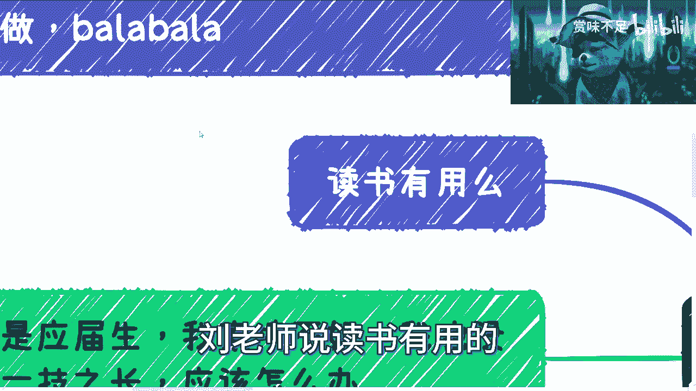
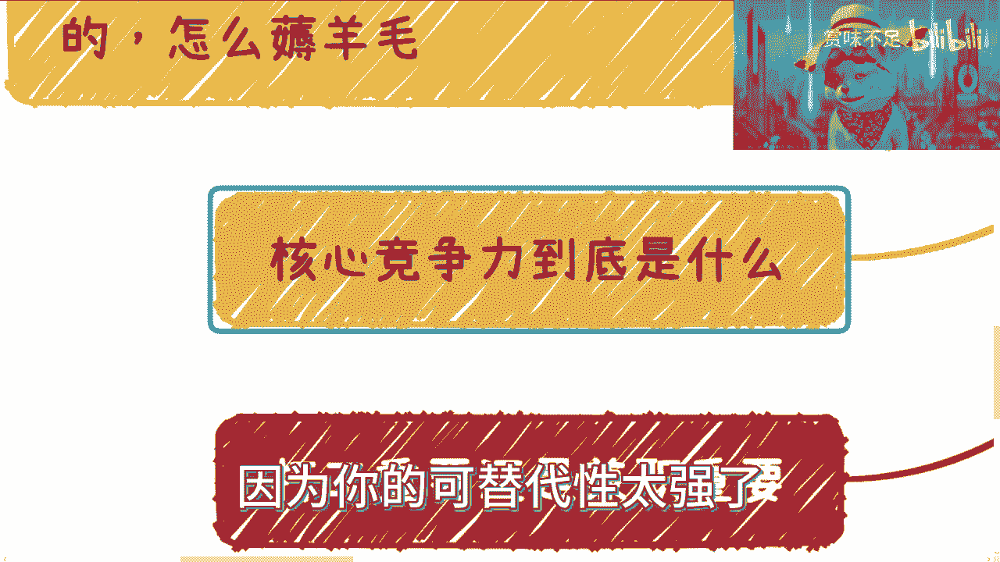
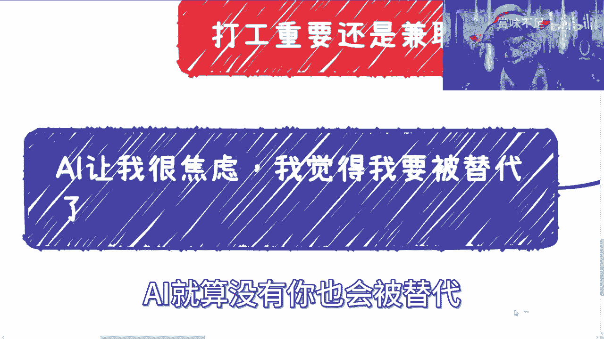
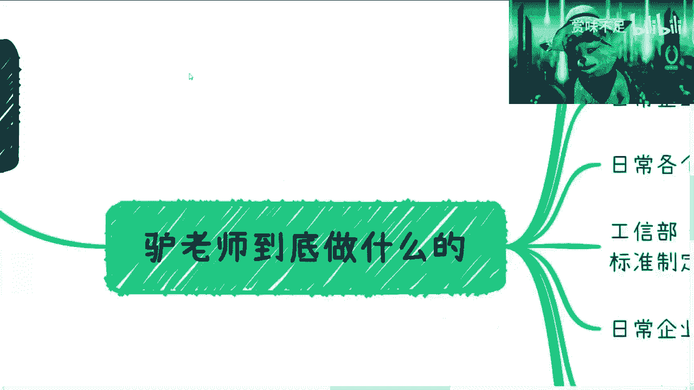
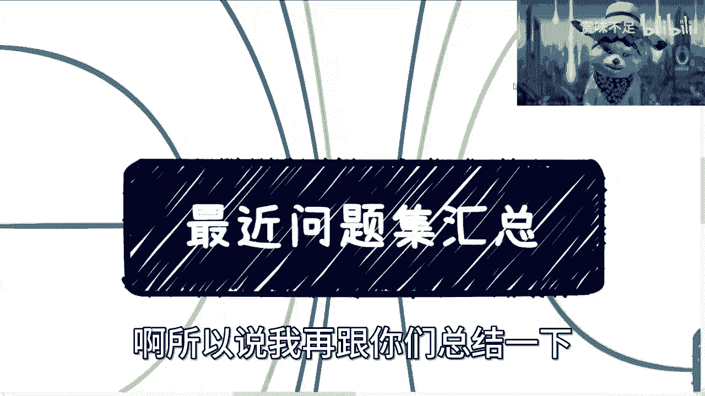
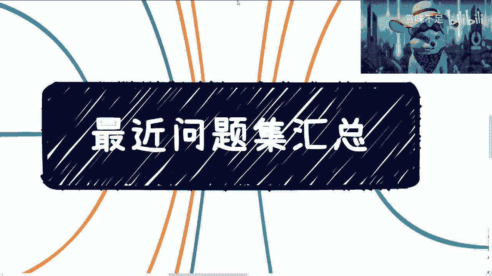
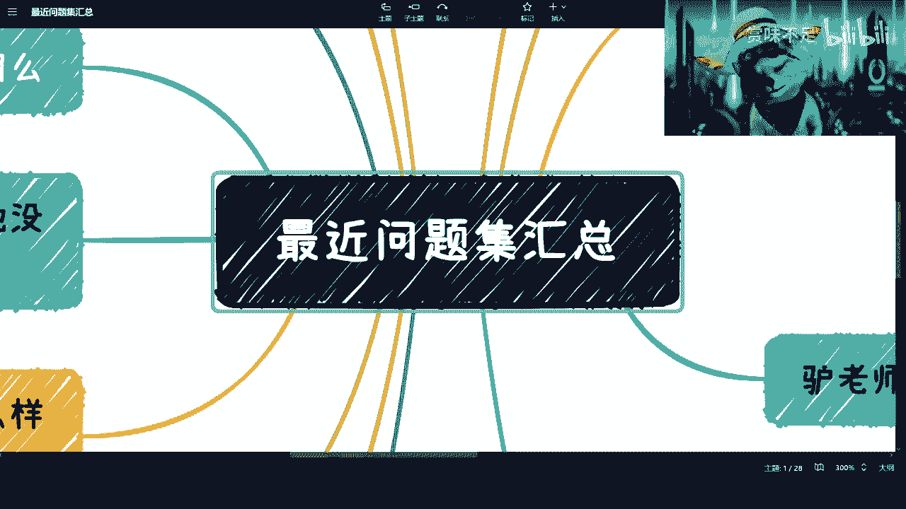

# 20230430最近问题集汇总 - P1 - 赏味不足 - BV1TP411272E

好啊，各位小伙伴这个节假日好是吧，呃我弄了个问题急啊，我大概看了一下，就是哎呀，实在是无语啊，实在是无解，就真的讲了这么多期，我觉得到现在为止，还是有很多小伙伴，对于现在整个大师一点都不明白对吧。

我也就放弃了啊，反正就这么回事吧，几年后大家也都会明白。

无所谓，你看我弄了这么多条线是吧。

一个个来说吧，哎呀能不能咱别放微信对吧。

就是首先啊我们先从我看看啊，我先从对这边左边开始讲。

首先现有小伙伴说，他说我觉得这个叉叉政策啊，跟我这个老百姓没什么关系啊，我就想好好赚钱啊，我在这地方跟你们说的很清楚啊，就是你们要想好好赚钱，必须要去干政策，不看政策，你们在未来是很难赚到钱的。

我这地方很说的很清楚啊，别老觉得叉叉政策跟我们这个老百姓没关系，那你就别挣钱了，你就好好打工，好好好打你的弓，好好未来施你的业就结束了，没啥好挣钱，不好挣钱了，我已经告诉你们了，未来的局势非常严峻对吧。

你们爱听不听对吧，就这么回事对吧，还有这还有小伙伴说什么，说这个啊，我要去渲染这个叫什么这个呃焦虑的氛围是吧，没什么好渲染的，整个形式差到什么地步，只是你们不知道哦，而且只是水，包括水下。

现在在那边布局什么情况，你们只是不知道啊，没关系，无所谓啊，反正也不妨碍我赚钱是吧，也无所谓啊，首先这第一点，第二点呢。

就是说有小伙伴说他说我能不能给朱老师打工，我跟你们讲啊，我更希望的是大家有商业合作对吧，有钱一起赚对吧，我可以给大家赚大头，我赚小头无所谓啊，因为本身我业务已经很多很多了是吧。

那你我很期待大家有更多的商业合作好吧。

然后对，然后这个是第二点，第三个呢他说啊，我觉得这个有收获，实际上并不知道怎么做对吧，就是也有大概蛮多人啊说的，他说啊这个吕老师视频做的好对吧，但实际上我们并不知道怎么做，我跟你们讲，没有什么。

你们不知道怎么做的，你们只是没有做，你知道吗，所有说这句话的都是没有做出行动的，你知道吗，包括就是说你们来问问题啊，来咨询啊，就是所有的问题我都希望是你们有了实践，我们大家再来交流，你没有实践。

你纸上谈没有什么好交流的呢，对不对，我跟你讲交流一次对吧，我出于我的礼貌，我跟你们交流，除了交流两次，我就拉黑了，没什么好交流的对吧，那么浪费时间嘛，那不吃饱了撑的吗，你说是不是是吧，你有什么收获。

你告诉我你有什么收获啊，你但凡没有时间之间，你有个屁收货，要么是不是我也不明白了对吧，在家打游戏不开心吗，啊真的啊。

然后还有小伙伴问啊，读书有用吗，我跟你们讲读书肯定有用对吧，他看你读什么书对吧，这第一点第二点是你读了读进去了没有对吧，第三点是你读了之后，你能不能给别人产生价值，你知道吗对吧，就像现在很多人跟我说。

我要读本科，读研读博，你问我读了有没有用，我怎么知道有没有用啊对吧，你你读出来你能给别人赚大钱，你能给别人带来利益，你自然而然你自己能赚钱，我觉得就有用，你读出来对吧，不能给别人赚钱。

你也不能给别人打工，那你告诉读的有个屁用，是不是啊，然后还有日常跟我说，这个有什么好的这个金融的书啊，或者别的书看，我跟你们讲，微信读书上面排行榜的，我觉得都可以看，但问题在于看了之后你们要会用啊。

不是说啊，今天这个吕老师说了对吧，然后我觉得心血来潮，我去我去弄了本书对吧，然后一看1000多页，我就看了前面十页没有用的，哥哥们是吧，就不明白，真的是，对吧，然后我跟你们讲，还有那种二极管是吧。

二极管别来跟我讲讲话哦，别到时候刘老师说陆老师说读书没用的啊，陆老师说读书有用的。

他妈只有有用有用跟没用吗，啊这么简单的吗是吧，然后还有小伙伴说啊，他说我是应届生，我家境不好，我也没有一技之长，我跟你讲。

这不是你这不是我吗，对吧，我当时毕业时候，我就是家境不好，我也没有技之长，我我我去问谁去啊是吧，我跟你讲，当下整个环境，未来五到10年整个情况是非常不好的，我再次强调是非常不好的，远超出你们的想象啊。

你们爱爱信不信随便你们，你们自己看着办是吧，然后呢，我跟你说，你这种情况是什么，你这种情况就是你先找份工作苟着，不要既要又要还要，你知道吗，就是你就找份工作苟着，降低自己的预期，没有怎么办。

你能怎么办呢，对吧，你你我跟你说，这种问题也是既要又要就是我既什么什么没有，我也没有什么什么，那我我我能怎么对吧，然后我就跟你们说了，你们就降低预期对吧，一般很多人也不愿意降低预期，说哎这么低的薪资。

这么这么差的工作，我不做，那就随便你们，你爱咋滴咋滴呗，是不是真的，我跟你讲做做真的很多时候啊，能屈能伸，你明白吗，就是你要去明白自己能做什么，别眼高手低啊是吧，啊然后还有人问我呢，他说怎么靠政策啊。

怎么怎么吃福，怎么吃补贴啊，怎么吃扶持啊，叫培训套路怎么样的，怎么薅羊毛啊，啊哥哥们，这个东西是你们免费能知道的吗，啊东西都是有价值的是吗，哦你告诉我就是你免费来薅我啊，我作为一个资本家。

我要这么被你免费薅了，那我还赚啥钱是吧，那无所谓啊。

其实对我来讲，我的point在哪里，在于但凡大家有资源的可以一起赚钱对吧，你们没有资源的，快点去积累，就那么23年的窗口期对吧。

我已经跟你们说的很清楚了对吧，然后所有这些视频也都是免费的，我从来没有问你们收过一分钱是吧，我也不知道就这哪来这么多人要求这么高对吧，而且而且我觉得最近这个啊，是不是嫉妒我的人特别多啊，然后啊。

这个好像好像很多培训机构带来的水军是吧。

我是不是影响到大家生意了啊，然后还有问我呢，核心竞争力到底是什么对吧，我跟你讲啊，核心竞争力是什么啊，核心竞争力就在于以结果导向，你是否能给别人赚到钱，结束你不要说你为你自己赚到钱。

你的前提先要给别人赚到钱，你才会给你自己赚到钱，否则你是赚不到钱的啊，这就是核心竞争力，你别来跟我说什么方向，什么学历，什么学什么东西不重要啊，你学的再高，你能不能给别人带来钱，不能没用对吧。

你除非跟我说你是德克诺贝尔奖，那我觉得没问题对吧，但凡这种上不上下不下的对吧，都是金字的，都这个金字塔中中下层老百姓能，你别再跟我谈，有什么核心竞争力，能赚到钱就是核心竞争力不能没有，我管你是谁。

我管你什么学历，我管你学什么东西不重要，你们知道吗，你知道吗啊就是你今天什么学，你今天学什么，5年后10年后你就跟大家一样，该失业，失业结束了，就这么回事，你知道吗，你是没有核心竞争力的。

因为你的可替代性太强了。

你知道吗，还有什么呢，还有小伙伴问我，他说打工重要还是坚持重要呢，我跟你讲，就当下整个经济环境往前往后看啊，往后看两个都重要对吧，因为打工是给你做稳定收入的对吧，给大部分的普通人做稳定收入的。

你没有你就你就就不行对吧，兼职为什么重要，是因为本身在未来整你的主业，打工是不稳定的，肯定是不稳定，不要说你不稳定，你的公司也不稳定，各种不稳定，你知道吗，这个是整个大局势的问题。

不要来跟我老是提什么a l l g b t啊，这他妈没半毛钱关系的好吗，你知道吗，就是不要老是拿面上的信息来判断，没有任何意义，你知道吗啊，然后这两个都重要，所以说我才为什么通过这么多视频来跟你们讲。

说，你们从现在就要开始积累，就要开始去做你们的兼职，别到时候再去做准备，什么都来不及了，什么都来不及。

你到时候别来找我，真的是吧，还有什么呢，就有小伙伴说ai让我焦虑啊，我觉得我要被替代了，没有任何意义，ai就算没有。

你也会被替代，不是一样的道理吗，你们随便去看看数据就知道了对吧，多少应届生，多少没找到工作的企业倒闭，多少企业缩减多少岗位，你们自己算算嘛，对不对对吧，然后就算你努力工作。

回头你还是会被年轻的很多人卷死，不就这么个逻辑吗，这么简单的逻辑，你们想不明白吗，我真的也是不明白了。

对吧，然后还有小伙伴说他说我刚读书啊，这个接下来什么方向比较好对吧，就应届生不是应届生，大一大二。

是吧，我跟你讲啊，先稳定工作啊，不用太去想别的，这几年很差啊，差到你们没法想象，这是第一点，第二点是如果你现在正在读啊，那么你就尽快去接触商业，就是你除了保证你只要保证最低底线，你能够毕业就可以了。

剩下尽可能的该去做项目，做项目，该去接触商业，接触商业，该去想办法想办法赚钱，所有该踩的坑尽早踩掉，你知道吗，别老觉得自己是个学生，自己就在学校里面，我跟你们说，最近我碰到我接触下来所有的学校。

所有的学生最大的问题是什么，就是仅只在学校对整个行业，对整个大师，对整个大局毫无认知，对自己到底在这个行业里面，能不能对别人产生任何价值毫无认知，你知道吗，然后还有很多抱有非常天真的想法。

说啊我有理想啊，理想个屁，先赚钱还理想，我也真不明白啊，有可能家里有矿啊。

是我肤浅了是吧，嗯然后还有呢说我工作里面碰到这样耐用问题。

我跟你讲啊，这些我都不在乎，你也不用在乎，为什么呢，因为你在公司里面就是个螺丝钉，你在公司里面就是个工具人，你碰到任何问题，在你的生命时间长度里面，你可能未来就都不记得这些事情，都是一些尘埃。

对你造不成任何影响，你知道吗，你去在乎他，只会去让你现在陷入到莫名其妙的情绪当中，从而浪费你的时间，对你自己和未来毫无帮助，你知道吗，就很多人一边在那边说啊，我要赚钱，我要我要我要努力。

然后一边在那边纠结很多鸡毛蒜皮的事情，我也不知道为什么有什么意义呢，毫无意义对吧，除了生死，除了赚钱都他妈是假的，没有意义的。

对不对，别来跟我讲这样那样的问题，没有用的，而且我告诉你们所有的方法论都没有卵用，为什么，因为时代不一样了，你明白吗啊我不是否定别人的总结的东西，而是说你们要明白啊，现在跟以前现在就是个转折点啊。

以后跟以前完全不一样哦。

然后还有什么呢，副业一般怎么规划的，我跟你讲啊，这个东西呢跟投资是一样的，你需要多种策略并行，你别老觉得做一个副业就减速了，不够的，不稳定的主业都不稳定，别说你副业了，所以说一般是怎么做的呢。

你起码得有plan a plan b plan c plan d，然后这里面呢有一些是长线发展的对吧，就是你投入投入大，产出大，有些是短线的对吧，就投入小，产出小，有些是持续性的。

只要投入一次持续性收入的，你得有多条线啊，不是说咱们就做一个做一个什么自媒体啊，做个什么东西没用的，你赚不到钱的啊，哥哥们好吗，我做什么，待会给你们讲吧，还有什么呢，直接规划对吧，直接规划，我跟你讲。

直接没什么好规划的，为什么，因为这2年往后目标就是活下来对吧，能有一份稳定的或者相对稳定的主业的工作，能赚到一份钱，剩下尽可能的去积累自己的人脉关系，积累自己的商业逻辑，去铸造自己的护城河。

这就是大家应该要去做的，你知道吗，否则的话往后没有机会了呀，没有任何机会，我跟你们讲啊，直接怎么规划没有用的，以前为什么能规划，是因为以前20年整个的经济形势很好，互联网是上升上升期。

或者别的行业都有基础建设，现在是什么，整个基础建设建的差不多了，你还规划什么东西啊，对不了，你就有一份工作就做就可以了，没啥好规划的对吧，中下层的这个老百姓，我们都有自己的这个觉悟，你说是吧。

你有这个空规划，你还不如多去积累，多多去认识点人，多去多去积累积累关系，多去想想商业怎么做对吧啊，然后我跟你们讲，还有很搞笑的呢，还有很搞笑，来说什么来说哎，来说哎呀，这个这个卖证书赚钱是吧。

这个什么麦克是吧，怎么样子，我跟你们讲这些话，我可以讲为什么，因为我不关心这件事情，gg第一点，第二点是我有我自己的很多的排列，a b c d e f g对吧，而且我很清楚他们的逻辑应该怎么去赚钱。

但是你们没有必要去喷啊，你们去喷它有什么用呢对吧，你们去喷他没有任何意义，有这点时间还不如去思考一下人家怎么赚钱呢，对吧，不用去判断对和错，对和错这种事情没有意义的对吧，我只是跟你们说，客观的情况。

我从来不去说哎这个好或这个不好对吧，一切都是以赚钱为导向的，就这么简单是吧，我觉得就就直白一点这件事情对吧，然后我是做什么的，我跟你们讲，我以前做开发的对吧，然后这么多年和清华大学。

出版社一直是很密切的合作关系，我也给他们写了很多技术相关书对吧，然后日常就是企业政府，像现在就是上海杭州，海南苏州对吧，好啊那个那个南京对吧，很多一些企业政府相关的这个技术咨询培训啊。

高校e nba的这种课程我会给他们讲一讲对吧，包括就是区块链这边的这个标准制定方，之一对吧，然后现在主要的方向就是数字经济，咨询技术入地对吧，然后还有我告诉你们，我只做区块链数字经济互联网三点。

但我不参与三，我的三啊，就wifi跟互联网三点是两个东西，别老是哄我一下啊，但是我看好我，我对web 3的整个理念跟方向我是看好的对吧，未来也是有可能去做的，但是要看整个行业好不好。

你要说整个行业现在全部都是，一个是一个是一个骗过来骗过去的，那就没必要了，是吧，然后还有什么呢，我办过无数场活动对吧，小到几个人的，多到1000人的，我都是我自己办的对吧。

q c q b q g的我都办过对吧，然后就是日常就打游戏，是吧，我跟你们讲了，反正就这么回事。

啊所以说我再跟你们总结一下。

这个事情很简单对吧，因为在我的认知里面，所有东西都不重要，重要的，就是说我们怎么想办法去了解更多的，赚钱的逻辑，怎么去想办法了解更多的，就是拿到补贴或者拿到，更就是你付出一份努力呢，是产出产出一份钱呢。

产出十份钱的关系对吧，然后你们但凡所有都处于打工状态的，比如说来问我啊，网安怎么样来问我这个测试怎么样，来问问那个怎么样，在我看来没有任何意义，因为回头你们总归都会被未来的年轻人卷死，有什么区别呢。

对不然你来问我好不好，有什么好不好的，5年后10年后都一样，对不对，就是最多就是大家有些人运气比较好对吧，还能狗狗狗些主业对吧，回头还有些人，比如说运气差的，那可能主页苟不住了，苟不住。

那就是降低期望对吧，本来2万块钱呢变成1万块钱，1万块钱变5000块钱对吧，就这个样子嘛，就大家最终都还是会为了现实妥协的嘛，对不对，那既然为了现实妥协，既然大家就是都现实一点，为什么老是装呢。

没必要装了是吧啊，所以你看我跟大家讲都讲的很实在的，就这么回事。

唉行吧，就这么着吧，好吧好了好了，我要去打游戏了啊。

