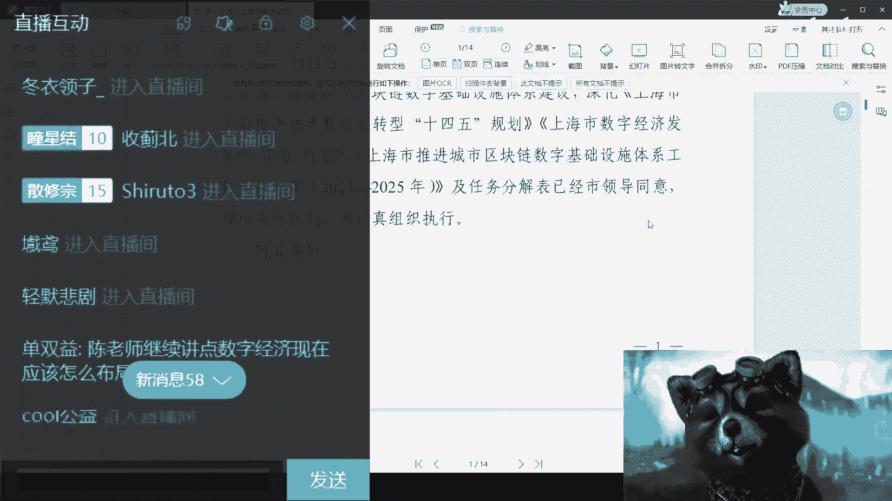
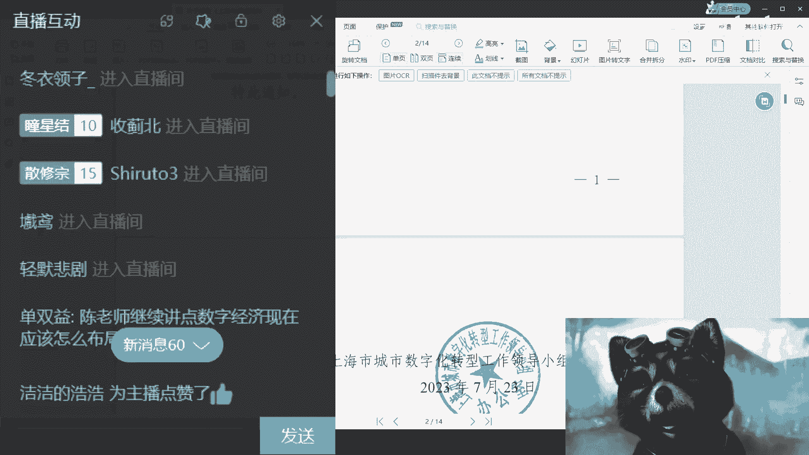
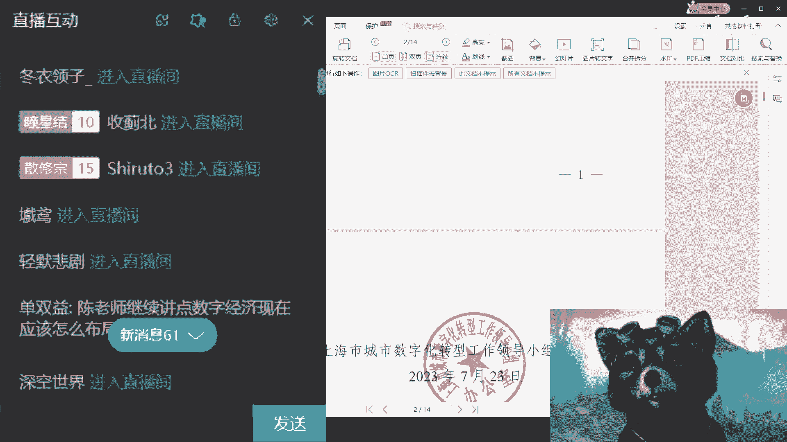
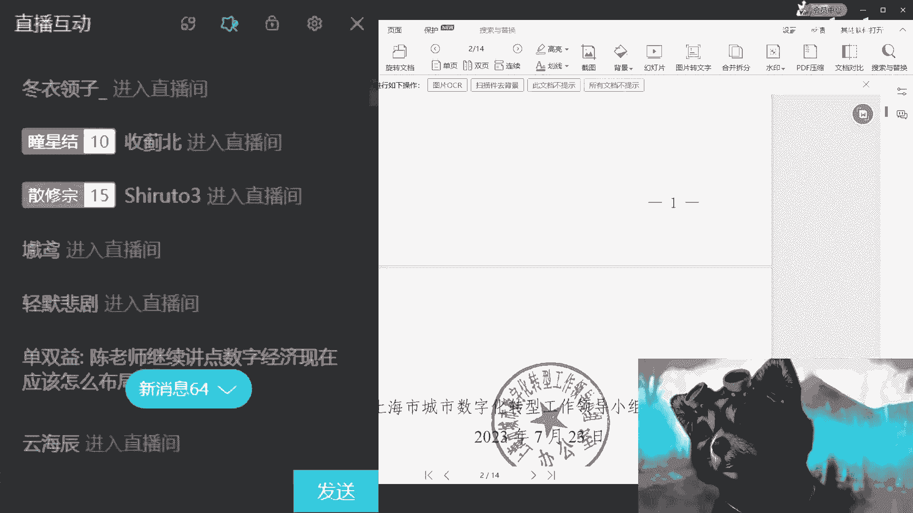

# 课程名称：职业发展与行业选择分析 🧭
## 课程编号：20230730-P1

在本节课中，我们将学习如何分析不同职业和行业的现状与前景，探讨个人职业发展的多种可能性，并提供具体的行动思路。课程内容基于一次直播问答的实录整理，涵盖了从传统行业到新兴领域的广泛话题。

---

### 概述：职业发展的核心逻辑

职业发展的核心在于理解市场需求与个人资源的匹配。赚钱与专业背景并非强关联，关键在于能否发现并抓住机会。当前经济环境下，许多传统路径面临挑战，需要更灵活地思考个人定位。

---

### 第一节：如何看待当前热门行业？

上一节我们概述了职业发展的核心，本节中我们来看看几个具体的热门领域应该如何理性看待。

**人工智能与AI大模型**：人工智能目前更多是一个**风口**。它的前景取决于你的目的。若为**短平快赚钱**，可切入下沉市场（如2-5线城市）；若追求长期价值或融资，则需谨慎，建议先确保能赚到钱。

**Web3与区块链**：该领域已高度饱和。核心逻辑在于你是否选择成为**镰刀**（即项目方、资本方）。若非如此，其他路径大多艰难。单纯学习区块链开发已很卷。

**光伏与新能源**：国内光伏行业尚存约**两年**的窗口期，但前景不确定，如同**赌博**。新能源汽车（如电动车）红利期已过大半，当前入行可能面临**中等薪资、高强度加班**的局面，已非最佳选择。

**数字经济与数据安全**：这是当前政府大力推进的方向，存在机会。但数据安全等领域非常依赖**技术背书**（如博士团队）和**政府关系**，关系上的“卷”重于技术。

---

### 第二节：传统工科与泛互联网岗位的出路

了解了新兴行业的风险与机会后，我们再来看看一些更普遍的岗位所面临的困境与转型方向。

以下是几个常见岗位的分析：

*   **软件测试**：在国内并非刚需，从资本和企业角度看价值有限，**离钱太远**。建议要么彻底转行，要么转向培训（知识变现）。
*   **前端开发**：市场已非常饱和，竞争激烈。
*   **芯片设计/软件开发**：若想突破，必须**脱离纯技术角色**。需要去了解项目的来源、谈判、报价、申报等全流程，向“上层建筑”角色转变。
*   **数据分析**：岗位本身有价值。进阶方向是结合**数据治理、清洗、上链、资产化**做成完整方案，向政府或产业园寻求项目合作。
*   **企业项目管理**：单纯打工差异不大。关键在于客户是否稳定（如国企、央企、大企业）。

---

### 第三节：体制内、教育、销售类职业的发展建议

从技术岗位转向，很多人会考虑稳定性或与人打交道的职业。本节我们来分析这类职业的特点。

**体制内（公务员、教师等）**：进入体制意味着进入一个稳定的框架。其状态可概括为：**好也好不到哪里去，坏也坏不到哪里去**。无需过度纠结发展，躺平也是一种选择。

**教育行业（大学老师、讲师等）**：
1.  副业最好与主业脱钩，避免被举报。
2.  方向包括：利用专业度进行**知识变现**（但避免与学校挂钩）、为外部咨询或培训公司做兼职讲师或课程顾问。

**销售相关**：
*   **销售天赋**的体现：一是能高效卖出产品；二是能深刻理解客户需求，甚至能推演客户及其关联方（如子女）的潜在需求。
*   **转行做销售的建议**：务必看清劳动合同，明确**底薪、提成计算方式、发放时间**以及如何界定“自己带来的项目”，这些是常见的坑。

---

### 第四节：哪些小众或细分领域有机会？

除了主流路径，市场上也存在一些特定的机会。以下是几个有潜力的方向：

*   **陪诊服务**：是**刚需**，但实操中细节风险高（如信任建立、责任界定）。
*   **相亲交友**：模式简单，可**空手套白狼**。核心是找场地、联系社群群主合作招人并分成。
*   **宠物行业**：属于**刚需**行业，可与商超或年轻人、老年人聚集的社区店合作。
*   **风水玄学**：盈利能力强，但最好有“老师”背书。线上直播需收敛，主要业务在线下。
*   **民宿经营**：关键在于算清成本、稳定客流渠道，并找到自己的优势。若无稳定上下游，很难赚钱。

---

### 第五节：给求职与转型者的通用行动指南

最后，我们提炼出一些适用于大多数人的行动原则和方法。

**行动第一步：认识人与探索项目**
想做事情，第一步是去认识人。但目的要明确：在认识人的过程中，必须同步思考**自己要做什么**。不能盲目社交。

**如何判断值得认识的人**：
在交流中，询问对方业务细节：客户画像、利润、投入、赚钱周期等。若对方回答**模棱两可**，则可能不靠谱。同时，自身也需适当包装，避免让人感觉无可交换价值。

**关于进修与读书**：
需谨慎评估投入产出比。例如，大专工作后出国进修，可能面临回国依然找不到工作的风险。关键在于明确进修的目的与最终回报。

**通用发展思路**：
1.  **积累两方面资源**：左手积累**项目**（深入了解特定领域），右手积累**资金方**（基金、政府、个人等）。
2.  **将自己产品化**：可以成为连接项目与资金的服务方，例如帮助寻找项目、润色商业计划书、对接资方。
3.  **接受“割韭菜”模式**：面向低净值人群的市场，有时不需要复杂产品，关键在于模式设计。

---

### 总结

本节课中我们一起学习了多行业现状的分析方法。核心要点包括：**理性看待风口，区分“快钱”与“长线”**；**突破单纯执行者思维，了解业务全链条**；**体制内求稳，体制外求变**；**行动比空想重要，在探索中明确方向**。职业发展没有标准答案，关键在于结合自身资源，在风险与机会中做出适合自己的选择。