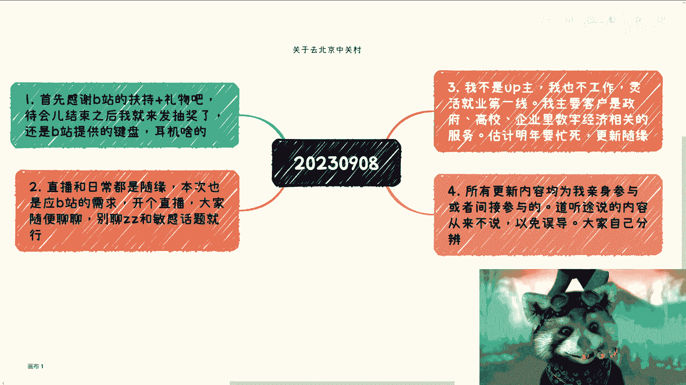

# 20230908直播录播回放 - P1 - 赏味不足 - BV1hu411w7bE

2000年2000年以后的这个盛世所迷惑了嘛，但是因为现在可能这个刹车还有这个转方向，转的比较快，所以他大部分人可能没什么感知，没有刚开有回放，我正在录这次直播啥啊，随便直播啥，每次都闲聊啊。

那啥那个北京中关村那边那个事啊，就是好像昨天跟我定时间了，好像是2月29号那几天好吧，然后确定了，反正我到时候跟你们说吧好吧，然后北京那边到时候线下大家有空吗，可以都来聚聚。

呃我可以开个那个弹幕啊，开个弹幕嗯。

这样吧。

这样吧呀啊对对对，这样这样这样啊行，就这样吧，今天啊今天一个小时吧，要一个半小时吧，哎看情况无所谓，随缘，对待会结束，我会给你们抽奖的，就B站又赞助了三波奖，待会待会抽一下呃，一个键盘，一个耳机嗯。

还有个啥啊，反正就是三个各选一个吧，我待会儿给大家选一下，什么时候什么地点不知道呀，等我确定时间跟你们讲吧，反正我要去中关村讲课，就讲讲了，剩下时间晚上大家有空吗，可以过来玩玩，对不对。

K12家教太局限，你都做家教了，你就把教育往外扩嘛，哎呀说难听点，做啥教育不是教育，没必要，现在K12对吧，刚开始对刚录刚录，可恶我不在北京，我跟你们说，明年机会多的是啊，明年单子只要多。

我肯定是全国飞的对吧，就之前就是因为疫情，还有今年对吧，这个情况，所以就一直没怎么出去，唉明年应该会好一点吧，当然我是说我，北京对，我在上海啊，上海还方便的很，等一下等一下等一下等一下就业。

想走数字经济方向，读研方向推荐啥就业啊，就业没啥好的呀，就是就业这个方向太早了，你知道吗，就是这种选择在目前人类社会过于超前啊，赚钱可以赚，就业就算，一般需要哪些抬头跑去合作，不需要抬头，那关系就好了。

要啥抬头抬头不都是虚的吗，广州会来的，明年肯定会来，今天不能聊小学生小学生，算了算了，这两天这个新闻都看不下去了，没啥好看的，不能聊不能聊，我，我要保持对吧，上次被封了三次，你敢信，夹吧，哎呦。

夹吧夹吧，说难听点，祖坟都冒烟了，经济几年后好转，我是觉得起码5年后，大一学校搞个数字经济社团，有啊，不搞肯定能搞的，你就想好你搞了干嘛，你是积累导师资源呢，还积累项目资源呢，还积累赚钱资源呢。

还是积累，比如说比如说比如说企业创业者的资源呢，还是什么，你得想好吗，搞肯定有搞头的，湖北啊，湖北估计比较少，也比较少，深圳线下有深圳可以有深圳可以有视频号，适合录取啊，视频号在我想想啊。

在今年两月份的时候就说有扶持了，你要说现在我觉得晚了吧，今年没机会，今年是真的，今年是真的闲，今年不是有没有机会的问题了，请问老师对非技术岗下青春心愿有啥建议啊，我跟你讲啊，满地都是项目，满地都是这么。

满地都是项目，满地都是机会，啥建议就是快点去跑，快点去认识，不管是企业高校这个产业园，反正是个地方去搞，别的搞不了，我跟你们讲别的老百姓怎么搞的，新能源，碳中和光伏这些东西是老百姓搞得了不了。

搞不了的啊，有回放，我录了计算机，嗷嗷香哈哈，这不是张雪峰说的吗，行业展会一般哪些找啊，行业展会吗，活动型互动吧，叫什么会哥啊，公众号就各种各种本地公众号，唉反正就多来杭州，我经常去，有录屏。

搞数字经济需要学什么知识啊，哎呀我跟你们讲啊，学什么知识不重要，你要反推，你要先去市场上看，就是人家要什么，人家为什么东西会买单，你再去学什么，你说学什么有用了没有用的呀，对不啦。

你你比如说我给中关村讲课对吧，那我总不可能跟中文中说，我的，我有什么东西，但当然不是了，一定是别人跟我说他要什么东西，那我就说嗯好，我帮你讲，对不对，哎呀技术就别看了，技术没有前途的，技术做的再好。

不还是工具人吗，DBADBDBA也是老东西了，DBA这我入行的时候就有DBA了，这这现在都多少年了，现在你想想看，这么多年，我从互联网转到移动互联网，移动互联网转到区块链，区块链转到数字经济。

我都四个轮回了，那DBA还DBA还是DBA，对吧，我这边啊我这边啊，数字经济区块链元宇宙啊，叫什么数字人民币啊，什么数字经济赋能产业啊，反正我就看甲方吧，甲方要啥能讲啥啊，这个叫什么科技金融，我也讲。

电子商务也讲啊，数字科技，web3DESSERALIZEDDEFI啊，有啥呀，苏州啊，苏州可以的呀，苏州苏州好，苏州政府很有钱，而且苏州政府做事情很有规划，适合什么样的啊，你可以搞那个呀。

搞企业家培训私董会什么什么，比如说什么工业互联网沙龙都可以搞，纺织服装啊，这个这个恕我实在觉得好像搭不上边，资产过亿的老板平时聊啥吃喝玩乐啊，简单的很，哪儿好吃哪儿好喝，哪好玩啊，晚上去哪对吧。

通宵干嘛啊，这个黄浦江上游轮有几艘啊，晚上干嘛怎么包啊，我说包邮轮的宝啊，唉呀，别来杭州出苏州，网络攻防好呀，网络攻防你要看怎么赚钱啊，你要是单纯做网络攻防很难赚钱，你要跟对吧啊，ABCD叉叉部门绑定。

那好赚钱，国内游戏行业别看了这个事情，每次都有人问你的游戏行业都不分级对吧，你都都版版号嘛，现了发发了线，你能搞啥样，就真那样，我说的哈哈，产业园产业园简单，你你你哪个城市的啊，google一下呃。

有哪几个产业什么，比如说大数据产业园，数字经济产业园，金融产业园，这些产业园都有对外招商引资的，招商引资都是这个对外公开的，这个叫什么就销售，还有商务的这个微信直接加就好了，这么简单简单的很，分分钟。

好我我，我以为你要给我上舰长，原来是挣挣了钱给我上舰长随缘随缘，无所谓，我说难听点，你们上个舰长还要被B站扣掉这么多钱，何必呢，对不对，玩具行业怎么样可以的呀，那成人玩具最好刚洗。

事业群的失业前的窗口是什么，意思是吧，就是在失业前大家还有的机会啊，你失业后还搞个屁啊，对吧啦，这个当然是失业前想办法了对吧，大家聊啊，大家搞资源，那失业化还搞不搞毛啊，真的是啊。

我们能不能有点前瞻性啊，没有啊，并不是只有跟数字媒体专业才能当上兵啊，就是其实很多都能搭边，就只不过就是说那个服装实在是差的有点远了，这一轮就是啊怎么说呢，叫什么，我们不是说好不谈这个问题嘛，对不对。

这一轮就是这一轮就是跟我们没什么关系啊，大家该赚钱赚钱，该想办法抓紧挣钱，抓紧挣钱，跟我们有什么蛋关系啊，今天没主题啊，天天瞎扯啊，对不对，承认我就绷不住了，捡垃圾是不是稳得很，哎我跟你讲。

捡垃圾要分圈子，也得分level啊，也得分关系，你说稳不稳得很，得要看关系啊，有录播有录播，不是说创业项目风险很大，社会风险很大呀，所以没让大家创业呀，所有创业都被都被我制止，而且本来我就不觉得就是有。

能有多少人能有这种创业的idea对吧，或者说你能找到几个冤大头给你投钱，你找不到冤大头投钱就别创，说不定再加加教育，好的呀好的呀，好的很，培训费，考前辅导啊，咳咳，国家补贴啊，什么人才引进，都他妈是钱。

哎呀半导体半导体集成电路，温水煮青蛙，我就跟你们讲，就温水煮青蛙，就这几个字啊，卷吗也卷的，毕竟外面人想进去，里面人想在里面躺着对吧，企业目又想赚钱，对不对，短视频后期工作还有啥前途，没啥前途。

卷成卷成狗了，血都卷不出来，送外卖不如进场这个实力，这个我觉得没毛病的，唉其实方法很多啦，又不是只有上班跟送外卖对吧，网络安全做C端市场有啥思路啊，网络安全做C端市场有啥思路啊，C端又不用网络安全。

C端在乎网络安全吗，C端根本就不在乎网络安全，C端连安全都不在乎，不能再往下讲了是吧，又要疯了，AIGCRAIGC没什么好讲的呀，AIGC风口都过了呀，AIGC就是个饼呀，笑死了。

哼就你们但凡了解历史的，你们去看看AI到L阿尔法go对吧，到AIGC，这每次都是个饼啊，这早就过了，储能我跟你们这么说啊，光光伏储能对吧，其他的你行业怎么样，我跟你们这么说。

让要让子弹飞一会儿得要看一两年后，现在看不出来的，现在整个主体全部是国央企垄断的，也不叫垄断嘛，就是全部以国央企为主来组成的，你说这东西怎么样，谁能说得准啊对吧，我跟你讲一个行业怎么样。

他得看能不能中小型企业能不能赚钱对吧，到C端到整个下沉市场能不能赚钱，你现在全部集中在这个国央企手上，你说这行业怎么样，没人知道的，你要让子弹飞一会儿，对不了，现在现在说好和不好都没用的，都是假的。

哎呀晚安有单的，晚安怎么没单啦，晚安单多的是，只不过关系不到位，哎呀，我不创业的，我从来不创业的啊，或者这么理解吧，我创业就没成功过啊，这垃圾，自动驾驶，看看你做啥，我接触到的做自动驾驶算法的。

做技术的，反正就是找工作还是可以找的，但你说未来怎么样，不知道你知道吗，这东西怎么说啊，没法说，而且而且卷成卷成狗妈来找我的都是博士，你想想看，我的博士都觉得卷，怎么定义创建很简单。

我跟你讲什么叫创业对吧，就是你付出精力了，付出时间了，付出钱了，你赚不到钱，我觉得你需要创业对吧啊，你要是没付出金额，没有付出实际的钱，你投入产出也是真的，而且是四两拨千金的。

比如说投入投入一个小时赚100万对吧，那我觉得这个叫什么，这个叫做商业啊对吧，这个叫赚钱，这不叫创业啊，创业大部分都是亏的，什么叫创业，投资产证明为负数，反正亏的不是你就是投资人。

反正现在投资人没这么傻了，因为投资人手上也没钱，自己开店铺啊，十几都他妈的唉他妈失尸横遍野，开啥店铺呀，还有这种的恒通行的招商引资，政府A想要B的一点儿产业落地到本地，过几天有个会议区，BD怎么做。

什么意思啊，政府A想要B的一点资产，过几天有个会议去BD，那画饼，你就招商引资嘛，对不对，那招商引资很简单啊，就是招商引资，招商引资对吧，那有哪些政策，有哪些政策有什么前提，是免税还是免免。

地方还是送地方送土地对吧，还是送楼还是怎么样子，你你把所有东西全部列出来啊，就是对对方好的，对自己好的，对未来好的对吧，饼画好好嗯，接下来看命啊，这什么这个钱是给我的吗，算了不重要，无所谓，关系不大。

真不能搞啊，有啥不能搞啊，哎哟搞得多了去了，不是我删的啊，什么时候开始创业比较合适，我觉得从现在往后看都不合适，因为没有这个土壤，也没这个政策扶持对吧，这东西我就不能再往下讲了。

反正就是已经没有天时地利人和了，你就别去想这个事了啊，你要是有业务或者有关系去打完关系，有业务挣钱就挣钱，别去想他创不创业这种事情，我们作为老百姓没这个能力，AI更新，AI跟啥都结合不了，当然可以结合。

你要画饼，你要去骗资本，你要去骗政策，没问题啊，你别别别别别想什么，结合了可以啊，我跟你讲结合最简单的是什么呢，我参加我当时AIGC火的时候去参加活动，现场，他妈的100个人里面有起码30个人过来。

是卖芯片的，卖芯片不是不是卖A800的，还是还是卖那个不是卖不是卖芯片的啊，哎呀看看哦，工业互联网，工业互联网也老了，工业互联网你要入可以啊，要入的话一样的嘛，工业信息化部那个政策上面去看。

有哪些工业互联网相关的东西，你可以做对吧，你要是单纯的打工，我觉得其实没啥区别，考研自习室是个什么东西啊，对对对，GPU对，是我说错了哈哈，真的我给你们现场都他妈是卖卡的，哪他妈来做产品的，根本就没有。

我他妈当时去参加活动，我都懵了，智能制造，智能制造，你想想看智能制造多少年了，你要看做什么，你知道吗，就是你我给你打个比方，比如说前两年前前两年的那个穿戴对吧，前两年的数字孪生，前两年的叫什么。

就是就是比如说工业医疗这些，你要但凡有关系做项目，这没问题，但是你说智能制造本身怎么样，那还是温水煮青蛙，护理行业，互联网上有行业，护理行业都缺人的，你知道吧，这没毛病的嗯，但是苦啊对吧，而且也卷了嗯。

这个就看你们自己怎么看了，经济好转的动力在哪里，动力在于有没有经这么说吧，动力在于有没有增量市场，就是我还是那句话，增量市场好不好并不重要，是不是真的也不重要，是不是有真真的增量。

是不是有增量市场能够让新的钱流进来，同时让老的钱能够滚起来，因为现在是什么，现在是经济本身，一方面没有增量市场，另外一方面是钱不流通，也不是不流通不流动，你知道吗，你整个东西不流动，它就不产生价值。

他国学直播啊，搞不了呃，我觉得应该搞不了直播，现在管的很严的，我靠，感谢老老爷爷小姐姐，哎呀不用补刀，那些没什么价值的哦，医疗陪诊，我跟你讲，医疗陪诊对的，医疗陪诊绝对是个刚需，没毛病的，你知道吗。

但是医疗陪诊这东西里面比较复杂，就是嗯就是用户的可信，你怎么让用户觉得安全，怎么让陪诊觉得安全，怎么让医院觉得安全，你知道吗，就当这当中细节很多，你单纯说医院医疗陪诊这个是个刚需，没毛病。

这个东西我也有朋友在创业的啊，我跟他们还讨论个解决方案，还说过用ARVR，用什么区块链都想过的，但是问题在于细节解决不了，你知道吗，哎呀养老，这不是老百姓能切的，就别去看了，对啊，你养老不好做啊。

养老哪这么好做啊，养老我跟你讲，前两年做的都是那个养老的护理培训，这他妈都是赚钱的，你单纯做养老不好做，这哪好做，啊乡村养老是不是等于做慈善，并不是我跟你这么讲啊。

乡村你像去年年底开始有一波乡村振兴对吧，你做乡村振兴，单纯做乡村振兴叫做做慈善，如果你做乡村振兴，懂得如何拿乡村振兴的对吧，或者政府基金，哎，那么这就不叫做慈善，这叫挣钱，普通人能切就会展吗，不是啊。

普通人能接很多东西，普通人能切的所有的业务与业务之间，比如说我举个例子，比如说呃中国有很多明年开始有很多的高校，政府企业啊，个人都要都要开始这个落地，什么职业教育，落地医疗啊，生物医疗对吧。

落地什么什么科技金融对吧，那你可以帮他们找供应商对吧，那普通人普通人能做的多了，我还是想问问钱去哪儿来，钱去哪儿了，钱去哪了，钱去哪了对吧，这能说吗，不能说，哎呀这不重要，你知道吗。

你只要知道我们没挣到钱不就好了吗，你管他去哪了，对不对，音乐教学啊，没办法，我跟你讲，我看出来了，音乐教学现在最赚钱的不就还是K12吗，就K12这边拼拼存量，流量没了呀，这东西卷的没有什么。

从融资角度来讲，这就没有想象空间，你知道吧，嗯嗯嗯诶我看到一个一个东西，等一下啊，这个对这个对这个可以的啊，低龄留学可以的，低龄留学可以的，但低龄留学只能说不，这只能说不是那么的卷啊。

只能说不是那么的强，而且看你关系是什么啊，这个可以做这个可以做，智博会啊有啥影响啊，哎呀能有啥影响呀，这种会其实说白了都是背后的商业，商业运作，要么就是呃投融资，要么就是拿政府补贴，要么就是啊对接资源。

这没了呀，你这本身没什么很大影响的呀，哎我跟你讲啊，钱那一部分去了有钱人的手里，这没毛病的啊，还有一部分呢就70%去了有钱人手里，30%呢去了不要脸的人手里啊，就这么简单啊，这个时尚的人反正也赚不到钱。

跨境电商唉西也是信阳中的夕阳了，英语我出过一期，你去看英语的那个那个内容，哪种会是我们应该参加的，哎呀你要这么想啊，你要参加什么会对吧，前提是你要想好你干嘛对吧，你比如说你比如说我做学校生意。

那我去参加什么会呢，我就会去参加什么什么，比如说前两天，前两个月在广州这边举办的什么高校联盟，对不对，你你得想好你干嘛，你得想好你赚什么钱对吧，你再去参加什么会是吧，烟花爆竹啊，烟花爆竹这我真不知道了。

反正我只知道管制，反正我在上海就很久没听到烟花爆竹，就这么回事，拼多多最近数据好好啊，哼拼多多的数据好越好，越他妈可悲，我跟你们讲，妈的回头他妈拼多多就来找我操，朝阳啊，各地方政府今年下半年出的政策。

里面都是朝阳呀，怎么没有朝阳，都是朝阳，但啊干就完了，晚安教培啊，我就问你一点网安教培可以，那晚安教培人家来培训，付你这个钱，人家出来吃哪，对不对，哎，这行业本身就业都不咋地，老龄化能不能搞殡葬。

哎呀我跟你们讲，殡葬医疗，老老龄养老的不是老，不是您不是老百姓能做的，你管他好不好呢，搞得好像我们都想做一样啊，不是搞得我们想做就能做一样，医药行业啊，我觉得没有，我说实话我觉得没有。

就是该分的都分光了，不熟悉行业怎么切，我跟你讲啊，赚钱这件事情跟行业没有关系，你知道吗，就是无论什么行业，它的商业逻辑背后抽象出来的商业逻辑，其实是差不多的，没什么很大差别的，你知道吧，你要了解的是。

先自己到底熟适合哪些叫什么商业模式，然后你再到行业里面去了解一些细节，就比如说认识一些创业者啊，认识找一些投资方啊，你再去了解一些细节，你就知道怎么切了，你不知道怎么切，是因为你不知道这个整个社会上。

整个大面积的这个行，这个各行各业当中，它的背后的逻辑是什么，其实本质上没什么很大差别的，新能源，我说了，新能源看两年吧，这两年不能说，不知道好还是不好，没人能断言，两年后再说吧，哎呀我看看啊对啊。

殡葬不好做，真不好做，新能源好像还行啊，哪里看得出还行啊，这一点都没看出来还行啊，那电动车全他妈靠补贴，剩下全他妈国企央企在做，那他妈看得出行啊，我真的一点都没看出来行哎，行屁啊，的电动车都靠补贴。

都他妈打肿脸充充胖子，到最后不还是老百姓买单吗，你妈真搞笑了，商业模式没得选啊，真没得选，你要你要做就靠实践去学习，没也没得选别的东西，你要去读些ENBA对吧，读些什么东西也可以。

但学的都是一些有一些老的，对不对，都是一些就说白了没有什么可实操性，无人驾驶啊哈哈，无人驾驶打打概念就好了，就那样，哎呀废水这事就不去谈了啊，这事不是我们能谈的啊，芯片行业有的做吗，有的做啊。

但是我反正我认为啊我的观点啊，就是经济好，上行的20年也没见到有多大的进展，现在这情况往后我就更不指望有啥进展啊，就这么回事啊，我是从哪里获取信息的，我其实在视频里面说过啊，第一我跟你讲。

我就我只会从四个地方获取，一创业者，二投资方，三公务员，四叫什么，就是相关的从业人员没了，就这四方啊，我哪天我哪天非常迷茫，然后我不知道信息是什么时候，我就会去找这里面四个方向里面各学两个人啊。

我就请他们吃个饭，我大概就知道了，怎么在网上查公司产品跟主营业务啊，这起茶茶茶茶那个天眼查都有的呀，这好查的呀，想升职想跳槽怎么弄啊，看命我跟你讲很简单的，现在往后整个供需比已经不是不平衡的问题了。

供需比供需比是反比啊，你要说你想升职想跳槽，我跟你讲，看命啊，就看命吧啊因为你想嘛，你要升职要跳槽，你主动权全部在对方手上，在你领导手上，在对方对方企业hr手上，你又没主动权，那不就看命吗，对不对。

买张彩票看看是中彩票快还是还是涨薪快，怎么到是手串都来了，嗯第一次没关系，招商引资要不要分润，我想想啊，你这句话的意思啊，第一次没关系，招商引资要不要分润啊呀呃你可以提嗯，但是你一定要合规。

就是比如说呃怎么给，是不是该走正规流程，是不是该交税，是不是该怎么样子对吧，就是说这个东西，比如说是你私下给还是包在原本的利润里，还是怎么样的，你要跟他说清楚，或者说你要给出一个很好的方案啊。

他当然他接不接受是他的事情，但你你你要提啊，当然你提出来让他觉得是安全的，你别提出来一个solution，让他觉得我的，你这个人这个这个提出来的方案非常的有风险，那我很有可能一开始就不合作了，看看啊。

我还没看，但他们也有小伙伴跟我说要看哎，但是我知道我会看的啊，本质上还是比较真实嘛，就是我来上海当电池，欢迎欢迎，哎呀多少粉，随缘吧，随缘吧，我跟你讲，数字农业可以搞的，可以搞的，你可找对地方啊。

找找对项目申报可以搞的，只不过机会没那么多，可以搞可以搞可以搞，找地方撸羊毛，对的呀，是的呀，没毛病呀，我说不好听点，大家作为普通人还想怎么赚钱，卧槽能撸羊毛，你知道这羊毛多少多吗。

啊他妈的一年撸下来几千万，我都见到过，这他妈的能撸的是能力啊，别老看不起这个做拉皮条的，AI打螺丝是个啥样哦，你是说AI加机械臂吗那种吗，那要看谁买单，怎么就开始摆酒了，数据分析，数据分析可以搞可以搞。

但是单纯搞没有用，你要用数据，数据分析，就是你要用数字经济套在数据数据分析外面，然后告诉别人啊，我的这个数据分析啊多么牛逼啊，怎么促进整个数字经济的增长对吧，你只要这个故事讲的圆啊，那就可以牛逼。

哎一线城市的成熟项目往相声上搞，哎这个你你你多了，这个比如说一线城市的什么，比如说啊一线城市的什么农业的项目啊，医疗医疗项目啊，对吧，呃这什么元宇宙答案，大数据的，你就找你先去认识公司啊。

有很多公司都申报过项目的啊，你就问他们，你们以前有哪些跟地方政府，跟地方什么科委是吧，经信委对吧，合作的这种项目问他们要啊，对不对，你先签个保密协议，然后问他们要要了之后往下沉市场打。

就是说白了就像比如说上海这边对吧，打的是呃文旅厅对吧，打的是大数据局，那你往下也是打文旅大数据局一样的，对不对，只不过对吧，就这个意思啊，说句可视化哎说句可视化呢，哎那那已经是不知道啥时候的事。

78年前就有数据可视化，新教师怎么在职业学校摆烂生存，卧槽嗯，这摆烂还不好摆烂嘛，啊摆烂方式多了对吧嗯，职业学校很赚钱的，想办法赚钱，应届生啥都不懂怎么办，我跟你讲，应届生啥都不懂，那要你要自我反思啊。

我们以前见到过什么很多什么大一大二的，我的出来气场镇压全场，你知道吗，就是现场那种三四十岁的声都不敢出的，你们要向他们学习，无人机啊，不懂无人机真不懂，我感觉无人机风口都不知道出来过了多少次。

你你就就最多就政府这种演示采购采购可以，别的不行吧，我家旁边这无人机电都倒光了，卧槽，卧槽我觉得你们真的，我跟你们讲啊，中国要赚钱啊，职校绩效很赚钱的啊，你别他看不起直销绩效啊。

卧槽直销绩效是巨有钱的啊，越往上越没钱，我跟你们讲啊，对的，只要不被开除，随便怎么摆就行，是的，没毛病没毛病，对无人机主要是没有太大需求，你就是包在一些项目里面，如果能好好要经费，我觉得没问题对吧。

你像什么智能农业啊这种东西啊，你撒撒农药啊，那我觉得问题不大嘛，但但这件事情就我知道好多年前的事情了，好多年前项目申报就写过这玩意儿了，这都2023了，马上到2024了，没没啥前途，没啥清楚。

网络安全大厂方向怎么样，网络安全大厂该钻的坑都占完了，该做的东西也都做完了，你说能怎么样，当个螺丝钉蛮好的，对不对，我跟你讲，现在所有大厂都一样的，就该发展的0~1，0~60都发展好了。

现在进去就没什么东西，你知道吗，你既得不到0~1的成长成长，你也得不到0~6岁的成长，你最多进去就是看到某个细节，然后套了个光环，然后可以跟别人炫耀一下，没了呀对吧，过两年被优化掉，结束了呀。

这大部分人的归属呀，职校技校是凡人能搞的吗，能真能怎么不能啊，我的这么多搞笑的，有啥不能啊，只要你胆子大，只要你不要脸啊，有啥不能搞，现在去当老师，以后会不会失业，你要是编制内的体制内的话。

我觉得应该还行吧，还行吧还行吧，只能说卷一点唉，只能说卷一点，有编就别接私活了啊，有边别接私活了，你第二天被举报了，你可能这边都没了，合并了两条命，少一条命，你说是吧，企业合规的业务有市场吗。

有啊看你和什么鬼，哪方面合规，嘿嘿嘿，很多了呀，很多了，真的，你看今年去年开始，中小型企业都在出海，对不了，那明明显这一年半或者这半年，出海的合规就很火对吧，那当然出海干什么对吧，哪方面合规。

是数据审计对吧，还是说是出海的手续还是怎么样子，这个你要细分的呀，看看啊，有编还能做自媒体啊，能有编，有啥不能做自媒体的，哎呀我跟你讲这个东西倒没什么，但是就是说你要是做了对吧。

这个明天第二天如果有人举报你，那这个事情就烦了，他但凡没人举报你，这个东西就睁一只眼闭一只眼的，玄学这块，玄学这块永远都有发展前途，我就告诉你，你无论经济好还是经济不好，都有发展前途。

cs读研短短见子有前途吗，嗯你还不如cs读完研呃，cs读完研之后去搞点知识变现，搞点什么互联网嗯，偏偏产业的什么赋能还好一点呢，黄金回收啊，看迟到吧，看迟到吧，做黄金生意蛮多的，反正但是我我不做。

我不会啊，我我不做这种不会的东西，而且我觉得这个来钱不快，协会商会怎么拉关系啊，直接去协会商会在中国存在的意义啊，就是对接企业就上街，政府下接企业，你知道吧，你就伪包装成你是个创业者，就直接去。

你一来一回生二回熟嘛，公务员会开放35万，不知道那谁晓得我做的录播，我做录播啊，我做录播问题不大，玄学当时不要装，你装不来的呀，你也没这个没这个外貌，哎出去请吧，哎呀多了去了，国产化替代有前途啊。

国产化国产化国产化替代，我跟你讲，今天我还跟人家聊过这个问题，就是就是你去看看历史对吧，第一我肯定不敢说没有前途，对不对，但是这个前途到底花多少时间，你自己评估嘛，对不对，他耗得起，你耗得起来。

别的我不说对吧，麒麟你看看麒麟推了多久啊，麒麟推了多久，花了多久多少力气，现在啊嗯啊，实体行业啊，我说实话呃，诶有的呀那个呀前年前年到去年充电桩呀，有的呀，电动车呀，有的呀怎么没有了呃。

降维那个那个叫什么降维消费的咖啡，那些都是的，只不过那个风口过去了呀，你知道吗，就那个风口很快的就是除了单独的几家，或者除了各地方省市区有一些扶持的，剩下你再去政府就不给钱了。

哎我这些东西我们都跟政府就聊过的，政府就是不给钱，唉运营跟产品啊大差不差，没啥区别，现在咨询要等多久啊，下周看你们吧，因为大部分人白天没空，我他妈白天我他妈闲成狗啊，晚上我忙成狗，真的。

普通人怎么躺平了躺平了躺平了，简单就每天对吧，吃饱了睡，睡饱了吃哎呀，就这么着吧，还能咋地咋在那咋咋地呢，我不是说了吗，两极分化你知道吗，就是就是该该播的，这两年就就该豁出去了，这两年就该活了。

你知道吧，不豁的就躺平结束了，别多想，录播了录播了，我录了我录了，明年忙的话有啊就看怎么排嘛，唉明年我感觉真的要他们忙成狗，啊资产啊，资产那东西我跟你讲，那深交所，上交所，数交所啊，文交所啊，对不啦。

卧槽，这里面项目不要太多，现在都在搞资产，都在搞数字资产，对了上海还有书商协会，操老牛逼了，哼不要，下周出装，学会又来找我，我的慌了，经济会继续变差吗，会啊我敢打保票，我这句话就扔在这会。

大川电器啥也不会怎么稳，那你说怎么问啊，你把前面几个字去掉，啥也不会也稳不了啊，你说是不是，几点结束，九点吧，我我就完成一下B站给我的任务，网约车租赁啊，这个问题怎么感觉上次直播就有人问过了。

哎呀这种东西蛋糕都切的差不多了，除非你能找到一个小乡村对吧，然后又供需上面都有需求，然后又没人做，那可以啊，对不，大招可以转行，到时可还行啊啊一切都是一切的镜头，就是玄学，经济变差。

现在是公务员是不是更好的选择，那就看你本事了呀，对不啦，当然是赚钱就是最好的选择了啊，什么时候抽奖啊，待会结束结束之后吧，B站当然会给任务了，B站你以为B站给这个礼物白给的啊。

这个我我我不得时不时的跪舔一下人家是不是，上海现在就业形势好不好不好啊，哪个地方都都不好都不好，刘老师白天醒的话，直播打游戏，我我白天也就剩下打游戏了，我跟你讲，外贸风口是不是过了，是的是的是的。

怎么咨询啊，私信我咨询呗，就总结好啊，大家总结好自己的背景，总结好自己要问什么问题对吧，或者说你们觉得你们想要合作数字经济的，想怎么合作，你们跟我讲对吧，然后或者说你们想要知道，就是我这么说吧。

我很难对你们的工作造成什么很好的帮助，因为工作在在我看来，未来大家都是他妈的不稳定的，没卵用啊，我只能跟你们讲的是社会的上面，可能你们不知道的怎么赚钱的，很多的模式，或者说冰山一角啊。

剩下的就看你们造化了，在去活动做K4之间干点什么好，你要整理好所有的东西，你知道吗，就是相当于借力打力，你要整理好哪些东西你能用，哪些是你能够狐假虎威的，哪些能套你身上，你知道吧，唉就蹭嘛。

那那普通人什么都不会就蹭嘛，还被迫直播，没有心甘情愿心甘情愿，这不不能这么说的，回头待会我跟你讲，直播结束了，B站说礼品不送，那就这么搞，上海郊区买房可以吗，非刚需，怎么个交法。

上海现在郊区可以交得很焦，你看你怎么个交法，你比如说前两天有人跟我说，他女朋友在青浦对吧，我就跟他说，我说除非清楚有那么5000万的单子等着我，否则我这辈子不会不可能去的，我要搞带货直播了。

卧槽谁给我画啊，他妈B站就给我三个礼物，我还带货啊，要命了，妈就这个直播间的人抢都抢不完，奉献可以啊，唉奉献可以啊，奉贤那是上海本地人的地盘，老牛逼了，你看我这种新上海人不配，养老蛋糕别切了。

切不动的普通人，切不动的，松江啊哼哼，松江学区房吧也可以呀，天津啊进入城市模式了是吧，天津北京吸雪的地方呀，对不对，就是呃躺平啊，不出错啊，呃这个只要不出错啊，没有什么很大的东西啊。

剩下全部贡献北京结束了一样，对不对，天津这个模式很清楚，我们三到底能不能挣钱能吗，你能不能直接取决于你割不割啊，你镰刀磨的这个磨得光不光啊，亮不亮啊，对不对，你你没有镰刀，你割你转个屁啊，你只能被转。

我310呀，对呀，我还是鲁班尺的呢，他妈的我还是他妈的，叫什么限量版，310103好吗，老牛逼了，反黄复卢，无锡啊哼哼，无锡这城市我跟你讲，可以毁灭的，就这句话吧，那所有人都他妈在养老，妈。

这城市在干嘛，我都不知道在干嘛，讲讲怎么跟学校合作，我最新的一期充电视频里讲的哎呀，学校合作多了，我跟你讲啊，什么师资培训，产教融合实验室，卖课程，卖软件对吧，卖卖卖卖证书啊，什么都能卖，我的学校。

学校他妈简直就是最大的他妈的对吧，对青岛有了解有啊，卧槽那青岛印象不要太深刻对吧，这他妈的官腔不要太足啊，然后到最后他妈什么单子都没做成，那政府做事情他妈的拖的一塌糊涂，妈就没见过这么拖的，郴州啊。

PV城市合肥好，合肥牛逼啊，科大讯飞最top问，苏州牛逼啊，我刚说了，苏州政府真的很有钱啊，苏州政府而且做事情比较有条理，它不像杭州这么的激进，他也不像上海这么保守，常州啊嘿嘿表周都已经说吊州了。

那吊呀，那怎么办呢，宁波富二代多啊，有一说一宁波是属于呃本地产业啊，然后这种富二代比较多啊，也就是说家族这种留下来的家家产业比较多啊，这种好切的哎，南京南京叫什么，你知道吧，你去看好了，随便什么事情啊。

西安啊西安啊，哎看看疫情就知道了，人家不说了，长沙CX圣地那俩字是不能说说了，直播间没了，南昌我不知道南昌，南昌啊，南昌我没去过，我不评价，长沙我跟你讲，长沙是个很好赚钱的城市，但是你不能打工赚钱。

你要懂得怎么对吧，就怎么通过怎样的方式去赚哪些人的钱啊，长沙很好赚钱，济南啊，山东就别说了呀，山东就体现出一个关系啊，上来就是干啊，上来就是和你有啥好说的呢，对吧，那跟你努不努力没啥关，没啥卵关系。

上海怎么样，上海唉，我感觉我跟你这么讲吧，上海未来就越来越两极分化，好的越来越好不好，这差那么就越来越差啊，该回老家回老家，该种田种田，对不对，就这么回事，买不起房还是买不起房，你说我他妈旁边这小别墅。

他妈28万1平买个屁啊，他妈的中国有多少人一年都没28万，他妈搞笑呢，真的是，怎么进入数字经济这个圈子啊，你参加活动呗，你先参加活动呗，你也可以来抱我大腿，没毛病，但是关键是我也找不到。

跟大家有什么业务当中的合作，武汉啊，武汉我跟你讲，武汉那叫什么人才培养圣地，但留不住，对不对，那就妥妥的，重庆嘛，制造业身体啊，对不对，那互联网互联网在那边就死的透透的，哎别别别别别啊别啊，这个咳咳啊。

这直播间越来越危险啊，海口嗯，看明年我跟你讲，看明年整个海南今年就是封关的东西，该落的也就落了，具体好不好看，明年啊，今年我上周刚跟海南那边领导聊过嗯，唉反正就是pending嘛，Pending。

开直播了，对的，欢迎大家来南京上学点JPG，成都啊，好地方呀，旅游胜地啊，对不对，好吃好喝呃，挖矿专业户，挖挖矿大大城市对吧，然后叫什么这个容易被割，也不就容易被割吧，就是就是也方便申申报。

但是一般般吧，我只能说哎呀，海南那边搞的东西多了，但是今年没啥东西，等明年吧，开封我不知道我没去过，珠三角啊，哎珠三角好低啊，珠三角我跟你讲，哎珠三角是是那个它它里面有自循环的，你比如说格力对吧。

就它里面有自循环的，可以的，那就看你这个关系怎么切，这就这商业怎么切了，它可以跟外界隔隔绝隔绝联系的，我跟你说，很牛逼的，包头啊，听到过的呀，给我画饼呀，卧槽包头有合作的，给我画饼，画了两年了呀。

还没落地呢，太原不知道内蒙古不知道这个我真不知道了，格力工作马卡蒂亚格力，我上次去格力聊的时候，反正我知道是从小到大都能包啊，老牛逼了，什么幼儿园啊，托儿所反正都能包啊，卧槽这真牛逼，我跟你讲。

我真没见过这么牛逼的，怎么怎么这当中怎么还有个啊，怎么回事，合肥嘛，哎呀我跟你讲，合肥就抱住什么，合肥就抱住沈协会，抱住科大讯飞就好了，别的也没啥东西了，要么就是那个那个那个工业工业小零件。

工业小零件的零售，他那边不是卖的很好吗，跟政府签单不认怎么办啊，这那我你觉得我能怎么说呢，你觉得我能怎么说啊，对不对，这这不能咋办能咋办能咋办啊，凉拌认怂啊，珠三角和长三角，看看哪个，那必须长三角啊。

那边想都别想嘛，对不对，在无锡后续躺上发展怎么样啊，躺平躺平，无锡这地方他妈的我真的毫无好感，这什么东西啊，距离锦鲤小时榜节奏还有5分钟，最高什么什么东西，这什么玩意儿啊，呃等一下啊，香港商业。

香港商业，唉切不动我过去认识一圈，都是他妈的土老板，都是香港人，而老牛逼的呃，哎你说下一代不下一代，我的，就现在这个发展一两年的事情都说不准，你还下一代，唉以后再说吧，加拿大和新加坡啊，加拿大吧。

新加坡，新加坡他们说什么，你知道吗，新加坡说的是这个十个人，十个人里面抬头八个人是华人啊，已经挤不动，好吃不好喝，嗯看看啊，数字经济能切除剪辑能啊，你看前两年前两年那个叫什么文旅，这边什么数字藏品。

我也算数字经济的一部分啊，不要太好切啊啊，元宇宙对不对，也是数字经济，那他妈的猛女简直是牛逼啊，最近很流行日本做码农啊，那是不是流行的，因为最近日本出政策了吗，啊当然啊，不要搞那个事情。

不要说那个事情跟那个事情没有关系啊，就之前日本就出过证词了嘛，就说你去做技术人，技术方面的引进，我听到是这样子的，但我不确定啊，反正你们去看看，哎，说子孪生，那是以前的事啊，翻篇翻篇，大学生。

那应该怎么办，要么床啊，要么积累自己的关系，要么开始做商业赚钱啊，要么就是选学历，但是在我看来，那卷学历就跟买彩票是一样，没什么很大用，下期视频更什么主题啊，不知道还没想好，随缘吧。

我基本上做视频都是当天早上起来的时候，我在那边想啊，今天做什么东西，想不出就不做了呗，对啊，你2020年的时候，都就北京就宣布研究生大于本科生率了，那不是很正常嘛对吧，现在一大群人还在那边卷海书啊。

卷卷海外水硕卷非全日制卷，全日制两年啊，反正我跟你们讲，3年后一起报吧啊这个去报吧啊，一起抱一起抱，抱团炸，就这么回事，哪他妈来这么多岗位啊，我真的搞不懂了，真的是，大学可以不读啊，可以啊。

我觉得可以啊，你只要会赚钱，有什么不可以了，对不啦，怕就怕你自己不读，你还自卑啊，然后呢，你还觉得找不到这个赚钱路子，最后归结于你没有毒，我跟你讲，这他妈真的叫自作孽不可活，现金流是吧，现金流很简单。

就是我们现在做所有业务，要短平快，要回款快哦，不要做那种长期的，然后回款又很慢的，还安安分期回款的，就这么简单，有回放有回放，啊，你你我就在海南的职业本科上学有搞头吗，搞呀可以的呀，你上学肯定没搞头呀。

但是职业本科肯定有搞头呀，你想办法要搞，要搞搞钱的项目啊，上学又卵用啊啊，啊all in比亚欧印比亚，那是前两年的故事了，你现在all in比亚有啥用啊，没有用的呀，前两年说白了这个快钱该赚的都赚掉了。

该切的蛋糕也清掉了，现在没有用的啊，现在像你像苹果中都入场了，你有啥好做的，没啥好做的，比亚差不多是两三年前吧，切的数字人差不多是两年，一年半到两年前切的就这个样子，学校回款看嘛，我跟学校唉呀。

你们问问题啊，你们考虑问题是这样子的，我跟同学想跟学校搞培训，我跟你讲这件事情不重要，重要的是你问谁收钱，你知道吧，钱收到哪里啊对吧，你要跟学校做，我跟你讲，你要跟学校做，大概率你收不到什么钱。

学校也是不敢问学校，问问学生要很多钱的，现在妈第二天学生来举报，他妈在学校吃不了兜着走，我跟你说，什么东西啊，你不投快件做内容啊，可以啊，你有钱就做呀，我我反正我反正是没有看到过现在这个世界。

现在这个紧急情况，有人跟我说，做内容的，就这句话，就是你要你要是让我就是你要告诉我，你是家里有钱的，没问题啊，这这没问题，计算机专业怎么猥琐发育，发育没法猥琐发育，你怎么能猥琐发育。

你发育到最后还是工具人，你咋猥琐发育啊，是不是区块链工程两方没有搞错，没有啊，那么大啊，寄了我就告诉你就寄了啊，你要么就跟我一样想办法去找高校，就是高校付钱，政府买单，企业买单，你要找不到即结束啊。

我不管你是区块链本科还是硕士还是博士，我不管是中国还是海外的，都是G就这句话，卧槽风电项目那必须牛逼啊，你不是说你我跟你讲，你别说风电项目来呃，你所有的比如说基站对吧，或者相关多牛逼啊。

但可惜跟我们没关系啊，对了哎哎哎这话不是这么说的啊，这区块链web3什么叫噶韭菜镰刀对吧，web3是噶韭菜镰刀，区块链那还是有正经东西的啊，那当然啦，这个我们赚政府和赚企业的钱，也不能叫割韭菜对吧。

你要是敢说企业跟政府是韭菜，那他妈的不得了了，搞国学怎么变现，我跟你讲，你要是连搞国学都不知道怎么变现，你就别搞国学了，我跟你讲啊，技术你想不当干电池，从历史到现在看，往后也只有那么几种可能性。

要么走咨询，要么走技术，要走走那个知识变现呃，要么走那个这个这个叫什么项目供应商，要么走外包没了，唉呀元宇宙才纯割韭菜，那你这个话说的就不开心了对吧，今天你们去查一下9月8号对吧，全国要扶持元宇宙。

你怎么能说他割韭菜呢，对不对啊，对的也不是像我跟你讲，不是现在很热，你说的这个储能光伏风电是前两年的事情，你知道吧，跟现在也没什么很大关系，但是说白了跟我们都没关系，哎呀直播行业就那样了，你别啥好看的。

这都已经夕阳中的夕阳了，A股啊，那不是说了吗，A股这不是大家叫什么这个这个最大的叫什么，韭菜学习成长池子是吧，啊九点了对，差不多唉呀元宇宙没有凉呀，哪里凉了呢，没有凉呀，9月8号，今天中央刚发的文件。

你们去看呀，对不对，我要不是因为他妈的这个BB站直播间不能发，不能共享政策文件对吧，我他妈就是共享给你们，看来唉凉啥凉啊，我跟你讲，这世界上没有什么凉不凉的，只有能不能赚钱啊，凉不凉跟我们有什么关系。

知识变现除了转私域流量，没啥别的路径有啊，我现在这种也叫知识变现啊，对了，政府给我钱，高校给我钱，企业给我钱，我这不是知识变现吗，我是啥，哎这个方向多的去，哎呀我还是那句话，虚不虚不重要啊。

是不是不重要，跟着政策走才能赚钱啊，你管他是不是是我们关心的事吗，真是，小学英语老师唉，没啥优势，卷成狗了，对管他是不是，哎呀哎呀，我的那个那个怎么又又对不上了呢，这玩意对焦现在是有问题。

哎呀我说了储能啊，这个叫什么双碳啊，光伏其他的反正就是得要过两年才知道，现在是真不知道现在做呢就有种赌博的感觉，景观渺目啊，是真这这我是真不知道，我不是我不知道我身边是有人做这个东西。

但是我是真不知道怎么赚钱啊，有一种可能性就是就是你只做高端用户，就是你只做那些，比如说高端婚庆，高端酒会可以的，一般我实在想不出来有什么可以做的，我不直播打游戏吧，我白天是打游戏的呀。

我steam游戏时间已经老长老长了，但我不直播吧，毕竟看的人少算了，不打扰大家，没啥必要，呃律师唉，律师看你怎么做吧，如果你是一般性的这个离婚，就是一般性做这种民事诉讼的都不好做，你要么就是什么呢。

跨专业你知道吧，啊这不叫跨专业吗，跨跨行业去做，你比如说你比如说到别的一些新兴领域对吧，就比如说什么什么数字科技啊对吧，什么什么什么相关的这些地方，就是你帮他们去研究一些新领域的法律政策。

然后或者说是海外出国的，而不是海外出国的，就是出海的那些企业政策，或者说出海IPO这种是可以的，你单纯做律师啊，没啥用说，说实话咨询我的当中，做律师的30岁到35岁的也蛮多的，就说明很卷啊。

律师高危是高维，专利代理啊，哎呀这种都已经满大街都是了，就不要就大家记住一点，就当下这种经济情况，尽量别去做存量市场，存量市场不是普通人能切的，你知道吧，就以中国人的聪明程度，任何一个渣渣。

任何一个小地方该切的都有人切掉了啊，你就是我们贸然去做，大概率都是我们被割，你知道吧，就就这么简单的事，有录播有录播企业出，还可以啊，看你做啥，给律师配不玩，律师的确是高玩高危行业，有一说一。

哎呀九点了九点了，差不多可以，哎呀这种都是个例嘛，这种都是个例嘛，哎呀考研教培卷成老老狗了，已经，制药啊，制药考呗，没办法的，你就是跟医药相关的东西，没有办法的，就是你就只能考呀，谁让你选这个方向。

编程行业会回暖吗，不会我可以明确告诉你，不会啊，就两个字不会啊，好好好抽礼物抽礼物啊，行就这么说吧啊就这么招招吧，那个行了，就到这里，我就完成一下任务好吧，然后那个先这样啊，下次直播就随缘啊。

然后日常这个做视频也随缘好吧，明年估计会很忙，反正大家到时候随缘吧啊呃如果你们要咨询，我不勉强啊，就是你们整理好背景，整理好问题对吧，我们私信我好吧再说，然后我现在待会去截一下图。

到B站上面给你们来抽奖，记得看状态啊，看状态抽奖不是这里抽啊，这里不能抽啊，哦好那先这么着，先这么着。

