# 20231022探讨赚钱直播实录---P1---赏味不足---BV14w411z7t1

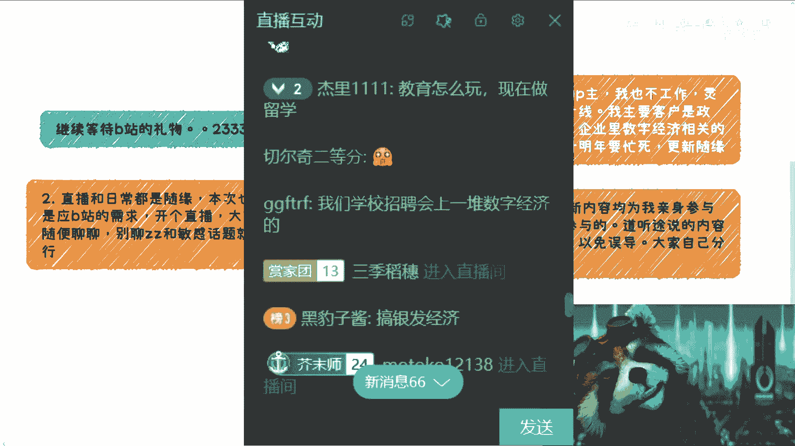

在本节课中，我们将基于一次直播实录，探讨当前环境下的商业机会、行业现状以及个人发展策略。内容涵盖数字经济、政策解读、创业方向、地域选择等多个方面，旨在为初学者提供直白、实用的商业思考框架。

---

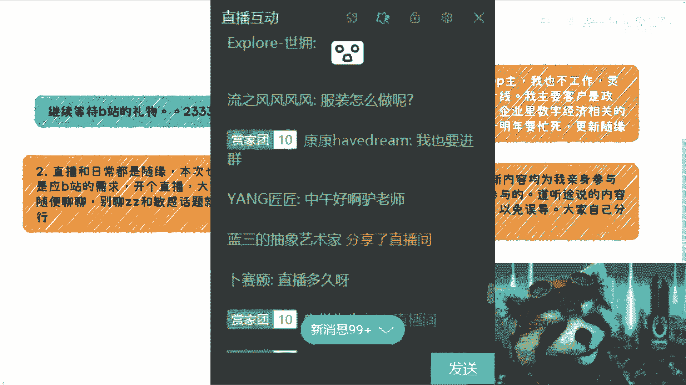

## 概述 🧭

本次课程的核心是理解商业的本质并非遵循固定模板，而是识别机会、利用资源并建立有效关系。我们将拆解多个行业案例，分析其背后的逻辑，并探讨如何在不同条件下寻找适合自己的路径。

---

## 一、 数字经济与政策风向 🌐

上一节我们概述了课程目标，本节中我们来看看当前最热门的领域之一：数字经济。

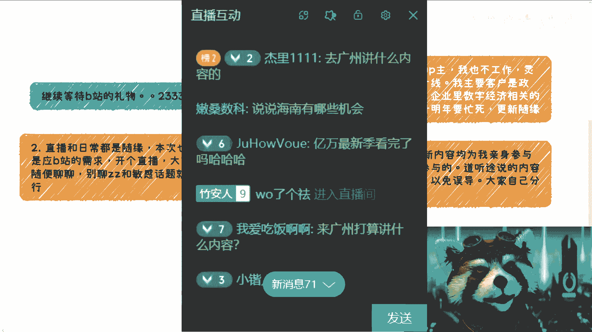

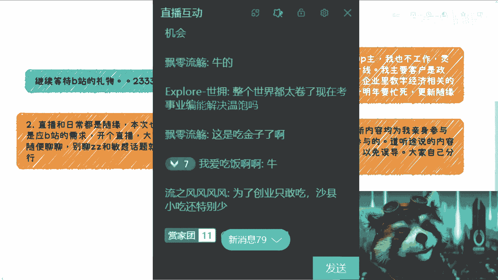

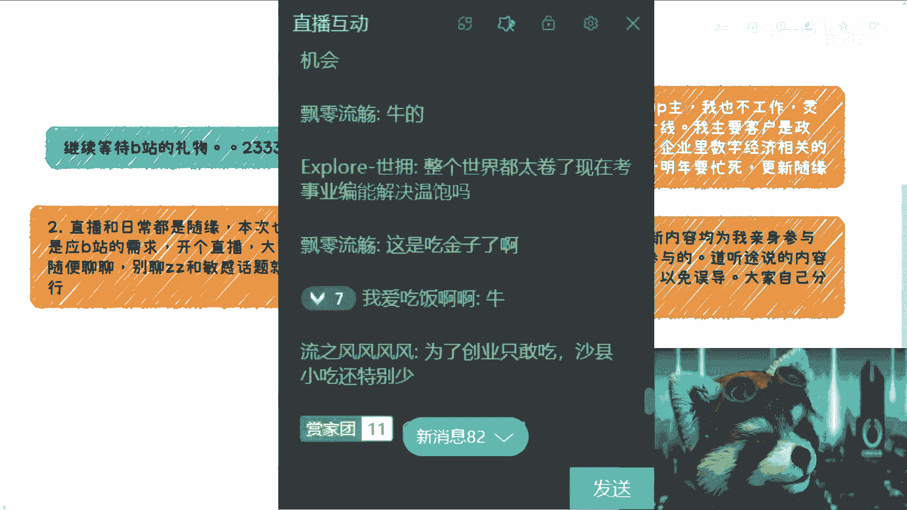

政策是商业机会的重要风向标。例如，“数字经济”是一个宽泛的概念，其下包含数字积分、数字资产、数字化改造、元宇宙等多个方向。关键在于如何将自身业务与政策方向结合，而不是等待政策给出具体方案。

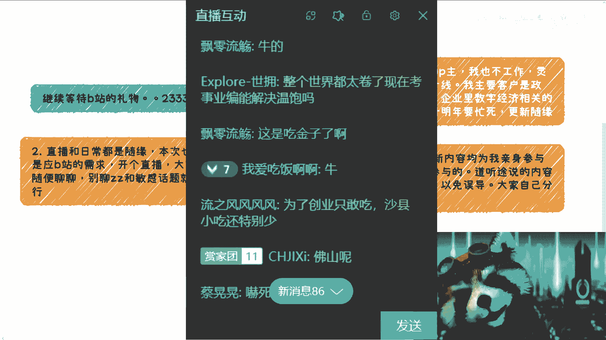

**核心公式**：`商业机会 = 政策方向 × 自身资源/切入点`

以下是利用政策的一些思路：
*   **数字积分与资产**：在通信、金融等领域探索数字化权益或凭证的发行与流通。
*   **产业数字化**：帮助传统行业（如服装、建材）进行数字化流程改造或营销升级。
*   **元宇宙概念**：可以结合医疗、文旅、教育等具体场景，创建虚拟空间或数字化服务。

**过渡**：理解了宏观方向后，我们需要思考如何将这些概念落地。接下来，我们将探讨几个具体行业的现状与机会。

---

## 二、 具体行业分析与机会判断 🏢

### 1. 教育行业
教育领域目前非常内卷。留学服务需要瞄准高净值人群或利用信息差，但在二三线城市机会也已不多。K12学科培训受政策限制，转型方向可以是素质类（琴棋书画）或针对高净值家庭的定制化教育。

### 2. 跨境电商与外贸
这些领域仍然可以赚钱，但属于“辛苦钱”。需要投入大量时间选品和运营，从商业效率角度看并非最优选，但作为现金流来源是可选项。

### 3. 玄学、咨询与虚拟服务
包括星座、塔罗牌、八字、虚拟数字人等。这类业务的关键在于营销和包装，通常走“野路子”（非正规化运营），通过个人IP或特色服务获取客户，而非试图建立标准化公司。

### 4. 厂二代与实体转型
对于继承实体产业的“厂二代”，核心任务有三点：
1.  掌握核心技术与生产管理。
2.  学习现代商业管理、互联网营销和数字化工具。
3.  拓展销售渠道，考虑业务复制（多地开花）或转型升级。

**过渡**：选择行业时，地域是一个不可忽视的因素。不同的城市有着截然不同的商业基因和政策环境。

---

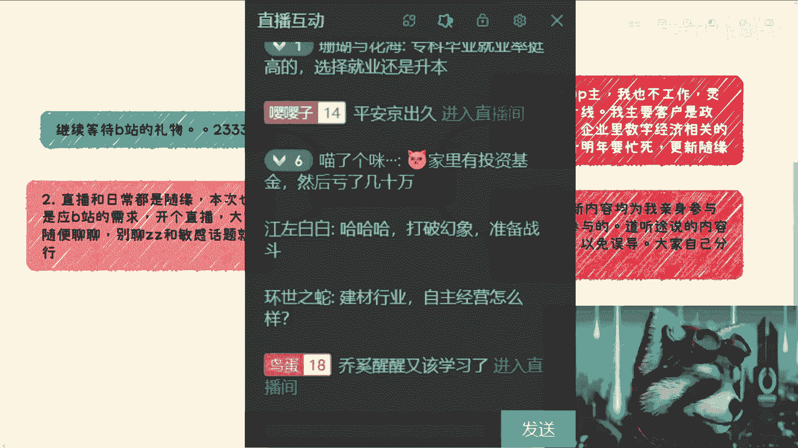

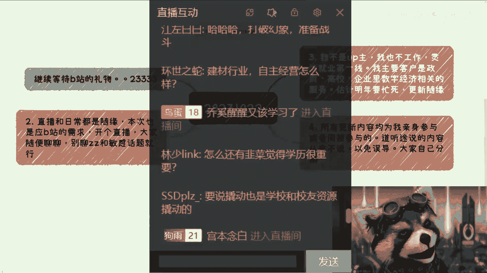

## 三、 地域选择与商业环境 🗺️

地域对商业成功影响巨大。以下是对部分城市的观察：

*   **上海与北京**：商业成本高，壁垒也高。上海商业环境相对排外，北京则更看重资源与人脉。两者均不适合小白起步。
*   **南方 vs 北方**：整体商业活力上，**南方优于北方**。北方城市（如天津、济南）往往更注重“稳定”和“关系”，创新氛围较弱。
*   **重庆、武汉、珠三角**：
    *   重庆：政策执行力强，重视实业。
    *   武汉：人才输出基地，本地商业机会相对有限。
    *   珠三角：产业链完善，具备内循环能力，机会多样。
*   **南京、青岛、河南（举例）**：评价偏负面，指出存在政策执行不力、营商环境复杂等问题。
*   **三四线城市**：消费能力和商业意识有限，市场多被垄断，适合做本地化实体小生意，但难以孵化创新或互联网项目。

**核心观点**：选择城市时，需评估其产业重点、政策执行力以及与自身业务的匹配度。

**过渡**：除了外部环境，个人如何为商业成功做准备？学历和经验扮演什么角色？

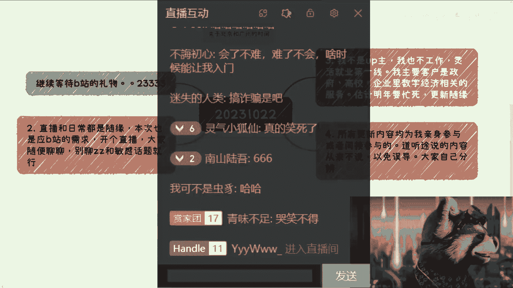

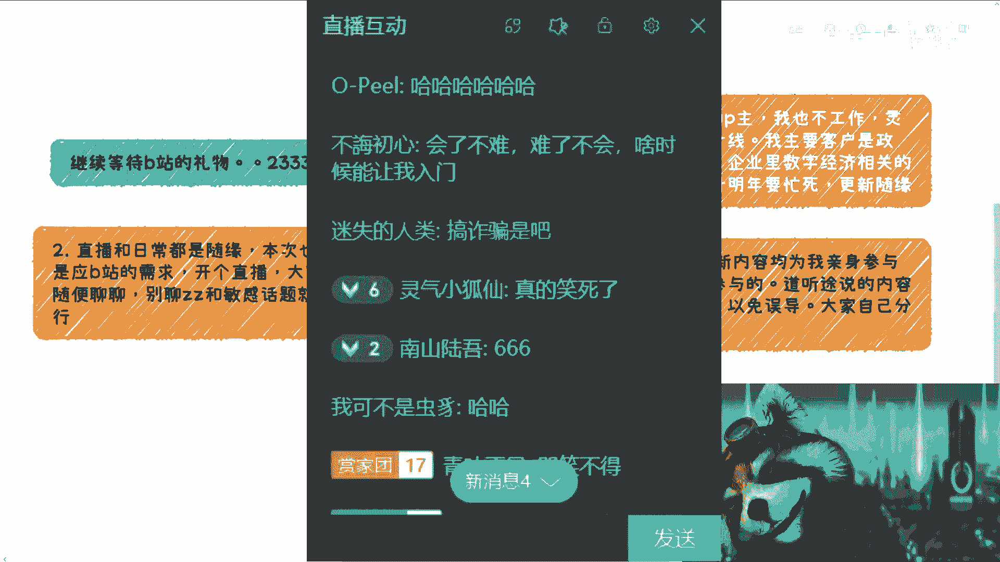

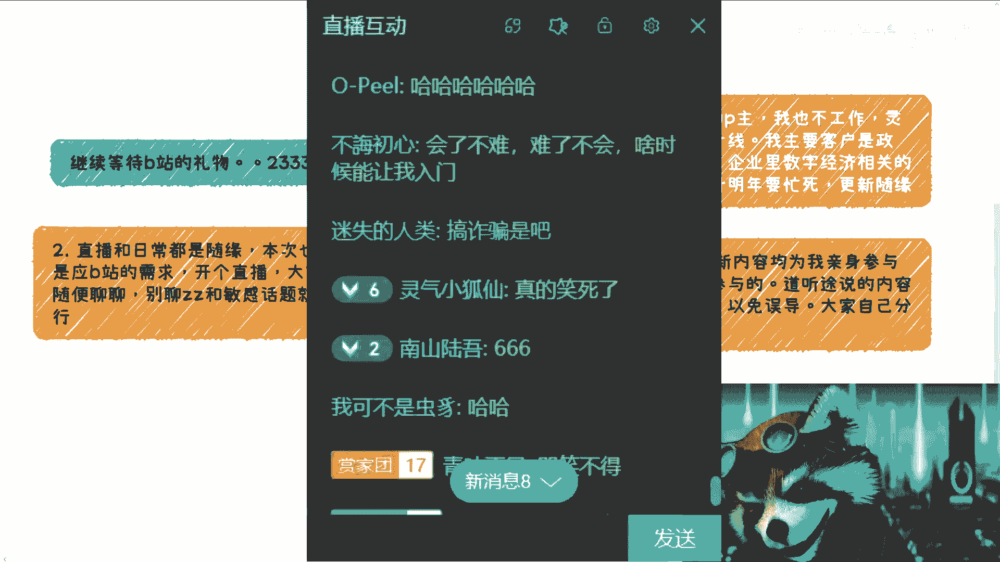

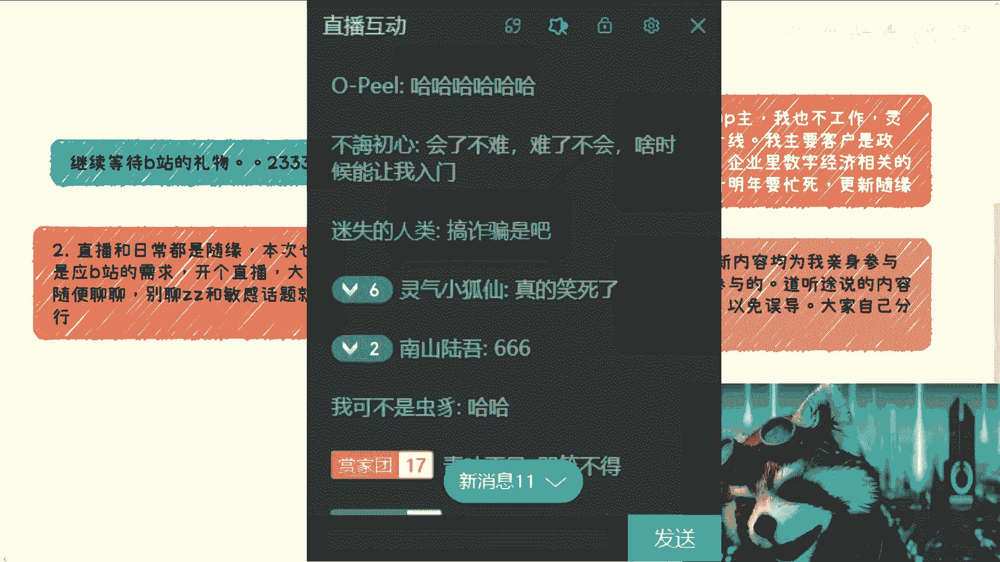

---

## 四、 个人准备：学历、思维与执行力 🧠

### 1. 学历的作用
学历在求职初期（尤其是打工）是重要敲门砖。**但从长远商业成功角度看，学历并非决定性因素**。真正能撬动资源、赚到钱的人，很少是单纯依靠学历光环。对于“厂二代”或创业者，实战能力和关系网络远比学历重要。

### 2. 需要培养的思维
*   **破除应试思维**：商业没有标准答案。需抛弃教科书和父母灌输的单一成功路径。
*   **目标导向**：明确核心目标是“高性价比地赚钱”。一切行动围绕此展开，能减少内耗。
*   **关系网络**：商业的核心能力之一是建立和维护**关系**。以你为圆心拓展的合作网络是最宝贵的资产。
*   **信息甄别**：警惕大众媒体和招聘会信息，它们常与真实赚钱逻辑脱节。应直接从从业者、投资者、政策执行者处获取信息。

### 3. 关于执行力
执行力不足通常意味着“不缺钱”或“目标不明确”。强烈的赚钱欲望和清晰的目标是驱动执行力的关键。

**过渡**：掌握了方向和思维，最后我们来看看一些具体可操作的商业活动形式。

---

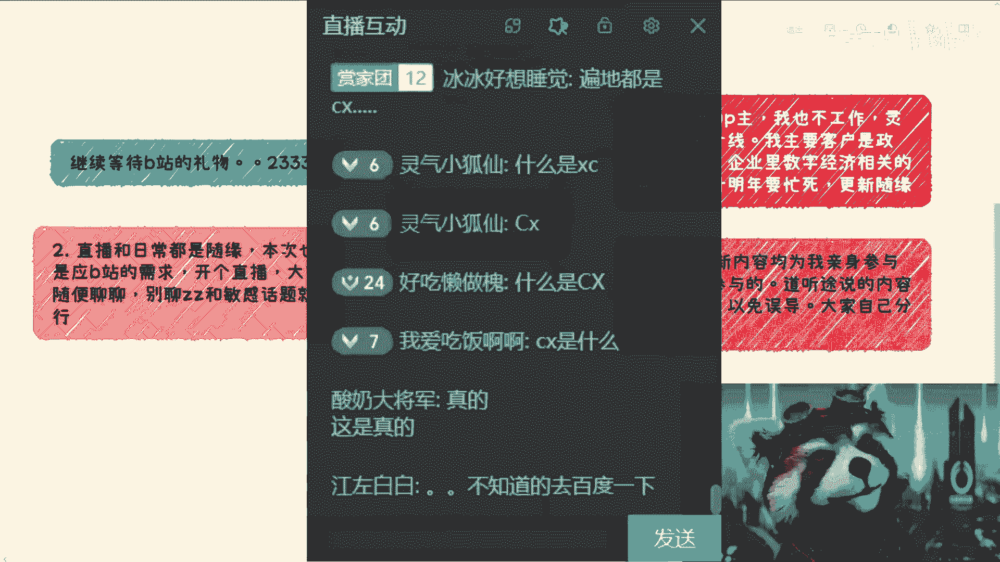

## 五、 商业活动与项目落地思路 💡

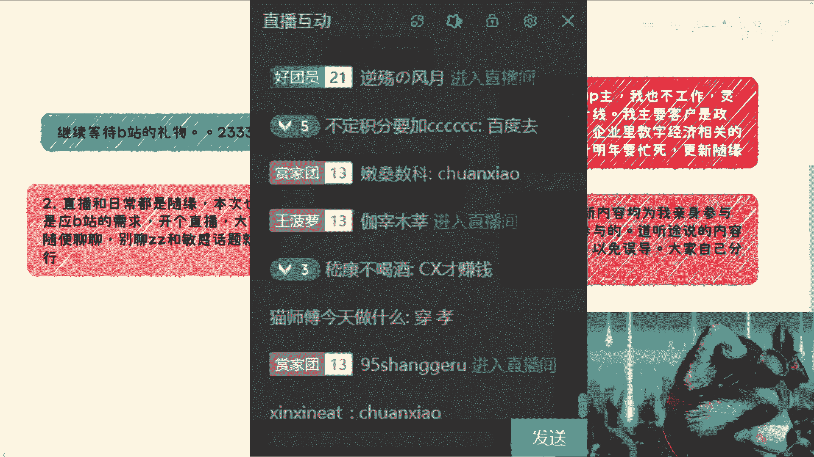

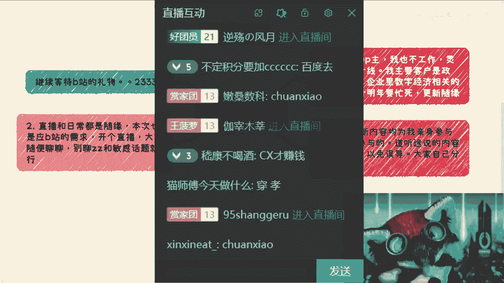

无论是举办沙龙、培训还是项目申报，想清楚目的是第一步。

以下是策划活动时需考虑的因素：
*   **目标受众**：是积累C端客户（用户），还是拓展B端资源（企业、政府）？
*   **活动形式**：独立主题活动利于打造品牌，系列课程则利于深度转化。
*   **场地与成本**：可尝试联系咖啡馆、共享办公空间或合作企业，获取免费或低成本场地，避免初期重资产投入。
*   **项目申报**：关注高校新设专业（如近3年开设的），围绕其提供师资培训、实验室共建、项目申报等服务，是切入高校市场的途径。

**核心逻辑**：从小的切入点着手，验证模式，再逐步扩大，而非一开始就追求大而全。

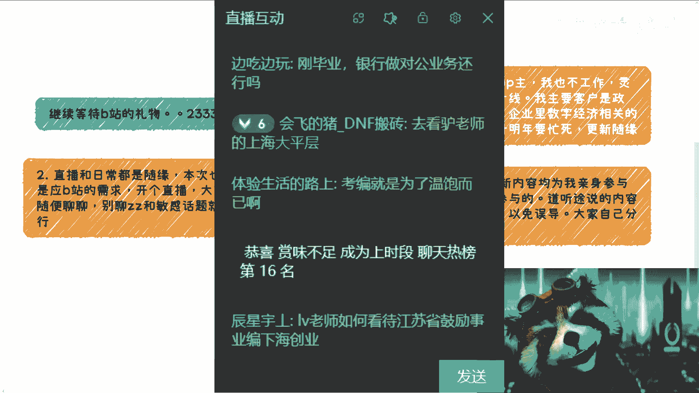

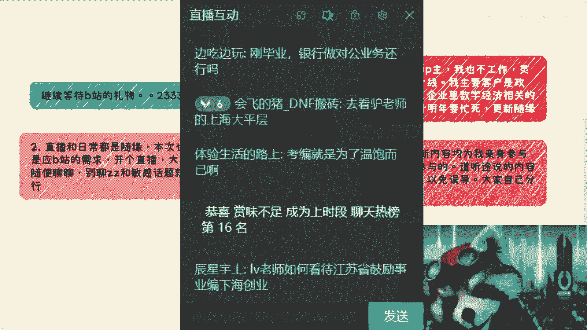

---

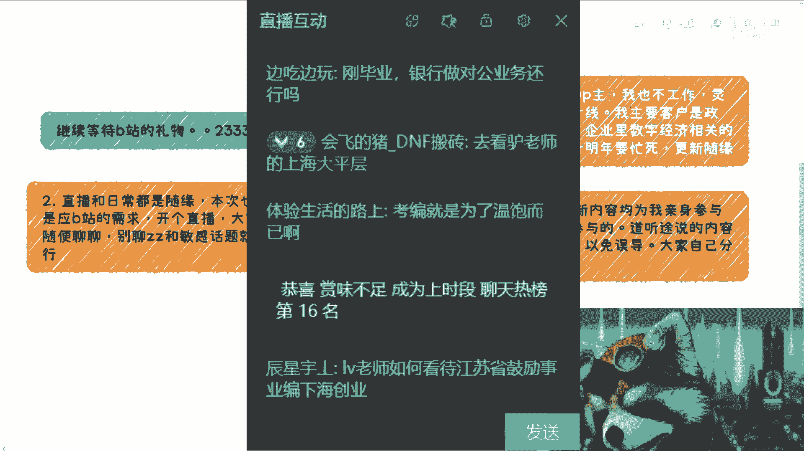

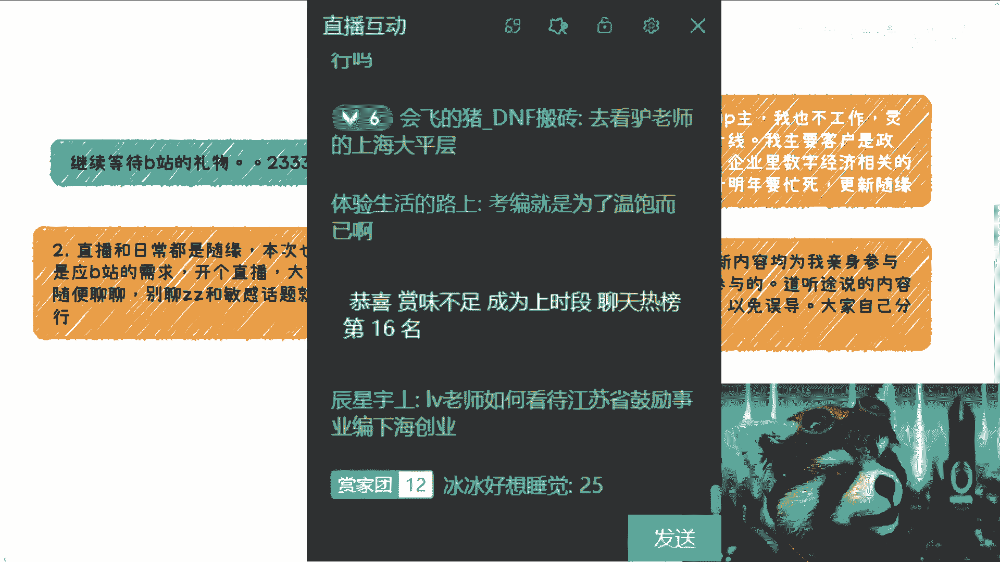

## 总结 📝

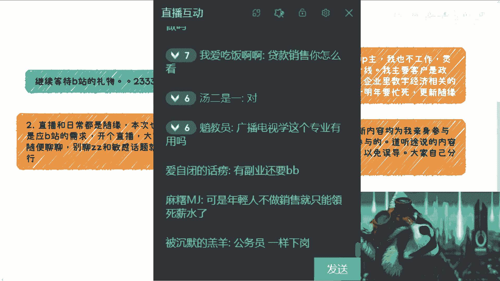

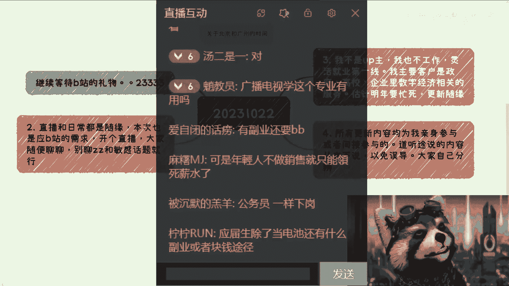

本节课我们一起学习了在当前环境下分析商业机会的框架：
1.  **看方向**：关注政策热点（如数字经济），但重点在于寻找自身业务与之结合的切入点，而非概念本身。
2.  **看行业**：认清不同行业（教育、电商、实体等）的现状是“红海”还是“有隙可乘”，选择适合自己的赛道。
3.  **看地域**：南方商业活力总体优于北方，选择与自身业务基因匹配的城市至关重要。
4.  **看自身**：**学历是敲门砖，但不是金钥匙**。培养目标导向的思维、构建有效的关系网络、并拥有强大的执行力，才是商业成功的底层能力。
5.  **看行动**：从小处着手，以明确的目的策划商业活动，低成本验证模式，逐步迭代。

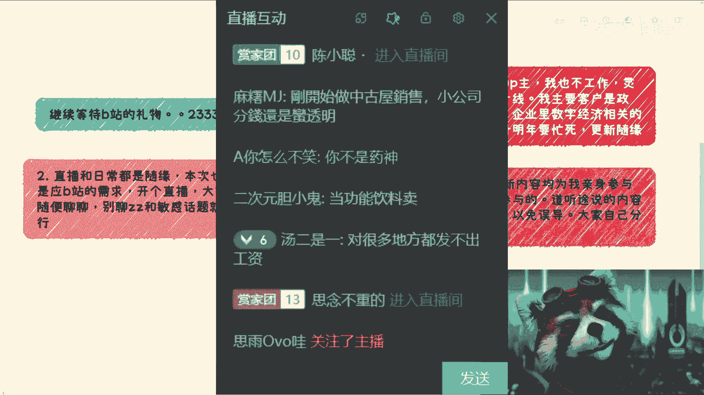

商业的本质是资源整合与价值交换。摆脱固有思维，深入实践，是通往商业认知的第一步。

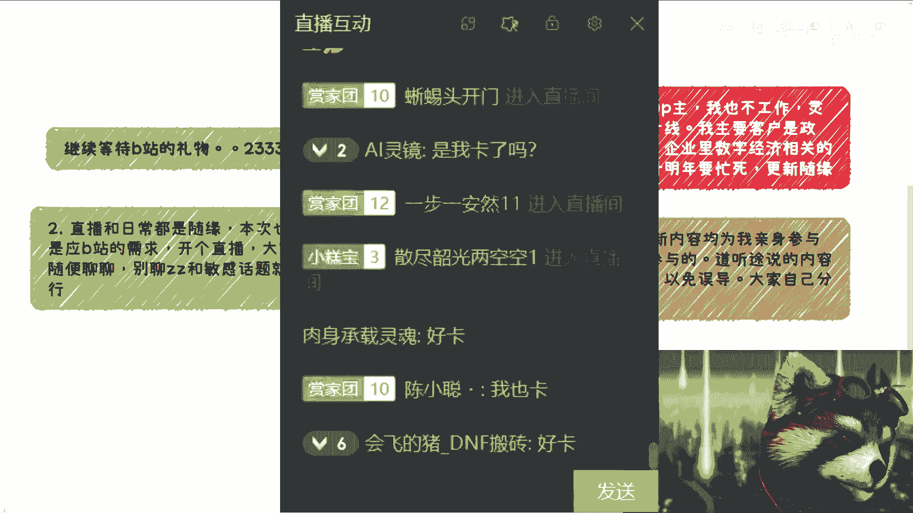

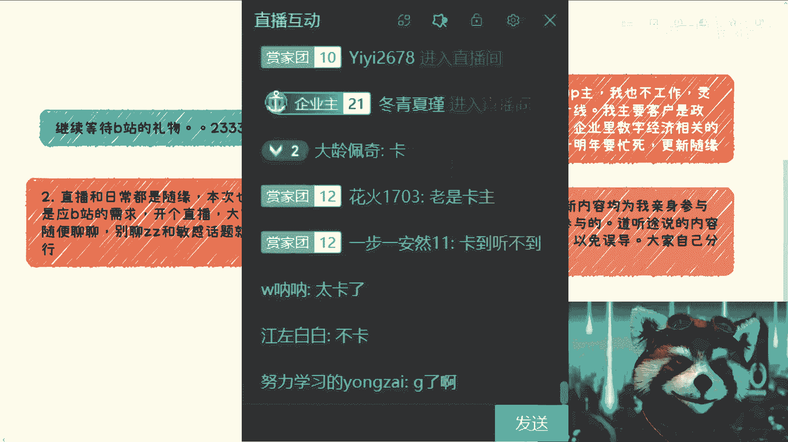

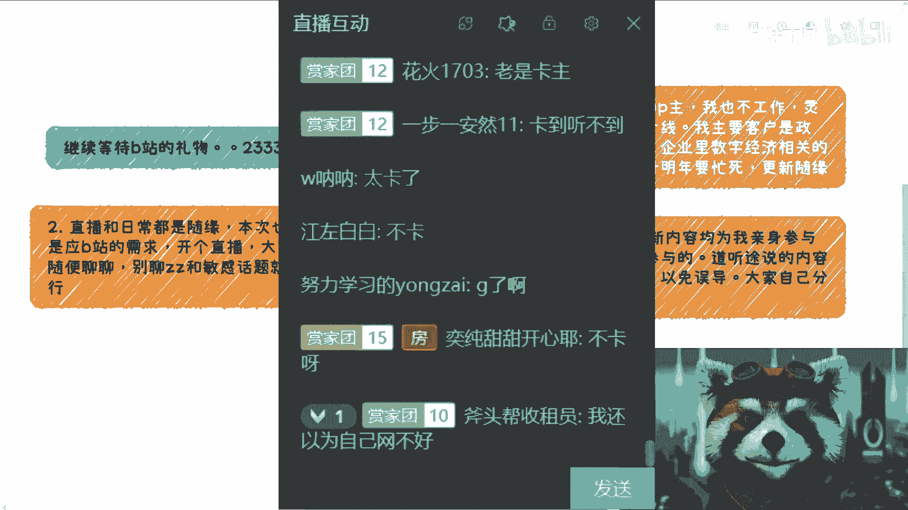

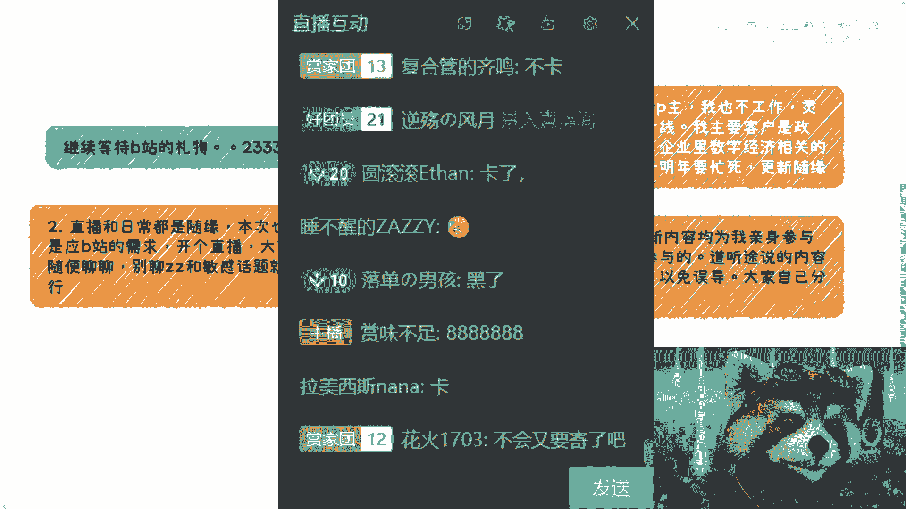

---
**课程预告**：分享者将于11月下旬在广州举办线下活动，主题预计仍围绕数字经济与商业实践。