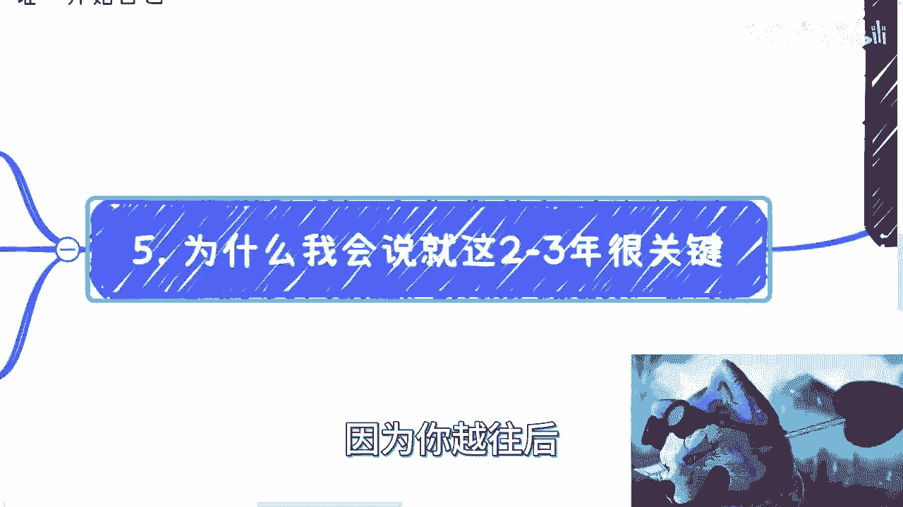
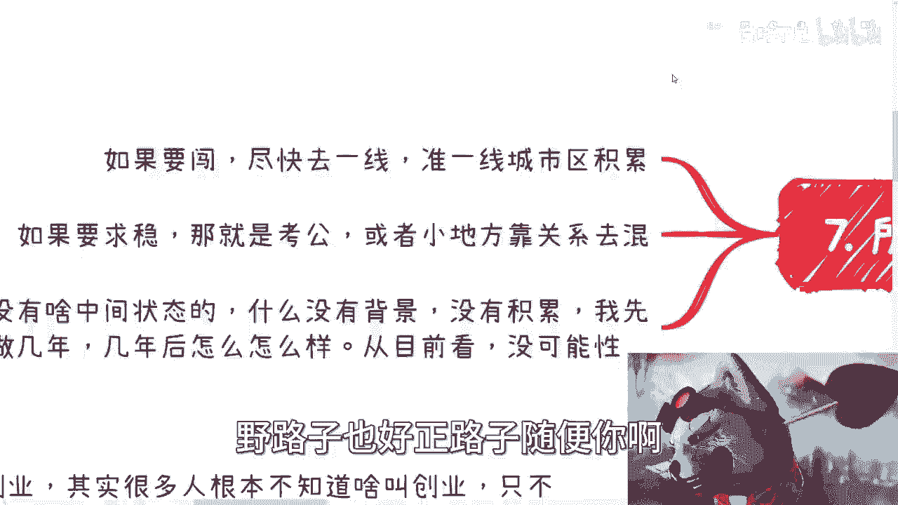

# 课程01：2023年中复盘与未来展望 🧭

在本节课中，我们将基于2023年上半年的观察，分析当前的社会经济状况，并探讨个人在未来几年可能面临的挑战与选择。课程内容将分为现状分析、未来预测和个人应对策略三个主要部分。

## 一、 当前形势分析 📉

上一节我们介绍了课程概述，本节中我们来看看当前的具体情况。

核心现状是失业人数持续增加，相关报告甚至已经停止发布。但这并非最核心的问题。核心问题在于国内一系列“操作”过于激进，导致风险集中。

以下是当前面临的主要内部挑战：

*   **学历贬值**：学历的含金量在下降。
*   **互联网透支**：互联网行业在创业和资本层面过度消耗。
*   **AI发展困境**：人工智能领域是资金黑洞，投入巨大但产出有限。其发展模式可概括为：`资金投入 >> 实际产出`。
*   **教育与产业脱节**：学校教育内容与市场需求严重不匹配。
*   **延迟就业**：大量学生通过读研等方式延迟进入劳动力市场。
*   **疫情资金透支**：疫情防控消耗了大量财政资源。

除了内忧，还存在外患：

*   **全球金融风险**：美国及全球多地接连出现金融暴雷。
*   **人口结构问题**：老龄化加剧，生育率持续走低。（注：此问题对当下5-10年的影响相对有限，并非最紧迫矛盾）

所有这些因素叠加，导致风险无法在长时间内平摊消化（即“软着陆”），最终被迫“硬着陆”，这是当前大家感到压力巨大的根本原因。受影响最深的人群是近两年的应届毕业生、未来几年的毕业生，以及近期被裁员的30-40岁群体。

## 二、 未来趋势预测 🔮

了解了现状的成因后，本节中我们来预测一下未来的发展趋势。

一个显著信号是，今年从中央到地方各级政府的许多事务都出现延期，这意味着明年必将加速推进各项工作。方向虽不明确，但这其中蕴藏着机会，关键在于能否通过“关系”提前获取信息，抓住先机。

未来将呈现以下特征：

1.  **存量市场内卷加剧**：增量市场几乎消失，劳动力严重过剩。
2.  **主业普遍不稳定**：应届生和有经验的“老兵”共同竞争有限岗位，导致任何人的主业都面临高度不确定性。其核心逻辑是：`岗位数量（坑）≈ 恒定`，而`求职者数量（萝卜）↑↑`，结果必然是激烈竞争与频繁替换。
3.  **被迫寻找新出路**：当主业无法保障时，人们将被迫寻找其他赚钱方式。但大部分普通人缺乏相应的技能和渠道。

## 三、 个人应对策略 ⚔️

面对上述分析与预测，本节中我们将探讨个人可行的应对策略。当前已处于十字路口，必须做出明确选择。

以下是两种主要的路径：

*   **路径一：极致化职场内卷**
    *   **核心**：在打工道路上卷到极致。
    *   **做法**：拼命提升学历、钻研职场技巧、维护工作关系、无条件加班等。
    *   **目标**：尽可能延长职业稳定期。

*   **路径二：开拓个人赚钱路径**
    *   **核心**：建立自己的商业关系网络和赚钱模式。
    *   **做法**：从零开始积累社会关系，探索小生意机会，全力拼搏。
    *   **关键**：需要最终全职投入，逐步稳定商业关系，为未来打基础。

**必须注意**：试图兼顾两者或选择中间道路（如仅做知识付费、内容创作等面向普通消费者的业务）很难成功。普通人的信息获取将越来越滞后，赚钱必须依靠信息差，而信息差往往存在于特定的“圈子”内。

## 四、 关键行动建议 🚀

基于以上策略，本节我们给出具体的行动建议。未来两年是至关重要的窗口期。

1.  **时间紧迫性**：2024年起政策执行将加速，信息会进一步闭塞，越晚行动风险越高。
2.  **放弃幻想**：2000-2020年互联网式的“大众创业、万众创新”时代已经结束。普通人幻想通过一个“点子”或“产品”融资成功已无可能。成功案例的背后是**资本 + 关系**，而非单纯业务。
3.  **明确选择**：
    *   **若要闯荡**：尽快前往一线或准一线城市，通过任何合法方式积累资源和关系。
    *   **若求稳定**：全力考取公务员编制，或依托关系在地方获取有编制的工作。
4.  **不存在中间状态**：试图“先工作几年看看”、“读个硕士缓冲一下”等中间路线，最终可能面临同样的困境，因为竞争环境已彻底改变。

## 总结 📝

本节课中我们一起学习了以下内容：2023年面临的“硬着陆”现状及其内外成因；未来劳动力市场内卷加剧、主业不稳定的趋势；个人必须在“极致职场内卷”和“开拓个人路径”中做出极端选择；以及抓住未来两年窗口期、放弃不切实际创业幻想的具体行动建议。核心在于认清时代已变，并基于自身情况做出果断决策。