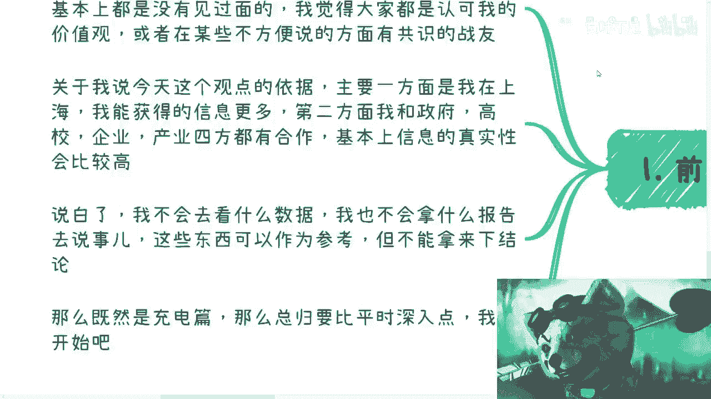
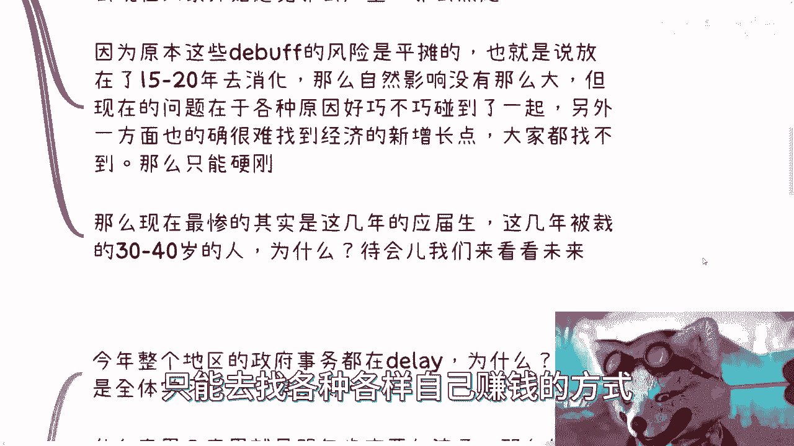
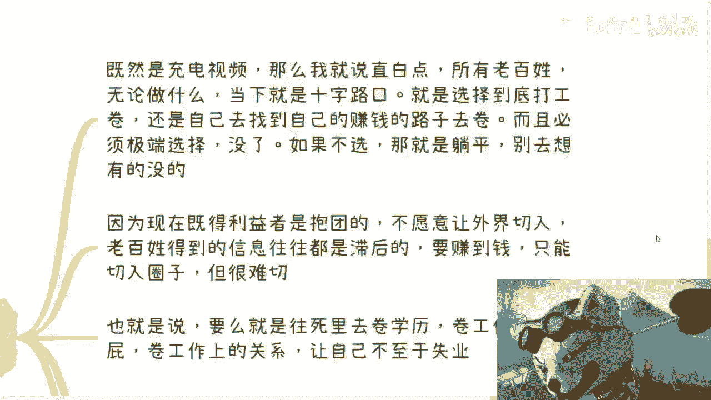
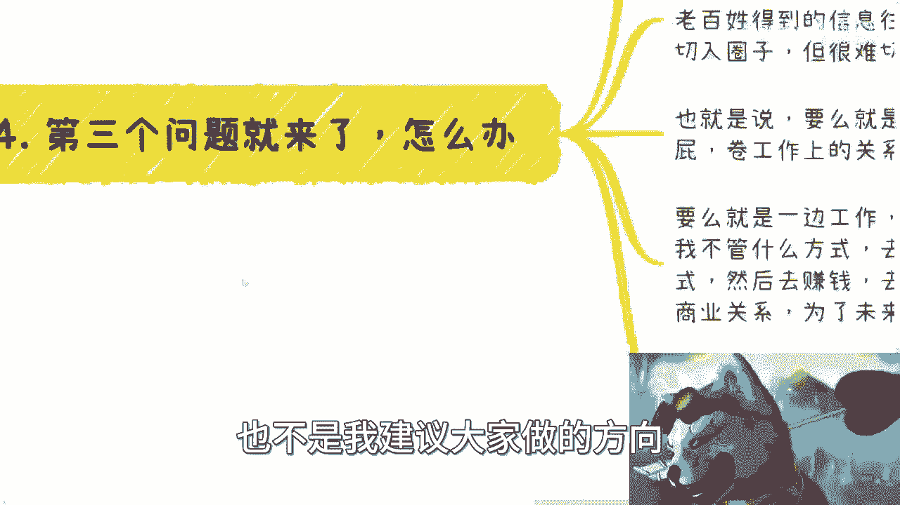
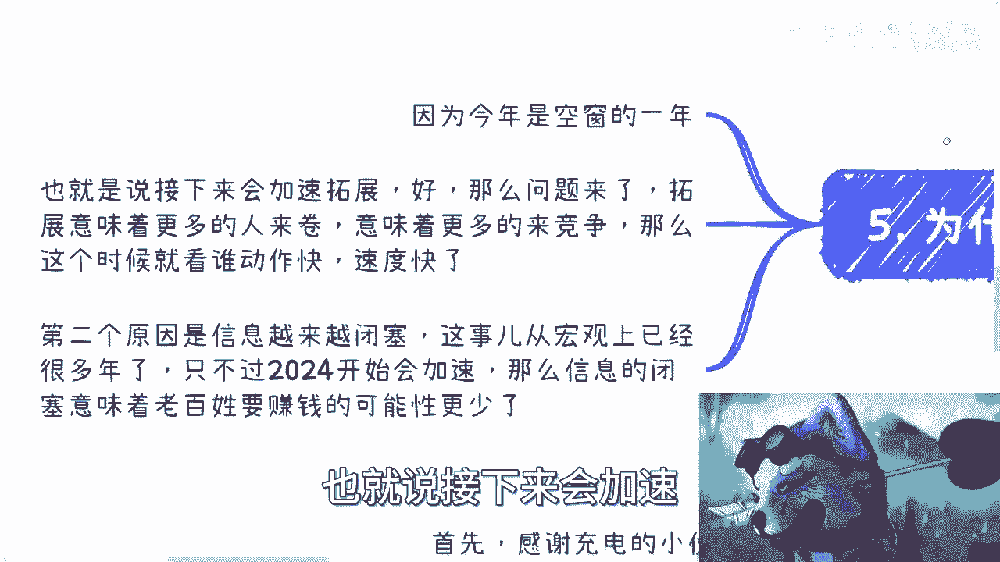
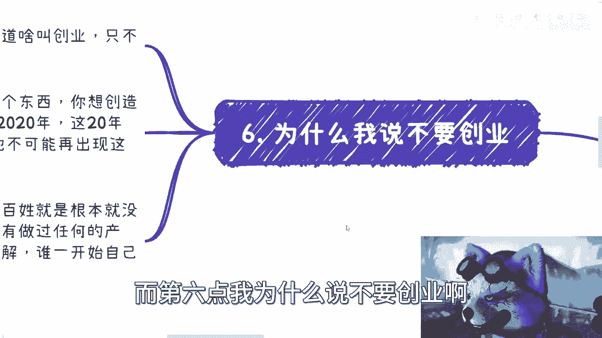
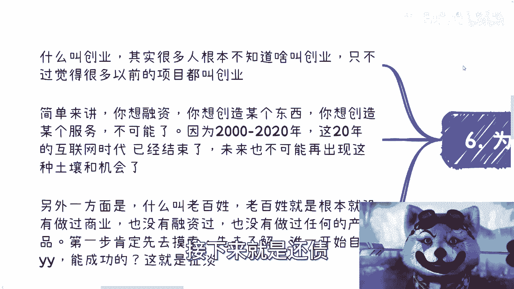
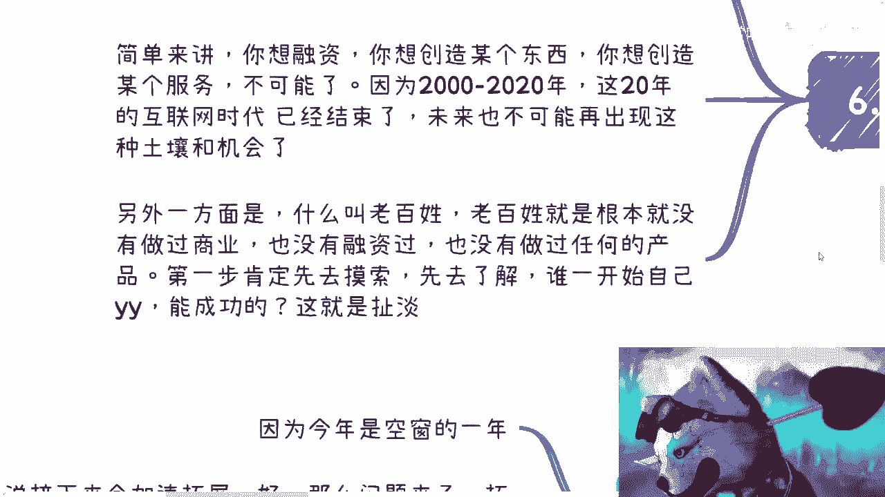
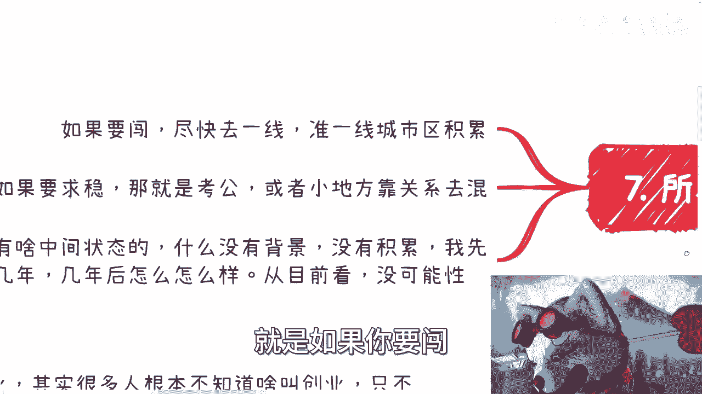
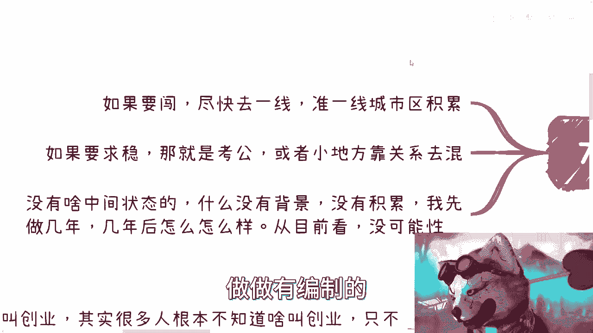

# 2023一半过去了，大家都在十字路口了，该做选择了 - P1：2023一半过去了，我来说下发生了些啥以及未来的情况吧 - 赏味不足 - BV1om4y1n7AP

好大家好啊，这个昨天小伙伴呢也提了一点啊，说这个充电对吧，我想了一下也对哦，给大家反馈个视频对吧，至少要做个充电片出来，是不是啊，首先呢我就充电片呢这个事儿呢就随意一点啊，我就不不那么的对吧。

那首先是这样子的啊，2023年过了一半多了对吧，我觉得核心啊就来说一下，现在还有未来的这个情况，呃，那因为充电屏对吧，那肯定要跟平时区分开来啊，呃诶一呢啊前期提要一下。

首先呢感谢充电的小伙伴啊，虽然的确没几个人啊，但基本上都是没见过面的，我觉得大家之所以会充电的，也是认可我的价值观，或者在某些不方便说的地方是共识的战友对吧，那么首先在这个地方啊，我先感谢大家啊。

第二呢就关于我今天说的这个观点的依据啊，很简单啊，我的依据，第一因为我在上海啊，我所接触到的所有的信息，肯定是相对2~5线城市来讲是靠谱的，二就是我这么多年以来。

我跟政府，高校，企业产业等四方面都有合作，所以我很清楚从上到下是什么个情况啊，所以说整个信息的真实性会比较高啊，那说白了我不会去看什么数据，我不会来跟你们说啊，你们看啊，这个几千万，那个几千万。

这个怎么样的，无所谓了，我不关心的哦，而且我告诉你们，真正的信息也是这样子的，就真正的信息都是通过线下沟通，私下沟通和关系所来达到的，而不是通过那些有的没的那些数据，没有卵用啊，没有卵用的那么好。

那么既然是充电片啊。

那么我们就开始啊。

首先第一个问题啊，这个现在什么情况对吧好，失业的人数越来越多，多到报告已经停止了，这个大家也都看到了对吧，那其实呢这些大家都知道，这并不是一个最核心的点，核心的点是什么呢。

核心的点是国内到现在为止一系列操作太骚啊，骚到什么程度，就比如说学历贬值，大家也都知道互联网透支对吧，互联网那边比如说在各创业上面啊，各种各样地方的金钱上透透支AI好，AI呢就更别说了啊。

很多人看表面觉得哎呀牛逼啊，AIGC怎么样啊，但其实你们但凡去看看历史就知道对吧，AI这边的这个发展简直就是这个资金黑洞，吸进去前没有任何的产出了啊，你们仔细去看看，你们就知道了啊，然后呢这个学校教育。

还有就是高校这边教育产业脱节啊，别的地方不说啊，你们单纯看B站上，就比如怎么抖音快手，先别去说了啊，就看B站上，你们就知道这玩意就中国这基本盘一塌糊涂啊，一塌糊涂，那么再比如说大量的这个学生。

其实呢就是在拖延进入产业的这个时间，就去读研啊，那么再比如上啊，再比如那个疫情这种资金上的透透支对吧，很多很多啊，那么这些呢属于内忧啊，那么外患是什么呢，比如说啊美国一直在金融暴雷啊。

全球各地方都在金融暴雷对吧，然后这个老年化啊，这个年龄的这个老龄老龄化越来越越来越多啊，然后生育率越来越低，当然我跟你们讲啊，你们别去太关心这些老龄和生育率的问题，因为我们的最关键点是。

当下这几年或者未来的五到10年，整个生育率低也好，怎样也好，还没有这么大的影响啊，没这么大影响，不要听到一出是一出啊，当然我跟你们讲啊，你要说全球一盘棋我是认可的啊，我是认可的。

就是你到哪我跟你讲都差不多都一样啊，终究呢我们先关注我们自己，也就是说这些事呢不是一两天，但是我跟你们讲，我为什么说会写在这个现在什么情况呢，是因为为什么我们在当下这个情况会感觉到。

特别严重或者特别焦虑啊，这个是有原因的，原因是原本这些DEBUFF，就是我们刚刚说的这个骚操作啊，原本这些骚操作它的风险是平摊的，什么叫风险是平摊的，也就是说这些骚操作它可能食物放到15年，20年里面。

他去平摊这个风险，他去消化这件事情，他是软着陆啊，就按照我们以前说法，就是软着陆对吧，那你自然影响可能没这么大，但是你现在问题是什么，就是好巧不巧对吧，金融危机啊，经济暴雷啊对吧，各种各样的东西。

还包括你内忧外患放到了一起对吧，再加上国际经济上的经经济形势的不稳定对吧，那么另外一方面，全球所有的国家都很难找到一个经济，新的增长点，对不对，好，那么我跟你讲就别说什么，就是你是想软着陆的。

但是环境不允许对吧，就比如说你今天想软着陆啊，这个啊这个又刮台风对吧，又又又雷电对吧，又怎么样子，那环境不允许，你也没油了，怎么办，你只能硬刚啊对吧，就只有我说硬着陆，那硬着陆怎么办。

硬着陆就现在这么个情况对吧好，那么现在最惨的呢其实是什么呢，是这两年的应届生，就前两年的应届生以及未来的几年应届生，以及这几年被裁掉的这个3~40岁的人啊，那么为什么呢。

那么待会我们来看未来，你们就知道为什么，那么第二个问题，未来什么情况对吧，那么今年整个地区啊，就从上到下，一线到五线，各省市区政府，它所有的事物都在延期啊，各个地方都一样，什么意思呢。

意思就意味着明年要加速啊，那么加速推进业务，那推进什么方向不知道啊，那么各地区每一年是什么也不知道，那么大家我就告诉你们，这就是一个机会啊，更多的去关注政策，当然也不要关注，就更多的去认识人。

还是这句话，最终归根结底到关系上，你能不能抓住先机，因为你看到的等你看到的时候，说不定都已经人家做都做得差不多了对吧，那么未来什么情况呢，你去看啊，首先我们刚刚说的应届生很多对吧，呃存量市场卷成雪对吧。

增量市场几乎没有，那么被裁的有很多，那怎么办呢，大家都要吃饭嘛对吧，那么就开始卷，那没了呀，你让老百姓怎么办呢，那不只能卷嘛，对不对，好，那么卷什么呢，卷工作卷工作没什么好卷的，为什么呢。

因为工作永远是一个萝卜一个坑，你随便怎么卷，不可能一个呃，一个萝卜卷出两个坑奶，那不可能的，或者一个坑卷出两个萝卜也不可能的对吧，那么也就是说去头去尾对吧，普通老百姓的主业肯定是不稳定的，为什么。

因为你现在的应届生太多，你也没有经济上升期，然后还有30岁到40岁的这些有经验的人，跟你去卷，那大家无论是年纪轻的还是年纪大的，无论是有经验没经验，一直都在卷，那我就问你们，你有什么自信告诉我。

你能剪得过人家，或者人家又有什么自信能卷得过你对吧，那大家卷不谁都卷不过谁啊，那无非就是替换嘛，因为对老板来讲都是电池，反正都随便替换，对不对，那么所以说你未来所有的人会。

因为不管因为年龄还是因为那个啊卷不过人家，还是因为你不够努力，不会加班，还是因为没有关系，还是因为各种各样的原因，反正会导致你的主业不稳定，这个就是核心点对吧，结束了，这就是核心点啊。

就是必然会发生的事情啊，因为你们想想看啊，就是互联网以前在鼎盛时期，20年的时间，都能够出现996007这种状态，更别说现在这种情况啊，而且这个事情跟互联网没有关系，所有产业都一样啊，所有产业都一样。

对吧。

然后呢而且还有很多人选择读研，那读研这个事我跟你讲啊，进一步导致了卷的持续发生，因为就像我们说的，虽然从表面上来讲，它的确是平坦的风险对吧，就是说我读研了对吧，我我把这个人人群不是一次性的对吧。

涌到什么地方去，但事实上我跟你讲，当然这个我可能是我不成熟的看法啊。

就我我真的是觉得长痛不如短痛，你知道吗。

因为因为为什么，因为大部分你去看这两部分人，这个应届生来讲呢，他没有找到，或者他对他来讲他没有红利期对吧，他根本就没有那种赚钱的可能性，你知道吗，那他除了打工，他还能干嘛呢。

但是30岁的到40岁这批人有什么问题呢，他商有老，下有小，可能还有贷款对吧，而经济也没有增长，那怎么办呢，那就是说本质上就是大家只能去，就是我们不说找副业或者找什么东西。

只能去找各种各样自己赚钱的方式去赚钱了。

但是对于大部分普通人来讲，他没有这个技能点啊。

那怎么办，那当然是越早越好的，把这个事情体现出来，让大家去做啊对吧，那当然这个地方也有要考虑嘛对吧，这个这个这个这个不稳定对吧啊，这个也有可能的啊，但是啊就这么回事了啊。

那么第三个问题来了，怎么办呢对吧，那么既然是充电视频，那我就说的直白一点啊，所有老百姓无论做什么，我跟你讲，2023年这个点已经晚了，已经晚了，你知道吗啊，呃但是当下就是十字路口。

你就必须选择你到底是打工去卷，还是找到自己的赚钱路子去卷，什么意思呢，你打工卷就是拼了命的拒绝你的学历，拼了命的去绝你的，拍马屁，拼了命的去卷什么东西，卷你各种各样的工作里的东西。

包括你们在网上B站上看到的什么哎呀，方法论对吧，怎么怎么写报告，什么东西完全去卷往死里卷对吧，你要么就是去找自己赚钱的路子，赚钱赚钱路子是什么意思，就是你去积累自己的关系，你自己去探索对吧。

从一个小喽啰开始做啊，尽可能的去去拼对吧，尽可能去舔，对不对，没了我告诉你们没了，简单来讲没了，你必须极端选择没了，你如果不选，那就躺平结束了，你我跟你讲什么叫躺平，躺平就是不是说你有能力躺平。

不是说你有家里有底子躺平，而是你无奈你没办法，你只能躺平，怎么办，没了呀，没了，能送外卖，送外卖，你选了。

我跟你讲啊，你们无论有没有感受到，我告诉你就是这么个发展趋势，早晚的事情啊，因为当下什么情况呢，既得利益者是抱团的，他是不愿意让外界切入的，也不是愿意让阿猫阿狗切入的，老百姓得到的信息往往都是滞后的。

你要去赚钱，你只能切圈子。

否则你怎么赚钱，对不对，你赚钱只能靠信息差对吧，也就是说你要么往死里卷学历卷，工作上马屁卷工作上的关系，让自己不至于这么早的时间。

要么就是一边工作，一边尽全力去社会上去卷关系对吧，我不管什么方式，你又拼了老命去卷啊，去寻找自己能赚钱的方式，然后去赚钱，而且你不可能一边做这个，一边做这个，你早晚都还是要全职去做的，因为没有办法的。

你做不好的啊，然后一个一个K次去做，去稳定这些商业关系，为未来去打基础，如果不是这两者，我跟你讲没路了，就这么简单啊，你别来跟我说什么，唉呀我可以做知识付费，我可以做什么啊，做什么做什么叫知识星球。

做什么东西，我跟你讲这叫什么，这叫底层老百姓攻击底层老百姓没什么好做的。

而且大部分人也做不起来啊，也不是我建议大家做的方向。

那么第五点，我为什么说这两年很关键啊。

为什么很关键一呢，因为今年是个窗空窗期啊，也就是说接下来会加速。

那么问题来了，加速意味着什么，意味着更多的人会进来卷，因为大家看到方向了，就像闻到血的鲨鱼对吧，意味着更多的机构会来学会来竞争，那么这个时候你就要想啊，看谁动作快了，你明白吧，就大家就占山头啊对吧。

第二个原因是什么，是从未来政策上来讲，信息会越来越闭塞，这件事情从宏观角度来讲已经很多年了，只不过2024年会开始加速，你们要明白啊，那么信息闭塞意味着什么，意味着你们也好，我也好。

我们要赚钱的可能性就更少了，为什么，因为我们想要得到有效的信息的，可能性就更少了，你明白吧。

所以啊所以啊我为什么才会说这两年很关键，因为你越往后你的风险越高。

你知道吧，而第六点，我为什么说不要创业啊。

有很多人搞不清楚概念，什么叫创业，就是很多人会觉得，2000年到2020年那段时间的什么滴滴啊，美团啊，各种各样，好像是个人都能创业，而是个人都能融资，但我告诉你啊，你想融资，你想创造某个东西。

你想创造某个服务不可能了，为什么，因为2000年到2020年，这20年的互联网时代已经结束了，这个整个创业的时代已经结束了，为什么上层决定的，我就这么告诉你们，结束了没了，一去不复返啊。

绝对不可能再出现这种土壤跟机会了，不可能，你要问问50年后可不可能我不知道啊，但至少五到10年20年内不可能的，你不用想了啊，没有可能性的，接下来就是还债。

我告诉你就还债啊，那么另外一方面呢，什么叫老百姓，老百姓就是根本没有做过商业，没有融过资，也没有做过任何产品，你第一步如果真的要去做，你肯定是先去摸索，先去了解啊，你别一开始就想着说。

哎我今天做了一个什么业务，做了一个产品，我能解决什么痛点，怎么样子，你们看到都是表面的，我告诉你们，你们看到的东西永远不是真的，你明白吧，哦就是说今天有个什么东西成功了，并不是因为他做什么成功了。

一定是他背后的资本运作跟关系成功了，你们没有这个关系，没有资本运作，你们做同样的事情不可能成功，你知道吗，就这么简单啊好吧。

所以说啊过了一半多了啊，就是哎我我怎么感觉我好像漏了一个。

我当时写了一个啊，第七个对，所以总结来讲什么意思，就是如果你要闯。

尽快去一线准一线城市，快点去积累，我不管你怎么积累啊，你野路子也好。

正路子随便你啊，如果要求稳，那你就考公，我只能说相对啊，考公或者你就有找点关系，小地方做作，有编制的。

你也别去想别的，想别的也没什么好想的，你知道吧，我告诉你们，当下这情况就是没有中间状态，只有十字路口，什么没有背景的，没有积累的，我先做几年对吧。

稳定稳定还有什么，我到外面水个水硕，回来几年后怎么样怎么样。

我跟你讲，到目前还没有可能性的，你别想了你，我不管你是读硕还是水个数还是怎么样子。

你但凡不不不去选择这个十字路口，你回来结果是一样的。

没有区别的，因为人太多了，你知道吗，就像我们刚刚说的。

因为当下的环境太恶劣了，大家都在硬着陆，已经不是前面20年的环境了，你们但凡我觉得就是但凡没有太紧急啊，感觉还能看看对吧，让子弹飞一会儿会怎么样子的，我跟你讲，这是因为你们的参考参考案例。

都是2000年到2020年的以前的案例，但以前的东西已经不复返了，你知道吗啊没有可能性了啊，当然还有很多的依据，我因为这视频还是要发对吧，我不可能在这视频里面讲啊，但是有非常多的东西。

已经支撑了这些事情的这个发展，而这些事情永远是，你们不可能在网上或新闻上看到的，好吧行吧行吧，反正就是这个再次感谢充电的小伙伴，至于以后我还发点什么呢，我就想我想想吧好吧，给充电小伙伴发现什么。

那当然我也欢迎大家来咨询好吧。