# 2023年软件测试之手工测试发展分析 - P1 - 赏味不足 - BV1ud4y1p7GV

好大家好我是尚未不足。

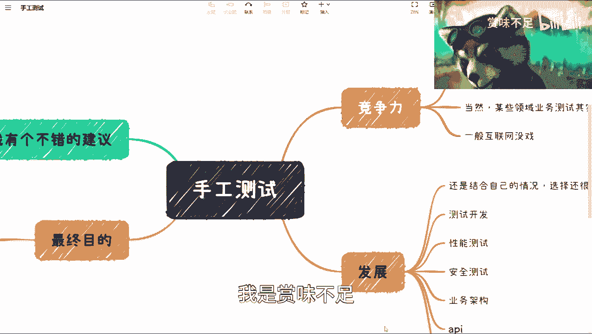

那么也很感谢之前大家对这个视频的支持。

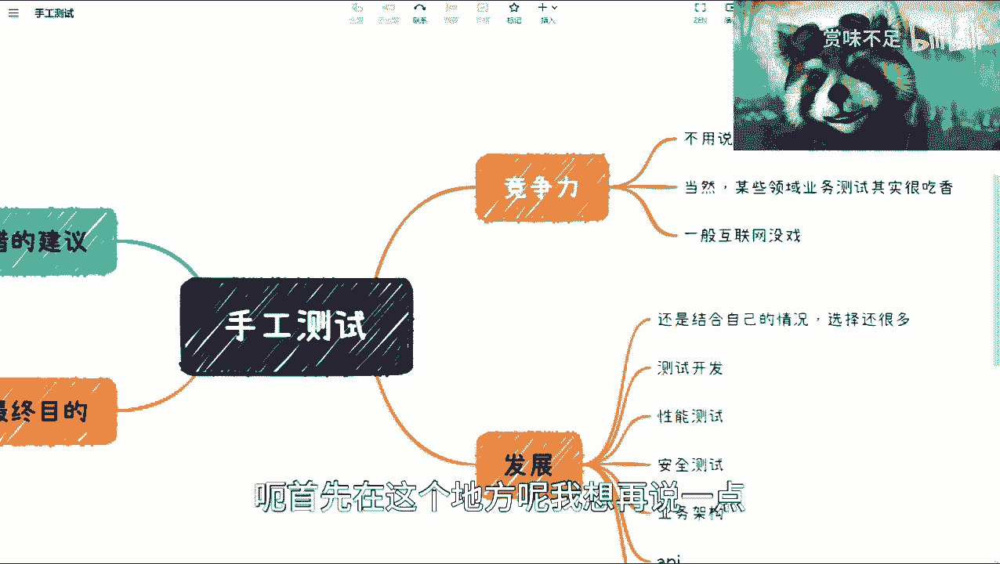

我看了一下就是反馈还是蛮多的，首先在这个地方我想再说一点，因为我看了一下这个视频的这个玩播率其实不高，但是其实大家问的问题都还是比较尖锐的。

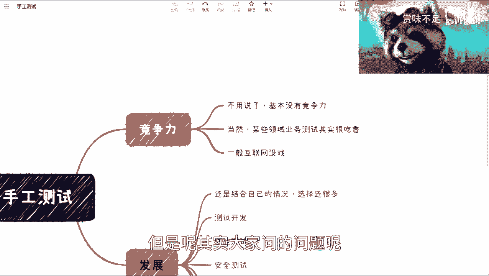

所以我想在这地方先提先补充一句，就是希望大家能够看完好吧，因为我每一期讲我也不会说太久，对吧我希望大家看完，因为大家其实有一些关心的问题，其实视频里都有，只不过就一般来讲像一些发展对吧。

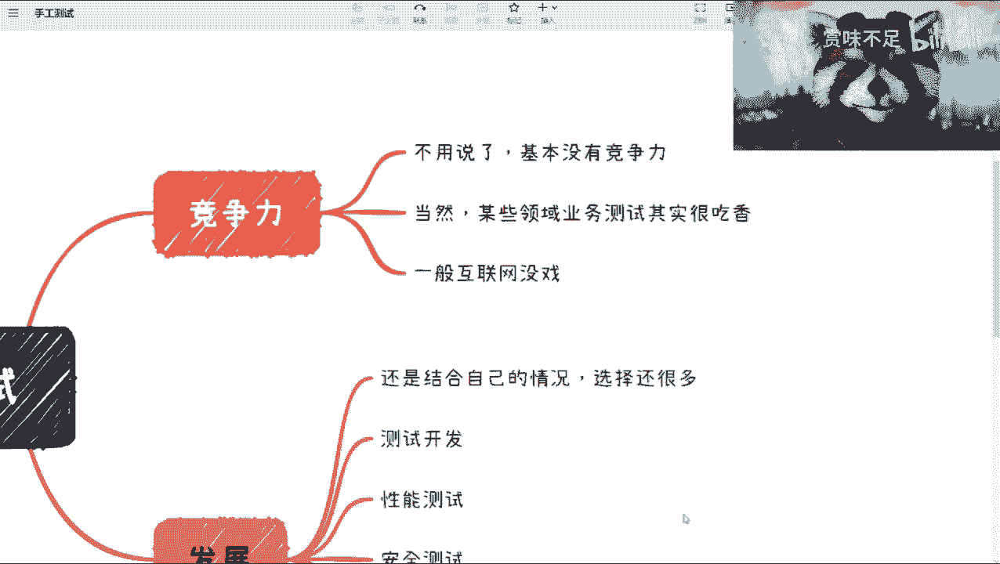

或者其他一些我是放在后面的，好吧，那么这一次就按照我们之前的就我列的之前的计划。

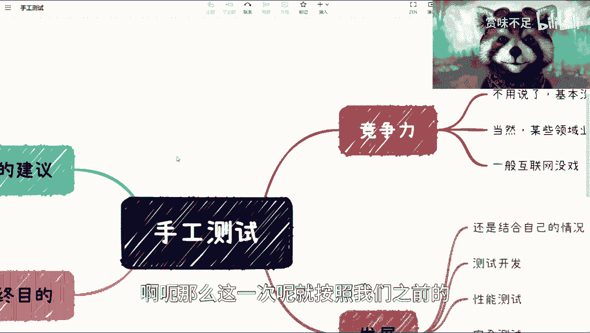

就这次讲的是menu对吧，menu test，那么首先在这个地方我得先提一句。

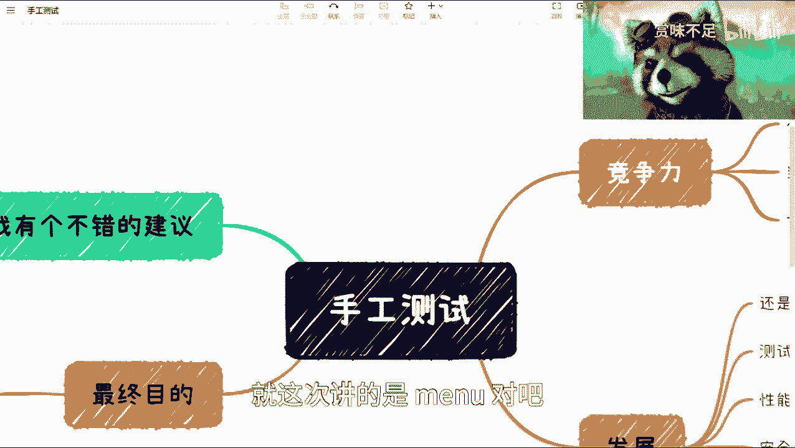

就是所有东西他不能一概而论对吧，就比如说我今天讲的东西，你说你适合100%的人那不可能对吧，所以我得把所有的前提讲清楚。

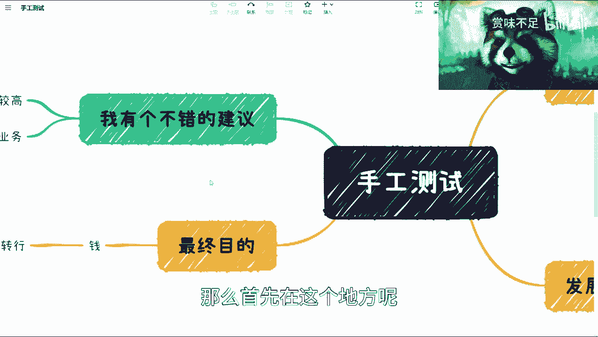

什么意思呢，就是说如果今天你做一个test对吧，你的一个目标，你说我不管你过程是什么，你的最终目的是为了赚钱，那么我就明确告诉你去全民转行，我就明确告诉你今天转行，我可以一棍子打死请你转行。

如果你今天你的目的说你的最终目的说，我不单单是为了钱，我可能有个人人生目标对吧，或者完成成就，我有别的方式赚钱。

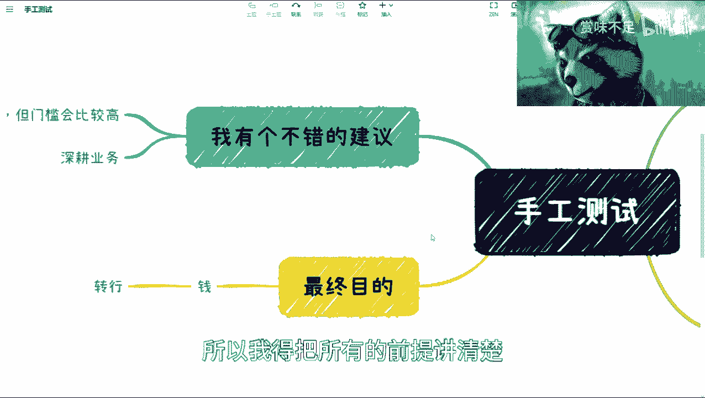

或者我很有钱，OK那就继续听我讲，好吧，继续听我讲，当然你转行也得继续听我讲，但是你可以绕过一开始的这些内容，对吧，首先我觉得是这样子的，从竞争力来讲，我觉得一般的互联网公司，传统公司。

以及大部分的一些中小型企业，我可以一棒子打死，都没有竞争力，你想都不用想，我不管你到底做怎么样，没有竞争力，当然测试本身，它其实还是有很多的东西可以深挖的，对吧，我回头会单独再开一期视频。

跟大家将详细讲一下，所谓的价值点到底在什么地方，因为企业也好，行业也好，社会也好，认为岗位或者职业没有价值，但并不代表它没有深度，深度肯定是有的，而且很深，那么当然在这地方我也提了一句，就是说某些领域。

我们说比如说像航空，金融，对吧，或者某些制造业，对吧，尤其是金融，它里面的业务，尤其是测试也好，我们叫做质量保障也好，是非常重要的，是非常重要的，就是说它的重要等级，会比开发持平，或者比开发来的高。

但是这个也只是在某些特定的领域，某些特定领域，那么大部分你们其实只要做过的，我相信但凡只要做过的，对吧，外包公司，中小型企业，互联网公司，你们都会明白，作为一个手工测试，你们是没有任何价值的，毫无疑问。

当然了，我觉得这个话可能不太妥当，你们是有价值的，但是没有上升空间，没有上升空间，而且这个价值，我觉得和大家的付出也是不成正比的，那么这是一个。

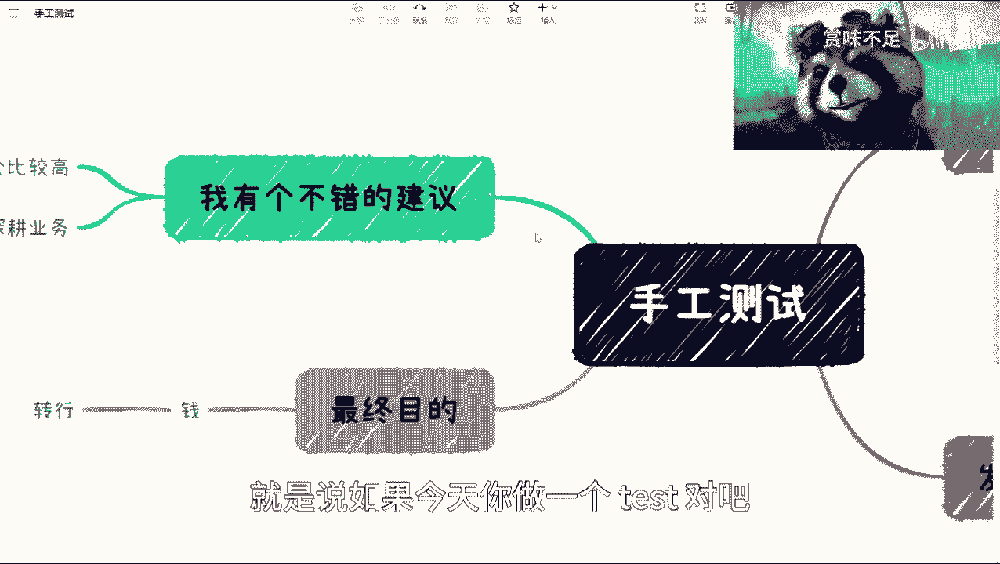

那么发展，我觉得大家可以这么理解，manual test这边，除了我这个地方有个不错建议。

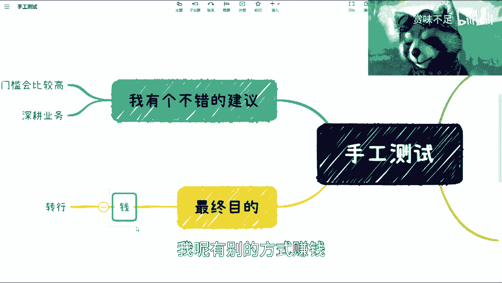

待会我们再来看，就除了你现在比如说，已经在做我这个不错的建议了，抑或者来说是一个，跟我刚刚说的，金融领域，对吧，或者某些，比较看重测试领域，除了这些情况以外，我觉得，它大概率其实是一个属于那种叫做。

我们打过游戏都知道，它属于一个初始角色，什么初始角色，就是说你作为一个手工测试，你往后发展可以有很多，转型的方式，比如说测试开发，性能安全业务架构，接口自动化，持续集成，对吧等等，我就不说了，对吧。

其实你有很多的这种转行的，也不是转行，就是发展的方向，我们在游戏里面叫转职。

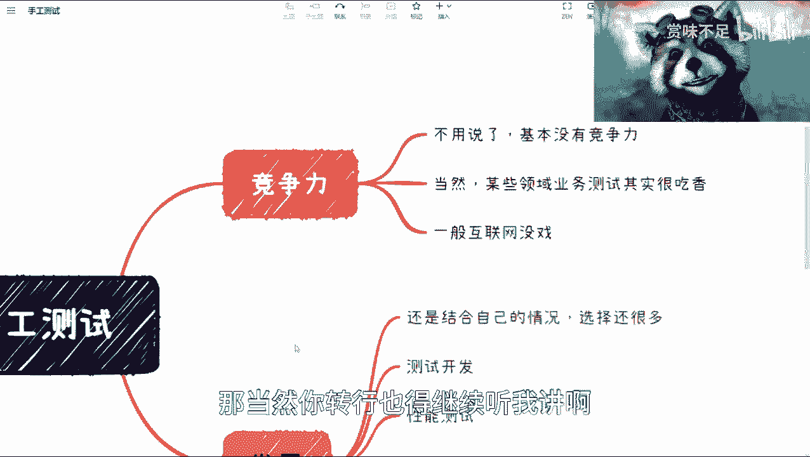

对吧，或者升级，对吧，但是我觉得这个事情，其实主要还是得要结合你自己的情况，因为为什么我今天会在这个地方提。

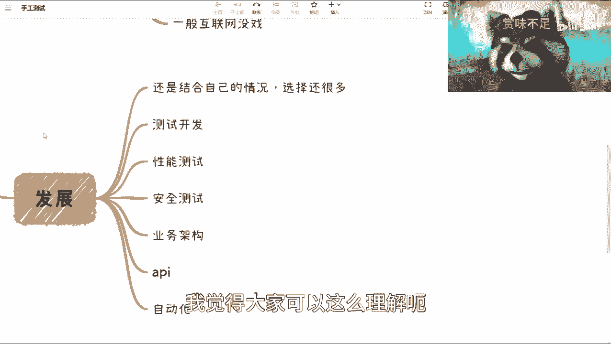

看得见吗，我看看，看得见，就提前的事情，是因为，如果你现在是一个手工测试，你说我的最终目的就是为了赚钱。

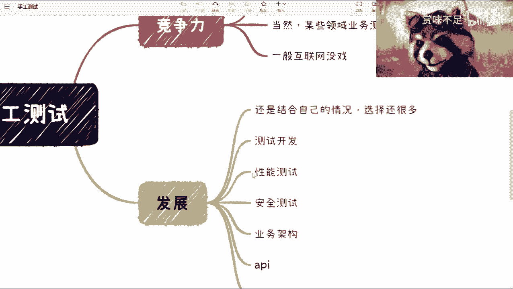

好，我觉得就是说，这些你都别去考虑了，请你转行，斩钉截铁，请你转行，对吧，当然你说你要往下发展，我觉得你就得结合自己的情况，因为有很多的人做，他只关心，比如说到网上CSDN，对吧，这个各个地方，去搜。

测试应该怎么发展，然后有很多人会跟你说，这样发展，这样发展，这样发展，对吧，但是，有个很大的前提，你得结合你的个人情况，什么意思呢，我在这地方，我给大家再细分一下，你比如说，性格内向外向，对吧，外向。

对吧，你的叫什么，个人优点，是什么，对吧，好，我们来举个例子，比如说，你真的长得很好看，颜值很高，我觉得你有很多种别的方式，对吧，你可以做直播，对吧，或者你可以做别的，不代表你只有做这个，性格外向内向。

你也决定于你最终的转行，你说你是不是说要做销售，对吧，适不适合出去谈生意，是不是创业，对吧，包括你适不适合，就是在我们上几期视频里面说，你适不适合转去做产品经理，项目经理，对吧，因为有很多人。

他没有去关心过，他自己到底优点是什么，他也没有关心过，他自己到底要什么，当然也有很多人会说，他说，OK，我现在根本就不知道我的擅长是什么，对吧，我也不知道我优缺点是什么，没有关系。

你想办法先解决这个问题，对吧，你有问题你要去解决，你不解决你拖着，你过了10年20年，你还是解决不了，对吧，所以到那个时候，尤其像你比如说像现在，为什么我会录这个视频，就是因为其实互联网走下坡路之后。

现在经济受影响之后，其实整个就是说测试也好，开发也好，互联网里面岗位也好，有非常多的东西已经开始，就是说从隐性变显性了，对吧，那么这个时候就应该去考虑起来了，对吧，你比如你就像有很多人转行。

他说我后面转成产品经理，转成项目经理，转成销售，他说我做的还是不顺，对吧，为什么呢，其实跟你的很多的内因是有关的，对吧，你说是因为你不懂技术，不可能，你说你不懂业务也不可能，对吧，你比如说你做一个销售。

你可能你技术只要做到30分，对吧，业务你比如说了解到个四五十分，对吧，剩下的可能是你更多的是你要了解，就是说我怎么让这个case去成交，对吧，我怎么能让别人明白，我到底卖的是什么产品。

我怎么能把这个产品包装好，这个是核心能力，但这个核心能力是一些技术能力吗，并不是，对吧，就因为这些其实是更多的，跟你这个人有关系，我见过无数的销售，SAP，Google的，Microsoft的。

或者其他的，我们会发现他们的专业能力强吗，强，但是他们所表现出来的能力，并不仅仅是靠所谓的日积月累的，锻炼出来的，不是的，是跟他们个人的性格，跟他们个人的这种，就是叫做这种，有些天生的东西是有关系的。

他们相当于是说更多的是让自己的，优缺点发挥到了极致，对吧，当然这些我觉得才是最重要的，所以说为什么我们说，我在B站上回避别人的时候，我也会说，我说选择大于努力，对吧，我现在所有的话，我都说选择大于努力。

为什么，因为努力的人太多了，我见过太多努力的人了，对吧，包括评论的私信的，你们不用说，我都知道你们很努力，但是你们，很多人都回问，他说我努力，我非常努力，对吧，他说，沈总你24小时打12小时游戏。

我24小时看24小时书，为什么我现在怎么样，我首先问题在于你努力是努力，你得看你的方向和你个人能不能match，对吧，你说你个人不好好去审视你的优点。

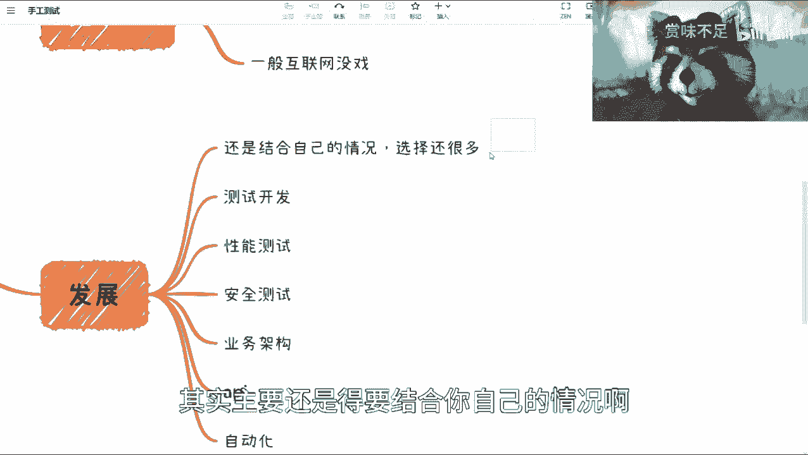

不去发现你擅长什么，你再去努力，如果方向不对，那有什么用的，对不对，那么在这个地方，我对于手工测试。

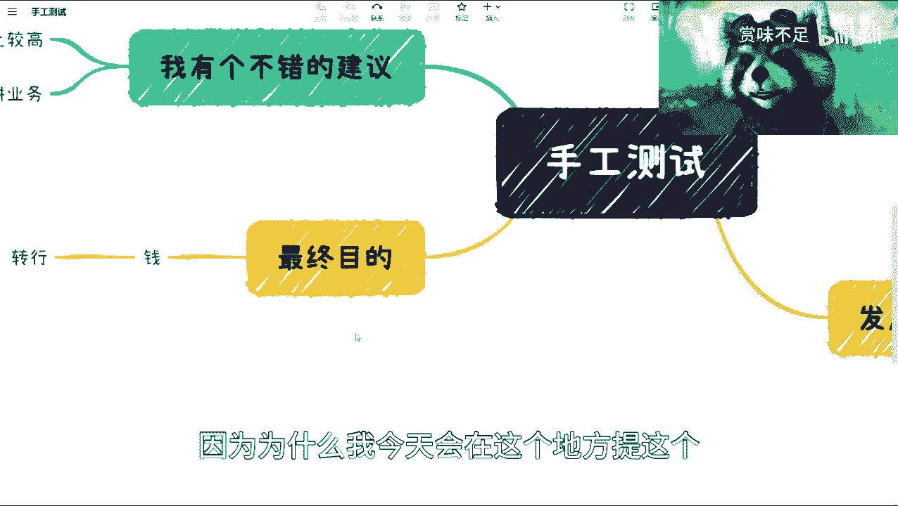

其实有个不错的建议，我觉得是重点，什么意思，就是你可以从所谓的测试用力入手。

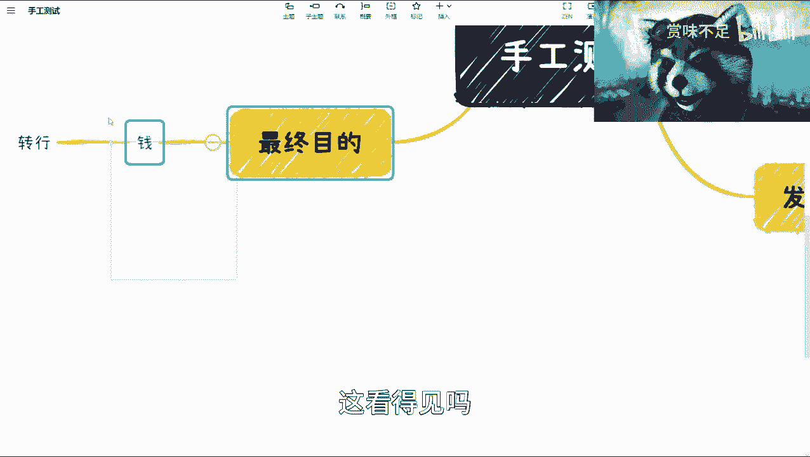

可能说这个话大家不是太理解，什么意思，就是说，我不管你今天做的是什么，哪一类，就比如说不管是这里面的哪一类，不重要。

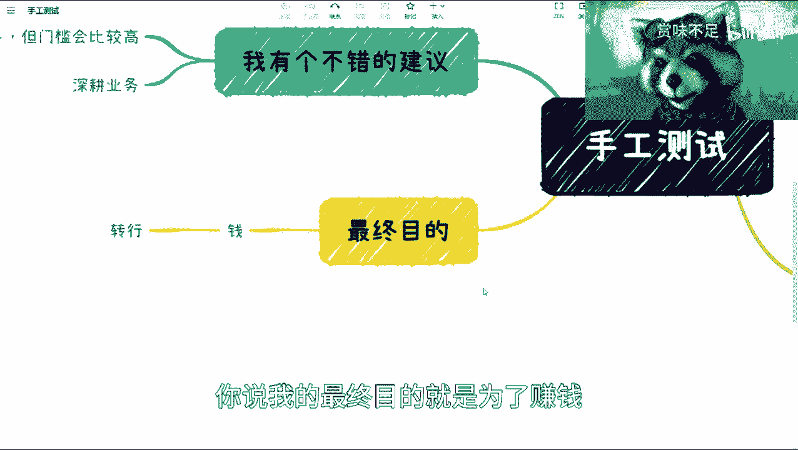

因为测试用力永远是一个通用的东西，那么我们说这个建议，更多的是需要，为什么说这个门槛会比较高，是因为它需要你拥有比较强的技术背景，同时对你的业务又有很强的认知，那么你可以从分析的角度，从技术分析。

从业务分析，综合分析的角度，来设计测试用力，这些测试用力设计，一定是有非常大的这种叫做依据去寻记的，不是单纯的说，我们今天用胆加烈，边界，燃烟果图这些，它并不是，更多的是case by case说，好。

用力是不是因为跟某些接口，某些业务有关，然后在后台服务运行的时候，它是不是跟它的时序有关，对吧，我如果来说网络不好了，某些时候这个服务器假装我，比如说我默克，它没有返回值或者怎么样子，等等等。

你得通过对整个业务架构，技术架构非常清晰的了解之后，进行分析来做设计，那么这种我觉得，无论你做的到底是什么手工也好，不手工也好，什么测试，我相信团队都会明白你的价值，都会明白你的价值。

但是这一点其实在大部分书，或者说大部分的这种网络上面，包括你的mental，我估计都不太会去讲，为什么，因为我还是以前那个观点，在我看来，做测试的人也许很多，但是真正懂得明白测试价值的很少。

他不知道测试到底应该做什么，或者说你就像一个人升级。

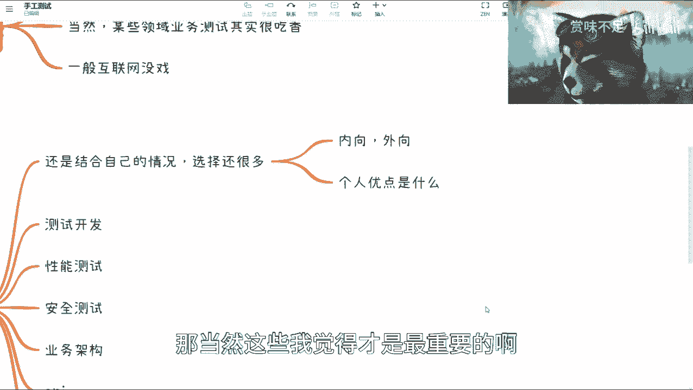

你一直往后升，你的技能点应该怎么点，不知道，不知道，那么正因为我们作为一个正常的人，普通人，我们需要在这个社会上活下去。

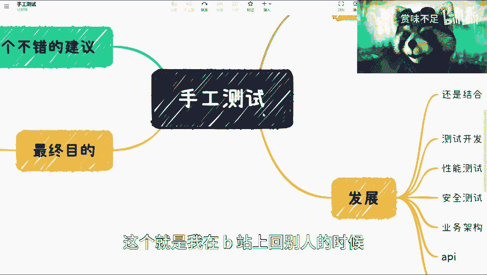

所以说如果这个社会大部分的人不知道，那么我们没有必要去跟他们硬刚，对吧，你跟他们硬刚，最终结果其实是不好的，对吧。

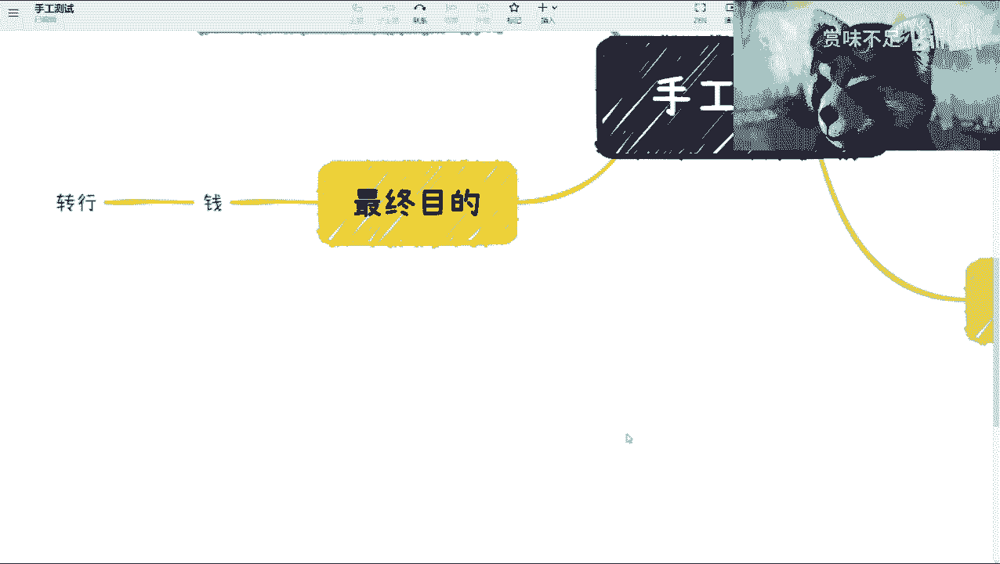

所以说我才会在这个地方写，如果你的最终目的是为了钱，那么请你转好，这是大环境造成的，没有办法，没有办法，那么所以说在这个地方，就是说，如果你能够有一个相对好的技术背景，又有一个对业务比较了解的。

这么一个认知，同时你脑子比较灵活，那么我觉得可以从这个角度入手，但是这个就是，一门槛比较高，二你得真的是深耕你的业务，因为这种方式去做，单纯的技术了解，完全是不够的，但是业务了解，它又不是那种。

就是说完全有一个什么业务文档，给你读，对吧，你说我认真一点，花个两三天可完成本书也没用。

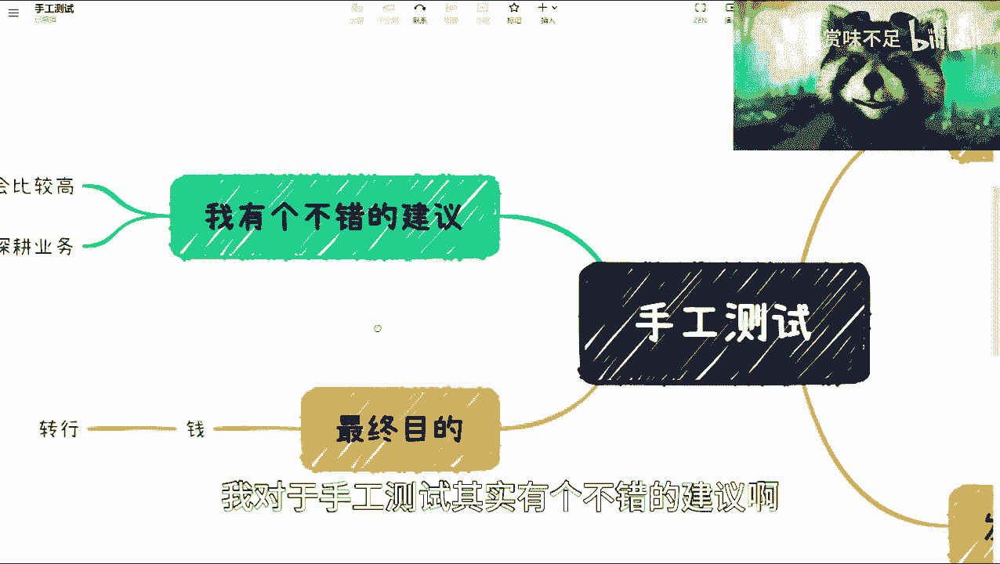

它需要日积月累的一个积累，好吧，手工测试，我觉得就讲这些，因为也没什么太多好讲的，你说今天一个视频打开，他来教你说等加雷编辑，这个已经没有意义了，因为我要告诉大家是什么。

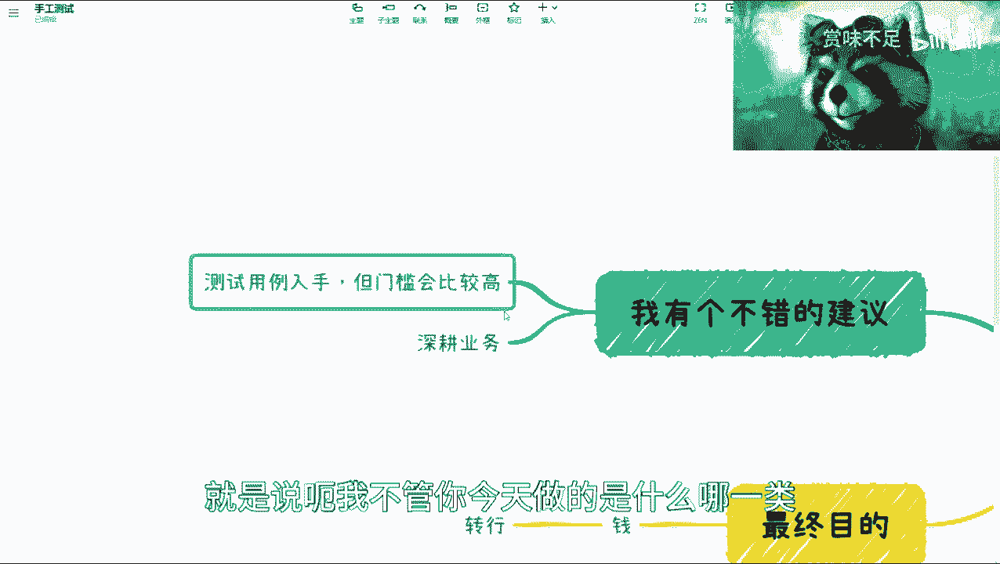

我所有的视频，你们去看，不管是讲区块链还是讲测试的，所有的视频。

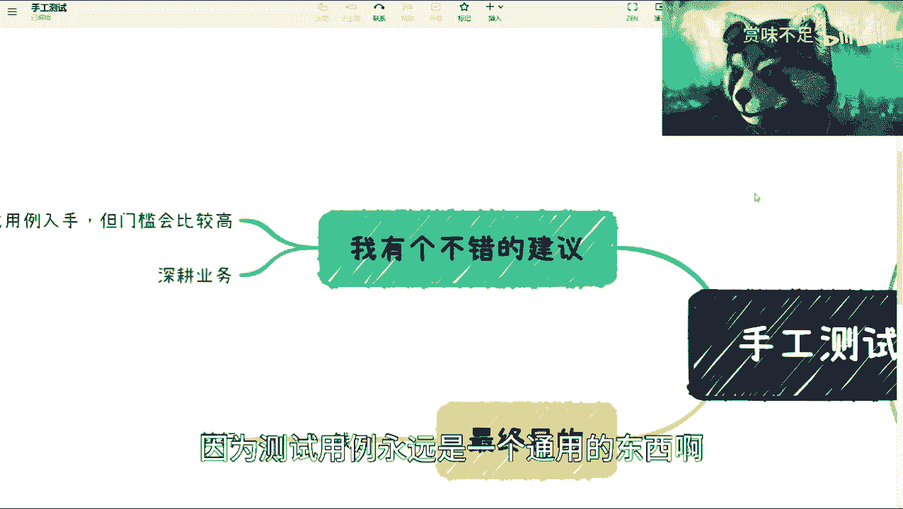

我的观点输出最终的目标，是什么，是为了钱，是为了钱，我并不是非常关心，说里面到底要用到什么技术，或者用到什么很牛逼的，什么钱的东西，或者你说怎么样，我会告诉大家，怎么样的建议，对你们来讲。

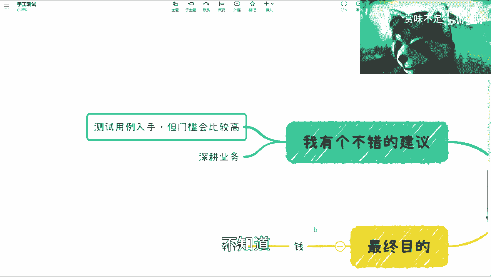

最终能够赚到钱，能够赚到钱，这个才是核心的，别的都是假的，好吧，OK，那么我觉得手工就讲到这，好吧，然后后面的话，我会单独先列一个价值，我把价值详细列一下，因为我发现，就真的像我说的，就是做的人多。

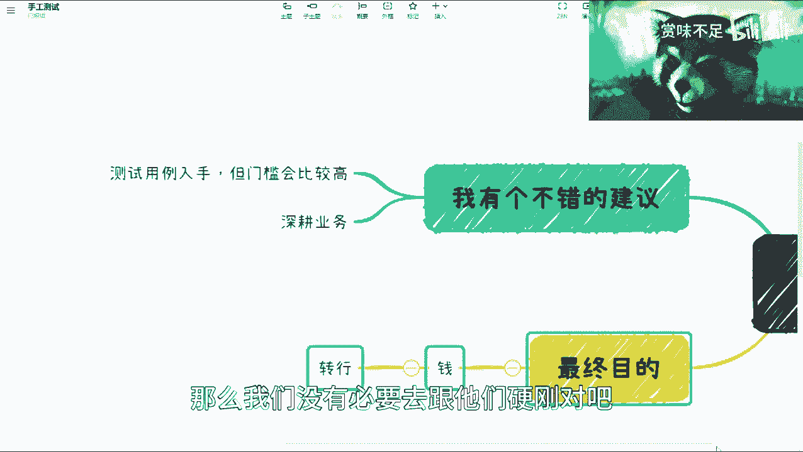

懂的人少，好吧，那谢谢大家，先到这，拜拜。