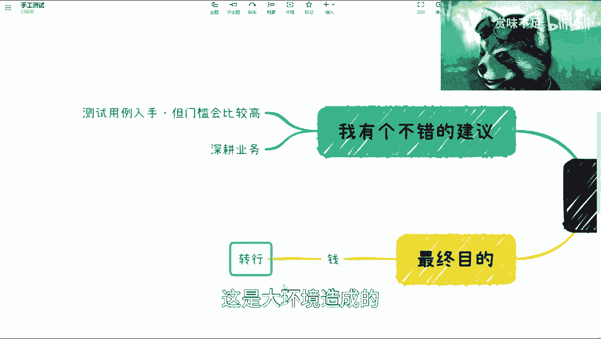
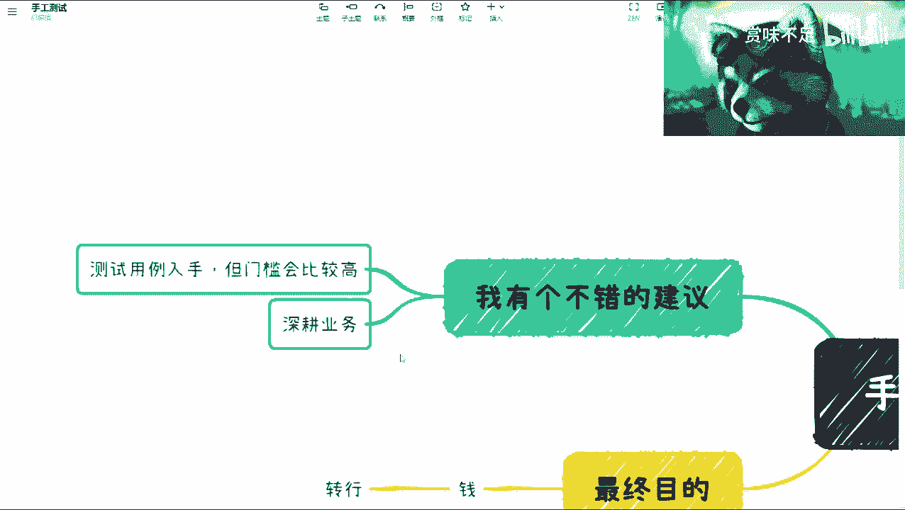
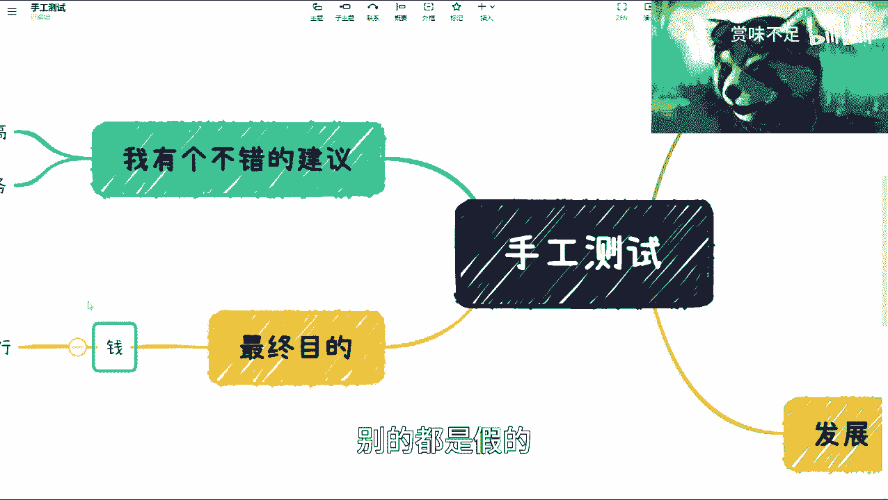
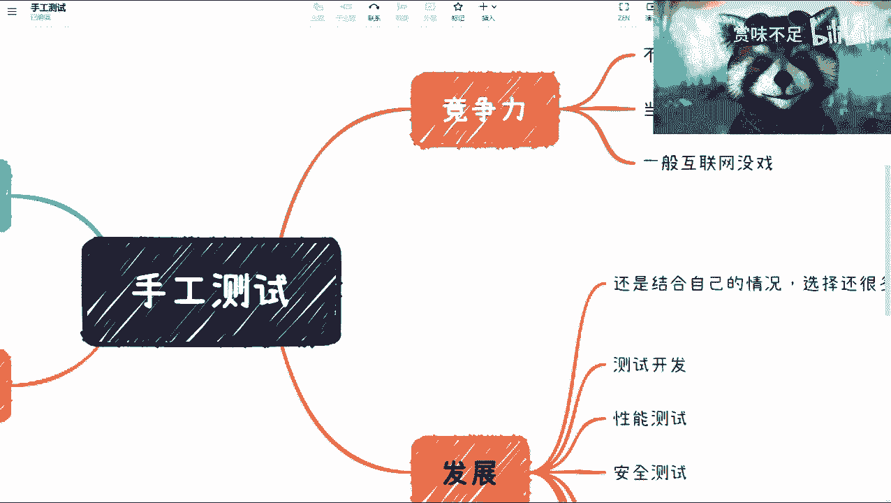

# 2023年软件测试之手工测试发展分析 - P1 - 赏味不足 - BV1ud4y1p7GV

嗯好大家好啊，我是上微不足。

那么呃也很感谢之前大家对这个视频的支持哦，我看了一下，就是反馈还是蛮多的，呃首先在这个地方呢我想再说一点。

因为我看了一下这个视频的完播率啊，其实不高，呃。

但是呢其实大家问的问题呢，都还是这比较尖锐的啊，所以我想在这地方先提先这个补充一句，就是希望大家能够看完好吧，因为我那个每一期讲呀，我也不会说他说太久对吧，我希望大家看完。

因为大家其实有一些关心的问题呢，其实视频里都有啊，只不过就一般来讲，像一些这个发展啊对吧，或者其他一些我是放在后面的。

好吧，啊呃那么这一次呢就按照我们之前的。

就我列的之前的那个计划呢。

就这次讲的是mu对吧，mu test，那么首先在这个地方呢。

我得先先提一句，就是呃所有东西他不能一概而论对吧，就比如说我今天讲的东西，你说你适合100%的人，那不可能对吧，所以我得把所有的前提讲清楚。

什么意思呢，就是说如果今天你做一个test对吧。

你的一个目标，你说我我不管你过程是什么啊，你的最终目的是为了赚钱，那么我就明确告诉你，你群里转行啊，我就明确告诉你已经转行，我可以一棍子打死，请你转行啊，那如果你今天你的目的说你的最终目的说哎。

我不单单是为了钱啊，我可能有这个人人生目标对吧，或者这个完成成就啊，我呢有别的方式赚钱。

或者我很有钱，那ok啊，那就继续听我讲啊好吧，继续听我讲啊。

那当然你转行业得继续听我讲啊，但是你可以绕过一开始的这些内容对吧，呃那首先啊我觉得是这样子的，就是从竞争力来讲呢，我觉得一般一般的互联网公司，传统公司以及大部分的一些中小型企业。

我可以一棒子打死都没有竞争力啊，你想都不用想，我不管你到底做的怎么样，没有竞争力啊，那当然这个测试本身呢，它其实还是有很多的这个东西可以深挖的对吧，那这个我回头会单独再开一期视频跟大家讲，详细讲一下啊。

这个所谓的价值点到底到底到底在什么地方啊，因为企业也好，行业也好，社会也好，认为这个岗位或者这个职业没有价值，但并不代表它没有深度啊，深度肯定是有的，而且很深啊，那么嗯那么那么当然啊。

在这个地方我提了一嘴，就是某些领域，我们说比如说像航空啊，金融啊对吧，或者制某些制造业对吧，尤其是金融啊，它的里面的这个业务，尤其是测试也好，我们叫做质量保障也好，是非常重要的哦，是非常重要的。

就是说它的重要等级会比开发持平，或者比开发来的高啊，但是这个也只是在某些特定的领域啊，某些特定领域，那么大部分你们其实只要做过的，我相信但凡只要做过的对吧，外包公司啊，中小型企业啊，互联网公司啊。

你们都会明白，作为一个手工测试，你们是没有任何价值的啊，毫无疑问，嗯那当然了，我觉得这个话可能不太妥当啊，就你们是有价值的，但是没有上升空间啊，没有上升空间，而且这个价值。

我觉得和和大家的付出也是不成正比的，那么这是一个那么发展呢。

我觉得大家可以这么理解呃，manutest，这边呢除了啊我这个地方有个不错的建议。

待会我们再来看啊，就除了你现在比如说呃，已经在做我这个不错的建议了，亦或者来说是一个啊，这个跟我刚刚说的这个呃金融领域啊对吧，或者某些呃咳咳咳比较看重测试领域，那除了这些情况以外，我觉得啊。

就是他大概率其实是一个属于那种叫做，我们打过游戏的，都知道他属于一个初始角色啊，什么初始角色呢，就是说你作为一个手工测试，你往后发展可以有很多转型的方式，比如说测试开发性能啊，安全啊，业务架构啊。

接口啊，自动化，区域集成啊，对吧等等等等，我就不说了对吧，其实你有很多的这种这个转行的，也不是转行，就这个发展的方向，我们在游戏里面叫转职对吧，或者这个升级对吧，但是呢我觉得这个事情呢。

其实主要还是得要结合你自己的情况啊，因为为什么我今天会在这个地方提这个。

这看得见吗，我看看啊，看得见就提这个钱的事情呢。

是因为如果你现在是一个手工测试，你说我的最终目的就是为了赚钱。

那好那我觉得就是说这些你都别去考虑了，请你转行哦，斩金斩钉截铁，请你转行对吧，那当然你说你要往下发展呢，我觉得你就得结合自己的情况，因为有很多的人做，他只关心，比如说到网上cs d n啊对吧。

这个各个地方去搜啊，测试应该怎么发展，然后有很多人会跟你说啊，这样发展这样发展，这样发展对吧，但是呢有个很大的前提，你得结合你的整个人情况，什么意思呢，我在这地方有，我给大家那个再细分一下。

你比如说这个性格内向外向啊对吧，外向啊，诶诶诶诶诶对吧，嗯你的这个叫什么个人优点是什么，对吧好，我们来举个例子啊，比如说你这人长得很好看，颜值很高啊，那我觉得你有很多种别的方式对吧，你可以做直播对吧。

或者你可以做别的，不代表你只有做这个那性格外向内向，你也决定于你最终的这个转行，你说你是是不是说要做销售啊对吧，是不适合出去谈生意啊，是不是要创业啊对吧，包括就是你适不适合，就是在我们上几期视频里面说。

你是不是和转区那个做产品经理，项目经理啊对吧，因为有很多人他没有去关心过他自己，到底优点是什么，他也没有关心过他自己到底要什么，那当然也有很多人会说，他说ok，那我现在根本就不知道我的擅长是什么对吧。

我也不知道我优优缺点是什么，那没有关系啊，你想办法先解决这个问题啊对吧，就是你有问题你要去解决，你不解决，你拖着你过了10年20年你还是解决不了对吧，所以这就是到那个时候，尤其像你。

比如说像现在为什么我会录这个视频，就是因为其实互联网走下坡路之后，现在经济受影响之后，其实整个就是说测试也好，开发也好，互联网里面岗位也好，有非常多的东西已经开始，就是说从隐性变显性了对吧。

那么这个时候就应该去考虑起来了对吧，你比如你你就像有很多人转行，他说我后面转成产品经理，转成项目经理，转成销售，他说我做的还是不是对啊，为什么呢，其实跟你的很多的这个内因是有关的对吧。

那你说是因为你不懂技术吗，不可能你说你不懂业务嘛，也不可能对吧，你比如说你做一个销售，你看看你技术只要做到30分对吧，业务你比如说呃了解到个四五十分对吧，剩下的可能是你更多的是你要了解，就说哎。

我怎么让这个这个这个这个case去成交对吧，我怎么能让别人明白我到底卖的是什么产品，我怎么能把这个产品包装好，这个是核心能力，但这个核心能力是一些技术能力吗，并不是对吧。

因为这些其实是更多的跟你这个人有关系啊，我见过无数的小说，那sap google的microsoft的或者其他的，就我们会发现他们的专业能力强吗强，但是他们所表现出来的能力。

并不仅仅是靠所谓的日积月累的锻炼出来的，不是的，是跟他们个人的性格，跟他们个人的这种，就是叫做这种有些天生的东西是有关系的，他们相当于是说更多的是让自己的这个优缺点，发挥到了极致对吧。

那当然这些我觉得才是最重要的啊，所以说为什么我们说啊，这个就是我在b站上回别人的时候。

我会我也会说啊，我说啊选择大于努力对吧，我现在所有的话我都说选择大于努力，为什么，因为努力的人太多了，我见过太多努力的人了对吧，包括就是评论的私信了，就你们不用说，我都知道你们很努力。

但是你们就是很多人都会问他说我努力，我非常努力对吧，他说沈总，你24小时打12小时游戏，我24小时看24小时书，那为什么我现在怎么样怎么样怎么样，那么首先问题在于你努力是努力的。

你得看你的方向和你个人能不能match对吧，你说你个人不好好去审视你的优点，不去发现你擅长什么，你再去努力。

如果方向不对，那有什么用呢，对不对啊，那么在这个地方呢，我对于手工测试其实有个不错的建议啊。

这个我觉得是重点啊，什么意思呢，就是你可以从所谓的测试用例入手啊，可能说这个话大家不是太理解，什么意思呢，就是说呃我不管你今天做的是什么哪一类。

就比如说不管是这里面的哪一类啊，不重要。

因为测试用例永远是一个通用的东西啊，那么我们说这个建议呢更多的是需要，为什么说这个门槛会比较高呢，是因为它需要你拥有比较强的技术背景，同时对你的业务又有很强的认知，那么你可以从就是分析的角度。

从技术分析，从业务分析，综合分析角度来设计测试用例啊，这些测试用例设计一定是有非常大的，这种叫做这个叫做依据是循迹的啊，不是单纯的说我们今天用等价类边界，然银果图啊，这些它并不是哦。

更多的是k400 k说啊，好这个用力啊，是不是因为跟某些接口对吧，某些业务有关啊，然后在那个呃，这个这个后台服务运作运行的时候，它是不是跟它的时序有关对吧，我如果来说网络不好了。

那某些时候这个服务器假装我，比如说我moke，它没有返回值或者怎么样子等等等，你得通过就是就是对整个业务架构，技术架构非常清晰的了解之后，进行分析来做设计，那么这种我觉得无论啊无论你做的到底是什么。

手工也好，不手工也好，什么测试，我相信团队都会明白你的价值哦，都会明白的价值，但是这一点啊，其实在嗯大部分书，或者说大部分的这种网络上面，包括你的mental，我估计都不太会去讲，为什么呢。

因为我还是以前那个观点，就是在我看来做测试的人也许很多哦，但是真正懂得明白测试价值的很少，他不知道测试到底应该做什么，那或者说你就像一个人升级，你就一直往后升，你的这个技能点应该怎么点，不知道哦。

不知道，那么正因为我们作为一个正常的人，普通人啊，我们需要在这个社会上活下去，所以说如果这个社会大部分人不知道，那么我们没有必要去跟他们硬刚对吧。

你跟他们硬刚，最终的结果其实是不好的对吧，所以说我才会在这个地方写，如果你的最终目的是为了钱，那么请你转行，这是大环境造成的。

没有办法啊，没有办法，那么所以说呢在这个地方就是说，如果你能够有一个相对好的技术背景啊，又有一个对业务比较了解的这么一个认知啊，同时你脑子比较灵活啊，那么我觉得可以从这个角度入手。

但是呢这个呢就是一难门槛比较高，二难你得你得真的是深耕你的业务啊，因为这种方式去做单纯的技术了解，完全是不够的，但是业务了解呢，他又不是那种，就是说完全有一个什么业务文档给你读对吧，你说哎我我认真一点。

花个两三天啃完这本书也没用啊，他需要日积月累的一个积累好吧。

那个这个这个这个手工测试呢，我觉得就讲这些，因为也没什么太多好讲的啊，你说今天一个视频打开啊，他来教你说等价类边界值，这个已经没有意义了啊。

因为我要告诉大家说说是什么呢，就是我所有的视频你们去看，不管是讲区块链还是讲测试的啊，所有的视频我的观点输出最终的目标是什么。

是为了钱啊，是为了钱，我并不是非常关心说啊，这个里面到底要用到什么技术，或者用到什么很牛很牛逼的什么前沿的东西啊，或者你说怎么样，我会告诉大家怎么样的建议，对你们来讲。

最终能够赚到钱啊，能够赚到钱，这个才是核心的，别的都是假的。

好吧，ok那么我觉得手工就讲到这吧好吧，然后后面的话我会单独先列一个那个价值啊，我把价值详细列一下，因为我发现哎呀就真的像我说的，就是做的人多，懂的人少好吧。

