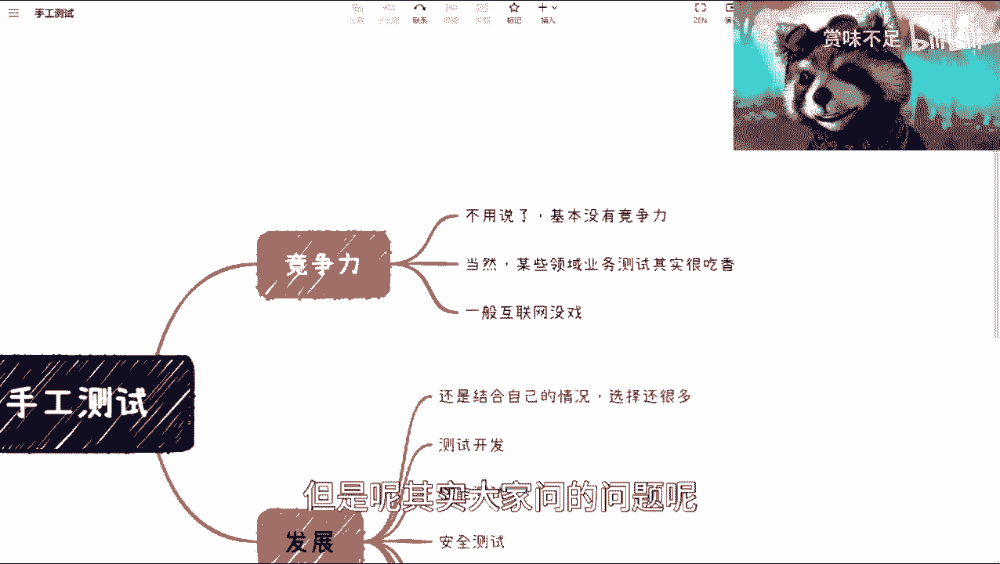
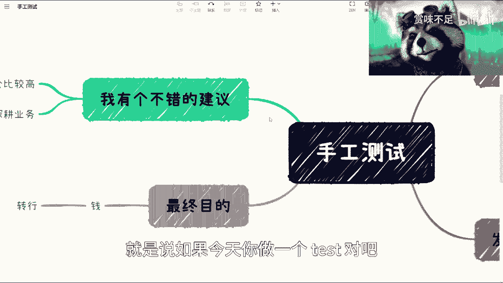
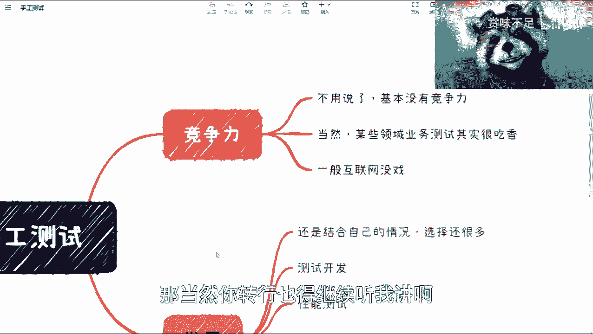
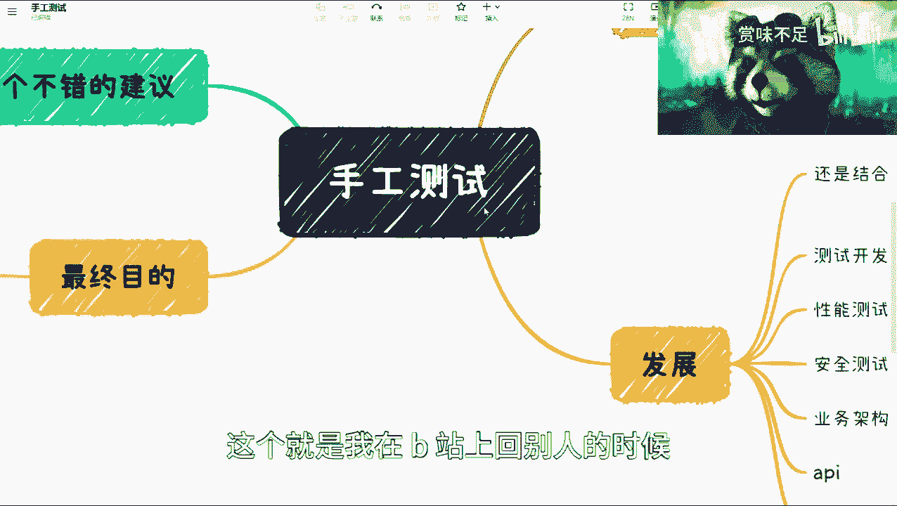
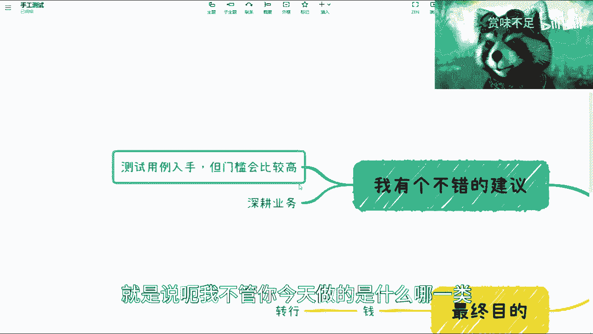
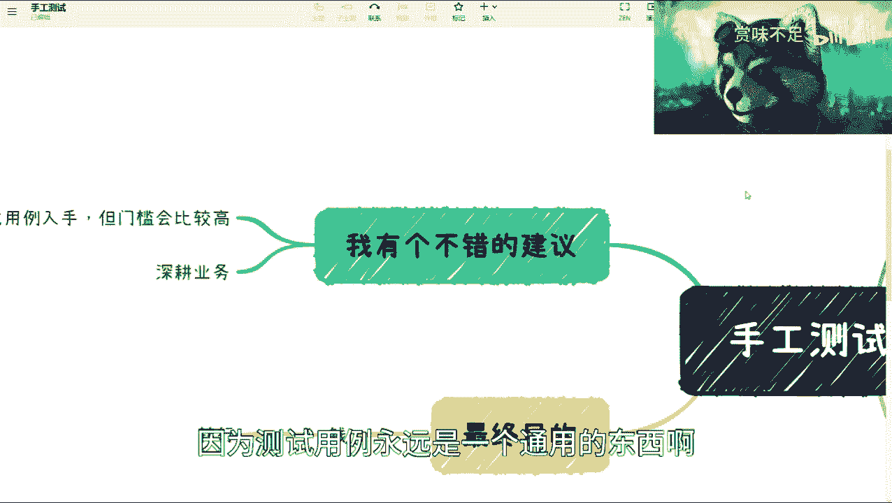
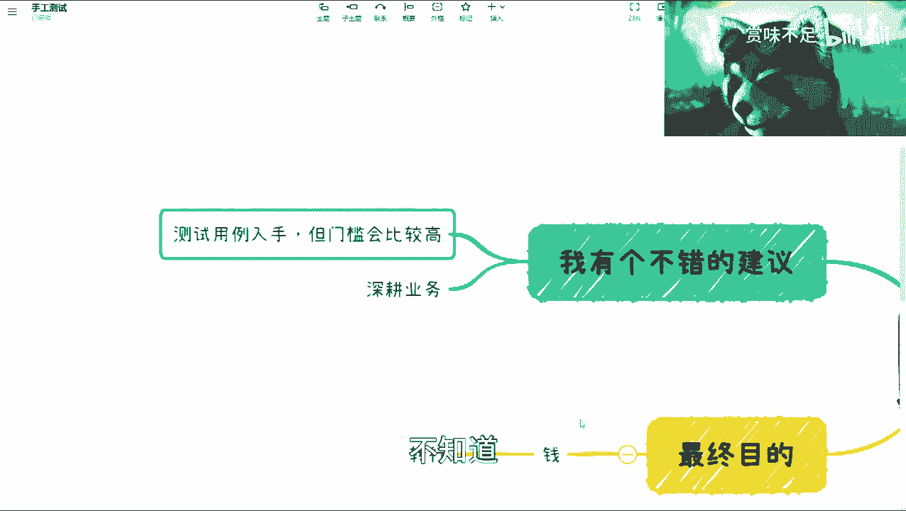

# 软件测试课程 P1：手工测试发展分析 💡

在本节课中，我们将深入探讨手工测试在当前行业环境下的发展前景与个人职业规划。我们将分析手工测试的竞争力、发展路径，并提供一个核心的进阶建议，帮助你理解如何在这个领域找到自己的价值定位。

## 概述与前提

首先需要明确一个前提：所有情况不能一概而论。如果你从事测试工作的最终目的**纯粹是为了赚钱**，那么明确的建议是：请考虑转行。如果你的目标包含个人成就、人生规划，或者你本身有其他收入来源，那么可以继续深入了解。

上一节我们明确了讨论的前提，本节中我们来看看手工测试在一般市场环境中的竞争力。

## 手工测试的竞争力分析

在大多数互联网公司、传统企业以及中小型公司中，手工测试岗位**普遍缺乏竞争力**。这个结论与个人能力高低无关，而是由市场供需和岗位价值认知决定的。

虽然手工测试岗位本身有很深的技术和业务内涵，但企业和行业普遍认为其价值有限。这导致从业者付出与回报不成正比，且职业上升空间狭窄。

当然，存在一些例外领域。以下是手工测试价值较高的特定领域：

*   **金融领域**：业务复杂性和合规性要求极高，测试或质量保障工作的重要性与开发持平甚至更高。
*   **航空领域**：对安全性和可靠性有极端要求。
*   **部分高端制造业**：涉及复杂控制系统和硬件软件集成。

对于大部分从业者而言，尤其是在外包公司、中小型企业和普通互联网公司，手工测试的价值感较低是普遍感受。

## 手工测试的发展路径

我们可以将手工测试理解为一个“初始角色”。从这个起点出发，有许多可能的“转职”或发展方向。

以下是手工测试可能的一些转型方向：

*   测试开发
*   性能测试
*   安全测试
*   业务架构分析
*   接口测试
*   自动化测试
*   持续集成/持续部署（CI/CD）工程师

然而，选择哪个方向，绝不能盲目跟随网络上的通用建议。**选择大于努力**。最关键的一步是结合个人内在因素进行综合判断。

你需要审视以下几个核心个人因素：

*   **性格特质**：内向还是外向？这决定了你更适合技术深耕还是与人沟通（如产品经理、项目经理、销售）。
*   **个人优势**：你的独特优点是什么？（例如：逻辑思维强、沟通能力好、颜值高可用于直播等方向）
*   **核心目标**：你真正想要的是什么？（财富、成就、稳定、挑战）

许多人非常努力，但方向与自身特质不匹配，导致事倍功半。努力是必要的，但让努力生效的前提是方向正确。如果你不清楚自己的优势，那么首要任务是解决这个问题，而不是盲目努力十年。

## 核心进阶建议：从测试用例入手 🎯

对于希望深耕测试领域、并提升自身价值的手工测试从业者，我有一个核心建议：**从分析和设计高质量的测试用例入手**。

这个建议的门槛较高，因为它要求你同时具备较强的技术背景和对业务的深刻理解。其核心思想是：**测试用例的设计应基于严密的技术与业务分析，而非机械地套用等价类、边界值等方法。**

你需要能够分析：
*   某个测试点是否与特定接口或后台服务逻辑相关。
*   业务流程的时序是否会影响测试结果。
*   在网络异常、服务模拟（Mock）失效等情况下系统的表现。

**公式化的高级测试用例设计思路可以概括为：**
`高级测试用例 = f(技术架构分析, 业务逻辑分析, 异常场景推演)`

这种方式设计出的测试用例，依据充分，能有效发现深层次问题。无论你名义上是“手工测试”还是其他角色，团队都能清晰地认识到你的价值。

然而，这种深度在大多数培训、书籍甚至你的mentor那里都很少被强调。因为行业现状是：做测试的人很多，但真正理解测试核心价值的人很少。

## 总结与核心观点

本节课我们一起学习了手工测试的发展分析。我们认识到，在普遍的市场环境下，单纯的手工测试岗位竞争力有限。个人的发展必须结合自身特质（性格、优势、目标）来选择方向，牢记“选择大于努力”。

对于有志于在测试领域建立高壁垒的从业者，可以通过**深度融合技术与业务知识，从分析和设计高阶测试用例**这个角度切入，从而构建不可替代的专业价值。

最后，重申本系列课程的核心输出目标：**提供能帮助你最终赚到钱的务实建议**。所有技术讨论和职业分析的最终落脚点，都在于如何让你的努力更有效地转化为市场认可的价值和回报。