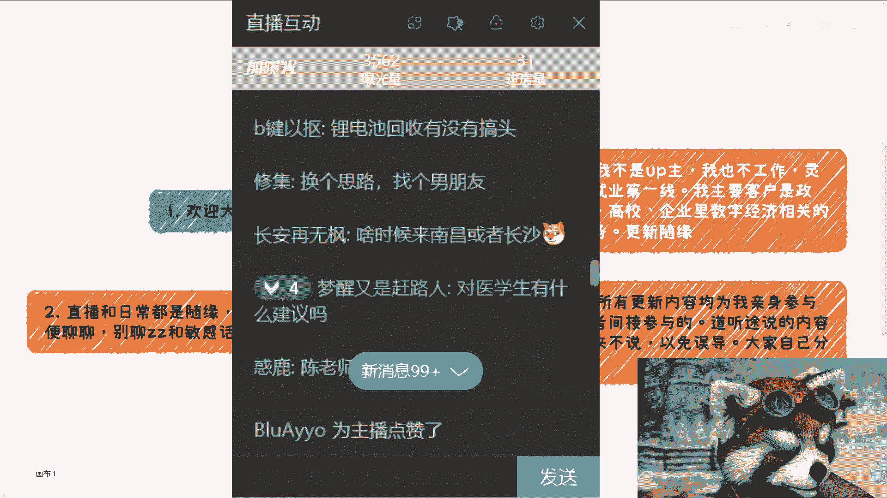
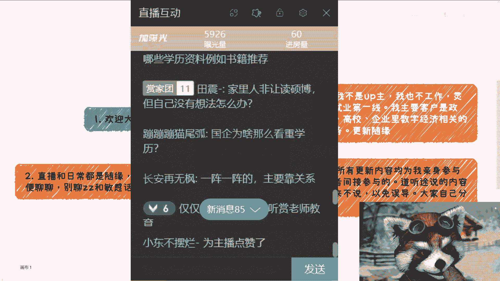
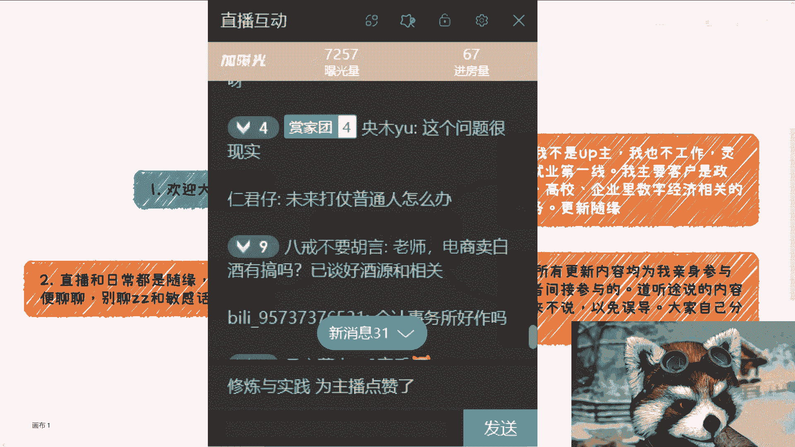
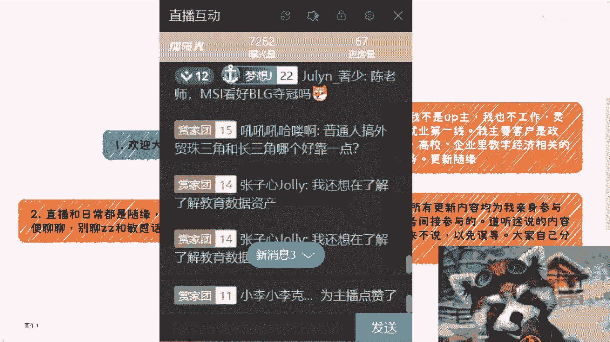
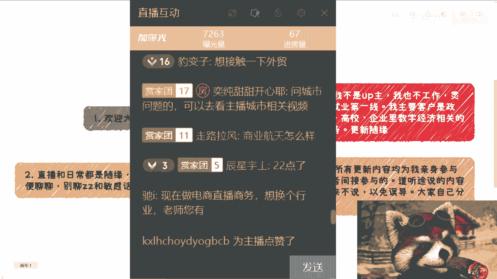

# 20240421直播录播回放---P1---赏味不足---BV1Ys421P7QW

在本节课中，我们将一起回顾一场直播问答的精华内容。主讲人针对观众提出的关于行业前景、职业选择、创业方向等众多问题，给出了直接且务实的看法。课程将帮助你了解当前市场环境下的机会与挑战，并为你的个人规划提供参考。

## 概述

本次课程内容源自一场即兴的直播互动，涵盖了从新能源、Web3到传统行业、个人职业发展等广泛话题。主讲人基于自身观察和经验，对各类问题进行了一一回应。我们将这些分散的问答整理归纳，旨在为你呈现一幅关于当下“搞钱”与“生存”的务实图景。

---

## 一、 关于行业与赛道选择

上一节我们概述了课程内容，本节中我们来看看主讲人对一些具体行业和赛道的看法。

对于“现在有什么可以搞的”这类宽泛问题，主讲人指出，当前最难做的是面向消费者（C端）的业务，因为企业端、政府端和高校端普遍资金紧张。

以下是针对一些具体领域的问答整理：

*   **新能源与电动车**：电动车出海是目前可见的方向，但新能源电池领域已经比较成熟，该做的都做了。光伏行业在国内主要由国企央企主导，个人机会较少，可以考虑往澳洲等海外市场发展。
*   **抖音/短视频**：可以做，但有固定的模式和套路，成功与否取决于具体方向和操作方法。
*   **餐饮与实体行业**：明确不建议进入。
*   **养老行业**：有搞头，但大城市很难做，在小城市可能需要一定的关系资源。
*   **不良资产**：一直有机会，主要看关系是否到位。
*   **医美行业**：永远是最赚钱的行业之一，但需要有资源。
*   **AIGC/人工智能**：主讲人认为AI风口已过，当前的经济和就业问题并非AI导致。单纯卖AI课没有意义，关键要知道卖给谁、有无渠道。
*   **Web3/区块链**：若想深耕，建议去海外。国内Web3项目很多是资金盘，但区块链和Web3不是同一个概念。
*   **游戏行业**：国内是“地狱模式”，不建议进入。独立游戏若要做，也建议面向海外市场。
*   **电商**：现在小白入场成功率非常低，需要事先投入大量资金。
*   **跨境电商/外贸**：仍有前景，特别是将国内模式复制到东南亚、非洲等第三世界国家。
*   **白酒行业**：一直是个很好的行业，但需要过硬的关系。
*   **心理咨询**：非正规的机构“只能去骗”。
*   **设计类（平面设计、UI设计等）**：多次被明确表示“没有前途”，理由是价值难以衡量、加班多、变现能力差。建议转行。
*   **新闻学、商务英语、数字媒体艺术等专业**：被认为就业前景不佳或专业内容与市场脱节。

**核心观点**：判断一个行业或方向有没有前景，一个简单的标准是：**你是否清楚你的产品/服务要卖给谁，以及你现在有没有现成的销售渠道或合作资源**。如果都没有，成功率会很低。

---

## 二、 关于职业发展与就业

在了解了宏观行业情况后，我们聚焦到个人职业发展上。主讲人对求职、考研、技能提升等给出了直接建议。

*   **求职**：不建议只依赖招聘平台，因为竞争过于激烈。可以多线下参加活动，特别是HR或猎头组织的活动，直接建立联系。对于“大四0 offer”的情况，答案就是继续找。
*   **考研与学历**：
    *   对“专升本失败”或“学历一般”的同学，如果自己没有突出的赚钱能力，还是建议提升学历，因为社会太“卷”。
    *   对于“硕士毕业近30岁有没有用”的问题，主讲人持怀疑态度。
    *   新兴领域的硕士（如数字经济）被认为价值不大，因为“学校自己都不知道这是什么玩意儿”。
    *   出国读硕士被视为“送钱”，香港一年制硕士回本也很难。
*   **35岁危机**：主讲人预测，计算机等相关专业的职业寿命可能到30-32岁左右。
*   **稳定选择**：如果只求稳定“苟住”，那么国企、央企、公务员是首选。
*   **外企**：如果能拿到offer，是推荐的选择，但在华外企数量本身有限。
*   **实习**：在职场中，实习生或初级员工往往是“工具人”或“电池”，难以接触到核心资源，提升有限。
*   **职场社交**：在职场内部认识的人意义不大，大家都是“螺丝钉”。有效的社交应发生在线下行业活动、沙龙中。
*   **考证书（如雅思）**：与找到好工作没有直接因果关系。
*   **第一份工作**：在Web3行业是否值得深耕？取决于你是否在海外、是否主导项目，否则意义不大。

**核心观点**：**学校教授的知识与市场需求严重脱节**。大学生在校期间学不到“怎么赚钱”，因此无论什么专业，毕业时都可能面临挑战。关键在于尽早接触真实的社会和商业运作。

---

## 三、 关于创业、副业与个人IP

对于有创业或发展副业想法的朋友，本节内容提供了许多实操层面的冷思考。

*   **创业融资**：仍然可能，但必须找到真正的“钱源”，警惕被一些地方政府或投资人的空头承诺忽悠，要“先看到钱再说”。
*   **创业上市**：当前环境下极其困难，成功率极低。
*   **个人IP与自媒体**：可以当作副业赚零花钱，**不要指望其成为主业**。投入产出比可能很低（100分努力换5分收益）。
*   **做中间人/资源整合**：这是中国商业的常态。关键在于做好信息隔离，让甲乙双方顺利合作并赚到钱，他们并不关心是否存在中间人。
*   **如何从0到1积累资源**：两个途径：1. 自己动手积累（如做自媒体、办活动）。2. 整合合作伙伴的资源。核心是“输出价值”，无论是观点还是服务。
*   **个人网站/工作室**：前景取决于营销能力，变现较薄。
*   **线下活动/沙龙**：是结识人脉、学习社会沟通规则的好地方。对于大学生，主讲人建议先去观察和学习别人如何交流、包装自己。
*   **没有资源如何起步**：主讲人坦言，大部分人都没有资源。需要主动出击，多参加线下活动，结合实践慢慢积累。

**核心公式**：`成功概率 = f(清晰的目标客户 + 现成的渠道/资源)`。在行动前，用这个标准评估一下你的想法。

---

## 四、 关于地域与城市选择

个人的发展与环境密不可分。主讲人对一些城市和地区的发展特点给出了评价。

*   **海南**：5年前是机会，现在再去就是“炮灰”。
*   **上海**：两极分化会越来越严重。优点是有钱、有政策、医疗好；缺点是“不敢浪”，整体是“温水煮青蛙”的状态。
*   **杭州**：前两年的电商、直播、元宇宙热潮已过，很多地方“人去楼空”。
*   **珠三角（如广州）**：商业思维深入人心，政策开放，推荐。
*   **苏州**：政府思路清晰、有钱、规矩，但互联网机会少，比较中规中矩。
*   **武汉**：大学生多，机会也多（“大学生约等于…”未言明的潜台词可能是消费市场或劳动力）。
*   **东北、西北**：主办方有意愿去办活动，但担心参与人数不足。
*   **一线城市**：如果为了积累资源和案例，仍然值得去。
*   **海外发展**：将中国成熟的商业模式复制到发展中的海外市场，是目前一个可行的方向。

**核心观点**：赚钱不局限于城市。很多机会在于信息差和资源差，而非地理位置。

---

## 五、 关于思维与认知提升

最后，我们来探讨一些关于底层思维的问题。主讲人的回答或许有些犀利，但值得深思。

*   **如何思考更深更全面**：思考的深度和广度取决于你的见识和经历。闭门思考是无效的，必须“去看过”、“去经历过”。
*   **如何说服家人**：当你想到“说服”二字时，就应该放弃。尊重他人命运，不要试图改变别人。
*   **普通人该怎么办**：在环境不好时，更应积极储备，建立自己的“Plan B”（如赚钱、获取其他身份）。因为环境好时，机会轮不到普通人。
*   **如何看待“风口”**：风口很多，但关键问题是“钱从哪里来”和“你能做什么”。不能落地参与的风口与你无关。
*   **如何了解真实社会**：不要只读书（信息过时且不全），要多与线下真实世界里的高手、赚钱的人交流。高校教授、政府官员、投资人都是很好的学习对象。
*   **周期与未来**：主讲人个人认为，在2030年之前经济格局不会有太大改观。需要做好长期准备。

**核心观点**：**你无法赚到你认知以外的钱**。提升认知的方式不是空想，而是投身实践，与更高层次的人交流。

---

## 总结

本节课中，我们一起学习了来自一场直播问答的密集信息。主讲人用直白的语言，剖析了多个行业现状，并为职业发展、创业选择提供了务实的建议。

核心要点可以总结为：
1.  **警惕“纸上谈兵”**：学校知识与现实严重脱节，带有“数字”、“智能”等前缀的新兴专业尤其要谨慎。
2.  **重视渠道与资源**：在任何领域成功，核心不在于想法多新颖，而在于是否有客户和销售渠道。
3.  **主动线下社交**：脱离虚拟世界，多参加线下活动，是积累有效人脉、了解商业规则的最佳途径。
4.  **保持务实心态**：放弃一夜暴富的幻想，将自媒体等作为副业，在主业或创业中追求稳定的现金流。
5.  **为长周期做准备**：对未来几年的经济环境要有清醒认识，积极储备，打造自己的抗风险能力。

希望这份整理能帮助你更清醒地看待当下的机会与挑战，并做出更明智的决策。