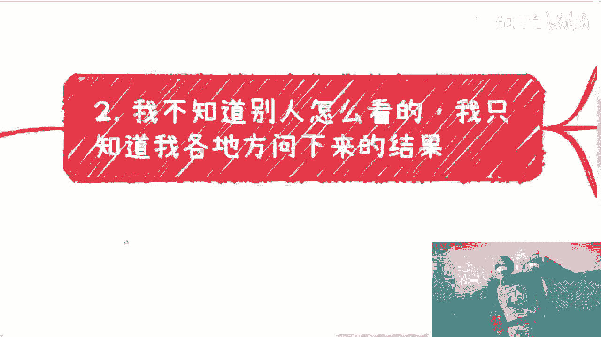

# 课程一：如何理性看待2024年1179万应届生就业形势 📊

在本节课中，我们将学习如何理性分析2024年预计1179万应届生带来的就业挑战。我们将探讨核心现实、个人应对策略以及需要警惕的陷阱，帮助你建立清晰的认知框架。

## 概述：一个无法改变的现实

首先，我们需要明确一个核心现实：2024年预计有1179万应届生，这是一个既成事实。这个数字就像“天要下雨，娘要嫁人”一样，是个人、企业乃至国家都无法控制的宏观趋势。

思考这个问题本身，并不会增加你的收入或提升你的竞争力。因此，与其陷入无意义的焦虑，不如将注意力转向那些你能控制和改变的事情上。

## 核心观点：环境严峻，幻想无用

上一节我们明确了宏观趋势的不可控性，本节中我们来看看当前环境的真实情况。

根据从各级协会、交易所及多个重点发展区域（如海南、南京、苏州、北京）了解到的信息，普遍结论是：**大家都没钱，没有预算，项目难找**。所有非痛点的需求都不会有预算支持。

因此，明年（2024年）的就业形势必然比今年更加严峻。这不是在贩卖焦虑，而是一个需要认清的客观事实。整个社会的焦虑情绪早已“拉满”，无需额外渲染。未来的基调或许是：**一切才刚刚开始**。

## 重要提醒：警惕骗局，保护自己

认清环境后，我们需要保护自己。近期反馈被骗的比例骤然提升，金额从几千到十几万不等。

以下是防止被骗的核心原则：无论对方是谁，关系多近，背景听起来多“牛”，只要涉及合作，就必须核实其背景与证明。吹嘘的内容需要事实支撑。

具体需要核实的方面包括：
*   **声称的关系**：是法律上的股东关系，还是合同约定的合作关系？要求出示证明。
*   **声称的流水/实力**：具体是哪家公司？通过“天眼查”等工具核实企业信息。
*   **声称的资源（如“产业园”）**：具体是什么角色？是运营方、招商方还是其他？要求查看相关合同或授权。
*   **声称的政府关系**：具体是哪个部门、什么人、什么性质的关系？要求明确说明。

**核心行动公式是：`质疑 -> 询问细节 -> 要求证明`**。对于任何无法提供具体证据的吹嘘，都应保持高度警惕。

## 个人行动建议：三条路径选择

了解了外部环境与风险后，我们来看看个人可以选择的行动路径。方向无非以下三种，你需要根据自身情况做出选择。

以下是三个主要的行动方向：

1.  **苟着生存**：如果你自认不擅长折腾，那么首要目标是避免损失（尤其是被骗）。找一个能维持温饱的工作，先“苟住”。这或许没有“未来”，但能避免更糟的结果提前到来。这是在矮子里拔高个的无奈选择。
2.  **提升学历**：去读书、卷学历，然后进入体制内或寻求稳定工作，这条路本身没有错。但需要清醒认识到：在当前缺乏高速发展土壤的环境下，不要对此路径抱有过高的“大发展”期望。
3.  **主动折腾**：如果你认为自己具备折腾的能力和意愿，那么应尽快行动，**As soon as possible**。核心是积累业务上下游关系。主要方向包括：
    *   **To C（面向消费者）**：直接为终端用户提供产品或服务。
    *   **To G/B（面向政府/企业）**：参与政府项目、企业服务或获取相关补贴。
    *   **出海（海外拓展）**：涉及进出口贸易或业务的国际化拓展。

具体切入点因涉及面广且敏感，在此不展开。但懂得人自然能从中找到线索。

## 总结与核心心态

本节课中我们一起学习了如何理性看待2024年的就业挑战。我们来总结一下核心要点。

第一，放弃幻想。不要幻想仅凭学历就能获得稳定且步步高升的工作，也不要幻想没有学历就绝对赚不到钱，更不要因为觉得“业务难做”而固步自封、自己吓自己。

第二，认清现实后做出选择。如果你自认不是“折腾的料”，那就好好读书、工作，扮演好社会系统中的稳定角色。如果你认为自己能折腾，那就应在守住道德底线的前提下，尽快去实践、去试错，建立自己的商业链路。**路是人走出来的，选择是自己做的。**

最后，必须清楚地认识到：无论个人如何思考，无论听到何种观点，都无法改变已然确定的大环境。因此，持续空想毫无用处。很多问题在诸多自我设定的限制条件下可能就是无解的。关键在于，不要在什么都没尝试之前，就断言“什么都不行”。**不行动，就一定没有出路。**

希望你能看明白，不必过度焦虑，因为焦虑本身无用。将精力聚焦于可执行的选择和行动上，才是应对变局的根本之道。