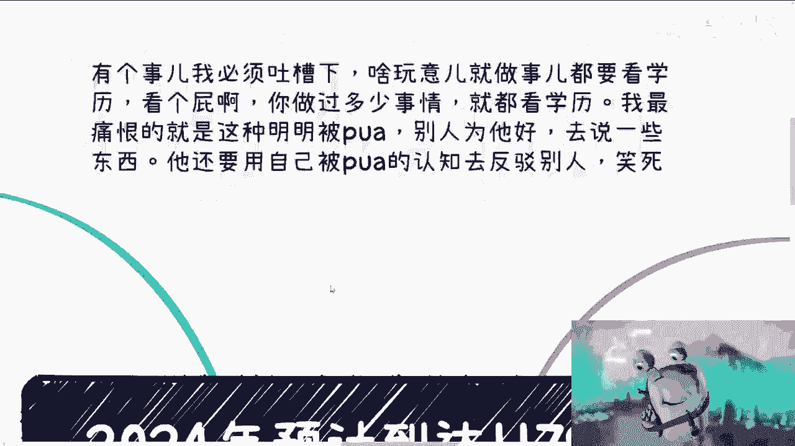
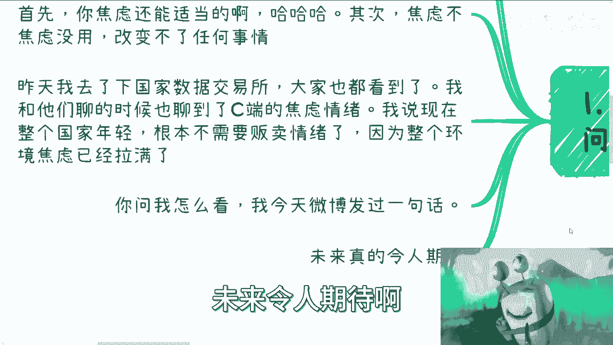
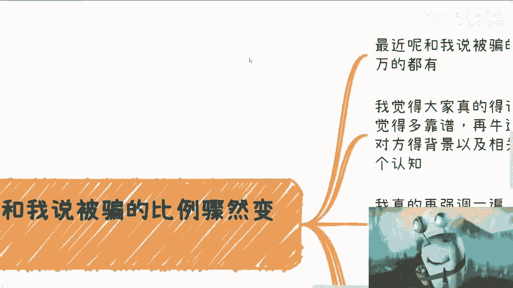

# 2024年1179w应届生，大家问我怎么看 - P1 - 赏味不足 - BV1B64y1j7cQ

嗨大家好啊，昨天都看到这个新闻是吧，那也有人猜得出来，就是我今天肯定得要给你们更新一波啊。

呃首先啊首先啊我得先说个事儿啊，这个事我真的是真的很烦，我跟你讲，我必须吐槽一下，就是昨天我们说的学历对不对，好就有人会说啊，他说不管怎么讲啊，做事情总归都是看学历的，那我就要说了啥。

他妈玩意儿做事情就要看学历，看个屁啊，啊，你做过多少事情啊，啊有多少事情你没有做过，你做过这些事情就都要看学历，对吧，哦你没有做过的事情，你都不知道，你就从来不拿来做讨论，我最痛恨的是什么。

就是这种明明被他妈的PUA了啊，别人为了他去好去说一些东西，他还要用自己被PUA的认知去反驳别人，真的他妈笑死，我跟你们说啊，所有事情都是一样的，要他就必先自救啊，自己都不想救，拉拉他妈倒啊。

好那我们先来说今天的主题啊，就2024年预计到达1179万，应届生不好啊，那很多人问我怎么看怎么看啊。

你看啊，首先昨天出来的新闻啊，呃很简单，我觉得核心点啊，就是天要下雨，娘要嫁人啊，我们控制不了，你也控制不了，我也控制不了对吧，国家都控制不了，就别去想了，有啥好想的呢对吧，你说想他干嘛呢。

我昨天你像昨天还有个人微信在跟我聊聊，我就跟他讲，我说有意义吗，就他们你知道吗，你们现在很多人问我，我就会反问他有意义吗对吧，其实我每次反问他自己想想，他就觉得没意义，为什么。

因为你想这些事情不影响自己赚钱啊，又不会增加你的收入，也不会也不会怎么增加你的，提升你的竞争力，你想他干嘛呢，对不对，我说句不好听的，你但凡能够从这1000，179万的人身上赚到钱，那你去想想也就算了。

对不对啊，那么还有很多小伙伴呢很幽默啊，他说问我是不是适当焦虑一下，首先你焦虑还能适当，我他妈服气的啊，其次呢就是说我觉得焦虑不焦虑没有用啊，因为就像我们刚刚说的，你改变不了任何事情，不是交易所对吧。

大家也都知道啊，嗯我跟他们聊的时候呢，也聊到了，就关于这个C端的情绪焦虑啊，我说现在整个国家的年轻人呃，这根本就不适用翻盘焦虑哈，你懂吗，因为整个环境已经焦虑已经拉满了，早就拉满了。

就是这个东西是存在于各种细节的，你知道吗，什么什么什么亲戚啊，家庭啊，社会环境啊，找工作早就已经拉满了，你还需要贩卖焦虑吗，啊不需要了啊，你问我怎么看，我告诉你，我今天微博发过一句话。

叫什么叫做一切才刚刚开始，未来令人期待啊。

怎么解释我不我不能解释，我不敢解释啊，第二点啊。

我不知道别人怎么看啊，我只知道我各个地方问下来结果，首先啊各个地方问下来，结果啊很简单，就是所有的地方问下，结果就一个大家没钱啊，没有前几天在哪里，没有预算，没有项目很难啊，所有非痛点的都不会有花费啊。

都不会有预算啊，那么明年从这个1100，百七十九万上面来看看呢，明年必然是比今年更严峻的这个事情呢，我也那句话啊，这句话也不是单纯我这么说，我今天去了市一级的协会，昨天去了交易所是吧啊。

我去的这些地方可以说已经是国内，可能在未来几年都会大力发展的地方，呃，包括我问了一些，比如说像海南啊，啊南京啊，各个其他地方啊，苏州啊对吧，包括北京啊啊都是给我这么一个结论啊，就是很严峻。

而且明年肯定比今年更难啊，我希望大家呢我觉得是这样子的啊，你们不要再去想那些有的没的了啊，也不要再去跟风，觉得哎呀好像现在说这些都是贩卖焦虑，对不对，我还是那句话，你们要想想看，贩不贩卖焦虑没有用。

因为我改变不了你们，我也改变不了环境，没有用的对吧，我希望大家不要再抱有幻想了，什么叫抱有幻想，就是你们会看到身边有很多人，什么这个人做电商了，那个人做什么东西啦，什么一年几个月赚多少多少万对吧。

怎么样子，几千万几百万的，我跟你讲，你就别去想着暴富了啊，我跟你这么说，你被骗的概率肯定是更高的，而且接下来很有可能就是一到3年内，满地都是骗子，为什么。

因为大家要活啊对吧，我也实话实说，大家要活嘛，那怎么办呢，对啊那么第三啊。

就是最近呢我跟你们讲啊，跟我反馈被骗的比例骤然提升啊。

呃从几千到十几万的都有啊，我觉得呢还是那句话啊，你们要不被骗，你们就一定要记住这一点，就是无论对方是谁，无论你觉得多靠谱，无论跟你的关系再近，无论再牛逼啊，无论再靠谱对吧，如果要合作。

你得问清楚对方的背景以及相关证明啊，牛皮可以吹，但是你得有证明，我发现很多人压根没这个认知啊，我真的再强调一遍啊，我以后就不想再强调了，我再强调一遍，什么跟你说关系好了，流水几个亿了对吧。

什么禅院有合作了，然后每个月固定多少钱了，然后做过多少项目了，什么政府的人认识了对吧，我跟你讲是这样子的，你要吹的嘛，没问题的啊，你让他吹，你要去了解是什么，就是关系对吧好，什么关系，法律上什么关系。

是股东还是说和合同合同上的合作关系对吧，比如说你说你跟那个公司有关系，你就跟那个公司很好关系，那什么关系是不是合伙人还是怎么样的，你得拿出来东西对吧，你说流水几个亿可以，那什么公司请查查，我去查对吧。

我跟你们讲，你们要是没有VIP的，你们没有会员的，你们可以找一些hr，让他们帮你查对吧，那禅院有合作对吧，好没问题，什么合作呢，你是禅院的什么角色呢，运营方招招商引资还是什么呢对吧，合同拿出来看看呀。

的到处吹啊，就有很多人还跟我说，哎呀我们认识一个认识一个人，他说什么成员都是他的，有什么用啊，啊政府关系好，政府什么关系啊，什么部门啊，什么人关系好啊，什么关系呢，你说清楚啊对吧，我跟你讲。

你们我一问三不知，你们真的去问那种吹牛逼的人，他他妈也是一问三不知，都他妈是骗子的啊，我跟你讲，所有东西都问清楚啊，别别人说啥信啥有什么用啊，啊还有呢就是说我能给的建议啊，我能给的建议是这样子的。

首先你们回过头去可以看看我3月份做的那期，最早的第一期，三到5年都得失业的视频，你再看看，现在你们可以去想想看，为什么我会说一切才刚刚开始对吧，我觉得建议很简单，大方向就三个啊，你要么就苟着。

你要是觉得自己不会折腾，你就别折腾，免得被骗，你找个工作随便找个什么，你觉得你自己这个能过个温饱的，能苟就苟这样，大概率我可以告诉你，未来你是没有什么未来的啊，但是未来怎么样，咱再说嘛对吧。

总比你没有什么未来，这个结果提前来来的好吧，对不对，现在就是矮子里面拔高的，你能怎么办呢，啊你要么就去读书，去卷学历，然后去搞工是可以的，我没有说不可以，但是你如果没有同样的。

你同时手上没有任何别的路可以选的话，这条路没有毛病，但是我就告诉你，你别指望有什么大的发展，我不管你是在职场里还是在体系内，为什么，因为没有这个土壤，没有这个发展中的土壤啊，最后就是如果你觉得你能折腾。

那么你尽可能的尽快去折腾啊，能折能疼则腾，能遮则则折啊，积累关系跟你的业务的上下游啊，As soon as possible，就方向无非就是你要么就是to see啊，要么就是说做政府企业的生意啊。

就是我们说的各种各样的补贴或者别的东西，要么你就出海海外的拓展啊，也有可能是跟进出口贸易有关，也有可能是啊，这个这个这个这个这个业务的海外拓展好，那么至于我们说上面的to c和政府企业。

以及海出海这几个切入点，我就不展开了啊，一方面是我不太能展开，第二方面是我也不太敢展开啊，那么我觉得懂得自然就懂啊，就不用我多说吧，因为这个东西也不是说一两句话能讲清楚的，而且但凡能讲清楚呢。

又涉及到很多敏感的东西，那就没必要对吧好，那么我们回过头来最终再来看一下啊，你说我怎么看，我觉得就是我看看讲了多久了，9分钟啊，我觉得怎么看其实很简单，就是第一呢不要再抱有任何幻想啊，就是什么啊。

我怎么弄个学历对吧，我能够什么什么找个好的工作，然后这工作我能够一步一步往上升对吧，不要啊啊，不好意思，你没有这个机会，大概率你没这个机会，我我虽然不能一棒子给你打扫，大概率你没这个机会。

第二就是哎呀我没有学历对吧，我学历搞不好对吧，我在外面赚不到钱，也不是的啊，也不是的，第三就是说很多人会觉得哎呀，我这个这个很多业务对吧，我们老百姓做不了的，我也不知道怎么做对吧。

然后就开始不停的固步自封啊，然后自己吓自己也不要啊，我觉得最大的建议是什么，就是你要是觉得你真的觉得你折腾不了，你不是这块料，你不是这种这种人，那我就跟你讲，你就该好好读书，好好读书，好好工作。

好好工作，该好好当电池，就好好当电池啊，你要但凡觉得能折腾的，我就跟你讲，你就尽可能的去搞，我不管你怎么搞，就是不管是草台班子搞还是正规搞，还是你去割，我不管只要商业链路上是走得通的，那当然我就说啊。

就是在这个道德底线上对吧，你得守住你的道德底线，你不能说啊，什么什么到处抄别人的吧，或者怎么样对吧，你但凡有自己的商业链路，你去做啊，我觉得这是你该怎么折腾，怎么折腾，否则没有没有别的方式呀。

那有什么方式对吧，因为我就这么跟你们讲清楚地认识到一个现实，就是无论你怎么想，无论我怎么想，无论别人任何人怎么说，无论你们在未来刷到任何的观点，都不会改变，大环境没有用的。

而大环境已经是确定了的事情了对吧，所以说你你说就想它有什么用呢，没有用啊，好吧嗯，对反正基本就这样，就是我只是希望你们能明白，就是现在的这个情况呢，呃他不是像我们解数学题，或者解一个某一个东西。

就是说呃语数外对吧，或者说那个物理化学，就不是说这件事情一定有解，我就可以明确跟你们讲，很多事情就是无解的，你知道吗，就是解也许终究是有的，但是如果你把自己框在了很多的前提条件下，然后你问我。

你说陈老师有什么解，那的确无解啊对吧，就像很多人说哎呀我又不能换成是我又不能，我又不能换专业对吧，我又不能怎么样子，哪来这么多不能呀，对吧，路是人走出来的，选择是自己选的啊。

你你你你很多东西都把自己框住，就那就跟我今天一开始吐槽这个这个一样的，就是你根本就什么都还没做过，还没尝试过，你就开始在那边说啊。

这些东西都不行的，那那那那那还做啥别做了啊，行吧，就这么着吧，我希望大家能看明白吧，不用太焦虑，真不用太焦虑，焦不焦虑没用啊，对吧嗯行，就这么着吧啊然后你们有什么呃，就这么说吧，你们有小问题的。

你们就私信给我问我，我都会回来啊，只要不是那种伸手党，我都回来啊，你们要觉得有些大的问题对吧，你像最近这个找我要合合伙做商业的对吧，或者说什么合同看不懂的呀对吧，或者或者说就之前被骗了。

怎么怎么能够提升自己这个防骗的技术对吧，等等等等，你们要是有自己的这种发展上的问题，你们可以总结好好吧。

