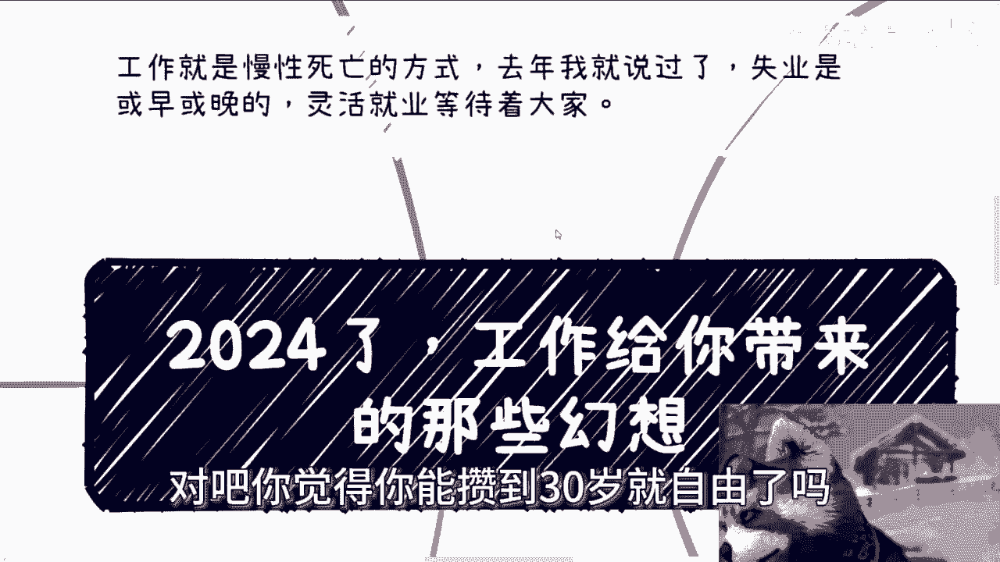
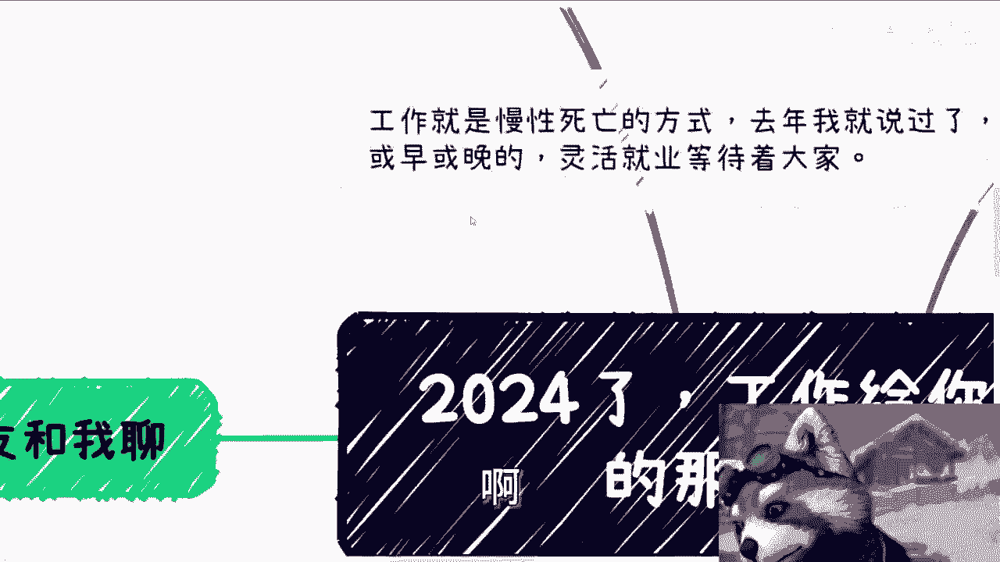
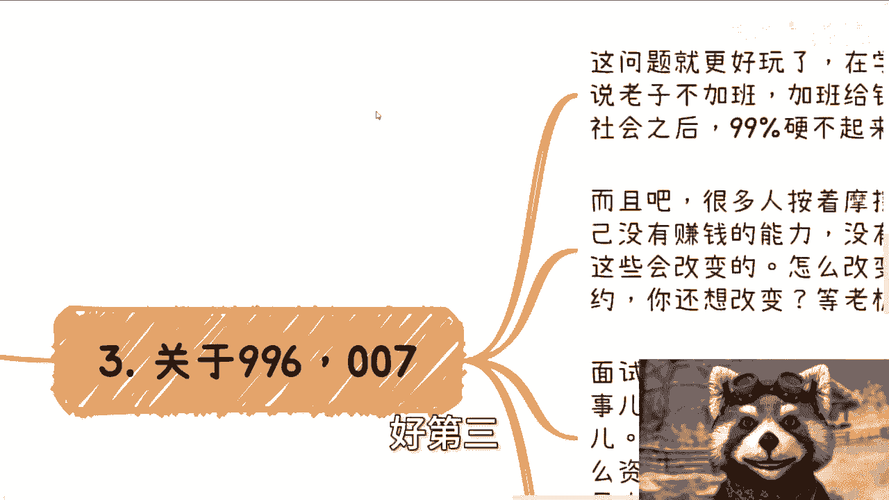

# 课程 P1：2024年，放弃工作给你带来的幻想 💭

在本节课中，我们将要学习如何认清当前就业环境的现实，并打破关于工作的常见幻想。我们将逐一分析这些不切实际的期望，帮助你建立更清醒的职业认知。

## 概述：工作的本质是慢性死亡

上一节我们介绍了课程主题，本节中我们来看看核心观点。工作本质上是一种慢性死亡的方式。失业是或早或晚等待着每个人的事情。这并不是说不要工作，而是强调在工作时必须做好准备，做好抗风险的准备。不能将所有希望都寄托在一份工作上。

**核心公式**：`工作 ≠ 安全保障`。更准确的描述是：`工作收入 = 不稳定的现金流`。

## 幻想一：问心无愧就能正常生活

许多人幻想在一个“正常”的社会里，只要问心无愧地做事就能安稳生活。然而，现实是这种“正常”已许久未见。无论是打工、做生意还是赚钱，抱着为所有人好的态度去尝试，结果往往事与愿违。当前社会环境下，对工作抱有过多美好幻想是不切实际的。

## 幻想二：工作能带来成长与稳定

以下是关于“成长”与“稳定”的常见误解：

许多人认为工作，尤其是某些岗位，能带来巨大成长。例如，新媒体运营看似光鲜，但实际工作内容往往只是写文案、剪辑视频、发布内容这三板斧。设计、开发等创造性岗位也是如此，个人的创意和理念在老板的需求面前常常不值一提。企业雇佣的是劳动力，而非为了培养你成长。认为企业付费让你积累经验是一种错觉，实质是**PUA**的一种形式。

关于稳定性，许多人看不起小公司，向往大厂。但现实是，进入大厂后，你所在的业务部门也可能在半年或一年后解散。所谓的“大厂经验”在后续求职中的光环效应正在急速衰减。

## 幻想三：可以拒绝不合理的加班（996/007）

在学生时代或年轻时，很多人宣称绝不加班。但进入社会后，99%的人无法坚持这一原则。原因在于劳资双方地位不平等。当你说“不”时，企业可以选择其他人。打工本质上是一份不平等条约，期待资本家良心发现是不现实的。许多人只是口头抗议，行动上依然妥协。合同是一回事，实际工作安排是另一回事。维权成本高昂，而资本家总有更多选择。

## 幻想四：频繁跳槽会让简历不好看

首先需要明确一个结论：大部分人的简历本身就不会特别好看。拥有大厂经历与没有的差异正在缩小。随着时间推移，简历上最不好看的不是工作经验，而是**你的年龄和性别**。

例如，一份年薪60万的996工作，意味着时薪并不高，性价比有限。后续跳槽薪资很难再有大幅提升。更重要的是，到了30岁或35岁之后，HR的关注点会转向你的婚姻状况、性别、薪资预期以及是否接受加班。届时，一份“漂亮”的简历并不能解决根本问题。你耗尽精力换来的，可能是一场空。

**核心洞察**：`简历价值 = f(经验， 年龄， 性别)`，其中年龄和性别因素的权重在现代职场中正变得越来越大。

## 幻想五：找不到好工作是因为自己不够优秀

许多人因为求职或工作不顺而开始自卑，这没有必要。优秀与否并非由单一的工作结果来评判。社会运行的逻辑有时与个人能力无关。

举个例子：在某些业务场景中，需要缴纳高额“入门费”、陪领导应酬、说违心的话。如果不这样做，就会被认为“不够圆滑”、“不优秀”，从而赚不到钱。这与你内心对“优秀”的定义可能截然不同，但社会规则就是如此。

**关键点**：`社会评价的优秀 ≠ 个人能力的优秀`。前者往往包含更多非能力因素。

## 总结与活动预告

本节课中我们一起学习了关于工作的五大常见幻想：问心无愧就能生活、工作带来成长稳定、能拒绝不合理加班、跳槽影响简历美观、以及找不到好工作源于个人不优秀。认清这些幻想，是为了更务实地规划职业道路，注重积累真实技能和抗风险能力，而非将人生希望全部寄托于一份工作上。

本周六（20号）在济南有一场线下活动，内容涵盖商业规划、职业规划、融资、股权、合同等。如果你手上有一些“牌”（资源或机会），希望从我的视角获得一些规划建议，欢迎报名参加。届时也可以带大家参观研究院并介绍相关业务。