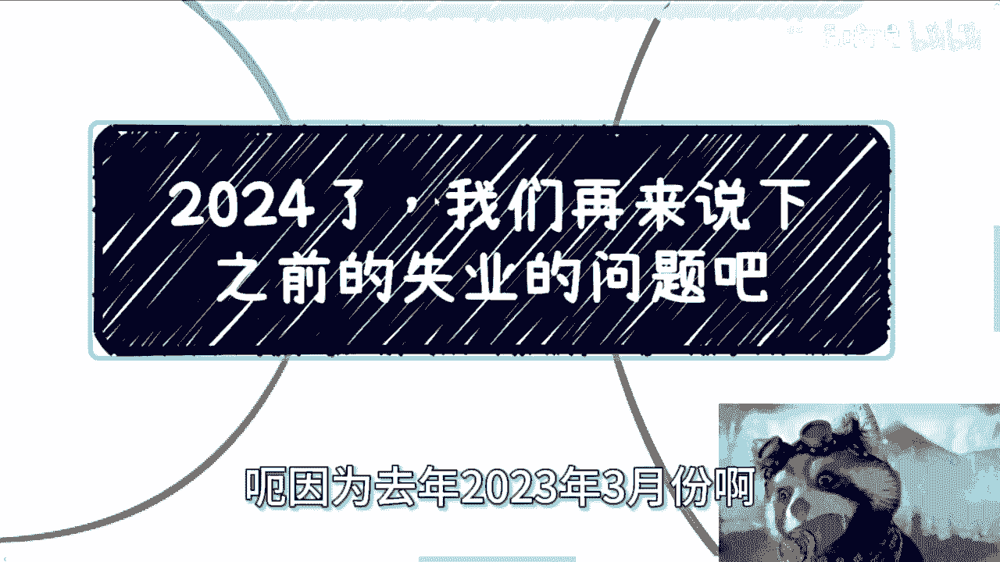
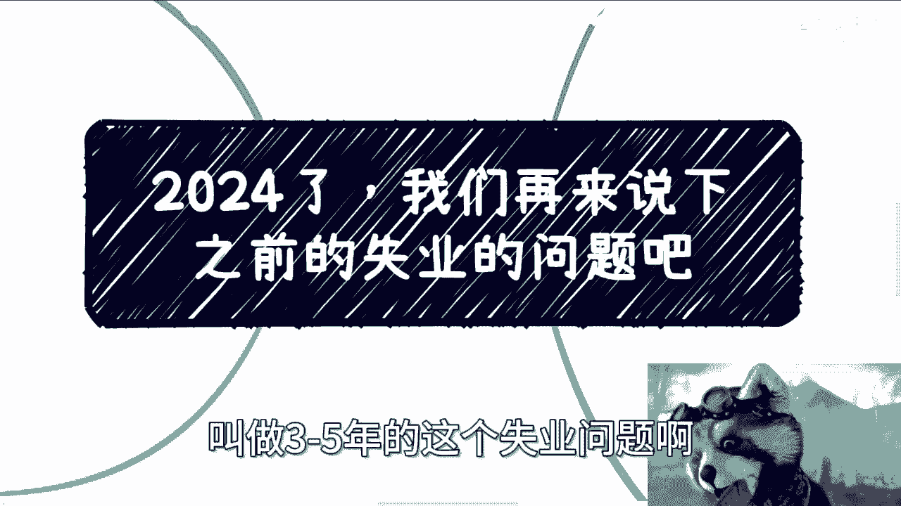
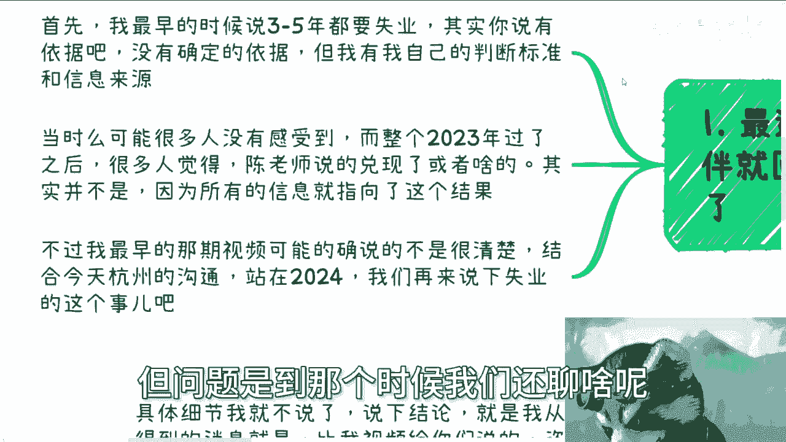
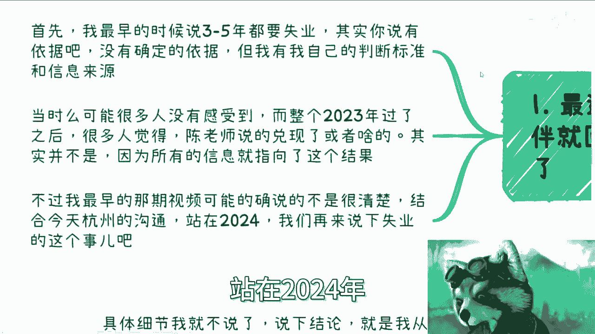
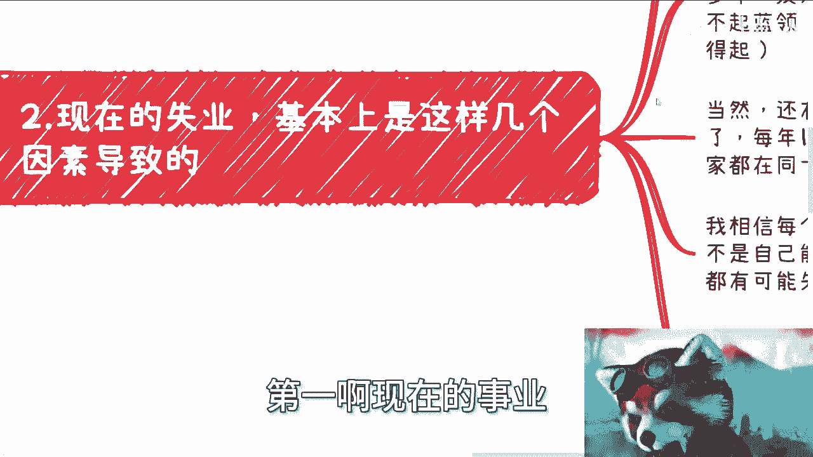
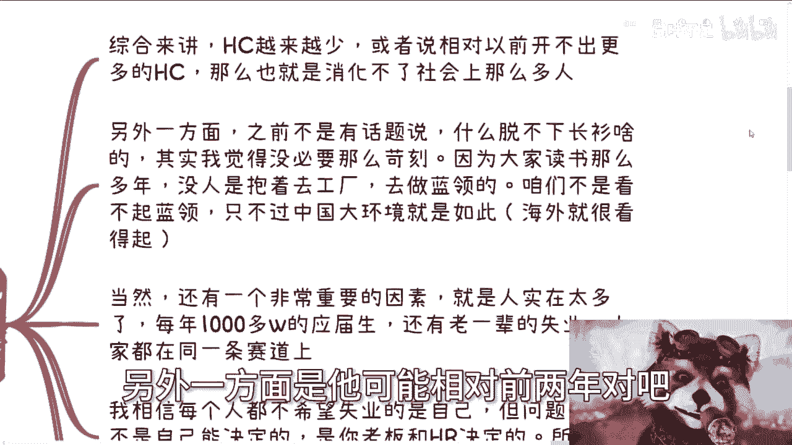
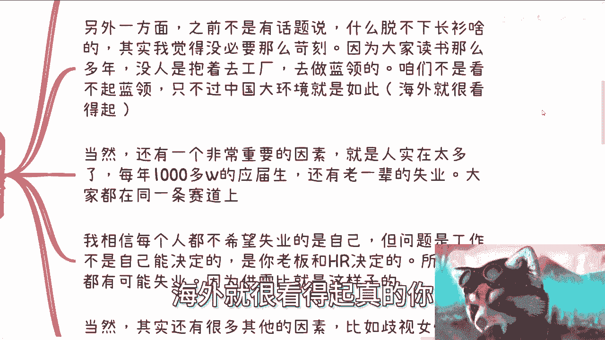
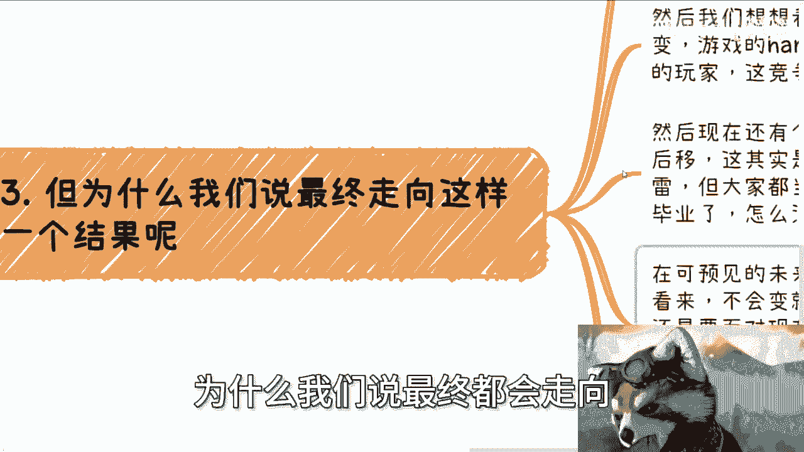
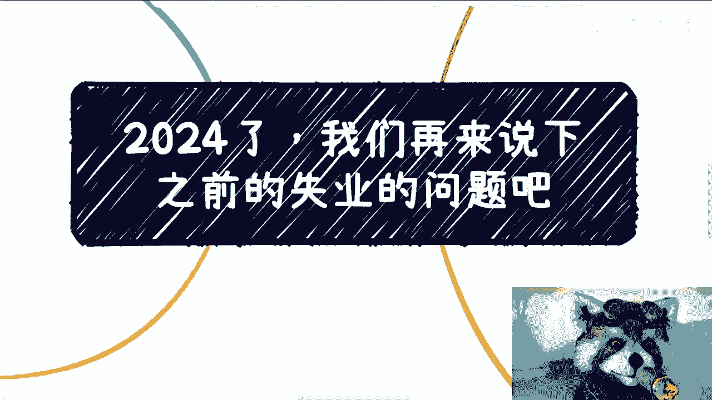

# 课程名称：2024年就业市场分析与个人应对策略 🧭

## 概述

在本节课中，我们将基于一次杭州的实地交流，系统性地分析当前及未来几年的就业市场趋势。我们将探讨导致就业困难的核心因素，并讨论个人应如何在这种大环境下进行规划与应对。

---

## 第一节：回顾与背景

上一节我们介绍了课程的整体框架，本节中我们来看看本次讨论的起源和背景。

我近期前往杭州与相关人士进行了深入交流。这次交流的背景，与我去年（2023年3月）发布的一个关于“未来三到五年失业问题”的视频观点密切相关。当时我提出这个观点时，许多人并未有切身感受，但经过2023年，越来越多的人开始关注这个问题。

近期，包括字节跳动、京东，甚至谷歌的X实验室等知名公司都传出了裁员消息，这使得许多观众回过头去观看我早期的视频。需要明确的是，我当时的判断并非基于某个确凿的预言，而是基于一系列信息的综合分析。由于信息差的存在，当时很多人无法感知到这些趋势，但随着时间的推移，部分趋势正在显现。

---

## 第二节：导致就业困难的核心因素

上一节我们回顾了观点的背景，本节中我们来看看当前就业市场面临的具体挑战。以下是导致就业困境的几个核心因素：

**1. 岗位总量减少与竞争加剧**
核心问题在于市场提供的职位（Head Count）总量在减少，或增长停滞。用公式可以简单表示为：
**岗位需求增长 < 劳动力供给增长**
这导致社会无法消化每年新增的大量劳动力，形成了“不进则退”的局面。

**2. 结构性矛盾与观念冲突**
社会上存在“脱不下长衫”的讨论，但这并非求职者眼高手低。核心矛盾在于：个人多年的教育投入与社会整体对蓝领职业的认知及待遇不匹配。在海外许多地区，蓝领工作享有高待遇和尊重，但在国内，这种结构性偏见短期内难以改变。

**3. 劳动力供给持续过剩**
每年有超过千万的应届毕业生进入市场，同时还有往届的待业人员。所有人集中在有限的赛道上竞争，导致内卷极其严重。这就像一个简单的供需模型：**Y（求职者总数） - X（岗位总数） = 无法就业的人数**。在缺乏增量市场的情况下，这个差值会持续存在并可能扩大。

**4. 个人选择权的丧失**
工作的决定权掌握在雇主和HR手中，而非求职者自己。这意味着失业风险是外生的、被动的。在当前的供需比下，任何人都有可能面临失业，包括资深人士。此外，就业市场还存在对女性、高龄求职者等群体的歧视，进一步压缩了部分人的选择空间。

**5. 企业普遍推行“降本增效”**
在经济环境下行压力下，“降本增效”成为企业普遍策略。所谓“降本”，往往直接指向人力成本的削减。这使得无论是互联网还是传统行业，就业稳定性都在下降，无非是程度差异而已。

---

## 第三节：对未来趋势的逻辑推演

上一节我们分析了现状的成因，本节中我们基于这些因素，逻辑推演未来的可能趋势。

为什么说“失业”可能成为一个普遍需要面对的结果？原因如下：

**1. 增长土壤消失**
过去支撑高增长、高晋升、高创新的市场土壤（如互联网红利、充沛的投融资、广阔的增量市场）已经发生根本性变化。未来的游戏规则已经从“简单模式”切换到了“困难模式”。

**2. 矛盾后移与“滚雪球”效应**
当前，大量毕业生选择考研、考公等方式将就业矛盾后移。假设每年有60%-70%的毕业生选择深造，那么两三年后，数百万硕士同时毕业，将面临同样甚至更严峻的就业市场。届时，无非两种结果：
*   **新人卷走老人**：更年轻、成本可能更低的毕业生替代资深员工。
*   **降维求职**：部分人不得不从事低于自身预期的工作。
这个过程每年循环，如同一个**滚雪球**，每一年新增的劳动力都会推动这个雪球前进，最终每个人都可能在某个时间点被波及。

这是一个基于现有信息的、可预见的逻辑结果。

---

## 第四节：来自一线的结论与个人建议

上一节我们推演了严峻的趋势，本节中我们来看看从一线交流中得到的具体结论，以及给个人的务实建议。

基于在杭州与资本方的深度沟通，我获得的结论比之前的判断更为严峻。核心结论是：在可预见的未来，市场环境发生根本性好转的可能性极低。

因此，最大的建议如下：

**1. 首要策略：苟住**
在当前岗位上尽可能保持稳定，积累资源和经验，避免主动跳入不确定性的风险中。

**2. 拓展可能性：出海**
从宏观角度看，海外部分地区的就业市场卷度低于国内，单位时间劳动报酬可能更高。但这并非盲目出国，需要提前规划好职业定位和发展路径。

**3. 核心能力：构建独立赚钱体系**
这是最重要的一点。无论学历背景如何，大多数人对社会和商业的认知几乎为零。仅依赖一份工作，相当于将主动权完全交给他人，抗风险能力脆弱。
*   **你需要积累的是**：不依赖于单一雇主的赚钱渠道、商业认知、人脉资源和个人品牌。
*   **具体方法**：没有捷径。主动盘点并整合身边资源，积极向外社交，在实践中学习商业逻辑。我发布的数百个免费视频中已包含许多相关思路。

**4. 关于未来方向**
很遗憾，本次交流的另一个结论是：目前没有明确、普适的“好方向”或“风口”。大家的共识是：**等待、观察、走一步看一步**。个人在大环境面前是渺小的，我们能做的是在不确定性中尽可能提升自身的韧性和灵活性。

---

## 总结

本节课中我们一起学习了当前就业市场的核心挑战，包括岗位减少、竞争过剩、结构性矛盾等。我们通过逻辑推演，看到了未来可能出现的“滚雪球”式就业压力。最后，我们探讨了“苟住”、出海规划以及**构建个人独立赚钱能力**等务实应对策略。未来充满不确定性，提升自身的商业认知和抗风险能力，是为数不多的确定性准备。

---
**注**：以上分析基于特定时间的市场观察与交流，仅供参考。个人规划需结合自身情况审慎决策。如有具体的职业或商业规划问题，建议进行更深入的个案咨询。