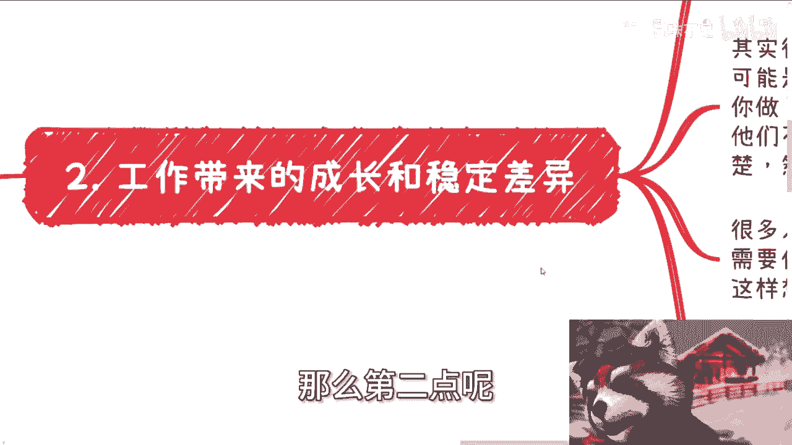
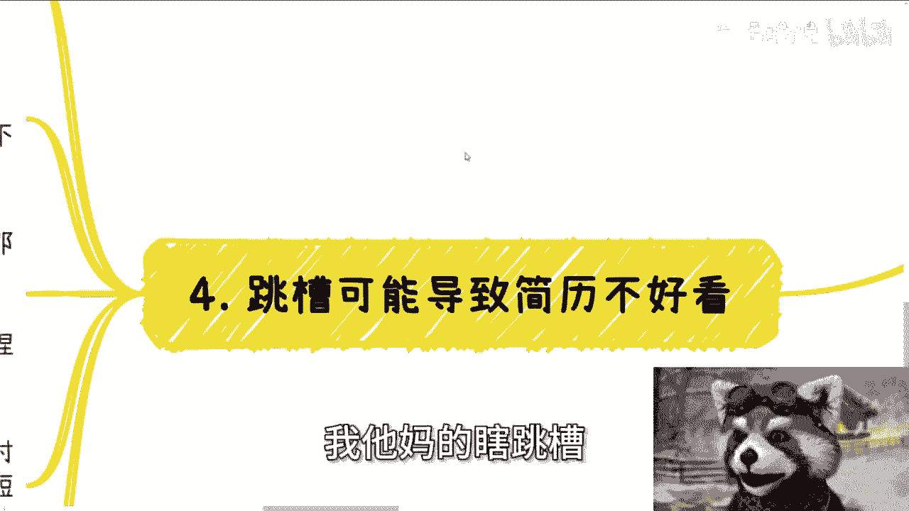

# 2024年了，放弃打工给你带来的幻想 - P1：2024年了，放弃工作给你带来的幻想 - 赏味不足 - BV1ez421k7g3

好啊大家好啊。

呃首先呢今天这个主题呢，我是想来跟大家说一下，到2024年了啊，呃不要对工作再抱有什么幻想了好吧，请打消这些幻想没有意义的啊。

呃我先说结论啊，就工作呢本质上到从现在来讲。

就是慢性死亡的方式啊，去年我就说过了，失业是或早或晚的啊，等待着等待等待着大家对吧，那我跟你这么说啊，就是说啊不是说我们今天说不工作或者怎么样，而是说你工作就得想好准备好啊，做好准备。

做好各种各样的抗风险的准备对吧，而不是说你说啊我他妈工作一棵树上吊死，all in了对吧，那那那你后面反正就是我跟你说，就无非就是啊先甜后苦，先苦后甜的问问题对吧，那很多人要说了。

他说那我年轻的时候可以攒够足够多的钱，那我就问嘛足够多是多少呢，你觉得你能攒到30岁就自由了吗。

你要是觉得，那OK你要觉得，不觉得你自己想想看后面怎么个做法，对不对，无非就这么个区别啊，那么呃20号好吧，这周六二十号在济南这个活动好吧，继续报名好吧，大家要是有什么想报名的，或者说想了解详情的。

你们可以私信我啊，在那个研究院，在研究院，你们来呢，我顺便带你们参观一下研究院好吧，然后我也找了研究院的人，给你们介绍一下这个研究院的业务啊。

嗯好那我们就一个来讲啊，首先呢昨天有个朋友跟我聊啊，原话是这么说的，他说正常的社会应该是问心无愧的，做事情就可以问心无愧的活着对吧，我回答是这么说的，我说你说的这种正常，我可能不知道多久没有看到的。

我也不知道何时还能看到是吧，就是我也想正常做事情，我也想正常做事情之后问心无愧的活着，对不对，那问题是现在整个社会什么样子的对吧，包括就是说我们去打工也好，我们去做生意也好，我们自己去赚钱也好。

我可以我还是那句话，我可以抱着对所有人好的态度，我可以抱着为所有人赚钱的态度，我也可以抱着就是做事情的态度，哼你们抱着试试看，你们看看结果是怎么样的对吧，我跟你讲啊，其实到现在还有很多小伙伴对于工作呢。

有着不切实际的幻想，我跟你说，我按照哎我就初步想想吧，就列一下啊，以前呢我觉得幻想是可以的，什么幻想都可以。

包括融资啊，包括创业啊，我觉得现在什么幻想都别有啊，毕竟以前跟现在天壤之别啊。

这种天上去也没人想得出来，真的是啊，那么第二点呢。

就是说工作带来的成长，跟稳所谓上稳定的差异啊，你就如果如果跟很多人去说，我说做运营的来说，有很多人会跟我说，他说他想做新媒体运营对吧，或者说啊这个企业的一些运营岗位，我说现在哪儿哪儿的新媒体岗位。

无论JD上写的多好，无论要求多高，无论你面试的时候，他妈的面临各种各样的内容对吧，你进去我告诉你，你就是写文案剪辑视频，发布短视频平台，三板斧没了，无论你是谁，就这个样子，你指望啥呢对吧。

我就说你指望啥呢，新媒体运营，你运营个锤子运营对吧。

你包括设计更是对吧，开发也是开发，说我抱着一腔热血对吧，我要去大厂，我要去公司啊，我要去所谓的创造，创造我的一些想要实现了价值对吧，设计更实力啊啊我觉得我有设计的sense对吧，我有自己设计的设计理念。

谁他妈管你呀，你是谁呀啊你们去设计院的，你们但凡工作过的，你们自己知道对吧，就是说你的岗位可能是个创造性岗位，但是现在没有用啊，谁关心你啊，你跟我讲，你设计有sense，老板懂个屁啊。

但问题是人家是老板啊，那么你是谁啊啊现在你去就是纯纯的劳动力，而且你做了吧，你老板跟他妈的老领导还不满意，而且我跟你讲最离谱的是什么，你还他妈不知道他们不满意什么地方，而且也不知道为什么你不满意。

你一开始不说清楚，要么一百两百三百四百，然后bug不停的在那边修啊。

然后就导致不停的加班，不知道意义在什么地方啊，那么很多人跟我谈成长，那我就问你有没有想过一个问题，诶，我就奇了怪了，你签劳动合同对吧，你去工作，你别人给你分钱，然后让你干嘛干嘛，你跟我谈成长。

我就问你企业为什么需要你成长，企业又为什么让你成长，诶奇怪了，企业能赚钱吗，能吗对吧，之前王自如有一次采访的时候，他说什么，他说现在相当于是企业付钱让大家去积累经验，有说是有咱有一说一啊。

这话说的确让人不那么舒服，但是问题是企业花钱是让别人去当劳动力的，你要说成长，我觉得就过分了啊，你要说企业花钱真的有让我成长，我也心甘情愿，但他们有吗，没有啊对吧，你抱有这样想法的人，我跟你讲。

你真的是对资本家毫无了解，但凡啊但凡就是说啊，我给你钱，我还让你成长的，这叫什么，这叫PUA。

那么关于这个工作能干多久呢，很多小伙伴也看看不起那种刚成立的小公司，或者说规模小的公司，那么问题来了，我就问你，你去大厂，现在的情况大概率无非就是你去了一个大厂，然后你去的事业部。

你去的那些业务部门也是刚成立的，也可能半年或一年后就解散了，我就问你有区别吗，有什么区别呢，你跟我说啊，我跳槽的时候能让别人看上去是个大厂的经验。

好好没问题，我们往后看，往后看，你好第三。

990007，我跟你讲这个问题就更好玩了，在很多人学生的时候，在很多人年轻的时候，你去跟他谈这个问题，他就会告诉你妈的老子不加班是吧，加班给老子钱，否则他妈的谁做啊，老谁爱做谁做，老子不做好。

然后呢走进社会之后，99%硬不起来的，你不还要照照样被按在地上摩擦呢，为什么呢，因为你不平等啊，你说的有用的啦，你应好了，你硬了，企业国吊你们了，企业不叼你，企业能干活的人多的是排队干活，你爱干不干。

对不对，而且我跟你讲，很多人按着摩擦板还嘴硬，就是你明明没有自己赚钱能力，你也没有自己积累的资源，你还要去说爱老子不干，爱干，爱谁干谁干，其实是这样子的，这样你就会发现就是越是这种舆论的声音越多。

而反应的东西又不真实，那你最终这件事情会改变吗，不会的呀，你打工永远是不平等条约，你还想改变什么东西呢。

你等老板良心发现吗，不可能的呀，对吧，你要么就知行合一对吧，也就是说你要么就真的对吧，你说我不干嘛，你要是让我加班，不给加班吗，我他妈就辞职，你要看看他妈80%，如果这样干。

企业会企业会到今天这样吗对吧，9907这种风会吹成这样吗，不会的呀，但是真正事实是这样的吗，不是啊，很多人就是口嗨啊，他做什么东西啊，他会做吗，他不照样被按在地上摩擦吗，对吧，你面试跟合同我跟你讲。

只不过是一方面真实的上班是另外一方面，说白了你合同签了，我怎么用，你是我的事，后来有人又要说了，那压榨我去告他啊，行啊，那资本家就想着你告呗，你有本事你告你有多长时间跟我耗吧，首先是第一点。

第二点是你要真的硬对吧，没问题啊，那我就捏捏软柿子嘛，毕竟99%的人都是吃饼的，忽悠两句就过去了呀，谁关心呢对吧，那资本家就是有人干活就可以了，我管你是谁啊，那么我跟你讲这事呢。

在我的认知里面是不可能改变的啊，在你在我刚毕业的时候，没几年就开始说，99000起来，我们以前还搭过帐篷住，公司里面改变啥呢，你告诉我改变啥啊，因为你一开始这件事情就是不平等的，而且很多人包括我。

你早年都是被画饼的，你是心甘情愿的，你能说啥呢，你会觉得卧槽，老子他妈的干这个事，干了马上财务自由了，干了就有很大成长，有什么成长没有对吧，第四有很多人还说了啊，我他妈的瞎跳槽可能会导致简历不好看。

我跟你讲啊，首先先说一个结论，大部分大部分大部分的人，简历本身就不会好看到哪里去啊，你不是说有了大厂就好看的一样的，没区别的啊，都半斤八两的，而且我告诉你，随着时间推移。

你简历上最不好看的不是你的工作经验。

最不好看的是你的性别跟你的年龄就这么简单，逃不掉的你逃不掉的，你知道吗，咱们就举个例子，你去一个大厂年薪60万，然后996007对吧，996007意味着什么，意味着你的性价比并不高，你的时薪并不高。

你并没有什么太大价值对吧，然后你再跳，你基本上也就这个数了，你想在网上我跟你讲，我觉得是不可能的，而且大部分人都不可能。

而且你在网上是极个别，更何况大部分的人也去不了大厂，也拿不到这么高的工资对吧好，那我们继续说啊，那你就说你跳来跳去，你觉得不好看，但是就算啊你就算大厂，你60万很好看，30岁之后，35岁之后呢。

我跟你讲，hr只会看你的婚姻，只会看你的性别，只会看你接下来要多少，只会看你接下来接不接受加班，只会往死里压，为什么，因为你年龄大了之后，你就会很就会有很多地方被拿捏，而且你就算不被拿捏，没关系啊。

他有很多人能被拿捏啊，为什么我要找个不被拿捏的人呢，对不对，哎，奇了怪了，就这么个逻辑啊，你去开公司，你也这么个逻辑啊，因为对公司来讲，要去的人多了去了，不缺你一个，但对你来讲不是对吧。

那么你就会极力的去争取，到时候那个时候你面临的是什么，接不接受加班，是不是短期要生育，是不是薪资要低一点对吧，简历漂亮，简历漂亮个屁，能漂亮到哪去啊啊，我告诉你，你觉得简历漂亮能带来更多好的机会。

但问题来了，企业不觉得甲方不觉得社会不觉得有什么用呢，有什么用呢，你耗尽的是你大部分的精力，耗尽的是你的人生，你耗尽了你的时间，但是呢没有用的呀。

你换来的是什么，Nothing，对吧你自己去试试看就知道了。

就这么简单，然后最后一点就是说工作好坏，offer好坏，有很多人会觉得就是说哎呀，好像是不是因为自己不够优秀啊。

我跟你们说啊，好多人其实通过工作就开始自卑了，真的没必要，我跟你讲，为什么因为优秀不优秀是这样评判的吗，不是也不是别人来评判的。

我给你们举个例子，我们以前在国内某些城市做业务，你我告诉你啊，我们需要给上面的机构交入门费，而且是小几百万小几百万的交啊，交了之后还要陪领导喝酒，还要陪着低声下气，还要当对方画饼的时候，觉得对方是个。

还要说好好好，对对对，还要彩虹屁，那我就这么问你，如果今天你不交钱，你不陪喝酒，你不陪着，今天下棋，你不拍马屁，我就问你，你觉得是不够优秀还是够优秀，你回答我，你心里一定有个答案对吧，但我告诉你。

我不管你答案是什么，这个社会会告诉你，你不做这些，你就是不够圆滑，你就赚不到钱，你就是不优秀，那我就请问你到时候又如何应对呢，你又如何应对呢，我相信这些东西跟你们大部分人心里想的，可能不一样。

你们可能觉得这种不叫优秀。

Who care。

明白吗，就是所有的人都是会有这么一个经历的，所有的人都是这么一个过程对吧，但是我就是希望就是能明白的人，你们能少走点走弯路，你早点明白不好吗，你为什么一定要撞到墙才明白没有意义的呀，到最后你要这么想。

撞墙明白通过率可能也就那么1%，2%，那九十八九十九%都是尸体，都是炮灰，为什么我们要变成炮灰呢，那当然那当然就像我朋友说的这句话对吧。

你说我做一些事情，我说话我可以问心无愧吗，我可以啊。

但是社会不这么觉得，很多不怎么觉得你，就像我今天讲这个内容也是一样的对吧，你总有会冒出来，卧槽，陈老师他妈的告诉大家不要上班，张老师告诉大家，你妈的啊，要要要要去投机取巧，是这个逻辑吗。

行吧啊就这么着吧好吧，然后那个呃活动好吧，你们要报名的，你们继续来，反正就是这周六在济南啊，然后那个呃商业呃商业规划，职业规划啊，然后融资啊，股权啊，然后合同啊啊包括你们有些就是说手上有的牌。

然后你们希望通过我的视角，通过我的一些呃理解，能够给你们做更好的一些规划好吧。

