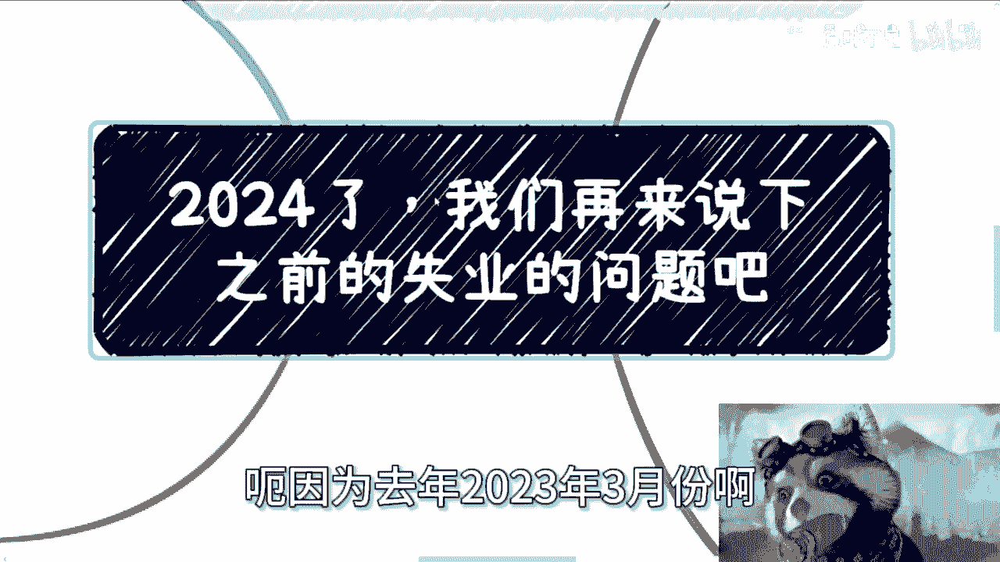
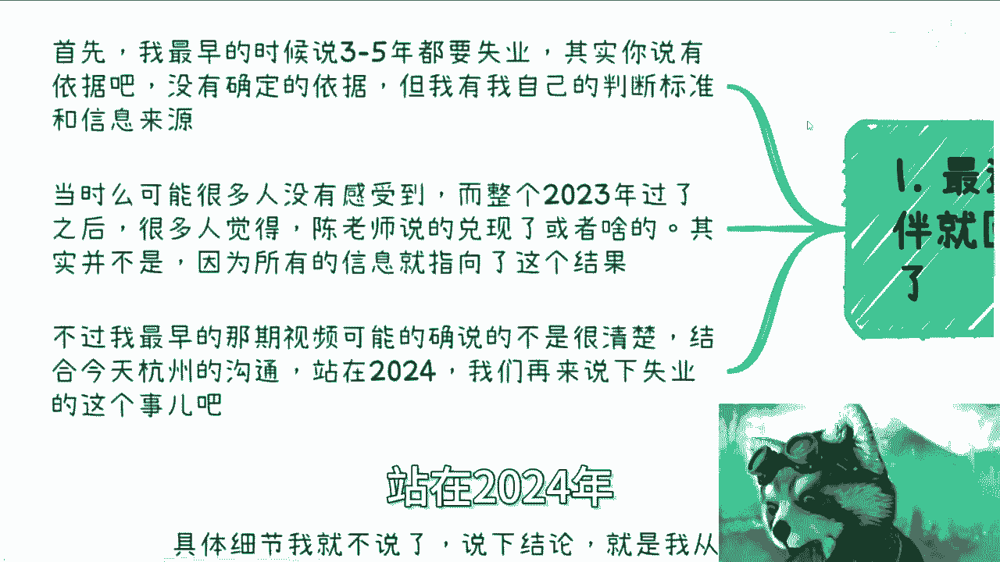
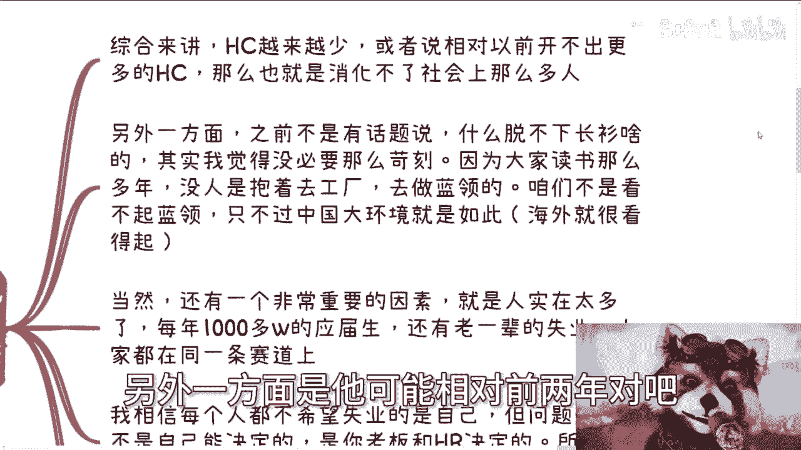
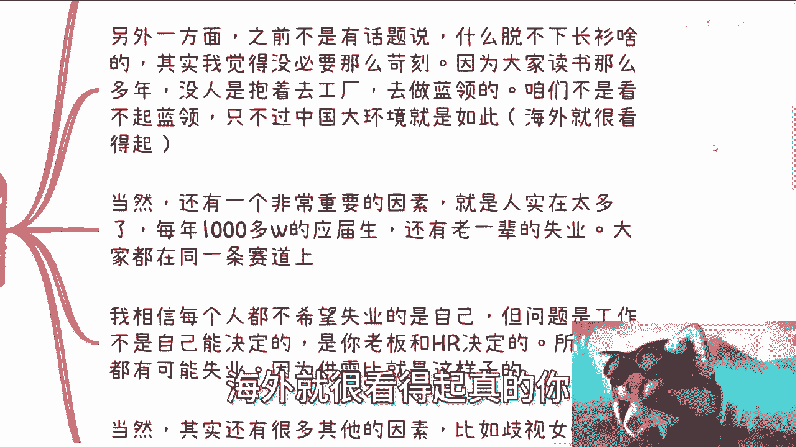
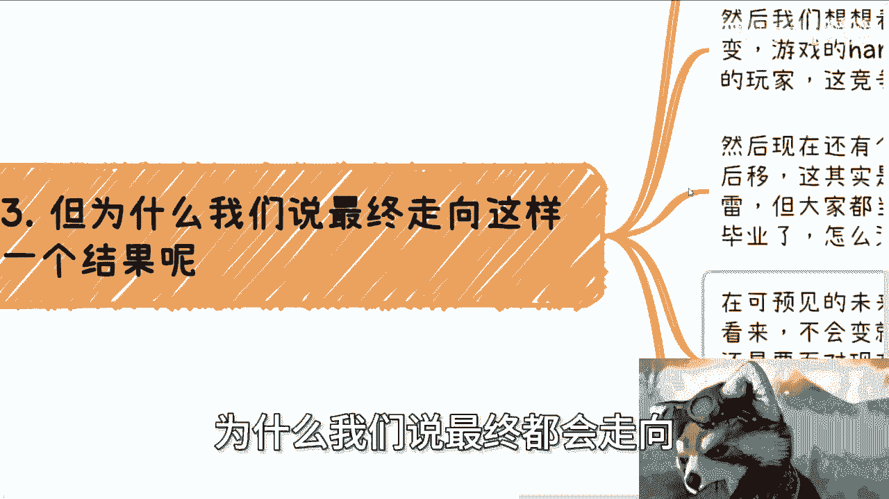
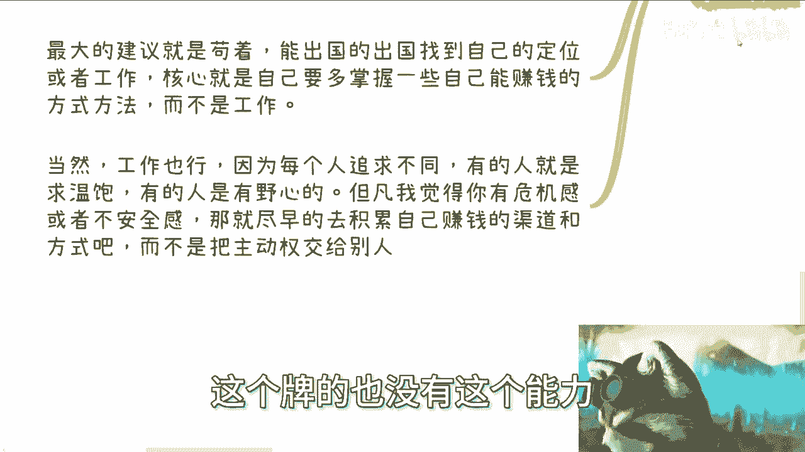
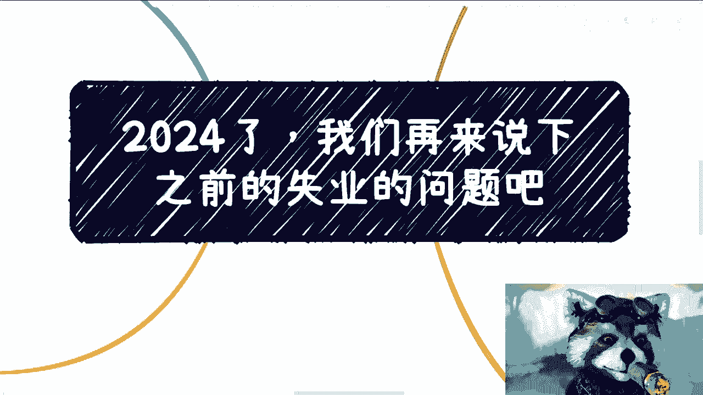

# 2024年了，来说下之前提到的失业问题吧（同步下杭州信息） - P1 - 赏味不足 - BV1hN4y1H78r

好大家好啊，这个今天去杭州逛了一圈是吧，去取了个经啊，刚刚回来呢就有人问我有没有什么消息是吧。

嗯我先不说。

先卖个关子，到第四点，我们来说，但是你们从我今天这个主题，你们对吧，你多多少少猜得出来好吧，嗯因为去年2023年3月份啊。

就是B站当时给了我一波流量，我当时讲的那波流量呢讲的就是说那个主题啊，叫做三到5年的失业问题啊。

呃我们先来看看啊，就是第一呢最近可能消息也多，呃大家会看到，比如说像字节啊，京东啊对吧，甚至今天新的消息就是google x就x lab。

就它有一个X实验室，连X实验室都开始裁员了，你知道吗，那么很多小伙伴呢就回过头去。

开始看我最早的那期视频，呃，那么首先呢我最早是说三到5年都要失业啊，呃就就跟那并不是说一定三到5年嘛对吧，大家懂这个意思啊，嗯但是其实你说有依据吧，我的确没什么依据对吧，因为我怎么可能有依据呢。

就是我我我我，你说今天什么有一个有一个什么东西，说3~5要失业对吧，大家敲个章，你不可能的，但是我有我自己的判断标准，跟我为什么会去做这种判断的信息来源，你知道吗，首先是第一个，当然同样的。

当时很多人就2023年3月份的收，因为当时做这个视频是3月10号，还不是11号的时候，很多人其实感受不到，而整个2023年过了之后，那么很多人可能觉得哎，那陈老师说的可能有点道理对吧。

或者兑现了或者怎么样，其实并不是，因为没有任何东西是能够去预知的啊，没有任何东西说啊，我们就是瞎蒙对吧，或者怎么样子，不是的，就很多信息呢它都是指向了这个结果，只不过就是说就像我说的，因为大家有信息差。

你知道吗，因为你我们随便打个比方，比如说现在是2028年，那其实我就根本不用做这个视频，你们你们可能都已经知道了，因为你们都已经见证历史了对吧，就到但是问题是到那个时候我们还聊啥呢。

也没啥好聊的，你说是吧，那么不过呢就最早那期视频呢，你们回头有空了也可以去看看，就是很多人也说清楚，我说的其实不太清楚，结合今天杭州的公司沟通啊，站在2024年。

我觉得我就把这个事说的清楚一点好吧，第一啊，现在的事业基本上是这么几个因素导致的啊。

哪几个因素呢，第一综合来讲是head count越来越少，或者说相对以前，那就是我们就说嘛不进则退嘛对吧，一方面是越来越少，另外一方面是他可能相对前两年对吧。

他开不出更多的海德counter，那么这个时候就消化不了社会上的这么多人啊，这是第一点。

这个是我们称之为这是一部分因素啊，另外一部分就是之前不是有话题说嘛，比如说大家什么拖不上，脱，脱不下长衫对吧，说什么靠孔乙己对吧，怎么样子啊，其实我觉得没有必要这么苛刻，为什么呢。

因为大家读书读这么多年，没有人是抱着说我读书读到本硕博出来，我就是去工厂对吧，你让我拧螺丝或者去做所谓的那些蓝领，不是的呀，我觉得这没毛病啊，你不能说因为大家好像学历高了。

说哎呀好像好像是看不起别人或者怎么样，就我觉得这两者没有关系，都是偷换概念对吧啊，咱们不是看不起蓝领，但是我觉得客观的说不是我们看得起，看不起，是整个中国大环境就看不起对吧，甚至就是我觉得你们啊。

包括我对吧，就大大家的这个家长从以前到现在受到的教育，他就是看不起，那怎么办，对不了，那那我我我我说直白点，你说这么多人啊，从小受到教育啊，你这个以后对吧，读不好书怎么样怎么样呢。

你看像人家怎么样怎么样。

不都是这种父母吗，对但是我跟你讲啊，海外就很开得起。

真的你比如像澳大利亚，他们对蓝领就是有非常好的待遇，也有非常好的移民条件啊，那么当然还有一个非常重要的因素，就是现在人实在太多啊，就是每年1000多的应届生对吧，那么你想啊，每年1000多应届生。

还有老一辈的失业，然后呢大家还没有太多的选择对吧，大家都在同一条赛道上，你就像今天我在杭州跟那个资本聊的时候，其实我们也聊到嘛，就说哎呀你你你要有有机会对吧，尽可能就苟着对吧，然后就走一步看一步吧。

苟着是最重要的，然后我就跟他说，我说是这样子的，你这话都对，但是我们大部分人没有选择啊对吧，就我们要是有选择权说苟着，那他妈也就算了，我们没有选择权，就像失业，是我们选择失业吗，不是啊。

是我们被失业的对吧，我相信每个人呢对吧，都不希望事业的是自己，但是一样的道理，哎呀其实我们就客观的说，就是每个人都不希望世界的事自己，这就像好像每个人都希望中奖是自己是一样的。

但是最终啊就是就是最终的这个head count，最终的这个这个这个能够有工作的，他他他就是一个他就是这么个量，但是你外面人太多了对吧，就像我之前第一个视频写的就是Y减X，你总有这么多人是找不到的。

你怎么办对吧，因为因为你现在已经找不到增量市场了，你没有增量市场，而且而且今天聊下来的情况，的确，未来很长一段时间会找不到增量市场，那怎么办呢，对吧啊，那么就像我们这边说的问题是什么。

工作不是我们能决定的，是你老板跟hr决定的，你老板跟hr决定的意思就是别人决定的，你决定不了。

所以谁都有可能失业对吧，因为供需比就这个样子，你包括昨天有一个阿里的P8找我吃顿饭，也是的，他也担心他失业，为什么，因为年纪大了不一样的呀，对不对，那当然其实还有很多其他的因素，比如说歧视女性啊。

你比如说之前找我咨询的有一个博士对吧，读读书，读完博士的虽然是个学术博啊，读完她是个小姑娘，那我就问嘛，她出来，你管你是博士还是什么博士还是什么东西啊，他妈的我跟你说，你是个女性，在中国出来找工作。

你就受到歧视的，没有用的，就客观事实就是这样子，就是如果我是个女的对吧，我不管你给我吃多少的鸡汤或者怎么样子，那我他妈实实在在就是这么一个问题啊对吧，那之前有小伙伴说哎呀传统行业不是的对吧。

还蛮尊重年龄大的，对你这句话没有错，但是那是以前在如此卷的情况下，你想啊所有的企业都叫什么叫降本增效，对不对，那什么叫降本啊，你想想什么叫降本，对不对。

没有用的，你说这个这个你说是不是相比互联网好一点，我觉得是比互联网好一点的，但是无非就是五十五五十步笑百步的事情对啊。

然后第三个呃，为什么我们说最终都会走向。

就是我们说失业这个结果，那是因为几个问题，第一个问题是接下来他根本就没有以前的土壤，比如说晋升的土壤，比如说创造的土壤，比如说投融资的土壤，比如说创新的呃，就是那个那个那个新增增量市场对吧。

你别问为什么，我觉得这个东西不是我们在这个视频里面，能讲的对吧，你们如果还希望以后在网上能看到我，那我们就不要先不谈这个问题啊，这第一第二我们想想看你做一个游戏，这就好像游戏的规则没变。

游戏从以前的easy模式变成了hard模式，或者说游戏从以前就是每天都能够撒币对吧，都有新的这个这个这个这个这个福利进来，到现在什么都没有对吧，甚至是负资产啊，然后转变到hard模式。

但每年又多出了1000多万的玩家，那你竞争怎么竞，怎么竞争呢对吧，然后现在还有问题啊，就是什么就是所有的人所有的这个玩家对吧，他都把矛盾后移，就是就是本来啊这个所有的暴雷，比如说你找不到工作。

或者你你你你找不到工作之后啊，我打个比方，你去工厂工作了，或者你降维打你，你你你可能做别的东西去了对吧等等等，那么这个雷风险是我们平摊的，但是现在是什么，所有人都当鸵鸟啊。

你说八十五百%分之80的人都选择深造，那我就问我就我现在这个问题我就抛在这边，我就问你们两三年后，大部分的人硕士都毕业了，一年1000多万人对吧，里面有百分之我少说一点吧，六七十%的人选择深造对吧好。

那么我就问两三年后硕士毕业了，怎么地啊，怎么滴呀，大家继续读博吗，还是怎么说啊对吧，因为在可预见的未来，基本上情况是不会变的对吧，你包括我问了这么多人，包括今天我问资本对吧，我之前问了高校，问了协会。

问问了问了政府领导，问了各种各样的，就大家都是这么一个结论，你不会变的，而且在我看来不会变，就是变差，不进则退啊，那么到那个时候怎么地呀，所有人还是要面对现在这个问题，那么好，我就这么跟你讲。

无非就两种可能性，你要么就有本事把以前岗位上的人卷走对吧，所谓新人替代老人，那要么你就是自己卷不到好的工作，或者卷不到甚至卷不到工作，然后退而求其次去做些别的对吧，然后你们想想看啊。

无非接下来的结论就是每一年新人把老人卷走，然后有的新人呢委委委曲求全对吧，这个这个这个自己做自己不喜欢的，然后每每一年还有1000多万的新的玩家出来，然后每一年就好像是一个循环对吧。

他就像个雪球这样往前滚，这这每一年每一年这样往前滚，那就每一个人终究在未来的某年，终终究都会被滚到啊，这不就是未来的结果吗，没了呀，而且这是一个可预见的结果对吧，然后说到这个，我当时写这个的时候。

让我想到了最近暴雷的这个雪球啊，哎这个最近这个雪球这个爆率也是连锁反应，也也他妈几百亿，很惨啊，好然后说一下今天杭州的结果嗯，具体细节就像我说的，我们不方便在这个地方讲，你们如果以后线下见到我。

你们可以问我好吧，我来说一下结论，就是我从资方这边得到的信息，就是比我之前无论是充电还是不充电，给你们讲的，以及你们咨询跟你们讲的结论，就是比我讲的有过之而无不及，说白了就是我还是太乐观了，好吧啊。

当然我相信也有人说啊，我说我贩卖焦虑对吧好，你要觉得我范围焦虑呢，你可以不关注，信不信无所谓，我也就是给你们做这么一个share啊，做这么一个共享啊，反正未来都是自己的，爱信不信无所谓嘛，对吧嗯。

而且就像我这个视频，也不会放在什么充电视频里面，所有人都看得到，对吧啊，然后就是以前的土壤呢，就是没有了互联网的土壤，投资的土壤，创业的土壤啊，甚至人多了之后，晋升的土壤都没有了啊。

最大的建议我们今天也聊得很深，最大的建议就是苟着，然后呢能出国的出国当然不是单纯的出国啊，你出国得想好你自己做什么啊，然后做什么工作，做什么定位啊，当然呃从宏观角度来讲，海外再卷也的确没有中国这么卷。

而且就说单位时间里面能赚到的钱，肯定也比国内多啊，咱咱不是说海外月亮比中国圆对吧，但事实就是这样子啊，核心呢，我觉得还是说要多掌握一些自己能赚钱的方式，而不是说就工作啊，当然工作也行啊。

因为每个人追求不一样，因为有的人就跟我说，他妈的陈老师，我就想温饱，你别跟我讲这么多也行啊，我们没要求，就是我们也没有资格要求别人，反正自己对自己负责就好了嘛，对吧啊，有的人有野心对吧好。

那但凡我觉得你是有危机感或者不安全感的，那你就要尽早的去积累自己赚钱的渠道和方式，对吧，没了，为什么，因为其实当下情况很简单嘛，所有人不管你们什么学校，也不管你们什么学历。

你们对社会跟商业的理解就是0%，对不对，好那么如果你仅仅只是工作，那么你你只会把你的主动权交给别人，因为你手上是没有任何抗风险能力的，这个牌的也没有这个能力。

也没有这个关系链，那你现在只能去积累对吧。

我跟你们讲啊，不要再问我怎么积累了，我讲了，我到现在已经500多个视频了，你们单纯就算看那些免费的视频，你们也已经能够看到很多怎么积累的方式了，好吧，我觉得很简单，你要么就是把你身边的有的资源的人。

全该盘资源的全部盘一遍，全部聊一遍啊，然后就是说盘点一下到底有哪些资源可以用的，如果没有，你就出去社交没了呀，那你们跟我都是老百姓，我们有什么方法吗，没有什么方法呀，有很多人说捷径没有捷径啊。

那怎么办呢，对不对，就是我觉得大家要认清楚一个事实，就是不管你们什么学校，我也不管你们什么学历，你们对社会和商业的认知就是零，因为学校没有教过9年制义务教育，到高等教育就没人教，那怎么办呢对吧。

好吧我算是跟你们讲了这个结论了，而且我也我我也跟你们说心里话，就是我今天聊完，我觉得已经是我最后一个聊的人了，因为之前高校政府企业我都聊过了，我通过今天资本给我的说法，我基本上已经95%以上。

甚至98%以上，我已经确定了这个未来就是这个情况对吧，然后然后OK那你们可能可能还想问，我就说那以后是什么方向，可能好一点对吧，或者说未来有什么可这个这个锥形的方向，我也告诉你们结论。

今天我们的结论就是没有结论，就是等苟着装死，然后看变化，然后走一步看一步，只能这样子，这就是我们今天得出的结论，就就朴实无华，没有办法呀，对不对，就是无论是他还是我还是其他人，都是渺小的。

我们没有办法跟大环境抗衡，那不就是我只能告诉你这么一个这么一个结论，好吧行啊，那那就这么着吧啊嗯一样的好吧，你们有任何的职业规划，有任何的商业规划，有任何的合同啊，然后什么什么合作上面或者商业合作上面。

或者你们想做一个项目都摸不清楚的对吧，或者自己想不清楚的，你们可以再整理好，然后找我咨询。

