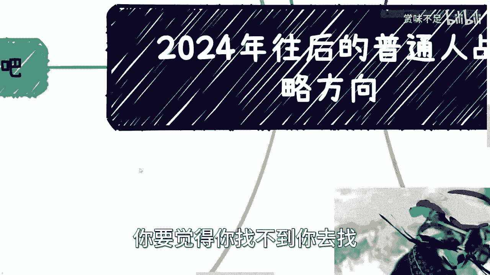

# 2024年往后的大众的战略方向 - P1 - 赏味不足 - BV1TC4y1n7MN

好大家好啊，我靠我他妈刚刚在那边折腾这个模型啊，折腾了很长时间，我本来想弄一些新的造型，后来发现搞不定，算了算了放弃了，我昨天上飞机之前呢发了个状态啊，然后我觉得可能大家看我那个文字呢。

有些人看不懂啊，看不懂呢。

我想给大家稍微扩展一下啊，啊首先呢我当时说的情况是这样子的，我说那个老百姓呢就好好认认真真赚钱啊，呃这个赚钱呢并不代表去打工啊，打工是赚不到钱的啊。

当然了，这个别别来跟我说什么啊，这个这个普通人赚不到钱对吧，或者老百姓没有什么选择，没有什么选择，不选择的东西，每个人只要关注好自己对吧，你要愿意做，你就做，你不愿意做，拉倒吧，就像我这边的地方。

我跟你们说的。

就是说呃我所做的都是一些我个人的观点对吧，或者说我通过各种方式搜集到的东西。

你认可就认可不认可拉倒吧，你没必要啊对吧。

何必呢，是吧啊，首先最大的一个点呢，就是说富人是不受影响的啊，你们一定要明白这个道理啊。

然后呢昨天那个状态下面呢我也写的很清楚，就是时间周期呢我觉得最少就按10年来估啊，最稳妥，最少按10年来过，就这么简单啊。

好我们先分这么几个方向啊，呃一个是大前提啊，一个是打工，一个是借力打力的副业，一个是赚原本就存在的钱啊，这两者是不一样的啊，然后是创业啊，还有呢没了对吧，那么为啥在这个地方说，没有读书跟考研或者读博呢。

是因为你还是那句话，多少人读完书，考完研，读完博，你能赋能上面这些东西的能吗对吧，你要不能就算了，不要去自己YY结论什么哎我考完研啊，我读完博对吧，我好像就能拿到多少钱，或者我就能找到什么样的工作。

这之间都没有因果关系，都是你们自己YY出来的，这就扯淡，所以没必要去扯它，有啥好扯的对吧，就像很多人跟我说啊，我问他为什么要读啊。

哎我读好能找到更好的工作，那你去找呗，无所谓啊，你去找呗，你要觉得你找到你去找。

对不好，我们先说一下大前提啊，大前提呢就是说昨天我在飞机上，飞机之前呢翻了一个状态，意思就是说翻翻篇了啊，一切都翻篇了，以前的东西呢就不要当做参考啊，你要去大厂呢也没有这么多成长空间跟钱了啊。

所有的那些东西你别再去，就是说无脑的去follow啊，那么你要创业呢也没有这个土壤了，也没有这个政策啊，你要投资几乎可能也很难很难对，你别拿个例来讲，个例总归有的呀，那我身边他妈的投资。

还有还有这个上亿的呢，怎么了呢，对不对，那他妈说明所有人都上医院了，不说明对不对，你别别去拿那些个例来说啊，不要再不要再去忽悠了，然后呢也没不会再有什么职业规划了啊，不要再去想什么什么逻辑性的东西。

就是一切啊，我们往未来说逻辑理论的，比如说你说什么什么啊，这个未来什么趋势的对吧，怎么样怎么样啊，我跟你讲，大家都是人对吧，你那是不可能预测到你说什么啊，未来怎么样怎么样怎么样的对吧，你说好。

包括职业规划，你说5年后对吧，我想啊这个从一个JOR也做到一个senor，做到一个管理对吧，怎么样，没什么好做的，没什么好想的，谁知道你5年后做什么东西啊，对吧啊，你整个大环境大的战略就是大的宏观经济。

你说好，我们说啊，这个最少是有一个10年或者15年的，这个低谷期对吧，这没问题，但你说剩下的什么啊，大家跟着好，我来做这个东西啊，这个东西做了5年后一定怎么样，10年后一定怎么样，这他妈不是骗子。

是什么东西啊对吧，所以说你别再是傻乎乎再去想说啊，什么几年计划对吧，现在往后的所有情况就是变化，永远是想不到的啊，永远是变化赶不上计划的，你计划本身没有用，想的再多，无非就浪费时间，没什么好想的啊。

好那么第三啊，我们先来说打工对吧，好你看啊，呃首先从目前情况来讲呢，也越来越验证了我的观点，就是打工是没有前景的啊，打工而且是越来越没有前景啊，但是呢这个是不是说选择打工呢，看大家对吧，看自己的选择。

我只不过阐述我的观点对吧，你要觉得你不行，那你就去打工，无所谓啊，你爱咋地咋地呗，对不对啊，呃无论你去哪啊，无论你做什么，在我看来呢，如果从整个中国的这个基数来讲啊，本身就是没有意义的，为什么呢。

因为本质上整个大全局就是会越来越卷的，而且你做的会越来越压抑，会越来越苦啊，除非就是你自己想明白，你自己跟自己和解，你说我现在忍忍忍辱负重对吧，或者做什么东西，我就是摊贩钱对吧。

但是呢他不会阻碍我去到外面了解更多东西，不会阻碍我的成长对吧，不会阻碍我去看到更多东西，那没问题对吧，你要是说我一开始就暴涨，哎呀我要好好这个打工对吧，我打工啊能够有一个职业规划啊。

我才能能能从A进化到BB进化到C，然后我能赚到更多的钱，那我跟你讲算了吧，拉拉拉叉叉倒吧啊嗯我们来讲个故事，首先啊你先说我这边房价啊，我现在旁边的房价是，24万到30万1平对吧，那感谢网友啊。

昨天我在飞机上的时候还路过我这边附近啊，给我拍了个什么30多万一平的照片，也是绝了啊，其次呢我们来说说抗风险能力对吧，人一辈子呢主要面临别的，咱不说啊，你生老病死总归是要面临的，对不对啊。

好那么医疗资源呢总总归是几倍，总归是稀缺的对吧，那这但凡生病了呢，你总要去寻求一线大城市的医疗资源，当然你不寻求也行啊，无所谓啊，就看个人选择啊，曾经呢我们说过对吧，医疗这个东西对一些小事。

一些时候呢我跟你讲，你是需要有钱的，一些时候呢你可能有钱也没有用，你还需要社会地位，对不对，所谓社会地位就是你的关系到位，对吧好，那么我们来说抗风险能力啊，无非你是呃什么叫抗风险，什么叫风险啊。

无非就是说你有欠款，没有收入啊，或者说你突逢巨变，你需要钱啊，或者来说呢就是一些特殊情况，你觉得需要钱进行变通啊，或者需要钱去去做你进一步的计划对吧啊，所有这种可能性啊，好那么你觉得你有多少存款。

算有抗风险能力对吧，那按照我们刚刚说的这个医疗的事情啊，我觉得大家要明白一个道理，就是无论你现在在什么城市，也无论你现在的消费是怎么样子，你真的要去面对好的医疗资源的时候，他不会因为你在什么城市。

或者你平时是什么样的消费水平，他就给你降级可能吗，哦你说因为我在上海，我去开个刀100万哦，因为你在一个五线城市，你过来开个刀就20万，你觉得可能吗，不现实的呀，钱永远是对大家来讲是平等的呀，对不对。

所以你不能因为说你现在的认知，你现在的环境，你现在怎么样子，就觉得啊我其实赚个五六千，赚到1万块钱，2万块钱就够了，那不好意思，不够啊，那么我之前咨询下来呢，1022岁，23岁小伙伴啊。

给我的答案是什么呢，他们认为30~35岁有500万，算是有抗风险能力的啊，呃我先跟你们讲啊，这不是我说的，这是我问下来他们给我的答案啊，好那么当然先撇开他们能不能赚到这笔钱啊。

呃我呢我就能拿这个数字来做评估啊，500万存款，也就是说所谓的可动资金啊，去掉呃固定资产对吧，好，那么10年啊，我们就拿这10年来讲，10年时间去掉你的日常消费，去掉你的保险，去掉你的呃这个医疗啊。

去掉你比如说结婚买房对吧，办酒席等等等啊，包括你自己那个出去浪啊，这个销浪费掉的一些钱对吧，等等等，不算税啊，我觉得差不多你要有1000万，差不多吧啊那你要低一点也可以七八百万吧，对吧啊。

好那么10年1000万每一年稳定在100万啊，就现在往后这个情况不是我说啥啊，大部分的人能稳定每一年10万，我跟你讲，就他妈磕头了啊，真的就磕头了啊，还每年100万，我跟你讲。

你更别说现在好多人想不通对吧，还是买房买车，大手大脚消费啊，你跟我说有几个人能拍胸脯跟我讲，我能稳定100万每一年的有吗啊，站出来看看有吗对吧，你就包括这两天还有人私信跟我说。

哎呀我很羡慕这个我身边的同学啊，这他们的薪资比我高两倍，我说你别高两倍，他妈高十倍也没卵用啊对吧，就是你要明白一点啊，就是很多时候你只要不超出某一个瓶颈，不超出某一个level。

你10万跟100万对我来讲没有区别啊，有什么区别呢，你依然没有抗风险能力，你依然不会提多大的提高你的生活品质，没有区别的呀对吧，你们去杭州，去北京，去上海来看看房价，来看看物价有意义，未来没有意义的呀。

你懂吗，就是这也是为什么我跟大家说，你们要么就安于现状，就别去多想啊，要么就是想尽办法的去突破你的瓶颈，所谓突破你的瓶颈，就是高性价比的赚钱对吧，别再去想打工了，你你所有在打工打的再好。

你你现在就告诉我，你每年100万又怎么样呢，我就问你又怎么样呢对吧，你500万500万连我这边一半的房价都买不起，对吧啊，如果你还幻想着遇到什么好老板，什么上升期股票分红，那我跟你说，你太不接地气了啊。

你去找找资本家，找找企业家，找找高校老师，你去问问看对吧，包括公务员，你去问问看现在多么困难啊，你再来幻想啊，没有意义的，真的就是嗯唉我再说直白一点吧，你像昨天还有个小伙伴咨询时就在问啊。

他说到底是现在买房好难啊，还是说未来就说呃先去工作啊，先去工作赚钱好，我说你要这么想，你要你的这个定位，如果未来你是这个自己的定位，就是我要呃性价比高的赚钱对吧，我就要四两拨千斤赚赚钱了，那我跟你讲。

你现在打工贷款也好啊，你现在买房贷款也好，你去打工赚钱也好，本质上没有区别的，因为这些钱都是小钱，有什么好在乎的呢，你为什么要去纠结他呢，对不对，就是你要先给自己一个定位。

就是我就是要四两拨倾心去赚钱的，我就是要去想办法赚钱的，对吧，你说我不想四两拨千金，不想想办法去赚钱，你就拿10年1000万啊，10年七八百万，你赚得到吗，你随便跟我说，打什么工能赚到吗，赚个屁。

这个没有意义的啊，好那么第四点借力打力，借力打力呢，我觉得就一样，就是相当于说你可以在打工外啊，或者不打工对吧，随便你啊，打工外你得开始寻求出入了啊，那就出路是什么呢，你比如说啊你说跟我一样。

你在各个地方挂靠吧，做做工具人，做做服务没什么不好的对吧，要么你就找一些企业对吧，小工作小小作坊啊，原本就是有一定积累的，你在里面去找一些合作，比如说帮忙运营啊，帮忙分销啊，帮忙找客户。

帮忙做会议啊对吧，帮忙打打杂都可以对吧，反正有一点你别白手起家对吧，你要做的就是找那些已经有一定积累的，怎么样子对吧，那也有很多人要说了，这就是人家不叼我是吧，人家不嚷，我不想让我合作，人家怎么样子。

唉我跟你讲，就这种经济环境下面啊，我觉得大家要先明白一个道理，不是你活在世界上，不是所有事情都有解的，很多时候活在世界上面就是没有解，而有没有解取决于你自己啊对吧，就很多时候说不听你。

比如说我说不要白手起家，很多人就他妈要去创业，说不听对吧，然后呢我跟很多人说，我说你要去让别人合作，怎么样子，你得自己包装好啊对吧，你得自己跟别人说清楚啊，你能干什么对吧，怎么样好，然后要介绍也没介绍。

要文件也没文件，什么都没有对吧，就别人一看上去就不是一个正规的一个合作，就是一个野鸡合作，那谁来合作呢，对不对，一切都是看自己的，我没有说我的逻辑一定是对的对吧，你要觉得对，你就去闯，你要觉得不对。

你就安心打工，随便随便，对不对，你去闯和安心打工，反正又不影响我跟我有什么关系呢，你说是不是啊，那么第五点赚原本就存在的钱，这也是我最最呃叫什么，就是偏向于老百姓去做的事情，就是记住。

就说中国这个国家存在非常多的，你不赚，我不赚，他不赚，但是不管谁赚不赚，每一年总存在那些经费的场景，你知道吗，就是你要去赚钱，不是说今天只有打工或者去跪着甲方呃，去去售卖你的产品，然后去说服甲方买。

不是的，你明白吧，就是我们的目的，并不是将产品和服务卖给给别人，而是要跟别人通过产品跟服务把这笔钱套出来，你明白这个道理吗，就是中国存在各行各业，各个角度，各个细节点都存在很多笔钱。

这个钱是通过KPI用掉的，不是说你这产品做的多好，不是说你这个服务做的多好，不是说你今天这个口才多好，卖给别人，不是你要说服别人来买这个东西，而是说你要说服别人用这个东西，我们一起去把钱套出来。

你要做的是为什么，因为只有这笔钱是稳定的，就我发现很多人他不明白这个道理啊，就我跟你讲，满地都是这种东西，你们要去找对吧啊，企业高校社会政府比比皆是，你知道吗，然后第六点，创业好，你要创吧，可以的。

我告诉你，只有一种可能性，就是你要有健康的现金流，你就去创业，什么意思，就是你今天创的这个业，你告诉我就是非常直白的，就是非常清晰的，你说我一个月能赚多少钱，两个月能赚多少钱，或者半年能赚多少钱。

确定的，你别跟我模棱两可，也别说啊，我要这东西发展好了，怎么样怎么样，谁他妈知道你发展好不好对，就是这个东西它必须他的逻辑就闭环，你知道吗，就是你必须要有健康的现金流，你去做，没有就别做，就这么简单啊。

我给你们举个例子啊，以前创业对吧，你跟我说啊，我是清华毕业的啊，我有什么背书对吧，然后我半年之后发展怎么样子，鬼他妈听你的鬼话对吧，我现在比如说我要做一件事情，我就告诉你是这样子的，我现在对吧。

有个团队啊，好然后呢我跟谁合作啊，好那么我一个月比如说是赚10万块钱好，这10万块钱哪里来好，我可以告诉你，这10万块钱是科委的某某某经费啊，这个经费只要我们做了，他就能下来啊，这个经费已经在那边了。

只要我们做了，只要我们这个申报了，或者说我已经申报了啊，然后我就可以一个月去薅这笔钱，这他妈叫创业，这他妈叫赚钱啊，不要在那边在幻想着说哦，我今天要做个东西，然后后面到底怎么分销，能分销多少人。

到底能赚多少钱，什么都不知道，就在那边说我要赚钱了，你赚什么玩意儿啊，好吧啊。

所以呢就是，所以呢我觉得往后就很简单。

就是我以前因为之前就差不多，2023年也差不多过去了嘛对吧，2024年往后我可以跟你们讲，反正苦难肯定是苦的，唉反正那句话吧，反正你们信也好，不信也好，反正随便大家对吧，但是不管你信也好，不信也好。

反正本质上就是你要提升你赚钱的效率对吧，你不能再说啊，我一年就辛辛苦苦加班996007对吧，然后怎么样，我就赚那么二三十万，四五十万没有用的，这不叫赚钱，你碰到任何的问问任何事情的时候。

你也就你有这个抗风险能力吗，一点都没有，一碰即碎怎么办啊对吧，就是我觉得啊，其实很多人他是有这个这个这个紧迫感的，他是有这个压力的，但是这个紧迫感跟压力，他他其实也不接地气，你知道吗。

就已经是非常紧迫非常紧迫了，所以这也是为什么就是我一般现在来咨询的人，我都会跟他们讲，我说你们不明白，就是我现在每天左左右手两边对吧，左边就是很苦很苦，真的很苦很苦对吧。

然后右边还有很多人就是大手大脚消费啊，很有钱，非常有钱，而且越来越有钱，我说我也很割裂对吧，我也很给力啊，左边跟我说，我快没钱吃饭了，我快没钱还贷款了，右边就是那种每一顿对吧，就是人均都是一千五两千的。

我也很割裂，但是没办法，就未来只会越来越割裂好吧，就是我觉得还是那句话，你们要去了点东西，你们就实实在在的线下去找那些人去了解，找不到也得去找啊，你没有关系，那慢慢慢慢积累关系也得去找。

不要去听网上那些有的没的有的没的没有用的，分析的再好，你说我这两天去看看那些什么什么啊，这个阴谋论对吧，或者各种各样的东西跟我有什么关系啊，跟你们有什么关系啊，跟大家有什么关系啊，没有关系的呀。

我们只要记住一点，我们要想办法赚钱没了，就这么简单，哎呀好吧行，那我觉得就这么着吧，没有什么很大的，我觉得没什么很大的别的东西，就这些方向要么就搞，要么就躺啊，好吧好，那剩下反正你们有啥。

你们整理好整理好问题啊。

