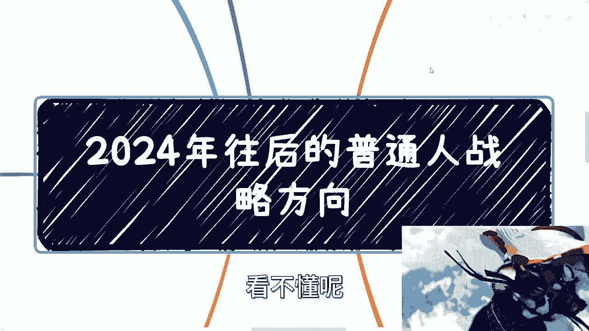
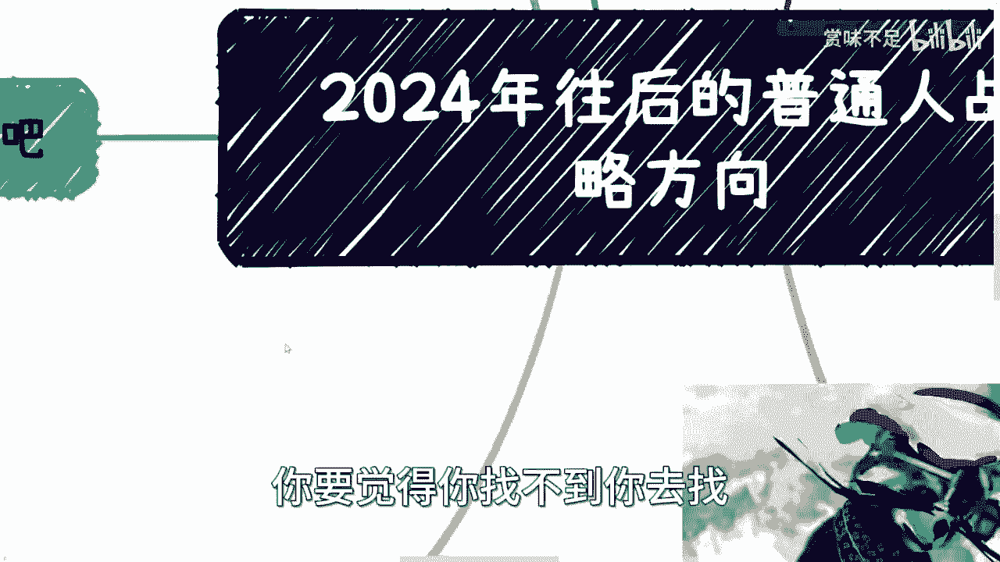

# 2024年往后的大众的战略方向---P1---赏味不足---BV1TC4y1n7MN

在本节课中，我们将要学习在2024年及以后的经济与社会环境下，个人应如何调整战略方向。课程将分析不同路径的可行性，并探讨如何更有效地积累财富与抗风险能力。

---

## 概述

我昨天在登机前发布了一条状态，可能有些朋友未能完全理解其含义。我想在此进行扩展说明。我当时的观点是，普通民众应当认真思考如何赚钱。这里说的赚钱并非指单纯打工，因为打工通常难以赚到可观的财富。

当然，如果有人不认同这个观点，或者认为普通人没有选择，那也无需争论。每个人关注自身即可，愿意做就做，不愿意做就算了。我所分享的仅是基于我个人观察和搜集信息得出的观点，认可与否请自行判断。

首先需要明确一个核心前提：**富人的生活不会受到大环境波动的显著影响**。这个道理必须明白。

我昨天在状态中也明确指出，评估未来的时间周期，**最少应按10年来估算**，这是最稳妥的基准。

---

## 核心前提：环境已彻底改变

上一节我们提到了评估周期，本节中我们来看看我们所处环境发生的根本性变化。

昨天我提到的“翻篇了”，意指一切都已不同。过往的经验和路径不应再作为主要参考。具体表现在以下几个方面：

1.  **进入大厂**：不再拥有过去的成长空间和高额薪酬。
2.  **创业**：相应的土壤和政策支持已不复存在。
3.  **投资**：变得极为困难，不要用个别成功案例以偏概全。
4.  **职业规划**：传统的、线性的职业规划逻辑已经失效。

未来充满不确定性，试图精确预测几年后的趋势或个人发展路径是不现实的。在宏观层面，我们可能面临一个长达10到15年的调整期。但在微观的个人层面，制定过于长远的详细计划没有意义，因为**变化永远会超出计划**。过度计划只是浪费时间。

---

## 路径一：打工 💼

在明确了环境变化这个大前提后，我们首先来分析最常见的路径：打工。

从当前情况看，我的观点越来越被验证：**打工是没有前景的，并且会越来越没有前景**。当然，是否选择打工取决于个人，这里仅阐述客观分析。

无论你去哪里、做什么岗位，从整个国家的基数来看，打工这条路的意义有限。本质上是竞争会越来越激烈，工作体验可能越来越压抑和辛苦。

除非你能彻底想通：打工只是为了暂时获取生活费，并不妨碍你在业余时间学习、成长和探索其他可能性。如果你仍幻想通过打工实现清晰的职业晋升（从A到B再到C），从而赚取更多财富，那很可能是不切实际的。

我们来算一笔账，评估一下“抗风险能力”。人生总要面对生老病死，而优质的医疗资源永远是稀缺的。有时你需要钱，有时你不仅需要钱还需要社会关系和地位。

**抗风险能力**意味着你能应对突发变故，例如失业、重大疾病或急需资金周转。那么，需要多少存款才算具备这种能力呢？我曾咨询一些22-23岁的年轻人，他们认为在30-35岁时拥有**500万可动资金（不含固定资产）** 才算有抗风险能力。

以10年为目标计算，在扣除日常消费、保险、医疗、购房、结婚等所有开支后，你需要净赚约**1000万**（或至少700-800万）。这相当于每年稳定净收入**100万**。

在未来的环境下，大多数人能稳定每年赚10万已属不易，更别提100万。许多人还在纠结于买房买车、日常消费，能拍胸脯保证每年稳定赚100万的人寥寥无几。

关键在于，如果你的收入无法突破某个临界点，那么月入1万和月入10万在抗风险能力上没有本质区别。看看一线城市的房价和物价就明白了。因此，要么安于现状不要多想，要么就必须想尽办法**突破收入瓶颈**，实现高性价比的赚钱。单纯把工打得再好，年薪百万，在真正的风险面前依然脆弱，连核心区域的半套房子都买不起。

如果还幻想通过打工遇到好老板、拿到股票分红翻身，那更是不接地气。可以多去了解现实中的企业家、高校老师或公务员，就知道现在有多困难。

---

## 路径二：借力打力的副业 🤝

既然单纯打工天花板明显，本节我们来看看如何利用外部资源创造额外收入。

“借力打力”指的是在不依赖传统打工的情况下，寻找出路。例如，可以像我一样，在不同平台或机构挂靠，提供工具人或服务型工作。另一种方式是寻找那些已有一定积累的小型企业或作坊，与他们寻求合作，例如帮忙运营、分销、找客户、处理会务或打杂等。

**核心原则是：不要白手起家，要借助已有的平台和资源。**

当然，很多人会问：“别人凭什么和我合作？”在经济环境下行时，大家必须明白一个道理：**不是所有问题都有现成的解决方案**，解决方案往往需要你自己去创造和争取。

如果你决定走这条路，就需要好好包装自己，清晰地告诉对方你能提供什么价值，准备好相关的介绍和文件，展现出专业性和合作诚意。如果什么都没有，看上去像“野鸡合作”，自然不会有人理睬。一切取决于你自己的行动和准备。

---

## 路径三：赚取“原本就存在的钱” 💰

上一节我们讨论了如何借助外力，本节我们深入探讨一种更隐蔽但可能更稳定的赚钱逻辑。

这是我最倾向于推荐普通民众去尝试的方向。其核心在于理解：中国社会存在大量“你不赚，我不赚，但总有人会以各种名目花掉”的经费。

赚钱的目的，不一定是把你的产品或服务“卖给”客户，说服他购买。而是**与对方合作，通过产品或服务作为载体，将某一笔既定的经费“套现”出来**。

这笔钱通常是基于预算、KPI或特定项目存在的，它的支出是计划内的。你的任务不是创造新的需求，而是成为实现这个支出计划的环节。因为**这笔钱的存在是稳定的**，关键在于找到它并参与分配。

企业、高校、社会组织、政府机构等，方方面面都存在这样的机会。你需要做的是发现这些节点，并设计出参与的方式。

---

## 路径四：创业 🚀

最后，我们来谈谈风险最高的路径：创业。

如果你仍想创业，那么必须满足一个核心条件：**拥有健康的、确定的现金流**。否则就不要开始。

所谓健康的现金流，指的是你的创业项目必须有非常清晰、直接的盈利模式。能明确算出一个月、两个月或半年能赚多少钱，并且这个钱从哪里来是确定的。

例如，你可以说：“我的团队与某某单位合作，承接科委的某个项目。只要按标准完成，每月就能稳定获得10万元项目经费。这笔经费已经立项，只要我们执行就能到位。” 这才叫创业，这才叫赚钱。

不要再去幻想“我先做个产品/平台，未来可能吸引多少用户，然后可能通过广告或增值服务盈利”这种模糊的故事。在当下的环境里，这种不确定性过高的模式风险极大。

---

## 总结与展望

本节课我们一起学习了面对未来环境变化的几种战略方向。

总而言之，2024年往后，日子肯定不会轻松。无论你相信与否，一个核心任务就是**必须提升你赚钱的效率**。不能再满足于通过拼命加班、996换来二三十万或四五十万的年薪，这无法构筑真正的抗风险能力，在意外面前不堪一击。

很多人有紧迫感，但这种感觉往往不接地气。现实是割裂的：一边是很多人为生计发愁，另一边是消费力依然强劲。未来这种割裂可能会加剧。

最务实的建议是：**少看网上空洞的分析和阴谋论，多线下接触真实的人和事**。没有关系就慢慢积累关系，去了解真实的商业运作和资金流动。记住核心：想办法更高效地赚钱。

最终的选择无非两种：要么按照上述思路去尝试和突破，要么彻底放松心态、安于现状。请根据自己的情况，整理好思路和问题。