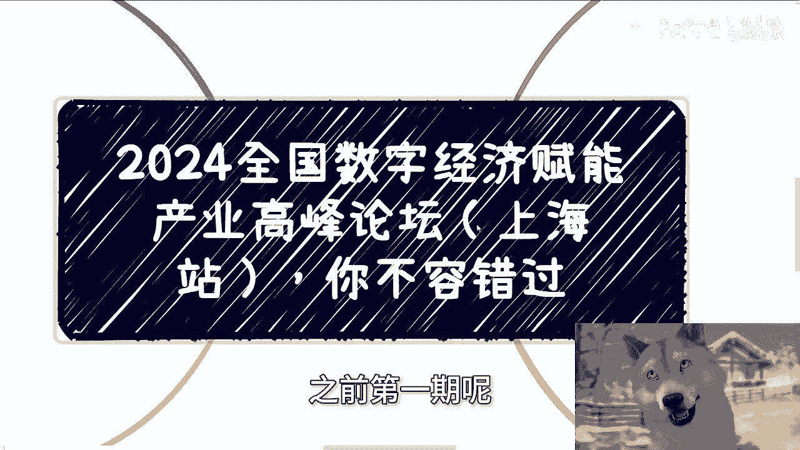
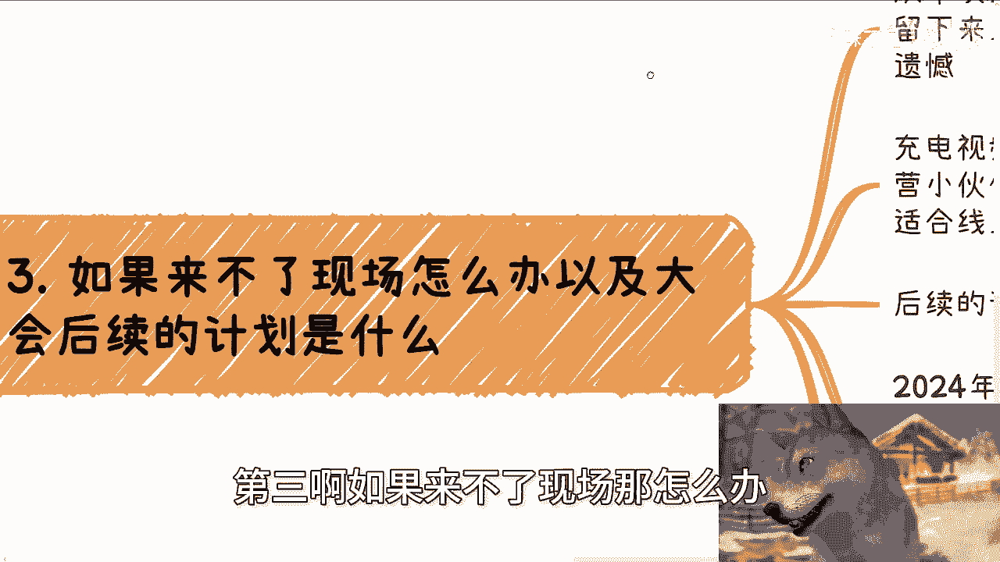
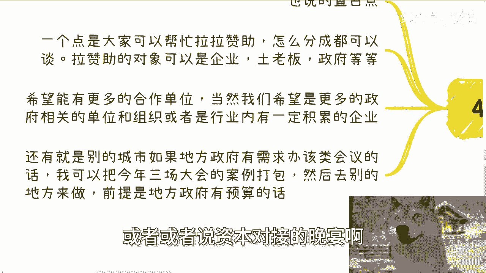

# 2024数字经济赋能产业高峰论坛(上海站）诚邀大家来参加 - P1 - 赏味不足 - BV1CXsEe2EuN

好好大家好啊，这个今天我们讲的这个主题呢，就是我来给大家介绍一下啊，就9月8号会在上海这边呃，举办2024年全国数字经济，赋能实体产业的这么一个高峰论坛啊，上海站呃，之前第一期呢是在6月30号的深圳啊。

上海呢现在是第二期，那么嗯同样的啊，就下一期活动已经定了好吧，然后9月8号在上海啊，我找了京师律呃，京师律所啊合作，感谢京师律所呢赞助的这个场地，还有现场的这个摄影摄像的这个团队。

那么从这个信息大家也能知道啊，就本次的大会开始呢，就会有录像了啊，这个没有不能来到现场的小伙伴呢，也不要太遗憾啊，这个我觉得所有的内容该保留还是要保留的啊，也感谢B站这个运营给我的建议啊。

那么呃这个大会我在这，今天这个视频呢主要就是给大家来介绍的啊，首先呢这个数字经济，赋能实体产业的这个第二站，第一站呢在深圳啊，主旨呢还是让大家能够有一个怎么说呢，就是更好的机会吧。

或者来说就是说啊就是大家可以无脑啊，闭眼冲的这么一个机会啊，接触一些更有价值的正规的，同时值得认识的这么一个就组织啊或者活动啊，那么你看今这次的合作方呢，我找的那个联合主办呢，就是那个北京京师啊。

然后在上海的这个律师事务所，指导单位呢是东华大学数字资产研究院，跟上海这个政法学院啊，那么战略合作呢，就是第一个是那个上海市的那个信息安全协会，那么这个也是市一级的协会呃，到时候就是他们的那个秘书长。

或者其他人也会过来，那么清华大学出版社，因为是我的合作方嘛，就就已经合作十多年了嘛，大家可以在这个活动详情可以看得到啊，出了一个嘉宾啊，然后是那个杭州的啊区块链技术联合会啊。

那么也感谢本次的这个技术联合会的一个支持，然后是地空之家啊，还有我这边就这这个公司呢，就是我那个合作方哎，也不是火锅合作方，我以前朋友啊，我朋友阿里出来，然后创业做的一个大数据。

然后现在是结合人工智能啊，做了一个创业公司啊，然后呢，我也邀请他在那个啊大会上面出了一个topic啊，然后这个人无论是技术啊，还是说其他的，因为我我认识也快10年了吧，到现在差不多就这个人怎么说呢。

技术上关系上都很好啊，也欢迎大家过来，其实可以跟他多交流交流，然后最后就是浙江中科，浙江中科呢是杭州这边的一家啊，还是很不错的这么一家创业公司啊，然后这边的话会后续会有一些，就是其他的合作啊。

嗯然后详细的那个报名链接呢，我会放在视频的这个详情跟评论区的好吧，第二呢就我来说一下，就是大家来能获得什么啊，我觉得第一个呢就是能更好的了解，数字经济是什么，以及当下众多的比如说个人啊，政府啊，企业啊。

资本啊，在这个领域都在做点什么，那么大家也可以结合对应的案例啊考虑考虑，就自己可以有哪些可以做的，那么另外一方面呢到现场来，那我觉得呃，更多的能够认识我邀请来的这些嘉宾啊，反正我没啥限制。

就说白了本来我做这个活动的目的，就是为了让更多的人，大家相互能认识的对吧，那认识人各凭本事啊，我做的活动本身就是为了普罗大众服务的，那么本次来的话呢，有资本啊，有政企有高效，当然这个还有我对吧。

那么有啥合作或者咨询的呢，也可以线下找我，那活动上面呢我们有啥都可以说啊，畅所欲言，呃，然后另外一方面呢，感谢B站赞助了这次的周边啊，所以啊这个改一下35啊，对那么所以说我们前35名报名的。

我会随机给小周边啊，这个反正大家就在链接里面报名，我后台都看得到啊，呃还有第二个啊，就这个活动呢，所有的基本上都是我一个人来做的，包括联系场地啊，嘉宾啊，组织整个的一个框架，整个流程啊对吧。

也就我一直说的一个人的一个团队，就WMANWTEAM的这么一个方式来做的，那在大家也可以过来看一下对吧，一个人哼能做出来什么样子的一个东西啊。

第三啊，如果来不了现场，那怎么办。

以及后续的计划是什么啊，从本次大那个上海站开始啊，所有的大会啊，现场摄影摄像都会保留下来上传B站呃，跟呃感谢B站这个运营给出来的建议啊，作为充电视频会放出来，大家也不用太遗憾。

另外一方面呢充电视频会单独做个定价，这个我之前跟B站的运营小伙伴，也已经商量讨论过了啊，会定一个比较合理的，适合线上的这么一个价格啊，肯定比这个线下来低嘛，而且肯定低不少嘛对吧，否则的话就是不公平啊。

那么后续的计划的话呢是这样子的啊，这里我也给大家介绍一下，就2024年的数字经济，赋能实体产业的大会呢，基本上我在人数上面会控制在，100~150个人，那么城市的话呢目前就三个，一个是深圳，一个上海。

一个北京，那么本次上海是9月8号，北京的话放在12月份啊，那么明年的话呢，基本上规模我会按照正常的大会的规模来，也就是300~500人啊，那么然后呃整个的一个流程啊，包括物料啊。

我也会全部根据以往的正规的那种大会的这个，级别来做啊，呃不过有一说一啊，这个到底什么时候按照这个来呢，主要还是要根据具体的经济形势来推定啊，因为毕竟按照我现在了解下来的情况，明年比今年可能更难啊。

所以到底怎么一个情况嗯，反正走一步看一步嘛，那么最后一个呢就是寻求对应的合作。

那我也说直白一点啊，没啥好藏着掖着的，一个点呢就是大家可以帮忙拉赞助，对吧啊，那么怎么分呢，其实都可以谈啊，那么拉赞助的对象呢可以是企业，可以是土老板，可以是政府啊，我觉得这个都可以啊，呃这个是一方面。

第二方面呢希望能有更多的合作单位啊，当然这点我也要提一下，因为也不是说大家那个都来嘛对吧，因为毕竟你看啊联合主办啊，指导单位啊，战略合作都放在这边了，那么额从办活动角度来讲。

那我们肯定是因为希望一期比一期好嘛对吧，也不可能走下坡路嘛，所以说我们希望能够有更多的政府单位啊，更多的政府的组织啊，或者说行业内有一定积累的这些企业，那么更多的能够介绍过来合作。

那还有就是说如果别的城市呢，比如说一些地方政府啊，有需求办数字经济也好，或者来说数据要素也好等相关会议的话，那么我可以把今年三场大会的案例做打包啊，然后呢就是说啊直接可以跟政府去谈啊。

但是前提是政府地方政府得要有预算好吧，那么我觉得这个几个方面是非常好的啊，包括就是说呃会议本身，如果来说大家有一些什么呃，希望能够有一些高级晚宴啊，或者或者说资本对接的晚宴啊。

你们有需求也可以跟我提啊，这个东西我可以在呃我大会，比如说我可以在我大会的那个呃场地啊周围，比如说晚上找点清吧啊，找点，比如说包包个小酒吧啊，或者怎么样子，然后大家可以我我再给大家来这个，把一些领导啊。

或者把一些嘉宾或者把一些资本拉过来，大家可以就是闭门式的对吧，在交流啊也行啊，所以说不管怎么样吧，我觉得当下因为整个经济情况也比较差嘛对吧，那么呃而且另外一方面呢，我觉得我做到现在啊。

就是很多小伙伴也跟我提，就是他们在呃市场上面可能能看到很多活动，但是呢他们可能一方面没有办法去分辨，这些活动的好坏，另外一方面也无法去知道在这个活动上面，能否认识一些可能对自己有价值的人啊。

那我觉得至少我现在做的这个这个东西呢，对大家来讲应该是呃比较接地气的，同时也比较符合大家的，怎么说呢，就是说呃符合大家目前的一些现状吧，啊因为本身我这边找的嘉宾也都是我认识的人。

同时呢也都嗯反正人都很好啊，所以说我觉得大家过来其实有有什么都可以聊，然后大家该该加微信加微信，该该该接触接触对吧，因为毕竟我觉得你看这次嘉宾啊，有的是政府单位，有的是律师，有的是阿里出来的创业者。

有的是资本，我相信这些人呢现在未必一定帮得上大家，但是未来你们做任何事情的时候，估计肯定是需要只有这样类型的靠，并且是靠谱的人，能够帮助到你们对吧，那么我相信这些认识的人对你们来讲应该是呃。

不管是现在还是未来都会有很大的帮助啊，好那么活动我基本就介绍到这好吧，然后大家反正要报名的话，直接就是评论区啊，和那个详情里面就连接直接报名好吧，反正有什么东西，你们有任何问题或者别的东方面的话。

你们反正私信再找我啊，行啊，就这么着好吧，然后呃剩下的话就是说主要的那个工作上面，就职业规划啊，剩下就是副业啊，包括你们跟别人一起合作一些商业啊对吧，商业上的规划包括合同啊，分红啊，分润啊，股权啊。

股份啊啊你们希望通过我的一些认知，结合你们的一些情况，能够给你们一些更接地气，或者还是说嗯，让你们少走点弯路的这么一些建议和规划的话，那么你们可以整理好对应的问题跟个人背景啊，然后私信我。

我们再来走咨询好。