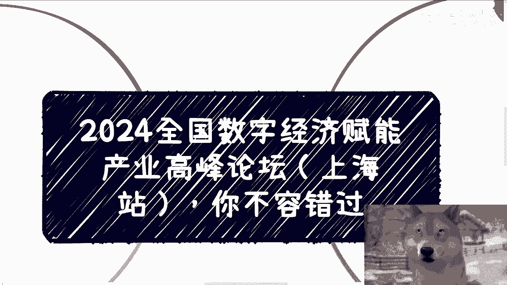
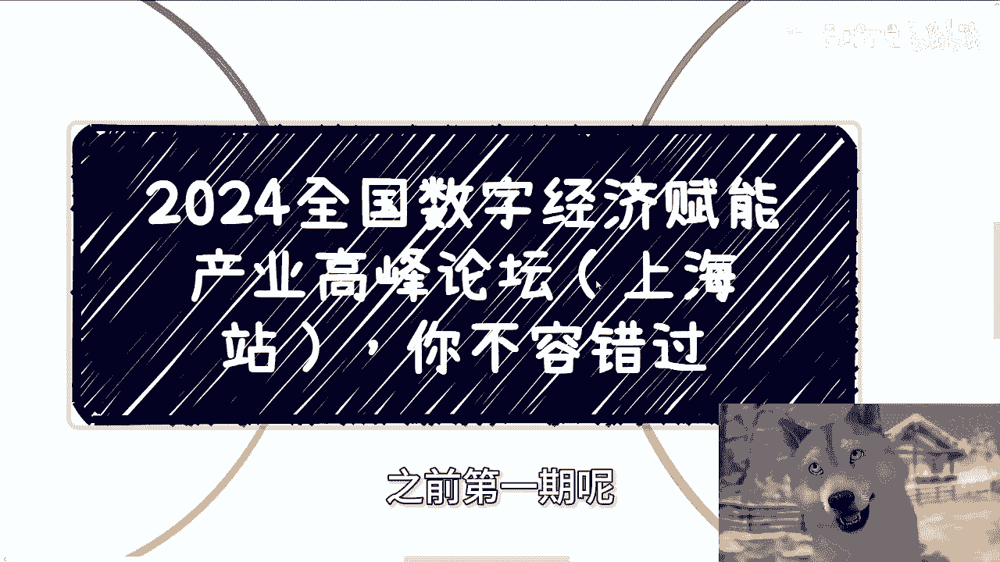
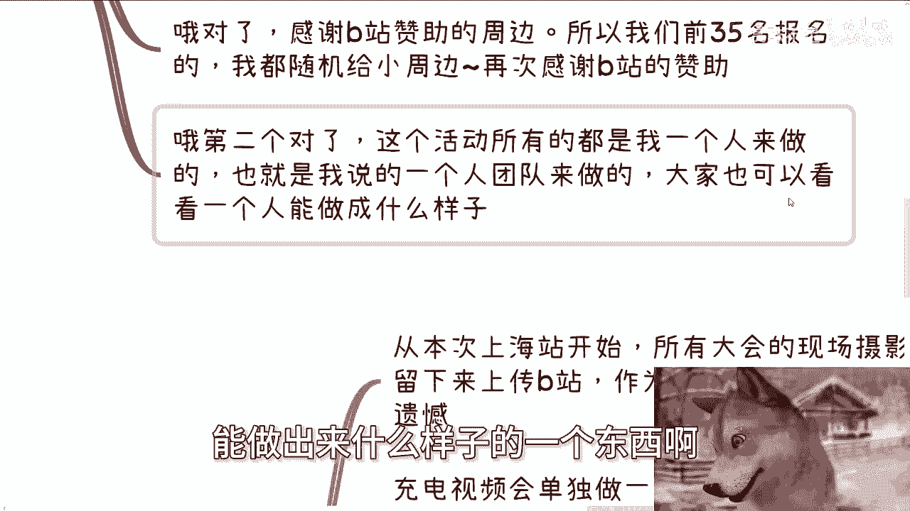
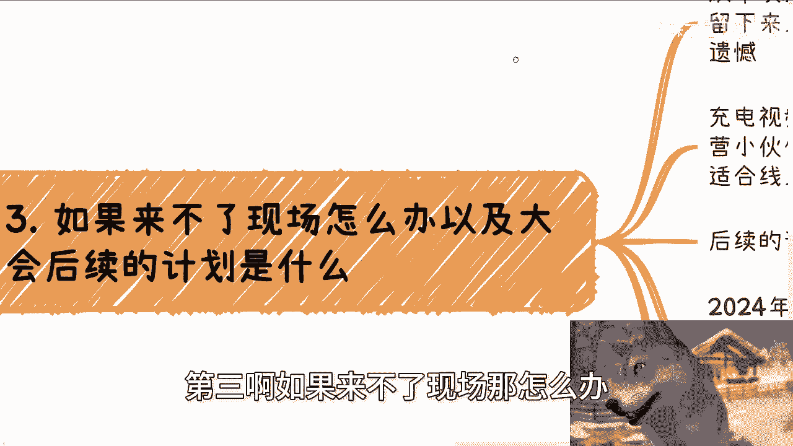
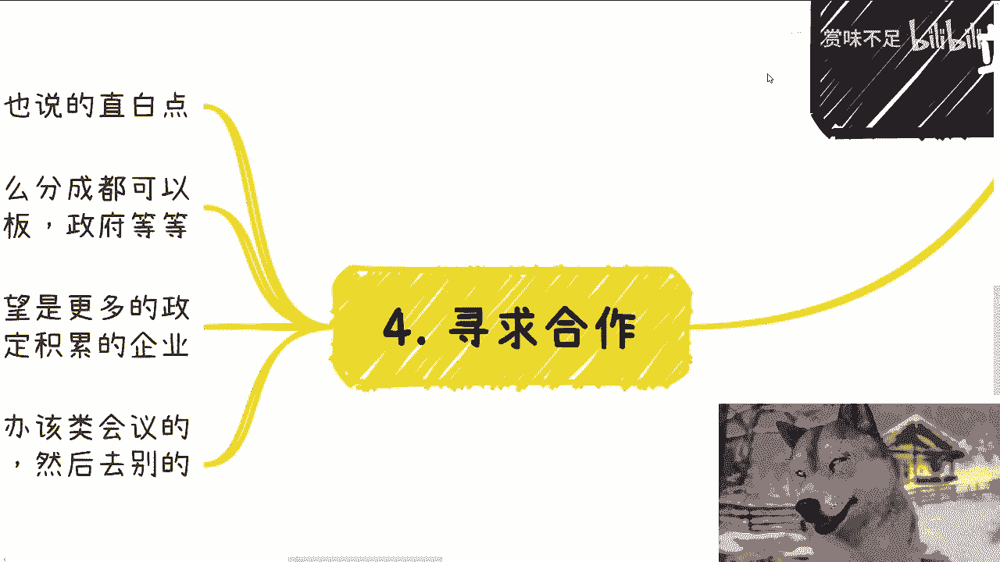

# 课程：活动组织与推广实战 🎯 - P1

## 概述

在本节课中，我们将学习如何组织并推广一场行业高峰论坛。我们将以“2024数字经济赋能产业高峰论坛（上海站）”为例，拆解活动策划、嘉宾邀请、合作方对接、线上线下内容规划以及寻求商业合作的全过程。通过本次学习，你将掌握举办一场专业活动的基本框架和核心要点。

---

## 活动背景与定位 🗓️

上一节我们介绍了课程的整体目标，本节中我们来看看本次活动的具体背景与定位。

2024年全国数字经济赋能实体产业高峰论坛的第二站，将于9月8日在上海举办。该系列活动的第一站已于6月30日在深圳成功举行。

本次上海站活动旨在为参与者提供一个接触高价值、正规组织与活动的可靠机会。活动已确定下一期的举办计划。

---

## 合作方与支持单位介绍 🤝

了解了活动背景后，我们来看看如何构建活动的支持网络。以下是本次活动的主要合作与支持单位：

*   **联合主办方**：北京京师（上海）律师事务所。
*   **指导单位**：东华大学数字资产研究院、上海政法学院。
*   **战略合作单位**：
    *   上海市信息安全协会（市一级协会，其秘书长等人将出席）。
    *   清华大学出版社（长期合作方，将派出嘉宾）。
    *   杭州区块链技术联合会。
*   **其他合作方**：地空之家、演讲者朋友的AI大数据创业公司、浙江中科创业公司。

活动的详细报名链接将置于视频详情页与评论区。

---

## 参与者价值与收获 🎁

成功对接资源是活动的基础，而明确参与者能获得什么则是吸引他们的关键。本节我们聚焦于活动的核心价值主张。

参与者到场可以获得以下价值：
1.  **深化行业认知**：更好地理解数字经济的内涵，了解个人、政府、企业、资本在该领域的动态与案例，从而思考自身的潜在机会。
2.  **拓展人脉网络**：现场有机会结识来自资本、政企、高校等领域的嘉宾以及其他参与者。活动鼓励自由交流与合作咨询。
3.  **获得限量周边**：感谢B站赞助，前35名报名者将随机获得活动周边礼品。

本次活动从策划、联系场地与嘉宾、到设计流程，均由个人独立完成，体现了“一人团队”（`ONE MAN ONE TEAM`）的运作模式。

---

## 线上内容规划与未来展望 📹

并非所有人都有机会亲临现场，因此线上内容的规划同样重要。本节中我们来看看无法到场时的解决方案以及活动的未来计划。

对于无法来到现场的伙伴，大会内容将通过以下方式呈现：
*   从本次上海站开始，所有大会将进行现场摄影摄像，内容会上传至B站。
*   完整内容将作为“充电视频”发布，并会设定一个低于线下门票的、合理的线上价格。

关于后续计划：
*   **2024年**：大会规模控制在100-150人，举办城市为深圳、上海、北京。北京站计划于12月举办。
*   **2025年及以后**：计划将规模扩大至300-500人，并按照正规大型会议的流程与物料标准来操作。具体执行将根据实际经济形势调整。

---

## 寻求商业合作与拓展 🚀

一个成功的活动可以成为更多商业机会的起点。最后，我们来看看如何基于现有活动寻求更广泛的合作。

合作方向主要包括以下几点：
1.  **赞助招商**：欢迎引荐企业、资深人士或政府机构提供赞助，具体分成方式可商议。
2.  **优质合作单位**：希望引入更多政府单位、行业组织或具有积累的企业作为合作方，以提升活动质量与影响力。
3.  **政府项目合作**：如有地方政府需要举办数字经济、数据要素等相关会议，可将今年三场大会的案例打包，与有预算的地方政府洽谈合作。
4.  **定制化增值服务**：可根据参与者需求，在大会场地周边组织高级晚宴、资本对接闭门会等深度交流活动。

在当前经济环境下，本次活动力求接地气，帮助参与者辨别活动价值、结识可靠人脉。邀请的嘉宾均来自可信赖的圈层，涵盖政府、法律、创业、资本等领域，旨在为参与者构建现在与未来都可能提供助力的关系网络。

---

## 总结

本节课中，我们一起学习了如何系统性地组织和推广一场行业论坛。我们从**活动定位**出发，逐步分析了**资源整合**（合作方）、**价值设计**（参与者收获）、**内容延伸**（线上规划）以及**商业拓展**（寻求合作）等关键环节。整个过程体现了从0到1打造一个活动品牌的基本逻辑，即：明确目标、整合资源、创造价值、规划延续、探索商业化。希望这些实战经验能为你未来策划类似活动提供清晰的思路和可借鉴的框架。

---
*（注：关于个人职业规划、副业、商业合作、合同股权等问题的具体咨询，需整理好个人背景与问题后通过私信渠道进行。）*