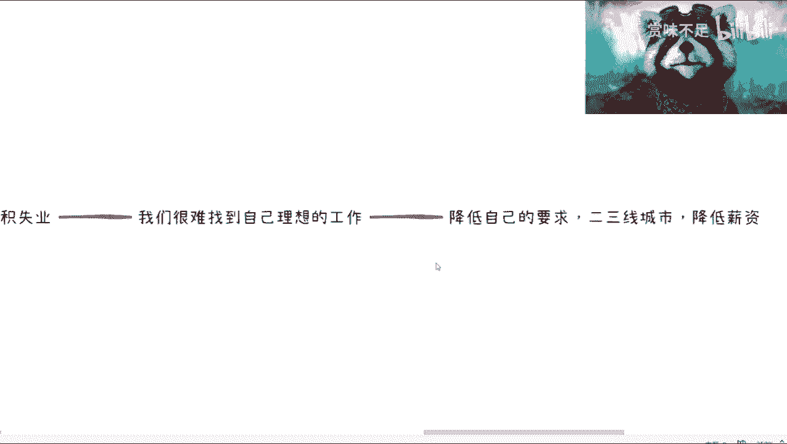
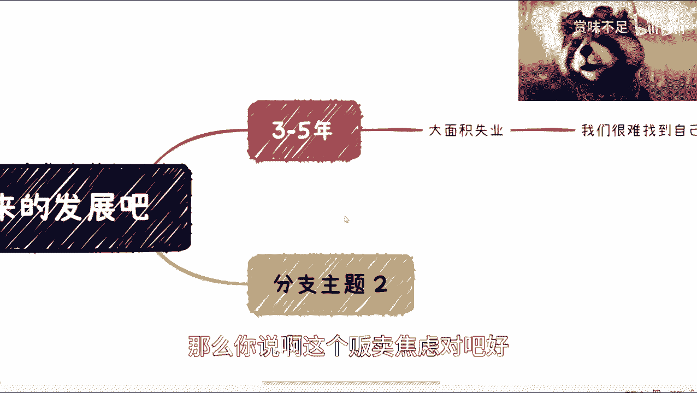
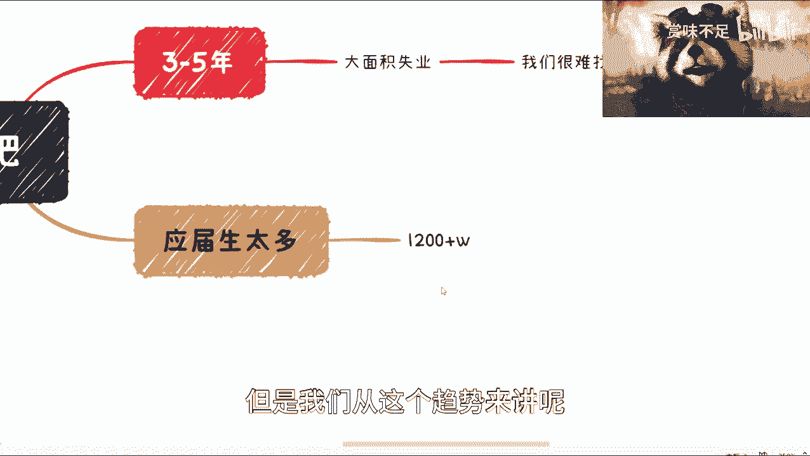
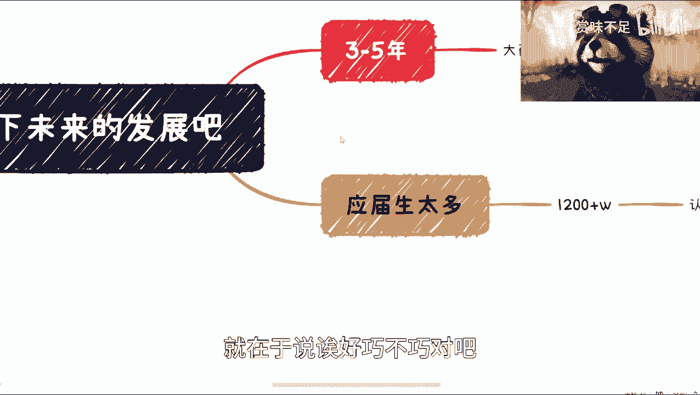
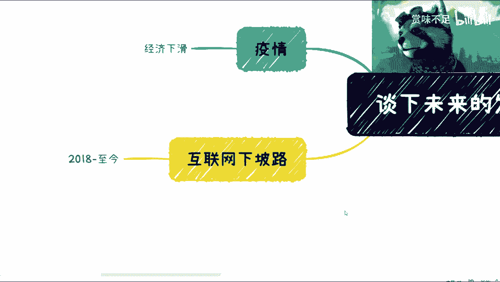
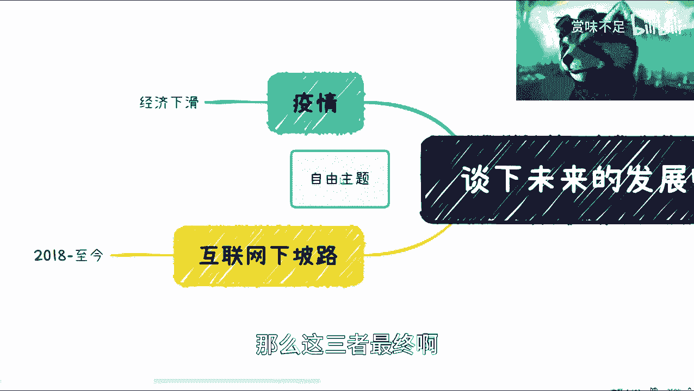
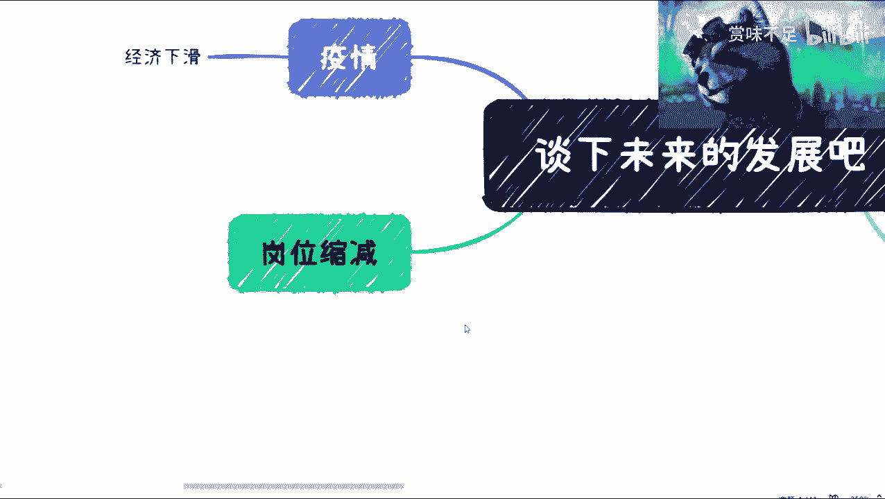
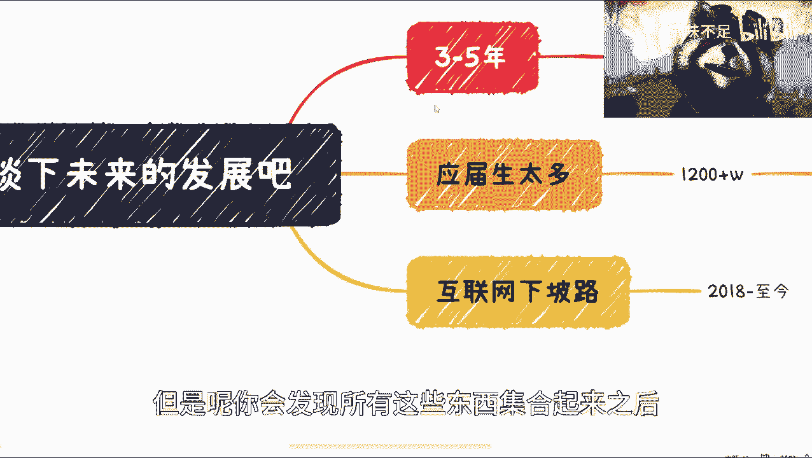
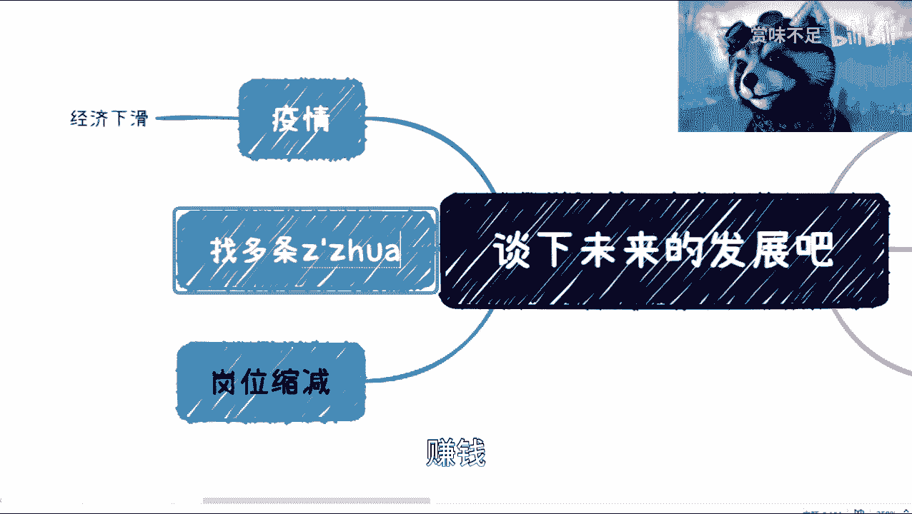

# 3-5年后，大家一起面临失业吧~ - P1 - 赏味不足 - BV1uM411s7NW

好啊大家好，那个这一期呢我简单想谈一下这个未来发展啊，然后呢就是我打算这个最近也咳咳也弄些课啊，弄些课，这样的话就是说呃把这个就是内容呢，把它稍微多扩展一下，因为B站啊或者其他地方呢。

我觉得呃很多免费的内容呢，我会做的比较比较散好吧，然后首先是这样子的啊，就是啊，如果你觉得比如说今天这个主题是贩卖焦虑，那么我也我我觉得你可以不听下去啊，但是我希望你能够记住我的一个结论，结论就是说啊。

3年五年内肯定是要大面积失业的好吧，你要觉得啊这个交流是存在的，那么你继续听我往下讲。

好吧啊，那么呃因为最近呢就是我也找了很多人，其实我从去年年底开始就找了很多人啊，不同行业的不同层次的啊，然后不同认知的都聊了一下，那么呃一般来讲呢，其实我不太会去说我聊了一两个人。

然后我就直接得出这么一个结论比较难啊，嗯但是现在从各个方面得出结论呢，我觉得基本上大差不差大差不差。

那么首先我们来说啊，这个时间点上面是什么呢，三到5年啊，我觉得这个时间是比较贴切的哦，比较贴切的，那么这个时间呢，主要来主要的这个问题在哪里呢，在于这个呃大面积失业好，那么这个问题呢是这样子的，诶。

我今天竟然没有弄弄那个主题啊，呃，是我失策了失策了，我能不能换个样式，突然有点不习惯啊，这里这里这里啊，这样对吧，他们就失业好，那么这个地方呢我觉得我得纠正一下啊，大面积失业并不是说你找不到工作。

什么意思呢，就是说呃我们很难找到自己理想的工作啊，这个是一个核心，在这个核心之下呢，就是说如果我们很难找到呢，那么其实无非啊我们往后来讲，无非能做的是什么呢，就是啊降低自己的这个要求对吧。

那你比如说这个这个这个二三线城市啊，啊呃往下退对吧，然后要么就是说降低薪资对吧。

啊我这个图画的有点长了啊对吧，那么我觉得首先是第一点。

那么你说啊这个贩卖焦虑对吧好，那么我们呢要拿数据来讲话对吧。

我觉得现在核心的点呢主要有那么几个原因，第一个原因是应届生态度啊。

那应届生太多了，你今年的数据是多少，大概1100，我忘记了，1600，600还是多少，反正我就写吧，1200+1200加对吧，那么我觉得呢这个数据呢其实你说多不多，可能没什么概念。

但是我们从这个趋势来讲呢。

这两年是呃上升的啊，这样上升的。

但是应届生多呢，我觉得并不是重点，重点是在于这些应届生的这个认知，因为那我写错了认知对吧，因为我觉得认知这件事情是很关键的啊，我们这么说，就是说其实你多不多，取决于整个泡沫大不大对吧。

因为以前互联网这个行业在于这个神坛上面，那很多人就算道听途说，觉得啊互联网很牛逼对吧，互联网能赚很多钱，那他们的认知虽然非常的表面，但是只是你说也没问题，也没问题，也就是说比如说1200万里面有。

那么这个50%的人都在往互联网挤，那其实也不会造成太大的问题，但是当下的问题在哪里呢，当下的问题是在于互联网下坡路啊，2018年，至今那我们说到至今到至今啊，好那么这个是最大的问题。

那么这个问题会导致什么呢，我回头会在唉，我觉得我回头在那个，在那个在那个详细的课程里面，我再我再说吧，好吧，就是2018年至今最大的问题在哪里呢，因为也有很多人觉得你这个说法不对啊。

他说互联网虽然造就了非常多的这个呃，他说互联网也造就了非常多的就业对吧，你比如说滴滴啊，饿了么，美团对吧，好这没毛病啊，没毛病好，那么2018年至今，互联网走下坡路，主要的点是在于整个大众这个C端也好。

B端也好，G端也好，也就是企业端和政府端，都觉得他的投入产出比其实不高啊，或者来说从某一些时间点来讲，他的烧钱烧的太多啊，创业说的太多，那么在这个事情里面呢，其实啊当然你说这个事单纯来讲呢。

它其实也没什么问题，因为它不过就是一个叫做事物的正常发展，规律嘛对吧，你你互联网啪走到上顶峰，然后往下降，这个也很正常嘛对吧，那那么接下来还有一个问题。

疫情对吧，那疫情这件事情呢，我觉得啊，我们现在不是谈他到底做的对还是不对啊，因为在本质角度来讲没有什么对或不对对吧，但是呢疫情造就了什么呢，的确造就了一个问题，就是经济，对吧。

那经济下滑不单单是中国的问题，整个全球都一样啊，全球都一样，那么我觉得整个这件事情来讲啊，也没什么问题，因为疫情也不是只有国内有对吧，这个所有国家都有啊。

但是呢现在最大的问题在什么地方呢，就在于说哎好巧不巧对吧。

好巧不巧就是应届生太多啊。

互联网走下坡路啊，经济下滑，那么这三者最终啊。

那么还有一个就是表象的表面现象是什么呢，就是岗位这个这个这个缩减对吧。

那么这个呢其实是一个很表面的现象啊，但是呢你会发现所有这些东西集合起来之后。

他无非就只能得出一个结论，就是大编辑失业。

为什么呢，因为很简单，因为互联网已经占据了比较大的比例啊，互联网占据比较大的比例，包括啊我们说最近的cheat GB t，GBT这个问题呢，就是说你说他是不是会代替大量人工，我觉得不会。

但是你说他会不会代替人工，我觉得会啊，但是这个要看不同的这个切入点，和不同的定位啊，这个我觉得后面我再我再详细去讲啊，我觉得我会出一个比较详细的大纲，好吧啊，呃大面积失业，那么也有人会说吗。

他说怎么办，对吧啊，那免得有人喷我啊，那说什么啊。

你这个免费视频对吧，内容讲一半啊，我讲完啊，讲完很好，你怎么办，我觉得是这样子的，我不管你现在是年薪百万还是年薪几10万，我在我看来都没没什么区别啊，没什么区别，那么我觉得是唯一的是什么呢。

就是找多条赚钱的通道啊。

啊这句话怎么理解啊，这句话怎么理解啊，是这样子的，你说我理解成找多份工作打工，可不可以可以啊，你要有这个本事，我觉得没问题对吧，没问题好，这是第一个，第二个就是说你找多条赚钱的渠道，什么意思呢。

就是说可以有份安稳的工作，赚多少钱并不重要，重要的是你可以去做很多的小生意，这个小生意可能就是说各种各样，我举个例子，比如说你说你不想做直播，你做不来，没关系的，那你有没有货源呢。

你提供一些货源让别人做做直播，让MCU做做直播对吧，那你有没有认识的朋友呢对吧，那这个当中比如说大家凑合凑合一起做，做一些业务，你在当中分享认知吧，那按照我日常的说法。

就是plan a b CD e f g你得练好，然而为什么我现在要来讲这个话题呢，是因为在我看来，我们当下还是有机会的。

包括我哦，我们当下还是有机会的，这个时间就是最后的时间窗口了，在我看来，因为你到那个时间你再去做，那是不可能的，那个时候已经卷成狗了哦。

已经转成狗了，那当然有很多人会说对吧，他说我不care啊对吧。

我不担心啊，我可以去做滴滴啊，我可以去做外卖，哎这又是另外一个话题了啊，另外话题，但是我可以告诉你们，这不是一个解决方案啊，你们去做了就知道，这绝对不是一个解决方案好吧。

那么我觉得就是说这个可能是最关键的，那有很多人也会说嘛，他说哎呀，我也不知道我能做什么对吧，我也没有什么渠道，我也不做生意，我跟你们说啊，没有人一开始就能知道他做什么的对吧，我之所以今天这么说呢。

是因为我希望大家能够从现在开始，在未来的这几这几年里面多找找人聊聊对吧，多挖掘挖掘信息，多挖掘挖掘，关心大家自己的，多多去这个找些方式对吧，因为你这个关系啊，渠道都是找出来的对吧。

你不是说你你你现在除非你家底很厚对吧，你说你你你家里什么十七八个孩子对吧啊，十七八个兄弟姐妹对吧，那那个现在很多人独生子女，或者最多两个两个这个啊，一一个姐姐哥哥弟弟妹妹对吧。

那这种的话其实就是说就比较难了啊，所以说其实还是得靠朋友，可以多聊聊，多联系联系。

好吧，我觉得就是说大框架呢就这么一个框架，那细节呢我就不在这边说了。

好吧，就这么这么一个情况嗯，我最后补充一句吧，这个焦虑不焦虑，大家自己判断好吧，我说不好听点，我没有什么卖不卖的意思，因为我在我看来，现阶段这个情况已经到了快到临界点了。

