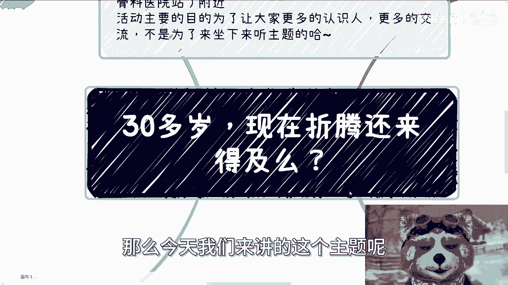
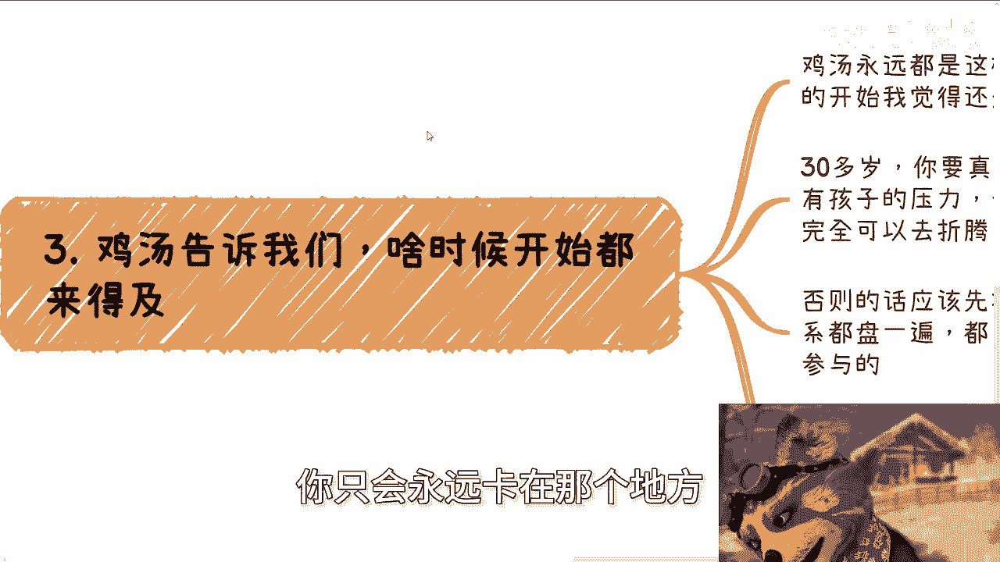
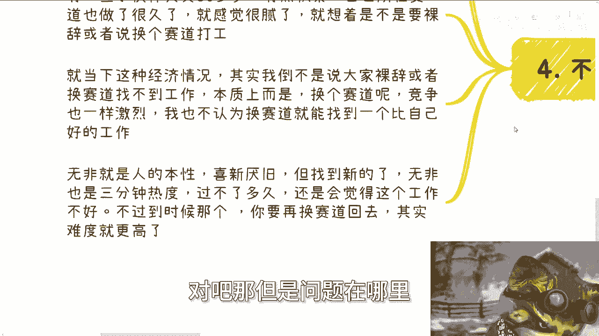
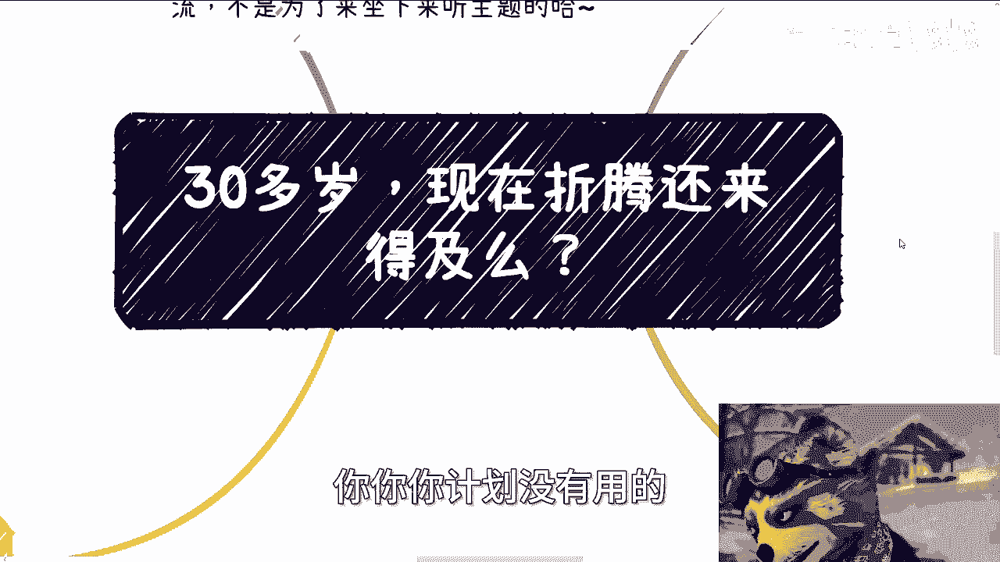

# 30多岁，现在折腾还来得及么 - P1 - 赏味不足 - BV13n4y1d7xw

好大家好，那么今天我们来讲的这个主题呢是很多人问我。

30多岁，现在折腾还来得及吗对吧，一般问这种问题得到的答案都是鸡汤啊。

就说你什么时候开始都来得及是吧啊，那本次那个再说一下，本次活动已经定了，定在6月16号下午01：30到六点好吧，场地已经定了，在那个成都啊，成都青羊区省骨科医院附近好吧。

活动主要目的是为了让大家认识更多的人，更多的交流啊，不是为了过来听主题的好吧，你们过来的话就是多交流交流啊，那首先第一个啊，我觉得吧大部分人呢其实没有没有必要去考虑，我们说的这个30多岁的这个问题啊。

为什么，因为其实大部分人缺的他不是技能啊，他说什么我有没有一技之长，不是啊，也不是缺什么智慧啊，也不是什么天时地利人和都不是，这就好像大家说什么运气好，运气怎么样怎么样，我跟你讲啊。

其实根本就没有到拼运气的时候，我最近跟他们举例子，我就说啊，比你比如说我这个账号啊，我这个账号开了，他妈到现在1500多天了对吧，那你们想想看，你们真的认识我到现在能有几天啊，那么我开了多少天对吧。

那我要是说他妈的两天晒网，三天打鱼，那他妈大家也不会认识我对吧，那很多人跟我讨论做事的时候，我我跟你讲就开始跟我讨论什么，比如说什么选什么题材啊，动画啊，音效怎么做啊，对吧等等等，我说咱先别说别的。

你先跟我一样坚持一年，每天都发，你能有几个人坚持下来，而且需要自驱力，需要自我鞭策，不是旁边有个人拿鞭子抽你啊，不是那种抽啊，哼对吧，然后就有人要说，他说陈老师啊，方向选材当然很重要啊，没毛病。

但我打赌啊，大部分人做字呃，做自媒体啊，无非就两个方向，你要么只会选择自己擅长的，要么就他妈会追，会会追热点，你还会啥呢对吧，我说不好听点，就大家只有做这两个东西是做得下去的，你否则做什么呢。

你没东西做了啊，那那我就问嘛对吧，你比如说那你要要么做坚持自己擅长的，要么就坚持去去去追热点，没了呀，你还能干嘛呢对吧，你也不要再去想说我什么选材，你有什么，你有哪些选材可以选。

你告诉我你去选一个你不熟悉的，也不是热点的，我就问你既坚持不下去，也没有流量，那你做什么东西对吧，那大部分人我可以说你其实没有这个毅力。

那那你就更别去谈什么细节了，你知道吧。

就是你先对自我评估一下你有没有这种自驱力，你再去想，我说啊，我30多岁或者我40多岁，或者我20多岁，我来得及来不及，他妈的有什么来得及来不及的呢。

对不对啊，第二我们说回主题啊，说实话，我觉得那些20多岁思前想后也就算了啊，那么30多岁的人呢，本质上我认为根本就不应该问出这样的问题，为什么呢，因为人家20多岁或者18岁的那些小伙伴。

人家有年轻的资本，人家有浪的资本，人家可以去拖，人家也可以选择不折腾，甚至人家都可以选择啃老啊，选择直接躺平啊对吧，人家都可以选，为什么呢，因为人家年轻对吧，人家耗得起，但你说一个30多岁的人。

想法理论上应该更成熟，如果你不成熟，那么你就想办法让自己成熟，如果你自己还不成熟，那么你就不要问这种问题，因为你不成熟，问出这种问题也没有意义，你得出得到的答案，无论答案正确与否，对你来讲也没有意义。

对不对啊，那么我们就说要我说啊，30多岁，如果还不明白，那我觉得你需要去思考，你为啥不明白啊，但如果你想明白了，你，你又不行动，那么我跟你讲，你如果想明白，30多岁不行动，我跟你讲，你未来也不会行动。

因为本质上啊坚持和行动，这个事情只有零次跟无数次。

你永远卡在那个地方，那你只会永远卡在那个地方啊。

第三鸡汤告诉我们什么时候开始都来得及，对吧好，那我们就这么说啊，鸡汤永远都是这么说的，但是30多岁开始跟20多岁开始，我觉得是不很不同的，你30多岁你要真想折腾，除非你没有结婚，也没有孩子，也没有房子。

也没有什么东西的压力，那没问题啊，我觉得你完全可以去折腾，否则的话啊，那么你要先你就不是像20多岁那样，就是说去折腾了啊，你至少先将自己的同事啊，领导啊，朋友啊对吧，你身边一路比别人多活十多年啊。

这种关系都盘一遍，都了解一下大家在做什么对吧，有什么可以参与的，就是我就这么说，如果你这10年或者将近，就是说10年的这个工作工作时间，你盘下来都没有什么机会，没什么资源，我觉得你就不要折腾了。

说实话你就不要折腾了对吧，还是还是找朋友内推，或者说跳槽，或者说当下的工作，你随便这里面选一条路，你继续苟着对吧，因为大概率啊，你说你工作这么长时间，你身边的朋友或者已经目目，就是就是视野可可范围。

视界视野可见范围内的这种机会跟资源，如果都没有的话，那我觉得大概率你不折腾还好，一折腾就是怕损失更多对吧，实事求是来讲啊，然后第四点就是不要裸辞，不要换赛道打工，因为你可以一边工作一边摸索。

你也可以换赛道，一边换赛道去做一些别的生意或者兼职，但是你千万别裸辞或者换赛道去打工，为什么，因为有一些呃我不是说有一些就大部分的啊，就是说这个这个人啊，人类啊30多岁有点积累啊。

然后呢自己所在的一些赛道做了很久很久，就可能感觉很腻了啊，就想着是不是说要裸辞或者换个赛道，我跟你讲啊，就当下这种经济情况，其实我不是说大家裸辞或者赛道找不到工作啊，本质上是你裸辞了。

或者你换个赛道去竞争，一样是激烈的，就如果你现在这个工作，你觉得做的很腻，或者你觉得工资工资不高，你换了个赛道，本质上你也是一个道理，我不认为你换一个赛道，30多岁的人。

换一个赛道能找到一个比现在自己好的，我他妈真的不认为啊，无非我觉得就是人的本性喜新厌旧，但是你找到新的无非还是3分钟热度，过不了多久，比如说一个季度，两个季度你就会觉得卧槽，这工作他妈还是很腻。

这工作他妈还垃圾对吧，那但是问题在哪里。

问题是到那个时候你要再换赛道回去，卧槽这他妈难度就高了，对不对啊，所以说啊我觉得就是这种类似的问题，就跟啊我们说这个很多人说，我到底现在是出来工作呢还是考研呢对吧，我到底是出来工作还是考公呢对吧。

或者说他已经在公务员体制内了，问我就说我到底是这只狗在里面，还是说出来这个折腾对吧，我跟你讲本质上是什么，不是你这个时间点合不合适，时间点永远都有合适的，也永远都有不合适的，你永远在那边等对吧。

我给你们讲，我举个例子啊，你就像很多人很可很也很好玩的，就跟我说，他说爱川阳师，我觉得我想苟几年，我看看到时候经济好的时候，那我说按照你这个逻辑，我们不知道什么时候好对吧，好那我们假设啊5年都不好。

你怎么滴啊，你憋个5年吗，万一你憋不住怎么办，对不对，就未来的事情，不要去当成一个射线在那边思考你，你你计划没有用的。

你知道吧，所以说你不要太去在意，说整个客观因素到底是好和不好，因为好和不好都是相对的，你你你说现在不好，那一样有人赚得到钱啊，你说好，那有人赚不到钱，那那那怎么说呢，对不对，所以说就说核心点是什么。

就是你是不是一个懂得察言观色的人，你是不是一个自驱力很强的人，你是不是一个啊，就是就是懂就是就是懂得去闯的，或者说就有这种魄力去闯的，然后你是不是一个就是说这种比较比较能够，我不说10年如一日了。

就是两三年如一日的这种坚持的人，就你活这么大，20多岁，30多岁，你多少对自己有点了解吧对吧，你我跟你讲，你但凡不是别啊，就别不要听说啊，什么时候出来多好啊，什么时候都能开始，什么时候都来得及。

是没有错，而这个话听着都很舒服对吧，都怎么样子，但是你要评估你，否则你出来干什么，对不对啊，你说你你说像这两天有一个咨询的小伙伴，我就跟他讲，我说我说我不是否定你啊，我说未来你怎么样，我不知道。

有可能两年后你飞黄腾达都只都可能的，但是我说就当下的你来讲，你你们不合适，为什么，因为聊下来我就知道，就是说他他表达可能一般啊，然后呢，他对社会上的这个人情世故也没有经验对吧，他对很多东西都不了解。

那怎么滴啊，你让他现在他妈的出来直接干这，干不了啊，怎么干呢，对不对啊，行好吧。

那这个主题我们就说到这那个成都好吧，报名的继续报好吧，反正时间还早呃，然后职业规划，商业规划啊，分润分红啊，股权啊，然后什么合同啊，然后项目计划书啊，白皮书啊啊包括你们手上有什么牌，没有什么牌的。

你们希望通过啊跟我的沟通啊，对你们的项目，或者对你们接下来这个规划能有更好的一些，贴近中国发展，贴近全球发展的一些这个这个方向的话啊，那么你们可以整理好个人问题跟背景，你们可以来走呃，咨询啊。

然后另外我提一点就是说啊，想从我这边直接得到说啊，通过这个什么一个小时的咨询，就就想说啊，我要赚到钱，我一定要赚到钱对吧，我咨询完我不赚到钱，我不行的对吧，我我就伸手党啊，你们不要来找我，我没这本事。

你们找别人去啊。