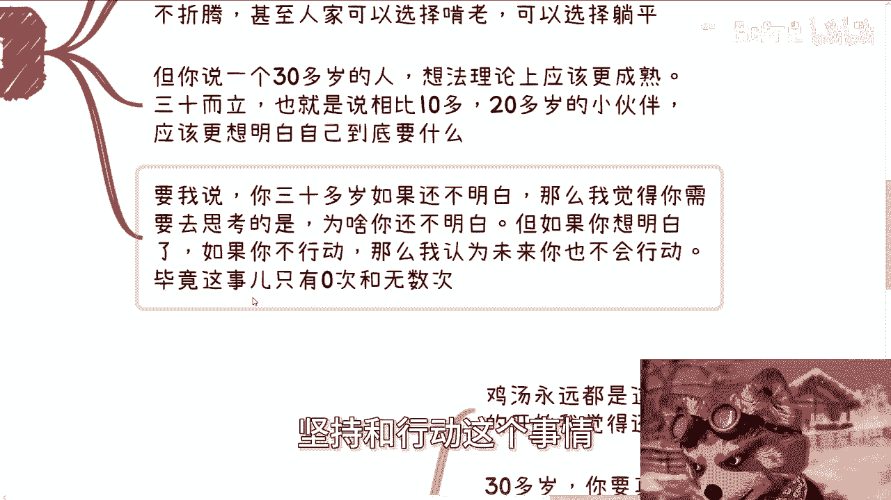
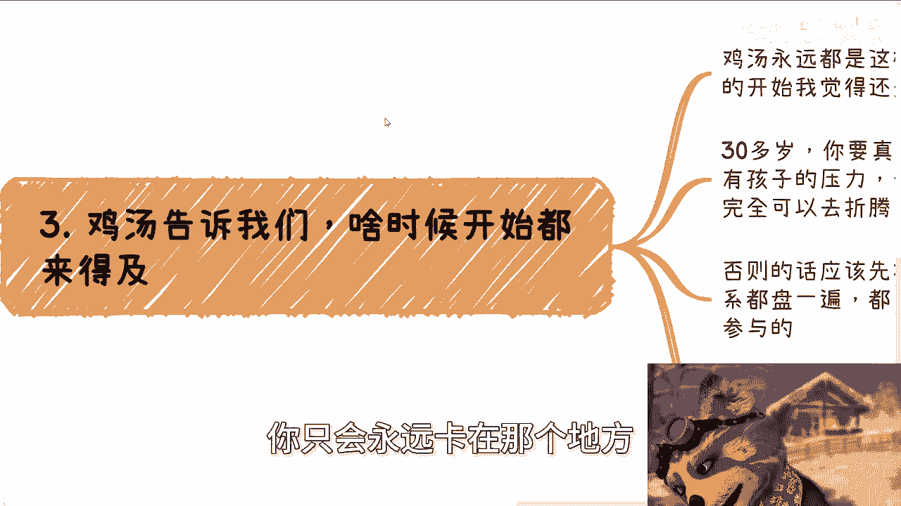
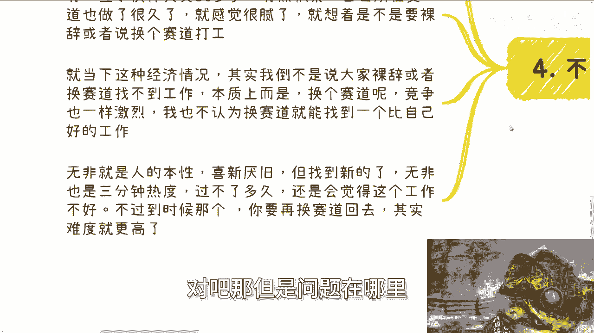

# 30多岁-现在折腾还来得及么---P1---赏味不足---BV13n4y1d7xw

## 📖 概述
在本节课中，我们将探讨一个许多人关心的问题：30多岁开始努力或改变赛道是否还来得及。我们将抛开鸡汤，从现实和自我评估的角度，分析问题的核心并提供务实的建议。

---

## 🧐 核心问题：30多岁折腾是否来得及？
很多人会问，30多岁现在开始折腾是否还来得及。通常得到的答案都是鼓励性质的“鸡汤”，告诉你任何时候开始都来得及。

---

## 📅 活动通知
本次活动已确定于6月16日下午1:30至6点在成都青羊区省骨科医院附近举行。活动的主要目的是促进参与者之间的交流与认识，而非单纯聆听主题演讲。希望大家能积极参与交流。

---

## 1. 首要障碍：缺乏自驱力与坚持
上一节我们提到了普遍的回答，本节中我们来看看问题的本质。我认为，大部分人其实无需过度担忧年龄问题。

原因在于，大部分人缺乏的并非技能、智慧或运气。事实上，很多人甚至没有到达需要比拼运气的阶段。我常以我的账号为例，它已持续运营超过1500天。如果只是“三天打鱼，两天晒网”，大家也不会认识我。

许多人讨论做事时，总喜欢先讨论选材、动画、音效等细节。但我认为，首要条件是能否像我一样，在无人鞭策的情况下，依靠**自驱力**坚持每天发布内容，持续一年。能做到的人寥寥无几。

有人会反驳，认为方向选材很重要。但现实是，大部分人做自媒体，无非只有两个可持续的方向：
*   选择自己擅长的领域。
*   追逐热点。

你很难找到一个既不熟悉、又不是热点的领域，并坚持下去。因此，对大部分人而言，缺乏的是**坚持的毅力**。

在毅力不足的情况下，讨论细节没有意义。

所以，你应该先进行自我评估：**你是否有强大的自驱力？** 想清楚这一点，再考虑年龄问题。本质上，这与年龄无关。

---

## 2. 30岁应有的成熟度
接下来，我们回到主题本身。我认为，20多岁的人思前想后尚可理解，但30多岁的人本质上不应提出这样的问题。

20岁的年轻人拥有年轻的资本，可以选择尝试、拖延、躺平甚至啃老，因为他们耗得起。但一个30多岁的人，理论上应该更加成熟。如果不成熟，就应该想办法让自己成熟起来。在不成熟的状态下，无论得到什么答案，对你都没有实际意义。

如果你想明白了却不去行动，那么你未来很可能也不会行动。因为**坚持和行动，只有0次和无数次**。

你如果永远停留在“想”的阶段，就只会永远卡在那里。

---

## 3. 30岁折腾的现实前提
鸡汤常说“任何时候开始都来得及”。但30多岁开始与20多岁开始截然不同。

如果你30多岁且未婚、无子女、无重大经济压力，那么完全可以去折腾。否则，你就不能像20岁时那样毫无顾忌。

你应该先盘点自己过去十多年工作中积累的资源：你的同事、领导、朋友等关系网。了解大家都在做什么，有什么机会可以参与。

如果你工作了近十年，盘点下来却发现没有积累任何机会或资源，那么我建议你不要轻易折腾。更稳妥的选择是寻求朋友内推、跳槽或在当前岗位上深耕。因为在这种情况下，折腾很可能带来更多损失。

---

## 4. 重要建议：不要裸辞或换赛道打工
最后，我们来看一个具体的行动建议。你可以一边工作一边探索新方向，也可以尝试在新的赛道做些兼职或生意。

**但切记：不要裸辞，也不要换到一个全新赛道去打工。**

很多人因为在原赛道积累多年感到厌倦，便想裸辞或换行。但在当前经济环境下，无论在原赛道还是新赛道，竞争都一样激烈。30多岁换到一个全新领域，很难找到比现在更好的工作。

这往往是“喜新厌旧”的本性作祟，但新鲜感过后（可能只需一两个季度），你可能会发现新工作同样令人厌倦。而到那时，你想再换回原赛道，难度就非常高了。

这类问题（如“该工作还是考研？”“该留在体制内还是出来闯？”）的本质，不在于时间点是否合适——永远都有合适和不合适的时间。关键在于你是什么样的人。

不要将未来设想成一条射线去计划，因为计划往往赶不上变化。

不要太在意整体经济环境的好坏，因为好坏都是相对的。核心在于你是否具备以下特质：
*   懂得察言观色。
*   拥有强大的自驱力。
*   具备闯荡的魄力。
*   能够坚持（不要求十年如一日，但至少能坚持两三年）。

你活了二三十年，应该对自己有基本的了解。不要只听信“任何时候都来得及”这种令人舒适的话，而要基于对自己的清醒评估再做决定。

我曾与一位咨询者沟通，我并非否定他的未来，但就当下而言，他表达能力一般，缺乏社会经验，对很多事物不了解。在这种情况下，他直接出来闯荡是不现实的。

---

## ✅ 总结
本节课我们一起学习了关于“30多岁折腾是否来得及”的务实思考。我们分析了缺乏自驱力是首要障碍，讨论了30岁应有的成熟度，指出了30岁折腾需要具备的现实前提和资源，并给出了“不要裸辞或换赛道打工”的重要建议。关键在于自我评估，而非盲目听从鸡汤或担忧年龄。

---

## ℹ️ 补充信息（咨询与活动）
成都活动报名仍在继续，时间尚早。
关于职业规划、商业规划、股权合同、项目计划等问题，若你希望通过对谈获得更贴近发展的方向，可以整理好个人背景与具体问题前来咨询。

**请注意**：指望通过一小时咨询就能保证“赚到钱”的“伸手党”，请不要来找我，我没有这个本事。