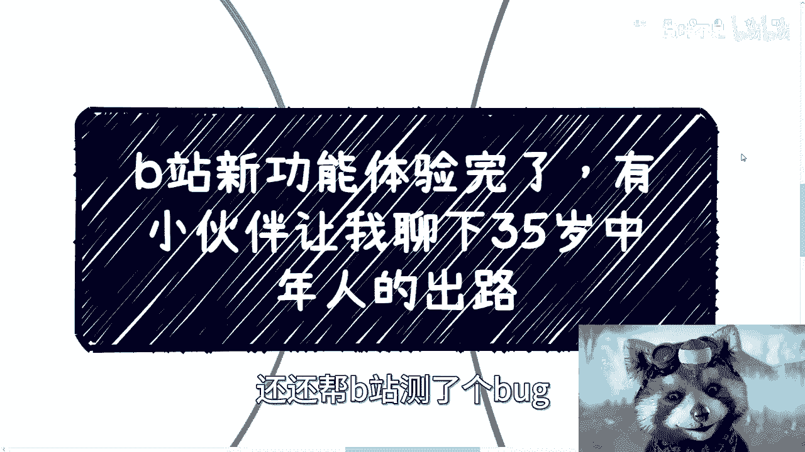
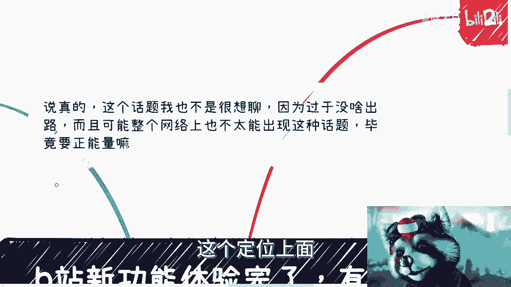

# 35岁中年人的压力和方向 - P1 - 赏味不足 - BV18j411a7vY

哈喽大家好，昨天B站的新功能也体验完了，就那个私信充电私信了，还帮B站测了个bug。

然后呢就有小伙伴回复我说，关于这个35岁中年人的出路，呃实话实说啊，这话题我也不是很想聊，因为说实话就是没啥出路，我但凡跟你们说出路很多，那他妈就是在骗对吧，而且可能整个网络上。

也不太可能会出现这种话题，因为毕竟都要正能量嘛对吧。

你不能传播负能量啊，那么想了一想说啊，可以可以说一下啊，呃先说现在35岁的几类情况，那一呢就说年龄到35了，但是心理年龄估计也就25左右，也就是说男性目前在中国这个社会里面，大部分的人呢，那当然了。

我也不能说多大部分对吧，至少我接触下来大部分的人呢，他是不成熟的啊，主要是对人和事的判断能力较弱，同时感情上面肯定也不成熟，我觉得女性更有发言权对吧，我就不说了，同时呢自己也没什么规划啊。

第二个呢就是30而立，有的人呢35岁呢，他有过大厂的经验，或者也有不错的，这个曾经辉煌过的这种工作经验啊，但是呢也仅仅限于公司，35岁之后想在公司里面苟着，已然已经是个比较难的事情了，当然了。

很多人也会说嘛，他说这个是不是只是互联网呃，其实任何东西我觉得在未来都是一样的，它只不过这是要是一个过程啊，互联网可能属于在整个过程里面的先锋队，其他的呢我觉得也大差不差，不会有什么太大的差别。

除非有一些领域，特别的领域，特别的行业是属于越老越吃香的对吧，这个倒没毛病啊，但这种的话相对来讲，我觉得呃你要这么想，越老越吃香呢，这个吃相他也不可能说，比如说公司里面对吧，这一个部门20多个人。

大家都年纪上去了，都吃相，你觉得可能吗，不可能的呀，对不对啊，所以说本质上你要说吃不吃象呢，他也是一个金字塔这个网上的一个道路啊，那么还有的呢属于一路比较顺的啊，但自己呢也可能对自我要求。

也也也还有点要求啊，觉得想突破一下自我哦，或者说想要了解更多东西，因为有很多人呃，毕竟嘛打工这么长时间了嘛，他总会觉得会疲倦啊，那么也会有那种，就是说哎希望自己再再再浪一把对吧。

想要在40岁之前能有不同的经历和认知，那么大部分情况呢，那么我们就来说，大部分情况应该是看似有工作经验，其实这些工作经验也没什么太大用处，看似有社会经验，其实这些社会经验也没有太大用处啊。

所以说大部分我觉得35岁的人，他其实已经处于身不由己的状态，呃这个才叫大部分啊，否则我觉得就不接地气啊，当然这里我觉得学历特别好的啊，家境特别好，也不叫家境特别好，家境比较好的啊，能有不错的家底啃老的。

那当然这个地方我不管你啃不啃啊对吧，有不错的家底啃老的。

这些都不在我们讨论范围内啊，因为这些我觉得不在这个普罗大众的这个。

定位上面啊，那么第一个我们来看35岁面临的问题，要说面临问题呢，我觉得还不如说面临的压力和突发情况呃，因为也没有什么问题这件事情啊，用问题这两个这个词来描述，我觉得不是特别贴切啊。

呃其实现在很多人呢其实还年轻啊，包括咨询我的人也都非常年轻，然而任何事情呢我觉得就怕一个一个去列啊，一般呢我其实给他们列了之后呢，他们自己也就会有压力的，因为他们现在年轻没压力很正常啊。

但是随着时间的发展，你总归会有压力，这些压力这些压力没有办法的，是因为你活在人类社会，你就会面对这些压力，没有没有办法的，你可以节省，但是有很多东西你是节省不掉的，它是硬成本啊，那么在这个地方呢。

就是说无论男女，我觉得都一样啊，不是说有很多人说哎呀，我觉得男的压力更大对吧，女的可以去什么抱大腿或者怎么样的，我觉得没什么区别的，因为毕竟最最终你但凡要做点什么事情，或者但凡你觉得这个。

这个希望自己活的有点尊严，你就会觉得你能靠得住的，只有你自己，别人是靠不住的，不管你男女无所谓，那么这里呢有一些个例情况我就不去谈了，大部分人面临的压力应该是来自于贷款，父母的赡养，孩子的教育。

当然本质上你要说这些这些东西本质是什么钱，那没毛病啊，但我觉得压力其实是分成两部分的，一部分是物理，是社会上面，就是人类社会物理事情上面对于钱的需求啊，这是一部分。

那我觉得这部分呢更像一个站在悬崖上的人啊，然后每天都在拼命往前走，而他往前走的原因并不是因为他想往前走，而是因为这个悬崖，每天还在动态的逼着他往前走啊，当然这部分其实我还没有算上，大家去结婚用的钱对吧。

因为生孩子用的钱，彩礼房子车子的钱，我什么都没算，我说实话，我觉得大部分的年轻人啊，从现在往后到你们35岁的时候，这些钱就算不算，你们的压力也会很大啊，那么另外一层压力来自于自己。

因为每个人在当下都是独一无二的，对自己来讲，你每一个时间段都是第一次对吧，你没有任何的以前的，你说啊，我活过一次对吧，或者怎么样，你没有任何的经验或者历史去可循，那么你就不得不去考虑一个问题。

而这种东西你不一定会跟外人去讲，但是每一个人内心都会去考虑这个问题，就是自己到底接下来怎么发展，未来到底应该怎么办对吧，只不过就是说由于你们的认知不同，由于你们的格局不一样。

可能你们考虑的问题的就是就是复杂度，包括就是这个问题的嗯，我们说高度可能会不一样，但是本质上我觉得大家都会去面对这个问题，或者说都会去思考这个问题啊，这个没有办法的呃，那么关于突发情况呢。

也也就是比如说各种疾病啊，算是比较常见的各种慢性病啊，各种先天的急症啊对吧，包括等等等，这些其实都是突突发情况，那当然还包括日常的一些小毛小毛小病，小意外对吧，客观的说呢，我们只能祈祷啥事没有啊。

因为大部分情况一旦有点什么事情呢，基本上你虽然不能说毁灭性打击，但是你会身心俱疲，而且声音巨皮呢不是你一个人，你连带着你的家属，你的家庭都会橘皮，没有办法的，因为因为很多时候你说中国也不是中国吧。

就是人类社会家庭，你到35岁，你面临的就是这些问题对吧，孩子啊，父母对吧，你家里比如说你你你要有钱可以去雇保姆对吧，怎么样子，然后你跟你父母的矛盾，跟孩子的矛盾无非就是这些事情嘛对吧。

但是如果当中有任何问题，有任何意外呢对吧，你比如说像我前两天我们朋友对吧，这个骑骑电瓶车被撞了，没什么大碍，没有什么大碍，但是他得住院啊，那怎么办呢，请问工作怎么办呢对吧，未来怎么办呢对吧。

你你这段时间的修养，修养完了，找工作怎么办呢，这些都是问题啊，就像我说的，他不是毁灭性的问题，但是他会让你身心俱疲啊，对不对，哦对了，那么还有一个问题呢，就是说我觉得当时我对，大部分人还会面临一个问题。

就是他的固化的思想跟他的三观，因为大部分的问题我觉得不存在，不在于外界，而在于自己，35岁能保持空杯的已经很少了啊，固执或者执念其实是很多的，但凡不能去空杯心态，但凡不能客观地评价自己周围的话。

那么我觉得出路就是零，而这个出路零并不取决于别人，是因为你自己的问题那么好，那么第三点就是我们来说说关于出路对吧，首先我还是那个观点，客观的来说，大部分情况没什么出路哦，没什么出路不。

这不是说我要去贩卖焦虑或者我要怎么样，这他妈就是没出路啊啊那怎么办呢，对不对，因为我的理念呢很清楚，就是你现在你的现在是由你的历史组成的，而如果你的历史上没有太多的折腾，或者没有太多的突破。

那么我不相信你在35岁之后，能有什么多大突破，我不信了，因为大部分人就是这样子的呀，对不对，你跟我说，每个人都都都都都是这个，你说历史上有没有这种有啊，当然有啊，后起之秀啊。

还有人妈的50多岁做了有成就的，但是这才只占百分之多少吧对吧，那么剩下的话呢我觉得你要说吧，硬要说呢，我觉得有吗也有的啊，一个呢就是做自媒体啊，对啊，我之前是说过自媒体没有戏没有错，但是能做什么呢对吧。

我觉得自媒体是大部分人没有门槛，同时呢他又当然我只是35啊，你别来跟我说哇，吕老师，我22岁我要不要做，我觉得你不要做对吧，这叫没有办法的办法，这叫死马当活马医，你懂吗啊，你做点试点总比不做来的强吧。

万一呢对不对，因为你没有别的路啊是吧，要么呢我觉得就看看亲戚啊对吧，自己家里有没有一些传统的业务，就你甭管多传统，多细节，你哪怕是卖绣花针对吧，卖卖那种什么呃，你你你那个什么手工制品对吧。

怎么样都没关系，你要利用好互联网这个武器对吧，把那些细节业务去通过互联网放大，看能不能增加少许流量，就增加少许流量就增加你的收入对吧，这否则怎么办呢，你没有别的办法呀。

啊那么还有就是我觉得可以多打点兼职，当然我指的是那种比如说互联网类的，不一定教学啊，就是互联网类的，只要不是实体行业的，你可以多多找些互联网行业的这种兼职，也有的呀，你比如说英文啊，教培啊。

这里面有很多助教，你可能看上去是一些就非常零散，非常杂的或者非常循规蹈矩的活，但是怎么办呢，你没有别的办法，你可以试试看啊，多找几份啊，积少成多嘛啊，那么其实呢我还觉得，35岁也应该领悟一个事。

那就是钱这个东西是要用的啊，需要去用的，但是不是说你35岁说哎，我花钱去去去弄个学历对吧，或者我花钱去学点什么，不是的，我觉得你这个钱就要开始用，用什么呢，你就要开始去学会疏通关系。

当然你也许不知道怎么疏通，或者你不知道找谁，或者你觉得你没有人找，但其实我相信每一个人35岁，你身边你同学，你同事，你总有一些我不说牛逼吧，就总有一些就是就是有点积累的人，那你就可以疏通起来了。

你该请客吃饭，该请客吃饭，该请客喝酒，请客喝酒对吧，以前你也许都没有深入了解过，讨论过，那么这件事情你现在就可以开始做了，怎么办呢，没有别的办法呀，就是我不care大家以前性格是什么。

我也不care大家以前怎么样子，因为我我还是那句话，我们都是渺小的，我们是要围着别人转的，不是别人围着我们转的对吧，那怎么办呢，你要说别人围着你转，那我就觉得你你你你就不在我们讨论范围内啊，对吧。

当然我觉得路呢其实很多，但35呢，我觉得核心就在于你一定要去找到痛点，不要再去关心啊，这个形式多多啊，好像多好看啊，面子多好看多low对吧，这已经不重要了，我们已经不是那种说啊，站在坐在饭局饭桌上对吧。

然后你说过个年大家来问你，唉有没有找对象啊对吧，你工作怎么样啊，你你一年赚多少钱啊，已经不是说大家去争面子的时候了，这已这根本就不是这个这个这个时候了对吧，就是我相信所有到这个年轻人，他都会明白。

赚钱就是王道对吧，这不重要啊，稳定就是王道，赚钱就是王道对吧，毕竟不是那个好高骛远的年龄了，啊那么第四点就是关于这个工作啊，那么当然我觉得工作呢能苟就苟，但是很多时候我觉得不是我们能控制的，薪资多少。

我觉得不重要，重要的是一个稳定的收入和交一份金对吧，这我觉得是正常的思维啊，那么剩下的时间怎么折腾呢，这个就完全看个人选择了，因为有的人他自己觉得哎35岁看到老对吧，那你就看到老。

那有的人觉得哎呀自己可能还能抢救一下，那你去抢救对吧，你觉得我还想卷，那你去卷啊，那有的人觉得打工也打累了，想自己搞点什么，那你就去疏通关系，开始做起来对不对，因为你你自己去做什么，我觉得不太可能了。

你一定是站在巨人的肩膀上，哪怕这人不是个巨人吧，哪怕是一个这个这个怎么样，反正有点积累的，只要比你有积累，你就可以去站在他的肩膀上了对吧，那其实35岁的时候呢，我觉得多多少少啊。

你同学你同事总有一些有能力的，或者有积累存在的，脸面不重要啊，脸面值几个钱啊啊啊尊严值几个钱啊对吧，重要的是去聊啊，去蹭啊，去谈啊，而且在这个地方呢我也得提一点，35岁做事情不要再轻浮啊。

不要再就是啊很浮躁或者怎么样子，就是你要让对方觉得你是可信的，你是踏实的啊，不要再去搞那些有的没的小动作，这只会让别人觉得你很low啊，另外一方面就是，我绝对不建议35岁自己从零开始，什么白手起家。

或者说自己去投资点什么，我觉得没有意义，因为就如我说的，大部分人对社会跟商业他毫无认知的，他也许看着35岁他依然容易被骗，而且本身你到了这个岁数，你人对吧，你心有余力不足啊，你真的要从零做啊。

当然你要说我要去拼，我要怎么样，我觉得没问题，但是我觉得你的身体也不一定会答应，对不对啊，所以说呢你找朋友啊，从你的同事同学先找啊，虽然我不信啊，就是说啊，这个35岁相比以前有多少人，能够有多大的突破。

同时我也不信天上会掉馅饼馅饼对吧，但是我依然相信互联网这么发达的今天啊，每一个人你要去赚点钱，你想多赚一点钱，我不说这个钱多多，哪怕每个月多赚一两百，多赚三四百，你总有方法的，你总有一席之地的。

而且我相信你总归会去找到，就是比如说性价比相对比较高的对吧，有时候你说你说啊，我可能供我可能在那边费费老大劲对吧，我一个月呃要付出四个双休日，我每个双休日都在做，我可能增加了500块钱对吧。

但是我相信随着时间推移，你总能找到爱，我可能呃这个一个月就只要付出两个礼拜，或者说付出两个双休日，或者付出一个双休日，我就能赚500对吧，就是很多东西它没有个定论。

人就像我们说的，人是活的事情是死的对吧，你你你活着人你不能被事情憋死啊，总有变通的方法，只是你不知道啊对吧，总有业务可以做，只是你不知道啊，也总有业务是可以赚钱的，只是你不知道对吧。

那我们就想办法去知道吧，一就像我最后说一点，就像我之前一直说的，我们不再是应试教育了对吧，你35岁，你说有一本书叫35岁怎么样怎么样，然后你看完你说嗯我就照着搬的做，有不烂，没有了呀。

你哪怕现在照搬的去去跑美团，跑饿了么，做滴滴，他都里面有很多变通的道道，都像我们说的水都很深，哪里来照搬的东西啊对吧，那这才是人类社会啊，咳咳我不知道我讲明白了没有，我也不知道能有多少人能真正理解。

我这个讲的背后的逻辑跟背后所要表达的意思，但是也差不多啊，我觉得我能表达的都表达了好吧，哎呀行吧，就这么着吧啊，那么我希望反正大家都能够有一席之地吧，那都能够有这个呃，给自己能够至少带来一部分啊。

保证能够抗风险的能力的这种业务吧，啊行那就这样吧好吧，然后大家反正有任何的问题，有任何的副业，有任何的啊，关于商业上的这个补贴不确切的东西，或者不知道自己手上牌怎么打他，你们整理好。

我们愿意走咨询的咨询啊，不愿意走咨询。