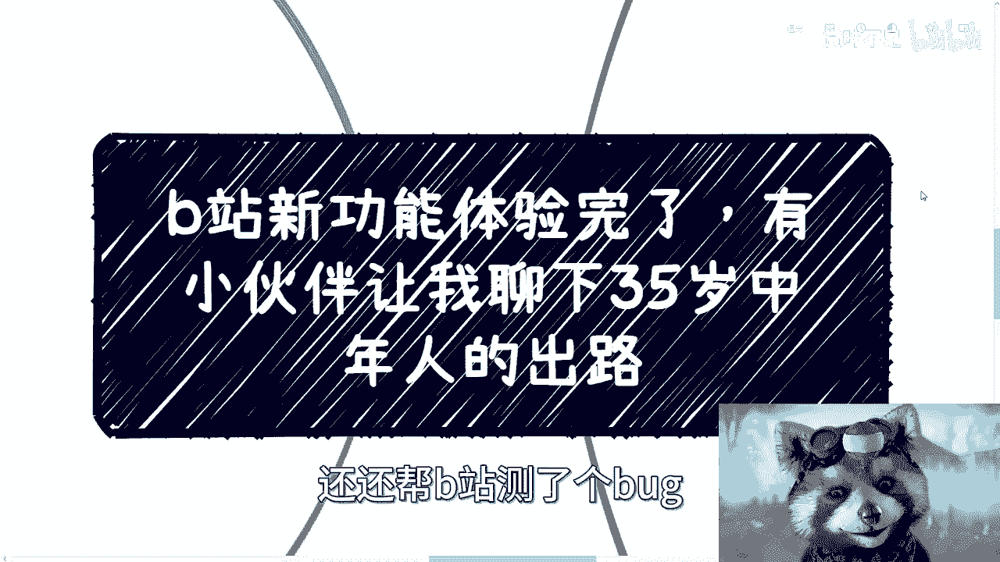
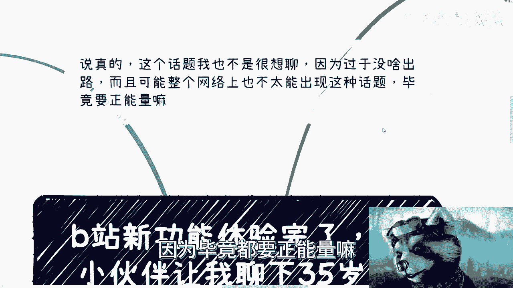
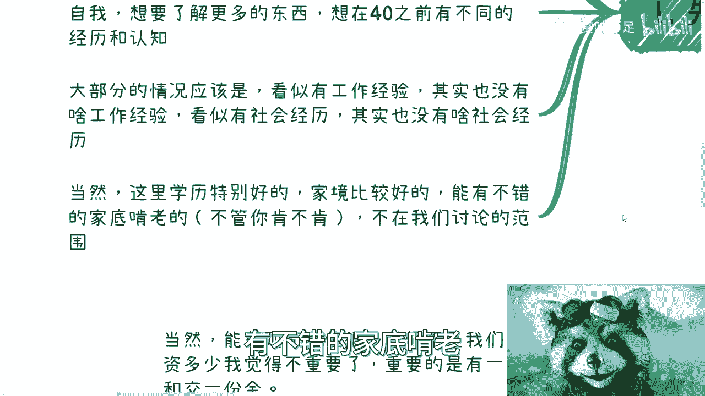
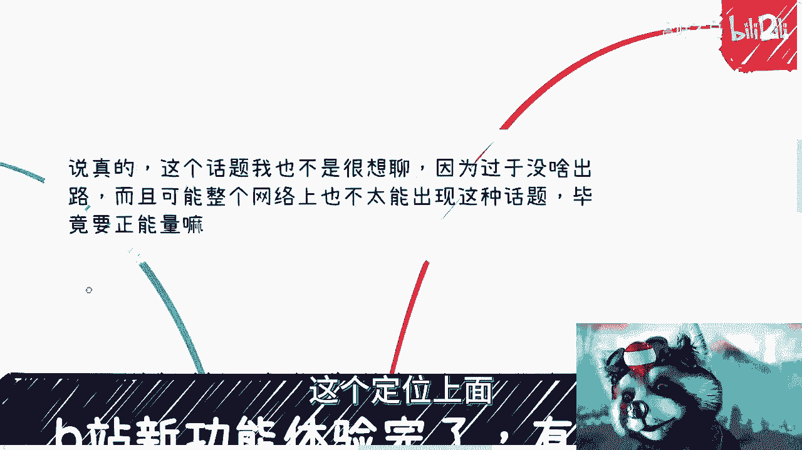
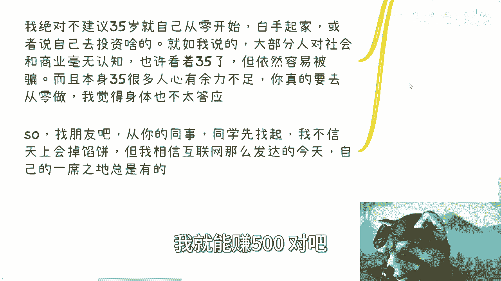
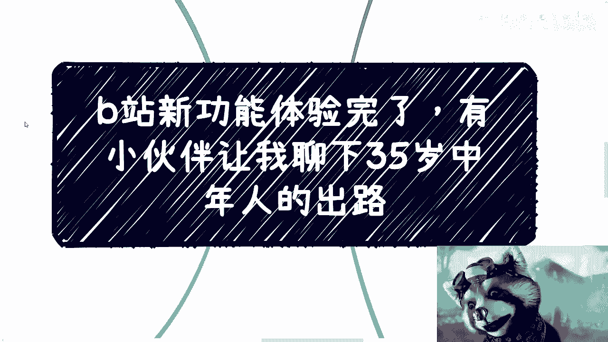

# 课程：35岁中年人的压力与出路分析 - P1 🧭

在本节课中，我们将要学习35岁中年人普遍面临的压力来源、核心困境以及可能的应对方向。我们将客观分析现状，并提供一些务实的思考路径。

---

## 概述：35岁的普遍现状

当前35岁人群大致可分为几类情况。

以下是主要的三种类型：

1.  **生理年龄35岁，心理年龄约25岁**：这部分人对人和事的判断能力较弱，情感上不成熟，同时缺乏个人规划。
2.  **拥有“大厂”或辉煌工作经历，但发展受限**：他们曾有过不错的职业经验，但35岁后想在公司内“苟着”已变得困难。这种现象并非互联网行业独有，未来可能蔓延至更多领域，除非是某些“越老越吃香”的特殊行业（但这类岗位同样遵循金字塔结构，机会有限）。
3.  **职业发展顺利，但寻求突破**：这部分人对自我有要求，希望在40岁前获得不同的经历和认知，突破职业倦怠。

然而，大部分35岁人士的实际情况是：看似拥有工作经验和社会经验，但这些经验的实用价值有限。许多人已处于“身不由己”的状态。本课程讨论的对象不包括学历极佳、家境优渥或有丰厚家底可依赖的人群。

---

## 第一节：压力与突发情况

上一节我们介绍了35岁的几种普遍状态，本节中我们来看看他们具体面临的压力与突发情况。与其说是“问题”，不如说是必须面对的“压力”和“突发状况”。

压力主要来源于两个方面：

*   **社会与物理层面的压力**：这部分压力如同一个人站在不断崩塌的悬崖边，被迫持续前行。核心压力源包括：
    *   **贷款**（如房贷、车贷）
    *   **父母赡养**
    *   **孩子教育**
    *   （尚未计入结婚、彩礼、购房等初始成本）
    其本质是对**金钱**的持续硬性需求。
*   **个人内心层面的压力**：每个人都是独一无二的，都会在内心思考“自己未来该如何发展”。由于认知和格局不同，思考的深度和复杂度各异，但本质上是每个人都会面对的自我拷问。

除了持续的压力，**突发情况**也是重大挑战。例如：

*   个人或家人的**疾病**（慢性病、急症）
*   日常的**意外**（如交通事故）

这些事件虽不一定是毁灭性打击，但会让人**身心俱疲**，并牵连整个家庭。在35岁这个上有老下有小的阶段，任何意外都需要投入大量精力处理。

此外，一个关键的内在障碍是**固化的思想和三观**。35岁还能保持“空杯心态”、客观评价自身与环境的人很少。**固执和执念**会堵死出路，这并非外界环境所致，而是自身原因。

---

## 第二节：可能的出路探讨

在理解了压力来源后，本节我们来探讨一些可能的出路。首先必须客观承认：对大部分人而言，出路确实不多。现在的境况由过去的历史决定，如果历史上缺乏折腾与突破，35岁后很难有巨变。后起之秀有，但属极少数。

以下是几种可以尝试的方向：

*   **尝试自媒体**：对35岁人群而言，这是相对没有门槛的选项。可将其视为“没有办法的办法”，一种值得尝试的试点。`方向 = 低门槛内容创作 + 持续输出`
*   **借助家族资源，结合互联网**：查看家族内是否有传统业务（无论多细微），并利用互联网工具将其放大，哪怕只能增加少许流量和收入。`策略 = 传统业务 × 互联网流量`
*   **寻找多份兼职**：特别是互联网相关的非实体兼职（如在线教育助教、外语相关等）。可以多尝试几份，积少成多。`收入 ≈ 兼职1 + 兼职2 + ...`
*   **经营人际关系**：35岁应学会将金钱用于“疏通关系”。主动联系、请教身边（同学、同事中）有一定积累的人。该请客吃饭就请客，放下脸面，深入交流。核心是让自己变得**可信、踏实**，避免轻浮和小动作。

核心要点是：**找到痛点，放下形式与面子**。这个阶段，“稳定”和“赚钱”是王道，而非好高骛远。

---

## 第三节：关于工作的建议

上一节我们讨论了几种出路，本节我们聚焦于本职工作。对于现有工作，建议是：**能苟则苟**。薪资多少并非首要，**稳定的收入和社保缴纳**更为重要。

在工作之外的时间如何利用，则完全取决于个人选择：

*   若觉得“35岁看到老”，可求稳定。
*   若想“再抢救一下”或继续“卷”，可以去拼搏。
*   若厌倦打工想自己做点事，**关键是从“站在他人肩膀上”开始**，而非从零白手起家。寻找身边有积累、有资源的同学或同事合作。`成功概率 ∝ 可利用的现有资源`
*   **绝对不建议**在毫无认知的情况下自己从零开始投资或创业，极易受骗且身心俱疲。

在当今互联网时代，只要愿意寻找，总有方法能增加一些收入（哪怕每月多几百元），并找到性价比更高的模式。**人是活的，事情是死的**，总有变通的方法和可做的业务，关键在于主动去发现和尝试。

---

## 总结与核心提醒

本节课中我们一起学习了35岁中年人面临的多重压力、内心困境以及几种务实的应对思路。

最后需要牢记：**35岁之后，不再有“照搬课本”的应试教育路径**。无论是跑滴滴、送外卖还是做其他事情，其中都有很深的门道和变数。**这才是真实的人类社会**。

希望每个人都能找到自己的一席之地，建立起能够抗风险的能力。如果有具体的副业、商业疑问或不知如何规划，建议系统整理后寻求专业咨询。

---
> **免责声明**：本教程内容基于特定语境下的个人观点分析，旨在提供思路参考。人生路径复杂多样，请结合自身情况独立判断。