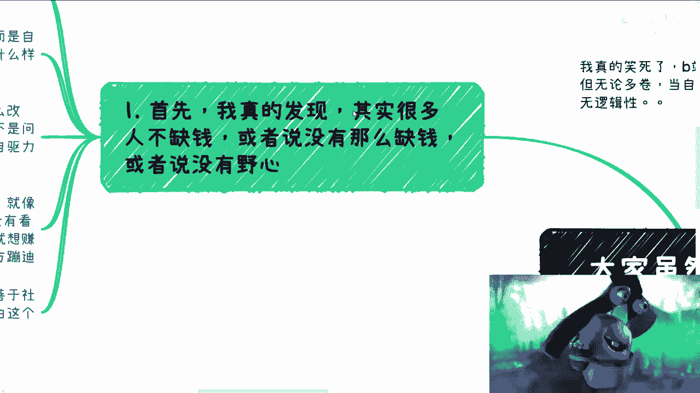
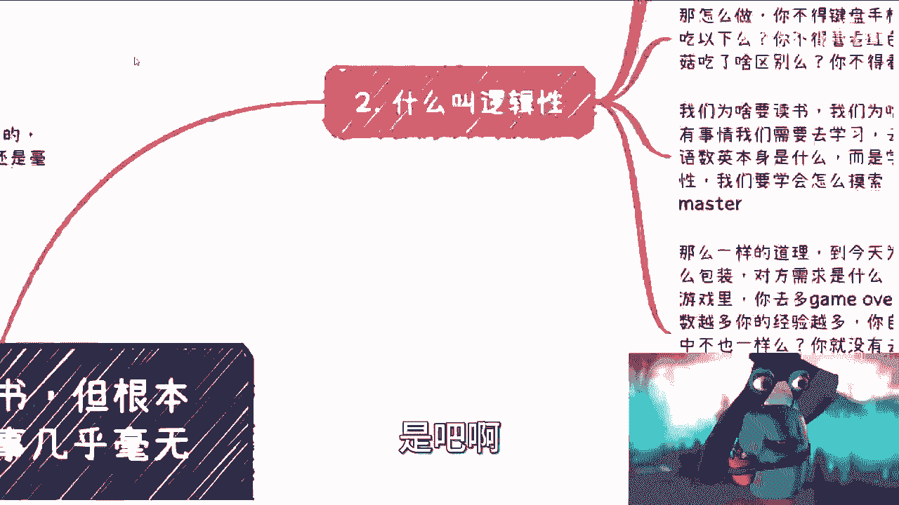
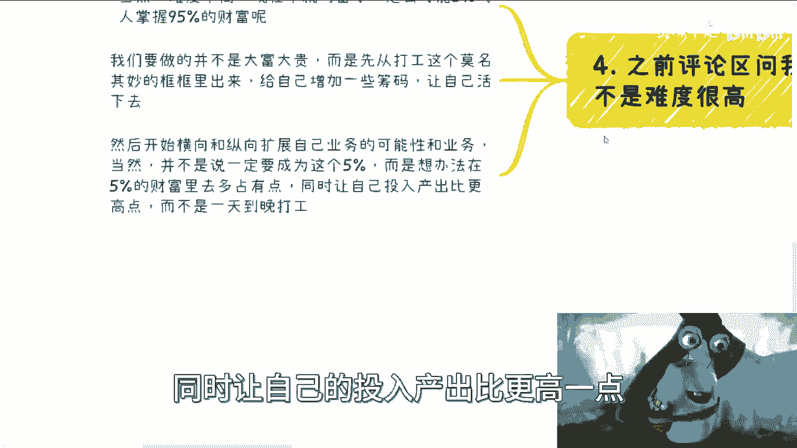

# 5%的人掌握95%的财富绝对是有道理的 - P1 - 赏味不足 - BV1yF411271h

好大家好，我真的这个火气很大，火气很大，妈的又要变成蛤蟆区博主了，操就是我跟你讲。

真的呃，很笑死，就B站每天会给我推很多什么说职场的，然后说的一套一套的什么PUA上属啊，啊PUA上领导啊，PUA下属啊对吧，然后说什么什么流程怎么做啊，干嘛干嘛，就是就我大概也听了一点。

就是我觉得真的就是我咨询下来这么多人对吧，但无论多么卷啊，我觉得就不管他们在企业里面多么优秀，也不管多么卷啊，就当他们自己做事情的时候，大部分人就毫无逻辑性，你知道吗，就是听上去好像卧槽好牛逼啊对吧。

这个这个领导怎么PUA，下属怎么PUA对吧，然后这个企业里面，怎么让自己这个风生水起是吧，唉这他妈真的，我说句不好听的，他妈在我看来都是，在座的都是，你知道吗，就这哎我今天这个主题叫什么。

我说虽然我觉得很多人读了很多书，但他不知道怎么学习，你知道吗。

然后做事情毫无逻辑性，就他妈让我匪夷所思啊，首先我跟你说，我真的发现有一个最大的问题，就是其实中国老百姓不缺钱，我已经明白了，就是很多人他不缺钱，或者他没有这么缺钱。

或者来说他就是没有野心，你知道吧，就咨询过我的人啊，你我跟你说，其实十个里面有一两个我肯定说过这句话的，什么东西啊，就是说一般来讲啊，你说大家都说他说谁不缺钱，谁他妈都缺钱，哪他妈不缺钱是不是好。

但我跟你讲啊，缺钱这个事情很多时候并不是说他真的缺钱，而是说我们得要有自己的追求，对你说哎我可能二三十岁我想活成什么样子，四五十岁我想活成什么样子，我等我老了，我想怎么样对吧，你要有自己的追求啊。

你自己想要什么，想过怎样的生活，或者说你要有足够的野心啊对吧，这个是最大的问题，你每个人都有自己的问题，都有惰性对吧，包括就是有很多人说哎呀刘老师啊，我这个这个沟通不行，社交不行对吧，怎么改变。

卧槽这个东西怎么改变，你说怎么改变对吧，那你嘴长，你身上，你腿长，你身上手长你身上，那你说怎么改变，我还能强迫你是吧，你看心理医生，我跟你讲，也许啊是有用的，但是真正要去改变的。

但这些可能看似不是问题的，很重要的问题，他一定是靠你自己，一定是要有自驱力的，但这个自驱力不是莫名其妙来的，你知道吗，就是说这个自驱力一定是，就是说每个人他的这个内核啊。

就自驱你的这个这个这个这个原因可能不一样，但你要目标清楚啊对吧，比如说有些小伙伴他说我已经很苦啊，我以后不想再过苦日子了对吧，然后我就要改变，那没问题啊，这就是很强自驱力呀对吧，你比如说我对吧。

我他妈天生bug对吧，我就想呃那个去做过做我没做过事情，见我没见过人对吧，看过很多没有看过的合作，我要我就要去看这个这个真正的这个社会本质，长什么样子对吧，比如一些小伙伴，他说我就想搞钱，我不想我不想。

我不想知道那些有的没的虚的，我不关心我他妈就想搞钱，别的我不关心，我就要在各种搞钱的这个红线上蹦迪啊，没问题啊，我觉得都没问题啊，对吧哦你说这些人难道天生善于包装，善善于分享，善于去做沟通。

善于做社交吗，肯定不是啊对吧，每个人天生都有技能点，他他妈的每个人这些人天生技能点都点满的，我不相信他对吧，那很多人呢他只不过就是说目标性比较明确，然后呢由这个目标去自取，去改变了很多问题罢了对吧。

你有很多人面临的问题，他是自己的问题，然后你来问我怎么改变，你怎么改变呢，没法改变怎么改变啊，我跟你讲来，我来帮你做一套心理按摩对吧，改变一下，你先付我个5万块钱，卧槽这他妈有用了。

你们用你们的9年制义务教育，在家高等教育的脑子想想看有用的啦。

哎呀我他妈服了，我真的是是啊，然后呢我来给你们讲什么叫逻辑性。

比如说对吧，比如说我今天打超级玛丽啊，尼玛你上来就问我，罗老师这玩意儿怎么玩对吧，左边一个人，右边有几个砖块啊，这砖块还他妈在天上啊，为什么他妈的这砖块里面还能找蘑菇，这他妈蘑菇能吃吗对吧。

好一顿操作猛如虎，那我就问你啊，我就问你，你觉得这些问题如果我来问你啊，我问你，你觉得这些问题是他妈的是人，能问出这个问题的人是几岁对吧，是一个经过9年制义务教育甚至高等教育的人，问出来的问题吗，对吧。

大部分人肯定会说，不可能啊，我们不可能问出这种问题，卧槽这种问题不可能上来就干对，这个逻辑对啊，那怎么做呢，你不得键盘手柄操作一下吗，你不得蘑菇都吃一下吗，你不得看看红色蘑菇，绿色蘑菇。

紫色蘑菇有什么区别吗，对你不得看看你红色蘑菇变大之后，碰到一个怪你，你你怎么怎么样吗对吧，你不得看看花星星吃了有什么用吗对吧，就是包括就是说我们为什么要读书，我们为什么一开始就就就就为什么不。

一开始就去读大学，还要读9年制义务教育，为什么，因为所有事情我们需要去，我们学习的是一个逻辑思维，我们学习的是个过程，我们要学习的是怎么去摸索，而不是学习他们的语数英对吧，语数外，然后应试教育本身。

应试教育本身有什么好学的呢，对吧，你到了商业上，你到了社会上，所有答案都是略有什么好学的呢对吧，你要学会的就是这个探索的过程对吧，你要明白，或者说你要去学习怎么从小白到master对吧。

那么一样的道理啊，你打游戏会那么到今天为止，你看啊，还是有很多人，他说我不知道怎么包装，我不知道对方需要什么，我不知道怎么认识人，你想想看，按照游戏里面你怎么做，你不就是多死几次吗对吧。

你打任何游戏超级玛丽算简单的了，你打一个复杂一点的呢，比如说解谜类的对吧，策略策略类塔防类的，你不多死几次，你怎么知道这游戏怎么设计的，那同理啊，你问我，你说啊，我不知道怎么包装，那屁话，你多去聊啊。

你多去碰壁啊对吧，现实中一样的呀，你你没有，你几乎没有认识几个人，你也没吃过几次闭门羹，你开局在那边想哎呀，这条路可能走不通，唉，这条路我也不知道怎么做对吧，我就要放弃了对吧，然后你就就到处问这个东西。

我我怎么做啊对吧，然后自己自己也不去尝试，那我跟你讲算了，你什么路都走不通对吧，我跟你讲，你读书已经读傻了，就这句话，然后三是什么呢，就是说你们要明白你们所有的人都在拼图，只不过这次拼图不是应试教育哦。

也就是说无论你做什么，同时你目标明确，接下来就是不停的去碰壁，这就是你要做的对吧，举个例子，比如说今天你的目标就跟产业园达成合作对吧，那么接下来你要包装好，你装了一个1。0版本不行，对不对，好开始尝试。

经过五六次沟通，再产生2。0版本，再经过五六次沟通，产生3。0版本，直到迭代到你某天成功了，那这不就是你的经验吗，哦那如果说你说哎呀不行，吕老师这个东西太慢了，那怎么不上来就读大学呢，读9年制义务教育。

啊啊你咋这么吊呢，哎呀我真的是真的服气了，真的是，你想想看啊，你自己城市走过来，然后去别的城市走，然后是然后是不同的产业园对吧，然后找不同的人，今天采购部的人不行，好商务不行，好战略投资部不行。

好一个个找，没事一个去找呗，game game over若干次之后，你脑子里就会有一张地图了对吧，产业园的上下上下结构啊，大概有什么人啊，每个人负责什么，他没有什么东西啊，你基本上你就知道了呀。

你否则怎么知道呢，哦你指望说今天有个人跳出来来，我来把这个架构给你讲一遍啊，吃饱了撑的，谁呀，对啊，卢老师，他们赶我走怎么办，是吧，每次都这么说，那我就告诉你，首先2023年了，马上2024年了。

你是法治社会，又不是过去杀人放火的，赶紧走干嘛呢对吧，你先想好怎么去说对吧，你要自己干嘛的，什么公司的，你要做好预约，多吹吹牛逼，让对方感觉到你跟产业园就算没有交集，你一样可以带它飞不就好了吗。

有什么关系呢，吹呀，你怕啥，我就问你怕啥，我真名其妙的大学生跟我说，老师我怕是是是是马上30岁的人了，不知道怕是不知道怕什么东西，我跟你讲，有些有有很多小伙伴也要说了，我不会，我不知道啊。

我也不知道怎么执行，我跟你讲，每次说到这个问题，你回到一，我就觉得你不缺钱，而且我觉得你没有野心，或者说我觉得你对你的人生没有规划就结束了，我们不要既要又要你，要么就好好有规划，有野心，你说我也想赚钱。

要么就好好躺平吧，别去搞这些，有的没的对吧好，那么包括之前评论区还有小伙伴问我，他说卢老师啊，做商业是不是很难啊，对吧好，我来跟你说啊，当然商业本来就你要去赚钱难度就很高，难度不高，早他妈均富了。

会到现在吗，会到今天，5%的人掌握95%的财富吗，会吗，不会的呀，是不啦，哦你说网络上能不能找得到信息，我找得到，大家也均富了呀，我跟你说，真的很多人会来问我的，他说罗老师有没有什么网站。

哎呦我的有什么网站，你觉得有人敢做这个网站吗，做出来他妈的早就疯了，对吧啊，你要记住我们要做的，它并不是说你一定要大富大贵，而是说你先从打工这个莫名其妙的楚门的世界，和这个做电池的框框里面先出来。

你要给自己先增加一些筹码，就相当于你现在就是个小人，你一既没吃蘑菇也没吃花，你什么都没有对吧，那你也得先让自己活下去啊，而且这个活下去，就是说不是从打工这条路上活下去，在打工以外的框框里面先活下去。

然后开始横向和纵向扩展自己的业务，你知道吧啊，那么当然你并不是说一定要成为这，5%的人，而是说你要想办法去95%的人里面，掌握5%的财富嘛，对不对，那么你要想办法，在这5%的财富里面去多占有一点。

同时让自己的投入产出比更高一点吧。

至少比打工高吧，那不就好了吗，我觉得这已经他妈的成功了对吧，就你知道吗，就是在我看来，就在我看来，我所得到的人肉大数据，这些信息里面就是真的就是95%的人，你说他有没有能力，我不知道。

但是他自己会把自己先PUA在0~1这一步，就是我不行，我不知道，我也不知道该怎么做，我就是不做，做了一两次失败了，哎我不行，永远就这么死循环，那他们的确啊，怪不得就是的确。

为什么他们的人能掌握百分之百分之九，15的人才能掌握5%的财富，就是这个样子呀，对吧，然后然后自己也想不通，你知道吧，想不通，然后我去跟他讲，比如说我现在做这个免费视频，他还来跟我说，哎呀吕老师。

你做的什么狗屁玩意儿，他妈的，你要说解决方案的好，头，就去报个56万的课，这没有用的呀，其实我能给你们什么方案呢，你想想看我给什么方案，我给任何方案，你们到最后都回我一句，哎我做不了，我执行力不行。

哎我就不知道怎么包装，那怎么地呢，那按照你这个说法好，所有的包装我都帮你写好啊，你这个人首先身份证我帮你伪装好啊，所有的这个背景什么东西我都帮你伪装好，那我请问你付我多少钱，另外一点，你付了多少钱。

我为什么要做这些事情，卧槽他妈的，你，你单纯这件事情本身就不符合社会，这个世界发展规则，他就不符合商业的发展规则，怎么怎么有人会去做这种事情呢，但凡我会去做，就意味着什么，意味着他妈的我要来割你们了。

因为只有我想跟你们这个商业逻辑，才闭环的对吧，我当然不想跟你们哦，我说来我来帮你们包装包，你们怎么样，没有用的，因为从我的商业逻辑来讲，我帮你们做了，你们还是闭不了环的呀，你们还是要靠自己去碰壁的呀。

真的我跟你讲，真的很多时候还是那句话，就是好心当成驴肝肺对吧，你越为他着想，他不领情的，你越过他他妈，谢谢啦，就这么着吧，这么着吧，嗯好了，国庆最后一天了好吧，大家反正有什么嗯，明天上班啊。

反正大家想想吧好吧，有什么东西啊，这个职业规划的想赚钱的目标明确的对吧，不想我跟反正跟你们说，接下来很长时间了，反正老百姓都是蛮难的啊，都蛮难的，蛮苦的，反正你们想想吧，就是想怎么做的啊对吧。

想想想了解更多东西的，反正整理好整理好问题list好吧，你们可以再找我做咨询。

