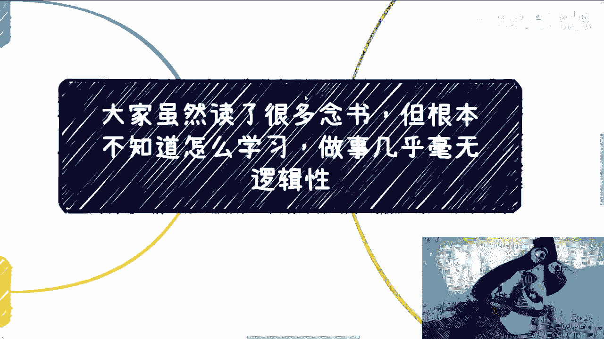
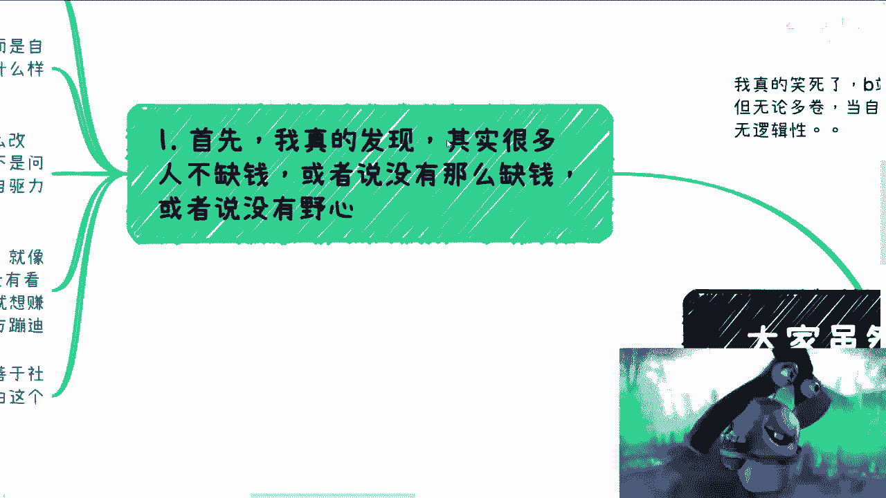
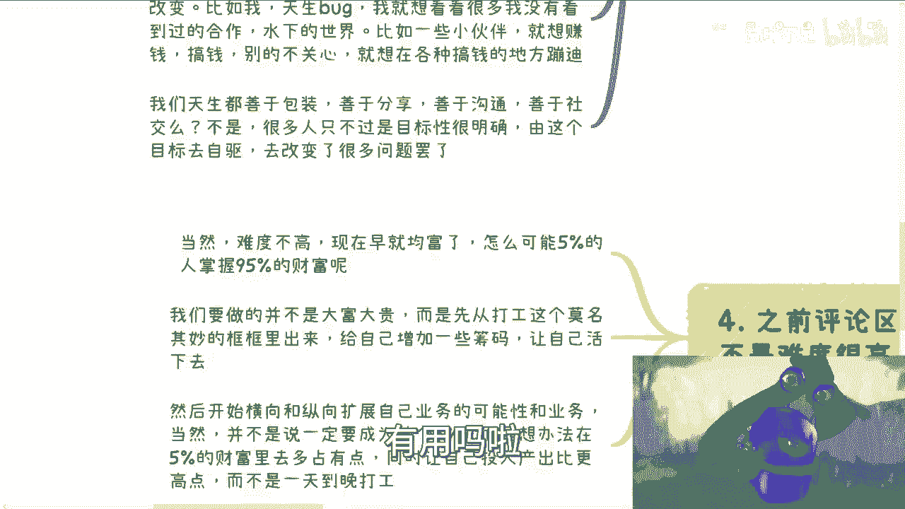
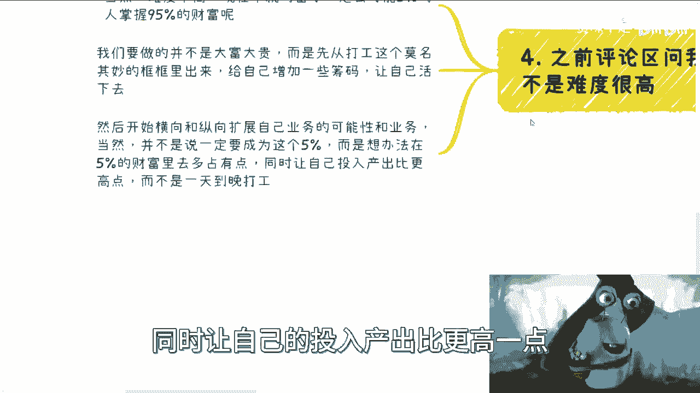

# 5-的人掌握95-的财富绝对是有道理的---P1---赏味不足---BV1yF411271h_not


在本节课中，我们将探讨一个核心问题：为什么很多人看似懂得很多道理，但在实际做事时却缺乏逻辑和行动力？我们将通过分析常见思维误区，学习如何建立目标驱动的行动逻辑，从而在个人发展或商业实践中取得进展。

---

## 概述：问题的根源



我观察到许多人，无论他们在职场中多么“优秀”或“内卷”，当需要自己独立做事时，往往缺乏逻辑性。他们可能听过很多关于职场技巧、向上管理的方法，但一旦脱离固定环境，就变得不知所措。



这引出了一个根本性问题：很多人读了很多书，但并不知道如何真正地学习和应用知识。

---

## 第一节：缺乏动力的核心——目标与野心 🎯

上一节我们提到了“知道”与“做到”的脱节，本节中我们来看看导致这种脱节的第一个核心原因：缺乏清晰的目标和内在驱动力。

许多人并非真的“缺钱”，或者说，经济压力并不是他们行动的唯一或主要障碍。更深层的问题在于缺乏个人追求和野心。你需要明确自己想过怎样的生活，在二三十岁、四五十岁以及更远的未来希望达到什么状态。

**自驱力公式**：
`自驱力 = 清晰的目标 + 强烈的渴望（野心）`

自驱力并非凭空产生。它源于你的“内核”——那个驱动你改变的根本原因。这个原因因人而异：

*   **逃离痛苦**：例如，“我不想再继续过苦日子了”。
*   **满足好奇**：例如，“我想探索未知，见识社会的本质”。
*   **追求财富**：例如，“我只想搞钱，在规则边缘探索机会”。

以下是驱动力的不同来源示例：
*   对现状不满，渴望改变生活。
*   对世界充满好奇，渴望探索未知。
*   目标明确，一心追求财富增长。




关键在于，无论起点如何，都需要将这种内在感受转化为明确、具体的目标。没有目标，就谈不上真正的驱动力。

---

## 第二节：建立逻辑思维——像打游戏一样学习 🎮

我们明白了目标的重要性，但如何朝着目标前进呢？许多人卡在了“不知道怎么做”这一步。本节我们将学习一种建立逻辑思维的方法：像探索一款新游戏一样去探索现实任务。

想象一下你第一次玩《超级玛丽》。你不会一开始就问“这个砖块为什么在天上？”“蘑菇能吃吗？”。你会先操作角色，尝试跳跃、吃蘑菇、躲避敌人，通过一次次“死亡”来理解游戏规则。

这个过程就是**逻辑探索**。我们接受九年义务教育乃至高等教育，核心目的并非仅仅记忆语数外的知识，而是**学习“如何学习”的逻辑思维过程**，掌握从“小白”到“大师”的探索方法。

**学习过程类比**：
```
现实任务探索 ≈ 游戏通关
1. 尝试行动 -> 游戏操作
2. 遭遇失败 -> 角色死亡
3. 分析反馈 -> 总结规律
4. 调整策略 -> 重新开始
5. 最终成功 -> 通关关卡
```

将这个逻辑应用到现实问题中：
*   **问题**：“我不知道如何包装自己。”
*   **错误做法**：空想，然后放弃，到处问人。
*   **正确逻辑**：开始与人交流，准备一个1.0版本的介绍，即使不完美。在多次沟通和碰壁后，收集反馈，迭代出2.0、3.0版本，直到成功。

指望有人把现成的、完美的“地图”和“攻略”交给你，是不现实的。真正的经验和认知地图，必须通过你自己的实践——也就是“碰壁”——来绘制。

---

## 第三节：行动框架——在拼图中迭代前进 🧩

掌握了探索的逻辑后，我们需要一个可执行的行动框架。无论你的目标是什么，其实现路径都像完成一幅拼图，核心方法是：**目标明确，持续试错，快速迭代**。

假设你的目标是“与某个产业园达成合作”。

以下是实现这个目标的具体步骤：
1.  **设定初始方案**：准备好你的合作方案（1.0版本）。
2.  **主动尝试沟通**：联系产业园的不同部门（如采购部、商务部、战略投资部）。
3.  **收集反馈并迭代**：每次沟通后，无论成功与否，都总结经验，优化方案，升级到2.0、3.0版本。
4.  **扩大测试范围**：如果在一个城市或一个产业园行不通，就换一个继续尝试。
5.  **形成认知地图**：通过多次“Game Over”，你自然会理清产业园的组织架构、关键决策人及其需求。

关于常见的恐惧：“对方赶我走怎么办？”在法治社会，这很少发生。你需要做的是：
*   提前想好说辞。
*   做好预约。
*   自信地展示你的价值，即使目前没有交集，也要让对方相信合作能带来双赢。

如果总是在“想”而不是“做”，并且用“我不会”、“我不知道怎么执行”作为借口，那么请回到第一节：你可能缺乏真正的野心和对人生的规划。

---

## 第四节：重新定义成功——增加你的生存筹码 💰

我们讨论了目标、逻辑和行动。最后，让我们重新审视“成功”的定义，这能帮助我们设定更合理、更可达成的期望。

商业赚钱本身是件高难度的事。如果很容易，社会早已实现均富，不会出现“5%的人掌握95%的财富”这种现象。网络上也不存在一个能让你一键致富的“神奇网站”。

对于大多数人而言，真正的成功第一步是：**从单纯的“打工者”思维中跳出来**。



**成功路径重新定义**：
```
初始状态：一个没有任何能力加成的“小马里奥”。
第一步（成功）：在打工之外的领域找到生存方式，获得“蘑菇”（基础能力）。
第二步（进阶）：横向或纵向扩展业务，获得“花朵”（进阶能力）。
最终目标：未必成为那5%的顶尖人士，但要在95%的人群中，占据更多那5%的财富份额，同时让投入产出比远高于打工。
```

这个过程的本质，是为自己增加**生存和发展的筹码**。很多人并非没有能力，而是将自己“PUA”在了从0到1的启动阶段，陷入“我不行 -> 我不做 -> 我失败 -> 我更不行”的死循环。打破这个循环，是走向不同的关键。

---

## 总结与建议 📝

本节课我们一起学习了从“知道”到“做到”需要跨越的思维鸿沟。

1.  **找到内核驱动力**：明确你的个人目标与野心，这是所有行动的起点。
2.  **建立探索式逻辑**：像学习打游戏一样，通过实践、试错、总结来认知新领域，而不是等待完美攻略。
3.  **执行迭代式行动**：设定目标后，以“拼图”心态，通过不断尝试和优化方案来推进。
4.  **设定合理成功标准**：优先在打工之外建立立身之本，为自己积累筹码，追求高于打工的投入产出比。

最后，请记住：别人提供的任何“方案”，都无法替代你自己的“碰壁”和“执行”。如果你总是停留在“想”和“问”的阶段，而无法迈出“做”的第一步，那么任何建议都是无效的。

在充满挑战的环境中，整理好你的问题清单，明确你的目标，然后开始行动吧。真正的改变，始于你决定为自己负责并迈出第一步的那一刻。


---