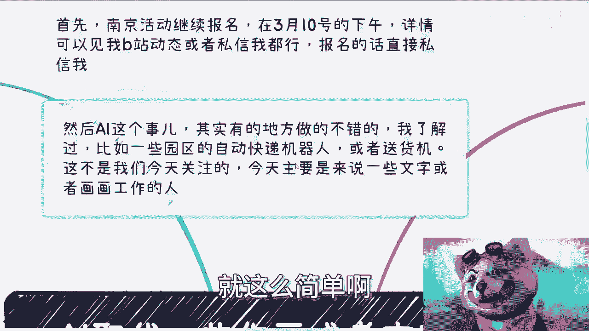
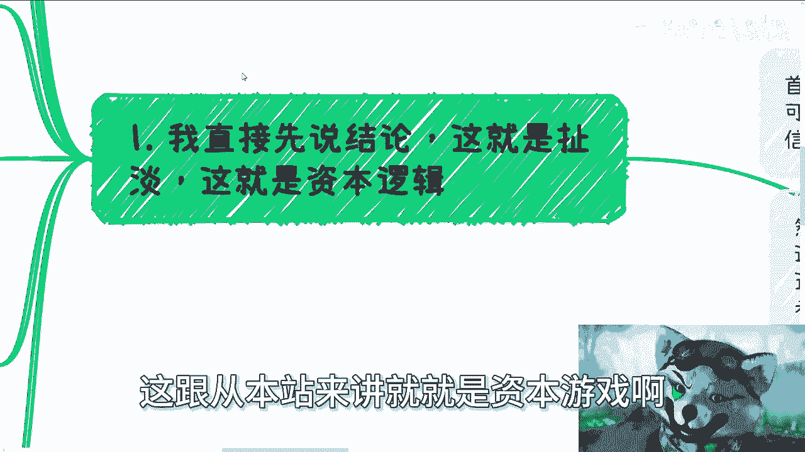
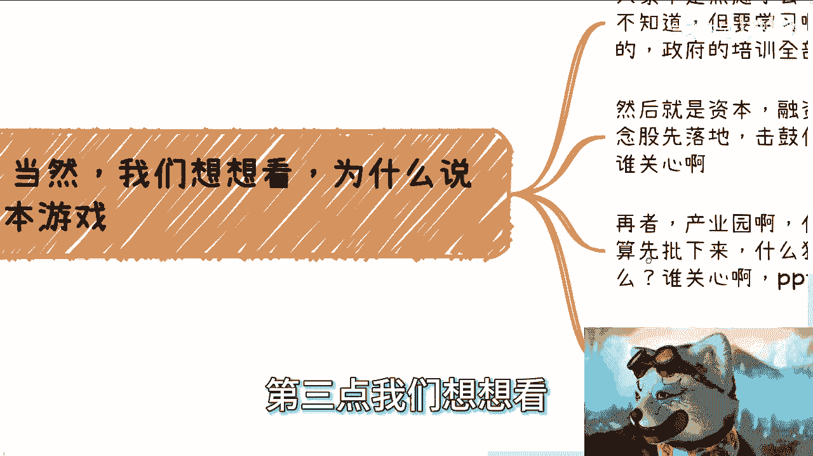
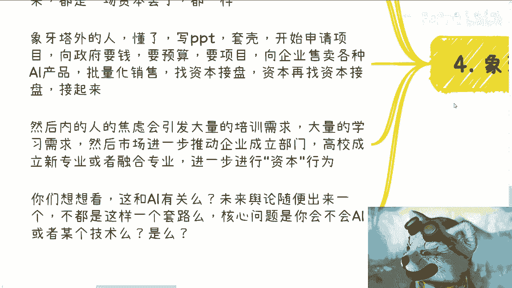

# AI取代绘画和文字工作等，本质就是pua和扯淡 - P1 - 赏味不足 - BV1u2421u7wC

好大家好，看到这个主题对吧，AI取代一些作画或者文字工作者等等啊。

我给你们讲本质就是PUA跟啊，就这么简单啊。

我首先我跟你们讲，今天是认真一课，今天是生气一课，你知道吧，就他妈我觉得真的是不能忍了啊，就这个PO已经他妈的到了一定阶段了啊，我觉得我觉得不说不行啊，再再不说，这就这么离谱了，真的是啊。

首先是这样子啊，南京活动继续报名好吧，3月10号下午啊，然后详情可以见我B站动态，或者私信我都行好吧，报名的话直接私信我啊，然后我跟你讲啊，AI这个事其实有的地方做的是不错的啊，我了解过的啊。

我再怎么样，我再怎么讲，我他妈也写了78年代码了啊，你们不要来跟我讲技术啊，我我写代码时间比你们大部分人都要长啊，我最后趁他出来的时候，我他妈也算也算是个架构的啊。

比如一些园区的自动快递机器人或者送货机，我跟你们讲啊，这不是我们今天要关注的。

我们今天主要讲的是一些文字或者说会话啊，这一些相关的啊，我首先先说结论，我跟你们讲，这他妈就是啊，这跟从本质来讲。

这就是资本游戏啊，这他妈就是PUA啊，首先啊AI能提供效率啊，我是相信的，AI能辅助做事情，我也是相信的啊，但是你跟我说，现阶段或者在未来可预计的一定时间内，替代人工，我给你，我今天早上在什么小红书啊。

别的地方，我他妈看到一大群人，包括一般群里面都在散播焦虑，说什么哎呀绘画没有出路了，哎呀文字工作者没有出路了，我跟你说啊，有没有一种可能性啊，有没有一种可能性，原本其实就没有出路。

而这个没有出路跟AI没有关系，什么意思，你比如说啊，你们现在很多人做绘画，做原画的，绘画的或者文字工作者或者怎么样，你们把AI换成一些比你们现在成本更低的人类，你觉得你们有出路吗，一样失业呀。

只不过为什么AI更能让你们失业，是因为AI能够产生浪潮，AI能产生舆论，AI能产生噱头，你们来了一些成本更低的人类，没有任何噱头，那我就问，如果这样说的话，他妈的问题出在AI身上吗，不出在AI身上啊。

首先你看啊，AI并不在啊，问题并不在AI身上，今天你换个别的行业，别的领域创新，只要增加效率，只要增加成本，你们看好了，网络上一定会出现类似于AI的这种言论，好了，那么我就问本质问题在哪里。

本质问题在于整个世界就是个草台班子，本质问题在于你们的甲方和你们的领导，以及你们的老板，根本他妈的就是，就这么简单，你不要不要来跟我争，就是对吧，就是我指的是在专业程度上面，他们就是啊。

你告诉我有几个老板，几个甲方，几个你们的领导真的懂的，懂个屁啊，他他妈只懂PPT，所以说我跟你们讲啊，或者就如我告诉你们的，大多数地方就是说大家关心的是什么，是自己的KPI，关心的是我怎么交付。

关心的是自己的屁股啊，关心的是交付的东西，到底这个故事怎么讲，你懂吗，至于这个交付的东西是人做的是鬼，做的是AI做的，谁成本低，我用谁，我管你是谁啊，你是谁重要吗，啊，当然啊，文字也好，绘画也罢。

我跟你讲懂的人，行业内的人都是有自尊的，比如说像我们以前写代码的，我们也认为我们写出来的东西是有价值的，但是领导不认为啊，而领导不是不认为我们有价值，是他们领导压根就他妈不懂啊，你秀才遇到兵。

你和资本家有什么好说的，有什么好说的，你跟甲方说个屁啊，有什么好说的，所以你想想问题出在哪，问题出在我们大部分的人，象牙塔内的大部分人，既然改变不了这些，我们为什么不没有多条线去赚钱。

我们也为什么不知道怎么利用这些社会规则，这些社会舆论去赚钱，而不是说，我们一旦我们变成了舆论焦虑的本身哦，然后我们一被舆论所影响之后，我们就在那边想哎，我们要不要学AI，或者说我们要不要学一些别的东西。

这辈子能有多长，学什么东西呢，或者说你想想看，AI就算不出现，就算未来出现个别的东西，你随便被这样舆论，被这样资本家一套，不还是你现在这个逻辑吗，你永远这辈子都活在焦虑当中，有意义吧。

你觉得问题是在这个地方吗，我跟你们讲，真的说句搞笑的话，就是你与其不如去买点AI的概念股，说不定还能赚点钱对吧，哎我操，怎么很多人还真的会去信，你知道吗，就觉得卧槽，我他妈要去学啊。

我不学我要失业了对吧，我好像什么怎么样怎么样，这他妈是本质吗，啊对吧，这是第一点，第二点核心矛盾，上层跟基层人看问题的角度，你看啊你看啊，我觉得一直在公司里面，人可能是真的永远不会明白。

为什么我一直强调PPT是审计，因为我告诉你们，只要在中国这个社会上，无论走到哪，PPT能解决一切问题，哎我真的我可以我可以就非常锻炼的跟你们讲，你解决一切问题，一切问题，剩下他妈都是都是对吧，为什么。

因为基层的人都觉得自己技术很牛逼，自己比别人牛逼，自己比别的同行的人，或者比自己的事是师姐师哥多牛逼，自己做的东西多么的匠心，我不是说这个不好啊，我很鼓励大家这么做，但是我告诉你们，不好意思。

非常抱歉啊，事实来讲，从上层去看，我们关心的是什么，就是交付的，一是交付的东西是怎么什么东西，二是交付的故事怎么说，第三就是成本到底怎么样对吧，以及我们说哦对，就就就反过来了，第一是成本。

然后就说这个故事和所谓的这个需求，满满不满足没了，你跟我来讲谈细节，谁来跟你谈细节，不好意思，我不懂啊，我是，你知道吗，我是啊，我们举个例子，比如说今天我们需要做一个花艺，或者交付一个软件。

或者交付一套设计吧，啊好我们我们来讲，你可以觉得你插花插的很好，你可以觉得很有意境，你可以把价格开的很高，然后呢搜不还是甲方爸爸是爸爸吗，不还是你的领导是爸爸吗，不还是你的老板是爸爸吗，说你再好。

有有有有有卵用啊，他不懂呀，你跟你你对牛弹琴有什么用呢，你想想看是不是你再多的意境，比不上价格低，比不上一套能够展现出来，满足甲方的需求的一套怀疑，有用了有用了，甲方能理解你吗。

甲方他妈能理解你要你干嘛，哎呀妈奇了怪了啊，甲方要有这个能理解你要你干嘛啊，比如一个软件，你用什么架构，用什么框架，用什么代码写，你觉得他妈的鬼关系啊啊你看到过哪个甲方，你哪个哪个金主爸爸来关心哎。

你用C加加写，用java写的诺子瓦特洛是吧，哎交付的时候谁会关心我，还是那句话，甲方的领导，甚至领导会懂他懂个屁啊，懂了吗，要你干嘛啊，他们懂什么，他们只懂故事怎么讲，他们只懂成本。

他们只懂你展现出来的页面好不好看，诶，懂个屁，设计是一个逻辑，你跟我说你的设计理念，你的你的那个designer，你作为一个designer，你你你你自己比如说有什么想法，结合了什么东西，你觉得懂不啦。

核心矛盾在这个地方啦，什么AI不AI啊，根本他妈不是核心逻辑，说AI的就是纯不懂啊，说AI来替代人工的，就是纯不懂，或者就他妈纯PUAAI，只是因为当下这个热点，只是因为这么一个噱头。

能够帮助很多人能够圈的就说的好听点，能赚到很多钱，说的不好听点就能骗到很多钱，仅此而已，有什么区别呢，啊所以我们说的这些核心，怎么让甲方领导或者领导满意，怎么很好的交付，靠的是产品设计吗。

靠的是产品细节吗，靠的是框架，靠的是李宁吗，不是不好意思，靠的是PPT懂吗，懂了没有啊，啊第三点，我们想想看。

为什么说是资本游戏，大家不是很焦虑吗，AI来了怎么办，AI我就问AI能干嘛能干嘛能干嘛，能商业化吗，SL或者其他这些东西能商业化吗，他能做个demo，他能做个噱头，能怎么商业化，你上个我看看，对不了。

你稍微不也是他妈偏偏不懂的人吗，上怎么杀啊对吧，然后不知道要干嘛，要学习学习怎么办，第一就是培训C端，企业端，政府端，B端，C端培训全部组起来是吧，然后就是资本资本融资融资走起来，不管能不能落地。

什么能不能落地落地，他妈关我事啊，我只关心概念股能不能落地，我只关心我的我的一级市场，二级市场能不能落地，那么这产品能不能落地，关我事，对不，击鼓传花，走起来呀，古钱敲起来呀，什么事业不事业，谁管谁啊。

那么搞笑呢，真的在是吧，再者产业园什么创新基地，创新项目申请起来，预算批下来，什么狗屁狗屁框架，什么狗屁技术用什么，谁他妈关心啊啊，你告诉我PPT里看的这个技术，看的出什么技术啊，看得出你讲故事的技术。

我还是那句话，我不是表达AI不重要，我也不是表达你们不重要，我也不是表达大家作为基层员工不重要，我只是告诉你们，真正所谓的落地跟虚假的落地，到底是什么区别啊，真正的焦虑和虚假的焦虑到底是什么区别啊。

然后第四个就是象牙塔内外的区别，夏天很累的人被弄得非常焦虑，我要学习了，要跟进了，要进化了，要他妈革命了啊，要要要迭代了，未来怎么办，我要学习，我要我要怎么样，我要一技之长，对吧啊，好然后我跟你讲。

里面的人就会觉得学会跟不学会才是核心矛盾，是吗是吗，你学会了又怎么样呢，啊你你今天会用这个东西，你这个东西真的是做了一个产品，创业出来又怎么样呢，又如何呢，啊你我告诉你，本质上是一场资本游戏。

今天可以是AI，明天可以是大数据，后天可以是云计算都可以，它不重要，你知道吗，核心矛盾不在这个地方，象牙塔内外的人，我跟你讲懂了怎么懂了，懂了就写PPT套壳，然后申请项目，向政府要钱，要预算要呃。

要要项目，要产业园，向企业售卖各种AI产品，批量化销售，找资本接盘，资本再找资本接盘，他妈股先打起来，对不对，这叫落地啊，哥哥们姐姐们，亚瑟们对吧，然后加拿塔内的人呢，引焦虑会引发什么大量的培训需求。

大量的学习需求，然后市场进一步舆论进一步推动呃，企业成立部门，高校成立新的专业或者融合专业，进一步的进行资本行为好，那有人就要问了，他说那既然你说是这么一个虚的东西，或者是一个资本运作。

为什么高校要去做，为什么企业去推动你，搞笑吗，你不是在哦，企业不是资本运作吗，高校难道不是资本运作吗，怎么滴啊，人家用爱发电吗，还是真的为你们着想啊，我早就说过了，你要是真的觉得有哪个地方是为你着想的。

你就太把你自己当个人了，你也太把别人当个人了，懂吗。

社会不是这么运作的啊，你们想想看整个的逻辑，这跟AI有他妈的屁关系啊，本来就是舆论随便出来一个东西，你今天出来这个，明天出来那个不都是一个套路吗，核心问题是你会不会吗啊是你失不失业吗。

是你是会不会被这种东西替代吗，根本就不是啊对吧，核心问题就两个，一就是说你做的东西你认为有价值，但不好意思，别人不懂，我告诉你走到哪，别人都不懂，你只要往上走肯定不懂，而上面懂的东西你不懂，就这么简单。

你懂吗，你懂啥，你会讲故事吗，你会写PPT吗，你会个屁对吧，你连你连领导要什么你都不知道，你会啥对吧，所以导致失业的是什么，是这些所谓的技术吗，我告诉你们，技术从来就不是问题啊。

你们记住行业里面讲的最多一句话是什么，技术从来就不是问题，好吧哎呀我跟你讲啊，我话已经讲到这个地步了，能能再听不明白，我也是没办法，真没办法了啊，先这么着吧好吧，大家反正能明白多少算多少吧。

不要但是不要再被PUA了，我觉得没啥必要好吧，然后那个嗯本周日报名活动的，反正你们继续来啊，继续私信我嗯，然后职业上商业上对吧，或者说其他想了解一些行业当中，更多的一些信息，或者说你们自己做些东西。

在合同上，股权上搞不清楚的对吧，没有什么自己也没有什么什么风险意识的好吧。

