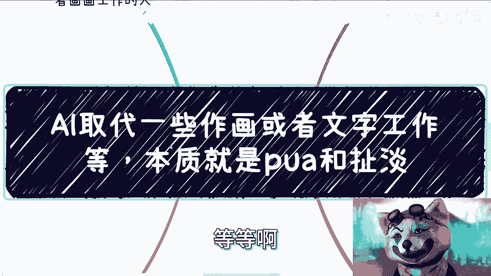
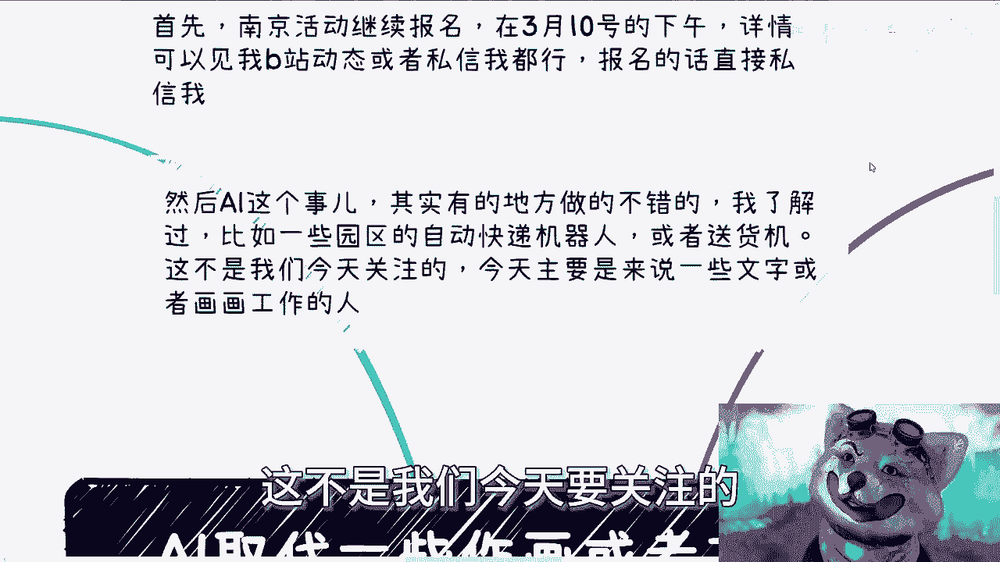
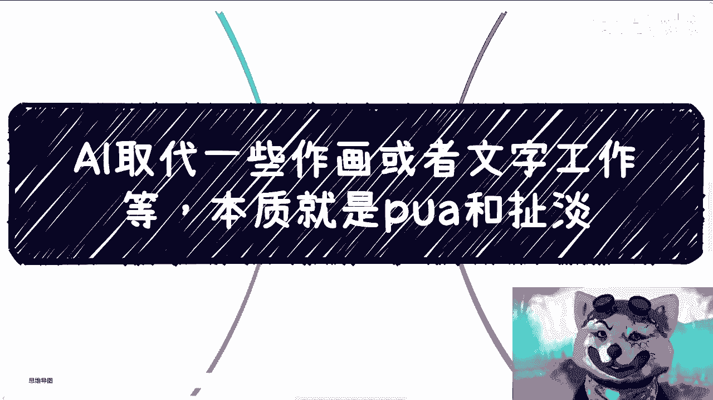

# 课程：AI取代绘画与文字工作的本质剖析 - P1 🧠

在本节课中，我们将深入探讨当前关于“AI将取代绘画、文字等工作”这一热门话题的本质。我们将分析其背后的核心逻辑，并揭示这为何更多是一种资本运作和舆论焦虑，而非纯粹的技术革命。课程旨在帮助初学者拨开迷雾，理解行业运作的真实规则。

---

## 概述：核心矛盾不在技术 🔍

上一节我们提到了AI引发的广泛讨论。本节中，我们来看看问题的核心。AI能提升效率、辅助工作，这一点是可信的。但宣称其在可预见的未来将“取代”人工，则涉及更深层的逻辑。

真正的核心矛盾并非技术本身，而在于**价值认知的错位**与**资本的游戏规则**。许多从业者（如画师、文案）的专业价值，其评判权往往不在同行手中，而在不懂专业的甲方、老板或领导手中。他们的决策依据通常是**成本**、**交付故事**和**表面需求**，而非技术细节或艺术价值。

因此，当出现像AI这样的“低成本替代方案”时，它之所以能引发失业焦虑，并非因为它绝对强大，而是因为它完美契合了上述决策逻辑，并借助舆论形成了巨大声浪。

---

## 第一点：失业焦虑的本质是价值错位，而非AI 📉

以下是关于失业焦虑本质的几个关键分析：

1.  **“没有出路”与AI无关**：许多绘画或文字工作者感到的“没有出路”，在AI出现前就已存在。如果将AI替换为“成本更低的人类”，结果同样会是失业。AI只是提供了一个更具噱头和舆论效应的低成本选项。
2.  **问题根源在于“草台班子”**：许多项目的决策者（甲方、老板、领导）在其专业领域内可能并不精通。他们的关注点在于**KPI**、**如何交付**、**如何讲述项目故事**以及**控制成本**。至于交付物是人、是AI还是其他工具所创造，只要成本更低、故事能讲通，他们并不关心。
3.  **专业自尊与市场现实的冲突**：从业者普遍对自己的作品怀有专业自尊，认为其拥有独特价值。然而，这种价值常常无法被不具备专业知识的决策者所理解和认可。这就像“秀才遇到兵”，沟通基础并不存在。

所以，与其焦虑是否会被AI取代，不如思考：如何适应这种“价值评判体系”，或者如何利用规则（包括舆论热点）为自己创造机会，而不是成为被焦虑裹挟的对象。

---

## 第二点：上层与基层的视角差异 📊

上一节我们分析了价值错位的问题。本节中，我们来看看这种错位在日常工作中的具体体现。

在商业环境中，上层（管理、甲方）与基层（执行、创作者）看待问题的角度截然不同：

*   **基层视角**：注重技术、细节、匠心与专业深度。认为自己的技术、框架或设计理念是核心价值。
*   **上层视角**：关注三个核心要素，其优先级往往是：
    1.  **成本**：`决策优先级 = 低成本`
    2.  **交付故事**：能否在汇报（如PPT）中呈现一个令人满意的叙事。
    3.  **表面需求满足**：最终呈现的页面或效果是否符合其直观预期。

例如，一个软件项目，甲方不会关心你是用 `C++` 还是 `Java` 编写；一个设计项目，甲方也很难深入理解你的 `Design System` 或设计哲学。他们只关心：价格是否够低？演示时看起来是否够好？汇报的故事是否动听？

因此，**让甲方或领导满意的关键，往往不是极致的专业细节，而是出色的沟通与包装能力**，其核心工具通常就是 **PPT**。

---

## 第三点：AI热潮是一场资本游戏 💸

理解了视角差异，我们再来审视当前的AI热潮。为什么它会引发如此广泛的焦虑并被大肆宣扬？

因为这本质上是一场**资本驱动**的游戏，而非单纯的技术演进。其运作逻辑包含以下几个层面：

1.  **制造概念与噱头**：AI（如AIGC）能做出吸引眼球的Demo，形成强大的营销和舆论噱头。
2.  **构建商业模式**：
    *   **To C（面向消费者）**：推出各种AI工具会员、开设培训课程，收割学习焦虑。
    *   **To B/G（面向企业/政府）**：售卖AI解决方案、申请“科技创新”项目、建立产业园，获取政府预算和企业采购订单。
3.  **资本市场的运作**：推动AI概念公司融资、上市，炒作概念股。资本关心的是**金融模型**能否跑通、能否找到下一轮接盘者，至于产品是否真正解决深层问题、能否大规模商业化落地，并非首要关切。这是一个典型的 `击鼓传花` 游戏。
4.  **系统内的共振**：焦虑情绪催生大量培训和学习需求，进而推动企业设立AI部门、高校开设相关专业，进一步巩固和扩大了整个生态，为资本运作提供了更多“素材”和“故事”。

所以，当你感到焦虑时，需要分辨这是对**技能落伍的真实担忧**，还是被卷入了一场**人为制造的虚假焦虑**之中。

---

## 第四点：象牙塔内外的认知鸿沟 🏛️

上一节我们揭示了AI热潮的资本本质。本节中，我们来看看不同人群在此浪潮中的不同角色与心态。

“象牙塔内”的从业者与“象牙塔外”的规则制定者/玩家，存在根本的认知与行为鸿沟：

*   **象牙塔内（多数从业者）**：
    *   **心态**：被焦虑驱动，认为“学不会AI就会被淘汰”。
    *   **行动**：拼命学习新工具、新技术，追求“一技之长”。
    *   **盲点**：未能看清，即使学会了新技术，依然可能面临同样的困境——你的价值评判权依然不在自己手中。

*   **象牙塔外（玩家与规则利用者）**：
    *   **心态**：将AI视为一个可资利用的“概念”或“工具”。
    *   **行动**：`核心操作 = 用AI概念包装(PowerPoint) -> 申请项目/预算 -> 推向市场/资本 -> 实现变现`。他们深谙如何利用热点来讲故事、要资源、完成资本循环。
    *   **逻辑**：今天可以是AI，明天可以是元宇宙，后天可以是任何新概念。技术载体本身不重要，重要的是**套用这套资本与舆论的运作模式**。

高校和企业推动AI，同样离不开资本与资源的逻辑。它们并非单纯“为你好”，而是在整个社会资源分配体系中的必然行为。

---

## 总结与核心要点 🎯

本节课中，我们一起学习了如何剖析“AI取代论”背后的多层逻辑：

1.  **核心矛盾**：并非技术替代，而是**专业价值**与**市场（甲方/领导）认知**之间的错位。决策者更关心成本、故事和表面交付，而非技术细节。
2.  **视角差异**：基层重“匠心”与细节，上层重“成本”与叙事。有效沟通（如通过PPT）往往比技术精深更重要。
3.  **本质是资本游戏**：当前AI热潮很大程度上是资本寻求噱头、制造概念、完成融资与变现的循环。它制造了广泛的焦虑，并以此衍生出培训、项目、投资等产业链。
4.  **认知鸿沟**：“象牙塔内”的从业者在焦虑中学习技能，而“象牙塔外”的玩家则在利用规则套利。关键在于认清游戏规则，避免被虚假焦虑所PUA。

**记住一句行业老话：技术从来就不是最核心的问题。** 真正的挑战在于理解你所处的系统如何运作，以及如何在其中定位并创造属于自己的价值。希望本课能帮助你更清醒地面对技术变革与职业发展。