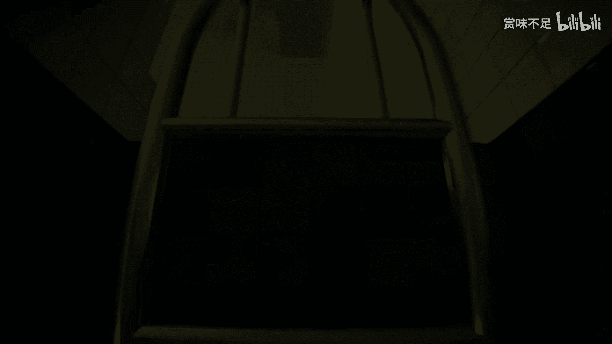

# POOLS正式版第二章-让我这具尸体逐渐温暖---P1---赏味不足---BV17M4m1f7og_

在本教程中，我们将学习《POOLS》游戏第二章的探索流程与核心解谜思路。本章地图结构复杂，分支众多，我们将梳理关键路径、识别环境线索并理解游戏机制。

---

## 初始区域与路径选择 🚪

上一节我们介绍了章节的开始。本节中，我们来看看初始区域的探索。

游戏开始时，玩家处于一个黑暗的走廊。前方有一扇门可以进入。

进入后，环境中有水，但水质看起来干净。并非所有门都能互动，部分门后没有内容。唯一可行的路径是正前方的通道。

通道内非常黑暗。玩家可以发现一个向上的路径和一个向下的路径。游戏地图分支非常多。

以下是初始探索的关键点：
*   唯一可行的入口是正前方的门。
*   通道内黑暗，需留意上下路径。
*   游戏具有**多分支地图**结构。

---

## 符号区域与循环结构 🔺⭕

离开初始黑暗通道后，我们进入一个带有符号的区域。

玩家会遇到标有 **三角** 和 **圆** 的光源入口。这代表不同的路径选择。

选择进入三角符号的入口。内部是一个类似“跳楼机”的结构，墙上有无法理解的印记（如红叶酸印在瓷砖上）。继续探索会到达一个布满黄色组织的区域，但无法进入。绕行后，会通过一扇门回到起点附近，形成一个小循环。

这意味着三角入口的路径是一个闭环。此时应返回并选择圆形符号的入口。

以下是符号区域的核心机制：
*   **三角** 与 **圆** 代表不同路径。
*   **三角路径** 是一个**循环结构**，最终返回原点。
*   解谜关键在于尝试另一条（圆形）路径。

---

## 复杂迷宫与视觉线索 🧩

选择圆形路径后，我们进入一个结构复杂的迷宫。

迷宫中有多个发光点（如四个亮光、六个亮光）和大量门。环境极易让人迷失方向。通过对比发光点的数量，可以识别是否到达过相同位置，例如“四个亮光”处有一把椅子，是未探索过的新区域。

在探索中，玩家会获得一个手电筒，用于照亮黑暗区域。迷宫部分路段异常难行。

以下是迷宫探索的要点：
*   利用**发光点数量**（如四个亮光、六个亮光）作为地标，区分不同区域。
*   **手电筒**是探索黑暗区域的必备工具。
*   部分路径是死路，需要回溯。

---

## 特殊场景解谜：秋千与反射 🎢

在迷宫深处，我们会遇到一个特殊场景。

场景中有粗大的彩色组织（如红色和绿色）。中心是一个秋千。交互后，玩家可以荡起秋千。

秋千荡到高处时，墙壁上会出现一处**反光**。这提示该位置是可互动的或可通行的。利用该反射点，可以开启新的路径或触发场景变化（如灯光亮起），从而推进进程。

此环节的核心解谜逻辑如下：
*   **秋千**是一个关键互动点。
*   墙壁上的**反光**是一种视觉提示，标志着隐藏路径或机关。
*   互动公式可简化为：**使用秋千 -> 到达高点 -> 观察反光 -> 互动反光点**。

---

## 最终通道与出口推断 🏁

解开秋千谜题后，我们进入最终通道。

通道从黑暗的出口开始，墙上设有标靶和黄色标记。环境中的水越来越深，墙上出现喇叭。沿着唯一路径前进，会经过一个长长的楼梯，顶部是一个滑道。

滑下后，玩家会产生强烈的“被排泄”的感官体验。随后视角变化，面前只剩下最后一条路。保持冷静并继续前进，即可完成该章节的探索。

最终阶段的要点总结如下：
*   通道水位**逐渐加深**，是环境叙事的一部分。
*   **长楼梯与滑道**是通往出口的关键过渡。
*   章节结尾的**单一线性路径**引导玩家走向结局。

---

## 总结 📝

本节课中我们一起学习了《POOLS》第二章的完整探索流程。

我们首先在初始区域做出正确的路径选择，然后理解了**三角与圆形符号**代表的路径差异，其中三角路径是循环。在复杂迷宫中，我们学会了利用**发光地标**和**手电筒**进行导航。通过解开**秋千反射**谜题，我们找到了推进的关键。最后，我们沿着水位加深的通道，通过滑道抵达了章节的终点。

核心技巧在于：**观察环境符号、识别循环结构、利用光源作为地标，并注意特殊的视觉反射提示**。