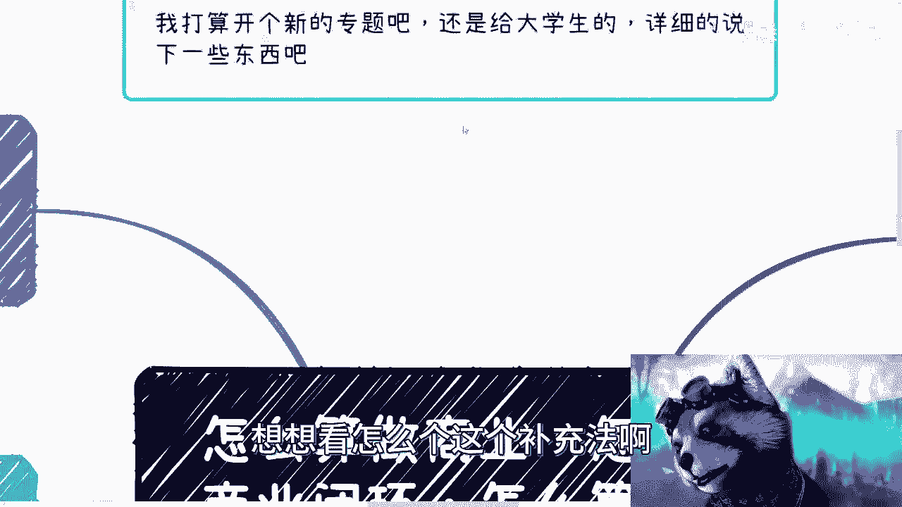
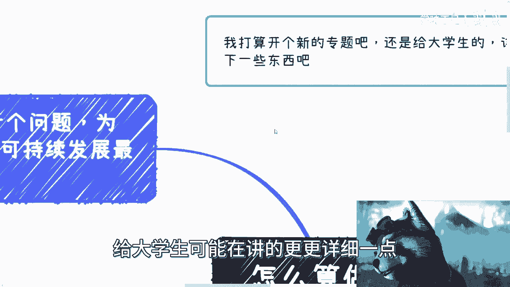
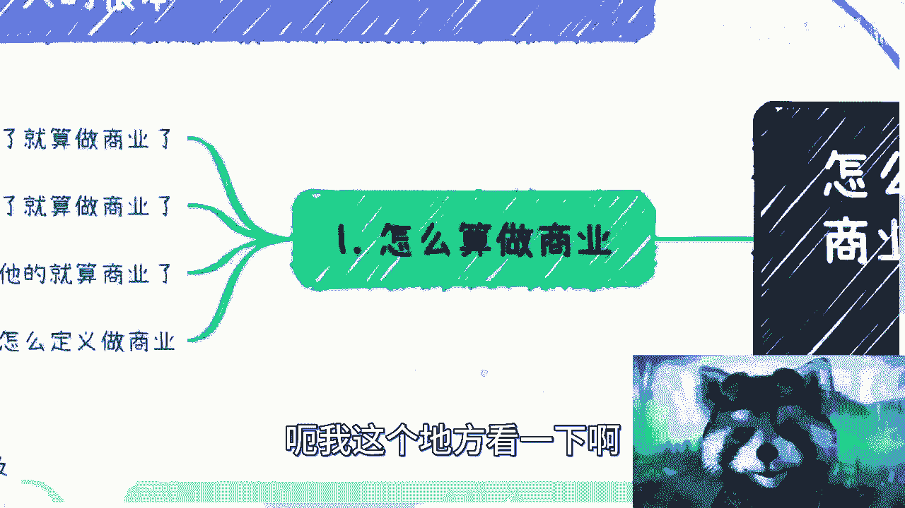
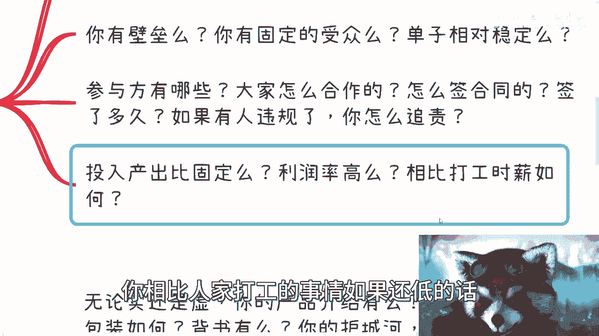
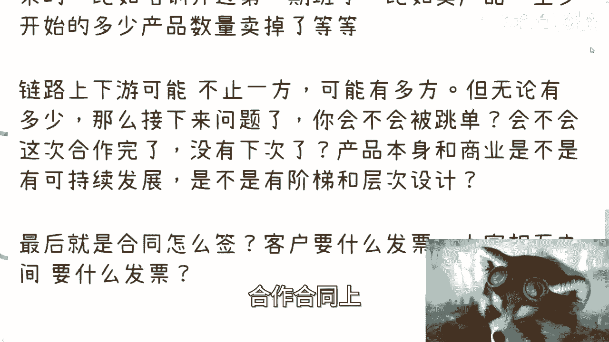
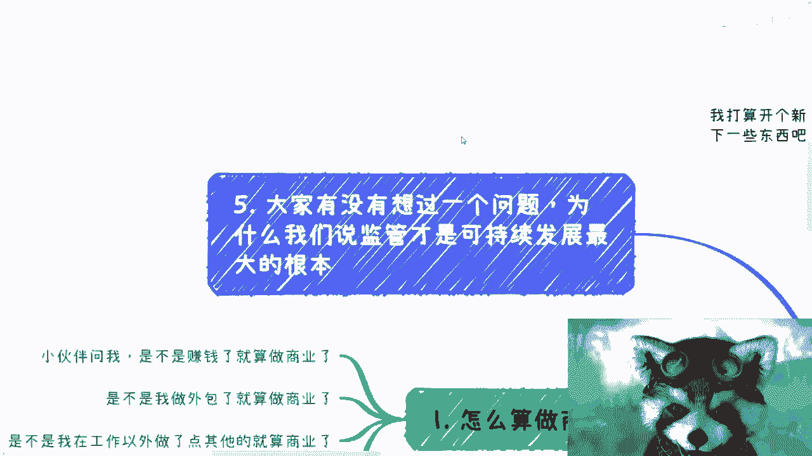
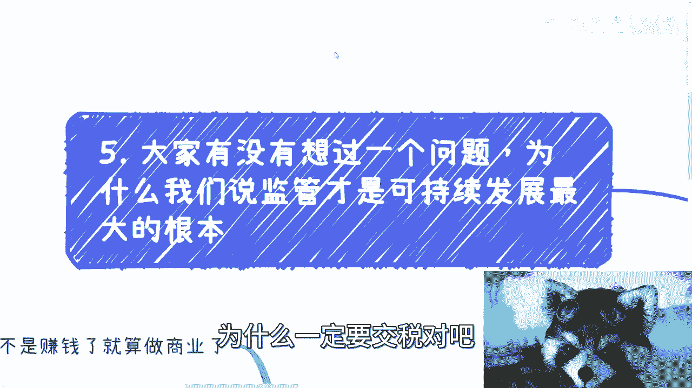
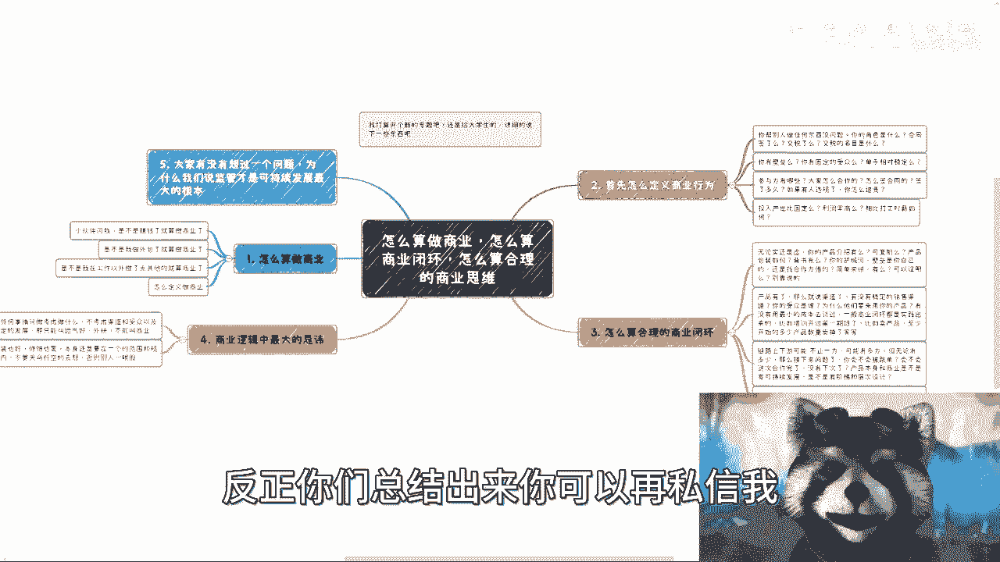

# to大学生，怎么算商业闭环和合理的商业逻辑 - P1 - 赏味不足 - BV17x4y1R7Go

嗯好啊，大家好，我打算这个给广大的大学生啊，专门出个专题，我打算重新开一个这个专题呢，这里面到底放哪些东西，我还没想好，但是基本上呢就是说我会可能大家比如说大二，大三对吧，然后毕业前后吧这段时间吧。

然后来切入呃，主要还是可能跟商业跟这个商业啊。

跟这个商业逻辑啊，商业闭环会有关系，但是我想我会想想看怎么个这个补充法啊。

给大学生可能在讲的更详细一点。

嗯首先是这样子的，今天呢有小伙伴这么稳啊，他说我怎么算是做商业对吧，怎么算啊，怎么算做商业，怎么算商业闭环，怎么算合理的商业思维啊，呃我这个地方看一下啊。

我给你们列的已经很细了啊，你们自己可以看怎么算做商业呢，是这样子的啊，小伙伴问我是不是说除了主业以外啊，除了我去打份工以外赚了钱就算做商业了，是不是说我主业以外去做那些外包，做那些服务就算做商业了啊。

是不是说我在工作以外做了点其他的，比如说什么，哪怕我扶了个老奶奶啊，这个这个老奶奶给了我一毛钱，对吧啊，这个很开心，也算做商业了啊，怎么定义做商业啊，我在这个地方列了几点啊，是这样的。

首先我们怎么定义这个行为啊，第一点是你帮别人做任何的东西都无所谓啊，你做什么事情，这件事情并不重要啊，重要的是你的角色是什么啊，合同有没有签啊，税有没有交，交税的名目是什么类目，是什么，发票怎么开。

你知道吧啊但凡啊我们说商业上面，你这个主体可以是你个人，也可以是企业对吧，你但凡主体没有合同，也没有税，也没有交或者交税的类型，你也不知道，那从根源上面你就不能叫商业，你比如说你说我今天要给别人做了个。

AI及C的服务啊，啊我今天给别人打个比方，我今天给别人什么做了一个，做了一个什么什么简单的一个咨询啊，或者或者或者一个什么简历的，这个填写简历的修饰或者怎么样子，这算商业吗，不算我跟你们讲。

这不叫商业啊，这最多叫什么叫外快啊，叫你们能赚钱，但这不叫商业啊，为什么你们往后看哦，我会告诉你们为什么啊，第二是你要自己去看你有没有壁垒对吧，你今天说我用这个啊，叫什么叫拆GBT对吧。

或者用别的东西啊，我给别人做一些服务，你有壁垒吗，你没有，你知道吗，你没有壁垒，你有固定受众吗，我就问这个固定受众，要你要说得出来啊，你就是他是一个什么叫商业闭环啊，就是它是一个明确放在这里的。

你就比如说你就告诉我，你说哎比如说山东省对吧，某个地方，比如说山东省济南啊，某某某什么地区，某某某学校就是我的固定受众，他每一七学生会有多少人报名，那没问题，这个逻辑是通的对吧。

但你不能你不能跟我讲说啊，我就往上小红书发发对吧，抖音发发对吧，B站发法，有人就那个啊，没有人就算了，这不叫固定受众，所以你当你没有固定受众的时候，你没有固定的这个用户画像的时候。

你是不能称之为商业行为的哦，就是这么说吧，你可以在你的角色确定合同，确定交税确定情况下面，你可以称之为这是个商业行为，但是如果你整个没有固定受众对吧，你的单子相对也不，你你单子也不固定的话。

你只能称之为这是个商业行为，但是你不能称之为这是一个合理的，或者说叫做闭环的商业行为，你知道吗，这就好像今天什么呢，这就好像今天他这个行为有点像什么，就这个行为就有点像说啊，怎么说呢，就是。

就是你今天啊做这件事情，你你你告诉我这事情能做对，能做好能做，但是你做这件事情并不代表你能赚钱，对吧好，那么你单纯这么去想的话，就是大部分人你去想想，大部分人他说我要去做自媒体了，我要去做任何东西了。

就是你们现在问我的任何一个东西啊，你甭问我，他说吕老师啊，我做了什么什么东西，你觉得未来这个前景怎么样，我根本就不在乎你做什么，我只在乎你的受众，你清不清楚你有没有去做过调研，你有没有做过尝试。

你觉得这些受众是会付钱的，你的单子是不是稳定，这才是重点，不是说你前面做了什么重不重点对吧，你就好像我跟你们讲，这就好像什么，这就好像我跟你们这么说，我去上海新天地，我今天告诉你们，我去上海新天地。

每天晚上能赚500对吧好，然后呢我就告诉你我的主体是谁对吧，我能交多少税对吧，我大概能赚多少钱，我投入成本是什么，但凡你能稳定，你就是OK的商业逻辑，但是你会发现你知道我做什么了，你不知道。

所以说你根本就我做什么根本就不重要，你知道吗，那反观我就跟你们说，我说哎我要到星星去卖唱了对吧，然后我就问你们爱我，你们觉得我去星星去卖唱怎么样，这问题没有办法解释啊，因为你肯定要问我啊。

就是哎那你去深圳卖唱谁来听呢对吧，那有有没有固定的受众呢对吧，人家会不会付钱呢，这转化率是多少呢，你们要去关心这种东西，这叫商业闭环啊，你知道吗，就你知道吗，所有的人都只关心前面，就只关心上游。

不关心下游，我也不知道为什么，就是当大家只是明明都是想搞钱的情况，下面，反而不关心这个钱到从哪里来，对吧好，那么第三点就是参与方有哪些对吧，就是你整个这个行为当中，参与方有哪些，大家是怎么合作的。

比如说两两怎么合作，三三怎么合作，四四怎么合作，对不对，大家之间怎么签合同的，签了多久的合同，然后如果有人违规了，我们怎么追责对吧，就是所有的东西你要明白这些东西有没有对吧，还有是什么呢。

你得评估你的投入产出比是固是不是固定的，因为有很多的业务啊，对大家来讲是外快，就是你比如说你这次做了，你感觉做的不错对吧，花了打比方花了一个小时赚了2000块钱啊，你蛮开心的，但是你等到下次做的时候。

你就不是两个小时，你可能说哎我得花两天啊，就是赚一两千块钱对吧，如果你的投入转出比都是问号，就是你自己没有一个固定的啊，那个成本计算对吧，那么这个东西也不能称之为商业那个商业行为。

或者说一个合理的商业行为对吧，那你同样的利润高吗对吧，你不要跟我说，卧槽他妈的我做不做，就像很多人跟我说什么，他说吕老师我流水很高的，我流水一年有1000万，是的，你流水是很高调。

到最后我问一下利润利润他妈就20万，这不有病吗，对不对，你利润高不高，因为但凡但凡你利润，如果你相比打工的事情，你去问问看看，你相比人家打工的事情，如果还低的话。

那你还做什么东西了对吧，你就算跟我说，你是个商业闭环，你告诉我你这是一个商业行为又怎么样呢对吧。

你不赚钱，你不叫不赚钱吗，赚很少的钱还不如人家打工呢，你你为什么不去打工呢，对不对，对不对好。

然后第三个怎么算合理的商业闭环啊，是什么呢，就是无论时还是虚啊，你产品介绍有没有，这个产品是不可复制的，你比如说这个产品打个比方，今天是面向大学生的，那我就问，是不是中国各省市区大学生都能用对吧。

是不是今天这个东西只要稍作改动，我可以不是大学生，哪怕社会从业人员也可以用对吧，然后这个社会的一些这个非从业人员，能不能用对吧，然后比如说这个再改的给我改动，直接K12是吧，K9能不能用对吧。

你要去看它有没有可复制性对吧，产品包装如何背书，是谁，你有你的护城河是什么，你别来跟我讲说，哎我今天跟别人给别人修了个自行车对吧，我给我今天给别人做了个服务，那都是有一单没一单的呀，这算什么东西啊。

这叫外快，我还是那句话，你没有你的护城河壁垒是什么对吧，你要想的是未来整个商业单子，但凡有商业的单子，因为你要知道什么叫商业单子，就是他的甲方一定是一个企业，或者是一个政府，或者是一个协会。

或者是一个主体对吧，那我就问问你，你们有没有任何人看到过一个商业单子，去找个体的，去找一个nobody的，没有的呀，对不了，你像现在政府高校企业找我是找我个人没有错，但是找我个人为什么，是。

因为我跟他们长期都是有合作对吧，那对于你们来讲呢，你们对于很多几乎所有的人来讲都是nobody，谁会找你们啊，所以说本质上，你们这个行为没有把自己建立成一个商业行为，啊对吧，而且到时候打个比方啊。

到时候比如说我来找你们对吧，我就问你们，我说那合同怎么签，我和谁钱税交多少，你总不能跟我说，吕老师，我不知道，你定你定你们想想看，你们要是跟甲方这么说，谁他妈找你们合作，对不对对吧。

那壁垒是不是你们自己的，还是说找合作方借的对吧，简单来讲你有没有壁垒，你有没有可以证明的，哎我跟你讲这种东西啊，就千万不能靠嘴说，你知道吧，你别来跟我讲，说哎呀我我这个我我觉得我很有必要。

你觉得没有用啊，你要壁垒是什么，就是你跟我讲啊，你有哪些东西拿得出来的对吧，你比如说是是不是鼎晖发过论文，还是说是你你是某个什么教授，还是说你是什么什么，写那个什么研究院的院长对吧。

还是说你之前已经做过很多东西，拿得拿得出手的对吧，你比如说你比如说我给我给男单NBA，那实打实就讲过课对吧，我给交大安泰，我也是四三是讲过课对吧，包括交代MMMM对吧，这个我上面写的那个叫什么。

就是这个mm的专家，就我实打实有证书的对吧，就是你你有什么东西你要拿出来，你不是单靠嘴说的，靠嘴说没有用的，你知道吗，因为你一旦商业行为，别人都会问你要东西的啊，那么这是第一个，第二个是什么。

就是产品有了，那么就说渠道对不对，你有没有稳定的销售渠道，你要我就问你啊，你有没有稳定销售渠道，你的受众是谁，你如果告诉你的受众是谁，那么我再问你，为什么他们要来用你的产品。

为什么他们要来用你的服务对吧，然后这条路你有没有走通过，对你不要就是你们去思考任何商业逻辑的时候，你们要去这么思考，不要空对空对吧，不要你们觉得这个东西我走得通，就比如说很多人就来问我，他说哎吕老师。

我在高校里面做个外卖对吧，或者我在我我我我，我去给别人做个AI及一些服务行不行，没有什么，你觉得就是你问我前景好不好，我不知道，因为我根本就不知道你，你呢我根本就不知道你有没有稳定的渠道。

你有没有稳定的受众，你有没有护城河和壁垒，会让他们用你的产品而不用别人的产品，你有没有把这个商业逻辑走通过，你100样都不知道，你问我前景，我怎么知道前景，对不对好，那么在这地方我也写了。

比如说你培训开过第七班了对吧，比如你卖一个产品，卖一个服务，至少你一开始已经卖过十个人，20个人了，那我觉得就没问题啊，对不对，没毛病啊对吧，然后链路上下游，你要明白你你的商业的链路。

上下游可能不止一方，什么意思呢，就是说你可能是乙方，你也可能是甲方啊，但是很有可能这里面不仅仅只有甲方跟乙方，你明白吧，就是包括就是说可能还有中介对吧，可能就是这个中介什么意思啊。

就是你们如果是三方合同，我们称之为甲乙丙如果四方合同就甲乙丙丁，那么什么叫中介，中介，就是他可能不出现在合同上，你知道吗，就是他可能是不出现在甲乙方的这个合同，合作合同上。

但是他会单独跟甲方或跟乙方去签合同，这些都叫做商业逻辑，你知道吗，就是链路上下有可能不止一方，他可能会有多方，而这个多方有的是合同的作风，有的是不是合同多方对吧，但是无论有多少，那么接下来问题来了。

你要想你会不会被被跳单，你会不会这次合作完了没有下次了对吧，你产品本身跟商业是不是可持续发展，你有没有阶梯跟层次设计，什么叫DT阶梯，层次层次设计，我以前在之前视频里面讲过一个东西，叫漏斗模型对吧。

叫叫漏斗模型，你们也可以称之为叫沙漏模型，对不对，就是你产品本身，那我给你们举个例子，就像今天你要去办活动，对不对，好，我就问你，你活动短期活动，中期活动长期分别要变成什么样子。

你活动最终是靠什么东西来变现，别人为什么要来你这活动，而最终这些变现的人，他为什么又愿意给你付钱，你先现在告诉我，你知道吗，你想不明白，这就不叫商业逻辑对吧，你就现在要告诉我。

你你你你你要从现在从小做到大，你一定是要有一个阶梯性设计的，你一定要有个不同层次性设计的，你不可能一个产品从头做到尾的，连他妈椰树牌椰汁都他妈的开始升级了，你说你做一个产品没有阶梯性，怎么可能。

对不对啊，最后还是回到这个问题上面，你要是商业行为，那就是合同怎么签，客户要什么发票发票，大家相互之间要什么发票，你这些东西清不清楚对吧，到底几个点对吧，是个税还是还是哪，还是哪个类型的税，对不对。

就这些才叫商业逻辑啊，对吧好，我跟你说啊，商业逻辑当中最大的忌讳是什么，最大的机会就是做任何事情，只考虑做什么，不考虑渠道更受众，以及是否能稳定的发展，我跟你讲这叫什么，这就叫运气好的外快。

这他妈不能叫商业，听得懂啊，我是不是说的已经很清楚了，我如果说成这样，大家再不懂我也没办法了啊，然后第二个是什么，就是包装也好，修饰也好，包括我跟你们讲的，出去就是这忽悠也好，画饼也好，对不对。

你本身一定要在一个范围和规则内，我们举个例子啊，我打个比方啊，比如说你去政府，你跟别人说，为什么，因为是有这个职位的对吧，你总不能跑过去跟他说啊，我是那个这个什么银河系系长，有不啦没有的呀，那我跟你讲。

你们别去笑，你们但凡不了解某一个垂直领域，某一个行业的规则和和一些东西，你们出去画饼，你们画不来的，你知道吗，你画出来别人要笑的，你懂吗啊好那么我回到刚刚那个问题啊，我就跟你们讲。

为什么商业行为一定要去签合同。

为什么商业行为一定要有主体，为什么一定要交税对吧。

我就问你们，你们有没有想过一个问题，为什么我们从头到尾就是可能是20年前，十几年前就开始说这句话，监管才是可持续发展最大的根本，你没有想过为什么，因为你要一件事情可持续发展对吧。

包括你要在这片土地上面做商业行为，我就问嘛，我不管你的韭菜们到底是谁，但是你的行为，商业行为一旦要可持续发展，它一定是要合法合规吧对吧，那么什么叫合法合规，就是你要有主体，你要有合同，你要交税对吧。

你要让大家都达到一定的平衡，你要有一定的组织架构，你要有一定的上下游的关系，你要有一定的关系链对吧，而且另外一点你要明白你是这个可持续发展，什么意思啊，并不单单指的是你们今天做一件事情，可持续发展。

就像我们刚刚说的，你先做一个活动或者做个自媒体，你从小做到大对吧，你说我要可持续发展，对没有错，但是这当中还有一个可持续发展是什么，就是你这个人你要可持续发展，什么意思，就是比如说今天你跟我讲。

你要去做个自媒体，你要做AIGC的服务对吧，你要做什么做什么啊，水产对吧，你要做中介都可以，但是你要明白一点，你做这些事情怎么才能积累啊对吧，就比如说你今天合作的甲方，怎么让他跟你有第二次合作。

你合作的乙方怎么让他跟有第二次合作，你合作的单子怎么证明他是你的，你总不能信口胡来吧，你你就让我跟你们讲，我说哎你们看啊，海南市政府啊，海南省政府对吧，省政府这边连续两年的数字经济和区块链。

都是我给他们做的，你们可以去网上查对吧，这个所有东西都是明面上看得到的，是包括就是说你们呃但凡要合作对吧，我可以把脱敏的合同，把所有的这个东西我全部拿出来都可以的，但是你们要拿出东西来，前提是什么。

得合规啊，对你到时候合同合同没有发票，发票没有，什么都没有，你告诉我你怎么做对吧，就是就是你个人的可持续发展，对别人来讲，你一定需要一个稳定的，你是一个你必须是一个非常安全的人，你不能是一个定时炸弹。

你知道吧，所以说你就是我们说商业合作，商业合作，什么叫商业闭环，什么叫商业逻辑，就是你自己对你的业务，比如说对你的产品自身本身包装，对应的产品的渠道受众对吧，了解并且清楚，并且已经尝试过了。

同时每一次的case都是有正常的正规的合同，发票走完的对吧，那家大家钱拿到手的，这这才叫一个完整的商业闭环啊。

那么这种商业闭环所做出的case对你才是有帮助，对你才是有积累的，同时也是能够吸引别人，更多的人来找你合作的对吧，你说说看别人所有的你比如说政府也好，机构也好找我，他说他说吕老师，那当然我姓陈啊对吧。

他说陈老师，我们以后我们以前合作啊，我们合作一下，那你以前有没有做过什么单子，我说啪写出来一堆，那人家要问了呀，哎那这些东西谁跟你合作的，你们你们合同怎么签的，怎么样，我他妈跟别人说哦。

我们都不签合同的，我们都是这样做的，我，人家不要吓死啊，谁他妈跟你合作啊。

你知道吧啊好吧，所以说所以说啊就是你们要明白这个样子啊。

那么如果你们听到现在啊，还有一个疑问是什么，你们可能会觉得卧槽，那他妈的我是不是还得有家住，还得有家公司对吧，我是不是还得怎么样，哥哥们，姐姐们，爷爷们，奶奶们啊，姥姥们啊，外公外婆们对吧。

就是你有家公司这件事情难吗，你不注册，的随便找个注册的公司跟你合作不行吗，怎么滴了呢，你知道吗，就是我跟你们讲啊，核心你们是要把商业闭环走通，不要去积拘泥于当中的细节，你知道吗。

就是所有的人我跟你们讲啊，就是尤其是学生啊，就是所有的人做事情啊，就是他连做还没做呢，就是先开始在那边跟我说纠结就是哎哎呀，陈老师这个东西做了会不会有什么风险，唉陈老师这个东西做了。

那边有没有人会会不会没人报名啊，哎这个东西做了会不会，的你先做对吧，你觉得要不要没人报名，你先去做调研对吧，你觉得有没有风险，那你就先去了解一下，你可以咨询律师对吧，或者咨询，你直接来问我，或者问别人。

你看看有没有风险，对不对，或者你先拿最小最小点对吧，你先去做，或者你类比一下有没有人，我跟你们这么说，所有你们做过的，做过的，要做的事情，要造的轮子，一世界上一定有人造过来，你知道吗。

就就他妈的就他妈的有风险也不会到，你们头上明白吗，啊就是不要老是用想太多来，好像伪装自己想的很多啊，从而来阻止自己的行为好吧，到最后成为成为自己说哎我不做对吧，我做不了，我做不来，我觉得难度很高。

门槛很高，等这些事情的借口没有意义的，有意义了，对不对，好说到这儿啊，我最后再补充一句啊，说到这，我最后再补充一句是什么，就是我为什么说在公司里面打工的人，打工10年20年。

我不管他P级还是M几还是什么人，我不关心啊，我关心的就是但凡打工的人，他出来我就这么说，我不管他工作多少年，这些东西对他来讲他就是个婴儿啊，你不用管他，三四岁，四十四十，40岁，50岁，他对中这些东西。

但凡只要打工的，他一无所知，你们去问好了，他懂个屁，我跟你们讲啊，财务法务懂什么东西啊，对不了，他但凡出来但凡就是打工，打到背后，打到后来要出来做些什么东西，他他妈的就跟一个富无。

在商业层面无法自理的废人没什么区别，你知道吗，这也是我为什么一直说，打工没有任何前途的原因，因为打工是不是也是别人说了算的，你有竞争力吗，没有你有什么东西啊，nothing就这么简单好吧，行吧。

有什么其他的好吧，反正你们总结出来。

