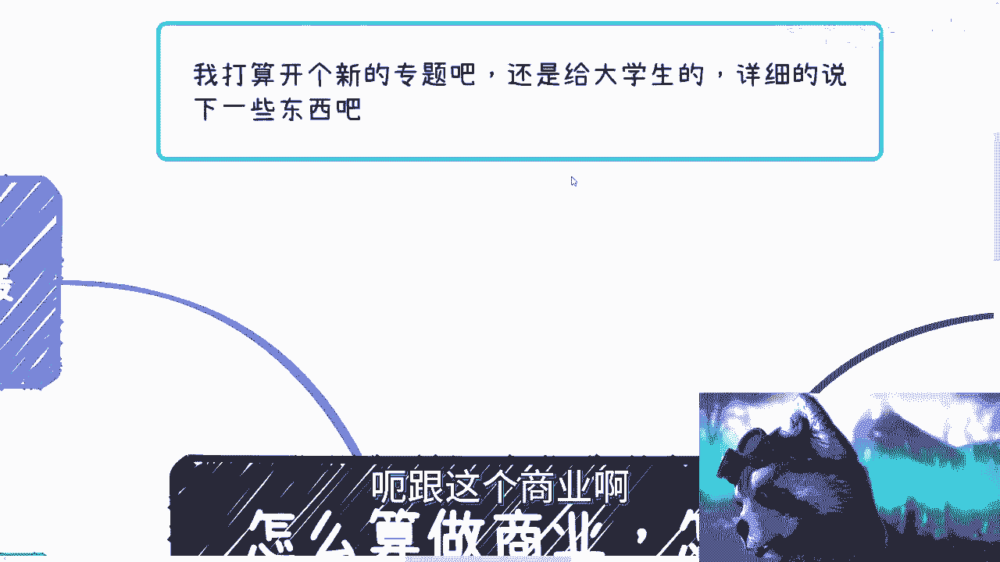
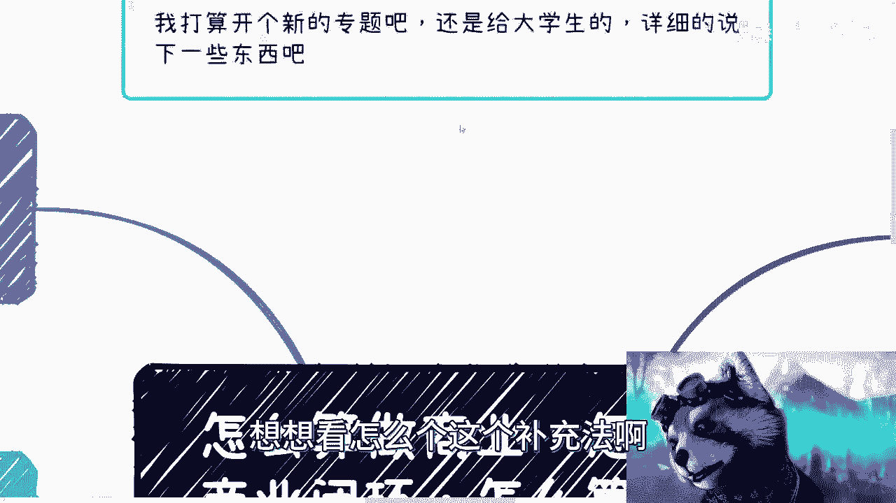
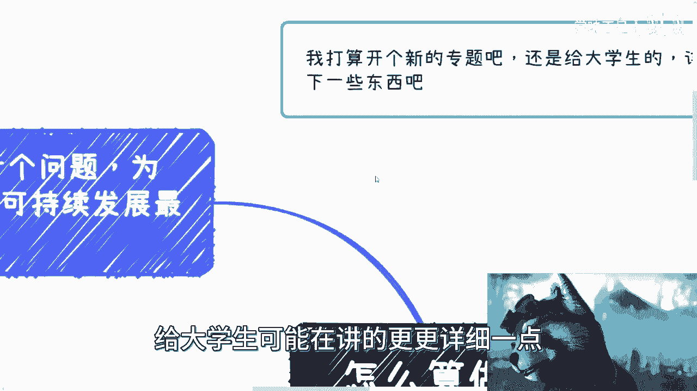
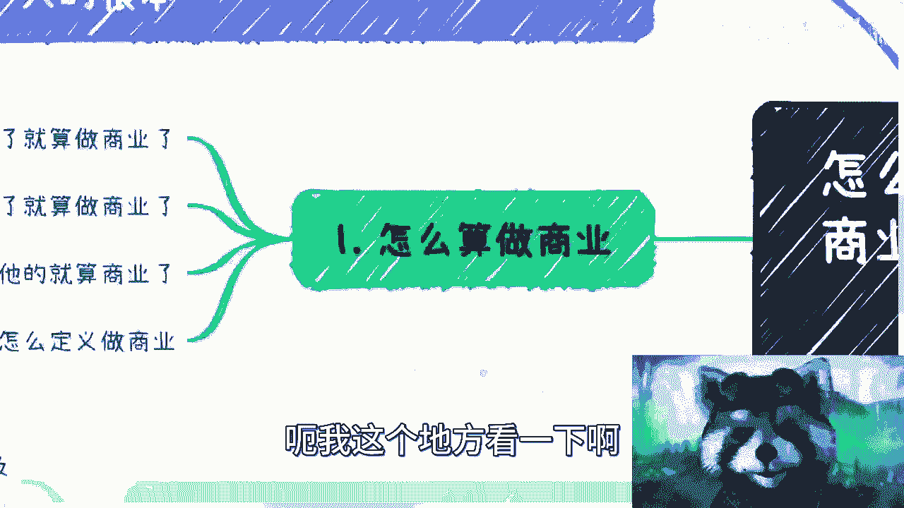
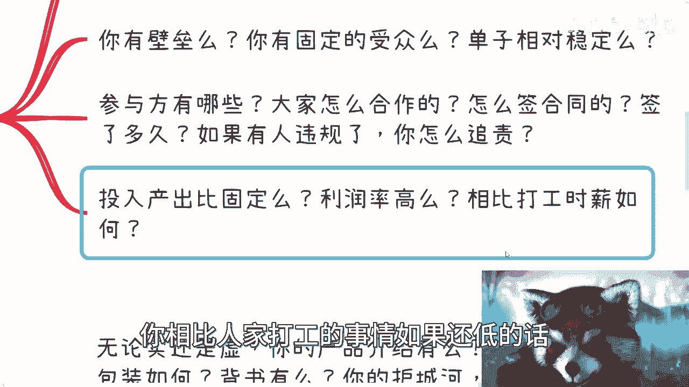
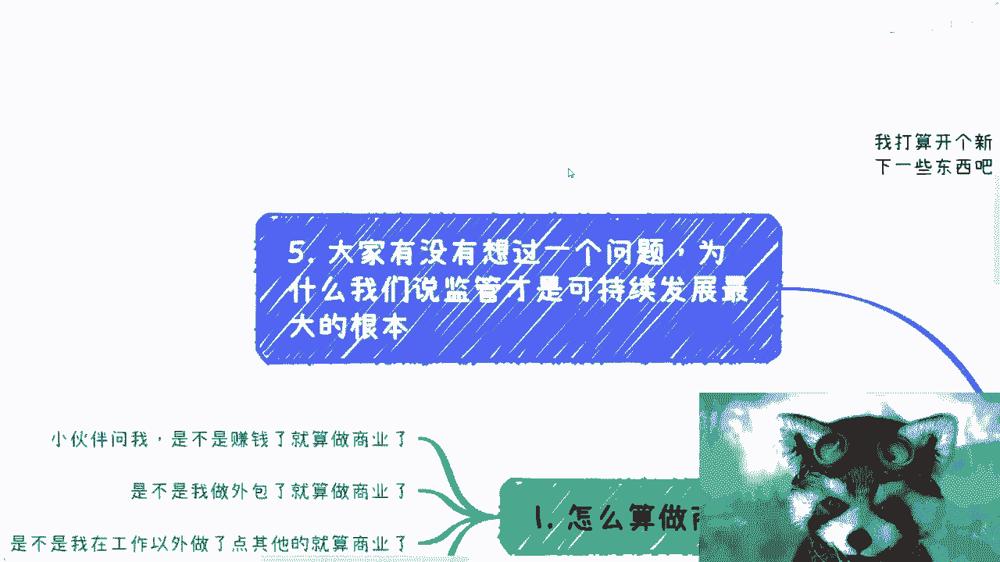
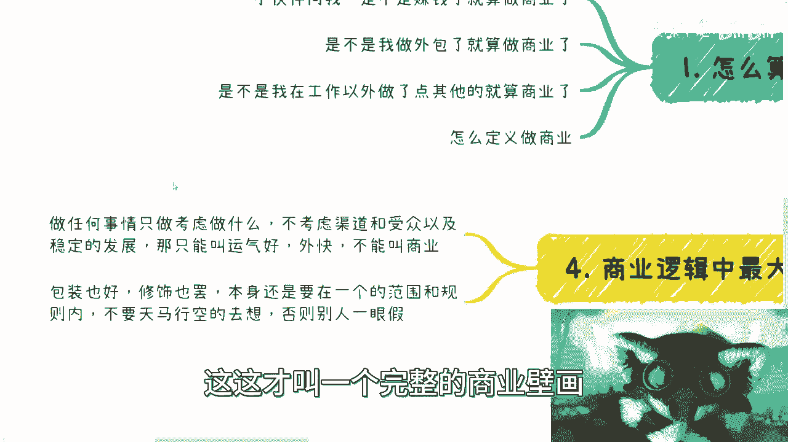
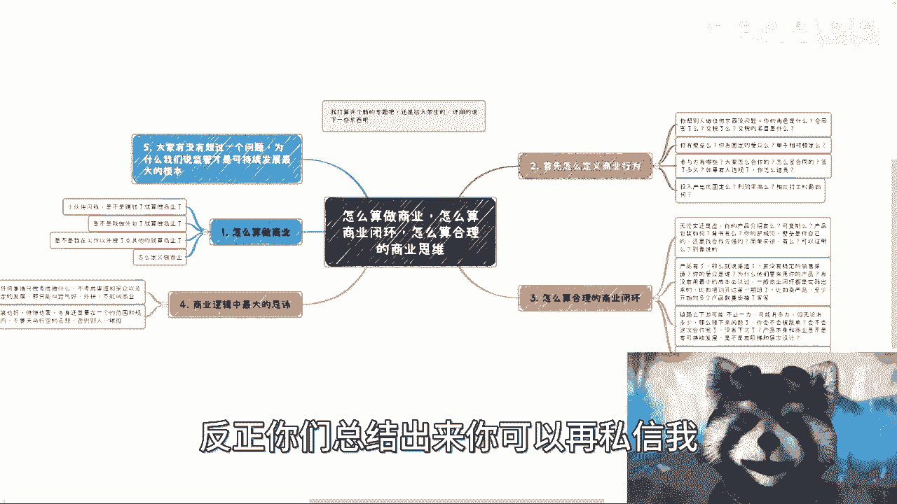

# 商业思维入门课 P1：如何定义商业闭环与合理的商业逻辑 💡

在本节课中，我们将为大学生朋友系统性地讲解“商业行为”与“商业闭环”的核心定义与判断标准。我们将通过清晰的逻辑拆解，帮助你区分什么是“赚外快”，什么是真正的“商业”，并理解构建一个可持续、可积累的商业逻辑需要哪些关键要素。

---

## 如何定义“做商业”？

首先，我们来明确什么行为才能被称为“商业行为”。许多人误以为在主要工作之外获得收入就是做商业，例如接外包、提供咨询服务，甚至偶然获得报酬。然而，真正的商业行为有更严格的定义。

以下是判断一个行为是否为“商业行为”的三个核心要点：

1.  **主体、合同与税务的合规性**
    *   行为本身不重要，关键看执行主体（个人或企业）是否明确。
    *   是否有正式的合同？
    *   是否依法纳税？税目、类目是否清晰？发票如何开具？
    *   如果主体不明确，且无合同、无合规税务，从根本上就不能称之为商业。这最多算是“外快”。

2.  **是否存在壁垒与固定受众**
    *   **壁垒**：你的服务或产品是否有难以被轻易复制的优势？例如，单纯使用ChatGPT等工具提供服务，通常不构成壁垒。
    *   **固定受众**：是否有清晰、稳定的用户群体？例如，“山东省济南市某高校的每届新生”是固定受众；“在社交媒体发帖，随缘接单”则不是。
    *   没有固定受众和用户画像，不能称之为合理的商业行为。这只能算是一个偶然的商业动作，而非闭环。

3.  **清晰的参与方与稳定的投入产出比**
    *   **参与方**：业务涉及哪些合作方？如何合作？权责如何界定？合同如何签订？
    *   **投入产出比**：成本与收益是否可预测、可计算？如果每次投入的时间、精力波动巨大，无法形成稳定的成本核算，这就不是一个合理的商业模型。
    *   **利润评估**：关注净利润，而非流水。如果利润很低，甚至低于普通打工收入，那么这个商业行为的价值就值得商榷。

上一节我们明确了“商业行为”的基本门槛，本节中我们来看看更高级的概念——什么是“合理的商业闭环”。

---

## 如何构建“合理的商业闭环”？

一个合理的商业闭环意味着你的商业模式是可持续、可复制且能积累的。它远不止于“接到一单活”。

以下是构建商业闭环需要审视的关键维度：

1.  **产品维度：可复制性与护城河**
    *   **可复制性**：你的产品/服务能否扩展到其他场景或人群？例如，针对大学生的服务，稍作调整后能否面向职场人士？
    *   **产品包装与背书**：如何呈现你的产品？谁为你背书？
    *   **护城河（壁垒）**：这是核心。你必须拥有能拿出手的、具象的竞争优势，例如：
        *   独特的专利或技术。
        *   权威的认证或头衔（如高校聘书、行业专家证书）。
        *   成功的过往案例（如为知名企业或政府提供服务的合同）。
        *   切忌仅靠口头描述，商业合作中需要实证。

2.  **渠道与市场验证**
    *   **稳定销售渠道**：你通过什么途径持续获取客户？
    *   **明确的受众与价值主张**：你的目标客户是谁？他们为什么必须选择你，而不是别人？
    *   **完成市场验证**：你的商业逻辑必须被实践验证过。例如：
        *   培训课程至少已开班7期。
        *   产品或服务已成功售卖给10-20位初始客户。
        *   空想一个前景没有意义，必须走过从渠道到变现的完整通路。

3.  **商业链路与可持续发展设计**
    *   **复杂的链路关系**：商业合作可能不止甲乙两方，可能涉及丙方（中介），甚至更多。各方合同关系需清晰。
    *   **防跳单与可持续性**：如何确保本次合作能带来下次合作？如何防止被绕过？
    *   **产品的阶梯与层次设计**：业务需要有成长路径。例如，采用**漏斗模型**，设计不同层次的产品或服务，将用户从浅层接触引导至深度合作，实现价值升级。
    *   **终极合规要求**：合同如何签？开具什么类型的发票？税率是多少？这些细节是商业逻辑落地的最终体现。

理解了商业闭环的构成要素后，我们必须探讨其根基——为什么合规是这一切的前提。

---

## 商业的基石：为什么必须合规？（合同、主体、税务）

所有可持续的商业行为，其根本基石是合法合规。这并非形式主义，而是生存和发展的必需。

1.  **监管是可持续发展的根本保障**
    *   在这片土地上，任何希望长期存续的商业行为，都必须合法合规。
    *   **合规三要素**：明确的主体、正式的合同、依法纳税，构成了商业行为的“安全三角”。
    *   这确保了业务在监管框架内运行，避免系统性风险。

2.  **积累个人信用与商业资产**
    *   商业闭环的价值在于“积累”。合规的合作记录是你最重要的信用资产。
    *   当未来寻求更大合作时（如与政府、高校、企业），对方一定会考察你的历史案例。你能拿出脱敏的合同、完税证明等实证，才能证明你是一个“安全、可靠、有积累”的合作伙伴。
    *   没有合规记录，所有过往经历都无法被有效验证，等于没有积累。

3.  **破除思维误区：行动优于空想**
    *   许多人在起步时纠结于细节，如“要不要注册公司？”“会不会有风险？”，从而陷入空想，阻碍行动。
    *   **核心是走通闭环**：不必拘泥于起步形式。可以寻找合作伙伴处理主体问题。关键是用最小成本（MVP）去验证核心逻辑：有没有人愿意为你付费？
    *   **风险可控**：你们想做的事情，世界上大概率已有人做过。可以通过调研、咨询（如律师）来了解和管理风险，而非因恐惧而放弃尝试。

---

## 总结与反思

本节课中我们一起学习了如何区分“外快”与“商业”，并深入探讨了构建“合理商业闭环”的完整框架。

**核心总结如下：**
*   **商业行为** = 合规主体 + 正式合同 + 依法纳税 + 固定受众/壁垒。
*   **商业闭环** = 可复制产品 + 稳定渠道 + 已验证市场 + 清晰链路 + 阶梯设计 + **全程合规**。
*   **核心思维**：从关注“我做什么”（上游），转向更关注“钱从哪来、如何持续、如何积累”（下游）。避免只谈流水，重视利润与合规积累。

最后需要反思的是，长期局限于执行岗位的“打工思维”，可能会让人忽视商业全局观和闭环构建能力。无论年龄资历，缺乏对商业逻辑、合规运营和生态链路的理解，在独立面对市场时都会面临挑战。因此，有意识地用本节课的框架去分析和设计自己的任何项目，是培养真正商业思维的第一步。