# web3，互联网3.0，联盟链和区块链的区别 - P1 - 赏味不足 - BV1dT411B7wV

好好好，这个感谢感谢各位观众老爷的这个信任啊对吧，就今天过万了，不容易啊，就我之前好像还是个300粉的渣渣，哈哈不是我跟你们讲啊，这个视频我已经录了第三遍，不是我不知道为什么b站不给我通过，你知道吗。

就是就他告诉我几分几秒到几分几秒有问题，我把那个几分几秒剪掉，他还是不给我通过，哎呦我真的是绝了，我跟你们说，我要再不通过，我就不发了，我就这个内容就不发了，但是我要不发，反正你们也不知道我没通过。

哎呦，我真的薛定谔的通过。

那我就认真讲一下，认真讲一下，我就不开玩笑了啊，可能之前有些东西可能讲的是不是太偏了。

就是最近很多小伙小伙伴啊，都在说要进入web 3啊，那么web 3区块链。

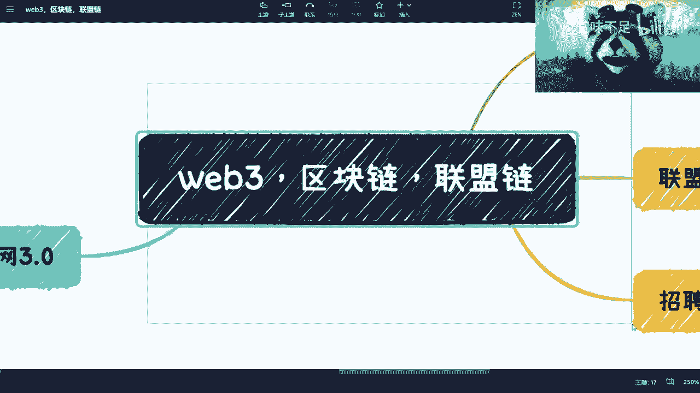

联盟链三个东西我觉得还是有一定差别的啊，我在这个地方简单的啊跟大家讲一下。

希望b站给我通过好吗，我谢谢给他跪了好吗啊。

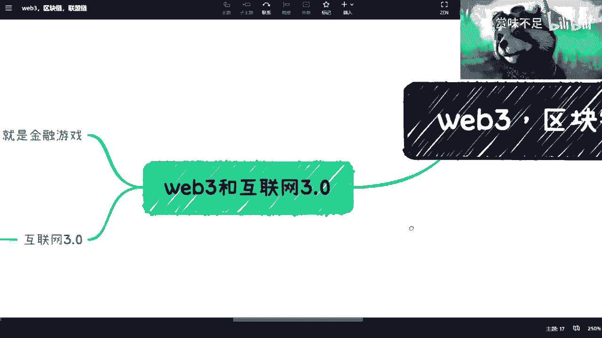

嗯web 3跟互联网三点呢，这边其实是现在是两个概念啊，就是说web 3，我们之前都说是一个去中心化的一个生态诶，等一下我看一下我卖啊，对的对的生态啊，那么当下本质呢其实是一个金融游戏啊。

当然我们不说他对错啊对吧，就这个事情是当下一个情况以后怎么样，我不知道啊，但是我是很看好web 3的，那么wifi 3这边呢我觉得我觉得机会也是蛮多的，就是大家可以做做智能合约的开发，记住啊。

智能合约的开发不是合约啊，这是两件事啊，两件事，然后呢这个工作还支持remote对吧，就很开心啊，然后呢哎算了，我把这个词放了啊，好吧好吧，那真的是第二个呢可以自己做项目做项目啊，这个也是可以的啊。

是可以的，第三个呢就是说啊这个公有链啊，就是说会涉及到区块链里面的公有链，公有链好，至于这个是什么，我回头可以再跟大家讲啊，如果你们有兴趣，你们自己可以先去查对吧，这个这个我讲跟别人讲没什么区别啊。

然后第四个呢，就是说web 3现在基本上都是海外的啊，都是海湾的好吧，也什么意思呢，也就是说国内它是不会出现web 3的这个东西呢，啊web 3现在这个说的呢更多的叫互联网三点，我也不好意思。

我可乐喝多了对吧，货量三点啊，那么这个是国内啊，这个是国内好，那么呃这个在政策上面呢，我们叫做下一代互联网对吧，那包括数字经济，数字资产啊，数据数，数据资产啊。

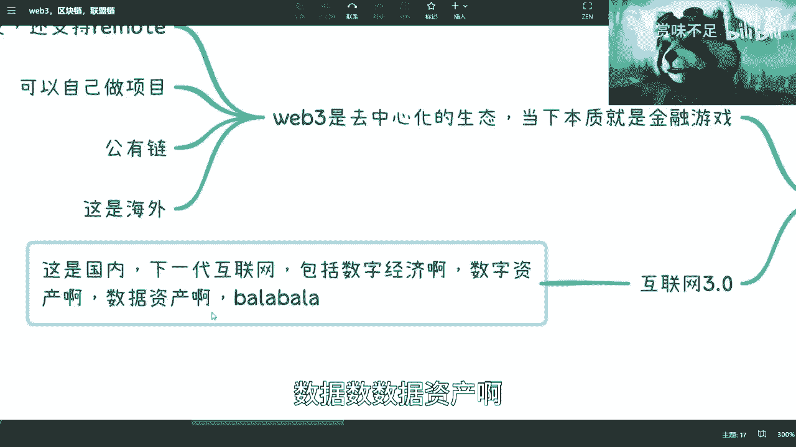

呃今天你们也看到我不去b站了嘛对吧，然后呢我在这个和b站的小伙伴呢。

耶诶也讨论了一下对吧，这个关于数据资产相关的对吧。

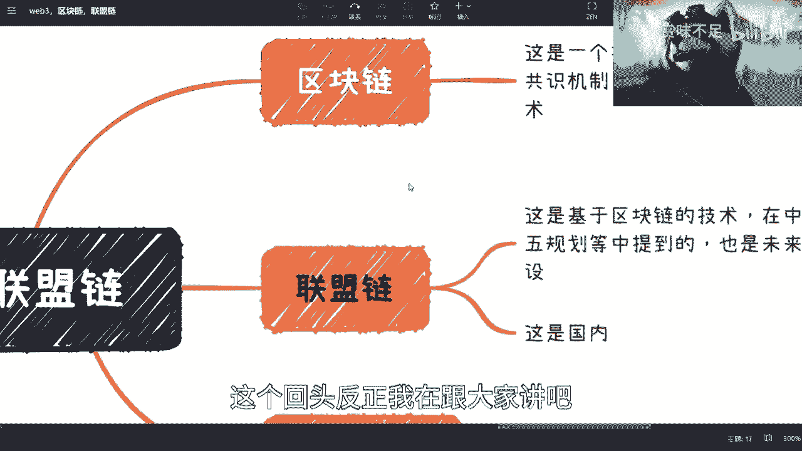

这个回头反正我再跟大家讲吧好吧，因为这是个long story哦，嗯然后呢这个来说区块链。

区块链呢它就是个技术好吧，就是个技术，它包括了啊底层链式的存储对吧，就是一个区块啊，然后一根链对吧，一个区块一个链连起来的啊，然后呢智能合约对吧，那反正你们要是回头感兴趣呢，我可以开这个。

我我就是我觉得啊，我认知当中的这些东西的内容告诉大家，好吧啊，就是我觉得这些东西在网上其实很多很多的，但是我觉得他们未必在我的认知里面，我觉得他们未必讲得对啊，第二呢他们未必这个和我这么一样。

那个对接到产业哦，我觉得还是有区别的啊，第三就是公式机制啊对吧，数据隔离啊。

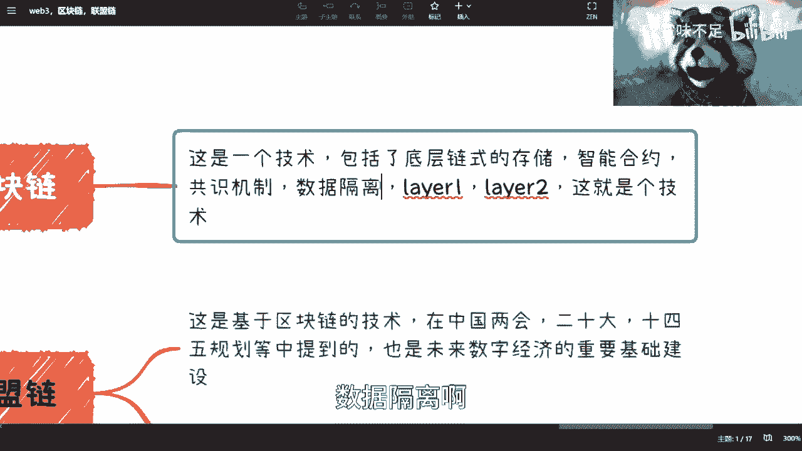

there were there to啊对吧，也简单来讲就是说它是个技术啊。

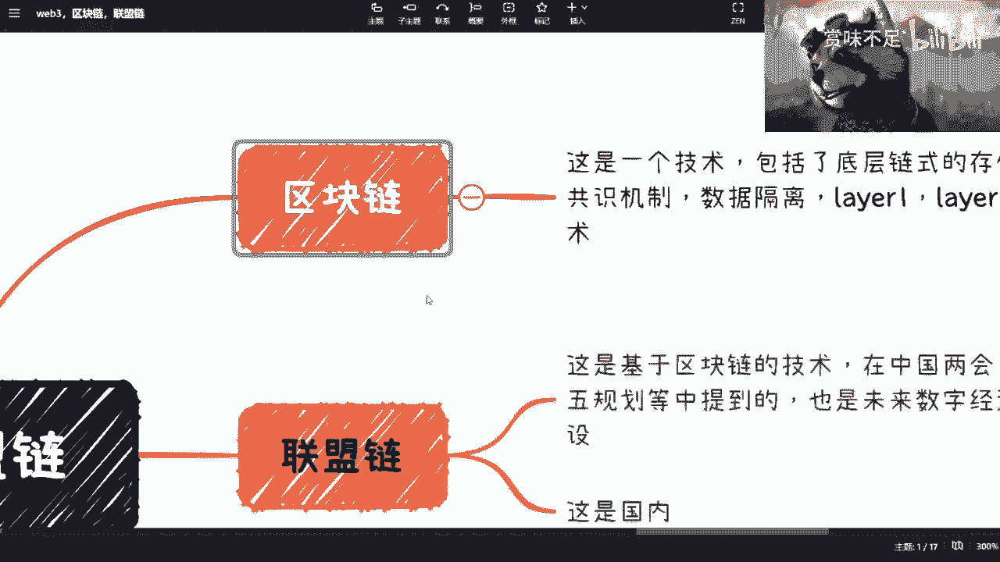

嗯公有链就这边web 3的生态呢是这样子的，就web 3和互联网三点，在我看来有一个通用的一个点是什么呢，就是web 3的底层技术是区块链，但是他用的是公有链啊，一定要记住他用的是公有链而去呃。

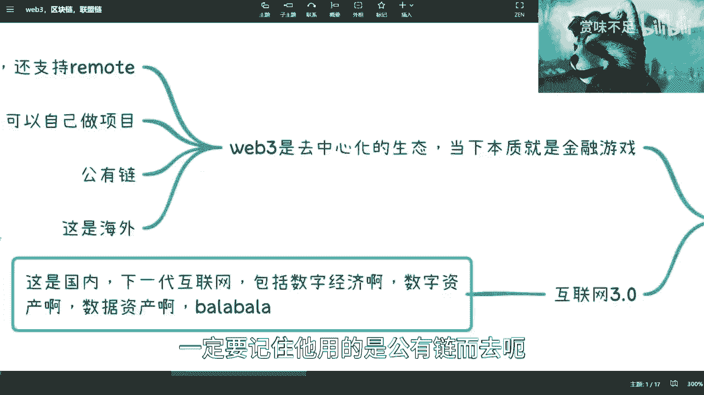

互联网三点，这边底层呢它用的其实也是区块链，但他用的是联盟联啊。

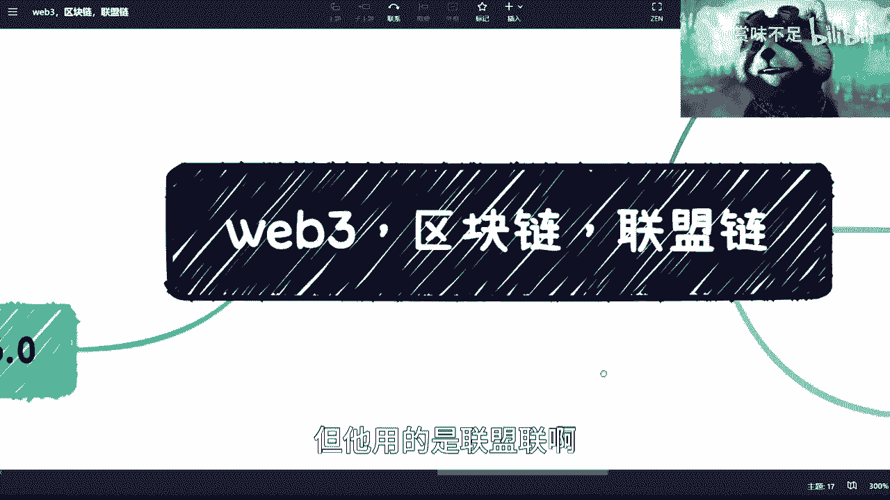

用的是联盟链，那么这个是什么呢，是基于区块链的呃，等一下我看看啊，对是基于区块链的技术啊，那么哎呀我把这个词都换掉好吧，都换掉啊，在这个啊这这这这都换掉好吗，都换掉啊，在政策中好了吧啊对吧。

在政策中对吧，也是这个未来数字经济的一个重要基础啊。

建设啊，那么这个是这个是国内好吧，就是说这些就是说因为有很多小伙伴在说嘛。

就是说啊，我要去学习这个这个区块链相关的开发对吧。

那么我接下来找什么工作对吧，但是呢你你学这个开发没问题啊，你你要先选择大的方向，就是你要去做web 3呢，还是这个区块链的这个基础基础设施，因为你区块链本身它里面也有很多的这个技术，技术。

无论在学术上还是在工业界，都有很多可以坐的地方，你知道吧啊。

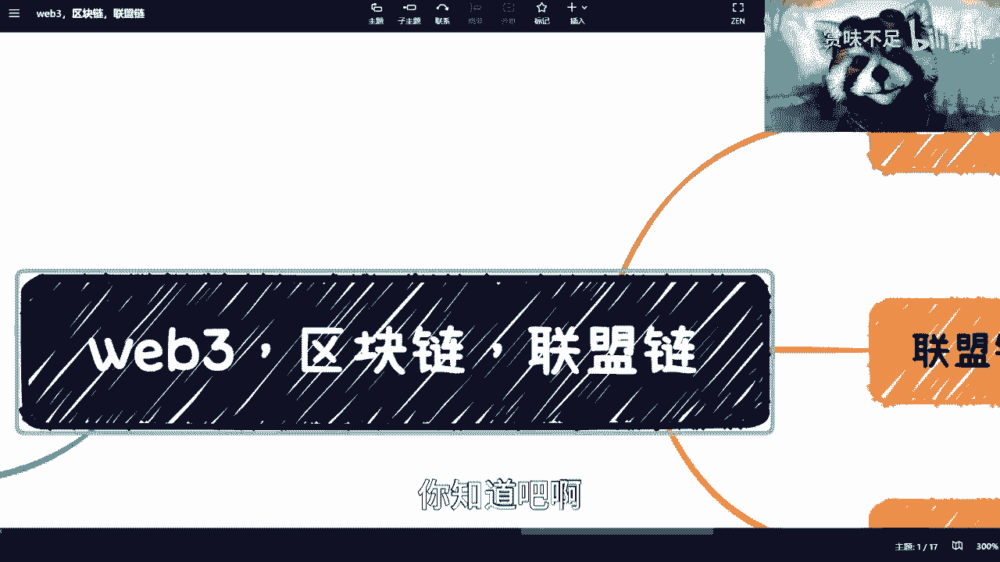

然后呢，那还是说就是说呃，这个就相当于是叫叫什么叫做啊，底层技术的这个建设嘛对吧，那这个呢就是就是相当于是应用了啊，虽然就是说用的是联盟链，但是更多的是联盟链。

比如在国内的一些产业结合啊对吧，产业数字化，数字产业化啊这些啊。

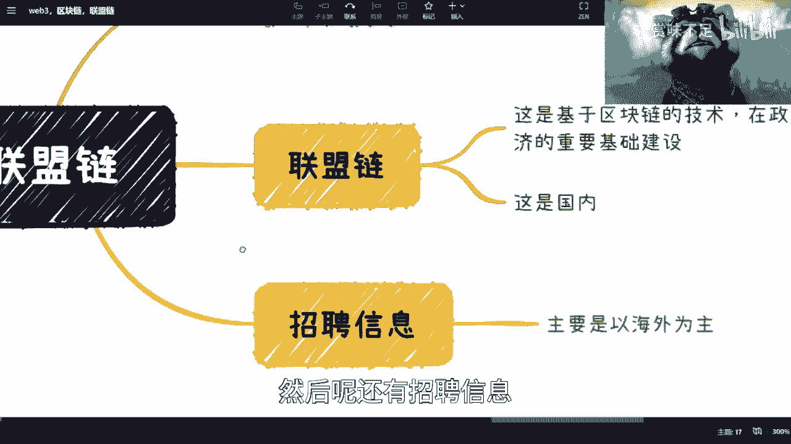

然后呢还有招聘信息，招聘信息这边呢就是因为他不会特地去区分。

就是说web 3或者区块链啊，他会给你一些tag，tag，给你一些标签。

就是web 3或区块链，你知道吧，但是呢就是说从目前的大部分的这个，招聘信息上面来看呢。

就是啊还是以这个海外为主的啊，还是以这个海外为主的好吧。

那么嗯在这个地方呢，我觉得我，我我好像之前视频在最后做了个总结啊，你看我这视频录的，我真的我自己都忘记，我到底这个前两个视频都讲了什么东西，唉我也很焦虑，就是数字经济这边呢其实跟这三块都有关系啊。

我在数字经济那个合集里面。

回头我会慢慢去加的哦，就关于web 3这边的我的一些看法。

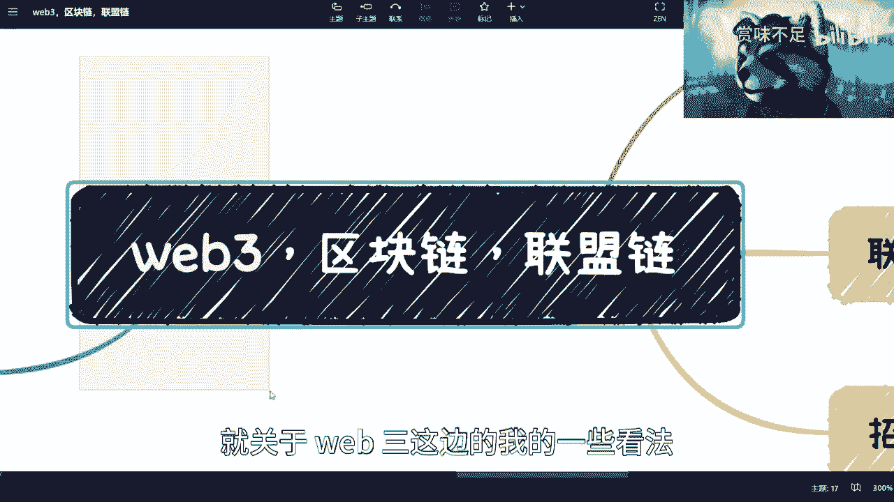

关于区块链对吧，整个的一些情况啊，当然啊就是我我在想。

我要不要把就是说智能合约啊，这个共识机制啊，数据隔离啊一些拆开来跟大家讲。

我觉得是不是没必要讲这么细，我觉得更多的我应该还是会从产业啊，从就业啊，从这个呃应用啊，就这个这个场景就是scenario上面去切入啊。

啊包括联盟链，好吧好吧，那那反正大家就是先了解一下好吧，希望b站能给我通过，再不给我通过啊。

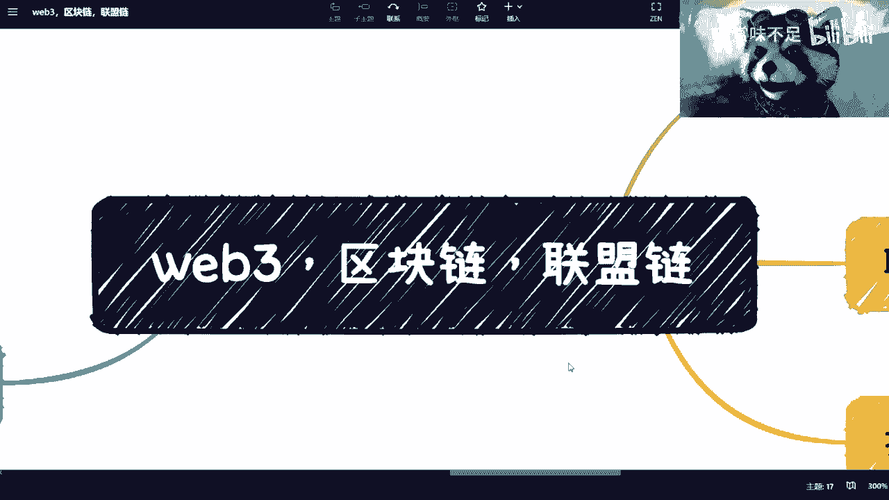

算了，我也没办法了。