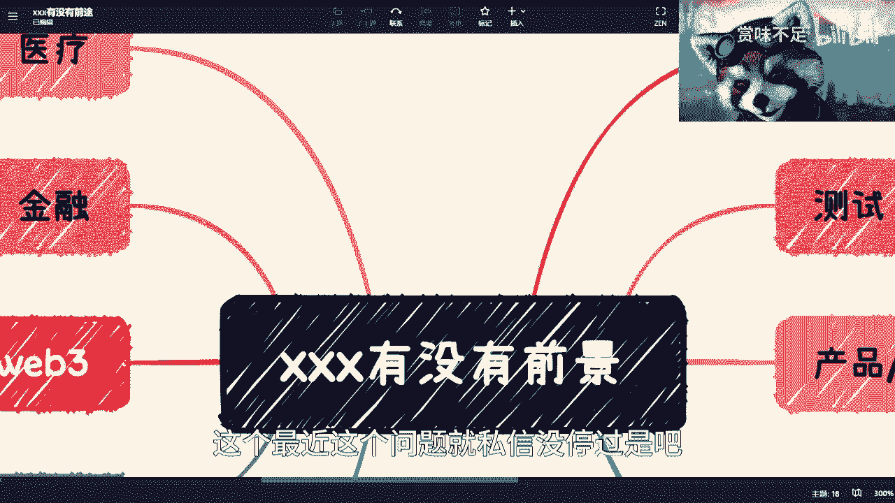
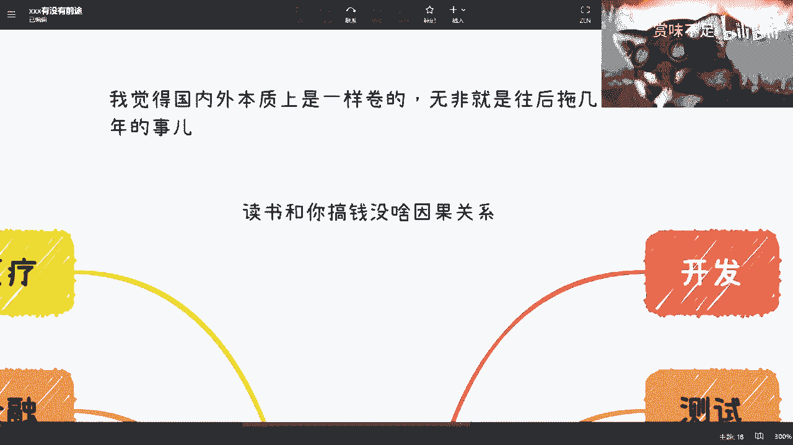
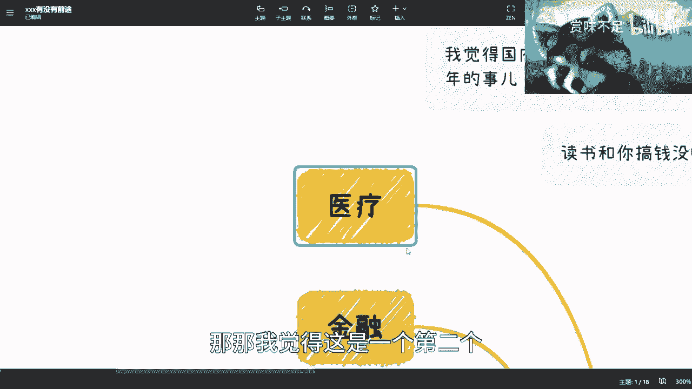
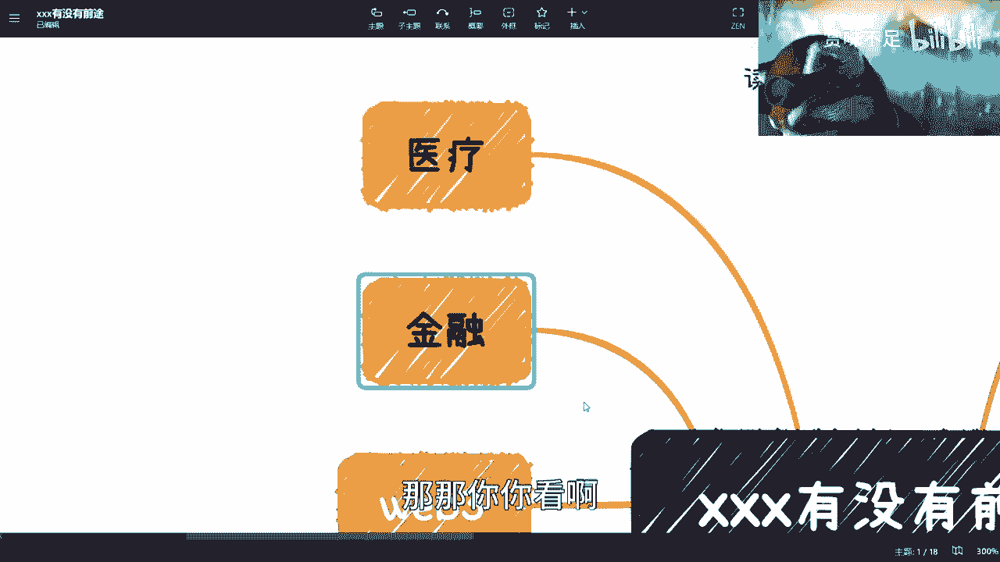
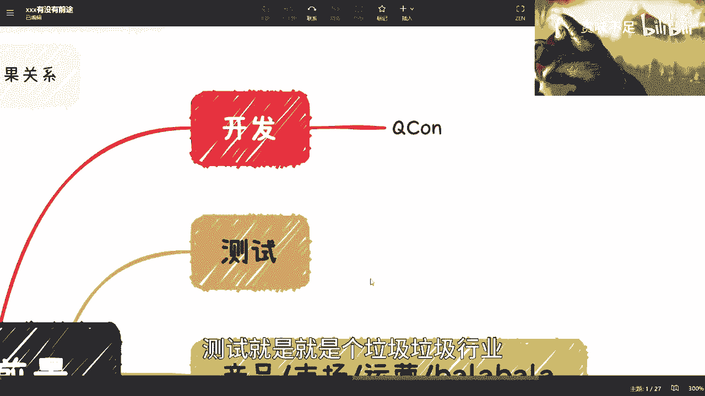
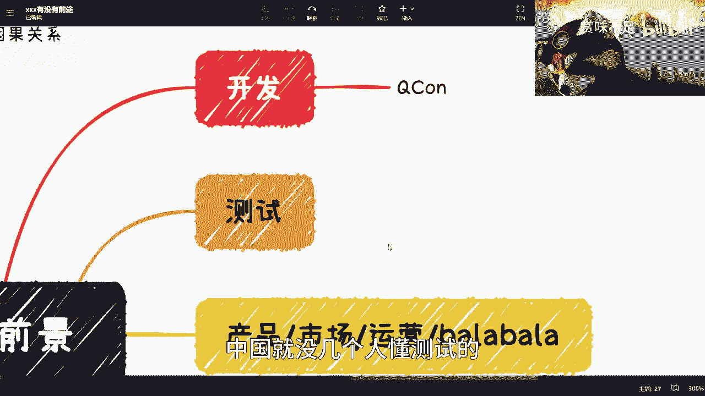
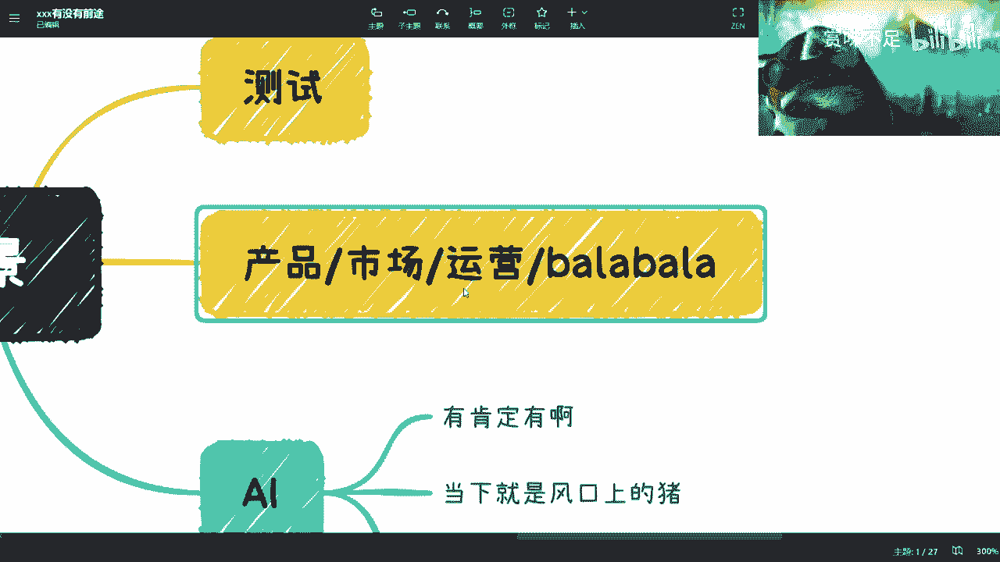
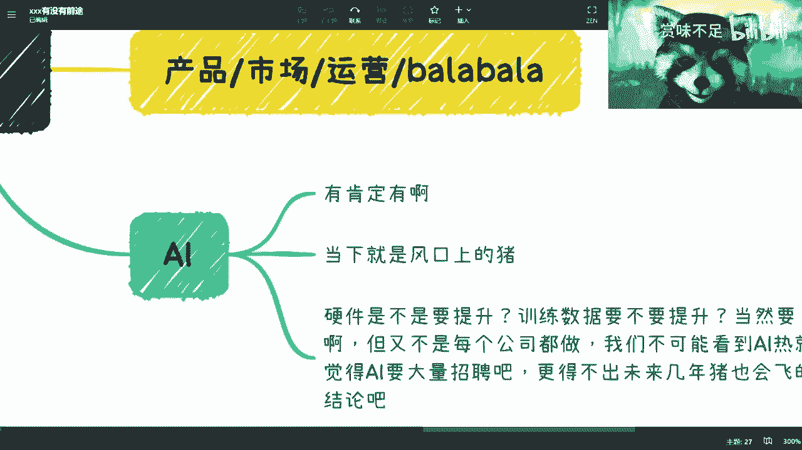
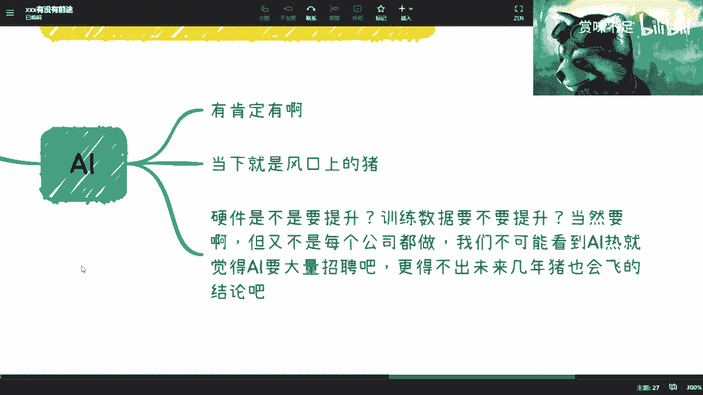
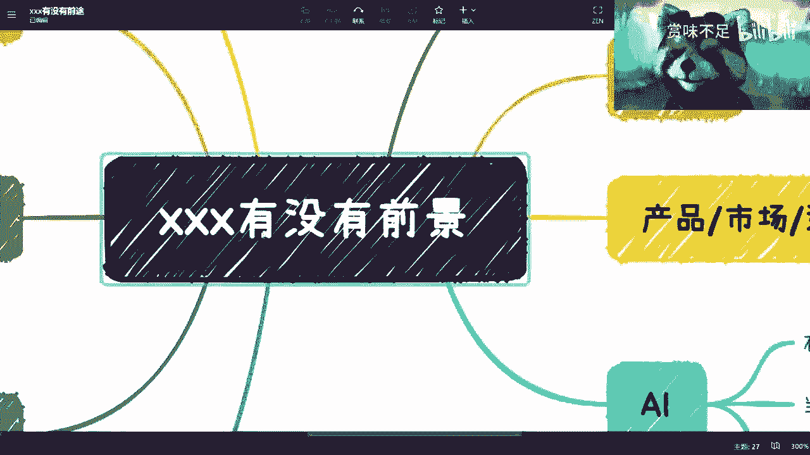

# xxx岗位和行业有没有前景 - P1 - 赏味不足 - BV1Cm4y1z7G6

好大家好，嗯嗯你看啊，这个最近这个问题就私信没停过是吧。

评论区也没停过，然后我觉得大家真的就就。

虽然我觉得你们也不愿意承认，你们是二极管是吧。

但是就我觉得真的很个人，二极管我这边列了几个点啊。

第一个点就是你们别再去问，就是有没有什么前景，或者来说发展好不好。

我还那句话，发展好跟你们有什么关系啊，发展不好又跟你们有什么关系。

你明白吗，没有意义呢，你以为发展好了就咋啦，一一个工作做到就是你就正常跳槽对吧，正常职业发展，回头我就给你们讲一下职业发展，就正常跳槽对吧，正常职业发展啊，正正常做不会失业吗是吗，是这个问号吗是吗。

还是说发展不好，你们找不到工作，我跟你们讲没有任何关系的对吧，就跟很多人跟我说，学历不学历是一样的，就是我觉得最多最多就3年三年，就是就是毕业之后3年内，我觉得这个学习是有用的。

你毕业之后3年后没卵用啊，你看啊我在这个地方列了很多什么开发测试啊，金融医疗啊，对吧好，你等会听我讲啊，我觉得呢这些东西都有前途，我也觉得这些这些东西都没有前途啊，但是就看怎么看对吧。

这个东西跟我们每个人有什么关系，这是你们要去考虑的，不是说你们得到一个答案，说嗯这个行业好，这个行业不好，然后这个行业好好，我就all in了，这行业好不好。

你all不all in跟你赚不赚钱有什么关系。

也没有关系，你知道吗对吧，第二呢就是说国内外本质上是一样卷的。

其实无非就是往后这个拖几年的问题，就是比如说海外，现在你说卷吧卷的，但是可能没国内这么卷，但是过几年可能也会这么卷，当然了，就是说这个卷的程度吧，我觉得以后也也应该没有国内那么卷啊。

但是他已经很卷了是吧，第三呢就是说你们要明白，读不读书跟你搞不搞钱没有啥因果关系，就是你读书多了对吧，跟你搞钱多没有任何因果关系，读书少跟你搞钱少也没有因果关系对吧，甚至读不读书跟你搞不搞钱。

两者没有冲突，你可以一边读书一边搞钱，是不是啊，我觉得就是大大家这个思维啊，就是说问我有没有前景，我说现在大环境都不好，然后大家就说了啊，那我只能转行吗，就是你是一个人类对吧，不是一个单细胞生物。

你明白吗，就是我这么跟你们讲，从前往从今往后单个工作都是不靠谱的啊，都是靠不住的，就这句话了嗯，然后还要来问语言呢，你知道吗，就说啊JV有没有前途，狗有没有前途，Rest有没有前途。

move solidity有没有前途，我跟你们讲都有前途，你只要做得好都有前途，问题是你做得好吗，你能不能做到全全国5%能吗，不能那就不好，我就这么简单就好，行业好不好，跟你有什么关系啊对吧。

就是说一个行业好，照样也有人可以做到前面，也有行业不好，也有人就业照样可以坐到前面，但问问题不是不是他们啊，问题是你能不能坐到前面，是不是你问一下语言好不好，有什么意义呢，一点意义都没有啊，大哥们啊。

爷爷们，哈哈是吧，我是葫芦娃啊，然后啊然后我再给你们举个例子啊，你说我们假设一个事儿啊，你一个小时2000块钱爽不爽是吧啊，开心吗啊，你未来连续做，你首先记住啊，这2000块钱时薪。

不是说像你现在工作摸鱼啊对吧，就可能相对强度比较高的啊，这个脑力活啊，我先不说是体力活，脑力活啊，你未来连续走，我就问你能撑多久，你能存多久，你又愿意做多久对吧，我跟你们说，你们不要觉得啊好像很开心。

我为了钱都能做是吧，我跟你说，一般来讲你你支撑不过两个月的，你一个月可能都撑不过，因为你压力会很大，你精神压力也会很大，你的各方面压力都很大，你知道吗，你是撑不过去的，所以说我还是那句话。

有多少人能够做到实行2000吗，根本没有多少人，所以你们明白，无论你们做什么，你其实做的你们做的都是苦力活，你明白吗，都哎呀苦力活对吧，都是苦力活，你看这个专辑，我为什么说是失业之前的窗口期。

是因为失不失业，我跟你们说其实并不重要，重要的是我们要有多条多条的赚钱渠道，同时我们要有产投入，产品比投入产出比较高的赚钱渠道，而不是说你永远是就是做苦力活，你明白吗，就是说包括你出去做副业也好。

怎么样也好，也是一样的，你一样要考虑这个问题，就是你去摆摊也好对吧，包括你去做各种各样别的东西啊，你一定要去，就说一开始你做苦力活没有问题，但是慢慢慢慢你得把它规范化，规范化之后，你还得总结对吧。

你还得把它流成流水化对吧，然后你这个人再有脱出就脱离出来，然后去做一些性价比比较高的事情，这个是核心，不是说我们在讨论说啊，这个这个这个行业好不好啊，我要跳个槽，我以后工作稳不稳定，我跟你讲。

你们别考虑这事，这事不是你们能考虑的对吧，就是3年也好，5年也好，10年也好，你们早晚都会失业的，就这么回事啊，我在这地方板上钉钉了，清楚啊啊然后呢我们来看看啊，你比如说首先你比如说医疗对吧。

好我跟你们讲啊，我跟你们讲，大概前年我在上海这边参加个活动啊，医疗活动对吧，你们可以去看啊，一个活动啊，整个营收差不多是在300万到350万啊，然后呢整个医疗层面我在我看下来啊，除了生物医疗。

其他医疗层面基本上是落后互联网10年，它不是落后全球互联网10年，是落后中国互联网10年，什么意思呢，就是医疗整个里面的，无论是系统还是各个方面玩，就是你要说有待改进，所有地方都有待改进，那么问题来了。

你问我意料有没有前途，我告诉你有对吧，我告诉你有各个方面都有什么生物医疗啊对吧，包括包括其他的一些一些一些，这个叫什么医药啊对吧，包括供应链啊，包括就是就是那个叫什么，就是那个器械。

医药医疗器械都很有前途，没毛病，但是我就问你跟你有什么关系啊，你能做什么啊，我跟你说医疗有前途，你跟我说好，我去打个工，那这前途跟你有什么关系，跟你没半毛钱关系，你明白吗对吧，那你要是跟我说哎。

陈老师我也是对吧，去弄个会，或者我跟别人搞点关系对吧，然后在里面拉拉皮条对吧，我300万拿个10%，20%，不开心吗，不香吗，就是我现在觉得我真的跟很多同学聊下来对吧，学校里面的这个学生聊下来。

就我觉我觉得是这样子的，就是1010年后的今天对吧，学校里面的同学跟我当时如果一样幼稚呢，我觉得呃这属于原地踏步啊，那如果比我当时还幼稚，那就叫倒车对吧。

那那我觉得这是一个第二个，你问我因为一进入有没有前途呢，我可以明确的告诉你肯定有前途啊对吧，金融是整个人类社会体系的根基啊，怎么会没前途呢，那我还是那句话，这金融有钱跟你有什么关系啊。

啊是你跟我说打工具有关系吗，我也搞不懂了，我真的是一点没明白对吧，就是就像有很多人跟我，我跟他说金融很有趣，好陈老师，我要去做开发了啊，我要去做做市场了，我要去做销售了，就是你们明白吗。

就是你做什么你都是苦力活，但是我跟你说有前途的，意思是这里面有很多投入产出比高，四两拨千斤，以及就是说这个呃，就是可以有类似类似于杠杆原理，你可以你可以投入投入一个也同样的，这个这个这个时间和力气。

能获得十倍20倍收入对吧，当然你明白这个这个不是说不是一个赌博行为，这是一个赚钱行为啊，这不是一个打工行为，你一定要明白对吧，那金融现在里面有很多对吧，科技金融。

web3的金融decision alized的去中心化金融是吧，然后那个那个叫什么呃，量化对吧，很多啦，有什么没有啊，包括包括我跟你们说，我朋友以前专门给那个高净值人群做那个呃，叫什么家族产业管理。

怎么没有了多啦对吧，而且他做家族产业管理，做着做着还给别人看风水，哎我跟你们讲，你们别去老是抨击，有很多东西你们不懂的东西对吧，你们懂不懂并不重要，重要的是他能不能赚钱，你明白吗。

你说我朋友给他们看风水，就专门给高净值人群看风水，半个小时6万块钱怎么了呢，不香吗，对吧啊，我觉得你问我有没有前途，我觉得有对吧，但我觉得跟你们没有关系，所以就是说就是说你们就说。

跟你们现在的这个思维没有关系，就是你们得改变思维才会有关系，你明白吗，如果你们老师就是单条腿走路读书，我是打工的思维，那这辈子不会有关系啊，就是就我就觉得我这个专辑开到现在，就大家听了这么多集课。

我我我到现在真的觉得，大家没有get到我的核心思想，你知道吗。

那那你你看啊，接下来再往后看web3，Web3，你问我有没有前景有啊，那必然有啊，web3是是是现在香港啊对吧，包括这个新加坡啊，迪拜啊，非洲啊啊印尼啊等各个地方非常注重的东西，怎么没有前途呢。

但问题是跟你有什么关系呢，你想怎么做呢对吧，但是我觉得web3里面其实机会蛮多的，就大家如果来说做远程的话，其实开发也能做对吧。

solidity啊，move啊对吧，那这个我可能在这个地方写一下吧，以免大家不懂啊，好solidity和那个move对吧。

你都可以做啊，远程做啊，包括远程还有运营啊对吧，WB3运营很赚钱的，我跟你们说WB3运营市场还有销售对吧，就是sales bd版啊，很赚钱的对吧，那你们做啊倒是对吧，你们倒是去了解呀。

倒是去版面啊和智能合约啊对吧，oracle啊就预言机啊对吧，包括就整个那个那个区块啊，共识机制都是去了解啊对吧，我说很有前途啊，啊但是问题是里面风险也很高啊，有很多人在里面倾家荡产啊对吧。

可能可能是99。20。8开对吧，就是0。0。8年赚钱了，99。2代在亏钱的，那你们都是去呗是吧。

啊那区块链也是一样的，你问我有没有前景，那必然有前景啊，数据经济整个底层就靠区块链了是吧，但是问题是区块链这个东西又话又说回来了，你们要去学习，同时你们要熬得住对吧，不能说老师这么就是浮躁。

就是说啊我我就是要找一个稳定工作，没有什么东西是稳定的，哪来的稳定对吧，然后就说我当下当下哎呦，我看到好像这个新能源，碳中和碳中和好像很有前景对吧，我好像那边很火，那区块链都不火对吧，没人说对吧。

或者来说这个都不提了对吧，那你要有你做一个东西，你得有坚定的信心，你知道吗，你做一个东西你得看懂他，你赚不到你认知外的钱，你看不懂你去做什么东西呢对吧，但是问题是你看懂的前提是什么，你得去学习它。

是不是你别老去问有没有前景，你行业整个网络上面跟你说，有前景的东西多了是了，每个人看问题角度都不一样对吧，今天我赚钱，我跟你说有前景，每天我亏了钱，我就跟你说，这没前景，有意义吗，有意义吗。

没有一点意义呀，对不对啊，我说不好听点，我为什么现在区块链很多地方我能做啊，那还不是因为这么多年我坚持做过来了啊，我要两个两个月打一打一枪换一个头，那他妈谁管我啊对吧，那外界就说啊，陈老师。

你就是蹭热点的对吧，你这个都是没有积累的，万一我就这么跟你讲，回头真的有什么机会，人家不会想到你的，因为人家就会觉得你是一个投机，投机取巧的对吧，一个一个一个一个一个来回倒的这么一个人。

你明白吗啊，大数据对吧，也有人说我跟你们说，大数据接下来一定是个大方向啊，因为我说的很清楚，就是数据治理，就这个东西我回头会单独再开的，你们别着急，整个数据经济里面东西很多很多对吧，数据治理啊对吧。

数据数据这个叫什么数据数据数据清洗啊，对吧啊，数据清打错了，数据数据清洗啊对吧，然后这个这个这个这个数数据叫什么，就是那个资产化对吧啊，包括数据预测啊，数据没有叫什么数据训练啊，数据训练和预测。

我觉得很有关系啊，但问题是还是那个问题啊，跟我们有什么关系呢，就是说我们如果打工去做这些东西，你们依然是依然是赚不到钱的，你们依然是苦力活，所以说我们要去考虑的是。

我们怎么通过投入产出比高的方向去切这些，对吧，你比如说你比如说数据治理清洗，资产化预测训练，那你在里面能做什么呢，你是作为一个拉皮条的角色呢，还是说你在里面做一些咨询顾问呢，还是说你专门做一些做家公司。

去承接全球全国的各个城市，不同的政府的项目呢，还是说你做你做了一个服务，专门是帮助这些这个白名单的供应商，来做技术服务呢对吧，你得有切入点啊，不是说哦，陈老师说大数据未来很好，方向好。

我就要找大数据专业了对吧，我就去做大数据工作，这个这个这个岗位了，有用了没有用的呀，就是今天是在风口上面，但你就算是头猪，你也飞不起来，因为你在打工，你你们明白吗啊。

我我我我真的我我很我很焦虑，你知道吗啊。

然后还有什么呢，就是开发测试对吧，那一样的，我跟你们讲，依我的想法，这两个东西你随便做什么都没有前途，为什么呢，你说是打工的，而且打到一定时间你就被淘汰掉了，无所谓，没区别的，你随便打什么我都一样的。

你除非跟我说，你今天芯片卡脖子的对吧，你说我很牛逼，我全国全国全球，就我技术是领先的，那没问题，你但凡做不到顶部，那你不就是个垃圾吗，是不是你就是个工具人，有什么区别啊，你工具人我换一个不行吗。

啊我是缺了你做不了开发的吗，还是缺了你做不了测试，就大家认清楚自己身份嘛，你说是不是啊，所以说我觉得你说有没有前途，我觉得没有，但是你要说你做别的东西，你打个比方开发现在有很多什么，你们自己看吧。

开发你们领域，我随便举个例子，q co对吧，我不是说QQ不好对吧，QQ人家做的多好吗，人家有大会对吧，有有club对吧，有有圈子，然后有流量，然后知道流量怎么变现，那你们也可以做啊。

而不是说而不是说只做开发这个岗位，而不是说只去找一个什么，我去学go或者学习类Rest，某个语言有用了没有用的呀，对不对，而且我不是说你们一定要转行，而是说就是说你自己去看看，有没有做一些别的方式。

投入产出率更高的，就就所有的人，我跟你们说，你们都想赚钱对吧，但是你们都不愿意去，就是开拓别的思维和思路去做，你说我就靠打工赚钱，大哥们靠打工赚钱，有几个人靠打工赚钱的啊，你就跟我说。

你这辈子有多少概率是找了家公司，然后开始做，做到他上市，然后股票套现，你还不如去买彩票呢，你说是不是我就我真的就不明白了啊，然后测试就更不要讲了对吧，测试就是就是个垃圾垃圾行业。

你就别别去做了对吧，中国就没几个人懂测试的，从中国也没有几个公司就是就重视测试的。

就这么招吧，好吧啊，然后市场运营产品我跟你们讲也都是一样的，你打工没问题啊，你可以拿些高薪啊，但是这些高薪，在你人人生的这个时间长度里里面来讲，你现在一年打个比方做80万或100万，你看上去很牛逼是吧。

但是你能拿几年呢，你能做几年呢，对不对，你你你你你去对比一下中国的各个这个房价啊，教育啊，包括你未来结婚啊对吧，包括包括你这个孩子读书啊，包括你未来的这个这个这个车子啊等等等，你自己去评估一下吧。

你能有多少钱，对不对，这点钱叫什么都叫苦力活，是不啦，当然就是说嗯就是说还是那句话，你你你产品有三节课对吧，三节课人家培训就做的特别好对吧，你市场运营人家也有啊，也有书啊对吧，也有也有这种集训营啊。

HACKTON啊对吧，很多很多，那你能做吗对吧，你要去想的是你能做什么，不是你去想的是说哦哪个行业好，哪个岗位好，我就我就all in了。

哎呀。

对吧，然后还有就是AIAI，我跟你们讲更搞笑，GPTT对吧，搞得大家人心惶惶，就跟我说AI有没有前途啊，或者来说跟我说陈老师AI很牛逼啊，我们用all in了，AI很牛逼，跟你有什么关系对吧。

AI很牛逼，是要提升算力对吧，是要提升整个的数据模型是很对，但是是整个中国市场都提升吗，它不就是几家大公司来提升吗，不就几家大公司在用嘛对吧，你AI好适合不合适，跟硬件是不是要提升。

跟数据训练要比较提升，这件事情跟整个面有什么关系啊，他可能就那么五六家十家公司在那边做啊，你跟你从AI这边很牛逼得出了说哦，未来的硬件市场很牛逼对吧，未来的数据训练很牛逼。

这你怎么能得出来这种这种结论的呢，你说是吧，就是就是你要清楚的去看到，你不能说啊，这个对吧，就就就明明是一个点的事情，你说你说你把它看成个面的事情，然后你就冲进去冲进去，然后你就说哎呀好像也没有啊。

那为什么AI这么火，为什么我找不到工作呢对吧，你随便用膝盖想想就能想的出来。

你知道吗，所以我总结总结一下啊。

不要第一单份工作，你们早晚都会失业的啊，你们信也不信，信也好，不信也好，你们自己看着办啊，你们可以回头回头过了，如果这视频一直在你们听到过来，要回头过了5年十年，如果你们还能找得到我，你们反正对吧。

就这么着吧，这第一个第二个是什么呢，就是你们不是说这个东西，比如说啊陈老师说这个东西不行，对吧啊，苦力活对吧，就要转行，并没有啊，就找多条赚钱渠道，你该主业该怎么做怎么做，就是份工作罢了对吧。

别太认真认真，就是问工作，你就是个工具人，你就是个电池，怎么了呢，对不对，那剩下多找找别的赚钱的方式啊，不是说只有转行和不转行的世界，你别做二极管好吗，然后这第二点第三点是什么呢。

就是整个的这个这个市场，其实每一个领域里面都有很多的切入点，但是关键是我们要去考虑的是什么，就是我这件事情怎么跟我们有关对吧，然后你们现在考研也好，读书也好，你们可能要考虑的是，我就是在在想的时候。

我到底去积累什么对吧，那么很简单，你们去找个领域，然后找一个切入点对吧，觉得哎这个切入点其实是能赚钱的，你付出同样的这个时间，你是能赚钱的，那你就去积累啊，积累技术，积累这个关系啊对吧。

积累经验就去积累啊，然后回头你就可以做了呀，对不对，不就这么简单一件事儿嘛，回头再有人再有人问，我就把这视频扔给他好吧。

