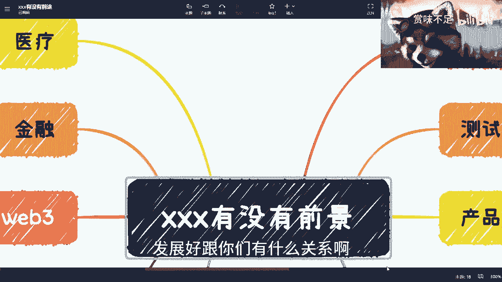
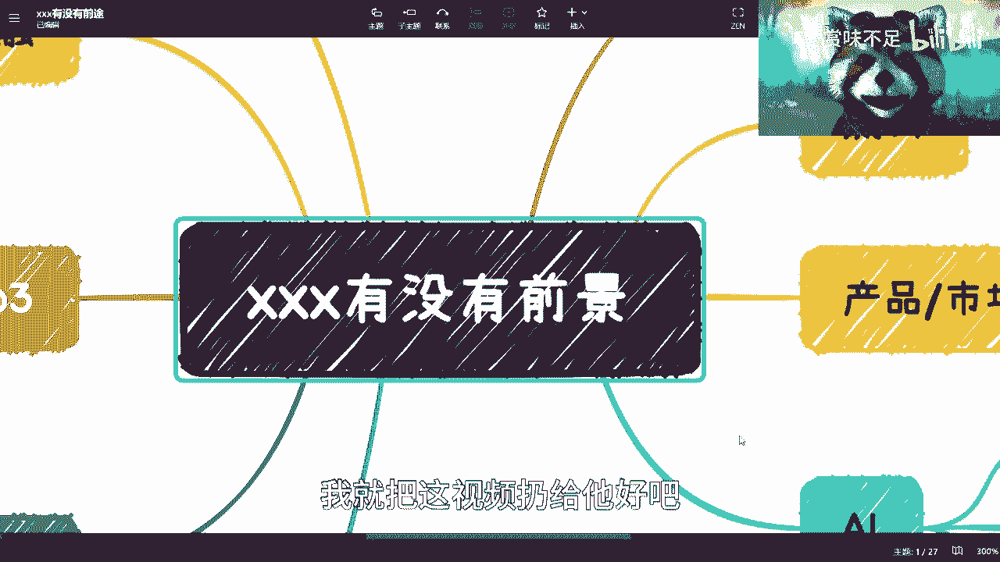

# 职业规划核心思维课 - P1：如何理性看待行业与岗位前景？ 💡

在本节课中，我们将探讨一个被频繁问及的问题：“某个岗位或行业有没有前景？” 我们将分析为什么单纯追问这个问题意义不大，并引导你建立更有效的职业规划思维。

## 概述：问题的本质

最近，关于行业和岗位前景的疑问在私信和评论区从未停止。许多人似乎陷入了一种非此即彼的思维模式。

上一节我们指出了普遍存在的思维误区，本节中我们来看看具体有哪些常见的“二极管”式想法。

以下是几个典型的思维误区：

1.  **停止追问“有无前景”**：一个行业或岗位发展好坏，与个人能否成功没有必然联系。发展好不代表个人能受益，发展差也不代表个人没机会。关键在于个人能否在领域中做到前列。
2.  **国内外“卷”的本质相同**：竞争压力是全球性的。海外市场当前的竞争可能没有国内激烈，但这只是时间差问题，本质并无不同。
3.  **学历与赚钱无直接因果关系**：读书多少与赚钱能力没有必然的线性关系。两者并不冲突，可以同时进行。
4.  **单一工作不可靠**：指望一份工作稳定终身是不现实的。未来的趋势要求个人具备多条收入渠道。
5.  **追问具体技术/语言前景意义有限**：无论是 Java、Go、Rust 还是 Solidity，任何技术做得好都有前途。核心问题不是技术本身，而是使用者能否做到全国前 5%。公式可以表达为：`个人成功 ≠ 行业前景`，而是 `个人成功 ∝ 个人在行业内的相对排名`。

## 案例分析：前景与个人的关系

理解了基本误区后，我们通过具体行业案例来剖析“前景”与“个人”的脱节。

### 1. 医疗行业 🏥

医疗领域（除生物医疗外）的信息化水平可能落后于互联网行业约十年，这意味着处处是改进空间，前景广阔。然而，这前景与一个普通打工者关系不大。真正的机会在于能否在其中找到高价值的角色，例如整合资源、对接项目。

**核心矛盾**：行业有前途 ≠ 打工者有前途。

### 2. 金融行业 💰

金融是人类社会体系的根基，前景毋庸置疑。但同样，打工并非利用这一前景的最佳方式。金融领域的机遇在于科技金融、DeFi（去中心化金融）、量化交易、家族财富管理等能产生杠杆效应、投入产出比高的模式。

**思维转变**：从“找一份金融工作”转变为“在金融生态中寻找高价值切入点”。

### 3. Web3 与区块链 🌐

Web3 在全球多个地区备受重视，前景明确。机会存在于远程开发（如 Solidity, Move 语言）、运营、市场等。但该领域风险极高，成功者往往是少数。需要深入学习并能够承受波动。

**关键点**：`机遇 (Opportunity) - 风险 (Risk) = 个人需评估的净值 (Net Value)`。盲目进入高风险领域等同于赌博。

### 4. 大数据 📊

数据经济是明确的大方向，涉及数据治理、清洗、资产化、预测训练等多个环节。但若仅以打工者身份参与，依然是“苦力活”。需要思考的切入点是：成为整合者、咨询顾问、专项服务商，还是项目承包商？

**行动指南**：找到能发挥杠杆作用的角色，而非单纯执行岗位。

### 5. 开发与测试 💻

如果仅定位为“打工的工具人”，那么开发或测试岗位本身并无本质区别。除非能做到技术顶尖，否则随时可能被替代。真正的机会在于利用开发技能构建产品、社区或流量，实现价值变现。

**残酷现实**：`可替代性 (Replaceability) ↑， 职业安全感 (Job Security) ↓`。

### 6. 市场、运营、产品 📈

这些岗位可以获取高薪，但高薪的可持续性需要审视。在人生长周期中，仅靠工资应对住房、教育、养老等支出压力巨大。需要思考如何将岗位经验产品化、课程化，创造被动收入。

### 7. 人工智能 🤖

AI（如GPT）的火热是事实，但其核心发展集中在少数大公司的算力、模型和数据层面。这并不意味着整个就业市场会遍地开花。不能将“点”的突破盲目推论为“面”的繁荣。

**理性判断**：警惕将技术热点直接等同于个人就业机会的思维。

## 总结与行动指南

本节课我们一起学习了如何打破“行业前景决定论”的思维定式。

以下是三条核心总结与行动建议：

1.  **接受不确定性，放弃“铁饭碗”幻想**：单一工作无法保障终身。尽早规划多条收入渠道，打造个人的“反脆弱”体系。
2.  **超越“转行/不转行”的二元对立**：主业可以维持，同时积极探索其他高投入产出比的赚钱方式。你不是“单细胞生物”，可以多线发展。
3.  **寻找切入点并持续积累**：在每个有潜力的领域，关键不是问“好不好”，而是问“**我怎么切入**”。找到一个能赚钱的切入点后，持续积累相关的**技术、人脉和经验**。公式为：`成功路径 = 选定领域 (Field) + 找到高价值切入点 (Entry Point) + 持续积累 (Accumulation)`。

不要再问“有没有前景”，而是问“**这里面有什么机会是与我相关的，我该如何行动？**” 改变思维，才能改变结局。