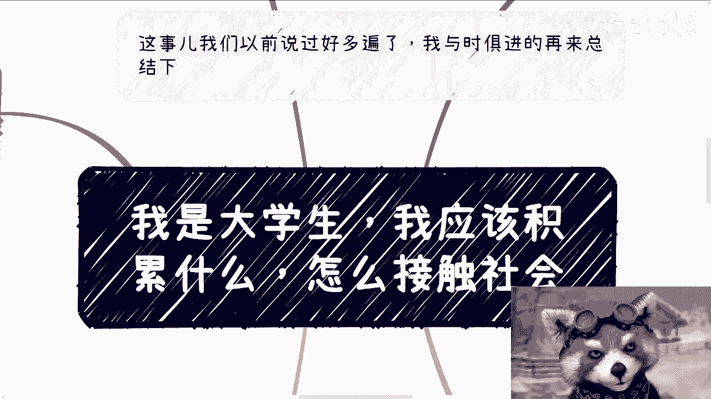
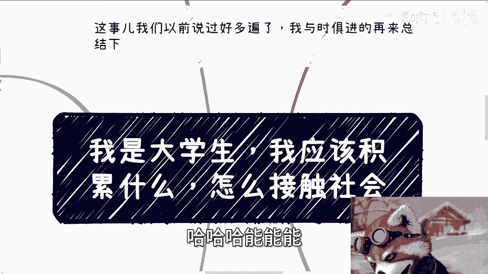
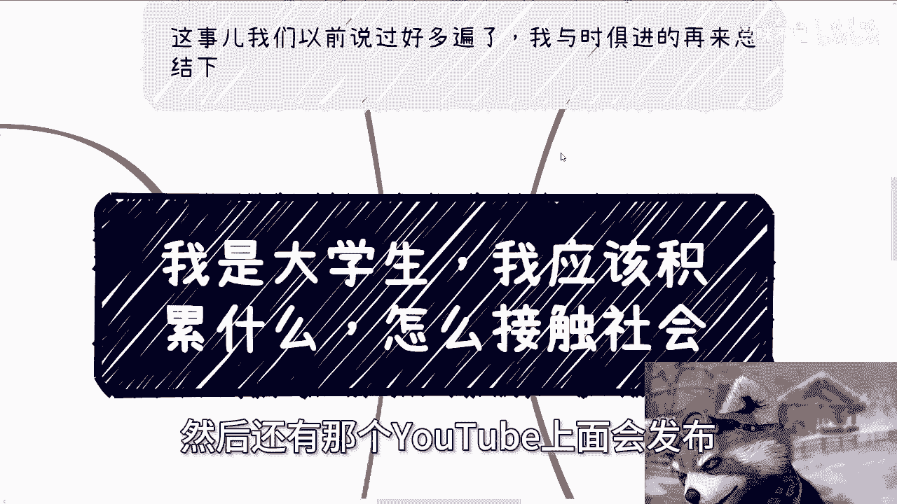
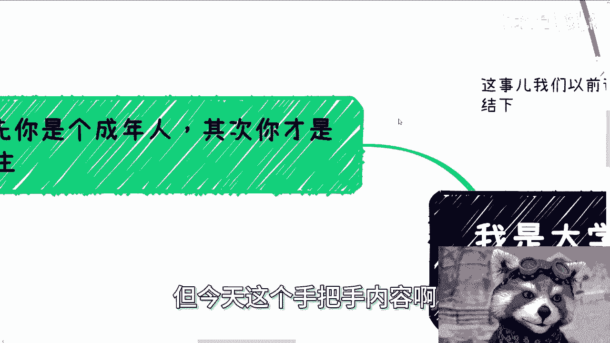
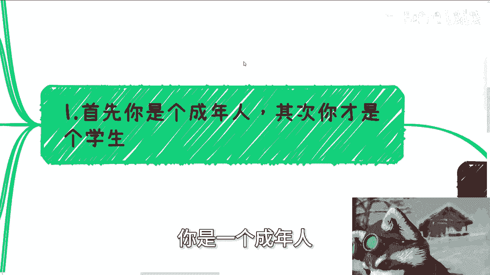
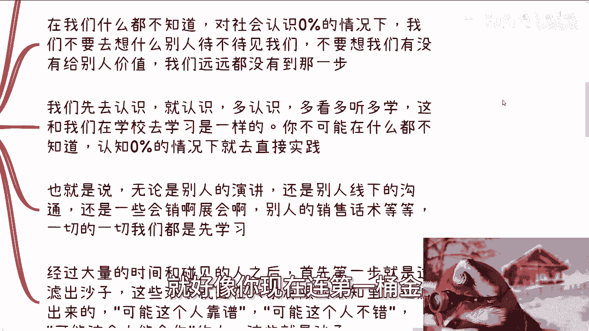
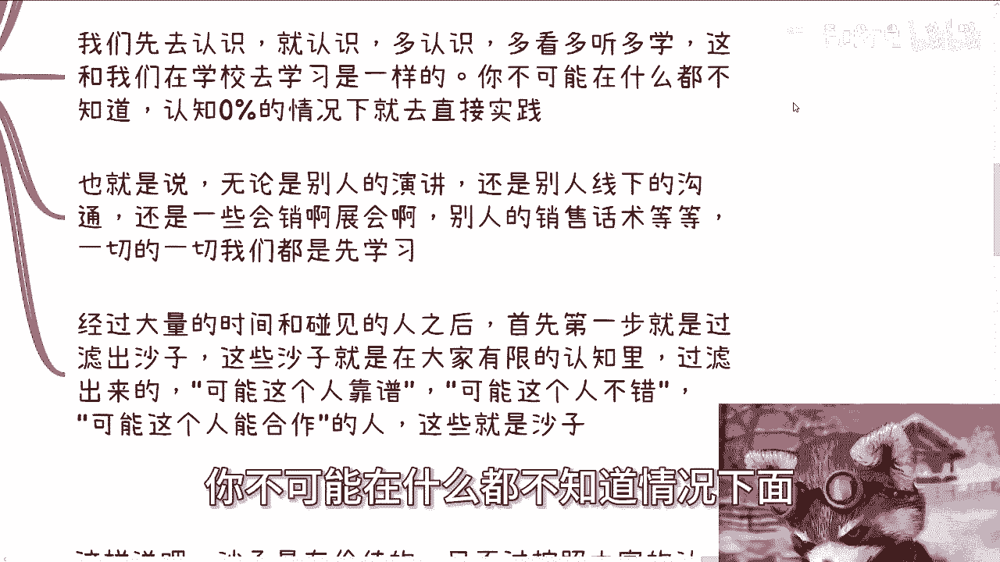
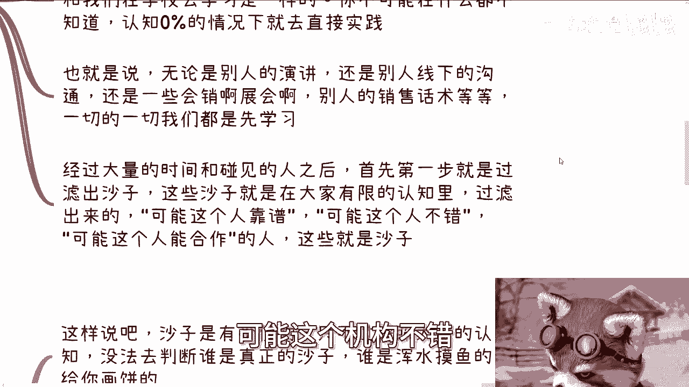
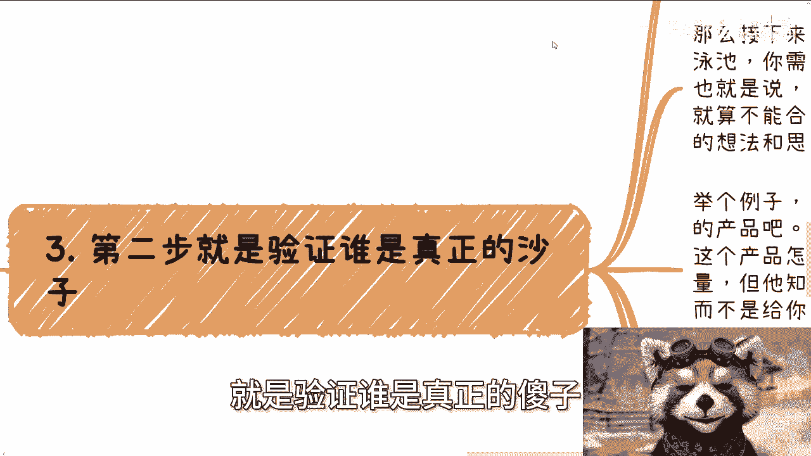
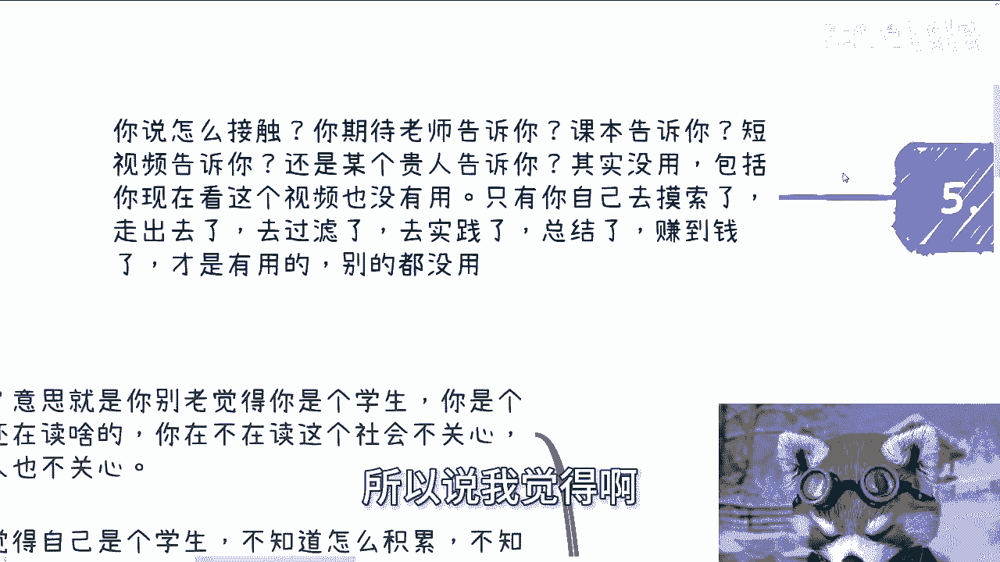

# ”我是大学生，我应该怎么接触社会“ - P1 - 赏味不足 - BV1Tr421b7jo

好大家好呵呵，然后拍了一整天，从下午到晚上，然后呢我也答应他们，因为今天拍的内容。

就是现在我给你们录的这个内容，你知道吗，然后我也答应他们，就说就是今天要把这个内容录掉吗，因为这样的话，你们到时候在网上看到，他们就是拍我的这个内容，跟今天的这个内容大家能对得起来对吧。

能能能能能验证这是真的内容啊。

呃然后他们说4月13号啊，4月13号会在他们的那个无线新闻TVB，然后还有那个YOUTUBE上面会发布好吧。

反正到时候看吧，我今天也是拍了一天了，今天哎呀好累啊啊，然后今天是这样子的啊，讲的这个内容呢是引用啊，评论区前两天他们写的就说我是大学生啊，问我我应该我应该积累什么啊。

我应该怎么接触社会，对吧啊，我跟你们讲，今天这个呢就是手把手内容，就有可能你们觉得这个主题以前好像讲过，但今天这个手把手内容啊。

就是首先啊我就告诉你们啊，你是一个成年人。

其次你才是个学生啊，什么意思，意思就是说你别老觉得啊，你说我是个学生，你是个学生，那么你学生又不刻你脑门上，对不对，这个有啥用呢对吧，你是个硕士，你是个博士，你是个在读的，然后呢没卵用啊对吧，你想想看。

你说你问我，你说陈老师，我应该去出去积累什么，我应该怎么走出去，你想想看啊，你作为一个成年人，你在社会层面，你是不是学生，或者你是不是在读，有谁关心吗，没人关心啊，为什么要关心你啊，你太把你当当个人了。

谁来关心你啊，对不对，那很多人觉得自己是个学生，不知道怎么积累啊，不知道能不能做，我告诉你啊，你要去积累关系，你要去做业务，你要去赚钱，社会上没有规定学生不能做对吧。

他可能更多的界限是说哦未成年人成年人对吧，不能呃，有些有些这个叫什么工种啊，或者有些合作，可能啊你不能跟未成年人，未成年人去签的或者怎么样，这是有的，但没有人规定说学生不能做，谁这么说过呢，对吧。

我我告诉你们，你成年之后世界就是个开放世界，你知道为什么大家会说啊，你这个这个生活就是叫做地球online对吧，就叫做地球呃，这个在线游戏，为什么为什么大家会觉得叫做在线网游对吧。

就是因为他就是个开放世界，你想做什么是要看你的对吧，你要觉得你是个学生，这不能做，那不能做，那就是你自己说，你自己怪谁呢，哦你自己舒服完你自己，然后你来问我，陈老师，我应该怎么去做，我的，我怎么知道呢。

对吧，然后很多人就要说了，他说哎我自己是个学生，主要是怕别人自己觉得自己年纪小啊，那你想想看，我就问你，你想想看你在一个社会上哦，因为你年纪小，所以大家不跟你合作，那按照你这逻辑，他妈的等你年纪大了。

大家就合作了是吗，你觉得这成立吗，不成立啊，对不对，这这这借口没有意义啊，人家你在社会上面看的是什么，看的是资源，看的是价值，看的是钱，你按照你们这个说法啊，等你年纪大了，我的出去就混得出来啦。

对不对啊，所以说这些东西没有意义啊，我觉得对于所有的学生来讲，只有两条路，就当下这环境我就告诉你们这两条路，而且到时候你们那个香港那个，我告诉你们香港那个采访出片，我对外我也是这个说法。

我在哪都这个说法，你知道吗，就是你这两条路，你要么就去接触社会，真正的了解社会，融入社会，去积累，去寻求，去创造自己在社会中的价值，这个价值就是自己能给别人带来赚钱机会，同时也要给你自己带来机会。

你要买就他妈的别去想这些，也不要想赚钱，你就去好好走好社会，给你规划的这根独木桥，就是本硕博吧，或者你就读书，你就你就打工，不要想别的有什么好讲的对吧，你但凡就是哦又要走独木桥，又要去想别的对吧。

又要在那边想说哎呀，我怎么好像不知道怎么去积累关系，怎么去在社会上生存或者怎么样的，那你就是既要呃那个既要又要结束了，对鱼与熊掌不可兼得，就这么简单啊，我跟你们讲，我每次看到有人问他说我是个学生。

我应该怎么接触社会，我他妈就非常的想喷，为什么唉，绑住你了啊，刀他妈在你脖子上了啊啊腿绑住了，对不对，谁管你呀，哦你说你没有方向，搞得好像我们毕业时候有方向一样的，谁毕业之后有方向啊。

社会上的方向不都他妈靠自己摸索出来的吗，啊靠谁啊对啊，然后我跟你们讲第一部叫什么叫广撒网啊，目的叫食人啊，什么意思啊，不是识人，不是吃人食人啊，我觉得啊所有大学生其实都应该接触社会，去接地气。

因为所有的大学生在没有毕业之前，本质上你们都是与这个社会脱节的，就这么简单啊，认对这个社会认知，我可以打保票，你们就是0%就这么简单啊，但接地气的过程其实就如同大海淘沙啊，然后再从沙子里面淘金子。

我跟你讲啊，那么所以说第一步是什么，先淘沙子哦，那么你想想啊，在我们什么都不知道情况下，面对社会认知就是0%的情况下面，我们不要去想别人待不待见，我们不要去想我们有没有给别人价值，我们远远没有这个资格。

我们远没有到这一步，就好像你现在连第一桶金就他妈没赚到。

然后就跟我说，张老师，我他妈我他妈就想赚大钱，我就想做大生意，我就他妈赚一个亿，有意味了，你做梦好了，做吧，没人管你是吧啊，我跟你讲啊，我们要的是什么，就是先去认识去认识，多认识，多看多听多学啊。

就是多跟我们，我跟你讲，这就跟我们在学校里面去学习是一样的，你不可能在什么都不知道的情况下。

认知0%的情况下就直接去实践对吧，这就像前两天咨询，我跟一个人说，我说你不可能9年制义务教育不读，然后高等教育教育，不然你比如说这个叫什么，就是呃高中不去读，你说我什么学都不上，我就他妈直接高考。

你行了吧，一样的道理啊，你不可能什么都不知道，然后你说爱陈老师，我我我现在就去实践了，就像我之前跟你们说创业一样的，他妈的连这些人连连社会怎么运作都不知道，创业怎么运作，也不知道融资怎么运运作。

也不知道创业对整个社会来讲，对对真正的创业之后的必经之之路怎么样，他也不知道，他说爱创始，我要去创业了，你创个对吧啊后面这个词出来就和谐对吧，这个有啥好抄的呢，对你做任何一件事情。

难道不是应该先去了解再做吗，而不是而不是说啊，我他妈什么都不知道，我就干了啊，那么也就是说什么意思呢，你去社会上面有非常多的地方可以，你可以去对吧，什么地方你不能去啊。

你去他妈人家把你赶出来赶出来赶出来了，怎么了呢，对不对啊，我跟你们讲，无论是别人的演讲，还是别人线下的沟通，还是一些会销展会，别人的销售话术对吧，你要你可以交钱进去，免费的，你就免费免费去蹭啊。

一切的一切你都要先学习啊，不是说你上来，你说你现在我什么都不知道，爱陈老师，我怎么跟别人沟通，你先去听听别人怎么沟通的对吧，你经过大量的时间跟碰见的人之后，首先第一步就是过滤出沙子，沙子。

这些沙子就是在大家有限的认知里面，过滤出来的，比如说你觉得可能这个人比较靠谱，可能这个人不错，可能这个人能合作，可能这个机构不错等等等。

那么这个就是你先过滤出来的沙子，这就是第一步，你懂吗啊不要判断靠不靠谱，你没有能力判断啊，他第二步是什么，就是验证谁是真正的傻子。

好，我跟你们讲啊，不要觉得沙子没有价值啊，沙子才是常态，精子才是少数对吧，好沙子是有价值的，为什么我跟你们讲啊，只不过按照你们的认知，没法去判断谁是真正的傻子，谁是浑水摸鱼的，给你画饼。

那么接下来你就要开始验证，怎么验证呢，所谓验证啊，就是前面有个游泳池，你需要跳进去游一遍，而不是站在旁边跟他他妈的瞎他妈扯对吧，那么也就是说，你需要去这些你过滤出来的沙子去合作，哪怕不能合作。

你要尽可能的去聊，去沟通，了解他们的想法和思维模式，举个例子啊，比如说有沙子跟你讲，我们一起合作AI的一个产品，对吧好，那么你就这么想啊，不管你现在能不能合作，你都要问他吧，比如说哎你说我们合作可以啊。

那你先问他，哎你说我可能是个小白啊，我可能不太懂啊，你就问他这个产品怎么变现呢对吧，那我们就说啊他可以没有资源，也没有流量，但是他可以给你一个方案吧对吧，他有他的想法，对不对好，那么他给出来他的逻辑。

你去判断他的逻辑同不同，或者说靠不靠谱对吧，那么他们但凡跟你说什么说哎我们做出来看看，我们做出来推广，看看我们做出来看看效果，这种他妈的就是屁话啊，这种就说丙有什么意义呢，你包括今天咨询也有人跟我说。

他说他说陈老师有人找我合作，我就问他钱哪里来呢对吧，怎么赚呢，他说哦那个人跟我说了，先试试看啊，试了，如果后面赚到钱了，我们在合伙对吧，这个他占股百分之多少，我说然后呢，这不他妈还是从本质来讲。

就是你被白嫖，从逻辑上来讲就是就是就是叫什么，就是丙哦哦你现在就开始做了啊，怎么赚钱，你不知道的钱从哪里来，你也不知道有没有人买，你也不知道就干了，你脑子有毛病吗，对吧，当然啊。

真正的合作和实践也是要的，毕竟这才是检验沙子是不是金子的过程，我跟你们这么说啊，大家要记住一点，无论你朋友，你同事，你眼里的大佬，你眼里的前辈，你的学长学姐，无论你现在觉得他多靠谱，多他妈的牛逼啊。

都是有很大概率，而且我可以告诉你，非常的概率，非常大的概率在合作当中是不靠谱的，而且非常的不靠谱啊，不要在你们真正赚过钱之前，不要在你们真正合作过之前去带滤镜，去觉得谁谁谁靠谱，没有用的，包括我一样的。

我就告诉你们，在我这一路过程当中，有非常多的人，我觉得拥有政治地位，拥拥有社会地位，我觉得比我牛逼，我觉得经验比我丰富，我甚至觉得他的吃吃过的盐，比我吃过的饭都要多，然后呢，只要我跟他一合作。

我只要跟他真正去做项目，我就觉得妈的对方是个，就这么简单啊，我告诉你们，我们通过沟通跟合作，其实为了过滤掉那些没有实战经验的，纸上谈兵的同时，思维逻辑，商业逻辑混乱的人啊，那么很多时候我跟你讲。

你只要多问几个，为什么你基本上就知道对面是不是一个水货了，你知道吗，你多问几个，为什么，尤其是跟钱有关的对吧，你是的话，如果你你基本判定下来，这个人没有经验，这个人就是纸上谈兵，你就换下一个，我跟你讲。

这就是你的必经之路，你没有别的路可以选好，第三步就是选出所谓的精子好，就像我们刚刚说的，沙子是有价值的，那么什么叫精子，我告诉你们，金子是相对的，比如说对我来讲是金子，对你来讲就不是。

那对他来讲可能又是为什么啊，什么叫金子，金子就是他有能力，他有逻辑，他也有资源，他也赚多少钱，但是最重要的是什么，是他愿意跟你合作，就这么简单对吧，同时你们还完整的合作过，同时还赚到钱，这个他就是金子。

但是同样的这个精子是薛定谔的，为什么，因为很简单啊，我给你们举个例子，就好像你们现在找我合作，我都是拒绝的，为什么，因为我们没什么好合作的啊，我也觉得你们给不了我，太多的政府和企业的资源，做C端。

我我不愿意跟任何人合作，也没啥好做的，但是并不代表你们没未来，没有啊，你们以后成长了，你们以后就是也变成了一个很牛逼的一个人，对吧，那么到时候哎可以没问题，对不对，所以说很多的时候能不能合作。

它是一个它是根据你们不同的时间点，不同的窗口，不同的社会环境去给出来的，而不是说啊，你觉得这个人不能合作好了以后就不能合作了，没有的，没有永远的敌人，也没有永远的朋友，一样的道理啊。

那么我们需要通过无数的第一步，那你们你们忘记了，可以再翻回去看一下第一步啊，我们需要通过无数的第一步，然后通过无数的第二步，你才有可能有办法筛选出个位数的镜子，你知道吗，因为本来这种金子就很少。

你要能遇见，你要能判断，同时你还要能合作这种，哪怕你沙子的基数很大，比如说你有几千粒沙子，过滤出来的也很少，为什么，因为这就是社会的现状啊，我不好意思，因为你是个普通人，那么在我看来。

如果你现在还是个学生，你基本上还有很多的时间去过滤，你有时间窗口，你有机会啊，但是如果你已经毕业了，那么我就要告诉你，你就必须抓紧时间啊，你就必须抓紧时间，那么呃呃呃因为这个过程我跟你们讲没有捷径。

你不要搞得好像就觉得哎我20多岁，是不是会花更多的时间，我年纪大一点的，是不是我会花少一点时间没有的，为什么，因为你是个普通人啊，很不幸，大部分人都是普通人，对不对，而在现在越来越往后卷的一个情况下。

面我说的那些精子我早就跟你们讲过了，去年3月份就跟你们讲过了，那些精子，其实越来越不愿意跟外界不熟悉的人合作，为什么，因为这些精子比任何人都知道，现在形势很严峻，一方面这些人他精力有限，一天就24小时。

另外一方面，就是他没有之前整个形势这么好的情况下面，他这么有拥有这么轻松开放的心态，对待我之前说的那些混在象牙塔里面的人，没有这个兴趣爱好，谁都不是菩萨，谁都不是来普度众生的，对不对啊。

好那么最后我们回到问题本身，你问我要什么接触，你期待点什么呢，你期待老师告诉你，还期待课本告诉你，还是短视频告诉你，还是某个贵人告诉你，没有用的呀，你期待这些东西就跟我明天去买张彩票。

期待他中奖是一样的，有意义吗，对不对啊，包括就像你现在看这个视频也没有用，我说过无数遍，只有你自己去摸索了，走出去的，去过滤了，去实践呢，去总结了，去赚到钱了，这才是有用的，别的都没有用。

所以说我觉得啊就是大家真正要做的是什么。

就是把你们所受到的所有的想法，所有的恐惧全部抛开，这些东西没有用对吧，没有用，你想这么多有用吗，没有用，你要的就是朝着这个目标往前走，滚出第一个雪球，滚出第一桶金，结束后面再说，别的都没用对吧。

你但凡抱有这种就是说啊不不够狠，不够断舍离啊，同时呢又优柔寡断啊，同时呢又又又就是说很多学生思维对吧，想着这个想着那个，然后哦然后还要不停地向外去伸，手，党说哎那我怎么走出去啊，我怎么了解更多。

你不要走，你不用想为什么。

因为很简单，什么叫社会发展，什么叫社会固有的本质，社会固有的本质就是，55%的人掌握了，5%的95的财富，95%的人掌握了5%的财富，然后其中我们如果按照八二开来讲的话，我觉得80%以上。

90%以上的人都是，就这么简单，为什么，因为社会就这个样子，你怎么办呢，对不对哦，你你跟我说，不是的，不是这样子的，那不是这样子，为什么人类社会发展到今天会这样子呢，一样的呀，没有没毛病的呀。

这就是社会本质，对不对，所以说如果你们那你你也好，你们身边的人也好，还在想这个问题，说哎那陈老师，那按照你这个说法啊，那大部分人如果都这个走出去的话，那这个不是就没有可能，80%到95%的人都吗。

是的呀，那我就问你啊，你是你别人是别人，别人关你吊事儿啊啊你有空考虑这个问题，你有空考虑这个问题，我就告诉你，你就是那80%到95%的，怎么办呢，没办法的呀，人就这么一个生物怎么办呢。

你要么就想明白去干，你要么就永远纠结，然后等你稍微年纪大一点之后，只能随波逐流，这不就是人吗，这不就是普通人吗，对不对啊，好行吧，就这么着吧啊嗯OK好吧，然后就是说职业规划啊，商业规划啊。

然后那个呃呃融资啊，股权啊，包括你们比如说最近碰到了哪些呃项目啊，碰到一些案例，你们觉得啊这个不清楚的，或者说你们是要合作的啊，摸不准的，你们可以找我咨询好吧，然后你们手上现在做什么专业啊对吧。

你们你们手上有什么牌啊对吧，你们你们觉得有哪些路可以走啊，你们希望通过我的视角哦，给你们整理出更好的一些方向啊，或者更好的一些步骤，那么你们可以也可以整理好啊，再来再来找我咨询好吧。

