# ”真诚就是最大的武器“，骗骗别人就好了，别自己骗自己了 - P1 - 赏味不足 - BV14u4y1j7tL

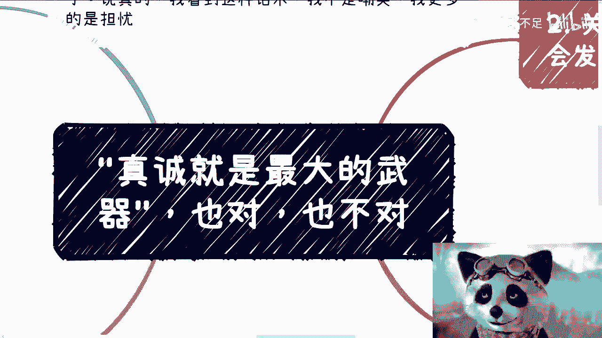

哈喽大家好，今天嗯还是礼拜一，还是礼拜一晚上有几个咨询哦。

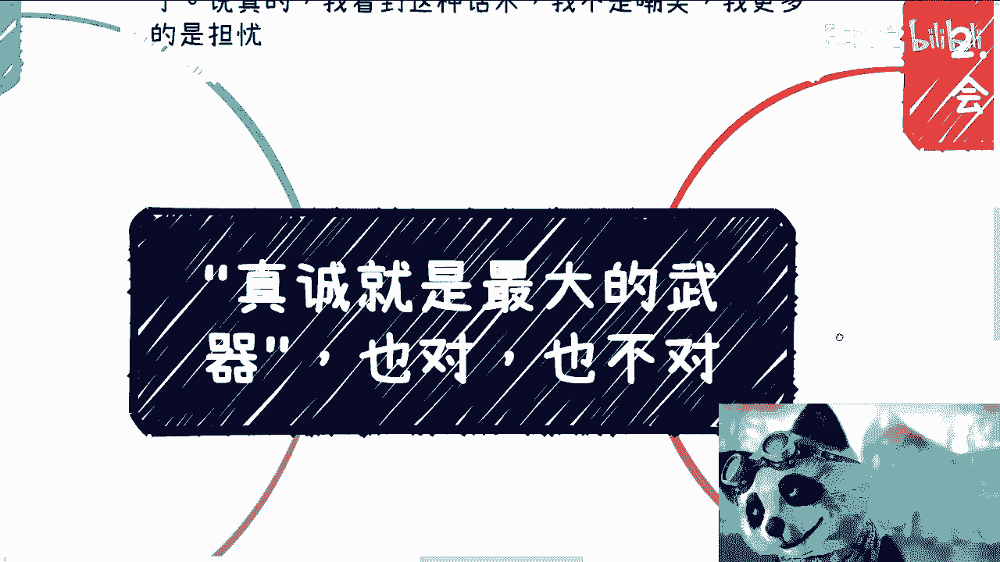

我在咨询之前呢，反正闲着也闲着，呃我给大家补一下啊。

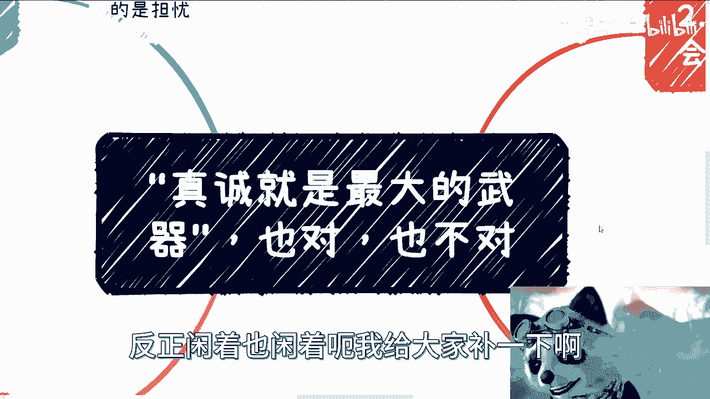

呃关于这个问题，这个问题我实在是也是就忍了很长时间了。

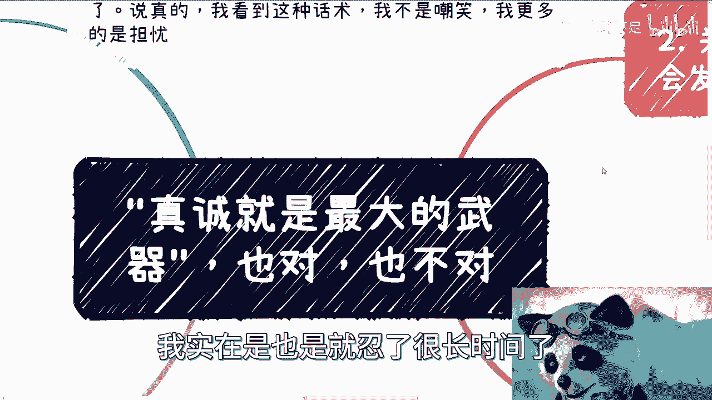

我想想还是原来讲一下，首先啊我经常在评论区看到这句话，而且有很多人呢你跟他讲了还没用啊，还认这个死理儿啊，就是说这个这个真诚啊，我就很真诚对吧，我就是最大的武器啊，呃问心无愧就好对吧。

说真的我看到这种话术呢，呃我倒不是说嘲笑他啊。

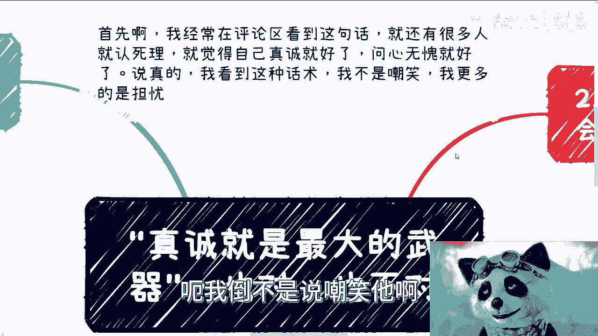

我更多的是一种担忧啊。

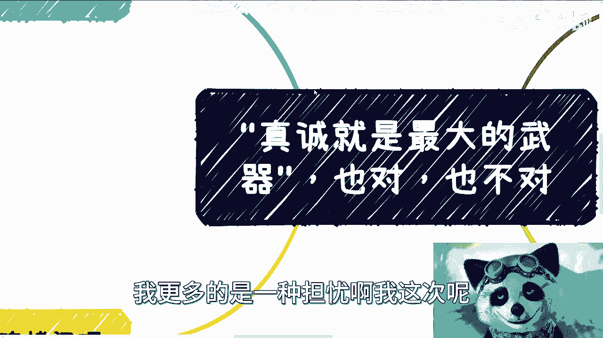

我这次呢反过来说啊，首先我们先来灵魂拷问啊，先来灵魂拷问，首先第一点，你怎么定义真诚，你觉得你很真诚，OK啊，没问题啊，我觉得你不真诚啊，对不对，然后你的合作方觉得你不真诚啊，然后呢你怎么定呢，对不对。

就who care对吧，就谁来关心这件事情，其实没有人关心，说白了你觉得你很真诚，只不过是一场自我感动而已对吧，这是第一点，第二点，如果你今天合作一个人是很不真诚的，但直接给你钱，一个很真诚。

但根本赚不到钱，我就问你选哪个嘛，对不对，我不去切实际一点吗对吧，但如果我们今天合作一个呢，很不真诚，让人觉得很不舒服，但是呢有社会地位，有社会资源啊，另外一个很真诚，但什么都没有，屁都没有对吧。

你选一个，你选个我看看对吧，所以说啊我觉得是这样子的，其实很多时候呢鸡汤是给别人喝的啊，你千万别一直PUA自己啊，你今天哪，那我跟你们说直白一点，你们今天拿着这个鸡汤去赚别人的钱，去收割别人。

我都支持对吧，这个是你们的本事，但是呢你千万别一直PUA自己，在你在自己难过的时候，在你低谷的时候，你可以拿出来安慰你自己，我觉得OK，但是呢你不要日常拿出来去买，麻痹自己对吧，毕竟你要明白。

我们是围着社会转，社会不是围着我们转的啊，你最终真不真诚，能不能赚到钱，别人能不能跟你合作。

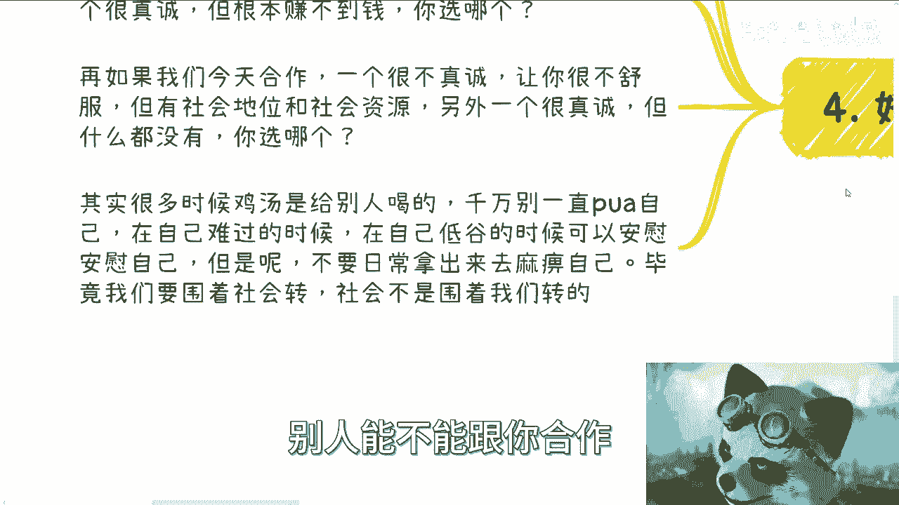

这个也是别人说了算的啊，不是你说了算的好，那么我们回过来啊。

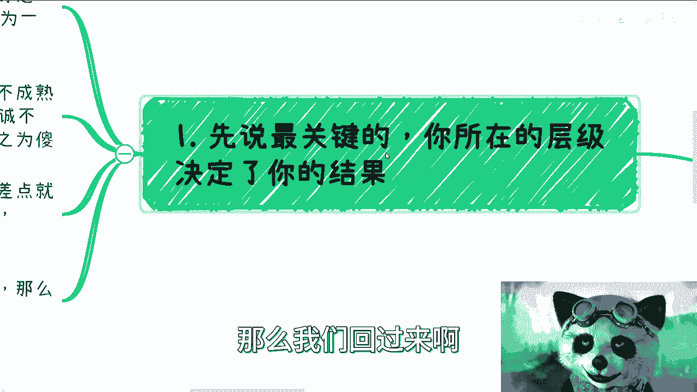

先说第一个，先说最关键的，你所在的层级，我跟你讲，决定了你的结果，很多人我不关心啊，很多人说呢，他说我不关心别人的眼光啊，我就是问心无愧，我就很真诚，就是合作最大的武器对吧，这话对不对啊，那我就告诉你。

不好意思，这话嗯呐我今天就这么讲，这话你越往上层级说，他越怼啊，但是在大部分人所处的label里面，这个话就跟你作为一只羊跟一只狼去说来吃，我是一个道理，没有意义的，为什么。

因为在底层的过家家的合作当中啊，我们根本估计还不能称之为商业合作啊，就是底层的这种过家家的合作当中，大家其实都是不成熟的，而自私就是人性刻在DNA里面的啊，就说难听点，你今天越是在底层下面去合作。

越不会有人来关心你，真诚不就是who care啊，我说了who care，对不对，还是那句话，你觉得你很真诚，不好意思，别人称之为叫傻啊傻啊，那么你真成最后的结果最多呢，呃有的最差就是好一点呢。

我觉得是要被白嫖，再差一点就被骗点钱，再差一点呢可能亏大钱对吧，再差一点的你可能就进去了，对不对，你真诚好了，谁关心谁关心我就问我，我就说不好听点，除了你爸妈，除了你，可能你你你这个爱人对吧。

谁谁看谁关心啊，早就说了啊，如果真诚能够成功或者打动别人，那么我就告诉你啊，这个不好意思，这世界上比你真诚的生物多了去了，轮不到你真诚啊。

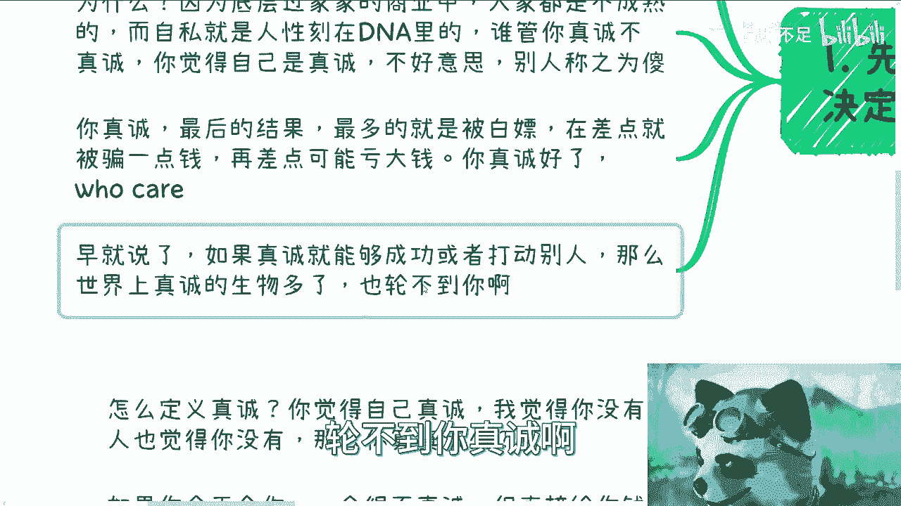

就是就我觉得怎么说呢，就是这个话呃，你要是跟一些小朋友去讲啊，我就算了对吧，那你说咱这个B站上的用户也好，或者我觉得怎么样也好。

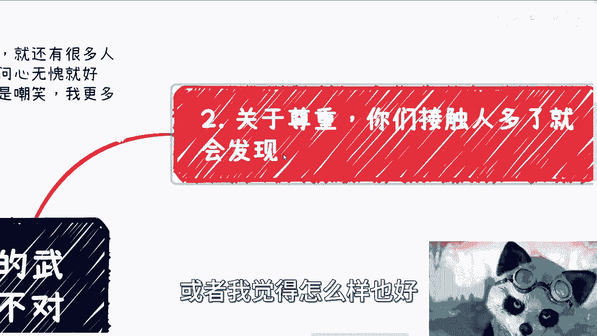

怎么地都是成年人吧对吧，你作为一个成年人，你还是相信这种鬼话，我实在是真的啊。

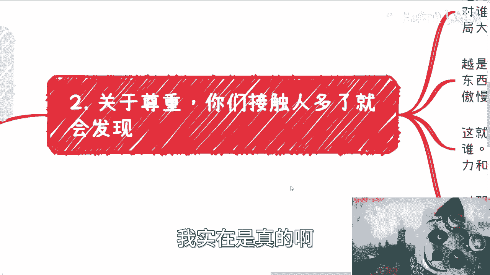

那么关于尊重，关于第一点啊，关于尊重，我们接触的人多了，你就会发现越是那些高级别的啊，越是那些真正拥有自己有能力的人，他通过自己的打拼，所争取到当下的能力和地位的时候，我就我就跟你们讲，无论他们对谁。

他都会有最起码的尊重，为什么，因为他们的格局很大，他们知道自己是谁，知道对方是谁，他也知道自己无论到达什么样的一个高度，无论赚多少钱，他都能明白自己也是个人，对方也是个人对吧。

而且反而你会发现那些半瓶子酱油晃的，而或者依靠别人，或者依靠自己家庭所积累出来的一些财富，所走到今天，或者来说积累出来的这些地位，走到今天，那些人他往往喜欢鼻孔看人对吧。

你会你很容易就能发现他们的傲慢和不屑啊，那么这就是我们说的层级跟圈子，就是说你真诚是可以的，但是你要看对谁对吧，你越是对上面人来讲，他越能理解你的真诚，他也能就是能够能够，最大程度的去接受你的真诚啊。

但是本身真诚也不是最关键的，因为你有没有能力跟有没有赚钱的头脑啊，以及你有没有相关的资源，这才是才是最关键的，那对于那些过家家的圈子人来讲，你会发现，大家越是喜欢相互攻击以及相互看不起。

而且永远他们的行为非常幼稚，其纠结的点也永远是那些有的美的，鸡毛蒜皮的事情啊，所以说我们来说关于真诚对吧，你也要需要别人买单，对，就像我们说的，你要明白，越聪明越上面的人，他们的人他们见过的人多了。

你真不真诚，其实一眼就能看得出来，你装也没有用，你不装也没有用对吧，他自然都会接受啊，那么第二点你真诚也会有相应的回报，就比如说这次你没有合作成功，那么以后也会合作，所以很多时候我一直跟你们讲的。

我说要脱离低级战争，脱离低级的这些圈子，脱离过家家的合作跟商业，你别老是跟那些乌合之众合作对吧，因为这样的话你只会原地原地踏步，不进则退。

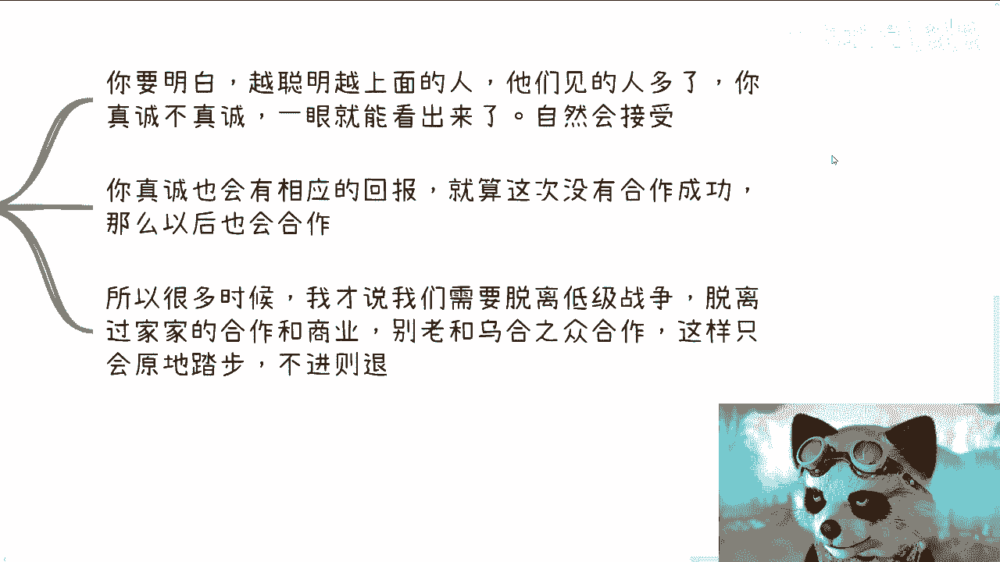

哦所以说。

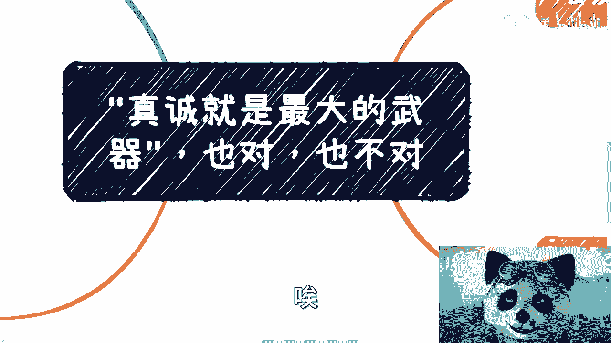

啊所以说呢就是我觉得这个问题呢，其实你们把真诚这两个字可以刨掉，替换成别的任何一个词，比如说努力就是我最大最大的武器，对不对，或者说跪舔就是我最大的武器对吧，或者怎么样子，其实还是那句话。

这句话本身对不对，是对的啊，但是你要看你处于什么样的一个世界，你处于怎么样的一个社会，处于怎么样的一个层级里面，你说怎么去对对吧，就像我们就随便说，你说真诚也好，努力也好，跪舔也好对吧，或者怎么样也好。

你要明白这些东西有没有用有用，但是你更多的是对于那些，要么就是跟你一样真诚，或者用我的话来讲，就跟你一样傻的人对吧，那大家可以去做，但是问题是你们这种就同样傻的话，你们能做出什么来，对不对。

大家的目的是什么，大家目的不是每天傻乐傻乐，一起傻着乐吧，大家目的是说唉那当然就看每个人选择对吧，你就像我来讲，我觉得活一次的目的就是，你得了解到更多很核心的东西对吧，看到更核心的。

看到更多和自己没有看到过的东西，接触到自己没有接触过的人对吧，去海纳百川才是我们要去做的，但问题是你越是想接触到更高的人，你越是想去了解了更多的东西，你不是单靠真诚，不是单靠努力，不是单靠跪舔就有用的。

你知道吗，就是很多时候你一旦上了一个阶层，你一旦上了一个圈子，你就会发现这些东西都是bullshit，为什么，因为太幼稚，这根本没人关心你，越是往上走，你越是去跟别人，希望就是积累出更好的那种关系链。

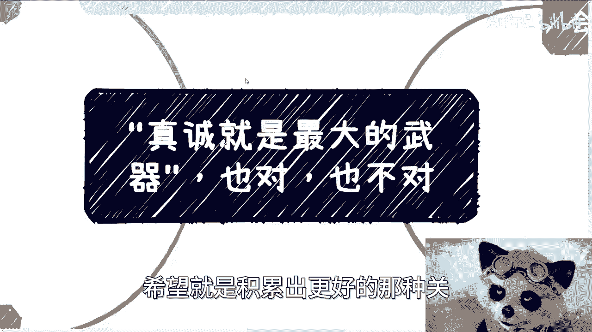

或者怎么样，人家越是入股的，为什么。

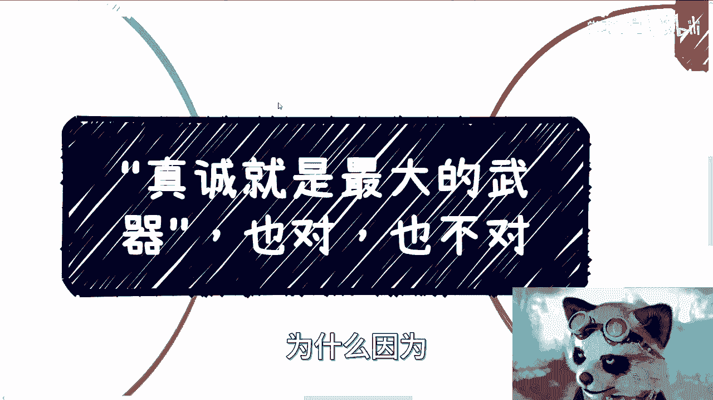

因为人家没有时间来跟你搞这些，有的没的对吧，你就像你们现在有些人咨询完我之后，加过我微信了，对不对，开始问我问题，你看我是怎么回的，我我我就在这边直接告诉你们我是怎么回的，要么我就不回对吧。

要么回来一段时间之后，我就会告诉他，请你们以后只要赚钱时间再来问，我不赚钱了，咱就不要讨论了，为什么我不想回啊，没有意义啊，对不对对吧，包括就是你说前两天还有还有一个小伙伴，他说太贵了太贵了。

那我说我说也行啊，那我说加都加了，那你就随便，然后他那个问题比较简单，其实那个问题根本就聊不了，你不要说一个小时了，10分钟都聊不了对吧，那我就说你列列了之后，我就跟你讲对吧，因为我也跟他说了。

我说你就这么想，咱们的目的，你是来问问题的，我呢是希望给大家解决，没问题了对吧，那当然我能不能解决，我尽力而不能解决，我也没办法对吧，但是不是说你今天啊就是我是差你这个红包。

还是说我是差你这500块钱对吧，这个倒不是重点，所以说你要明白，就是说你要去做一件事情对吧，你说我今天呃自己到底怎么样怎么样，你越是接触到那些真正的，因为你从我角度来讲，我没有社会地位。

我也没有什么什么什么叫什么政治地位对吧，但是你们要明白，你们真的去碰到那些社会地位和政治地位的人，那更不会有这种屁话了对吧，而且我们只关心的是你对我有没有价值，没有，那OK滚啊，下一个对吧。

没有好滚下一个就这样子的，因为哎呀，因为就像我跟你们讲了，你们但凡以后人接触多了，你就会发现，其实你可能会知道你身边很多的人，他们每天都在布局，他们每天都在赚钱，他们每天都在都在非常努力的去做事情。

包括你说我今天跟美国那边的小伙伴聊了一下，就藤校出来的啊等等等，然后大家聊你会发现越是这样的人，他比你越努力，你会不焦虑吗，但是你的这种焦虑要正向哦，不是那种就是说每天啊自己在那边想，哎呀我好焦虑啊。

对吧哎呀我的赚不到钱是吧，哎干嘛干嘛干嘛对吧，就不是这种啊，也不是那种，就是说啊这个今天我去做一个做一个业务啊，这个业务比如说一个人就给我转300，一个人赚400，你可以转，没问题。

但是你考虑一定要往大的格局上去想，你一定要往那种高性价比的上面去想，你想不出来没关系，你就去聊，你就找人去聊，你就去了解，你要往这上面去突破，那否则都会没有用的，所有的东西你会发现。

就是咱们最终是不是PUA自己，是不是说你这个鸡汤给别人喝，怎么这不重要，等你年纪稍微大一点了，你会发现所有的结果都是你自己承担的，没有区别的，跟别人又没关系，好吧哎呀嗯行吧行吧。

那反正我希望你们能明白这个道理吧，好吧。

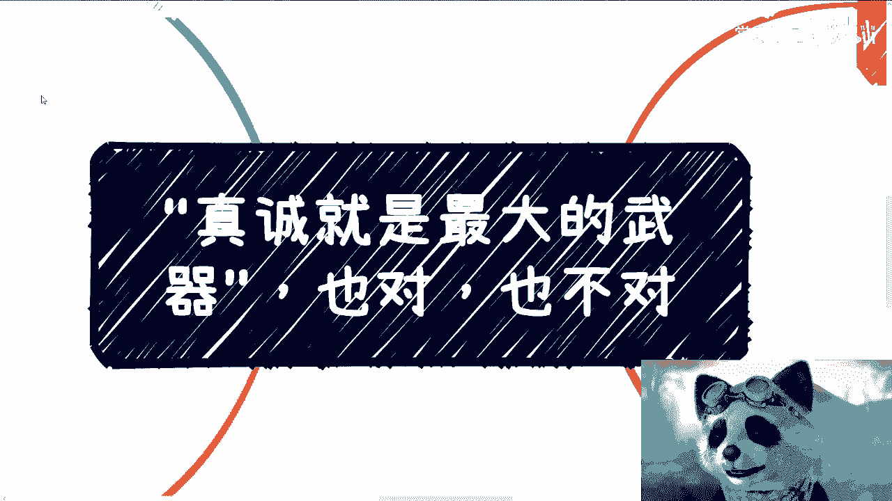

这个事情也是一样的，在职场上在哪里都是一样的，不要就是就是核心，就是这一点，就是说你给别人和没关系，你不要自己骗自己哦，还骗得很真好吧行吧。

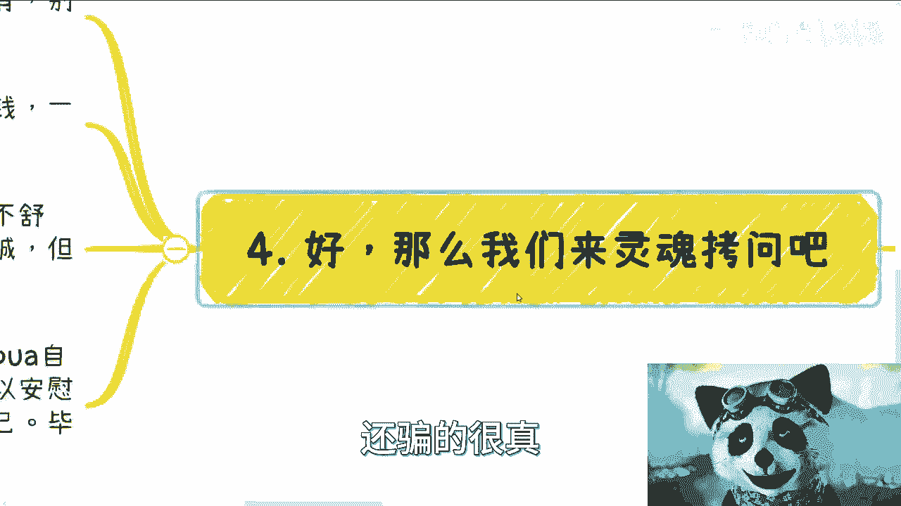