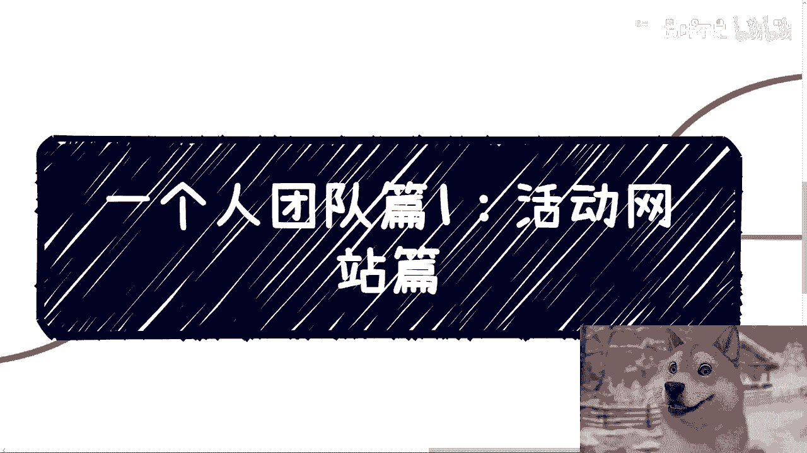

# 课程一：活动网站搭建教程 🎯

在本节课中，我们将学习如何从零开始，使用第三方平台快速搭建一个专业、正规的活动报名网站。我们将以“百格活动”平台为例，详细拆解从创建活动到发布网站的全过程。通过学习，你将能够独立完成活动信息配置、网站美化、票务设置等核心操作。

---

## 活动网站平台选择

上一节我们明确了学习目标，本节中我们来看看搭建网站的第一步：选择平台。

我选择使用“活动行”和“百格活动”这两个平台。主要原因是这两个平台我已使用多年，功能成熟稳定。近十年来，市场上并未出现明显更优的替代品。

其他平台，例如某些微信小程序，虽然也有推广功能，但不在本次讨论范围。需要注意的是，这两个平台目前都已开始收费。“活动行”需要支付每年300元的实名认证年费，“百格活动”则采用阶梯价格，不同功能对应不同费用。

本次演示以“百格活动”为例，因为其网站编辑功能更为直观易用。使用专业平台能让你呈现给参与者的报名页面更正规，避免使用Word文档或图片等不专业的报名方式。同时，它能帮你省去购买域名、服务器备案、配置第三方支付和发票系统等一系列复杂工作。

---

## 基础活动信息配置

选择了平台后，我们开始配置最核心的活动信息。以下是需要填写的基础信息项：

*   **活动名称**：为你的活动起一个清晰的名称。
*   **活动时间**：设置活动的开始与结束时间。
*   **活动地点**：填写具体的城市和详细地址。
*   **主办方信息**：包括主办方名称、联系电话、邮箱、官方网站和介绍。
*   **活动类型**：从平台提供的选项中选择合适的分类。
*   **活动海报**：上传符合平台建议尺寸（如1080x640像素）的宣传海报。海报设计可以使用其他工具完成。
*   **活动详情**：详细描述活动内容、流程、亮点等。这部分文字可以借鉴或撰写。
*   **活动标签**：添加与活动主题相关的关键词，便于搜索和分类，例如“数字经济”、“低空经济”。

这些基础信息的配置相对简单，按照提示填写即可。

---

## 网站设计与模块编辑

基础信息填好后，一个简单的活动页面就生成了。但要让网站更美观、功能更完整，我们需要进入“网站设计”环节进行深度编辑。

平台会为你的活动生成一个专属网址，你可以随时预览。在“网站设计”中，最重要的两个部分是选择模板和编辑模块。

**1. 网站模板**
模板决定了网站的整体风格和布局。选择不同的模板，首页样式、详情页、票务区和嘉宾展示区等都会发生全局变化。你可以根据活动调性选择最合适的模板。

**2. 模块编辑**
以下是网站中可编辑的核心模块列表：

*   **背景设置**：可以更换或上传网站的背景图。
*   **活动详情**：对之前填写的活动介绍文字进行再次编辑和排版。
*   **活动门票**：这是关键模块。你可以设置票种（如免费票、付费票）、价格、库存，并选择门票在页面上的显示样式（如列表式、卡片式）。
*   **活动嘉宾**：需要逐一添加嘉宾信息，包括姓名、头衔、头像、简介、公司等。添加后的嘉宾会存入“嘉宾库”，方便在其他模块（如议程）中关联调用。此模块也提供多种布局样式供选择。
*   **活动议程**：此部分编辑较为繁琐，需要逐条添加每个时段的活动安排，包括起止时间、主题、是否关联嘉宾或主持人、内容标签等。平台支持添加多个分会场，适合复杂的大会议程。
*   **合作方展示**：你可以自定义模块名称，如“联合主办”、“协办单位”、“合作媒体”等，并添加相应的Logo或信息。
*   **其他模块**：平台还提供如“找回电子票”、“查看参会信息”等实用功能模块，可根据需要添加。

所有模块编辑完成后，务必在“预览”功能中分别检查网页端和移动端的显示效果，确保体验良好。

---

## 活动发布与分享

网站设计满意后，就可以进行最后一步：发布与分享。

在发布页面，平台会生成最终的活动网站链接。你可以通过以下方式分享活动：

*   **活动网站链接**：直接复制链接发送。
*   **网站二维码**：生成并下载网站的二维码，用于海报或线上宣传。
*   **小程序二维码**：平台也提供对应的小程序码，方便微信内传播。

在票务设置中，你可以选择“价格票”或“审核票”（即报名后需主办方审核通过）。一切就绪后，点击发布，你的专业活动报名网站就正式上线了。

---

## 总结与预告

本节课中，我们一起学习了如何利用“百格活动”这类第三方平台，高效搭建一个专业的活动网站。核心步骤包括：选择平台、配置基础信息、通过模板和模块编辑美化网站、最后发布并分享。

整个过程的关键在于**模块化的编辑思维**，将活动拆解为信息、票务、嘉宾、议程等部分逐一处理。掌握这个方法后，你就能快速为任何活动创建一个正规、便捷的线上报名门户。

下节课，我们将探讨活动宣传中另一个重要元素：宣传海报的快速制作方法与工具推荐。