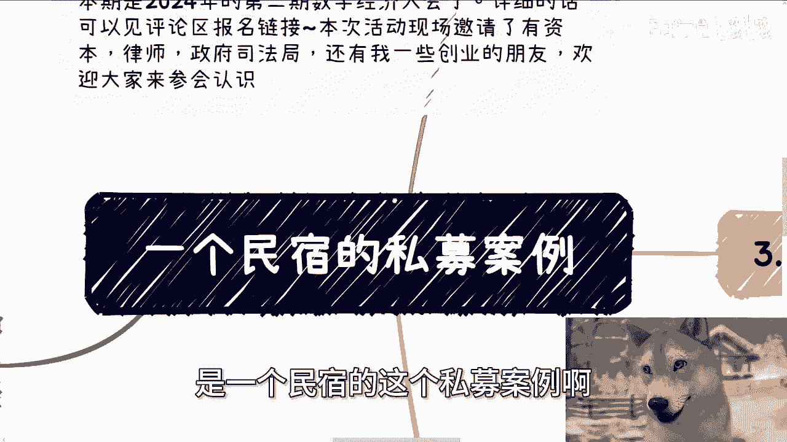
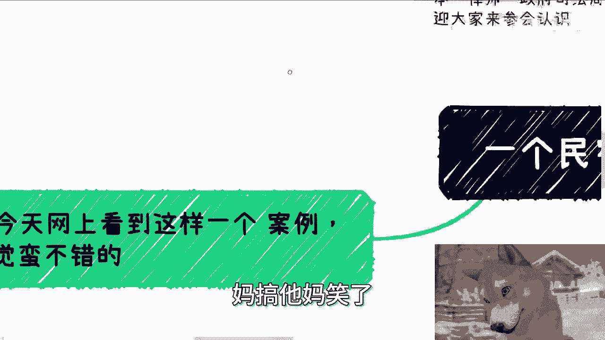
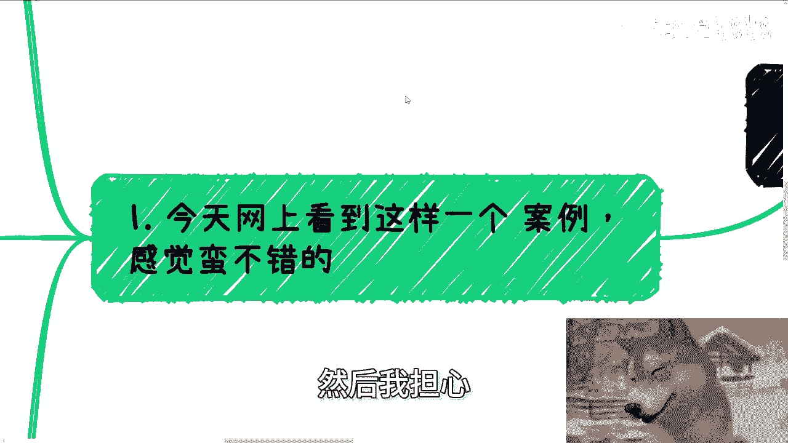
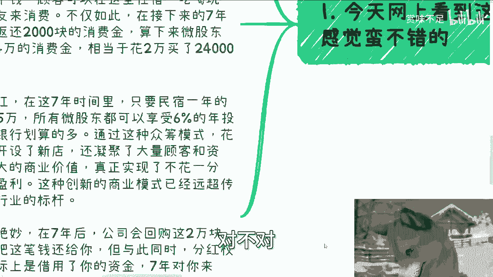
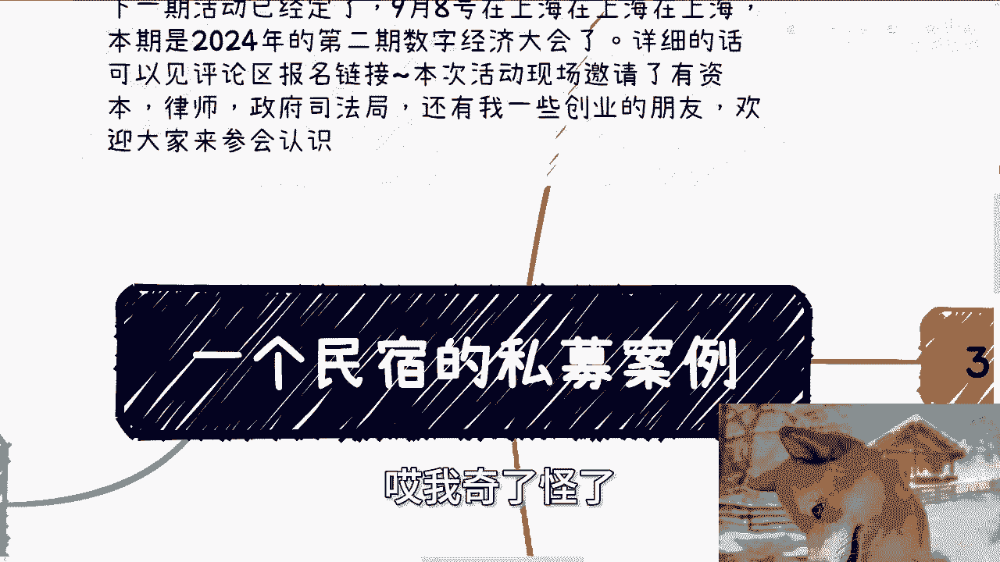
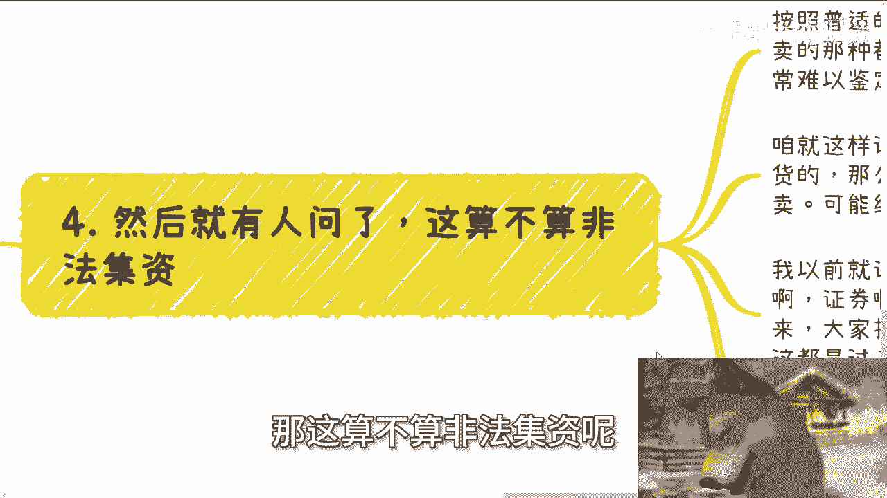

# 一个民宿的私募集资案例 - P1 - 赏味不足 - BV1rJH1eVE9r

好啊，那个我们继续来讲今天的这个第二个主题啊，是一个民宿的这个私募案例啊。

因为今天在网上正好看到这个案例，我觉得蛮不错的啊，拿出来之后跟大家分享分享啊，然后呢这个活动好吧，先说一下这个活动啊，活动已经定了。

下个呃就这个月呃，就这周啊，这周日礼拜天8号在上海好吧，本期是2024年的第二期数字经济大会啊，详细的话可以进评论区报名链接呃，逸晨跟嘉宾都在里面了好吧，然后本次的话呢也邀请了资本律师啊。

欢迎大家来参会，多认识认识啊，呃然后呢刚刚他妈的发生了一个事啊，也他妈的让我笑，笑到了，就跟我有一个怎么说呢，牛马啊，然后呢要未来做这个社会的电池的啊，然后就是呃我大概看了一下。

就从头到尾啊没有任何对这个社会对，对这个国家没有任何认知，跟我说他追求完美哈，我就那句话啊，可怜之人必有可恨之处，你对于任何东西没有任何的了解，就他妈追求完美，追求个屁完美啊，啊我跟你们这么说。

很多人现在很苦很惨，很他妈的造孽，是他妈自己造出来的，懂吗啊，你不要怪别人都是自己造出来的，的屁都不懂，就他妈追求完美。

在那边说哎呀，我就因为自己追求完美，追求个屁，追求妈搞他妈笑了。

真的是啊，呃然后今天说的这个案例啊，然后我担心因为有小伙伴可能不看的。

就是那种呃听的方式，所以我就顺便读一下啊，他说什么故事呢，说那个酱那个浙江哦有一个民宿老板很奇葩啊，开店时候自己不花一分钱，全靠客户出钱啊，最牛的是4000位顾客争先恐后的给他送钱，送资源，帮他开民宿。

还生怕去晚了，没机会啊，他在短短10分钟以里面呢筹集了400万啊，彻底颠覆了传统民宿行业，这个逻辑，就跟我一直跟你们传达的逻辑是一样的，就是你要去做事情，你问别人要钱啊，的谁他妈自己出钱啊。

脑残自己出钱，对不对啊，然后呢，以空手套白狼的方式在全国开了100家店啊，他的众筹玩法远远超越同行，吸金能力更是超越了99%的民宿，值得各行业老板学习啊，等等等等等啊。

那么他说花间堂呢打算在香格里拉开新店，但他没有自己投资，而是在京东私募平台上面发起了众筹计划啊，顾客只需要交2万块钱，就可以成为民宿的微股东啊，那么他们能享受什么权益呢，对吧啊，你看这个逻辑。

这个模式跟很多模式非常的像啊，首先你交2万块钱是什么，是产品价值，在两个月内他会返还1万块钱的消费金，消费金啊，消费金不是现金，就是消费券对吧，拿着这个钱呢，客户可以在这里住宿，吃喝玩乐。

带家人朋友来消费啊，不仅如此，在接下来的7年里面，他每年在返还2000块钱的消费金，算下来，微股东总共能拿到2。4万的消费金，相当于花2万块钱买了两点斯曼的产品，你看到没有。

但是这个当中有个很大的问题是什么，就是就跟我刚刚那个视频，跟你们讲的逻辑是一样的，就是你今天花钱，人家说，比如说你你今天培训对吧，找到工作我全额退款，对不对好，但是真正最后找到工作有多少人。

就像这个地方，你花2万块钱买买2。4万的消费金，问题是第一一你为什么要买，第二你买了之后一定能消费掉吗，对不对，第三这个2。4万这个东西，不还是他定出来的吗，怎么就2。4万了呢，你明白吗。

这就好像这就好像我举个例子，这就好像我今天给你们个服务，我说这个服务300块钱，谁知道啊，你你你怎么定价，怎么标准，有有有衡量标准吗，有参照物吗，没有啊，哦他说2。4万就2。4万，对不对。

但是你仔细想过没有，他你你觉得你赚了，但是你给过去2万块钱是真的2万块钱啊，他说2。4万，这他妈这2。4万价格可以虚标的呀，对不对啊，其次是年度分红，在这7年里面，只要民宿一年的营业额突破365万。

所有的微股东都可以享受，6%的年投资收益，比存银行划划算多了，通过这种众筹众筹模式，花新堂不仅成功开设了新店，还凝聚了大量客户跟资源，创造了巨大的商业价值，真真正实现了不花一分钱轻松开店盈利。

这种创新的商业模式已经出远超传统行业对吧，成为行业的标杆等等等等等啊，然后最后一招呢更是绝妙，在7年后，公司会回购那2万块钱的股权啊，等于把这笔钱还给你，但与此同时分红权就会失效。

实际上是借用了你的资金，7年以来，对你来说，不仅能获得2万4000块钱的消费金，和6%的投资收益，还能成为高级会员享受等等等等等，对不对，但是说到这儿啊，你你们想过没有，还是那句话，第一你看啊。

第一民宿一年营业额突破365万，那他妈不突破呢，谁能保证突破，对不对，第一第二6%的年投资6%，OK啊，我就算没有突破365，我他妈百百百把6%给你好了，我还不是羊毛插在羊身上吗，有什么区别啦，对不对。

第三你还是那句话，你给他的钱是真金白银，他在用时间，相当于是他变成了一个商业银行，让你去做那个叫什么就是存款，那问题是他不是商业银行，他没这个资质，对不对，那本质上不。

还是他在用各种各样自己定出来的规则，跟所谓的虚的这种服务或者虚的这种定价来框，大部分人来付钱嘛，就是你们付的是真金白银，但是他给的只是模式，而这种模式能不能能不能兑换，你还不知道能不能兑现，你还不知道。

对不对。

好，那么说到这，我相信啊有脑子的啊，就像我我嘴里的那种高材生或者大学生，我相信有脑子的，多多少少就觉得这个模式非常的传销对吧，或者说非常的集资，非常的怎么说呢，说的严重点可能有有诈骗的嫌疑对吧。

或者怎么样子，但是你们有没有有没有看到，就是这就算如此，有4000位顾客争先恐后送钱送送资源，开民宿，短短10分钟筹集400万，那我就请问你们作为高材生，你们作为大学生。

你们作为所谓的你们嘴里面的那种正规的人群，你们筹得到吗，抽不到吧，那我就问为什么，哎我倒问了为什么，如果你们认为你们是正确的。

你们认为你们是正道，那凭什么你们抽不到呢，哎我奇了怪了。

对不对啊，第二，啊这里这我就不说了，第三啊就是零门槛集资，其实很多时候啊跟你们交钱去工作，交钱去培训，然后说如果找到工作，培训完了全额退款是一个道理，你看似对方不赚钱，其实呢首先这笔钱过去了。

就等于对方问你零利率借了一笔款，也不叫借款，甚至是就是说可以不返还呢对吧，先不说对方能不能通过这笔钱，再利滚利的赚到钱，咱不知道，但是对方的确是零门槛拿到了这笔钱，对不对，好。

另外你说培训完了多少人能培训完呢，就像这边说的，要年年营业额365万，你怎么知道能到365万对吧，你说培训完多少人能培训完呢，怎么样算培训完呢，不都是对方说了算吗，你说培训完了，我说没有，怎么滴了呢。

对不对，你说找到工，然后他说找到工作就全额退款，那他妈笑死了，怎么算找到工作呢，哦你找到了拿到offer，他告诉你要转正对吧，你你往往找工作几个月，试用期又是几个月，一来二去培训又是一年。

一来二去一年多，两年过去了，不等于对方零利率为你借，问你多借了这么多钱吗，哎那我奇了怪了，那凭什么呢，你得到了什么呢，你得到了就是所谓的培训，得到了所谓的自己去找工作啊，你妈钱多了没地方用啊对吧。

就好像很多人觉得卧槽这么好啊，竟然能白嫖对吧，哎我我找到工作，我就我就2万多块钱全额返还给我，其实呢你想想看，你仔细想看，你白嫖的是对方吗，白嫖的是你的同人，你白嫖的是你的同胞的钱。

说白了100个人里面总有很多人找不到工作。

你找到了，你吸的血是谁的血，你吸的血是同胞的血啊，啊还不明白吗，然后就有人要问了，他说哎那这算不算非法集资呢。

对吧好，我就这么说啊，按照普世的非法集资来讲，超过80个人的集资，并非买卖的那种，都算非法集资，但是你从真正的实际案例上面来讲，这个非法集资很难去鉴定，为什么，因为咱就这么说。

如果今天有个东西是一手交钱一手交货的，而这个东西本身也没有太明明显的金融价，金融的这个这个属性在这里面，那么这个东西甚至不能叫集资，这只能叫一个买卖对吧，线下就叫做买卖，线上就叫做电电商。

那你根本就没办法往集资上去靠，你怎么靠呢，啊对吧，你今天付了2万块钱，他给你一个，我举个例子，比如说你2万块钱买了一个淘宝上的，爱因斯坦的大脑，你能说他集资吗，你怎么说呢，一手交钱一手交货。

你真的就算报警了，警察要在那边定性这件事情是集资，都他妈得要做很长时间的考证对吧，我以前就说过啊，只要服务本身这个东西不是纯金融的，比如说股票啊，期货啊对吧，证券啊，那么定性就很难定。

现在哪还有那种就是说来你们来来投钱啊，我跟你们讲啊，七天20%收益，14天30%收益对吧，他妈比如说31天100%收益，这都是过去p to p的事情了，现在哪还还有哪，哪还有人这么傻呀对吧。

所以你别再去问那种是不是集资或者诈骗，这种愚蠢的问题了，唉还不明白吗对吧，很多时候你今天就算这件事情是集资，你只要不被警察定性，你只要人没进去，你算集资吗，你算非法集资吗，对不对，那不是还是那句话吗。

靴子不落到你头上，你就没问题，越落到你头上，那你就是非法集资，你没问题，也是有问题对吧，还不明白吗对吧。

就像就像今天我们在讨论这个案例的时候，就网上还有人在那边问哎，这个东西难道不涉及非法集资吗，不涉及到诈骗吗，涉及到怎么了呢，唉我就问涉及到又怎么了呢，你从我的角度来讲，这就是击鼓击鼓传花没有毛病。

这跟传统的啊，就是这个p to p啊，传统的一些传销或者其他各种东西，的确没什么区别啊，但是又如何呢对吧，只要人家活的好好的，你能说他怎么了呢，没办法的呀，很多事情就是这样子的呀对吧。

所以说我反而我觉得你们要去思考的是什么，就是你们很多人觉得这是一个歪门邪道，很多人觉得这个人这个好像啊这个叫什么，就是啊道德感低对吧，怎么样子，那我就问嘛，你们给我一个正规的道德感，高的能赚到钱的东西。

你们教我一个，对不对，如果来说你们觉得是商业机密，OK那你们自己去试，你们倒是去赚啊，对不对，好吧，我对这件事情判断定性，我就定过性了啊，但是很多东西它是灰色地带，真的就是灰色地带。

而且非常的灰，好吧行啊，那我们就只能说到这儿了啊。

然后那个参会报名的话，评论区好吧，就是那个报名链接去参会报名，然后剩下的话呢就是这个额职业规划啊，商业规划啊，就是工作上面啊，股份股权啊对吧，或者说啊其他各个东西啊，你们但凡涉及到了呃。

就是说呃希望通过跟我的一些沟通，能够给你们更接地气的一些建议跟规划的话，那么你们可以整理好对应的问题跟个人背景啊。

