# 一个民宿的私募集资案例---P1---赏味不足---BV1rJH1eVE9r

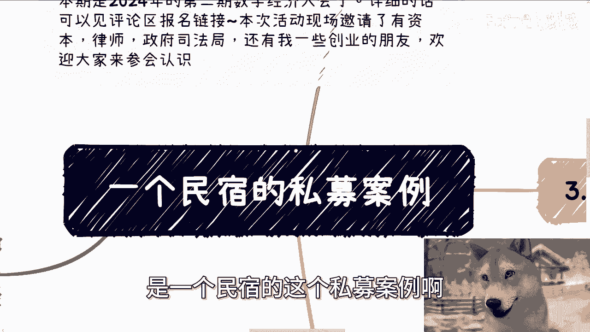

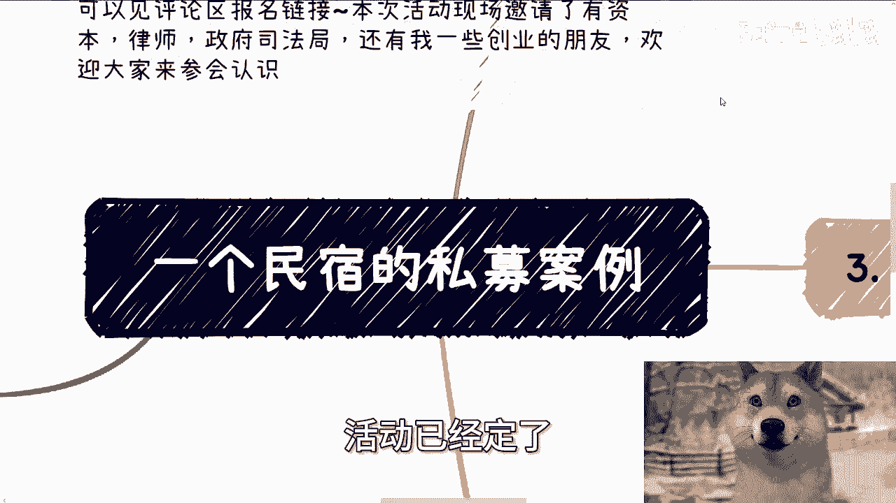

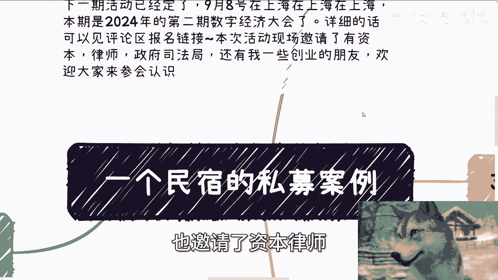

## 概述
在本节课中，我们将通过一个具体的民宿私募集资案例，来剖析其背后的商业模式、潜在风险与灰色地带。我们将学习如何识别看似“创新”的商业策略中可能存在的问题，并思考其与正规商业实践的区别。

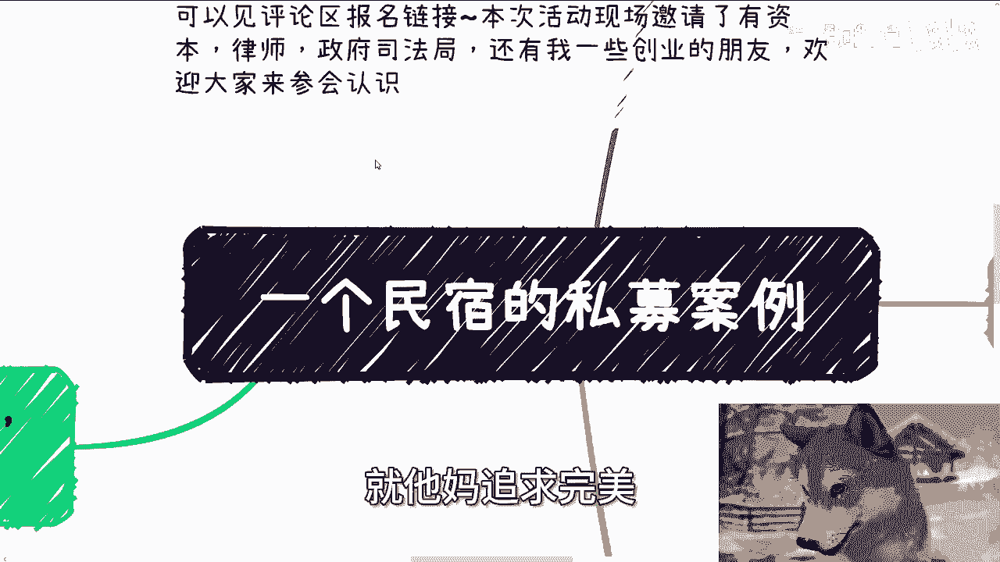

---

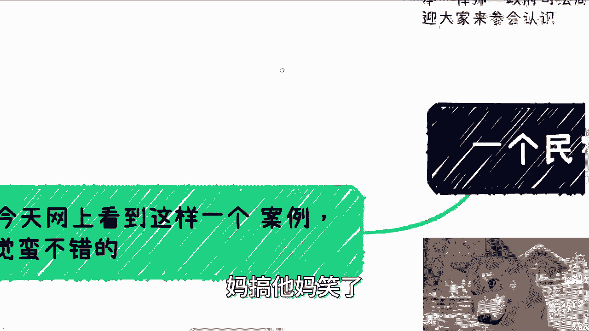

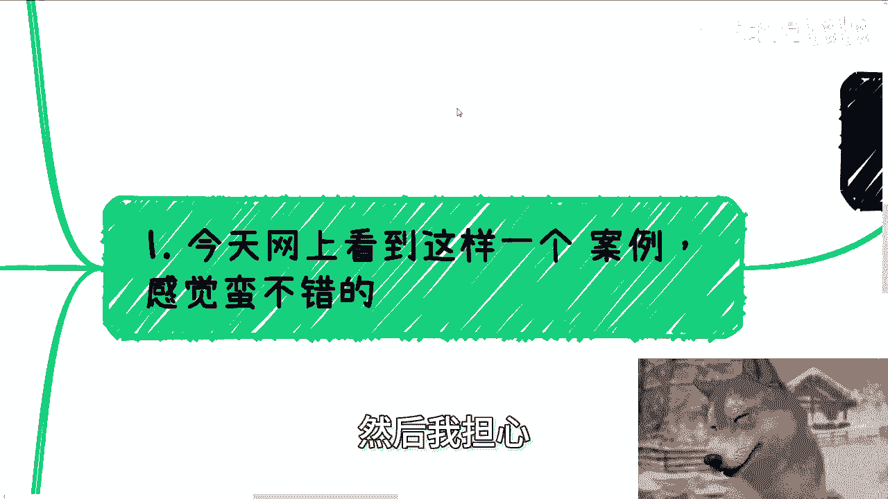

## 案例背景介绍
本节我们将介绍本次课程要分析的民宿私募集资案例的基本情况。

浙江一位民宿老板采用了一种独特的开店方式：他自己未投入资金，而是通过向客户募集资金来开设新店。据报道，有4000位顾客积极参与，该模式在短短10分钟内筹集了400万元。这种模式声称颠覆了传统民宿行业，并以“空手套白狼”的方式在全国开设了约100家店。

---

## 商业模式拆解
上一节我们介绍了案例背景，本节中我们来看看这个商业模式的具体运作方式。

该民宿品牌“花间堂”计划在香格里拉开设新店时，并未自行投资，而是在京东私募平台上发起了众筹计划。

以下是该计划为参与者（称为“微股东”）提供的核心权益：

1.  **入股与消费金返还**：顾客支付2万元成为微股东。平台承诺在两个月内返还1万元消费金（即消费券），并在后续7年内，每年再返还2000元消费金。总计，微股东可获得 `2.4万元` 的消费金用于在该民宿消费。
2.  **年度分红**：在7年期内，若民宿年营业额突破365万元，所有微股东可额外享受 `6%` 的年投资收益。
3.  **股权回购**：7年后，公司将以2万元回购微股东的股权，但分红权随之终止。

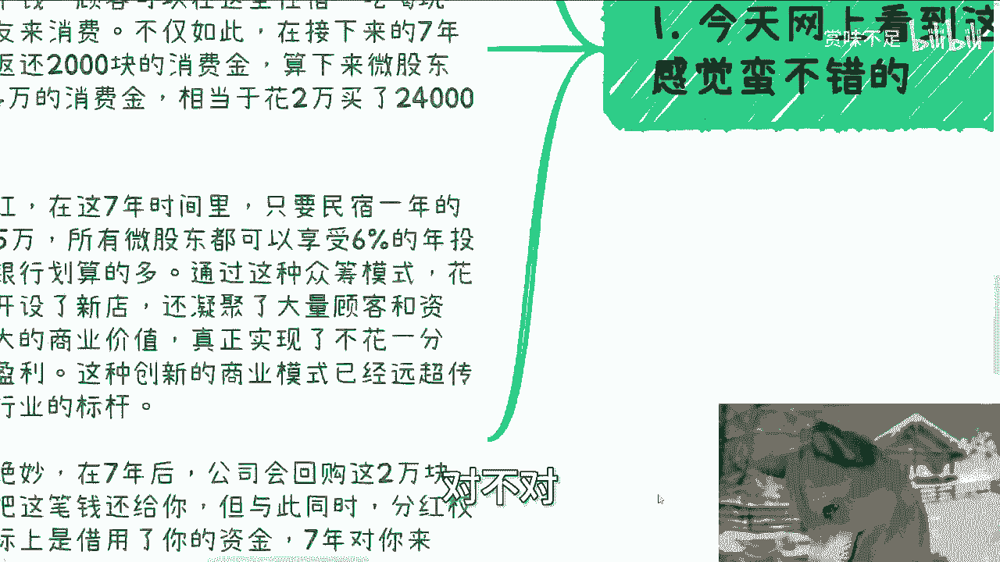

从表面看，参与者似乎用2万元现金换取了2.4万元消费权和潜在投资收益。

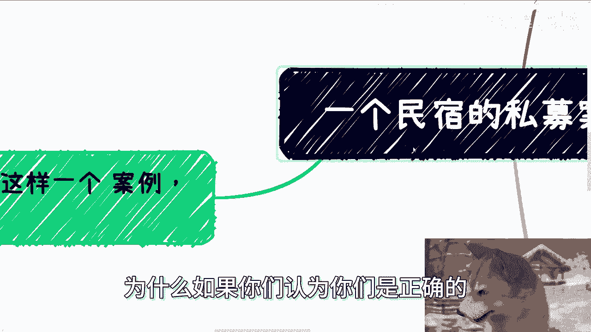

---

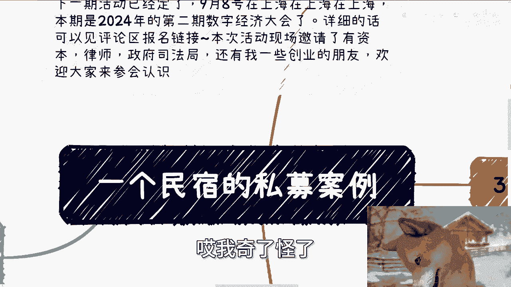

## 模式中的潜在问题与风险
了解了商业模式后，我们需要深入思考其中可能存在的风险和逻辑漏洞。以下是几个关键质疑点：

1.  **消费金的价值与兑现**：参与者支付的是真金白银，但获得的是民宿自行定价的消费金。`2.4万元` 这个价值是民宿单方面定义的，缺乏市场公允的衡量标准。参与者能否、以及是否愿意消费掉这2.4万元，存在不确定性。
2.  **分红的前提条件**：`6%` 的年收益分红有一个前提：年营业额必须突破 `365万元`。这个目标能否实现并无保证。即使实现，这部分收益也可能通过提高消费价格等方式“羊毛出在羊身上”。
3.  **资金使用的本质**：该模式实质上相当于民宿向公众进行了一笔无息或低息融资。但它并非持牌金融机构，此举游走在监管的灰色地带。
4.  **规则的制定权**：无论是消费金的定价、分红条件的达成，还是培训案例中“找到工作”或“培训完成”的标准，解释权往往完全掌握在发起方手中。这为承诺的兑现留下了巨大的操作空间。

---

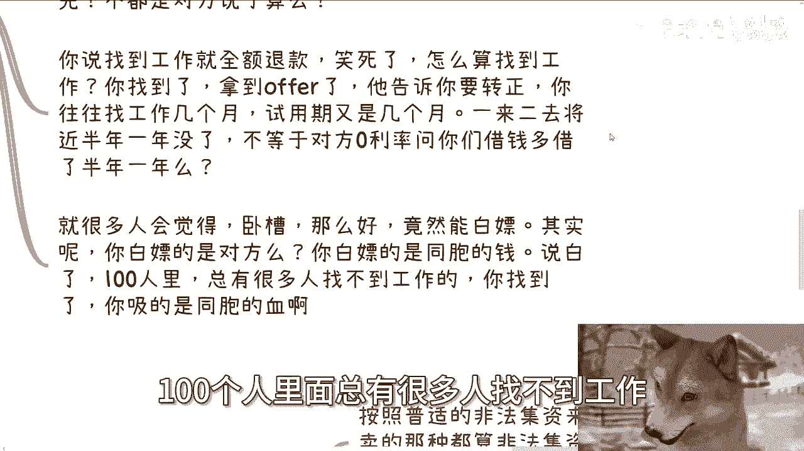

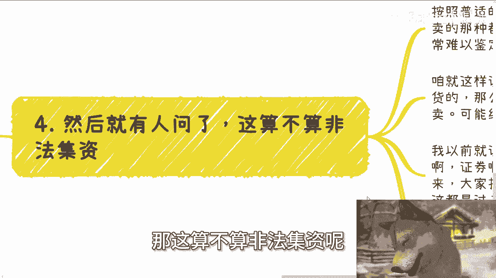

## 灰色地带的思考与对比
尽管存在上述问题，但该模式成功募集了大量资金。这引出了一个深刻的矛盾：为什么一个在许多人看来类似“传销”或“集资”的模式，却能吸引如此多的参与者？

这与某些“先交费培训，找到工作后退款”的模式逻辑相似。参与者看似有机会“白嫖”服务，但实质上，成功者的收益可能建立在未成功者的损失之上。例如，100人付费培训，最终只有部分人找到工作并获得退款，培训机构利用剩余资金覆盖成本并盈利。

关于是否构成“非法集资”，从法律实践看，定性较为复杂。如果交易被包装成“一手交钱、一手交货”的商品或服务买卖（如购买“微股东”权益），而非纯粹的金融投资合同，就很难被直接认定为非法集资。监管的“靴子”何时落下，具有不确定性。

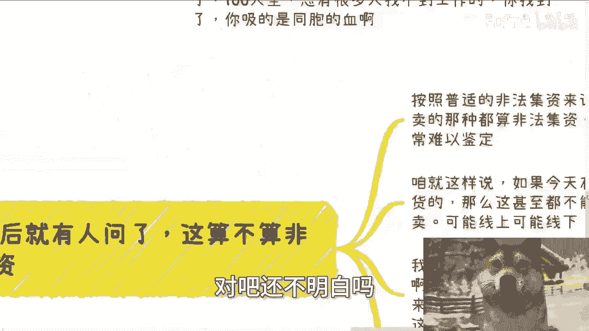

---

## 总结
本节课我们一起学习并剖析了一个民宿私募集资的案例。

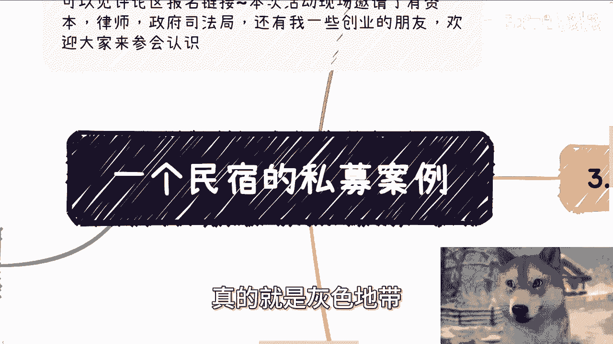

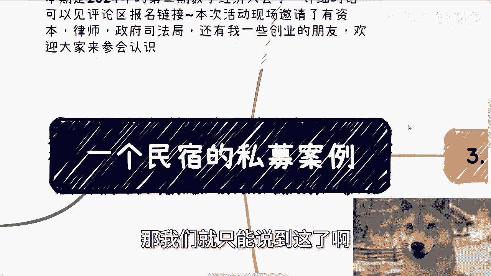

我们拆解了其“微股东”模式的运作方式，指出了其中关于**消费金价值**、**分红条件**和**资金本质**的潜在风险。同时，我们也探讨了此类模式游走在法律与道德**灰色地带**的现实，以及它为何有时能在市场上取得成功。

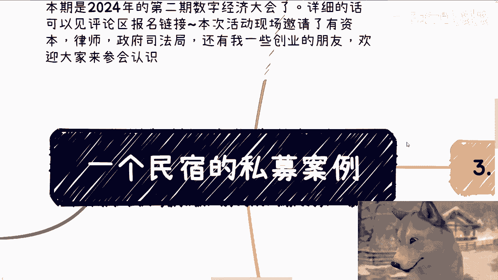

这个案例提醒我们，在评估任何商业机会时，不能仅看表面承诺，而需深入分析其底层逻辑、价值交换的实质以及规则制定权的归属。理解灰色地带的运作，不是为了效仿，而是为了更清醒地认知商业世界的复杂性。