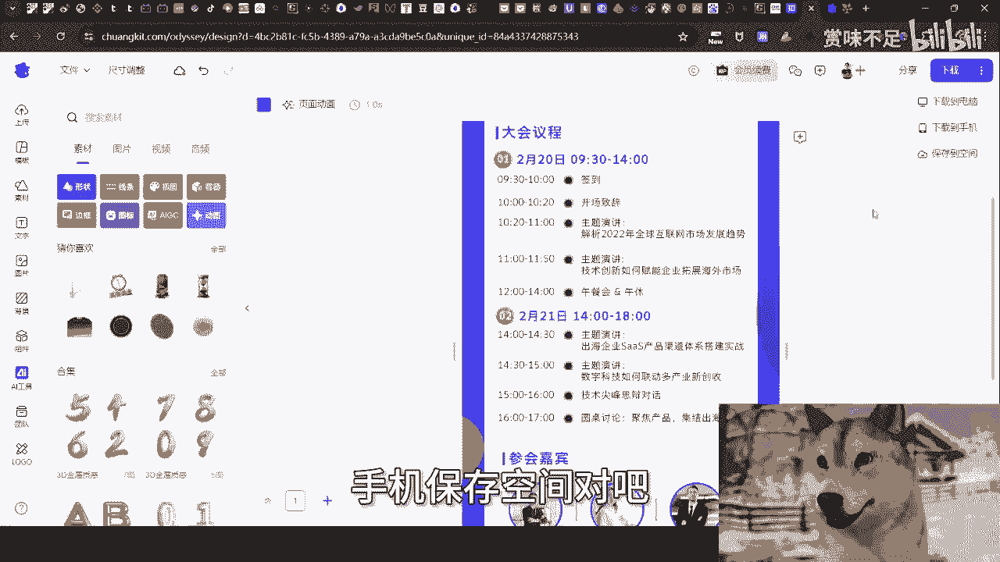
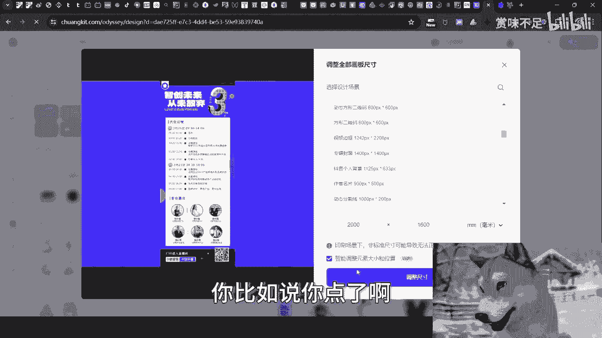
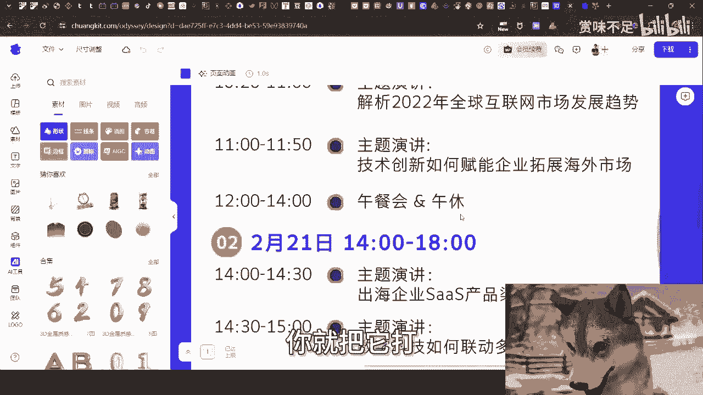
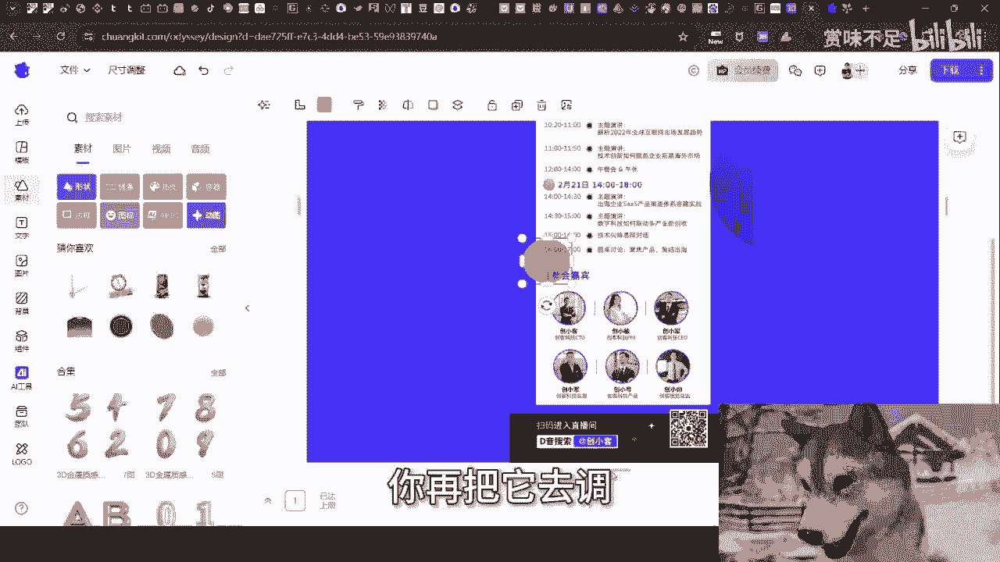
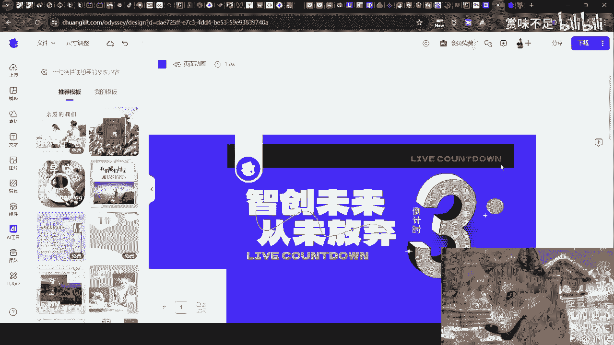
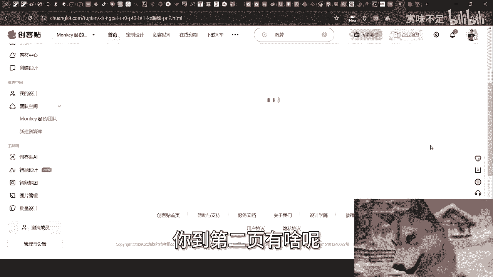

# 一人团队篇2：海报篇 - P1 - 赏味不足 - BV1Sw4m1a7i4

好大家好，就最近我在打生化危机四的，这个叫什么硬核难度，卧槽他妈打的天昏地暗，真的是哎呀太累了啊，然后今天我们来讲这个艺人团队篇啊。

海海报片啊，海报片是非常重要的一个东西，呃首先先说一个事啊，呃就是已经不止发生过一次了，所以我他妈不得不不喷我，我也得喷我，的啊，就是咱小伙伴做事啊，非常的神奇啊，不是我说你们跟你们讲。

我做事情态度很简单，就是真的要别人救对吧，先自救啊，你要不想做，不认真做，你就别来问我有啥好问的呢，对不对，你你说你从我角度来讲，你自己都不尊重你自己，你我有啥好说的对吧，就真的不止一次啊。

就是就是很多人啊就是做活动对吧，做海报或者做一些别的事情啊，他做之前或者说在落地之前，他不来问我对吧，他做完了卧槽，我就问他们，我说那你的连接你的海报，你的宣传给我看一下，跟他妈屎一样对吧。

就是该有的因要素什么都没有跟他妈屎一样，然后跟我说哎陈老师没有人来，屁话谁来啊啊，就你TMD做事情这种认真方式能他妈赚到钱哈，这样气效呢啊我跟你讲气效来，而且最离谱的是什么，就是做啊，他也不认真做。

而而而反而还要表现出来自己很认真啊，我跟你讲别的啊，认清楚这个世界95%的人就是炮灰，就他妈是，你自己不认真，你怪谁啊对吧，你自己不认真，你最终只能沦沦为那95%的。

有啥好说的呢，对不对。

那我们来说重点啊，咱来说海报啊，海报这个事呢，其实并不并不是说像很多人觉得，就单纯的一张长图或者一个图片啊，我跟你讲，你要细分的，首先你主KV要主KV就是你整个的主色调，主的设计稿，你的主KV是要的。

那当然这个东西看你的呃，怎么说呢，就是看你做事情的这个严谨度吧对吧，因为一般来讲的话，你们嗯就我们以前做的东西啊，就我们如果不太不是给那种政府做，或者不是做做那种，就是说团队协作的话。

其实你没有主KB也行对吧，但是你要是给政府做或者怎么样子，你肯定是得有个主色调的，而且政府是要审核的，然后另外一方面就是说你日常的活动海报banner啊，banner就是你们可以到网上去看。

比如说111024×768对吧，横向的那种海海报的banner，主要是用来做那种缩略图的封面，就类似于你们可以理解为，像短视频的那种封面啊，然后日常长海报是要的长海报，就是那个呃所有的比如说标题呀对吧。

然后呃你里面的主题啊，你的嘉宾啊，你的所有东西都得有啊，这个就是我们常见的长海报，然后还有邀请函，邀请函的话就很简单嘛，就给那种专人的对吧，比如说比如说你给我们的这个VIP啊对吧。

给我们的这个邀请的小伙伴啊，啊给我们的讲师啊对吧，都行啊都行好，那么还有呢就简略版的海报，简略版的海报呢，简单来讲就是说啊把那些有的没的，乱七八糟的都都去掉，只剩下就是大众关心的。

比如说呃专主题内容和那个嘉宾信息对吧，你也可以在简略的海报上面，把那些什么嘉宾的头像啊，什么乱七八糟都去掉对吧，把那种长长的一匹的那种那种简，那个介绍也就去去掉对吧。

就是把把把大众最关心的东西留在上面啊，然后还有每个嘉嘉宾的那种专题海报，比如说你们啊待会我们能够看到的，反正就是说专专门的一张海报，就是一个主题啊，就是让大众能够更直接的。

或者更详细的去了解到这个主题讲什么东西，那么这个其实是这些东西我们都是要的对吧，你主KV是用来给大家做合作，是更好的做协作的对吧，日常海报banner用来做封面，长海报是用来做宣传。

邀请函是用来给嘉宾放朋友圈装逼的对吧，简略版的海报是用来给参与的人员看的，每个嘉宾的专题海报也是给参与的人员看的，你缺一不可啊，对不对，卧槽，你们是不知道你，我他妈又又想喷了你。

你们是不知道他们那些人做的海报，他妈个真的，我靠他妈狗都做的比你们好，我跟你们讲哦，好，然后呢，今天我们就来讲那个那个叫什么那个工具啊，叫那个创可贴对吧，我之前在很多视频里面也跟你们提到过啊。

嗯让我帮你们切一下啊。

窗口捕捉，然后创可贴啊，创可贴对吧，你们也能看到啊，你看啊这个创可贴对吧，然后呢呃我们在这个地方就能够有呃，旁它旁边还有AI啊，智能设计咱先不去管它啊，我就跟你们讲一下，就核心的一些功能啊。

首先我们在这下面是能看到，有非常多的海报对吧，模板啊，我们先别管啊，你看我之前这个那个深圳大会的时候，我做了哪几个东西，一个是大会啊，就历史搜索大会，然后我给你们做的胸卡胸牌对吧。

邀请函我们一个个来看啊，比如说大会啊，我点进去，对吧好，然后呢，大会这边呢你们能够看到他这个呃有分成，比如说各种各样的行业对吧，那么比如说我我选科技互联网啊，那么同样的版式版式这边呢你看啊。

竖版就是长途，横版呢你们可以用来做banner对吧，方形的方形一般不用啊，就横版竖版嘛对吧，然后类型这边比如说动图，动图我们一般也不用嘛对吧，就是那个全我们就弄全部啊，风格的话我们先不说啊。

我们先往下看，你看啊，我这次深圳的那个大会主要用的就是这个模板，对，就这长得一模一样嘛对吧，你看到没有长得一模一样嘛，然后其他的啊，我们在这个地方呢，我顺便提一点，我咱别的不说啊，比如说我点这个诶。

草妈还要我那个登录啊，等一下啊，我来给你们登录一把，嗯好对吧，我打个比方啊，比如说我们点这个对吧，它它会跳出来啊，到那个设计页面，哎我跟你们讲啊，没这么慢的啊，最主要是因为我开了那个就这个狗头的动画。

所以你们会会觉得慢啊，就这日常不会这么慢的啊，因为这个这个这个软件，他妈的占内存占的太高了，好看到没有就出来了对吧，那么这个上面你们看到吗，所有的元素你要改就直接改，简单不啦，就就这么简单。

你你把这个logo去掉对吧，把你自己logo放上去对吧，然后还是那句话，就是你们不要来问我说哎这个当中放什么东西，哎这他妈上面放什么东西，这么清楚呢，你们就直接照搬放啊对吧。

你人家有整个的schedule，整个的这个大会的议程，你有没有啊，人家有参会嘉宾，有图片有介绍，你有没有没有，你来问我干嘛对吧，然后比如说这个手这个时候你不要你就删掉，对不对，哎这这这这这么简单的事。

我我我我真的，我跟你们讲啊，我敢打赌，我从去年到现在，我说创可贴出了无数次，真正能用的，真正能够打开这网站去看的，我他妈敢打赌不超过十个人，对不对，然后等他要做的时候，哎呀陈老师，我这个不会做。

哎那个不会做，卧槽我他妈我他妈找的那个合作，放花花钱找的设计，他妈跟狗一样，自己跟狗一样，对不对，这有什么难的呢对吧，然后呢还有一点是什么，就是我们有很多的这种平台啊，他是要求你海报的那个尺寸的对吧。

你看啊，比如说他在这个地方它可以导出对吧，就下载到电脑手机保存空间对吧。

好，这个地方呢我们需要有一个，也也有个很重要的东西叫尺寸调整，你看到啊尺寸调整啊，那么这个地方呢他都给你弄好了，比如说有手机海报全屏对吧，竖版的横版的，但是呢是这样子的啊。

很多平台它上面给你的不是这个PX给你的，是这个呃这个厘米和毫米嘛对吧，你而且呢另外一方面，它的这个设计跟平台的这个设计，可能有些很多东西不一样，所以说呢你把这个勾掉，你不要点智能。

你就直接按照比如说这地方选毫米，你就直接按照那个平台上给你的这个尺寸，比如说2000啊，乘以这个1600对吧，你就弄好，弄好之后你看到吧，你看到左边这个缩略图啊，2000×1600出来的。

就相当于是他原本就这个样子嘛对吧，然后呢然后呢你再点这个智能调整对吧，他就会帮你调整调整出来就好了呀，欧了呀，对不对，就是你不要说哦，你不要说就是到时候你说啊，我自己再去拉对吧，再去怎么样，不要拉呀。

就智能调整呀，2000×1600啊，然后你你你调整尺寸，你比如你点了啊。

比如说我们点一下调整尺寸，你看到吧，调整尺寸，这个就是2000×1600，对不对好，那么你看啊，里面这个东西他现在不是整个海报没有撑满嘛，对吧好，那么你到底后面怎么去调整，你就把它打。

就是弄弄放大，然后你再细节再去调整，比如说这个圆在外面了对吧，你把它拖进去对吧，或者说这个这个你看啊，这个上面好像是突出了或者怎么样子了，你再把它去调就微调。

你知道吧，然后你按照平台上的那个尺寸，你就先在这个地方先先直接手动输就结束了呀。

对吧，你做好这张我们称之为主的海报之后，那么你说好，你说哎我们想做一个横版的对吧，打个比方，比如说横版的下面schedule是没有的，只有上面的对吧，那么你就把上面这个元素扩出来啊。

扩出来之后你把它拿出去，比如说拿单独拿出来啊，比如说嗯我们往右啊，往右，那比如说这张这个东西，我们单单独拿出来做一个什么，做一个就是封面图，可以不啦，可以的呀，你就是DIY嘛，对不对。

这有什么难点呢对吧，你想要什么就去弄什么，然后你你你要图的话，他这个那个还能上传对吧，你看我下面这些就是我我这次上传的对吧，各种各样的有什么问题呢，一点毛病都没有呀，他有什么难点呢。

啊然后呢还有一个是什么呢，就是你不要被他我们再跳出去啊，啊比如说我们再到胸卡，好你不要被他就是说这个这个什么左边什么呃，那个专那个AI啦，智能抠图了，图片编辑啊，什么乱七八糟的啦，你不要被他忽悠对吧。

你不要被他就是说搞得好像哎呀，很复杂很怎么样子，你就我跟你说，很多东西你都不用用，你都不用去用，你就直接这个胸牌弄好对吧，你说我想要个横版的，比如说你打个比方，你要给那个老师对吧，弄些证书的。

那你就弄个证书，对不对，你就你就弄个证书，然后你再点进点进去，点进去之后你再细细调细调一下，把这些logo什么去掉对吧，怎么样子，你要弄个胸卡的，你就弄个胸卡，就就就这么些事言呢，还能有啥事呢，对不对。

你你你第一页对吧，看着不爽的啊对吧，那你到第二页有啥呢。

我完全理解不了，真的说实话，包括就是这种，还有请帖，你看到吧，还有这种名，那个像像名片一样的这种东西，什么没有啊，对不对，我我跟你们讲就完完全不理解，就是既然有这么好的工具啊，这么好的平台。

然后啊来问我的人，这个海报做出来怎么还跟屎一样，哎直接把这个东西拿出来，Ctrl c ctrl v，都他妈比你们现在给我看的那些海报好100倍，1000倍啊对吧，我完全就不理解啊，啊所以就是我就说了。

就是说你你很多人做事情，他自己不认真，我没啥好说的，一句话都不想讲啊，好行啊，就这样就这么着吧啊，嗯职业规划，商业规划啊，股权期权，商业计划书白皮书，额合同，包括分红分润啊，包括你们手上有什么牌。

你们没有什么牌，你们希望通过跟我的沟通啊，能够呃希望通过我的一些视角跟一些认知，给你们一些更接地气的建议，或者来说规划的话，那么你们整理好对应的问题跟个人背景。

