# 一人团队篇2-海报篇---P1---赏味不足---BV1Sw4m1a7i4

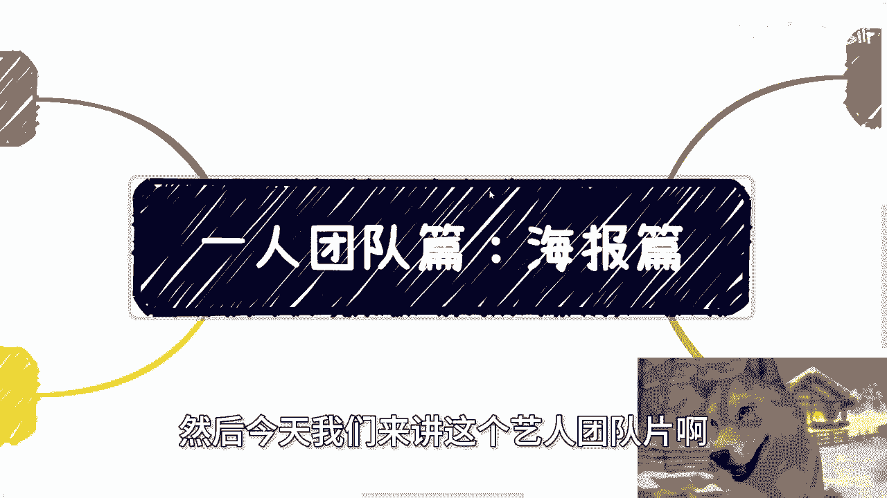

在本节课中，我们将学习如何为活动制作专业、全面的海报体系。海报不仅是宣传工具，更是活动专业度的体现。我们将介绍海报的不同类型、核心制作流程，并重点讲解如何使用“创可贴”这一工具高效完成设计。

## 海报的重要性与常见问题

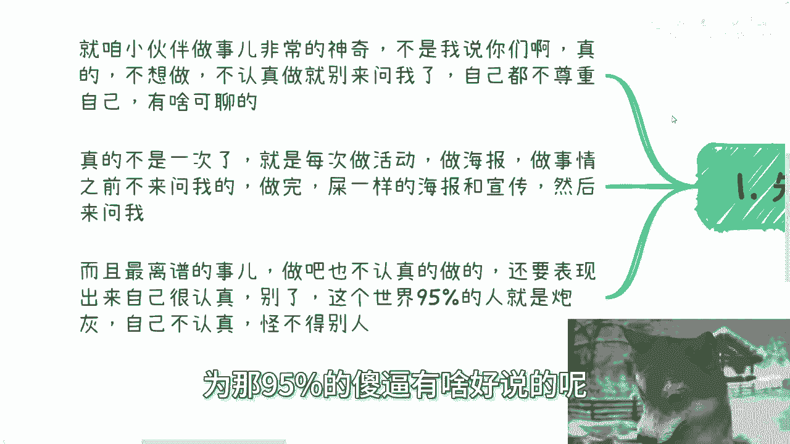

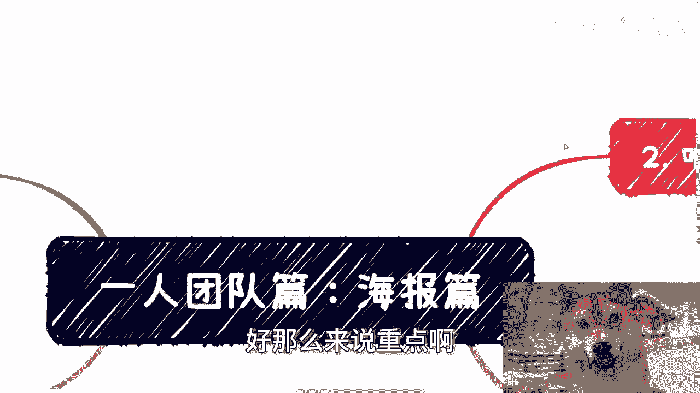

上一节我们介绍了单人工作的基本心态，本节中我们来看看海报制作这一具体任务。海报是活动宣传的“门面”，其质量直接影响参与者的第一印象和活动效果。

然而，在实际操作中，经常出现以下问题：许多人在设计海报或执行活动前不进行沟通，直到完成后才展示成果。结果往往是海报缺乏必要元素，设计粗糙，导致宣传效果不佳。问题的根源通常在于做事态度不够认真。请记住，做事前应先“自救”，即自己先尽力做到最好，再寻求帮助。如果自己都不尊重自己的作品，别人也很难提供有价值的建议。

## 海报体系的完整构成

一张海报远不止是一张图片。一个完整的活动宣传需要一套海报体系来支撑。以下是构成这套体系的关键组件：

*   **主KV（主视觉）**：这是整个活动的视觉核心，定义了主色调和整体设计风格。公式表示为：`主KV = 活动主题 + 主色调 + 核心图形`。对于大型或正式活动（如政府项目），主KV是团队协作和对外展示的统一标准。
*   **日常海报/Banner**：主要用于线上平台的缩略图或封面，例如网站横幅或视频封面。常见的尺寸如 `1024px × 768px`（横版）。
*   **长海报**：最常见的宣传海报，包含活动的所有关键信息：标题、主题、嘉宾介绍、议程、时间、地点等。
*   **邀请函**：针对特定人群（如VIP、嘉宾、讲师）设计的专用海报，用于邀请和让对方在社交平台分享。
*   **简略版海报**：提炼自长海报，只保留大众最关心的核心信息（如主题和嘉宾），去除冗长介绍和次要元素，便于快速传播。
*   **嘉宾专题海报**：为每位重要嘉宾单独制作的海报，深入介绍该嘉宾及其分享主题，帮助参与者更详细地了解内容。

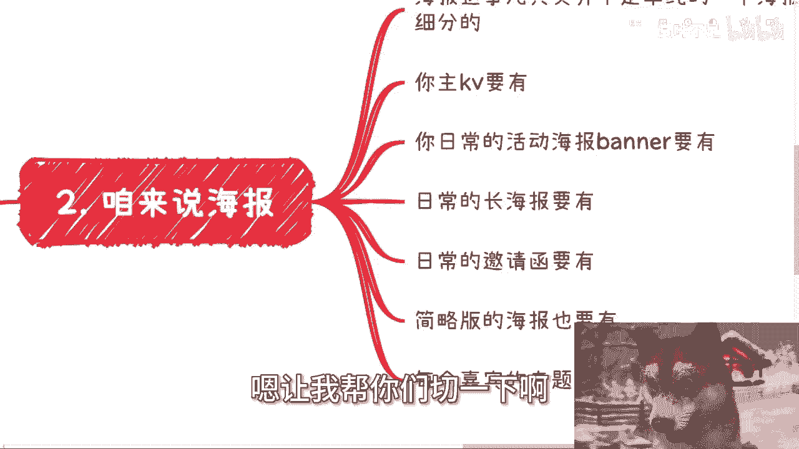

这套体系各有用途：主KV用于统一协作，Banner用作封面，长海报用于广泛宣传，邀请函用于嘉宾展示，简略版和专题海报用于增强参与者认知。缺一不可。

## 实战工具：创可贴使用指南

认识到体系的重要性后，我们来看看如何高效制作这些海报。这里推荐使用“创可贴”这个在线设计工具，它能极大降低设计门槛。

### 1. 寻找与使用模板

打开创可贴网站，你可以看到海量的模板。以下是使用步骤：
1.  根据你的活动行业（如“科技互联网”）筛选模板。
2.  选择版式：`竖版`（长图）或 `横版`（Banner）。
3.  找到心仪的模板后，点击进入设计页面。

在设计页面中，所有文字、图片、图形元素都可以直接点击编辑。你需要做的就是替换内容：
*   将模板的Logo替换成你自己的。
*   参照模板的模块（如议程、嘉宾介绍），填入你自己的内容。
*   删除不需要的元素，保留并修改有用的部分。

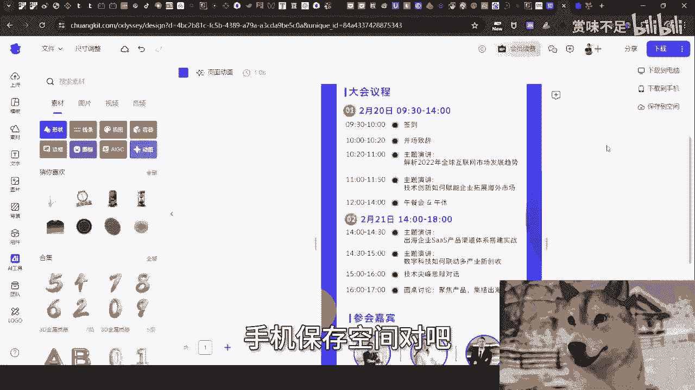

这个过程的核心是 **“替换”而非“从零创造”**。

### 2. 调整海报尺寸

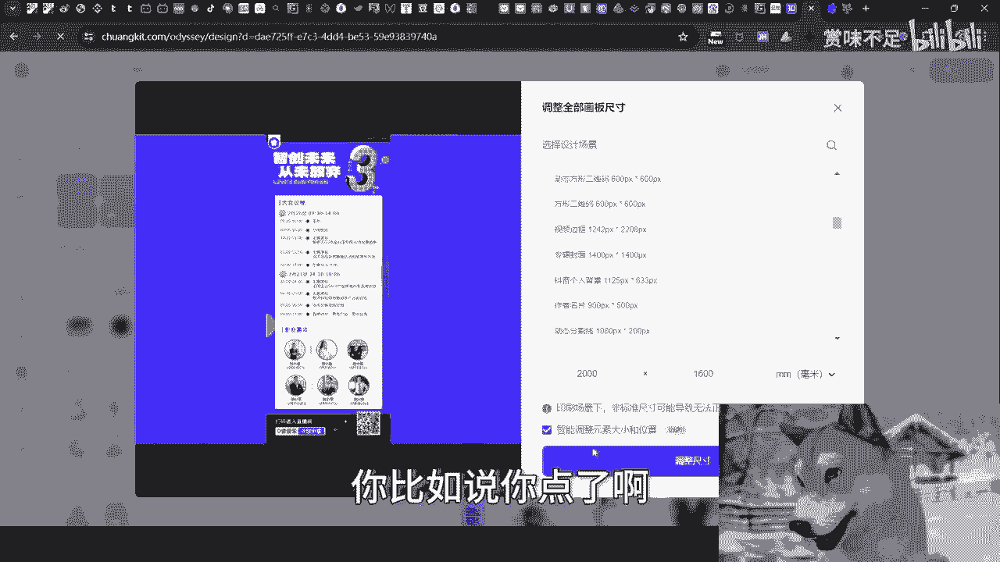

不同宣传平台对海报尺寸有不同要求。创可贴提供了便捷的尺寸调整功能：
1.  在设计页面点击“下载”或“调整尺寸”。
2.  如果平台给出的是毫米等单位，请关闭“智能”选项，手动输入要求的 `宽度` 和 `高度` 值。
3.  生成新尺寸的画布后，使用“智能调整”功能，让系统自动重新排列元素。
4.  最后进行微调，例如将超出边界的元素拖回画布内，确保海报整体协调。

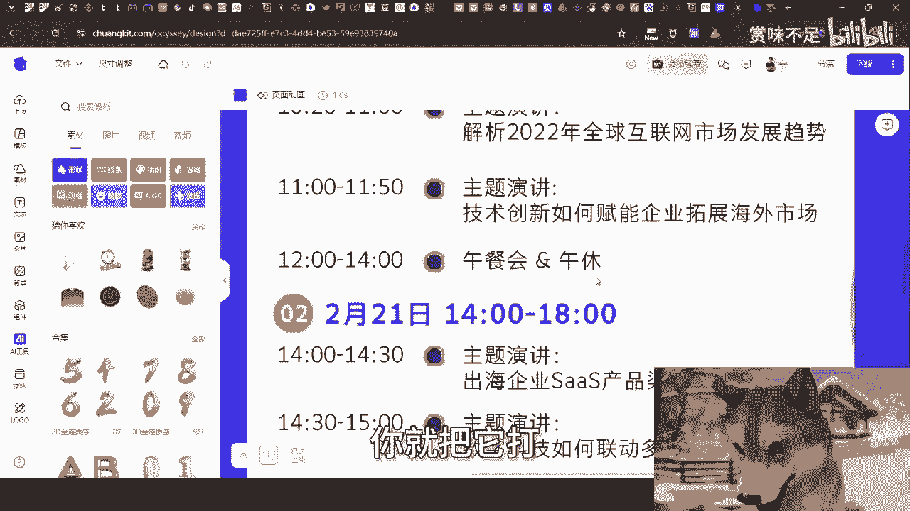

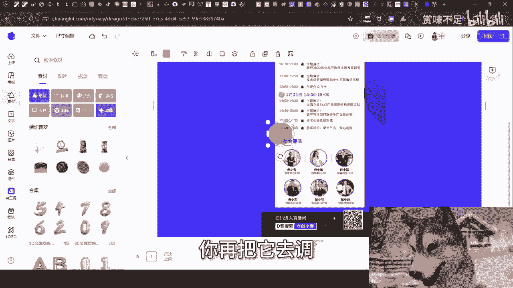

### 3. 衍生设计制作

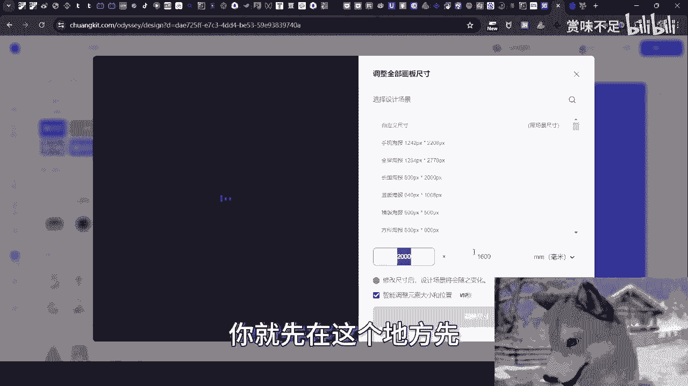

当你完成主长海报后，可以轻松衍生出其他物料：
*   **制作Banner**：从长海报中截取核心视觉部分（如标题和主图），粘贴到新的横版画布中，稍作调整即可成为封面图。
*   **制作其他物料**：在模板库中搜索“胸卡”、“证书”、“请帖”、“名片”等，使用相同的替换方法快速生成。工具内置了图片上传功能，方便你使用自己的素材。

**关键点**：不要被工具侧边栏复杂的AI、智能抠图等功能迷惑。对于大多数基础需求，你只需要用到 **模板选择、元素编辑、尺寸调整、图片上传** 这几个核心功能。

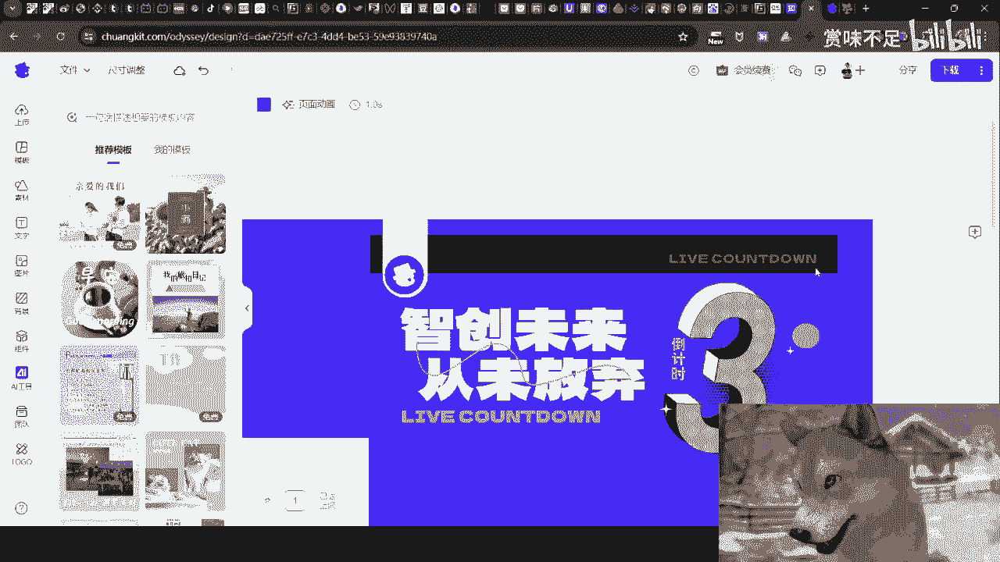

## 总结与行动建议

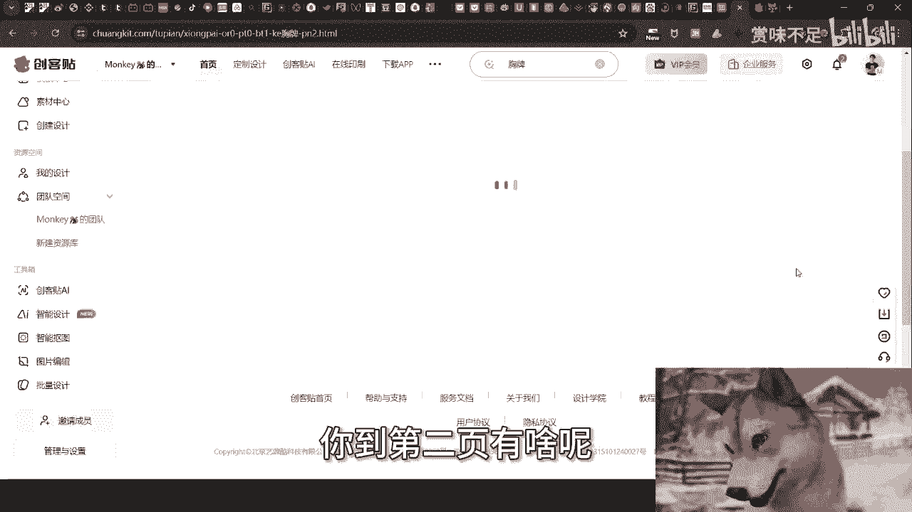

本节课中我们一起学习了构建专业海报体系的重要性及其完整构成，并掌握了使用“创可贴”工具进行高效设计的实战方法。

总结关键步骤如下：
1.  **明确体系**：根据活动需要，规划好主KV、长海报、Banner、邀请函等一套物料。
2.  **善用工具**：在“创可贴”上通过筛选找到合适模板。
3.  **替换内容**：直接编辑模板中的文字、图片，替换成自己的活动信息。
4.  **调整尺寸**：根据发布平台要求，使用尺寸调整功能适配。
5.  **衍生制作**：基于主海报，快速制作其他所需物料。

请记住，拥有如此便捷的工具后，产出粗糙的海报已无借口。认真对待每一个细节，是让自己脱颖而出的开始。现在，就打开工具，选择一张模板开始你的第一次实践吧。