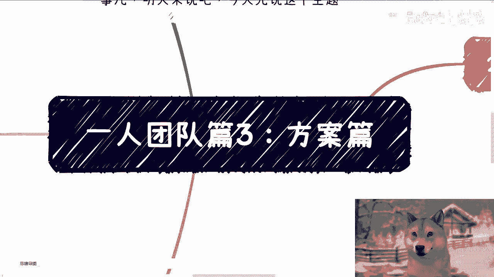

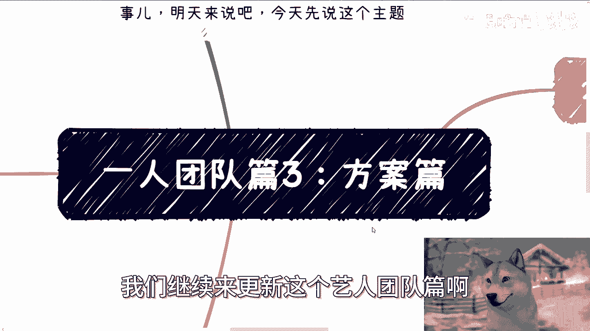

# 一人团队篇3：方案篇 📄

在本节课中，我们将学习如何构建一个专业、有效的方案。方案是连接想法与执行的关键桥梁，无论是举办活动、提供服务还是寻求合作，一份结构清晰、内容扎实的方案都至关重要。

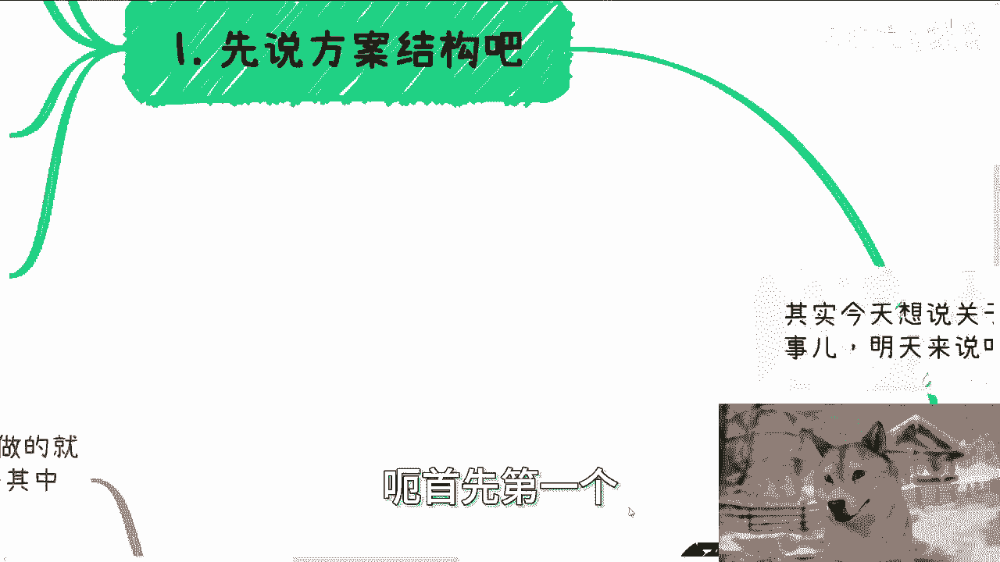

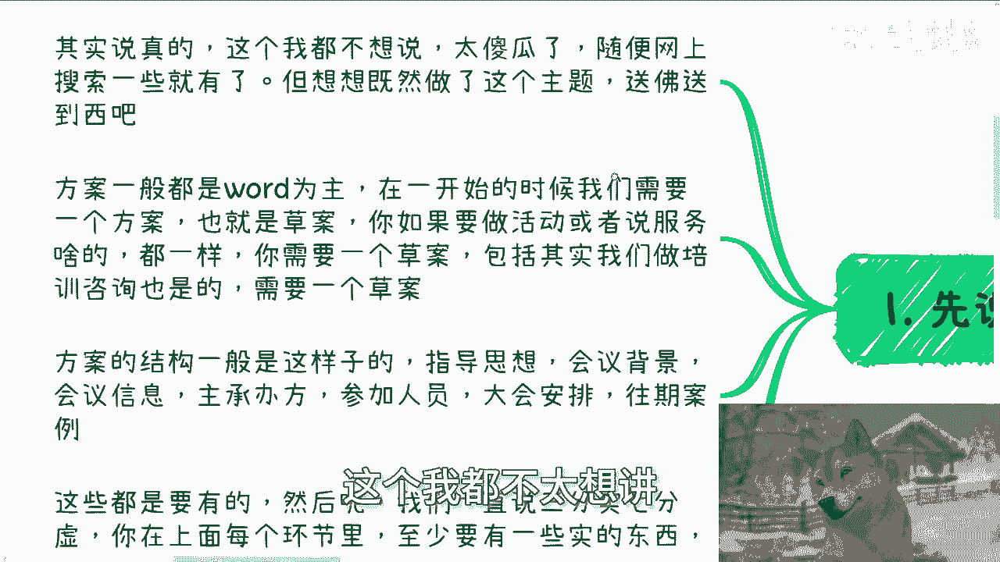

上一节我们讨论了团队协作的基础，本节中我们来看看如何将想法具体化为可执行的方案。

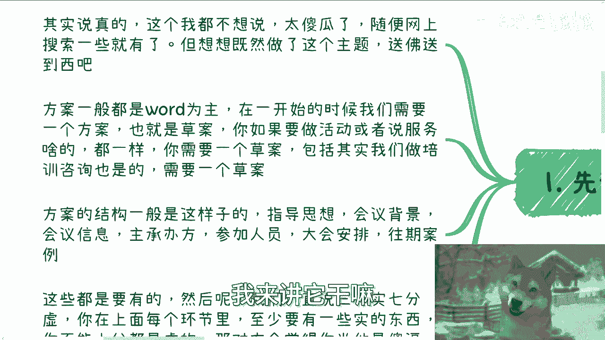

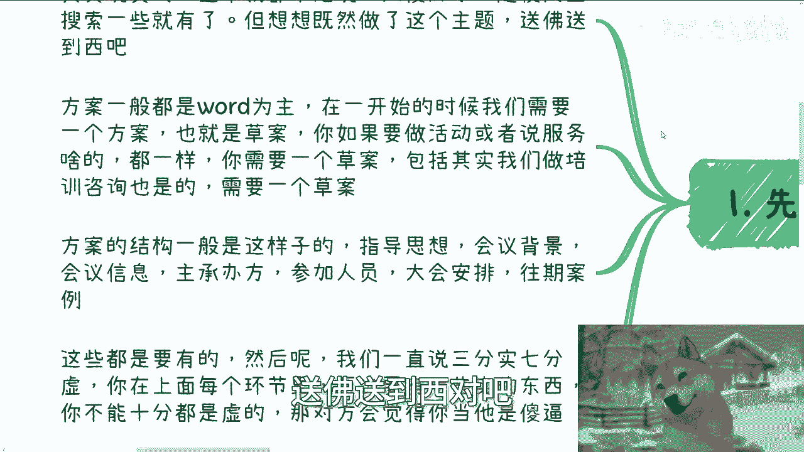

## 方案的基本结构 📝

方案通常以Word文档形式呈现。在项目初期，我们需要一份草案来明确方向。无论是策划活动、提供服务还是进行培训咨询，一份草案都是必不可少的起点。

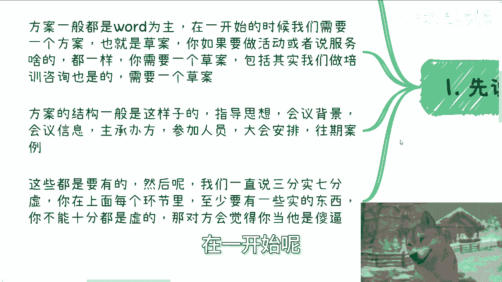

方案的结构通常包含以下几个核心部分：指导思想、会议背景、会议信息、主承办方、参加人员、大会安排。接下来，我们将逐一拆解这些部分。

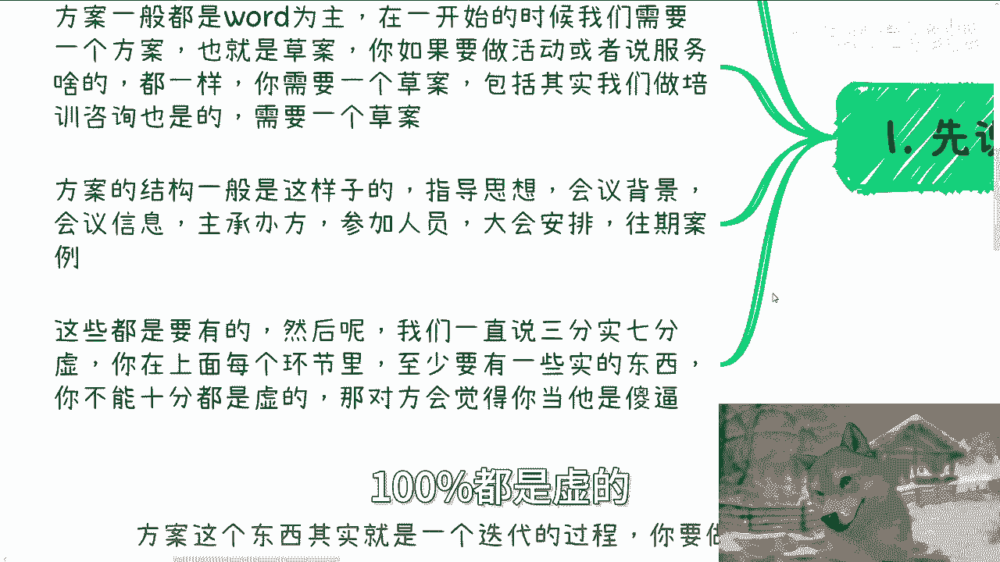

以下是方案的标准结构列表：

*   **指导思想**：阐述方案的核心原则与政策依据。
*   **会议背景**：说明举办此次会议或活动的宏观背景与必要性。
*   **会议信息**：包含会议的名称、主题、时间、地点、形式及具体议程。
*   **主承办方**：列明指导单位、主办单位、联合主办、合作单位、赞助单位及合作媒体。
*   **参加人员**：描述目标参会者的年龄、背景、角色及职级等信息。
*   **大会安排**：详细规划从报到、主旨演讲到晚宴、展览等各个环节。

在撰写第一版方案时，需要遵循“三分实，七分虚”的原则。这意味着文档中至少应有30%到50%的内容是已经敲定的、具体的信息。剩余部分可以是待商议或填充的框架。切忌出现100%内容都是空泛构想的情况，这会让合作方对你的专业度产生质疑。

## 结构拆解与要点 🔍

了解了整体框架后，我们来深入看看每个部分应如何填充具体内容。

以下是各部分的详细说明：

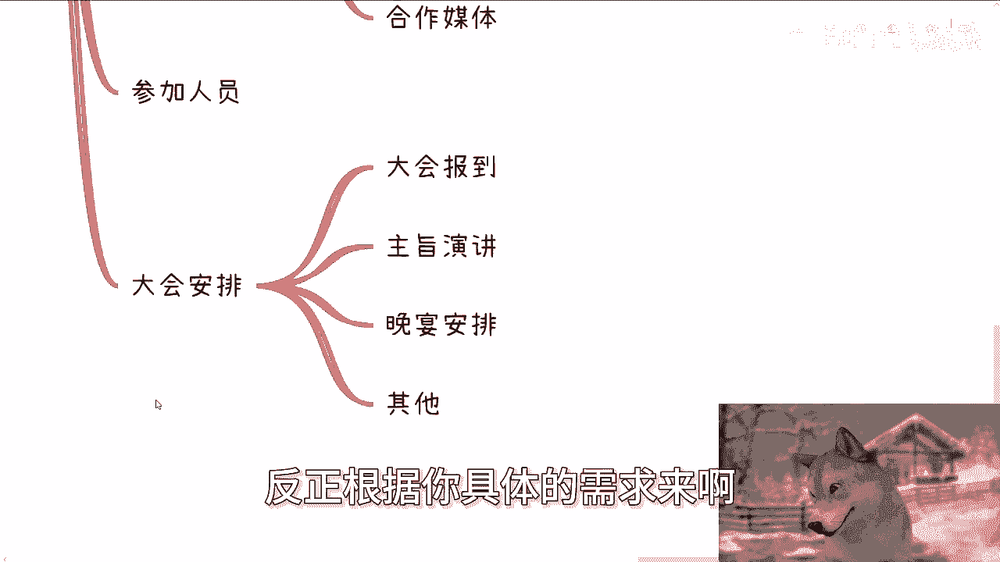

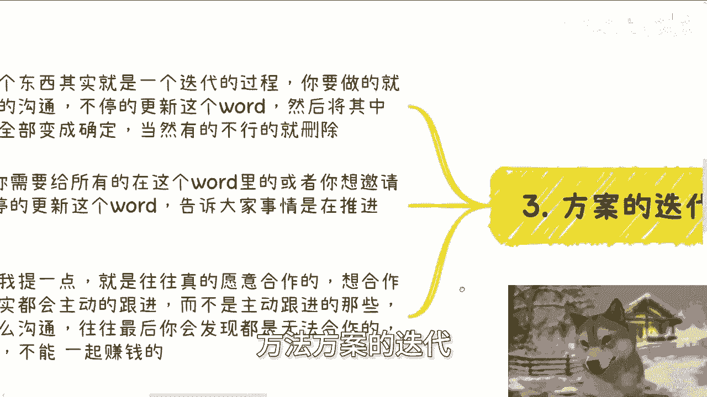

1.  **指导思想**：这部分需要“高举高大”，确保你的方案主旨符合中央思想与政策方向。例如，可以“以习近平新时代中国特色社会主义思想为指导，深入贯彻落实习近平总书记……重要指示精神”。
2.  **会议背景**：需要找到活动与宏观政策的连接点。例如，“为全面落实党的二十大及二十届二中全会精神，按照中央经济工作会议和全国两会部署……”，以此说明活动的时代意义。
3.  **会议信息**：这是方案最具体的部分。
    *   **会议名称**：例如“数字经济大会”。
    *   **会议主题**：需要具体化，例如“人工智能赋能产业创新”。
    *   **会议时间**：具体的年月日及时长。
    *   **会议地点**：具体地址。
    *   **会议形式**：需写清楚是分论坛、展会、主题演讲还是其他形式。
    *   **会议内容**：即详细的会议议程。
4.  **主承办方**：明确列出各方角色，如指导单位、主办单位、联合主办方、合作单位、赞助单位及合作媒体。
5.  **参加人员**：清晰描述参会者画像，包括年龄段、行业背景、社会角色、职级等，这对于吸引赞助和合作至关重要。
6.  **大会安排**：根据活动实际需求，详细规划报道、主旨演讲、分论坛、晚宴、展览等环节的时间与流程。

## 方案的迭代与沟通 🔄

方案并非一成不变，其本质是一个从不确定到确定的动态迭代过程。

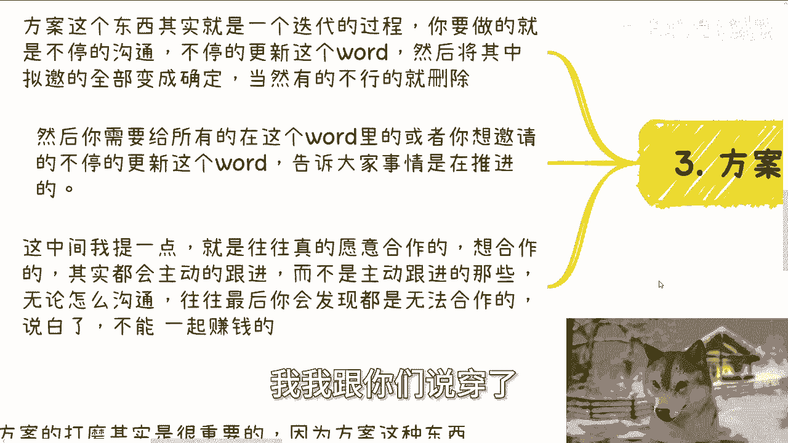

这个过程的核心在于**持续沟通与更新**。你需要不断与相关方沟通，将Word文档中的待定项逐一确认，并删除不可行的部分。同时，必须及时将更新后的方案同步给所有相关方及潜在合作者，以此展示项目的推进进度。

这里有一个关键观察：真正有意愿合作的伙伴，往往会主动跟进项目进展；而那些需要你反复催促的，最终很可能无法达成合作，因为你很难从他们身上获得实质性的收益。

## 方案的长期价值与通用性 💎

打磨一份优质方案具有长远的战略价值，因为方案的框架具有很强的通用性。

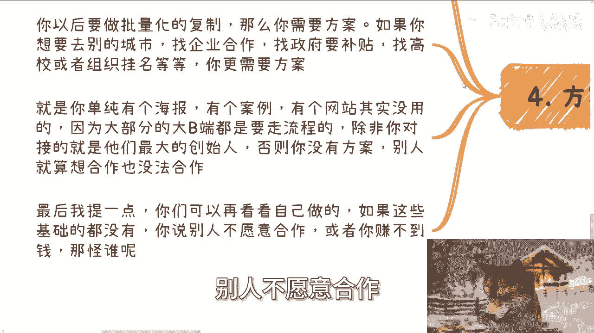

无论是用于活动策划、寻求赞助、安排议程、邀请讲师，还是制定品牌合作方案，其底层结构都是相通的。例如，今天用于金融领域的方案框架，稍作内容调整后，明天完全可以用于土木工程领域。

如果你计划进行批量化复制（例如，在上海成功举办后复制到北京），或者希望与其他城市的企业、政府、高校寻求合作，一份专业的方案更是必不可少。对于大B端客户（企业、政府、高校）而言，内部流程规范，仅凭海报或网站无法完成立项审批。除非你能直接对接最高决策者，否则一份正式方案是推动合作流程的必要文件。

## 总结与反思 🤔

本节课中我们一起学习了如何构建一份专业的方案。我们拆解了方案的标准结构，探讨了从草案到终稿的迭代过程，并强调了方案作为通用工具和合作敲门砖的长期价值。

回顾第二部分列出的基础结构，如果你所做的方案连这些基本要素都未涵盖，那么抱怨合作难或赚不到钱是毫无道理的。真正的门槛往往不在于技巧的高深，而在于是否足够**靠谱**和**脚踏实地**。将基础工作做扎实、做完整，你就能超越绝大多数竞争者。

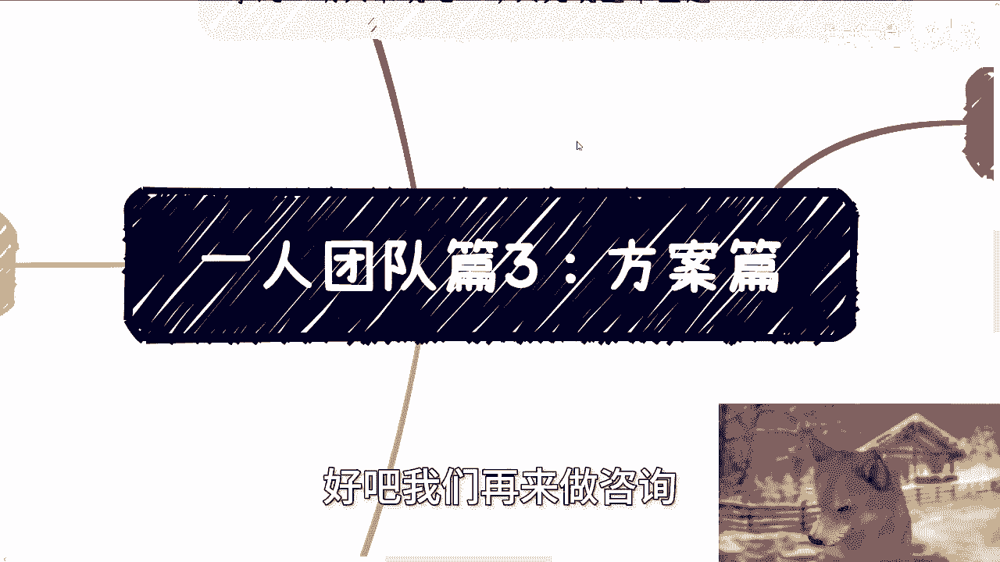

最后，关于职业规划、商业规划、合同权益（分红、股权）、商业计划书撰写，或希望避免走更多弯路，你可以整理好具体问题与个人背景，通过咨询进行更深入的探讨。