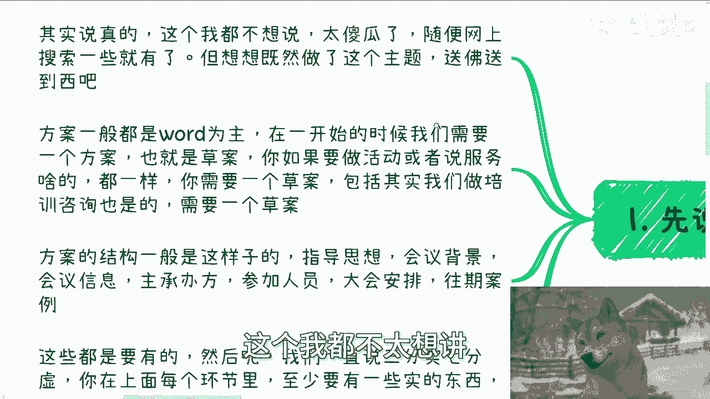
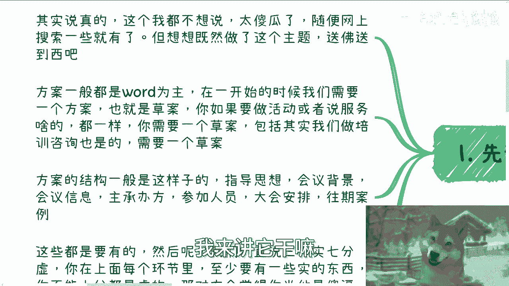
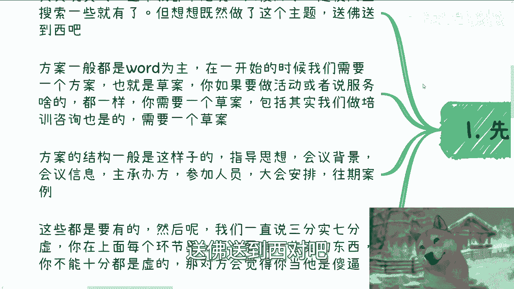
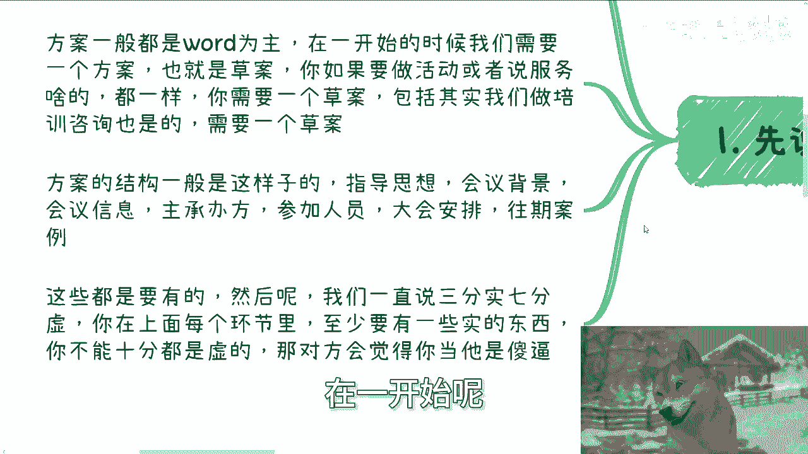
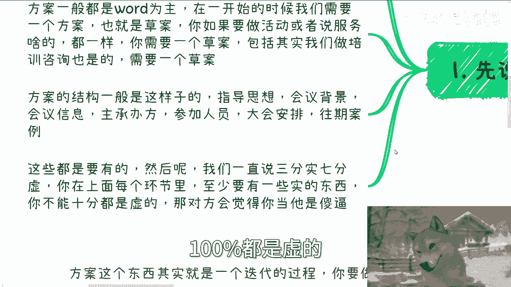
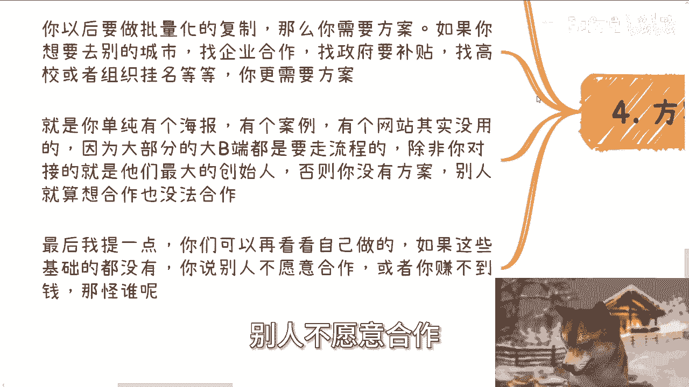
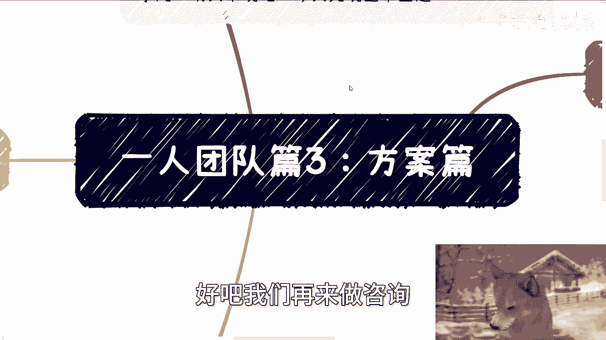

# 一人团队篇3：方案篇 - P1 - 赏味不足 - BV1ZM4m1y7oX

好，大家好，我们继续来更新这个艺人团队片啊。

方案品。呃，其实今天呢我本来是想讲这个赚钱的大忌啊，这里面有一个非常大的一个大忌是什么呢？就是你是个好人啊，当然没事，明天再来说啊，今天先来说这个主题啊。

呃，首先第一个啊，现在说方案结构啊，这个呃首先我说真的，这个我都不太想讲，为什么呢？因为他妈太傻瓜了。

你说一个随便网上搜的到的东西，我来讲它干嘛，还放在充电里面吗？我是傻逼啊，但你想想呢，既然做了这个主题，对吧？送佛送到西，对吧？能不能做还是做一下。😊。

那方案呢一般是以word为主啊，在一开始呢我们需要一个方案，也就是所谓的草案。你如果要做活动呢或者服务啥的啊都一样。比如说你需要一个草案，包括我们要做培训咨询也是一样的啊。

那么方案的结构呢一般是这样子的，指导思想啊，会议背景、会议信息、主承办方参加人员大会安排。这个后面我会给你们拆分开来的啊。😊。

这些都要有啊。然后呢我们一直说啊三分十七分虚。也就是说你在这个word里面，当你写出第一版的时候，你你至少有三30%，对吧？到50%的内容你已经是敲定的啊，那么百剩下50%，你可以是你摇或者怎么样子啊。

你他妈别出现一种情况是啊，你说我都没跟我都没沟通过，我他妈百分之百都是你摇啊，百分之百都是虚的那不行的。

那我跟你讲，你你对方可能不会说你，但他心里面会觉得你是个傻逼。😡，啊，那么第二。我们拆分出来一个来说，首先指导思想啊，比如说以习近平啊新时代中国特色啊社会主义呃思想为指导啊。

深入贯彻落实实习习近平总书记啊什么什么什么啊，反正核心点就是一个就是高举高大。你这个咨询或者培训或者活动一定是要符告诉别人是符合中央思想的啊。第二，会议背景啊。

比如说为全面落实啊党的二十大跟二十届呃二中全会的这个精神啊，然后比如说按照中央经济工作会议和全国两会部署啊反了一大堆啊，就说白了啊，你这个活动会议的这个主旨啊，是要有这个这个对应的这个背景啊。

你要找得到。😊，那么第三就会议信息啊，会议信息里面包含什么呢？会议名称，比如说数字经济大会啊，会议主题比如说啊里面要包含，比如说你你数字经济里面有什么内容嘛，对吧？因为你数字经济太空了。

啊那么包括人工智能啊，对吧？元宇宙啊、区块链啊，对吧？大数据啊啊么都可以啊，你写在会议主题。😊，会议时间啊，就具体的年月日。具体时长。会议地点啊，什么地方啊，会议形式，比如说是那种呃分论坛啊，对吧？😊。

什么展会类型啊啊，还是说是什么啊演讲类型啊，对吧？啊，你会议主会议形式得写清楚啊，包括最后的会议内容啊，就是议程。😊，那么主承办方啊，比如说指导单位是谁，主办单位是谁，联合主办是谁，合作单位是谁。

赞助单位是谁，合合作媒体是谁，对吧？啊，参与人员参与人员也很重要，就是你要告诉大家嗯来的人，比如说年龄段是什么，对吧？他们的背景分别是什么，他们的这个角色分别是什么，对吧？有没有对应的领导，对吧？

领导是大概什么职级的，你都得写清楚啊啊，你包括大会安排啊，有有报道，有主旨演讲会晚宴安排，包括展览各个地方东西啊，这个东西我就不在这个地方都列出来了。反正根据据你具体的需求来啊，那么这是第二点啊。

第三点。😊。

方法方案的迭代方案这个东西啊，其实。

就说白了，你无非就是把一个word啊从这个不确定啊到确定你慢慢慢慢把它迭代出来。啊，那么你要做的就是不停的沟通，不停的更新这个word，然后将其中你要的全部变成确定。然后有的呢索性就是不行的人。

你就把它删掉啊。然后呢，你需要给在这个word里的所有的人以及你想邀请的人要不停的跟新这个word，以告诉大家这个事情是在往前推进的。而且这中间呢我提一点，就是你你作为主办方，你去推定推进没问题。

但是呢往往真的愿意合作的，愿意来做这个事情呢，你会发现他不需要你催他会主动的来跟你跟进这件事情。而如果不主动跟进那些人和机构，往往你到最后发现你是没法合作的。就说白了我我跟你们说穿了。

就是你根本从他身上赚不到一分钱。😊。

啊，那么第四方案的长期效应。这个方案的打磨其实是很重要的。因为方案这个东西从框架来讲都是通用的，就包括这个方案是今天做活动啊，还是做赞助，还是做做议程方案，还是讲师方案，包括嘉宾方案，对吧？

包括一些你的这个品牌方案，对吧？就是你所有的方案其实都是通用的。因为你今天举个例子，你今天做金融，你用这些你明天到了土木，你这方案也可以通用啊，无非里面的内容换一换嘛，对不对？

那么你以后要做批量化的复制。比如说你说哎我上海做完做北京啊，北京做完做哪里对吧？你说我要做批量化的复制，那么你更需要这个方案。如果你要去别的城市做找企业合作，找政府补贴，找高校或者找组织组织挂名。

你就更需要这么一个东西啊，如果你单纯有个海报有个案例，有个网站是没有用的。为什么因为大部分的大弊端，就像我们刚刚说的资本端，企业端，政府端高校端都属于大B端大B端要去走流程。

除非你对接的就是他们最大创始人，比如说阿里巴巴，你对接就马云，对吧？那没问题。否则你没有这么一个方案，别人就算真心想跟你合作，他也没法走流程啊。你明白吗？你单纯一个海报。

一个一个一个一个一个什么网站怎么走流程啊？😡，然后我最后再提一点，你们再仔细去看看我刚刚说的2啊，然后你们如果做过的人，或者你们想做的人，你们再去对比自己做的。如果我二里面所提到这些基础你都没有。

那么你还要抱怨说哎别人不愿意合作，或者你赚不了钱，那他妈怪谁呀，对吧？我还那句话，那他妈怪谁呀？

对不对啊？所以我在上礼拜我感叹过一句话，就是我发现其实真正。靠谱的人很少很少，就是你单纯只要某些程度，某些方面上你是靠谱的，你就肯定能脱颖而出。因为真正这个世界上我发现做事情能够做到。

我不说就说做到什么，出类拔萃啊，就单纯做到能靠谱的基础面能都有的，都他妈很难，对吧？我我不开玩笑跟你们说，也不夸大的说啊，至今。在跟我沟通人里面做过活动或者做过咨询的，能把这些基础信息写满的。

写全的一个都没有，一个都没有。那你还谈啥？但是我话又说回来，你说做这些基础东西，写这些基础东西难吗？啊，是比你读一个学历难，还是说比你解解一个高数难？😡，难吗？他有什么门槛吗？没有。😡。

真的就是要叫做靠谱，叫做脚踏实地。但是我根本就没看到一个脚踏实地的。你们还很多人还在跟我抱怨，哎，难，我都不知道难在什么地方。😊，对不对啊，就是很多时候我们得要承认我们是不靠谱的这没有问题。

但是我们得要朝着靠谱的去进步去努力，而不是说我们呃非常盲目的觉得我操我他妈很靠谱啊，我做了怎怎么怎么怎么就没结果，你做了啥啊，你做了啥？😡，对不对。啊。好吧，你们你们自己到翻到就是倒到二那边。

可以再去看看啊。行，好吧，然后这个方案屏我就说这些啊，我都该列的都给你们列了，就差给你们看他妈的我写的方案了，对吧啊？😊，呃，行吧，那么最后的话就是职业规划，商业规划，包括你们自己跟别人做一些什么事情。

包括你们自己职业上面啊，你们呃在作业过程当中，比如说有些合同啊，分红啊、分润啊，对吧？商业计划书啊、白皮书啊啊，包括这个股权股份啊、期权啊，对吧？包括呃你们希望通过跟我的沟通，能够避免走。

更多的弯路的话，那么你们可以整理好对应的问题跟个人背景。好吧，我们再来走咨询。

