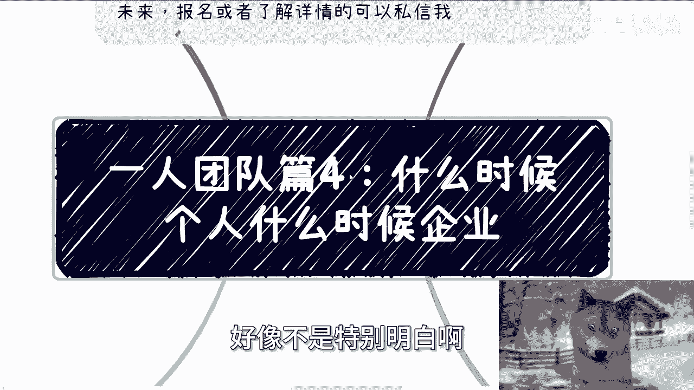
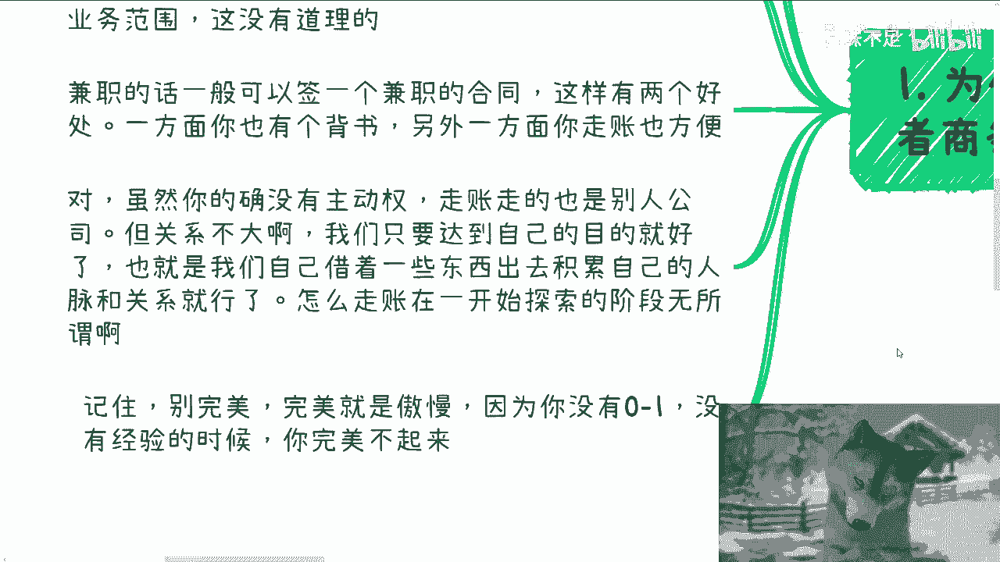
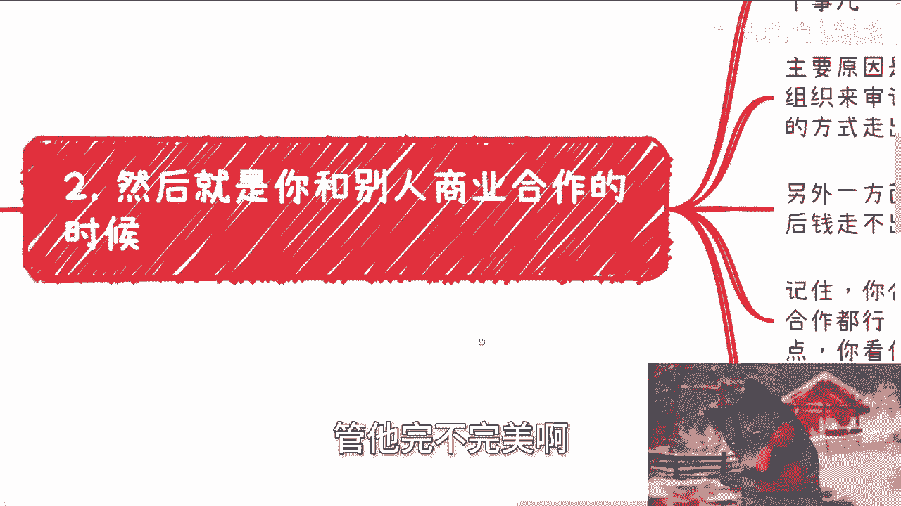
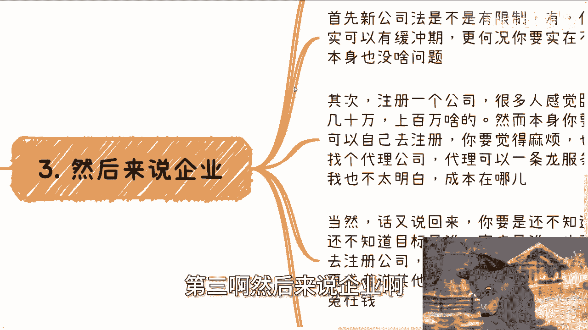

# 一人团队篇4：什么时候个人身份什么时候企业身份 - P1 - 赏味不足 - BV1xW42197WD

好大家好嗯，想了一想呢，还是要给你们卷一下这个充电视频的啊，今天我们来讲的呢是艺人团队四啊，就是很多人哎可能也一直可能有点模糊吧，啊你说他们不明白吗，他们明白的，但是那他们明白吗，好像不是特别明白哈。

就是什么时候应该个人，什么时候应该企业啊，呃首先就是下一期活动已经定了好吧，在嗯8月25号在西安啊，场地我已经定好了呃，位置在西安建筑科技大学李家村附近啊。

大概主题的话呢一个是围绕不同的企业的offer啊，另外一个呢就围绕自媒体跟跨境电商啊，最后呢我会帮大家展望一下这个现状跟未来，好吧，然后报名或者了解详情的呢，可以私信我啊，额那么今天我们讲的这个主题啊。

第一个啊，就是为什么，我一般都说先从兼职市场或者兼职商务切入啊。

因为很简单，因为如果全职的话，你的灵活性不够，你明明需要更多的案例，更多的客户去拓展，比如我们做业务的时候，可以多条线尝试尝试对吧，可以一个二次元to c对吧，就比如说我做一个二次元的业务是to c的。

一个人工智能的业务，可能是to企业的对吧，一个低空经济的义务，可能可能是to政府的对吧好，但是问题是你一旦全职了，你就等于一棵树上吊死了啊，那么既然你想锻炼自己的业务能力。

或者通过业务能力来积累自己的关系，那么你选择一棵全脂的树去吊死，等于一开始就缩小了你的业务范围，这没有道理啊对吧，我本人是不理解这种行为的啊，那么兼职的话呢，一般可以签一个兼职合同，这样有两个好处啊。

一方面你有个背书，另外一方面你可以走账啊，你也比较方便，可以借别人的这个企业来走账啊，对，虽然很多人觉得呢，我说的这种方式呢没有什么主动权啊，走账也是走别人的公司，但是关系不大。

因为我们只要达到自己的目的就好了，也就是我们自己借着一些东西出去，积累自己的人脉跟关系就行了，怎么走，正其实还在一开始探索阶段，并他妈无所吊味，对吧啊，记住啊，我就跟你们讲啊，别完美啊。

完美我曾经跟你们讲过了，完美是什么，完美就是傲慢。

因为你根本就没有0~1，你根本就没有起步，没有经验，追求什么完美。

对不对，就我们就是怎么目达到目的，怎么来这么管他完不完美啊。

然后第二，然后就是你跟别人的这个商业合作的时候啊，其实在这个社会上做商业的时候，你会发现啊，你的合作方往往都会主动跟你聊这个事儿，包括合呃，不会主动跟你聊这个事儿，包括合同啊，包括走账。

主要原因是因为一方面啊，很多的企业都是私企，年底也不会有那些就说官方的一些组织啊对吧，机构啊来来做这个审计啊，那反正就算没合同，这个钱其实也可以通过别的方式走出来，那另外一方面呢，其实走账这个事啊。

你们不用操心，因为最后钱走不出来，着急的是又不是他们，对不对，那钱跟你说啊，我们要通过这个方式走出来啊，我们要交多少税，那着急的是你啊，他们也不着急啊，记住啊，你合作个人企业都可以。

只要对方认怎么合作都行，但是合同一般个人就是20%的，公对私的税点，你就看你想不想出，就这么简单对吧，要么就是说你注册个个体那个个体工商户对吧，网络上就可以注册，那这个时候呢你虽然是个人。

是个是一个个人啊，但是个体工商户呢就相当于是一个企业，你对方可以跟你这个个体工商户去签税点呢，就是走普通的那种b to b的税点。

那肯定会比20%低很多，对第三啊。

然后来说企业啊，我发现很多人呢对企业唉，就对自己注册企业啊，他有很多的误解，就首先新公司法是不是有限制，有但是5年到了之后其实可以有缓冲期，更何况你要实在不行，那他妈就注销本身也没问题对吧。

这合法合规呀，你们自己去看一下嘛，没有什么问题的啊，其次注册一个公司，很多人感到呃感觉卧槽他妈成本很高对吧，几10万上百万，然后本身你们我跟你们说啊，首先啊本身如果你们要觉得不麻烦。

你们完全可以自己去注册对吧，你们花不了几个钱，就就就就就就估计差旅费，劳劳务费就是就是你你你怎么说呢，你你路上花的钱对吧，包括一个注单纯注册的钱，没有几个钱，你要觉得麻烦，也就是花小几千找个代理公司。

那我就这么说，我在上海这边代理公司一年是3600啊，我给你们答直就直接说白一点就3600，那就说明如果他要在里面肯定是有利润的嘛，对吧，那就说明他真的去帮我注册，真的去在里面帮我做一些劳务劳动。

他他妈一年可能1000多都不要，对不对，那代理完全可以一条龙服务啊，还是年一年一收的，我他妈也不明白了，成本在哪里对吧，当然啊，话又说回来，你要是还不知道自己要做什么，还不知道目标是谁，客户是谁。

那你也不要着急，一开始就去注册公司，毕竟每个月你还要报账啊，还要报税啊，如果有些股权变更啊，或者其他事情啊，还是蛮麻烦的，所以我是觉得呢，你要是不清楚目标，不清楚整个的这个怎么说呢。

整个的商业闭环你就没还先，没必要花这个冤枉钱，所以我其实在最早的直播时候，我也跟你们说过，就如果你仅仅需要一个壳子啊，还是那句话，我建议要么就是我一里面说的，要么就是说找朋友借一个，你别自己瞎折腾。

你你你你你想想看，你连结果都不知道，你连这个这个目标都不知道，你你自己折腾，那投入产出比又不高啊。

你折腾这些事对不对啊，那么第四除了一些特殊的业务啊。

企业一般来讲呢就是个必需品，因为嗯怎么说呢，你要往以前说啊，就二零，比如说10年前，15年前，我觉得呃可能还比较好说啊，还比较好说，就个人还比较灵活，但你放到现在吧，企业其实也就懂了，他其实一般来讲啊。

企业是不太愿意跟个人合作的，比如说我们日常沟通当中，别人都会问我们什么企业啊对吧，有没有公众号啊，有没有介绍什么的啊对吧，比如我们如果要去协会商会，企业政府这种那个组织类的啊，你总归是需要企业的。

虽然说逻辑上你从逻辑角度来讲，你说个人能不能签可以签啊，但如果但现在已经2024年了，我觉得越来越少的企业愿意跟个人去签，更别提他妈的一些大企业或者政府了对吧，那个人能签的是什么呢。

基本上就是从业务上啊，真的就基本上就是说比如说咨询啊，这个专家顾问啊，这个这个培训对吧，兼职讲讲兼职讲师了不起了啊，不过就是说这种流程也很烦，你比如说我之前跟北京那个中关村那边，就就是国企单位签的时候。

就是结束之后，他还非要我，我去身份证所在地的税务局局，去开对应的这个发票啊，否则钱是下不来的，那你想想看好了也很烦啊，不过说到最后啊，我还是说那句话，就是只要你关系到位，记住啊，中国这个国家啊。

只要你关系到位，我刚刚就是今天这个视频上面所讲的，所有事情都是形式上的，这形式上的其实都不是问题，毕竟钱怎么出公对私的方式，你要真真的从落地角度来讲，但凡你们有经验的人啊，你们去了解了解，你们就会知道。

真的从落地角度来讲，方式方法多了去了对吧，我们说我们说了那么多条条框框，其实本质上都是水面上的这个这个行为啊，啊你之所以会走这些行为，往往是因为你跟别人不熟啊，所以大家会走到这种表面上的道路啊。

你一旦走表面上的道路就会很烦啊，能明白吗啊所以说呢就说一个人的额。

这个团队啊，在这里面呢就是企业跟个人这个东西呢，可能很多人会很困扰哎呀，但是怎么说呢，就是嗯反正我觉得还是那句话吧，就是说你们一定要记住一点，就是所有的东西呃，在落地的时候，在每个人做不同的业务。

碰到不同的人的时候，绝对不是黑和白的，你明白吗，就不是说标准答案，你说啊诚实说我们对接政府啊，啊这个这个这个个人很难对吧，一定要企业一定要怎么样子，也不是啊对吧，也不一定啊，你要是今天跟别人关系好。

或者说你要是今天真的有些特特别的业务，也没问题啊，你没有企业也完全没问题啊，对不对啊，所以我觉得就是说很多东西，就是不是说我们这个嗯应试教育，或者说我们就是这种应这种科怎么说呢。

教科书是教教科书式的说哦，这个东西一定答案是什么样子的，没有的啊，OKOK行好吧，那就这么着啊，因为在外面比较吵呃好吧，然后那个先这么着吧，然后职业规划好吧，商业规划，然后就是个人的企业啊。

这个股权股权啊，期权啊，股份啊对吧，分红啊，商业计划书啊，白皮书啊啊，包括就是你们在这个过程当中，碰到一些什么样的这个问题啊，包括一些未来的规划，你们希望通过我的一些认知，给你们一些。

更贴近于更接地气的一些规划和建议的话，或者让你们少走点弯路的话，那么你们可以整理好对应的个人问题跟背景。

好吧。