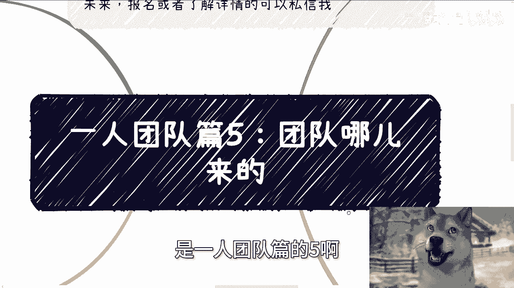
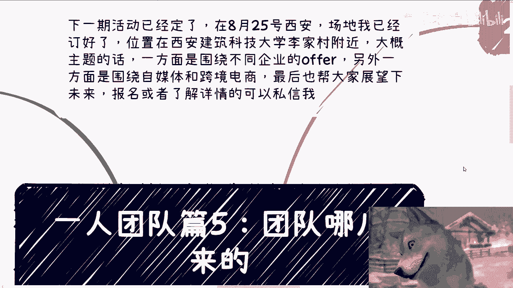
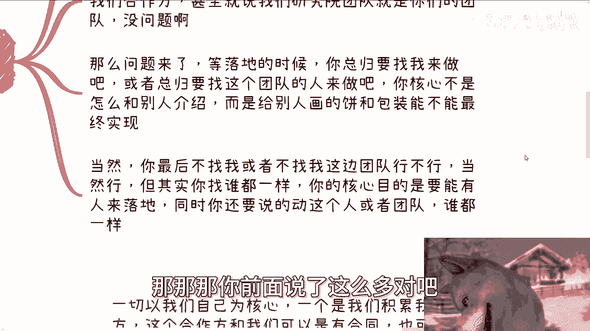

# 一人团队篇5-团队在哪儿呢----P1---赏味不足---BV1DM4m1y7Lb

在本节课中，我们将要学习“一人团队”模式中“团队”的真实含义。我们将探讨团队的本质、如何构建以及如何高效管理，核心在于理解如何在不增加固定成本和管理负担的前提下，利用外部资源来扩展个人能力。

---

## 团队的定义与核心关系

上一节我们介绍了“一人团队”的基本理念，本节中我们来看看“团队”具体指什么。在“一人团队”的语境下，团队绝不能是传统的劳务雇佣关系，也尽量避免与自己的公司签署劳动合同。

**核心原因**：为了追求高投入产出比，必须避免复杂的管理和固定成本。增加全职员工意味着需要处理财务、社保、法务审核等事务，这些管理成本、精力成本和时间成本会严重稀释效率。

**一人团队的本质**是让个人效率最大化。我们与“团队”的关系主要分为以下两种模式：
*   **一对一或一对多关系**：你直接与多个独立的个人或小型团队建立点对点的合作。
*   **一对多对多关系**：你通过一个中间平台或聚合方，间接对接其背后的多个资源方。

---

## 沟通原则：结果导向

以下是关于团队沟通的核心原则，一切沟通都应以实现最终目标为出发点。

你的团队结构、介绍和架构可以灵活描述，关键在于最终能否兑现承诺。例如，你可以将合作伙伴包装为你的“顾问”或“合作方”，这没有问题。但核心挑战在于，你必须有能力找到合适的人或团队，将你“画出的饼”真正实现。如果结果无法落地，前期的一切包装都毫无益处。

---

## 两种合作模式详解

接下来，我们详细解释上述提到的两种核心合作模式。

### 模式一：一对一或一对多关系

在这种模式下，你作为核心，直接积累并管理一个合作方网络。

以下是构建此类网络的关键点：
*   **分类管理**：根据合作方的专长（如咨询培训、软件开发、政府关系、金融、安全等）进行归类。
*   **灵活调用**：面对不同业务需求时，像打牌一样，组合调用不同的合作方。
*   **无绑定关系**：与合作方是项目制合作，无需支付工资或社保，纯粹基于业务需求协作。

### 模式二：一对多对多关系

这种模式涉及通过一个中间层来获取资源。

以下是采用此模式的原因与实例：
*   **接入资源池**：例如，对接一个咨询公司（它背后有大量顾问），或一个软件开发众包平台（它连接了许多开发团队）。
*   **价值在于筛选与可靠性**：中间商赚取差价，但其价值在于他们已经完成了对大量资源的筛选和整合，提供了可信度和备选方案（Plan B, Plan C）。个人很难有时间和精力去建立并维护一个如此庞大且可靠的关系网。
*   **启动的捷径**：对于起步阶段，这是快速获取可靠资源、让业务运转起来的有效方式。

---

## 潜在缺点与应对策略

当然，这种模式也存在缺点，但可以通过策略进行管理和优化。

主要缺点在于合作关系的稳固性可能不足，可能导致业务执行出现波动。应对此缺点的关键是：**通过持续的业务合作来进行筛选和巩固关系**，同时必须建立丰富的备用资源库。

你绝不能只依赖一个合作方。需要为关键环节准备多个备选方案（Plan B, C, D...）。例如，承接一个软件项目，你的第一选择可能是最信任的A团队；如果A团队没空，你可以启动合作过的B团队；如果B团队也不行，你还有接触过的C平台作为选择。这样能有效规避“黑天鹅”事件带来的风险。

---

## 核心总结与行动建议

本节课中我们一起学习了“一人团队”中“团队”的运作哲学。

**核心总结**：
1.  **团队即网络**：“团队”是一个以你为核心、动态调整的外部合作网络，而非固定雇佣的组织。
2.  **效率至上**：避免一切增加固定管理成本的行为（如注册公司雇佣全职），专注于高价值活动。
3.  **结果导向**：对外沟通可以灵活，但对内必须有实现承诺的能力和资源路径。
4.  **双模式驱动**：结合直接合作（一对一/多）和间接合作（一对多对多）模式，灵活获取资源。
5.  **备选方案是关键**：必须建立并维护丰富的备用资源库，以应对不确定性，确保业务连续性。

**行动建议**：你的PPT和团队介绍不应一成不变，而应根据客户和项目类型，灵活展示你的“团队”构成。这些资源的积累，依赖于你日常持续的社交与价值交换。记住，目标是**用最低的综合成本，实现业务目标**，从而解放个人时间，实现真正的效率与财务自由。