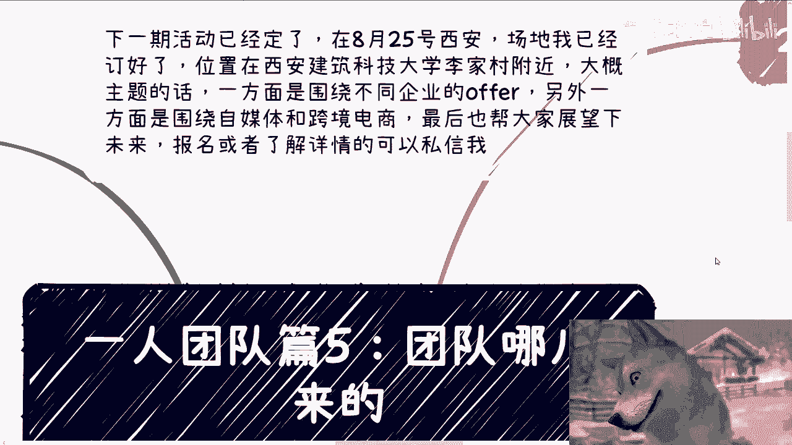
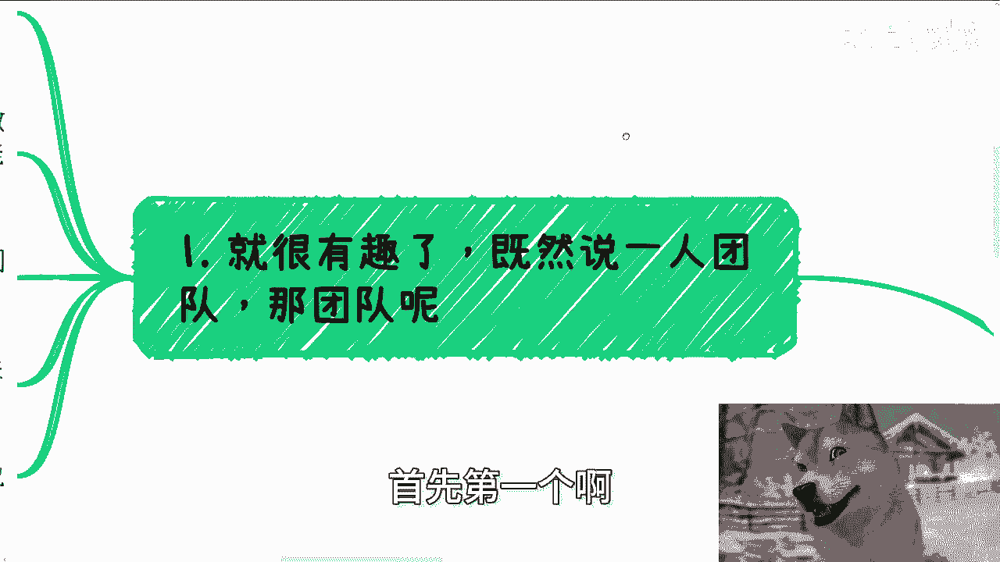
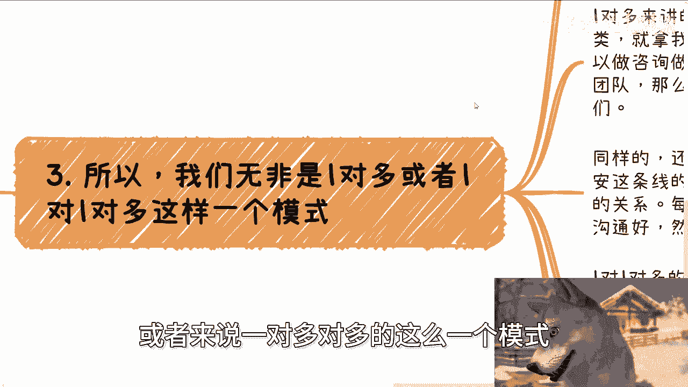
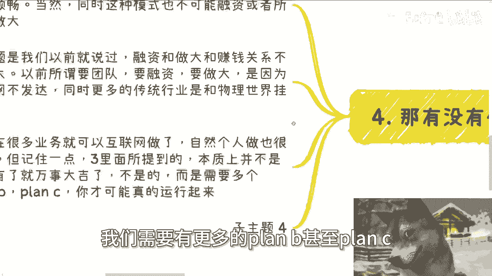

# 一人团队篇5：团队在哪儿呢？ - P1 - 赏味不足 - BV1DM4m1y7Lb

好大家好啊，那又是我对吧，只不过我换了个美瞳对吧，看到没有啊。

跟刚刚颜色不一样啊，呃今天我们来讲的呢是艺人团队篇的五啊。

那么也是个非常核心的一个主题啊，因为哼这当中有个悖论嘛对吧。

就一个人跟团队嘛对吧，那么第五第五个，今天这个主题呢就讲的就是说团队啊。

到底是什么，然后团队是哪来的啊，那么首先呢下期活动已经定了啊，8月25号本周日啊，在西安，在西安，那么场地呢我已经定好了，位置在西安建筑科技大学李家村这个站附近啊，那么大概主题的话呢。

一个是围绕不同的就是国央企啊，民企啊啊外企啊这些offer啊，另外一个呢就围绕自媒体啊，和跨境电商这么一个主题，还有呢就帮大家展望一下，现在跟未来报名或者了解详情的。

可以私信我啊，首先第一个啊。

这就很有趣啊，既然说艺人团队，那么团队到底是什么啊，那咱就这么说啊，但团队绝对不能是劳务关系，也尽量不要跟你自己的公司签署，对应的坚持合同，为什么，因为麻烦对吧，就既然我们要去赚钱。

我们要做的事情就是那个高投入产出比的啊，一旦跟你什么什么自己还找个财务，找个什么东西，哎我跟你讲，妈的拉拉他妈倒吧啊，那么这就好像很多人问我，他说陈老师啊，为什么你不招人，为什么你不做社群，哎我的妈。

我奇了怪了，我为啥要招人，我能招人能赚钱吗，能多赚钱吗，不能啊，那我为啥要做社群呢，要做社群，他妈我还得管理，那么有锅还得我来背啊，我能赚钱吗，也不能，那或者来说也不确定，那我为什么要做呢。

那么奇了怪了，对不对啊，那么一个人的团队的本质是什么，就是要让效率最大化，那么我们的团队跟我们应该就只有两种关系，我在这地方列的很清楚，一个叫做一对一或者一对多的关系。

一个就是一对一对多或者一对多对多的关系啊，那么这个后面我会来跟你们解释的啊，那么第二所有的沟通呢都是结果导向的，什么意思啊，意思就是说你在沟通当中，你团队的结构，你团队的介绍，你团队架构你想怎么说都行。

只要你最后能兑现，能实现就行，这就好像你说哎你出去沟通啊，你把陈老师把你把我啊变成你们的顾问，你把我这边研究院变成你们合作方，甚至你就说啊，我们他妈研究院团队，就你们团队有没有问题没问题啊。

你可以不经得不不经过我同意啊，无所谓啊，对不对，那问题来了呀，等你最终总归要落地吧啦别人给你钱，你总归要把这个事情搂圆了吧，对不对，那你终最终总归是要来找我吧，或者你不找我也行。

总归要找这个团队人来做吧，对不对，所以说你核心不是怎么跟别人介绍，而是怎么把给你，怎么将给别人画的饼跟包装，你最终要把它圆回来，你最终要能实现，这就是你的本事，对不对啊，那当然你最后不找我或者不找我。

这边团队也行啊对吧，但但但其实不重要啊，因为你找谁都一样，因为你的核心目的不是来找我，而是要你要找一个人或者找一个团队，得要把你吹出的牛逼去搂圆了，对不对，同时你还要说得动这个人或团队。

那那那你前面说了这么多对吧。

你要是最终这个结果落不下来，那那对你有什么好处呢，你想想看是不是啊，第三所以啊就我要来跟你们解释一下，就是说合作这个当中无非就是一对多，或者来说一对多对多的这么一个模式啊。

那么一切呢以我们自己为核心啊，一个就是积累我们的合作方，这个合作方跟我们呢可以是有合同的，当然也可以没有合同啊，无所谓，因为其实但凡只要合作过，有没有合同都一样，你包括我现在身边有很多合作方。

哪他妈有合同有毛病啊对吧，那大家能干事就行，那么一对多来讲的话呢，就是说我们需要对不同的合作方去归类，你就拿我来讲，我在整个圆的当中啊，那么我身边的人有的人跟我一样是做咨询，做培训的。

那么他们就是我的工具人，我知道他们每个人能力是什么，以及在什么赛道可以做对吧，那有的团队呢就是做开发团队对吧，那么就就当有软件需求，有软件外包或者做相关软件东西的时候，OK那我会找到他们。

那这些人跟我其实都是合作关系，但是我也不需要为他们发工资，我也不需要为他们交社保，对不对，那这叫什么，这叫一对一或者一对多啊，那么同样的还有别的城市专门做政府关系的，有的是做公安的，有的专门做安全的。

有的专门做呃呃呃农业的，有的专门做金融的，其实跟我都是点对点的关系，就是相当于是我都能直接找得到对吧，那么每次谈不同的业务，我就会找不同的人沟通好，然后写到所谓的团队里面。

就是看到不同的业务打不同的牌吗，啊其实也就好了，那么以上这个叫做一对一或一对多的关系啊，那么接下来一对多对多的关系，或者一对一对多的关系是什么意思呢，就比如说我们要找找顾问对吧好。

那么我们对接的不是直接对接顾问，而是对接整个一个咨询公司，比如说这咨询公司下面他妈有100个顾问对吧，那么我们就对接这个咨询公司，比如说我们要开发团队，那么我们对接的不是单个开发团队。

可能是一个管理多个开发团队的，这么一个中间商或者聚合平台啊，那么很多人又要说了，那那你这个找的不就是个中间商嘛对吧，赚差价哼他但你们有没有想过一个问题啊，很多时候这个差价的确别人能赚，为什么。

因为我就问你们，难道你们每一个人都认为自己就能够，天时地利人和的找到那么可靠的，可信的那么多人或者开所谓的团队合作吗，你能吗，你不能啊，对不对，你哪来的自信啊，那你既然不能的话，你又找不到这么多。

plan b plan c就是所谓的这个叫做备选方案的时候，你不只能去找这种中间商吗，对不对，那你按照你这个说法，你说啊，那我不找，那你不找怎么地啊，你不找你，你就永远不起步，永远不去赚钱。

永远永远去去去去去找嘛，那你们不得被被憋死吗，啊那么第四这有没有什么缺点，当然有啊，首先你一对多或者一对多对多的时候，关系可能不牢靠，会导致你的业务做的时候不是那么顺畅，但是同样的这就是个相辅相成的。

因为关系牢不牢靠，其实就是需要通过不停的通过那个业务，来做筛选，那靠嘴说是没有用的啊，当然这种模式呃，我说的这种一个人的模式啊，也不可能去融资，或者说所谓做大啊，但问题是我们以前就说过啊。

融资跟做大和赚钱关系不是很大，因为以前所谓要团队要融资，要做大，是因为以前互联网不发达，同时更多的这种啊产业它是跟物理空间有关的，比如说通过一些地推啊对吧，通过一些其他的这种东西哦，都是有关的。

哎我的狗子怎么不动啊，好对吧，都是有关的，那么但是问题是现在你互联网这么发达了哦，那么自然个人能做的事情就很多了，但记住一点，我们刚刚在三里面所提到的这些东西，本质上并不是你真的今天有了。

比如说你今天诶的确找到了，找到了若干个人啊，能够给你做讲师，或者找到了一些团队，能够给你来做供应商，并不是你找到了就感觉卧槽牛逼了，不是的，而是你的你需要非常多的plan b plan c。

也就是说我们所谓的信任方，你一个不够，为什么，因为总有些黑天鹅事件出现的呀，对不对，那你就打比方来说，你跟我合作对吧，你说爱超市很靠谱对是你给我教，你只要有东西对吧，大家把利益谈妥。

你给我一个deadline，我肯定能帮你做出来，但问题是这个取决于我没事的情况下面，那万一到那个时候，有一个有一个这个这个厅局对吧，或者哪里把我呼唤过去，有些不可抗力，那怎么办呢，我只能放你鸽子。

那按照你这个说法，我放你鸽子的时候，那你怎么办，对不对，所以说你我们在做任何东西，尤其是这个所谓的艺人团队的时候，我们需要有更多的plan b甚至plan c甚至plan d对吧。

这就好像我今天手上啊，人家给我给我，我给我说一个需求对吧，说软件需求或者供应需求是我第一优先级，肯定是找那个研究院，找我那个合作的团队，那如果他没有，OK啊，我还有plan b啊，我在上海这边。

还有一些这个合作方创业的，也有自己的开发团队，如果他们不行哦，这也OK啊，那我再去找南京那边的对吧，都有啊，只不过就是说日常的这种合作，或者大家的这种怎么说呢，关系度可能是递减的。

而不是说大家跟我关系都那么好，或者都那么熟对吧，相对来讲，我去找那个研究院，可能我的信任度是更高的，就仅仅此而已，但是我不可能在一棵树上吊死哦，所以说你们尤其在做艺人团队的时候，你们要记住跟别人谈东西。

你们的PPT和你们的介绍绝对不可能一成不变的，看对方是谁，你们写是怎么样的团队哦，但是这些资源怎么接触，怎呃怎么接触，怎么去积累，这个就得看你们日常的这个社交了，你们能明白吗。

哦而核心点啊为什么不去注册呃，比如说为什么呃不去什么什么要要全职员工，为什么不交社保啊，为什么没有些劳务关系，很简单，就是为了省成本，把那些有的没的，因为你要记住一点，成本这个东西不是只有钱才叫成本的。

管理成本，经精力的成本，时间成本都叫成本，你何必呢，对不对，何必呢，啊你们真的去做过事情，你们就会明白了，就是说就是单纯，可能每天有个什么这种法务的合同的审核啊，对吧。

那边有个什么什么什么什么财务的审核，或者怎么样子，卧槽半天就去掉了，那那那我就问了，你每天在那边早上也忙，下午也忙，那你跟打工有什么区别呢，我们为的不就是要赚钱，然后把自己的时间解放出来吗。

哦你到最后嘛钱赚不赚到也还不知道，每天他妈忙成狗，忙成我这只汪，那那有什么意义，对不对啊，行好吧，那就这么着啊，然后那个活动好吧，本周日啊，25号在西安啊，在西安要报名和这个这个了解详情的。

可以继续私信我啊，然后剩下的话就说是那个职业规划啊，商业规划，包括你们呃这个日常的工作当中啊对吧，包括主业副业啊，这个当中啊，啊包括你们在这里面涉及到一些分红分润啊，呃分红丰润啊，或者说合同啊。

或者这个呃，就股权股份啊等等等啊，反正就是相关的，你们希望通过我的一些认知，给你们一些更贴近地区的一些建议或者规划，同时额让你们少走点弯路的话，那么你们可以整理好对应的问题和个人背景，好吧。

