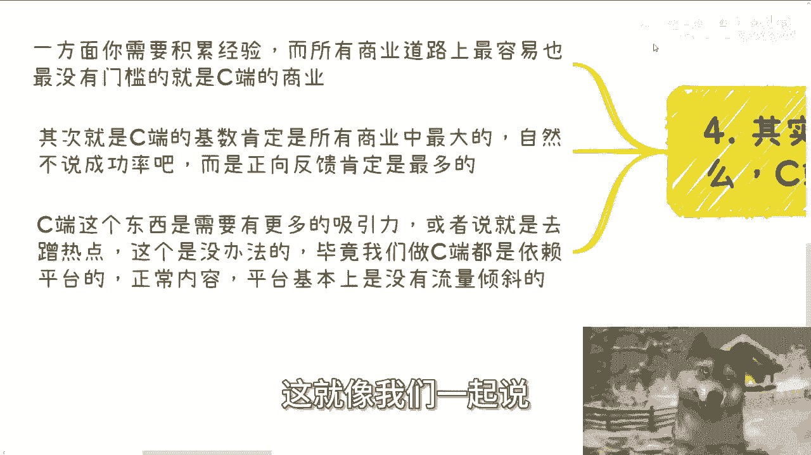
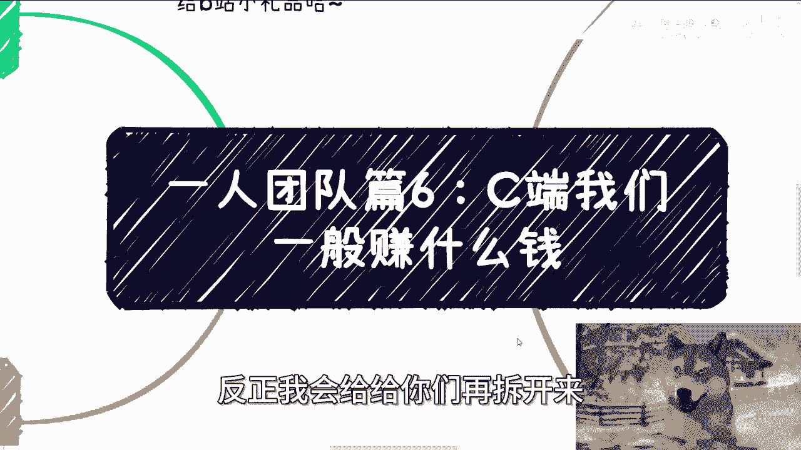

# 一人团队篇6：C端赚钱的关注点 - P1 - 赏味不足 - BV1vbsEeAEzF

好大家好啊，今天我们继续来讲艺人团队篇啊，呃第六啊是什么呢，是C端，我们一般赚的是什么钱啊，呃我本来是想把艺人团队里面就是CBG，还有高校什么放在一起的，我后来想想不行啊。

可能这个讲的太浅，我我还是把每个都分开来啊，呃首先下一期活动已经定了，9月8号在上海好吧，然后本期是2024年的第二期，数字经济大会啊，那么详情的话呢，可以见评论区的这次的免费视频。

那我就不多赘述赘述了，好吧，呃就提一点啊，前35名会我会给那个B站的小礼品好吧，感谢B站的赞助啊，那么首先啊我在这个地方先提一嘴啊，就是你们记住一点，如果我们要去赚这赚的钱，C端核心如果要赚钱的话啊。

就几个，一个是你的用户对象一定要定清楚，我后面会跟会会展开说的啊，第二个就是说你给他提供的这个服务，到底是不是刚需。

就这两点啊，那么第一，艺人团队理论上的确赚C端的钱最合适，当然啊，一个人的团队并不是说只能一个人做啊，并就是说无非就是说不雇佣，不不在不雇佣别人的情况下面，不要另外花钱去付工资的情况下面。

但是你依然是可以通过分润的方式，跟别人合作的啊，那不要去就是死脑筋，觉得我，我就一个人对吧啊，然后C端这个事呢，我以前也说过，宏观宏观来讲啊，一个是玄学，一个是心理疗愈对吧，心理鸡汤。

另外一个就是副业赚钱，这三个东西是跑不了的，但是啊接下来其实还有个机会，因为明年开始往后啊，可能会持续两三年，有可能34年就每年应届生会越来越多，尤其是前两年疫情挤在那边，本科出来多做鸵鸟的硕士啊。

然后呢他们会惊奇的发现，他们硕士毕业出来，就跟他们当年本科出来的情况一模一样啊，甚至比当年本科出来的情况还要糟糕啊，但这个事情他们没有办法控制啊，这就是井喷式的一个情况，但本质上没有这么多的岗位。

怎么办呢啊但当然在这个地方我也说了，这个怎么办，这不是我们要考虑的，我们解决不了这个问题，这个是整个社会，这个是政府要要要去解决的，我们要考虑的是什么，我们可以去做卖水卖铲子的工作。

比如说啊你可以联合一些hr或者猎头，给他们去找工作，吃吃推荐费还是很香的啊，有一说一这这找工作也有很多种嘛对吧，你说找创业公司的，找大公司的，找外包的啊，都可以呀对吧。

你甚至是包括就是说我给你们讲一个啊，就在商业当中也有个，还还有个很常见的一个操作方式啊，就是中国从各地方省市区啊，下面其实有非常多的，我们叫做活动的这个需求嘛，对不对，但是你们有没有想过。

我们一直说做活动，做活动有需求吗，有的，但是其实还有一个需求是什么，就是活动现场要来人啊，那我再说的直白点就托啊，对不对，那问题来了，你说哎地方管委会，地方政府，地方的一些一些如果你就三五十人。

那无所谓啊，要是两三百人呢，这托好找吗，不好找，那你可以帮忙找啊，对不对，你可以联系联合大学生，你可以联合C端去，也是一样的，去满足政府，满足对应的需求啊，其实这也是C端的服务，没有问题的呀，对不对。

因为本质上你你看啊，虽然你是满族企业端政府端的需求，但是你其实是本质上是围绕C端在做，在做社群，因为你其实是在给C端创造，比如说活动创造，给政府创造给企业接触的机会，对不对，有什么问题呢。

一样也是C端的业务嘛，对吧就你们做很多东西时候你得灵活，你不要想着就说哦C端服务啊，就是做自媒体，就是麦克，不是的，它不仅仅只有这个东西啊。

然后呢在这个地方我刚刚也强调过，就C端主要的就是人群跟需求啊，一定要定位清楚啊，第二我们一直说C端，一直说是C端啊。

但是并不是说散户就是C端啊，他不能一概而论啊，也就是说你要定义清楚，当然一开始我觉得你不用太细，比如说你说啊，我把性别啊，年龄段啊，职业啊，什么东西啊啊，包括他可能是里面什么岗位对吧。

然后什么领域我觉得不用真不用，你定了也没卵用，因为你就算把它分的很清楚，你也无法精准的去触及到它们有什么用呢，对不对，你要的是先把雪球滚起来，先把钱赚起来，你再去细分，但是粗的你要去分。

比如说啊C端很大一部分群体就是大学生对吧，那么你可以提供什么呢，提供相亲，提供买卖游戏装备对吧，提供比如说现在大学生呃，里面也就就就咱咱就说难听点啊，就是说大学生里面会攀比的东西对吧。

或者说他们在乎的东西对吧，因为你有了攀比，有了在乎，有了社交圈，他才你才有可能赚钱嘛啊那包括呃出国啊，包括写paper啊，包括还有一些灰色收入对吧，那我就不去说了，都可以啊，不是擦边的啊，不是擦边的。

我不不是不是说黄赌毒啊，黄赌毒咱别去做啊，还有土老板啊，土老板也是一个很重要的C端的一部分啊，当然你也可以不是土老板，更多的是什么呢，是做传统行业的那些中年人，为什么啊，在这个地方你会看到。

我强调的是做传统行业的中年人，而不是互联网，传互联网行业的中年人，为什么，因为传统行业的中年人往往真的是有钱的，而且他们有闲，而互联网的中年人，我以前就说过，他们的钱。

他妈的全部扔到孩子的教育跟房贷当中去，你懂吗，就是你想往他们身上去赚钱很难，而且更何况中国本身，互联网的从业人员并不多啊，基础并不多，那么呃我们又回到这边啊，就传统行业的这些中年人。

这些人其实在经济不好的时候，我们提供的是什么呢，我们可以提供给他们一些，比如说什么新的领域的对吧，科普性的，不要有任何深度的东西，因为他们不懂啊啊然后同时再加旅游的模式，就有钱有闲啊，对不对。

那我我我我们我们再说直白一点对吧，有很多人出来他要找个借口吧对吧，那那他他总不可能呃这个这个跟家里人说啊，我出去旅游啊，旅游对吧，哎呦我的，人家觉得不太好，那你要给他个借口啊，那借口怎么来呢，对吧哦。

我们参加一些培训，参加一些前沿技术的发展对吧，然后你你给他去提供个旅游，那有什么不好呢，当然啊在这个地方我得提一点啊，就是你们不要把这些想的太复杂，不是说啊好像你说22是说要旅游对吧。

我们要去弄个跟团跟什么东西，不是你明白吗，就是我的意思是什么呢，意思就是说举个例子啊，比如说你做三天的培训，那你给他安排的可能就是半天一天的培训，另外两天你就让他，你就给他安排些玩的地方。

你他要是你也可以让他选择，如果不玩的话，他可以自由活动，对不对，这不是大家的需求吗，你把他绑过来学习干嘛呢，谁他妈要学习啊，是吧啊，还有就是那种25岁到35岁的，就是有一定工作经验啊。

但是随着大趋势早晚都要失业的啊，那不好意思，我就这么直白，因为这事情不是我能左右，也不是你们能左右的，我们认清楚事实有什么不好呢，对不对啊，呃被动失业的，其实呢，其实我们也可以提供更多的一些社交机会。

或者说低门槛的合作机会，因为我们就这么说，对于大部分25岁到35岁的人来讲，他其实是没有社交能，就是没有社交经验的，他也没有社交的机会，他甚至不知道到哪里去社交，对不对，那我们可以提供给他们这些机会啊。

在这里关于就是说未成年人的一些学科啊，或者技能培训啊，或者出国等等啊，这类服务，我说实话我不是特别建议做，为什么，因为你们做这种那个服务的时候，你们会往往会发现你的受众是孩子，但父亲是他们的家长。

也就意味着你的受众跟付钱的对象，他是两类对象，那么它这个模式它会大大增加你的沟通成本啊，所以说一般而言啊，我不建议去做，除非就是说你的课单价提的特别高啊，比如说你说啊，我可能这个课呃。

这个家长付付就是两三万，23万45万45万付的，那没问题哦，你要是是那种什么小几百啊，小几千啊，然后你去做这个东西，想走量哎呀不行，真的不行啊，第3C端的钱呢，记住啊，大体就分成两类。

一类就是我一直强调的情绪价值，但是这个地方啊你们要明白，所有的人情绪价值都是有缺失的，但是呢你们不要太去想太多，因为他们的缺失不是我们造成的，这就像我现在说的，大家都有赚钱的焦虑。

大家都有工作不稳定的焦虑，但这个包括学历的焦虑，这他妈是我们造成的，又不是我们造成的，关我们吊事啊，对不对，但是我们可以去满足这些情绪价值，你满足不了，如果你没有这个能力。

那你可以找有能力的人一起来合作满足，有什么关系呢，对不对啊，另外一类就是这个社会这个国家在某些规则下，它是有刚需存在的，那么这类我们可以反推去提供服务，甚至做一些竞赛，我们举个例子啊，第一个情绪价值。

就好像比如说为什么很多人会去小红书啊，抖音上面开始做什么失业分享啊，开始做什么啊，兼自己兼职的这个这个工作的分享对吧，就等等等啊，你你会发现就是很多人呢，以前可能想着就是说哎。

我是不是呃分享一些技能对吧，或者怎么样子，唉现在就会发现哎我的，很多人就是把失业把他日常的一些生活对吧，就就变成分享，而且能引引起很多共鸣，为什么，因为表面你你们想看，你们从第三方的视角来讲啊。

就是表面他分享的是一个对应的经历啊，对应的这个这个实际情况，但是实际上满足的是广大普罗大众，甚至是跟自己一样的这类人群的这个情绪价值，情绪价值是个很虚的词，因为我们就随便怎么说啊，比如说有人失业了。

他今天讲了一个案例，或者就说一下自己，你说流量如果很多，为什么，难道真的是因为大家同情他，难道真的是因为大家有共情吗，不是的，你就这么想，10%同情，10%共情，10%看热闹，10%是过来嘲笑的。

10%过来讽刺的，10%为了看到别人失败，让自己舒服的，但是你甭管对方来是什么目的，你终究还是满足了对方的情绪价值，你说对不对对吧，你你你管他什么情绪价值，这他妈都叫情绪价值啊，而很多做培训的呢。

尤其是小孩子啊，我一直跟他们讲，琴棋书画这种，你都是要去跟考级跟升学挂钩起来的，那也就是说我不管你到底做什么内容方向，但是你一定这个内容方向，要跟所谓的国家认可的证书，或者升学去联系起来啊，就升学。

比如说某些东西有加分对吧，或者说有些特殊的这个领域，可能有加分或者怎么样的，你一定要联系起来，包括有很多艺考对吧，怎么样子，你如果联系不起来，那我跟你讲，你就尽量少做。

你就先去寻找那些联系的起来的合作方，然后再去做，你不要联系不起来。

又没有刚需，再去硬做没有意义的啊，那么第四点，其实在我看来，无论你做什么C端的生意呢，是一定要做的。

因为你想啊，一方面你需要积累这方面的经验，对不对，而所有的商业道路上面，最容易的以及最没有门槛的，以及你能够控制的是什么C端啊，其次就是C段的基数，肯定是所有商业当中最大的。

我们不是说你你你就一定成功啊，而是说你能够更大概率的得到正反馈，而不至于说一天到晚在那边失败失败，失败失败失败，然后吃闭门羹对吧，那也会打打击你的自信心啊，那么同样的最后一点。

C端这个东西它需要有更多的吸引力，或者还是说就是说你需要去蹭热点，这个是没有办法的，毕竟我们做C端都是依赖平台的，我们就这么说，B站抖音微博快手啊，小红书视频号，你现在不去蹭热点，不去引爆一些。

怎么说呢，比如说啊男女对立啊，或者其他东西，我不是说一定要往这方面，我就举个例子啊，你不去蹭热点怎么样子，正常内容平台上没有流量倾斜的对吧，这就像我们以前说一以前说的。

就是你可能会觉得卧槽他妈的，这情况的确是很有趣对吧，就是说或者来说就就非常的价值观可能不太正。

或者怎么样子，那问题是你我就是一颗尘埃，正不正不是我们能决定的对吧，你就像我现在为什么会跟你们这样讲，是因为我希望你们当中有有缘人对吧，或者有悟性的人，你们在这当中只要找到一亩三分地先生存下去，对不对。

你想价值观正的吧，可以的，你想做你想做的东西对吧，可以的，你先生存下去以后，你再慢慢做一些价值观正的事情吧，对不对，啊行好吧，然后C端这个东西我就讲这么一些哦，大家可以再去想想吧，后面我会把B端G端啊。

包括那个高校，反正我会给给你们再拆开来。

好吧啊行好吧，就这么着啊，然后那个嗯那个活动报名好吧，然后你们继续看，剩下的话就是说啊职业规划，商业规划啊，就工作当中啊，包括未来的职业发展啊，商业发展啊，你们希望呃通过跟我的一些呃这个沟通啊。

然后呃希望让我能够给你们一些，更接地气的规划，或者说能够让你们少走一些弯路的话，那么你们可以整理好对应的额问题，跟个人背景好吧，我们再来走咨询好啊。

