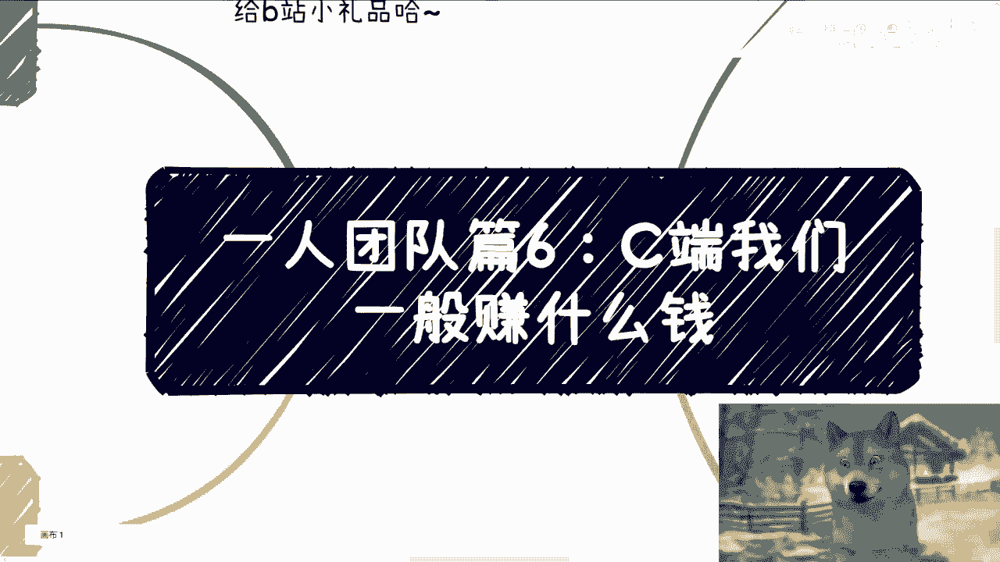
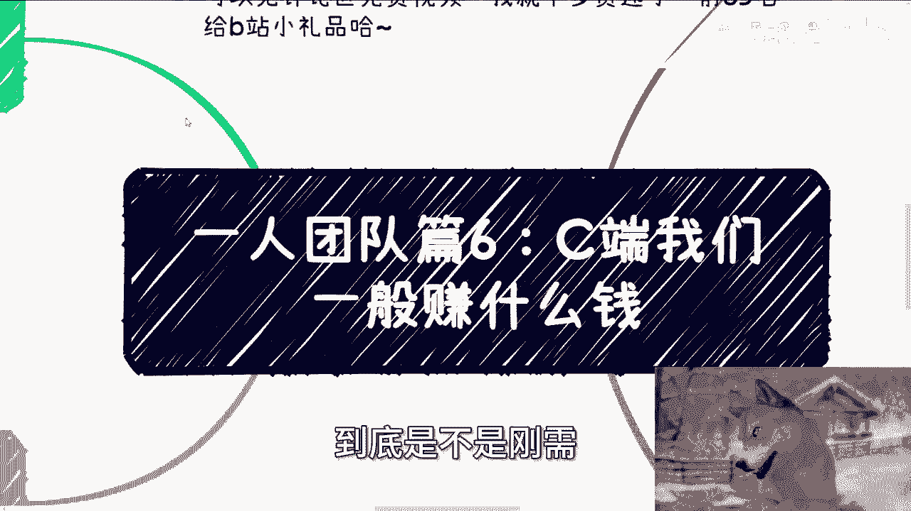
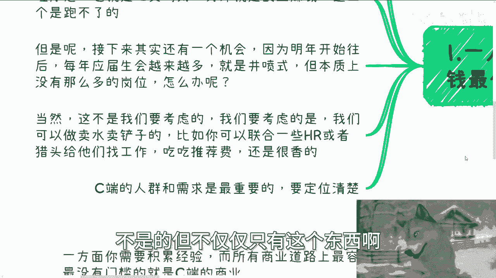
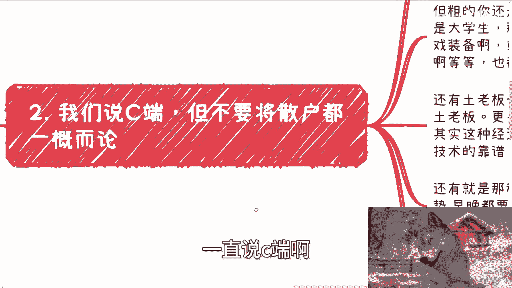
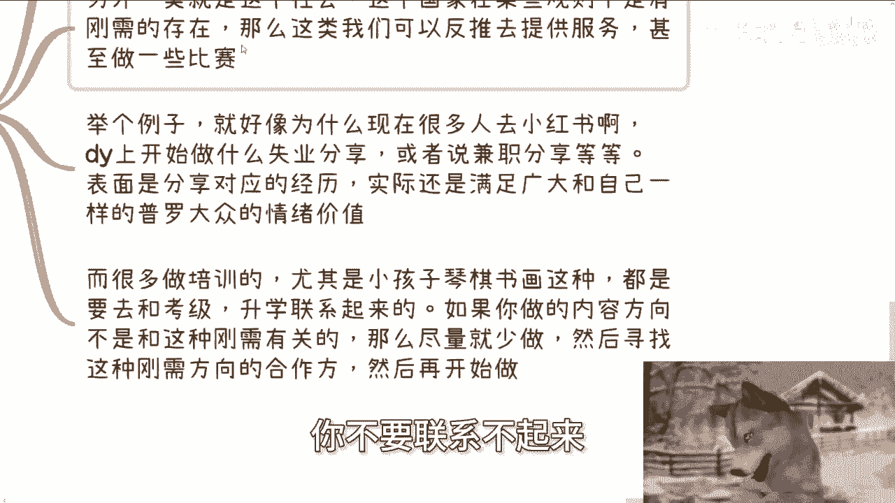
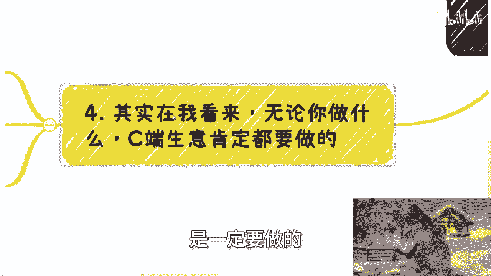
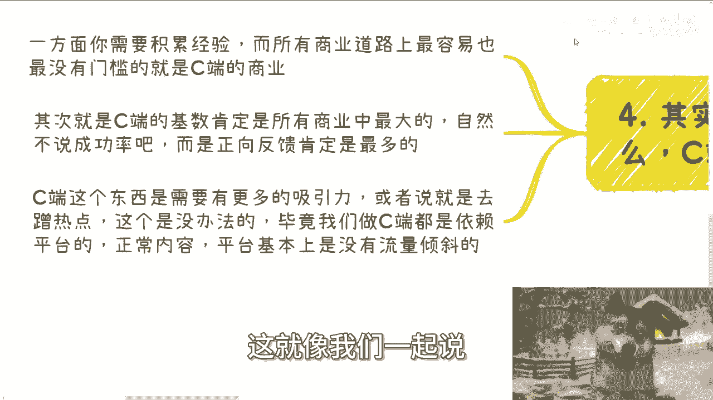
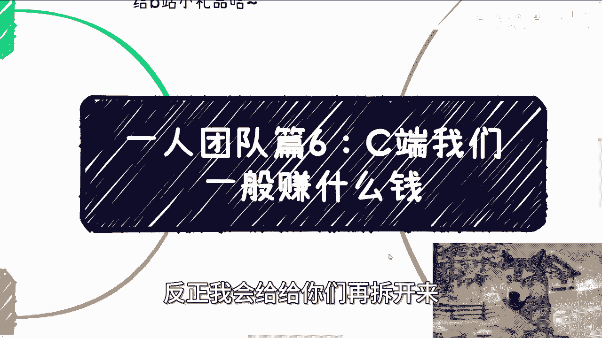

# 一人团队篇6：C端赚钱的关注点 💰

在本节课中，我们将要学习如何为个人或小型团队（一人团队）规划面向消费者（C端）的盈利方向。我们将重点探讨目标人群的定位、需求的判断，以及如何设计可行的服务模式。

---

## 概述

面向C端（消费者）赚钱，是个人或小型团队最常见的起步方式。其核心在于明确两点：**服务对象**与**需求刚性**。本节将围绕这两个核心，展开讲解如何识别机会并设计服务。

---

## 一、C端业务的基本逻辑与拓展思路

上一节我们介绍了C端业务的核心是用户与需求。本节中我们来看看如何灵活地开展C端业务。

首先，一人团队并非只能单打独斗。在不雇佣全职员工、不支付固定工资的前提下，依然可以通过**分润合作**的方式与他人联手。不要僵化地认为“一人团队”就必须所有事亲力亲为。

从宏观趋势看，面向C端的服务有几个经久不衰的方向：玄学、心理疗愈（或心灵鸡汤）、以及副业赚钱指导。此外，未来几年还有一个潜在机会：由于高校毕业生数量持续井喷，就业市场竞争将异常激烈。

我们无法解决社会性的就业难题，但可以成为“卖水人”或“卖铲人”，提供相关服务。例如：
*   联合HR或猎头，为求职者提供岗位推荐服务并赚取推荐费。
*   为企业或政府的大型活动招募现场参与者（即“充场”人员），可以联合大学生社群来满足此类需求。

虽然这些服务最终满足的是B端（企业）或G端（政府）的需求，但其本质是**围绕C端人群构建社群并创造价值**（如活动参与、与企业接触的机会）。这同样是有效的C端业务模式。做业务需要灵活，C端服务远不止做自媒体和卖课。

---

## 二、如何定位C端目标人群

明确了业务逻辑后，我们需要锁定具体的服务对象。定位目标人群是成功的关键。

“C端”不能简单等同于“散户”。你需要进行初步的群体划分，但初期不必过于细致（如精确到性别、具体岗位），因为精准触达的成本很高。正确的做法是：先进行**粗分类**，把业务跑起来、赚到钱，再根据反馈逐步细化。

以下是几个值得关注的C端群体及其潜在需求：

*   **大学生群体**：需求可能包括校园社交（如相亲）、虚拟物品交易（如游戏装备）、应对同辈压力的产品/服务、出国咨询、论文辅导等。
*   **传统行业中年人/“土老板”**：他们通常有积蓄且有闲暇时间。可以为他们提供新领域（如科技、投资）的**浅层科普**（无需深度），并结合**旅游、游学**等形式。关键是为他们的出行提供一个“正当理由”（如参加行业培训、考察前沿技术）。
*   **25-35岁的职场人**：这部分人群面临潜在的失业风险，且普遍缺乏社交渠道与经验。可以为他们提供**低门槛的社交机会**或**轻量级的项目合作机会**。

**需要注意**：针对未成年人的学科培训、技能培训或出国留学等服务，其服务对象（孩子）与付费对象（家长）是分离的，这会**显著增加沟通成本**。除非客单价能提到足够高（如数万元），否则不建议新手涉足。

---

## 三、C端需求的两大类型：情绪价值与规则刚需

定位了人群，接下来要分析他们的需求。C端的付费需求大体可分为两类。

**第一类是情绪价值**。现代社会普遍存在焦虑（赚钱焦虑、职业焦虑、学历焦虑），这些情绪缺口并非我们造成，但我们可以提供产品或服务来满足它。如果你自身不擅长此道，可以寻找合作伙伴共同完成。

**情绪价值**的表现形式多样。例如，社交媒体上分享失业经历、兼职生活的内容之所以能引发共鸣和流量，正是因为满足了围观者的各种情绪——无论是同情、共情、看热闹、寻找安慰还是获得优越感。

**第二类是社会规则下的刚需**。这类需求明确，且常与官方认证、升学、考级等挂钩。例如，针对青少年的琴棋书画培训，必须与**考级、升学加分或特长生招生**等刚性目标关联起来。做这类业务，首先要找到能与这些“硬指标”挂钩的合作方或资源，否则很难成功。

---

## 四、C端业务的必要性与运营要点

最后，我们来谈谈为什么一定要尝试C端业务，以及运营中的关键点。

无论你的长期目标是什么，**从C端业务起步都是必要的**。因为这是所有商业路径中**门槛最低、最容易控制、且用户基数最大**的领域。它能让你更大概率地获得正反馈，避免因屡屡失败而打击自信心。

同时，C端业务高度依赖流量平台（如B站、抖音、小红书等）。在运营中，**蹭热点、制造话题**几乎是不可避免的。平台算法会向有争议性或高热度的内容倾斜流量。这并不是鼓励大家传播不正的价值观，而是作为一个起步阶段的“尘埃”，需要先生存下来，获得一席之地后，再逐步去做自己真正认可的、有价值的内容。

---

## 总结

本节课中我们一起学习了面向C端赚钱的核心关注点。我们明确了C端业务成功的关键在于**精准定位人群**和**判断需求刚性**。我们探讨了大学生、传统行业中年人、职场青年等几类目标群体，并分析了**情绪价值**与**规则刚需**这两大类需求。最后，我们强调了从C端起步的必要性，以及在实际运营中适应平台规则、获取流量的重要性。希望你能从中找到适合自己的那一亩三分地，先立足，再图发展。

---
**附**：关于职业规划、商业规划或个人发展有具体问题，希望获得更接地气的建议，可以整理好个人背景与问题，通过咨询进行深入沟通。